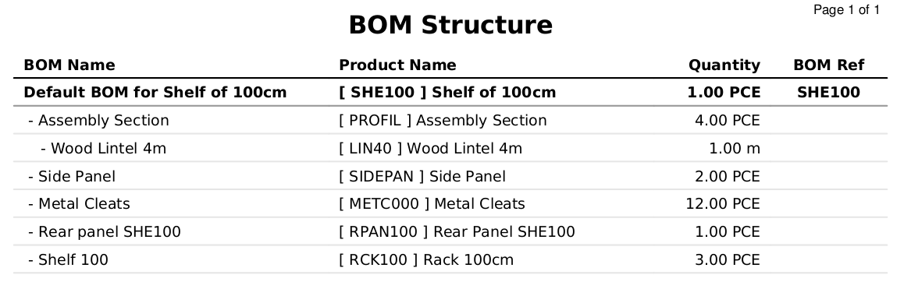
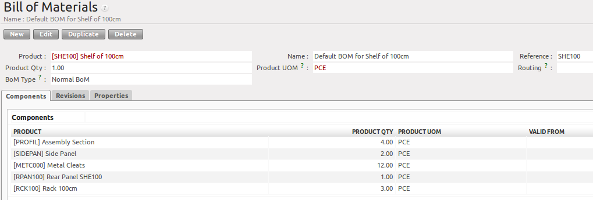
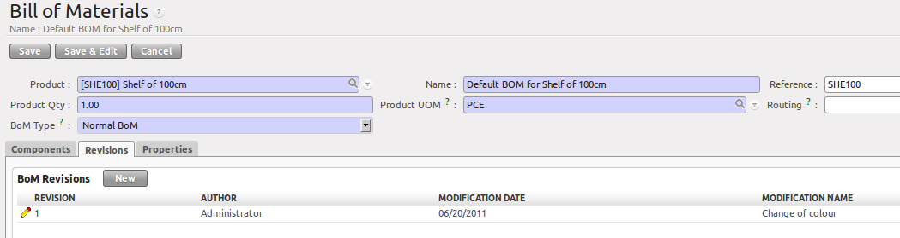
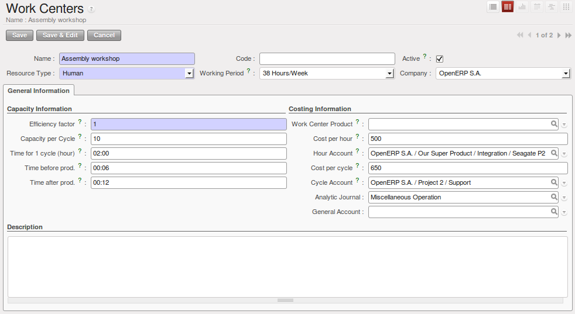
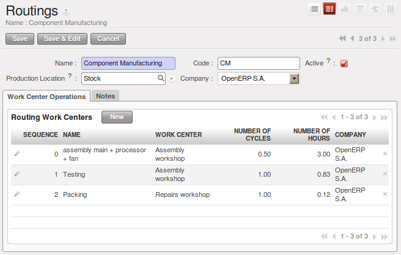

.. i18n: Bill of Materials and Components
.. i18n: ================================
..

物料清单(BOM)和部件
================================

.. i18n: Using Bills of Materials
.. i18n: ------------------------
..

使用 BOM
------------------------

.. i18n: Bills of Materials are documents that describe the list of raw materials used to make a finished
.. i18n: product. To illustrate the concept of specification, you will work on a shelf (or cabinet) where the
.. i18n: manufacturing plan is given by the figure :ref:`fig-mrparm2`.
..

物料清单(Bill of Materials)是用来列举制造一个成品所需要的原材料列表。
为了解释本章节的内容，你会生产一个生产计划指定的书架(或橱柜)。 :ref:`fig-mrparm2`.

.. i18n: .. _fig-mrparm2:
.. i18n: 
.. i18n: .. figure:: images/mrp_armoire.png
.. i18n:    :scale: 75
.. i18n:    :align: center
.. i18n: 
.. i18n:    *Plan of Construction of a Shelf*
..

.. _fig-mrparm2:

.. figure:: images/mrp_armoire.png
   :scale: 75
   :align: center

   *Plan of Construction of a Shelf*

.. i18n: The shelf is assembled from raw materials and intermediate assemblies. The Image Code refers to the picture, the Product Reference is the corresponding code in OpenERP.
..

书架由原材料和中间件(intermediate assemblies)组成。图片编码是指图片，产品参考号OpenERP的是相应的代码。

.. i18n: Change the unit of the Wood Lintel 4m (LIN40) product to ``m`` instead of PCE.
..

Change the unit of the Wood Lintel 4m (LIN40) product to ``m`` instead of PCE.

.. i18n: .. table:: Product Definitions before defining Bills of Materials (already defined)
.. i18n: 
.. i18n:    ========== ================= =========================
.. i18n:    Image Code Product Reference Description
.. i18n:    ========== ================= =========================
.. i18n:    ARM100     SHE100            Shelf 100 cm
.. i18n:    PANLAT     SIDEPAN           Side Panel
.. i18n:    PANA100    RPAN100           Rear Panel SHE100
.. i18n:    PROFIL     PROFIL            Assembly Section
.. i18n:    ETA100     RCK100            Rack 100cm
.. i18n:    BOIS002    WOOD002           Wood 2mm
.. i18n:    TAQ000     METC000           Metal Cleats
.. i18n:    LIN40      LIN40             Wood Lintel 4m
.. i18n:    ========== ================= =========================
..

.. table:: Product Definitions before defining Bills of Materials (already defined)

   ========== ================= =========================
   图片编号   产品参考号        描述
   ========== ================= =========================
   ARM100     SHE100            Shelf 100 cm
   PANLAT     SIDEPAN           Side Panel
   PANA100    RPAN100           Rear Panel SHE100
   PROFIL     PROFIL            Assembly Section
   ETA100     RCK100            Rack 100cm
   BOIS002    WOOD002           Wood 2mm
   TAQ000     METC000           Metal Cleats
   LIN40      LIN40             Wood Lintel 4m
   ========== ================= =========================

.. i18n: .. table:: New Products to be created before defining Bill of Materials
.. i18n: 
.. i18n:    ========== ================= =========================
.. i18n:    Image Code Product Reference Description
.. i18n:    ========== ================= =========================
.. i18n:    PLET100    SPAN100           Shelf Panel
.. i18n:    BOIS010    WOOD010           Wood 10mm
.. i18n:    ========== ================= =========================
..

.. table:: New Products to be created before defining Bill of Materials

   ========== ================= =========================
   Image Code Product Reference Description
   ========== ================= =========================
   PLET100    SPAN100           Shelf Panel
   BOIS010    WOOD010           Wood 10mm
   ========== ================= =========================

.. i18n: .. tip:: Copy
.. i18n: 
.. i18n:         To create the above products, duplicate existing ones, such as Side Panel and Wood 2mm, from the Purchase or Sales menu :menuselection:`Purchases --> Products --> Products`.
..

.. tip:: Copy

        To create the above products, duplicate existing ones, such as Side Panel and Wood 2mm, from the Purchase or Sales menu :menuselection:`Purchases --> Products --> Products`.

.. i18n: To describe how this shelf should be assembled, you define a bill of materials for each intermediate product and for the final shelf assembly. These are shown in the tables below. You can start from the demo data and complete them according to the specifications. To create or change a bill of materials, go to :menuselection:`Manufacturing --> Master Data --> Bill of Materials`.
..

为了揭示书架是如何组装的(assembled)，你需要定义每个中间件(intermediate product)的BOM以及最终书架的BOM。
BOM内容在下表中显示。你可以由DEMO数据开始，根据指令完成这些BOM。
新建或者更改BOM(bill of materials)，菜单路径为 :menuselection:`Manufacturing --> Master Data --> Bill of Materials`.

.. i18n: .. table:: Bill of Materials for 1 SHE100 Unit (already defined)
.. i18n: 
.. i18n:    ============  ========  ===============
.. i18n:    Product Ref.  Quantity  Unit of Measure
.. i18n:    ============  ========  ===============
.. i18n:    PROFIL         4        PCE
.. i18n:    SIDEPAN        2        PCE
.. i18n:    METC000       12        PCE
.. i18n:    RPAN100        1        PCE
.. i18n:    RCK100         3        PCE
.. i18n:    ============  ========  ===============
..

.. table:: Bill of Materials for 1 SHE100 Unit (already defined)

   ============  ========  ===============
   Product Ref.  Quantity  Unit of Measure
   ============  ========  ===============
   PROFIL         4        PCE
   SIDEPAN        2        PCE
   METC000       12        PCE
   RPAN100        1        PCE
   RCK100         3        PCE
   ============  ========  ===============

.. i18n: .. table:: Bill of Materials for 1 RCK100 PCE
.. i18n: 
.. i18n:    ============  ========  ===============
.. i18n:    Product Code  Quantity  Unit of Measure
.. i18n:    ============  ========  ===============
.. i18n:    SPAN100       1         PCE
.. i18n:    METC000       4         PCE
.. i18n:    ============  ========  ===============
..

.. table:: Bill of Materials for 1 RCK100 PCE

   ============  ========  ===============
   Product Code  Quantity  Unit of Measure
   ============  ========  ===============
   SPAN100       1         PCE
   METC000       4         PCE
   ============  ========  ===============

.. i18n: .. table:: Bill of Materials for 1 SPAN100 PCE
.. i18n: 
.. i18n:    ============  ========  ===============
.. i18n:    Product Code  Quantity  Unit of Measure
.. i18n:    ============  ========  ===============
.. i18n:    WOOD010       0.083     m
.. i18n:    ============  ========  ===============
..

.. table:: Bill of Materials for 1 SPAN100 PCE

   ============  ========  ===============
   Product Code  Quantity  Unit of Measure
   ============  ========  ===============
   WOOD010       0.083     m
   ============  ========  ===============

.. i18n: .. table:: Bill of Materials for 1 PROFIL PCE
.. i18n: 
.. i18n:    ============  ========  ===============
.. i18n:    Product Code  Quantity  Unit of Measure
.. i18n:    ============  ========  ===============
.. i18n:    LIN40         0.25      m
.. i18n:    ============  ========  ===============
..

.. table:: Bill of Materials for 1 PROFIL PCE

   ============  ========  ===============
   Product Code  Quantity  Unit of Measure
   ============  ========  ===============
   LIN40         0.25      m
   ============  ========  ===============

.. i18n: .. table:: Bill of Materials for 1 RPAN100 PCE
.. i18n: 
.. i18n:    ============  ========  ===============
.. i18n:    Product Code  Quantity  Unit of Measure
.. i18n:    ============  ========  ===============
.. i18n:    WOOD002       0.25      m
.. i18n:    ============  ========  ===============
..

.. table:: Bill of Materials for 1 RPAN100 PCE

   ============  ========  ===============
   Product Code  Quantity  Unit of Measure
   ============  ========  ===============
   WOOD002       0.25      m
   ============  ========  ===============

.. i18n: .. table:: Bill of Materials for 1 SIDEPAN PCE
.. i18n: 
.. i18n:    ============  ========  ===============
.. i18n:    Product Code  Quantity  Unit of Measure
.. i18n:    ============  ========  ===============
.. i18n:    WOOD002       0.083     m
.. i18n:    ============  ========  ===============
..

.. table:: Bill of Materials for 1 SIDEPAN PCE

   ============  ========  ===============
   Product Code  Quantity  Unit of Measure
   ============  ========  ===============
   WOOD002       0.083     m
   ============  ========  ===============

.. i18n: The bills of materials are then used by the software to calculate the raw material needs based on the
.. i18n: requirements of the finished products. So if you want to manufacture 10 shelves, the system can
.. i18n: calculate the actual products that will be consumed:
..

物料清单被系统用来，根据成品的需求，计算原材料的物料需求。
如果你想制作10个书架，系统会计算出实际会消耗的原材料数量：

.. i18n: .. table:: Total Quantities per Shelf
.. i18n: 
.. i18n:    ============  =========================  ===============
.. i18n:    Product Code  Quantity                   Unit of Measure
.. i18n:    ============  =========================  ===============
.. i18n:    WOOD002       0.416 (2 * 0.083 + 0.25)   m
.. i18n:    LIN40         1 (4 * 0.25)               m
.. i18n:    WOOD010       0.249 (0.083 * 3)          m
.. i18n:    METC000       132 ((3 * 4) + (10 * 12))  PCE
.. i18n:    ============  =========================  ===============
..

.. table:: Total Quantities per Shelf

   ============  =========================  ===============
   Product Code  Quantity                   Unit of Measure
   ============  =========================  ===============
   WOOD002       0.416 (2 * 0.083 + 0.25)   m
   LIN40         1 (4 * 0.25)               m
   WOOD010       0.249 (0.083 * 3)          m
   METC000       132 ((3 * 4) + (10 * 12))  PCE
   ============  =========================  ===============

.. i18n: .. tip:: Bill of Materials
.. i18n: 
.. i18n:    To see the bill of materials in tree view, use the menu :menuselection:`Manufacturing -->
.. i18n:    Master Data --> Bill of Materials` then select the product and click the action `BOM Structure`.
..

.. tip:: Bill of Materials

   To see the bill of materials in tree view, use the menu :menuselection:`Manufacturing -->
   Master Data --> Bill of Materials` then select the product and click the action `BOM Structure`.

.. i18n: .. figure:: images/mrp_bom_tree_new.png
.. i18n:    :scale: 65
.. i18n:    :align: center
.. i18n: 
.. i18n:    *Bill of Materials structure*
..

   *Bill of Materials structure*

.. i18n: Use the menu :menuselection:`Manufacturing --> Master Data --> Bill of Materials`
.. i18n: and click the `New` button to define a new bill of materials.
..

Use the menu :menuselection:`Manufacturing --> Master Data --> Bill of Materials`
and click the `New` button to define a new bill of materials.

.. i18n: .. tip:: The Different Views
.. i18n: 
.. i18n:     To change the view in the bill of materials you can:
.. i18n: 
.. i18n:     * From the list, select a bill of materials name and then click :guilabel:`Form View`,
.. i18n: 
.. i18n:     * From a product form, use the menu :guilabel:`Product BoM Structure` to the right.
..

.. tip:: The Different Views

    To change the view in the bill of materials you can:

    * From the list, select a bill of materials name and then click :guilabel:`Form View`,

    * From a product form, use the menu :guilabel:`Product BoM Structure` to the right.

.. i18n: .. figure:: images/mrp_bom_new.png
.. i18n:    :scale: 75
.. i18n:    :align: center
.. i18n: 
.. i18n:    *Defining a Bill of Materials (Extended view)*
..

   *Defining a Bill of Materials (Extended view)*

.. i18n: In the ``Product`` field of the bill of materials, you should set the finished product, which will be
.. i18n: manufactured or assembled. Once the product has been selected, OpenERP automatically completes the
.. i18n: name of the bill of materials and the default Unit of Measure for this product.
..

在物料清单页面的 ``产品`` 字段，你需要填写成品料号，即最终生产完工的产成品。
一旦料号呗选择，OpenERP自动填入物料清单的名字，以及产品的主单位(UOM)。

.. i18n: The type of BoM (:guilabel:`BoM Type` : ``Sets/Phantom`` or ``Normal BoM``) and
.. i18n: the :guilabel:`Routing` field will be described in more detail later in the chapter.
..

BOM的类型 (:guilabel:`BoM Type` : ``Sets/Phantom`` or ``Normal BoM``) 及 :guilabel:`routing` field ，会在后续章节解释。

.. i18n: Now you can select the raw materials (``Components``) that are used to manufacture the finished
.. i18n: product. The quantities are set out based on the quantities of finished product and the quantities needed to produce them from the bill of materials.
..

现在你可以选择最终用来生产成品的原材料 (``Components``) 。
The quantities are set out based on the quantities of finished product and the quantities needed to produce them from the bill of materials.

.. i18n: .. index::
.. i18n:    single: BoM; revisions
..

.. index::
   single: BoM; revisions

.. i18n: The second tab, :guilabel:`Revisions`, is used to register all the changes made to the bill of materials. On each change, you can specify a revision number and some notes on the modifications you carried out.
..

第二个标签页, :guilabel:`Revisions`, 用来记录该BOM的所有更改信息。 在每次更改BOM的时候，你需要指定一个新的版本号，同时填写本次BOM更改的内容描述。

.. i18n: .. note:: Simplified View
.. i18n: 
.. i18n:    The `Revisions` tab is only visible if the user works in the ``Extended`` view mode
.. i18n:    (which means that the user should belong to the group ``Useability / Extended View`` .
..

.. note:: Simplified View

   The `Revisions` tab is only visible if the user works in the ``Extended`` view mode
   (which means that the user should belong to the group ``Useability / Extended View`` .

.. i18n: .. figure:: images/mrp_bom_revision_new.png
.. i18n:    :scale: 75
.. i18n:    :align: center
.. i18n: 
.. i18n:    *Revisions of a Bill of Materials (Extended view)*
..

   *Revisions of a Bill of Materials (Extended view)*

.. i18n: In the third tab, :guilabel:`Properties`, you can put a free text reference to a plan,
.. i18n: a sequence number that is used to determine the priorities between bills of materials, dates between which a bill of materials
.. i18n: is valid, and values for rounding and production efficiency.
..

In the third tab, :guilabel:`Properties`, you can put a free text reference to a plan,
a sequence number that is used to determine the priorities between bills of materials, dates between which a bill of materials
is valid, and values for rounding and production efficiency.

.. i18n: .. figure:: images/mrp_bom_properties.png
.. i18n:    :scale: 75
.. i18n:    :align: center
.. i18n: 
.. i18n:    *Properties of a Bill of Materials*
..

.. figure:: images/mrp_bom_properties.png
   :scale: 75
   :align: center

   *Properties of a Bill of Materials*

.. i18n: :guilabel:`Rounding` is used to set the smallest :guilabel:`Unit of Measure`
.. i18n: in which the quantities of the selected product can be expressed. So if you set the rounding to 1.00, you will not be able to manufacture half a piece. The :guilabel:`Efficiency` of the product lets you indicate the percentage you lose during manufacturing. This loss
.. i18n: can be defined for the finished product or for each raw materials (components) line. The impact of this efficiency figure is that OpenERP will reserve more raw materials for manufacturing than you would otherwise use just from the Bill of Materials calculations.
..

:guilabel:`Rounding` is used to set the smallest :guilabel:`Unit of Measure`
in which the quantities of the selected product can be expressed. So if you set the rounding to 1.00, you will not be able to manufacture half a piece. The :guilabel:`Efficiency` of the product lets you indicate the percentage you lose during manufacturing. This loss
can be defined for the finished product or for each raw materials (components) line. The impact of this efficiency figure is that OpenERP will reserve more raw materials for manufacturing than you would otherwise use just from the Bill of Materials calculations.

.. i18n: The final part of the third tab lets you set some properties for the product's manufacturing processes. These will be detailed further on in the chapter in the section about configurable products.
..

The final part of the third tab lets you set some properties for the product's manufacturing processes. These will be detailed further on in the chapter in the section about configurable products.

.. i18n: .. index::
.. i18n:    single: BoM; multi-level
.. i18n:    single: multi-level BoM
..

.. index::
   single: BoM; multi-level
   single: multi-level BoM

.. i18n: Multi-level Bills of Materials
.. i18n: ------------------------------
..

多层次BOM
------------------------------

.. i18n: In OpenERP, each line of a bill of materials may itself be a bill of materials. This allows you to define BoMs with several levels. Instead of defining several BoMs for the shelf in the figure :ref:`fig-mrparm2`, you could define the single bill of materials below:
..

在OpenERP中，物料清单(Bill of materials)的每一行(物料)可能自己就是一个BOM。
这就允许你将BOM定义为多层的(several levels)
Instead of defining several BoMs for the shelf in the figure :ref:`fig-mrparm2`, you could define the single bill of materials below:

.. i18n: .. table:: Single Bill of Materials for 1 SHE100 Unit
.. i18n: 
.. i18n:    ============  ========  ===============
.. i18n:    Product Ref.  Quantity  Unit of Measure
.. i18n:    ============  ========  ===============
.. i18n:    SHE100        1         PCE
.. i18n:    SIDEPAN       2         PCE
.. i18n:    WOOD002       0.166     m
.. i18n:    RPAN100       1         PCE
.. i18n:    WOOD002       0.25      m
.. i18n:    PROFIL        4         PCE
.. i18n:    LIN40         1         m
.. i18n:    RCK100        3         PCE
.. i18n:    SPAN100       3         PCE
.. i18n:    WOOD010       0.249     m
.. i18n:    METC000       132       PCE
.. i18n:    ============  ========  ===============
..

.. table:: Single Bill of Materials for 1 SHE100 Unit

   ============  ========  ===============
   Product Ref.  Quantity  Unit of Measure
   ============  ========  ===============
   SHE100        1         PCE
   SIDEPAN       2         PCE
   WOOD002       0.166     m
   RPAN100       1         PCE
   WOOD002       0.25      m
   PROFIL        4         PCE
   LIN40         1         m
   RCK100        3         PCE
   SPAN100       3         PCE
   WOOD010       0.249     m
   METC000       132       PCE
   ============  ========  ===============

.. i18n: OpenERP behaves differently depending on whether the bill of materials is defined in several small
.. i18n: BoMs each on a single level or in one BoM tree-structured on several levels.
..

OpenERP behaves differently depending on whether the bill of materials is defined in several small
BoMs each on a single level or in one BoM tree-structured on several levels.

.. i18n: If you select a BoM using intermediate products that automatically generates production orders
.. i18n: based on calculated requirements, OpenERP will propose to manufacture an intermediate product. To
.. i18n: manufacture a shelf according to the different bills of materials defined, you would create 6 production orders:
..

If you select a BoM using intermediate products that automatically generates production orders
based on calculated requirements, OpenERP will propose to manufacture an intermediate product. To
manufacture a shelf according to the different bills of materials defined, you would create 6 production orders:

.. i18n: .. table:: Production Order
.. i18n: 
.. i18n:    ============  ========  ===============
.. i18n:    Product Ref.  Quantity  Unit of Measure
.. i18n:    ============  ========  ===============
.. i18n:    SPAN100       3         PCE
.. i18n:    WOOD010       0.249     m
.. i18n:    ============  ========  ===============
..

.. table:: Production Order

   ============  ========  ===============
   Product Ref.  Quantity  Unit of Measure
   ============  ========  ===============
   SPAN100       3         PCE
   WOOD010       0.249     m
   ============  ========  ===============

.. i18n: .. table:: Production Order
.. i18n: 
.. i18n:    ============  ========  ===============
.. i18n:    Product Ref.  Quantity  Unit of Measure
.. i18n:    ============  ========  ===============
.. i18n:    RCK100        3         PCE
.. i18n:    SPAN100       3         PCE
.. i18n:    METC000       12        PCE
.. i18n:    ============  ========  ===============
..

.. table:: Production Order

   ============  ========  ===============
   Product Ref.  Quantity  Unit of Measure
   ============  ========  ===============
   RCK100        3         PCE
   SPAN100       3         PCE
   METC000       12        PCE
   ============  ========  ===============

.. i18n: .. table:: Production Order
.. i18n: 
.. i18n:    ============  ========  ===============
.. i18n:    Product Ref.  Quantity  Unit of Measure
.. i18n:    ============  ========  ===============
.. i18n:    PROFIL        4         PCE
.. i18n:    LIN40         1         m
.. i18n:    ============  ========  ===============
..

.. table:: Production Order

   ============  ========  ===============
   Product Ref.  Quantity  Unit of Measure
   ============  ========  ===============
   PROFIL        4         PCE
   LIN40         1         m
   ============  ========  ===============

.. i18n: .. table:: Production Order
.. i18n: 
.. i18n:    ============  ========  ===============
.. i18n:    Product Ref.  Quantity  Unit of Measure
.. i18n:    ============  ========  ===============
.. i18n:    RPAN100       1         PCE
.. i18n:    WOOD002       0.25      m
.. i18n:    ============  ========  ===============
..

.. table:: Production Order

   ============  ========  ===============
   Product Ref.  Quantity  Unit of Measure
   ============  ========  ===============
   RPAN100       1         PCE
   WOOD002       0.25      m
   ============  ========  ===============

.. i18n: .. table:: Production Order
.. i18n: 
.. i18n:    ============  ========  ===============
.. i18n:    Product Ref.  Quantity  Unit of Measure
.. i18n:    ============  ========  ===============
.. i18n:    SIDEPAN       2         PCE
.. i18n:    WOOD002       0.17      m
.. i18n:    ============  ========  ===============
..

.. table:: Production Order

   ============  ========  ===============
   Product Ref.  Quantity  Unit of Measure
   ============  ========  ===============
   SIDEPAN       2         PCE
   WOOD002       0.17      m
   ============  ========  ===============

.. i18n: .. table:: Production Order
.. i18n: 
.. i18n:    ============  ========  ===============
.. i18n:    Product Ref.  Quantity  Unit of Measure
.. i18n:    ============  ========  ===============
.. i18n:    SHE100         1        PCE
.. i18n:    SIDEPAN        2        PCE
.. i18n:    RPAN100        1        PCE
.. i18n:    PROFIL         4        PCE
.. i18n:    RCK100         3        PCE
.. i18n:    METC000       12        PCE
.. i18n:    ============  ========  ===============
..

.. table:: Production Order

   ============  ========  ===============
   Product Ref.  Quantity  Unit of Measure
   ============  ========  ===============
   SHE100         1        PCE
   SIDEPAN        2        PCE
   RPAN100        1        PCE
   PROFIL         4        PCE
   RCK100         3        PCE
   METC000       12        PCE
   ============  ========  ===============

.. i18n: In the case where a single bill of materials is defined in multiple levels, a single manufacturing
.. i18n: order will be generated for each shelf, including all of the sub BoMs. You would then get the
.. i18n: following production order:
..

In the case where a single bill of materials is defined in multiple levels, a single manufacturing
order will be generated for each shelf, including all of the sub BoMs. You would then get the
following production order:

.. i18n: .. table:: Single Production from a tree-structured BoM
.. i18n: 
.. i18n:    ============  ========  ===============
.. i18n:    Product Ref.  Quantity  Unit of Measure
.. i18n:    ============  ========  ===============
.. i18n:    SHE100        1         PCE
.. i18n:    WOOD002       0.17      m
.. i18n:    WOOD002       0.25      m
.. i18n:    LIN40         1         m
.. i18n:    WOOD010       0.249     m
.. i18n:    METC000       132       PCE
.. i18n:    ============  ========  ===============
..

.. table:: Single Production from a tree-structured BoM

   ============  ========  ===============
   Product Ref.  Quantity  Unit of Measure
   ============  ========  ===============
   SHE100        1         PCE
   WOOD002       0.17      m
   WOOD002       0.25      m
   LIN40         1         m
   WOOD010       0.249     m
   METC000       132       PCE
   ============  ========  ===============

.. i18n: .. index::
.. i18n:    pair: phantom; bill of materials
..

.. index::
   pair: phantom; bill of materials

.. i18n: Phantom Bills of Materials
.. i18n: --------------------------
..

虚拟件BOM
--------------------------

.. i18n: If a finished product is defined using intermediate products that are themselves defined using other
.. i18n: BoMs, OpenERP will propose to manufacture each intermediate product. This will result in several production orders. If you only want a single production order, you can define a single BoM with several levels.
..

If a finished product is defined using intermediate products that are themselves defined using other
BoMs, OpenERP will propose to manufacture each intermediate product. This will result in several production orders. If you only want a single production order, you can define a single BoM with several levels.

.. i18n: Sometimes, however, it may be useful to define the intermediate product separately and not as part of a multi-level assembly, even if you do not want separate production orders for intermediate products.
..

Sometimes, however, it may be useful to define the intermediate product separately and not as part of a multi-level assembly, even if you do not want separate production orders for intermediate products.

.. i18n: In the example, the intermediate product ``RCK100`` is used in the manufacturing of different shelves (SHE100, SHE200, ...). So you would prefer to define a unique BoM for it, even though you do not want any instances of this product to be built, nor would you want to rewrite these elements in a series of different multi-level BoMs.
..

In the example, the intermediate product ``RCK100`` is used in the manufacturing of different shelves (SHE100, SHE200, ...). So you would prefer to define a unique BoM for it, even though you do not want any instances of this product to be built, nor would you want to rewrite these elements in a series of different multi-level BoMs.

.. i18n: If you only want a single production order for the complete shelf, and not one for the BoM itself, you
.. i18n: can define the BoM line corresponding to product ``RCK100`` in the shelf's BoM as type :guilabel:`Sets/Phantom`. Then OpenERP will automatically put ``RCK100``'s BoM contents into the shelf's production order, even though it has been defined as multi-level.
..

If you only want a single production order for the complete shelf, and not one for the BoM itself, you
can define the BoM line corresponding to product ``RCK100`` in the shelf's BoM as type :guilabel:`Sets/Phantom`. Then OpenERP will automatically put ``RCK100``'s BoM contents into the shelf's production order, even though it has been defined as multi-level.

.. i18n: This way of representing the assembly is very useful, because it allows you to define reusable assembly elements and keep them isolated.
..

This way of representing the assembly is very useful, because it allows you to define reusable assembly elements and keep them isolated.

.. i18n: If you define the BoM for the ``SHE100`` shelf in the way shown by the table below, you will get two production orders on confirmation of a sales order, as also shown in the tables.
..

If you define the BoM for the ``SHE100`` shelf in the way shown by the table below, you will get two production orders on confirmation of a sales order, as also shown in the tables.

.. i18n: .. table:: Defining and Using Phantom BoMs
.. i18n: 
.. i18n:    ============  ========  ===============  ===========
.. i18n:    Product Ref.  Quantity  Unit of Measure  Type of BoM
.. i18n:    ============  ========  ===============  ===========
.. i18n:    SHE100        1         PCE              normal
.. i18n:    SIDEPAN       2         PCE              normal
.. i18n:    RPAN100       1         PCE              phantom
.. i18n:    PROFIL        4         PCE              phantom
.. i18n:    RCK100        3         PCE              phantom
.. i18n:    ============  ========  ===============  ===========
..

.. table:: Defining and Using Phantom BoMs

   ============  ========  ===============  ===========
   Product Ref.  Quantity  Unit of Measure  Type of BoM
   ============  ========  ===============  ===========
   SHE100        1         PCE              normal
   SIDEPAN       2         PCE              normal
   RPAN100       1         PCE              phantom
   PROFIL        4         PCE              phantom
   RCK100        3         PCE              phantom
   ============  ========  ===============  ===========

.. i18n: .. table:: Production Order from Phantom BoMs
.. i18n: 
.. i18n:    ============  ========  ===============
.. i18n:    Product Ref.  Quantity  Unit of Measure
.. i18n:    ============  ========  ===============
.. i18n:    SHE100        1         PCE
.. i18n:    SIDEPAN       2         PCE
.. i18n:    WOOD002       0.25      m
.. i18n:    LIN40         1         m
.. i18n:    WOOD010       0.249     m
.. i18n:    METC000       12        PCE
.. i18n:    ============  ========  ===============
..

.. table:: Production Order from Phantom BoMs

   ============  ========  ===============
   Product Ref.  Quantity  Unit of Measure
   ============  ========  ===============
   SHE100        1         PCE
   SIDEPAN       2         PCE
   WOOD002       0.25      m
   LIN40         1         m
   WOOD010       0.249     m
   METC000       12        PCE
   ============  ========  ===============

.. i18n: .. table:: Production Order from Normal BoM
.. i18n: 
.. i18n:    ============  ========  ===============
.. i18n:    Product Ref.  Quantity  Unit of Measure
.. i18n:    ============  ========  ===============
.. i18n:    SIDEPAN       2         PCE
.. i18n:    WOOD002       0.17      m
.. i18n:    ============  ========  ===============
..

.. table:: Production Order from Normal BoM

   ============  ========  ===============
   Product Ref.  Quantity  Unit of Measure
   ============  ========  ===============
   SIDEPAN       2         PCE
   WOOD002       0.17      m
   ============  ========  ===============

.. i18n: Bills of Materials for Kits/Sets
.. i18n: --------------------------------
..

用于套件/套装的BOM
--------------------------------

.. i18n: .. note:: Sales Bills of Materials
.. i18n: 
.. i18n:     In other software, this is sometimes called a Sales Bill of Materials.
.. i18n:     In OpenERP, the term Kits/Sets is used, because the effect of the bill of materials is visible not
.. i18n:     only in sales, but also elsewhere, for example, in the intermediate manufactured products.
..

.. note:: Sales Bills of Materials

    In other software, this is sometimes called a Sales Bill of Materials.
    In OpenERP, the term Kits/Sets is used, because the effect of the bill of materials is visible not
    only in sales, but also elsewhere, for example, in the intermediate manufactured products.

.. i18n: Kits/Sets bills of materials enable you to define assemblies that will be sold directly. These could also be used in deliveries and stock management rather than just sold separately. For example, if you deliver the shelf in pieces for self-assembly, set the ``SHE100`` BoM to type
.. i18n: ``Sets / Phantom``.
..

Kits/Sets bills of materials enable you to define assemblies that will be sold directly. These could also be used in deliveries and stock management rather than just sold separately. For example, if you deliver the shelf in pieces for self-assembly, set the ``SHE100`` BoM to type
``Sets / Phantom``.

.. i18n: When a salesperson creates an order for a ``SHE100`` product, OpenERP automatically changes the ``SHE100``
.. i18n: from a set of components into an identifiable package for sending to a customer.
.. i18n: Then it asks the storesperson to pack 2 ``SIDEPAN``, 1 ``RPAN100``, 4 ``PROFIL``, 3 ``RCK100``.
.. i18n: This is described as a ``SHE100``, not just the individual products delivered.
..

When a salesperson creates an order for a ``SHE100`` product, OpenERP automatically changes the ``SHE100``
from a set of components into an identifiable package for sending to a customer.
Then it asks the storesperson to pack 2 ``SIDEPAN``, 1 ``RPAN100``, 4 ``PROFIL``, 3 ``RCK100``.
This is described as a ``SHE100``, not just the individual products delivered.

.. i18n: Work Centers
.. i18n: ============
..

工作中心
============

.. i18n: Work centers represent units of production, capable of doing material transformation operations. You can distinguish two types of work centers: machines and human resources.
..

Work centers represent units of production, capable of doing material transformation operations. You can distinguish two types of work centers: machines and human resources.

.. i18n: .. note:: Work Center
.. i18n: 
.. i18n:     Work centers are units of production consisting of one or several people and/or machines
.. i18n:     that can be considered as a unit for the purpose of forecasting capacity and planning.
..

.. note:: 工作中心

    Work centers are units of production consisting of one or several people and/or machines
    that can be considered as a unit for the purpose of forecasting capacity and planning.

.. i18n: Use the menu :menuselection:`Manufacturing --> Configuration --> Resources --> Work Centers` to define a new work center. You get a form as shown in the figure :ref:`fig-mrpwkc2`.
..

Use the menu :menuselection:`Manufacturing --> Configuration --> Resources --> Work Centers` to define a new work center. You get a form as shown in the figure :ref:`fig-mrpwkc2`.

.. i18n: .. _fig-mrpwkc2:
.. i18n: 
.. i18n: .. figure:: images/mrp_workcenter.png
.. i18n:    :scale: 75
.. i18n:    :align: center
.. i18n: 
.. i18n:    *Defining a Work Center*
.. i18n:    
.. i18n: .. tip:: Missing fields
.. i18n: 
.. i18n:         If some fields such as :guilabel:`Analytic Journal, General Account` in the view are missing, you have
.. i18n:         to add the user group ``Useability / Analytic Accounting``.
..

.. _fig-mrpwkc2:

   *Defining a Work Center*
   
.. tip:: Missing fields

        If some fields such as :guilabel:`Analytic Journal, General Account` in the view are missing, you have
        to add the user group ``Useability / Analytic Accounting``.

.. i18n: A work center should have a name. You then assign a type: Machine or Human, a code and
.. i18n: the operating hours, i.e. ``Working Period``. The Working Time(s) can be defined through the menu :menuselection:`Manufacturing --> Configuration --> Resources --> Working Time`. The figure :ref:`fig-mrpwkc2` represents the hours from Monday
.. i18n: to Friday, from 08:00 to 18:00 with a break of an hour from 12:00.
..

A work center should have a name. You then assign a type: Machine or Human, a code and
the operating hours, i.e. ``Working Period``. The Working Time(s) can be defined through the menu :menuselection:`Manufacturing --> Configuration --> Resources --> Working Time`. The figure :ref:`fig-mrpwkc2` represents the hours from Monday
to Friday, from 08:00 to 18:00 with a break of an hour from 12:00.

.. i18n: You can also add a description of the work center and its operations.
..

You can also add a description of the work center and its operations.

.. i18n: Once the work center is defined, you should enter data about its production capacity.
.. i18n: Depending on whether you have a machine or a person, a work center will be defined in cycles or hours. If it represents a set of machines and people you can use cycles and hours at the same time.
..

Once the work center is defined, you should enter data about its production capacity.
Depending on whether you have a machine or a person, a work center will be defined in cycles or hours. If it represents a set of machines and people you can use cycles and hours at the same time.

.. i18n: .. index::
.. i18n:    single: work center, cycle
..

.. index::
   single: work center, cycle

.. i18n: .. note:: A Cycle
.. i18n: 
.. i18n:     A cycle corresponds to the time required to carry out an assembly operation.
.. i18n:     The user is free to determine which is the reference operation for a given work center.
.. i18n:     It should be represented by the cost and elapsed manufacturing time.
.. i18n: 
.. i18n:     For example, for a printing work center, a cycle might be the printing of 1 page or of 1000 pages
.. i18n:     depending on the printer.
..

.. note:: A Cycle

    A cycle corresponds to the time required to carry out an assembly operation.
    The user is free to determine which is the reference operation for a given work center.
    It should be represented by the cost and elapsed manufacturing time.

    For example, for a printing work center, a cycle might be the printing of 1 page or of 1000 pages
    depending on the printer.

.. i18n: To define the capacity properly, it is necessary to know, for each work center, what will be the
.. i18n: reference operation which determines the cycle. You can then define the data relative to the capacity.
..

To define the capacity properly, it is necessary to know, for each work center, what will be the
reference operation which determines the cycle. You can then define the data relative to the capacity.

.. i18n: `Capacity per Cycle` (CA): the number of operations that can be done in parallel during a
.. i18n: cycle. Generally, the number defines the number of identical machines or people defined by the
.. i18n: work center.
..

`Capacity per Cycle` (CA): the number of operations that can be done in parallel during a
cycle. Generally, the number defines the number of identical machines or people defined by the
work center.

.. i18n: `Time for 1 cycle (hour)` (TC): the duration in hours for one cycle or the operations defined by a cycle.
..

`Time for 1 cycle (hour)` (TC): the duration in hours for one cycle or the operations defined by a cycle.

.. i18n: `Time before production` (TS): the time in hours required to initialize production operations. Generally,
.. i18n: this represents the machine setup time.
..

`Time before production` (TS): the time in hours required to initialize production operations. Generally,
this represents the machine setup time.

.. i18n: `Time after production` (TN): the delay in hours after the end of a production operation. Generally, this represents the cleaning time necessary after an operation.
..

`Time after production` (TN): the delay in hours after the end of a production operation. Generally, this represents the cleaning time necessary after an operation.

.. i18n: `Efficiency factor` (ET): the factor that is applied to the TC, TS and TN times to determine the real production time. This factor enables you to readjust the different times progressively and as a measure of machine utilization. You cannot re-adjust the other times, because generally they are taken from the machine's data sheet. By default, the efficiency is set to 1, representing a load of 100%. When you set the efficiency to 2 (i.e. 200%), the load will be 50%.
..

`Efficiency factor` (ET): the factor that is applied to the TC, TS and TN times to determine the real production time. This factor enables you to readjust the different times progressively and as a measure of machine utilization. You cannot re-adjust the other times, because generally they are taken from the machine's data sheet. By default, the efficiency is set to 1, representing a load of 100%. When you set the efficiency to 2 (i.e. 200%), the load will be 50%.

.. i18n: The total time for carrying out X operations is then given by the following formula:
..

The total time for carrying out X operations is then given by the following formula:

.. i18n: ((X / CA) * TC + TS + TN ) * ET
..

((X / CA) * TC + TS + TN ) * ET

.. i18n: In this formula the result of the division is rounded upwards. Then, if the
.. i18n: capacity per cycle is 6, it takes 3 cycles to realize 15 operations (15/6 = 2.5, rounded upwards = 3).
..

In this formula the result of the division is rounded upwards. Then, if the
capacity per cycle is 6, it takes 3 cycles to realize 15 operations (15/6 = 2.5, rounded upwards = 3).

.. i18n: With the `Hour Account` and `Cycle Account` you define the links to analytical accounting, to report the costs of the work center operations. If you leave the different fields empty, it will not have any effect on the analytic accounts.
..

With the `Hour Account` and `Cycle Account` you define the links to analytical accounting, to report the costs of the work center operations. If you leave the different fields empty, it will not have any effect on the analytic accounts.

.. i18n: Routings
.. i18n: ========
..

工艺路线
========

.. i18n: Routings define the manufacturing operations to be done in work centers to produce a certain product. A routing is usually attached to bills of materials, which will define the assembly of products required for manufacturing or to produce finished products.
..

Routings define the manufacturing operations to be done in work centers to produce a certain product. A routing is usually attached to bills of materials, which will define the assembly of products required for manufacturing or to produce finished products.

.. i18n: A routing can be defined directly in a bill of materials or through the menu :menuselection:`Manufacturing --> Configuration --> Master Bill of Materials --> Routings`. A routing has a name, and a code. You can also add a description. Later in this chapter you will see that a routing can also be associated with a stock location. This enables you to indicate where an assembly takes place.
..

A routing can be defined directly in a bill of materials or through the menu :menuselection:`Manufacturing --> Configuration --> Master Bill of Materials --> Routings`. A routing has a name, and a code. You can also add a description. Later in this chapter you will see that a routing can also be associated with a stock location. This enables you to indicate where an assembly takes place.

.. i18n: .. figure:: images/mrp_routing.png
.. i18n:    :scale: 75
.. i18n:    :align: center
.. i18n: 
.. i18n:    *Defining a routing with Three Operations*
..

   *Defining a routing with Three Operations*

.. i18n: .. note:: Subcontracting Assembly
.. i18n: 
.. i18n:     You will see further on in this chapter that you can also link a routing to a stock location for the customer or the supplier.
.. i18n:     You can use this functionality when you have subcontracted the assembly of a product to a supplier, for instance.
..

.. note:: Subcontracting Assembly

    You will see further on in this chapter that you can also link a routing to a stock location for the customer or the supplier.
    You can use this functionality when you have subcontracted the assembly of a product to a supplier, for instance.

.. i18n: In the routing, you have to enter the list of operations that has to be executed. Each operation has to be done at a specific work center and includes a number of hours and/or cycles.
..

In the routing, you have to enter the list of operations that has to be executed. Each operation has to be done at a specific work center and includes a number of hours and/or cycles.

.. i18n: .. tip:: Multi-level Routing
.. i18n: 
.. i18n:    It is possible to define routing on several levels to support multi-level bills of materials.
.. i18n:    You can select the routing on each level of a bill of materials ( BoM in a BoM can have a different routing).
.. i18n:    The levels are then linked to hierarchies of bills of materials.
..

.. tip:: Multi-level Routing

   It is possible to define routing on several levels to support multi-level bills of materials.
   You can select the routing on each level of a bill of materials ( BoM in a BoM can have a different routing).
   The levels are then linked to hierarchies of bills of materials.

.. i18n: .. Copyright © Open Object Press. All rights reserved.
..

.. Copyright © Open Object Press. All rights reserved.

.. i18n: .. You may take electronic copy of this publication and distribute it if you don't
.. i18n: .. change the content. You can also print a copy to be read by yourself only.
..

.. You may take electronic copy of this publication and distribute it if you don't
.. change the content. You can also print a copy to be read by yourself only.

.. i18n: .. We have contracts with different publishers in different countries to sell and
.. i18n: .. distribute paper or electronic based versions of this book (translated or not)
.. i18n: .. in bookstores. This helps to distribute and promote the OpenERP product. It
.. i18n: .. also helps us to create incentives to pay contributors and authors using author
.. i18n: .. rights of these sales.
..

.. We have contracts with different publishers in different countries to sell and
.. distribute paper or electronic based versions of this book (translated or not)
.. in bookstores. This helps to distribute and promote the OpenERP product. It
.. also helps us to create incentives to pay contributors and authors using author
.. rights of these sales.

.. i18n: .. Due to this, grants to translate, modify or sell this book are strictly
.. i18n: .. forbidden, unless Tiny SPRL (representing Open Object Press) gives you a
.. i18n: .. written authorisation for this.
..

.. Due to this, grants to translate, modify or sell this book are strictly
.. forbidden, unless Tiny SPRL (representing Open Object Press) gives you a
.. written authorisation for this.

.. i18n: .. Many of the designations used by manufacturers and suppliers to distinguish their
.. i18n: .. products are claimed as trademarks. Where those designations appear in this book,
.. i18n: .. and Open Object Press was aware of a trademark claim, the designations have been
.. i18n: .. printed in initial capitals.
..

.. Many of the designations used by manufacturers and suppliers to distinguish their
.. products are claimed as trademarks. Where those designations appear in this book,
.. and Open Object Press was aware of a trademark claim, the designations have been
.. printed in initial capitals.

.. i18n: .. While every precaution has been taken in the preparation of this book, the publisher
.. i18n: .. and the authors assume no responsibility for errors or omissions, or for damages
.. i18n: .. resulting from the use of the information contained herein.
..

.. While every precaution has been taken in the preparation of this book, the publisher
.. and the authors assume no responsibility for errors or omissions, or for damages
.. resulting from the use of the information contained herein.

.. i18n: .. Published by Open Object Press, Grand Rosière, Belgium
..

.. Published by Open Object Press, Grand Rosière, Belgium
