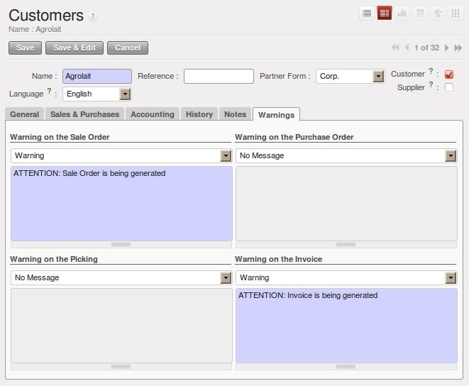
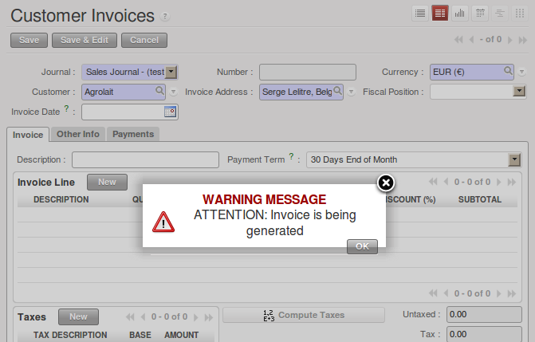

.. i18n: Alerts
.. i18n: ======
..

消息提醒
==========

.. i18n: .. index:: 
.. i18n:    single: warning
.. i18n:    single: alerts
.. i18n:    single: module; warning
..

.. index:: 
   single: warning
   single: alerts
   single: module; warning

.. i18n: To manage alerts on products or partners, you can install the :mod:`warning` module. Once that is
.. i18n: installed, you will be able to configure a series of alerts on the partners or products by
.. i18n: setting parameters in the new :guilabel:`Warnings` tab on each of the forms.
..

通过安装警告消息与预警管理  :mod:`warning`  模块，您可以为业务伙伴和产品设置警告消息。安装之后，可以在业务伙伴或产品的页面上的“警告”  :guilabel:`Warnings`  选项卡上设置参数。

.. i18n: You can select any of the following types of warnings and create different warnings for purchases and for sales:
..

在采购和销售流程里，可以设置以下警告消息类型：

.. i18n: * :guilabel:`No Message`: This option will not display a message.
.. i18n: 
.. i18n: * :guilabel:`Warning`: This option will show the user the message entered.
.. i18n: 
.. i18n: * :guilabel:`Blocking Message`: The message displayed will cause an exception and block the workflow.
..

* :guilabel:`No Message` 无消息: 不显示任何信息。

* :guilabel:`Warning` 警告: 显示您输入的信息。

* :guilabel:`Blocking Message` 阻止: 将抛出一个异常，并停止工作流。

.. i18n: You can activate alerts for a series of events. For each alert, you should enter a message that will
.. i18n: be displayed when the event concerned is started.
..

可以为一系列的事件配置警告消息。相应事件激活后，就会显示您输入的警告信息。

.. i18n: .. figure:: images/warning_partner.png
.. i18n:    :scale: 75
.. i18n:    :align: center
.. i18n: 
.. i18n:    *Management of alerts on partners*
..

   *合作伙伴的警告管理*

.. i18n: The available warnings in the partner form are:
..

合作伙伴可设置的警告消息有:

.. i18n: * Create a warning for a sales order,
.. i18n: 
.. i18n: * Create a warning for a purchase order,
.. i18n: 
.. i18n: * Create a warning for a delivery to a partner (or receiving an item),
.. i18n: 
.. i18n: * Create a warning when invoicing a partner.
..

* 销售订单创建警告,

* 采购订单创建警告,

* 合作伙伴发货创建警告（或接收物料）,

* 为合作伙伴开票创建警告.

.. i18n: For example, if you enter an alert for the invoicing of a customer, for an accountant entering an
.. i18n: invoice for that customer, the alert message will be attached as shown in the figure :ref:`fig-warnsmp`.
..

例如：如果您为某客户开票配置一条警告消息之后，当财务人员为该客户录入发票时，就会看到一条警告消息，如图:ref:“fig-warnsmp”。

.. i18n: .. _fig-warnsmp:
.. i18n: 
.. i18n: .. figure:: images/warning_sample.png
.. i18n:    :scale: 75
.. i18n:    :align: center
.. i18n: 
.. i18n:    *Alert from Invoicing a Customer*
..

.. _fig-warnsmp:

   *为客户开票的警告消息*

.. i18n: .. figure:: images/warning_product.png
.. i18n:    :scale: 75
.. i18n:    :align: center
.. i18n: 
.. i18n:    *Management of Alerts on Products*
..

.. figure:: images/warning_product.png
   :scale: 75
   :align: center

   *产品警告消息配置*

.. i18n: The alerts that can be configured on a product form are related to:
..

产品可设置的警告消息有:

.. i18n: * The sales of that product,
.. i18n: 
.. i18n: * The purchase of that product.
..

* 销售产品,

* 采购产品.

.. i18n: A practical example:
..

一个实际的例子:

.. i18n: Now when could you use such an alert? Suppose that your customer asks you to never make any deliveries on Tuesday morning, because the street is blocked due to a weekly market. You surely would like your transporter to be aware of this, so it could be useful to have a kind of message printed by default on each delivery order for this customer.
.. i18n: To do this, you could create a Warning on the Picking in the **Customer** form of the partner concerned, saying that no deliveries are allowed on Tuesday morning.
..

Now when could you use such an alert? Suppose that your customer asks you to never make any deliveries on Tuesday morning, because the street is blocked due to a weekly market. You surely would like your transporter to be aware of this, so it could be useful to have a kind of message printed by default on each delivery order for this customer.
To do this, you could create a Warning on the Picking in the **Customer** form of the partner concerned, saying that no deliveries are allowed on Tuesday morning.

.. i18n: .. Copyright © Open Object Press. All rights reserved.
..

.. Copyright © Open Object Press. All rights reserved.

.. i18n: .. You may take electronic copy of this publication and distribute it if you don't
.. i18n: .. change the content. You can also print a copy to be read by yourself only.
..

.. You may take electronic copy of this publication and distribute it if you don't
.. change the content. You can also print a copy to be read by yourself only.

.. i18n: .. We have contracts with different publishers in different countries to sell and
.. i18n: .. distribute paper or electronic based versions of this book (translated or not)
.. i18n: .. in bookstores. This helps to distribute and promote the OpenERP product. It
.. i18n: .. also helps us to create incentives to pay contributors and authors using author
.. i18n: .. rights of these sales.
..

.. We have contracts with different publishers in different countries to sell and
.. distribute paper or electronic based versions of this book (translated or not)
.. in bookstores. This helps to distribute and promote the OpenERP product. It
.. also helps us to create incentives to pay contributors and authors using author
.. rights of these sales.

.. i18n: .. Due to this, grants to translate, modify or sell this book are strictly
.. i18n: .. forbidden, unless Tiny SPRL (representing Open Object Press) gives you a
.. i18n: .. written authorisation for this.
..

.. Due to this, grants to translate, modify or sell this book are strictly
.. forbidden, unless Tiny SPRL (representing Open Object Press) gives you a
.. written authorisation for this.

.. i18n: .. Many of the designations used by manufacturers and suppliers to distinguish their
.. i18n: .. products are claimed as trademarks. Where those designations appear in this book,
.. i18n: .. and Open Object Press was aware of a trademark claim, the designations have been
.. i18n: .. printed in initial capitals.
..

.. Many of the designations used by manufacturers and suppliers to distinguish their
.. products are claimed as trademarks. Where those designations appear in this book,
.. and Open Object Press was aware of a trademark claim, the designations have been
.. printed in initial capitals.

.. i18n: .. While every precaution has been taken in the preparation of this book, the publisher
.. i18n: .. and the authors assume no responsibility for errors or omissions, or for damages
.. i18n: .. resulting from the use of the information contained herein.
..

.. While every precaution has been taken in the preparation of this book, the publisher
.. and the authors assume no responsibility for errors or omissions, or for damages
.. resulting from the use of the information contained herein.

.. i18n: .. Published by Open Object Press, Grand Rosière, Belgium
..

.. Published by Open Object Press, Grand Rosière, Belgium
