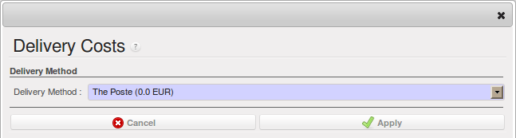

.. i18n: Management of Carriers
.. i18n: ======================
..

运输管理
======================

.. i18n: .. index::
.. i18n:    single: delivery grid
.. i18n:    single: carriers
.. i18n:    single: module; delivery
.. i18n:    single: module; profile_manufacturing
..

.. index::
   single: delivery grid
   single: carriers
   single: module; delivery
   single: module; profile_manufacturing

.. i18n: To manage deliveries in OpenERP, you can install the :mod:`delivery` module.
.. i18n: To do that, use the :guilabel:`Reconfigure` wizard and select :guilabel:`Delivery Costs` under the :guilabel:`Sales Application Configuration` section for installation.
..

为了在OpenERP中管理送货，需要安装 :mod:`delivery` 模块。
使用  :guilabel:`Reconfigure`  重新配置向导然后选择  :guilabel:`Sales Application Configuration` 销售配置下的  :guilabel:`Delivery Costs` 发货安装。

.. i18n: This module enables you to manage:
..

本模块功能：

.. i18n: * the different carriers with whom you work,
.. i18n: 
.. i18n: * the different transport methods,
.. i18n: 
.. i18n: * cost calculation and invoicing of each delivery,
.. i18n: 
.. i18n: * the transport methods and their tariffs.
..

* 管理物流公司

* 管理运输方式

* 发货成本计算及开票

* 运输方式及相关税率（译注：通过产品设置）

.. i18n: Once the :mod:`delivery` module has been installed, the first thing to do is to configure the different
.. i18n: modes of delivery accepted by your company. Go to the menu :menuselection:`Warehouse
.. i18n: --> Configuration --> Delivery --> Delivery Method` to create your company's delivery modes.
..

安装 :mod:`delivery` 模块后，首先要设置送货方式。菜单“仓库->设置->送货 ->送货方式“

.. i18n: For each delivery mode, you should define the following elements:
..

对于每种送货方式，您需要定义以下内容：

.. i18n: * Name of the delivery mode,
.. i18n: 
.. i18n: * The partner associated with the transport (which can be your own company),
.. i18n: 
.. i18n: * The associated product.
..

* 送货方式的名称 

* 物流公司（可以是您的公司）

* 送货产品（服务型产品）

.. i18n: Let's give you an example:
..

举例如下：

.. i18n: .. table:: Example Delivery Modes
.. i18n: 
.. i18n:    ================    ===============   ==========================
.. i18n:    Carrier             Carrier Partner   Delivery Product
.. i18n:    ================    ===============   ==========================
.. i18n:    Express Track       Mail Office       Express Track Delivery
.. i18n:    Priority Courier    Mail Office       Courier Express Delivery
.. i18n:    EFG Standard        EFG Inc           Delivery EFG
.. i18n:    EFG Express         EFG Inc           Delivery EFG Express
.. i18n:    ================    ===============   ==========================
..

.. table:: 送货模式举例

   ================    ===============   ==========================
   运送方式            物流公司          送货产品（服务型产品）
   ================    ===============   ==========================
   Express Track       Mail Office       Express Track Delivery
   Priority Courier    Mail Office       Courier Express Delivery
   EFG Standard        EFG Inc           Delivery EFG
   EFG Express         EFG Inc           Delivery EFG Express
   ================    ===============   ==========================

.. i18n: Information about the invoicing of transport (such as accounts, applicable taxes) is entered in the
.. i18n: product linked to the delivery mode. Ideally the product should be configured with 
.. i18n: :guilabel:`Product Type` ``Service`` and :guilabel:`Procurement Method` ``Make to Stock``.
..

在送货方式链接的产品上输入运输开票的信息（例如帐户、适用税）。理论上，这个 :guilabel:`Product Type` 产品类型设置为服务型，:guilabel:`Procurement Method` 供应方式设置为“按库存生产”。

.. i18n: You can use the same product for several delivery modes. This simplifies the
.. i18n: configuration, but it has the disadvantage that you will not be able to separate your sales figures by delivery mode.
..

您可以在几种送货方式中使用相同的产品。这将简化配置，但其缺点是您不能按发货模式区分销售数据。

.. i18n: Tariff Grids
.. i18n: ------------
..

送货价格表
------------

.. i18n: Unlike ordinary products, delivery prices are not proposed through pricelists but through delivery grids,
.. i18n: designed specifically for this purpose. For each delivery mode, you enter one or several tariff grids.
.. i18n: Each grid is used for a given region/destination.
..

与普通产品不同，运费不是通过价格表（pricelists）计算，而是通过专为此设计的运费表计算。 对于每种送货方式，您可以输入一个或几个资费表。每一个资费表用于一个给定区域或目的地。

.. i18n: For example, for the postal tariffs for Priority Courier, you generally define the three tariff grids
.. i18n: for Mail Office:
..

例如，对于邮费，您通常可以定义三种资费：

.. i18n: * National Courier,
.. i18n: 
.. i18n: * Courier in Europe,
.. i18n: 
.. i18n: * Courier Outside Europe.
..

* 国内邮费,

* 欧洲邮费,

* 其他地区邮费.

.. i18n: To define a new delivery grid, use the menu :menuselection:`Warehouse --> Configuration -->
.. i18n: Delivery --> Delivery Pricelist`. Give a name to your delivery grid and define the
.. i18n: region for which the tariffs in the grid will apply in the second tab
.. i18n: :guilabel:`Destination`. There you can set:
..

To define a new delivery grid, use the menu :menuselection:`Warehouse --> Configuration -->
Delivery --> Delivery Pricelist`. Give a name to your delivery grid and define the
region for which the tariffs in the grid will apply in the second tab
:guilabel:`Destination`. There you can set:

.. i18n: * A list of countries (for UK or Europe, for example),
.. i18n: 
.. i18n: * A list of states,
.. i18n: 
.. i18n: * A range of postal codes (for Paris you might have 75000 – 75900).
..

* A list of countries (for UK or Europe, for example),

* A list of states,

* A range of postal codes (for Paris you might have 75000 – 75900).

.. i18n: Then you have to set the rules for calculating the transport price in the first tab :guilabel:`Grid definition`.
.. i18n: First of all, give the rule a name. Then set the condition for which this rule is applicable, for
.. i18n: example ``Weight < 0.5kg``.
..

Then you have to set the rules for calculating the transport price in the first tab :guilabel:`Grid definition`.
First of all, give the rule a name. Then set the condition for which this rule is applicable, for
example ``Weight < 0.5kg``.

.. i18n: .. note:: Weights
.. i18n: 
.. i18n:    Weights are always expressed in kilograms. You can define a number with a decimal point or comma, so
.. i18n:    to set 500g you would put 0.5 in the weight rule.
..

.. note:: Weights

   Weights are always expressed in kilograms. You can define a number with a decimal point or comma, so
   to set 500g you would put 0.5 in the weight rule.

.. i18n: Next you can set the sales price and the cost price. Prices can be expressed in various ways:
..

Next you can set the sales price and the cost price. Prices can be expressed in various ways:

.. i18n: * a fixed price,
.. i18n: 
.. i18n: * a variable price, as a function of weight, volume, weight x volume or price.
..

* a fixed price,

* a variable price, as a function of weight, volume, weight x volume or price.

.. i18n: For example, mailing within France using current tariffs would be defined as shown in the table below:
..

For example, mailing within France using current tariffs would be defined as shown in the table below:

.. i18n: .. table:: Example Tariff Rules
.. i18n: 
.. i18n:    ==========  =============  =====   =============
.. i18n:    Name        Condition      Price   Price Type
.. i18n:    ==========  =============  =====   =============
.. i18n:    S           Weight < 3 kg  6.90    Fixed
.. i18n:    M           Weight < 5 kg  7.82    Fixed
.. i18n:    L           Weight < 6 kg  8.53    Fixed
.. i18n:    XL          Weight < 7 kg  9.87    Fixed
.. i18n:    ==========  =============  =====   =============
..

.. table:: Example Tariff Rules

   ==========  =============  =====   =============
   Name        Condition      Price   Price Type
   ==========  =============  =====   =============
   S           Weight < 3 kg  6.90    Fixed
   M           Weight < 5 kg  7.82    Fixed
   L           Weight < 6 kg  8.53    Fixed
   XL          Weight < 7 kg  9.87    Fixed
   ==========  =============  =====   =============

.. i18n: You can also define rules that depend on the total amount on the order. For example to offer fixed price
.. i18n: delivery if the total order amount is greater than 150 USD, add the following rule:
..

You can also define rules that depend on the total amount on the order. For example to offer fixed price
delivery if the total order amount is greater than 150 USD, add the following rule:

.. i18n: .. table:: Additional Tariff Rule
.. i18n: 
.. i18n:    ================= ===============  ======   =============
.. i18n:    Name              Condition        Price    Price Type
.. i18n:    ================= ===============  ======   =============
.. i18n:    Franked > 150 USD Price > 150 USD  10       Fixed
.. i18n:    ================= ===============  ======   =============
..

.. table:: Additional Tariff Rule

   ================= ===============  ======   =============
   Name              Condition        Price    Price Type
   ================= ===============  ======   =============
   Franked > 150 USD Price > 150 USD  10       Fixed
   ================= ===============  ======   =============

.. i18n: Delivery Modes
.. i18n: --------------
..

交货方式
--------------

.. i18n: Once the delivery modes and their corresponding tariffs have been defined, you can use them in a Sales Order. 
.. i18n: There are two methods for doing that in OpenERP.
..

Once the delivery modes and their corresponding tariffs have been defined, you can use them in a Sales Order. 
There are two methods for doing that in OpenERP.

.. i18n: * Delivery based on Ordered Quantities,
.. i18n: 
.. i18n: * Delivery based on Shipped Quantities.
..

* Delivery based on Ordered Quantities,

* Delivery based on Shipped Quantities.

.. i18n: Delivery based on Ordered Quantities
.. i18n: ------------------------------------
..

基于订单数量交付
------------------------------------

.. i18n: To add the delivery charges (or transport costs) to the quotation, use the button :guilabel:`Delivery Costs` available on the `Sales Order` tab of the form. A dialog box opens, asking you to select a delivery mode from the list available.
..

To add the delivery charges (or transport costs) to the quotation, use the button :guilabel:`Delivery Costs` available on the `Sales Order` tab of the form. A dialog box opens, asking you to select a delivery mode from the list available.

.. i18n: .. figure:: images/sale_delivery.png
.. i18n:    :scale: 75
.. i18n:    :align: center
.. i18n: 
.. i18n:    *Adding Transport Costs to an Order*
..

   *Adding Transport Costs to an Order*

.. i18n: Once the delivery mode has been selected, OpenERP automatically adds a line to the quotation with
.. i18n: the amount calculated by the delivery function. This technique enables you to calculate the
.. i18n: delivery charge based on the order and then, separately, how the products will really be delivered
.. i18n: to the customer.
..

Once the delivery mode has been selected, OpenERP automatically adds a line to the quotation with
the amount calculated by the delivery function. This technique enables you to calculate the
delivery charge based on the order and then, separately, how the products will really be delivered
to the customer.

.. i18n: If you want to calculate the exact delivery charges depending on the actual deliveries, you must use
.. i18n: invoicing based on deliveries.
..

If you want to calculate the exact delivery charges depending on the actual deliveries, you must use
invoicing based on deliveries.

.. i18n: Delivery based on Shipped Quantities
.. i18n: ------------------------------------
..

基于发货数量交付
------------------------------------

.. i18n: To invoice the delivery according to the items shipped, you set the delivery mode in the
.. i18n: :guilabel:`Delivery Method` field on the second tab of the order, :guilabel:`Other Information`, to :guilabel:`Invoice from Delivery`. 
..

To invoice the delivery according to the items shipped, you set the delivery mode in the
:guilabel:`Delivery Method` field on the second tab of the order, :guilabel:`Other Information`, to :guilabel:`Invoice from Delivery`. 

.. i18n: You can then confirm the order, and when the goods are available you can also validate the delivery order.
..

You can then confirm the order, and when the goods are available you can also validate the delivery order.

.. i18n: The transport costs will not be added to the sales order, but only to the invoice.
.. i18n: When the manager has generated the invoices corresponding to the deliveries carried out,
.. i18n: OpenERP automatically adds a line on each invoice corresponding to the delivery charge, calculated
.. i18n: on the basis of the items actually sent.
..

The transport costs will not be added to the sales order, but only to the invoice.
When the manager has generated the invoices corresponding to the deliveries carried out,
OpenERP automatically adds a line on each invoice corresponding to the delivery charge, calculated
on the basis of the items actually sent.

.. i18n: .. Copyright © Open Object Press. All rights reserved.
..

.. Copyright © Open Object Press. All rights reserved.

.. i18n: .. You may take electronic copy of this publication and distribute it if you don't
.. i18n: .. change the content. You can also print a copy to be read by yourself only.
..

.. You may take electronic copy of this publication and distribute it if you don't
.. change the content. You can also print a copy to be read by yourself only.

.. i18n: .. We have contracts with different publishers in different countries to sell and
.. i18n: .. distribute paper or electronic based versions of this book (translated or not)
.. i18n: .. in bookstores. This helps to distribute and promote the OpenERP product. It
.. i18n: .. also helps us to create incentives to pay contributors and authors using author
.. i18n: .. rights of these sales.
..

.. We have contracts with different publishers in different countries to sell and
.. distribute paper or electronic based versions of this book (translated or not)
.. in bookstores. This helps to distribute and promote the OpenERP product. It
.. also helps us to create incentives to pay contributors and authors using author
.. rights of these sales.

.. i18n: .. Due to this, grants to translate, modify or sell this book are strictly
.. i18n: .. forbidden, unless Tiny SPRL (representing Open Object Press) gives you a
.. i18n: .. written authorisation for this.
..

.. Due to this, grants to translate, modify or sell this book are strictly
.. forbidden, unless Tiny SPRL (representing Open Object Press) gives you a
.. written authorisation for this.

.. i18n: .. Many of the designations used by manufacturers and suppliers to distinguish their
.. i18n: .. products are claimed as trademarks. Where those designations appear in this book,
.. i18n: .. and Open Object Press was aware of a trademark claim, the designations have been
.. i18n: .. printed in initial capitals.
..

.. Many of the designations used by manufacturers and suppliers to distinguish their
.. products are claimed as trademarks. Where those designations appear in this book,
.. and Open Object Press was aware of a trademark claim, the designations have been
.. printed in initial capitals.

.. i18n: .. While every precaution has been taken in the preparation of this book, the publisher
.. i18n: .. and the authors assume no responsibility for errors or omissions, or for damages
.. i18n: .. resulting from the use of the information contained herein.
..

.. While every precaution has been taken in the preparation of this book, the publisher
.. and the authors assume no responsibility for errors or omissions, or for damages
.. resulting from the use of the information contained herein.

.. i18n: .. Published by Open Object Press, Grand Rosière, Belgium
..

.. Published by Open Object Press, Grand Rosière, Belgium
