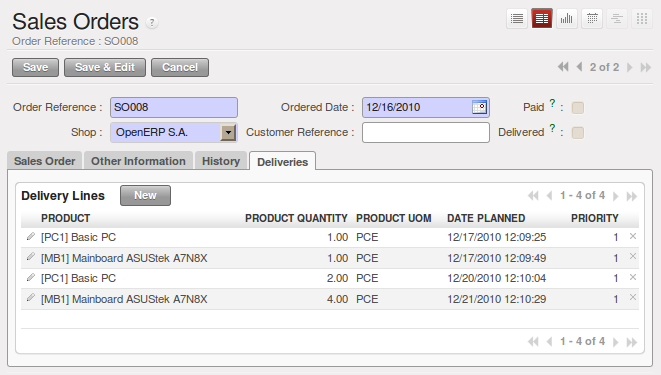

.. i18n: Keeping Track of Open Orders
.. i18n: ============================
..

Keeping Track of Open Orders
============================

.. i18n: .. index::
.. i18n:    single: module; sale_delivery
..

.. index::
   single: module; sale_delivery

.. i18n: In some industries, customers commonly place orders for a certain volume of products and ask for regular
.. i18n: deliveries from an order up to the total amount on it. This principle, called open orders, is managed
.. i18n: by the :mod:`sale_delivery` module in OpenERP.
..

In some industries, customers commonly place orders for a certain volume of products and ask for regular
deliveries from an order up to the total amount on it. This principle, called open orders, is managed
by the :mod:`sale_delivery` module in OpenERP.

.. i18n: OpenERP handles open orders easily. An open order is an order for a
.. i18n: certain quantity of products but whose deliveries are planned for various dates over a period of
.. i18n: time.
..

OpenERP handles open orders easily. An open order is an order for a
certain quantity of products but whose deliveries are planned for various dates over a period of
time.

.. i18n: To do that, you should install the :mod:`sale_delivery` module (in ``extra-addons`` at the time of writing). 
.. i18n: A Sales Order is entered as a normal order, but you also set the total quantity that will be delivered on each order line.
..

To do that, you should install the :mod:`sale_delivery` module (in ``extra-addons`` at the time of writing). 
A Sales Order is entered as a normal order, but you also set the total quantity that will be delivered on each order line.

.. i18n: Then you can use the new tab :guilabel:`Deliveries` on the order to plan the quantities sold and enter your
.. i18n: delivery planning there.
..

Then you can use the new tab :guilabel:`Deliveries` on the order to plan the quantities sold and enter your
delivery planning there.

.. i18n: .. figure:: images/sale_delivery_form.png
.. i18n:    :scale: 75
.. i18n:    :align: center
.. i18n: 
.. i18n:    *Managing Open Orders, Planning Forecasts*
..

   *Managing Open Orders, Planning Forecasts*

.. i18n: In the order lines, OpenERP shows you the quantity planned in addition to the quantity sold. This way, you
.. i18n: can verify whether the quantities sold equal the quantities to be delivered. On confirmation of the sales order, OpenERP no longer generates a single delivery order, but plans scheduled dispatches.
..

In the order lines, OpenERP shows you the quantity planned in addition to the quantity sold. This way, you
can verify whether the quantities sold equal the quantities to be delivered. On confirmation of the sales order, OpenERP no longer generates a single delivery order, but plans scheduled dispatches.

.. i18n: .. tip:: Invoicing Mode
.. i18n: 
.. i18n:    If you work with Open Orders, you should set :guilabel:`Invoice Control` to the mode ``Shipped Quantities``.
.. i18n:    Then the storesperson will be able to re-plan and change the quantities of the forecast deliveries
.. i18n:    in the system.
..

.. tip:: Invoicing Mode

   If you work with Open Orders, you should set :guilabel:`Invoice Control` to the mode ``Shipped Quantities``.
   Then the storesperson will be able to re-plan and change the quantities of the forecast deliveries
   in the system.

.. i18n: .. Copyright © Open Object Press. All rights reserved.
..

.. Copyright © Open Object Press. All rights reserved.

.. i18n: .. You may take electronic copy of this publication and distribute it if you don't
.. i18n: .. change the content. You can also print a copy to be read by yourself only.
..

.. You may take electronic copy of this publication and distribute it if you don't
.. change the content. You can also print a copy to be read by yourself only.

.. i18n: .. We have contracts with different publishers in different countries to sell and
.. i18n: .. distribute paper or electronic based versions of this book (translated or not)
.. i18n: .. in bookstores. This helps to distribute and promote the OpenERP product. It
.. i18n: .. also helps us to create incentives to pay contributors and authors using author
.. i18n: .. rights of these sales.
..

.. We have contracts with different publishers in different countries to sell and
.. distribute paper or electronic based versions of this book (translated or not)
.. in bookstores. This helps to distribute and promote the OpenERP product. It
.. also helps us to create incentives to pay contributors and authors using author
.. rights of these sales.

.. i18n: .. Due to this, grants to translate, modify or sell this book are strictly
.. i18n: .. forbidden, unless Tiny SPRL (representing Open Object Press) gives you a
.. i18n: .. written authorisation for this.
..

.. Due to this, grants to translate, modify or sell this book are strictly
.. forbidden, unless Tiny SPRL (representing Open Object Press) gives you a
.. written authorisation for this.

.. i18n: .. Many of the designations used by manufacturers and suppliers to distinguish their
.. i18n: .. products are claimed as trademarks. Where those designations appear in this book,
.. i18n: .. and Open Object Press was aware of a trademark claim, the designations have been
.. i18n: .. printed in initial capitals.
..

.. Many of the designations used by manufacturers and suppliers to distinguish their
.. products are claimed as trademarks. Where those designations appear in this book,
.. and Open Object Press was aware of a trademark claim, the designations have been
.. printed in initial capitals.

.. i18n: .. While every precaution has been taken in the preparation of this book, the publisher
.. i18n: .. and the authors assume no responsibility for errors or omissions, or for damages
.. i18n: .. resulting from the use of the information contained herein.
..

.. While every precaution has been taken in the preparation of this book, the publisher
.. and the authors assume no responsibility for errors or omissions, or for damages
.. resulting from the use of the information contained herein.

.. i18n: .. Published by Open Object Press, Grand Rosière, Belgium
..

.. Published by Open Object Press, Grand Rosière, Belgium
