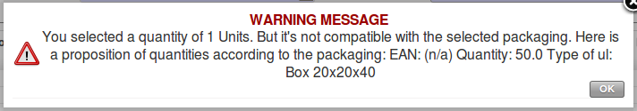

.. i18n: Packaging
.. i18n: =========
..

包装
=========

.. i18n: Products can be managed in several packaged forms. For example, if you sell
.. i18n: batteries you can define the following packages for a given battery product:
..

Products can be managed in several packaged forms. For example, if you sell
batteries you can define the following packages for a given battery product:

.. i18n: * Piece: a battery,
.. i18n: 
.. i18n: * Blister Pack: a pack of 4 batteries,
.. i18n: 
.. i18n: * Pack of 100 blisters: 400 batteries,
.. i18n: 
.. i18n: * Palette: 40 packs for a total of 16,000 batteries.
..

* Piece: a battery,

* Blister Pack: a pack of 4 batteries,

* Pack of 100 blisters: 400 batteries,

* Palette: 40 packs for a total of 16,000 batteries.

.. i18n: OpenERP's package management enables you to sell the same product in several different forms. The
.. i18n: salesperson could sell separately, one battery or a palette of batteries. In the order, you can
.. i18n: select the default packaging type as a function of the quantities ordered.
..

OpenERP's package management enables you to sell the same product in several different forms. The
salesperson could sell separately, one battery or a palette of batteries. In the order, you can
select the default packaging type as a function of the quantities ordered.

.. i18n: For example, if the customer wants to buy 30,000 batteries, the salesperson can select the ``palette`` package. OpenERP will then propose to sell 32,000 batteries, which corresponds to two palettes. Or the salesperson can select 75 packs.
..

For example, if the customer wants to buy 30,000 batteries, the salesperson can select the ``palette`` package. OpenERP will then propose to sell 32,000 batteries, which corresponds to two palettes. Or the salesperson can select 75 packs.

.. i18n: The available packages are defined in the product form, in the :guilabel:`Packaging` tab. The first item on the
.. i18n: list is the one that will be used by default.
..

The available packages are defined in the product form, in the :guilabel:`Packaging` tab. The first item on the
list is the one that will be used by default.

.. i18n: Once a package has been defined on the order, OpenERP will throw up an alert if the ordered
.. i18n: quantities do not correspond to the proposed packages. The quantity must be a multiple of the field
.. i18n: :guilabel:`Quantity by Package` defined on the packaging form.
..

Once a package has been defined on the order, OpenERP will throw up an alert if the ordered
quantities do not correspond to the proposed packages. The quantity must be a multiple of the field
:guilabel:`Quantity by Package` defined on the packaging form.

.. i18n: .. figure:: images/sale_warning_packaging.png
.. i18n:    :scale: 75
.. i18n:    :align: center
.. i18n: 
.. i18n:    *Alert on the Quantities sold compared to the Packaging*
..

   *Alert on the Quantities sold compared to the Packaging*

.. i18n: Do not confuse the management of packaging with the management of multiple units of measure. The
.. i18n: Unit of Measure is used to manage the stock differently according to the various units. 
.. i18n: With packages, the stock is always managed by individual items, but information about the package to use is supplied
.. i18n: to the storesperson along with that item.
..

Do not confuse the management of packaging with the management of multiple units of measure. The
Unit of Measure is used to manage the stock differently according to the various units. 
With packages, the stock is always managed by individual items, but information about the package to use is supplied
to the storesperson along with that item.

.. i18n: Even if the effects are the same, the printed documents will be different. The two following
.. i18n: operations have the same effect on stock movement levels, but will be printed differently
.. i18n: on the sales order and the packing order as where quantities are concerned:
..

Even if the effects are the same, the printed documents will be different. The two following
operations have the same effect on stock movement levels, but will be printed differently
on the sales order and the packing order as where quantities are concerned:

.. i18n: * 32,000 batteries, delivered on two palettes,
.. i18n: 
.. i18n: * 2 palettes of batteries, with no information about packaging.
..

* 32,000 batteries, delivered on two palettes,

* 2 palettes of batteries, with no information about packaging.

.. i18n: If the customer wants to order a palette and 10 packs, the salesperson can put two order
.. i18n: lines on the sales order using the same product with different units of measure.
..

If the customer wants to order a palette and 10 packs, the salesperson can put two order
lines on the sales order using the same product with different units of measure.

.. i18n: It is sometimes more useful to define different products than to define several possible packages for
.. i18n: the same product. A case of beer in a supermarket is a good example. A case holds 24 bottles, plus
.. i18n: the empty case itself. The customer can buy bottles by the piece or a case of 24 bottles at one go.
..

It is sometimes more useful to define different products than to define several possible packages for
the same product. A case of beer in a supermarket is a good example. A case holds 24 bottles, plus
the empty case itself. The customer can buy bottles by the piece or a case of 24 bottles at one go.

.. i18n: You could define two packages for the ``Bottle of beer`` : ``PCE`` and ``case`` . But this
.. i18n: representation does not let you manage the stock and price of empty cases. So you might instead
.. i18n: prefer a Bill of Materials, defining and using three different products:
..

You could define two packages for the ``Bottle of beer`` : ``PCE`` and ``case`` . But this
representation does not let you manage the stock and price of empty cases. So you might instead
prefer a Bill of Materials, defining and using three different products:

.. i18n: * the empty case for the beer,
.. i18n: 
.. i18n: * the bottle of beer,
.. i18n: 
.. i18n: * the case of 24 bottles of beer.
..

* the empty case for the beer,

* the bottle of beer,

* the case of 24 bottles of beer.

.. i18n: You also define the bill of materials below which determines the make-up of the case of 24 beers:
..

You also define the bill of materials below which determines the make-up of the case of 24 beers:

.. i18n: * Case of 24 bottles of beer: 1 unit,
.. i18n: 
.. i18n: * Bottle of beer: 24 units,
.. i18n: 
.. i18n: * Empty case of beer: 1 unit.
..

* Case of 24 bottles of beer: 1 unit,

* Bottle of beer: 24 units,

* Empty case of beer: 1 unit.

.. i18n: Each of these three products has a different price. The products ``Bottle of beer`` and ``Empty case of beer`` have a stock level that needs to be managed. The ``Case of 24 bottles of beer`` has no stock because, if you sell the product, OpenERP automatically moves the stock in two lines, one for the empty case and the other for the 24 individual bottles of beer. For more information on bills of materials,
.. i18n: see chapter :ref:`ch-mnf`.
..

Each of these three products has a different price. The products ``Bottle of beer`` and ``Empty case of beer`` have a stock level that needs to be managed. The ``Case of 24 bottles of beer`` has no stock because, if you sell the product, OpenERP automatically moves the stock in two lines, one for the empty case and the other for the 24 individual bottles of beer. For more information on bills of materials,
see chapter :ref:`ch-mnf`.

.. i18n: .. Copyright © Open Object Press. All rights reserved.
..

.. Copyright © Open Object Press. All rights reserved.

.. i18n: .. You may take electronic copy of this publication and distribute it if you don't
.. i18n: .. change the content. You can also print a copy to be read by yourself only.
..

.. You may take electronic copy of this publication and distribute it if you don't
.. change the content. You can also print a copy to be read by yourself only.

.. i18n: .. We have contracts with different publishers in different countries to sell and
.. i18n: .. distribute paper or electronic based versions of this book (translated or not)
.. i18n: .. in bookstores. This helps to distribute and promote the OpenERP product. It
.. i18n: .. also helps us to create incentives to pay contributors and authors using author
.. i18n: .. rights of these sales.
..

.. We have contracts with different publishers in different countries to sell and
.. distribute paper or electronic based versions of this book (translated or not)
.. in bookstores. This helps to distribute and promote the OpenERP product. It
.. also helps us to create incentives to pay contributors and authors using author
.. rights of these sales.

.. i18n: .. Due to this, grants to translate, modify or sell this book are strictly
.. i18n: .. forbidden, unless Tiny SPRL (representing Open Object Press) gives you a
.. i18n: .. written authorisation for this.
..

.. Due to this, grants to translate, modify or sell this book are strictly
.. forbidden, unless Tiny SPRL (representing Open Object Press) gives you a
.. written authorisation for this.

.. i18n: .. Many of the designations used by manufacturers and suppliers to distinguish their
.. i18n: .. products are claimed as trademarks. Where those designations appear in this book,
.. i18n: .. and Open Object Press was aware of a trademark claim, the designations have been
.. i18n: .. printed in initial capitals.
..

.. Many of the designations used by manufacturers and suppliers to distinguish their
.. products are claimed as trademarks. Where those designations appear in this book,
.. and Open Object Press was aware of a trademark claim, the designations have been
.. printed in initial capitals.

.. i18n: .. While every precaution has been taken in the preparation of this book, the publisher
.. i18n: .. and the authors assume no responsibility for errors or omissions, or for damages
.. i18n: .. resulting from the use of the information contained herein.
..

.. While every precaution has been taken in the preparation of this book, the publisher
.. and the authors assume no responsibility for errors or omissions, or for damages
.. resulting from the use of the information contained herein.

.. i18n: .. Published by Open Object Press, Grand Rosière, Belgium
..

.. Published by Open Object Press, Grand Rosière, Belgium
