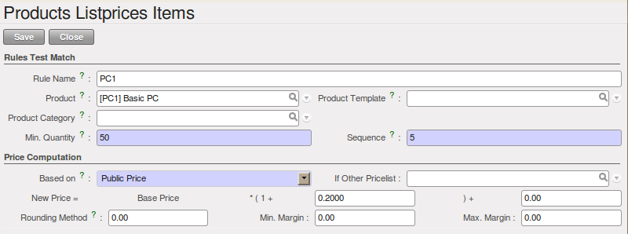

.. i18n: Pricing Policies
.. i18n: ================
..

灵活的价格体系
================

.. i18n: Some companies are notorious for their complicated pricelists. Many forms of price variation are
.. i18n: used, such as end-of-year refunds, discounts, change of terms and conditions with time, various
.. i18n: prepayments, cascaded rebates, seasonal promotions, and progressive price reductions.
..

Some companies are notorious for their complicated pricelists. Many forms of price variation are
used, such as end-of-year refunds, discounts, change of terms and conditions with time, various
prepayments, cascaded rebates, seasonal promotions, and progressive price reductions.

.. i18n: .. note:: Rebate, Refund, Reduction
.. i18n: 
.. i18n:    In some accounting jurisdictions you have to differentiate between the three following terms:
.. i18n: 
.. i18n:    * Rebate: reimbursement to the client, usually at the end of the year, that depends on the
.. i18n:      quantity of goods purchased over a period.
.. i18n: 
.. i18n:    * Refund: reduction on the order line or invoice line if a certain quantity of goods is purchased
.. i18n:      at one time or is sold in a framework of a promotional activity.
.. i18n: 
.. i18n:    * Reduction: a one-off reduction resulting from a quality defect or a variation in a product's
.. i18n:      conformance to a specification.
..

.. note:: Rebate, Refund, Reduction

   In some accounting jurisdictions you have to differentiate between the three following terms:

   * Rebate: reimbursement to the client, usually at the end of the year, that depends on the
     quantity of goods purchased over a period.

   * Refund: reduction on the order line or invoice line if a certain quantity of goods is purchased
     at one time or is sold in a framework of a promotional activity.

   * Reduction: a one-off reduction resulting from a quality defect or a variation in a product's
     conformance to a specification.

.. i18n: Intelligent price management is difficult, because it requires you to integrate several conditions
.. i18n: from clients and suppliers to create estimates quickly or to invoice automatically. But if you have
.. i18n: an efficient price management mechanism you can often keep margins raised and respond quickly to
.. i18n: changes in market conditions. A good price management system gives you scope for varying any and all
.. i18n: of the relevant factors when you are negotiating a contract.
..

Intelligent price management is difficult, because it requires you to integrate several conditions
from clients and suppliers to create estimates quickly or to invoice automatically. But if you have
an efficient price management mechanism you can often keep margins raised and respond quickly to
changes in market conditions. A good price management system gives you scope for varying any and all
of the relevant factors when you are negotiating a contract.

.. i18n: To help you work most effectively, OpenERP's pricelist principles are extremely powerful yet are
.. i18n: based on simple and generic rules. You can develop both sales pricelists and purchase pricelists for
.. i18n: products capable of accommodating conditions such as the date period, the quantity requested and the
.. i18n: type of product.
..

To help you work most effectively, OpenERP's pricelist principles are extremely powerful yet are
based on simple and generic rules. You can develop both sales pricelists and purchase pricelists for
products capable of accommodating conditions such as the date period, the quantity requested and the
type of product.

.. i18n: .. tip:: Do not confuse the Different Price Specifications
.. i18n: 
.. i18n:    Do not confuse the sales price with the basic price of the product.
.. i18n:    In OpenERP's basic configuration, the sales price is the list price specified in the product form,
.. i18n:    but a customer can have a different sales price depending on the conditions.
.. i18n: 
.. i18n:    The same applies to the purchase price and standard cost. Purchase price is your suppliers' selling price,
.. i18n:    which changes in response to different criteria such as quantities, dates, and supplier. This is
.. i18n:    automatically set by the accounting system.
.. i18n:    You will find that the two prices have been set by default to the same for all products with the demonstration data,
.. i18n:    which can be a source of confusion.
.. i18n:    You are free to set the standard cost to something different.
..

.. tip:: Do not confuse the Different Price Specifications

   Do not confuse the sales price with the basic price of the product.
   In OpenERP's basic configuration, the sales price is the list price specified in the product form,
   but a customer can have a different sales price depending on the conditions.

   The same applies to the purchase price and standard cost. Purchase price is your suppliers' selling price,
   which changes in response to different criteria such as quantities, dates, and supplier. This is
   automatically set by the accounting system.
   You will find that the two prices have been set by default to the same for all products with the demonstration data,
   which can be a source of confusion.
   You are free to set the standard cost to something different.

.. i18n: Each pricelist is calculated from defined policies, so you will have as many sales pricelists as
.. i18n: active sales policies in the company. For example, a company that sells products through three sales
.. i18n: channels could create the following price lists:
..

Each pricelist is calculated from defined policies, so you will have as many sales pricelists as
active sales policies in the company. For example, a company that sells products through three sales
channels could create the following price lists:

.. i18n:  #. Main distribution:
.. i18n: 
.. i18n: 	- pricelist for Walbury,
.. i18n: 
.. i18n: 	- pricelist for TesMart,
.. i18n: 
.. i18n:  #. Postal Sales.
.. i18n: 
.. i18n:  #. Walk-in customers.
..

 #. Main distribution:

	- pricelist for Walbury,

	- pricelist for TesMart,

 #. Postal Sales.

 #. Walk-in customers.

.. i18n: A single pricelist can exist in several versions, only one of which is permitted to be active at a
.. i18n: given time. These versions let you set different prices at different points in time. So the
.. i18n: pricelist for walk-in customers could have five different versions, for example: \ ``Autumn``\,
.. i18n: \ ``Summer``\, \ ``Summer Sales``\, \ ``Winter``\, \ ``Spring``\. Direct customers will see prices
.. i18n: that change with the seasons.
..

A single pricelist can exist in several versions, only one of which is permitted to be active at a
given time. These versions let you set different prices at different points in time. So the
pricelist for walk-in customers could have five different versions, for example: \ ``Autumn``\,
\ ``Summer``\, \ ``Summer Sales``\, \ ``Winter``\, \ ``Spring``\. Direct customers will see prices
that change with the seasons.

.. i18n: Each pricelist is expressed in a single currency. If your company sells products in several
.. i18n: currencies, you will have to create as many pricelists as you have currencies.
..

Each pricelist is expressed in a single currency. If your company sells products in several
currencies, you will have to create as many pricelists as you have currencies.

.. i18n: The prices on a pricelist can depend on another list, which means that you do not have to repeat the
.. i18n: definition of all conditions for each product. So a pricelist in USD can be based on a pricelist in
.. i18n: EUR. If the currency conversion rates between EUR and USD change, or the EUR prices change, the USD
.. i18n: rates can be **automatically** adjusted.
..

The prices on a pricelist can depend on another list, which means that you do not have to repeat the
definition of all conditions for each product. So a pricelist in USD can be based on a pricelist in
EUR. If the currency conversion rates between EUR and USD change, or the EUR prices change, the USD
rates can be **automatically** adjusted.

.. i18n: .. index::
.. i18n:    single: pricelist; create
..

.. index::
   single: pricelist; create

.. i18n: Creating Price Lists
.. i18n: --------------------
..

创建价格表
--------------------

.. i18n: You can define a pricelist from the menu :menuselection:`Sales --> Configuration --> Pricelists --> Pricelists`.
..

You can define a pricelist from the menu :menuselection:`Sales --> Configuration --> Pricelists --> Pricelists`.

.. i18n: For each list you should define:
..

For each list you should define:

.. i18n: * a :guilabel:`Name` for the list,
.. i18n: 
.. i18n: * a :guilabel:`Type` of list: \ ``Sale`` \ for customers or \ ``Purchase`` \ for suppliers,
.. i18n: 
.. i18n: * the :guilabel:`Currency` in which the prices are expressed.
..

* a :guilabel:`Name` for the list,

* a :guilabel:`Type` of list: \ ``Sale`` \ for customers or \ ``Purchase`` \ for suppliers,

* the :guilabel:`Currency` in which the prices are expressed.

.. i18n: .. index::
.. i18n:    single: pricelists; version
..

.. index::
   single: pricelists; version

.. i18n: Price List Versions
.. i18n: ^^^^^^^^^^^^^^^^^^^
..

价格表版本
^^^^^^^^^^^^^^^^^^^

.. i18n: Once the pricelist is defined you have to link at least one version. You can create a new version directly from the pricelist or from the
.. i18n: :menuselection:`Sales --> Configuration --> Pricelists --> Pricelist Versions` menu. The version contains all of the
.. i18n: rules that enable you to calculate a price for a product and a given quantity.
..

Once the pricelist is defined you have to link at least one version. You can create a new version directly from the pricelist or from the
:menuselection:`Sales --> Configuration --> Pricelists --> Pricelist Versions` menu. The version contains all of the
rules that enable you to calculate a price for a product and a given quantity.

.. i18n: Start by setting the :guilabel:`Name` of this associated version. If the list only has a single version, you
.. i18n: can use the same name for the pricelist and the version. In the :guilabel:`Price List` field, select
.. i18n: the pricelist you created (this is not necessary if you create the version directly from the pricelist).
..

Start by setting the :guilabel:`Name` of this associated version. If the list only has a single version, you
can use the same name for the pricelist and the version. In the :guilabel:`Price List` field, select
the pricelist you created (this is not necessary if you create the version directly from the pricelist).

.. i18n: Then set the :guilabel:`Start Date` and :guilabel:`End Date` of this version. The fields are both
.. i18n: optional: if you do not set any dates the version will be permanently active. Only one version
.. i18n: may be active at any one point, so bear this in mind when creating them.
.. i18n: Use the :guilabel:`Active` field in the versions to activate or disable a pricelist version.
..

Then set the :guilabel:`Start Date` and :guilabel:`End Date` of this version. The fields are both
optional: if you do not set any dates the version will be permanently active. Only one version
may be active at any one point, so bear this in mind when creating them.
Use the :guilabel:`Active` field in the versions to activate or disable a pricelist version.

.. i18n: .. note:: Automatically Updating the Sales Pricelist
.. i18n: 
.. i18n:    Any sales pricelist can be set to depend on one of the other pricelists.
.. i18n:    So you could create your sales pricelist based on the supplier's purchase pricelist, to
.. i18n:    which you add a margin.
.. i18n:    The prices are automatically calculated as a function of the purchase price and need no further
.. i18n:    manual adjustment.
..

.. note:: Automatically Updating the Sales Pricelist

   Any sales pricelist can be set to depend on one of the other pricelists.
   So you could create your sales pricelist based on the supplier's purchase pricelist, to
   which you add a margin.
   The prices are automatically calculated as a function of the purchase price and need no further
   manual adjustment.

.. i18n: .. index:: price
..

.. index:: price

.. i18n: Calculation Rules
.. i18n: ^^^^^^^^^^^^^^^^^
..

定价规则
^^^^^^^^^^^^^^^^^

.. i18n: A pricelist version is made up of a set of rules that apply to the basic product prices.
..

A pricelist version is made up of a set of rules that apply to the basic product prices.

.. i18n: .. figure:: images/service_pricelist_line.png
.. i18n:    :scale: 75
.. i18n:    :align: center
.. i18n: 
.. i18n:    *Rule in a Pricelist Version*
..

   *Rule in a Pricelist Version*

.. i18n: You define the conditions for a rule in the first part of the screen labelled :guilabel:`Rules Test
.. i18n: Match`. The rule applies to the :guilabel:`Product` or :guilabel:`Product Template` and/or the named :guilabel:`Product
.. i18n: Category`. If a rule is applied to a category, then it is automatically applied to all of its
.. i18n: subcategories too (using the tree structure for product categories).
..

You define the conditions for a rule in the first part of the screen labelled :guilabel:`Rules Test
Match`. The rule applies to the :guilabel:`Product` or :guilabel:`Product Template` and/or the named :guilabel:`Product
Category`. If a rule is applied to a category, then it is automatically applied to all of its
subcategories too (using the tree structure for product categories).

.. i18n: If you set a minimum quantity in :guilabel:`Min. Quantity`, the rule will only apply to a quantity equal to or larger than the quantity set. This way, you can define reduced rates in steps according to the quantities ordered.
..

If you set a minimum quantity in :guilabel:`Min. Quantity`, the rule will only apply to a quantity equal to or larger than the quantity set. This way, you can define reduced rates in steps according to the quantities ordered.

.. i18n: Several rules can be applied to an order. OpenERP evaluates these rules by sequence number, to determine
.. i18n: which rule(s) to apply to the specified price calculation. If several rules are valid, only the first in
.. i18n: sequence is used for the calculation. The :guilabel:`Sequence` field determines the order, starting with the
.. i18n: lowest number and working up.
..

Several rules can be applied to an order. OpenERP evaluates these rules by sequence number, to determine
which rule(s) to apply to the specified price calculation. If several rules are valid, only the first in
sequence is used for the calculation. The :guilabel:`Sequence` field determines the order, starting with the
lowest number and working up.

.. i18n: Once a rule has been selected, the system has to determine how to calculate the price from the rule.
.. i18n: This operation is based on the criteria set out in the lower part of the form, labelled :guilabel:`Price
.. i18n: Computation`.
..

Once a rule has been selected, the system has to determine how to calculate the price from the rule.
This operation is based on the criteria set out in the lower part of the form, labelled :guilabel:`Price
Computation`.

.. i18n: The first field to complete is :guilabel:`Based on`. Set the way in which the partner price will be calculated, choosing between:
..

The first field to complete is :guilabel:`Based on`. Set the way in which the partner price will be calculated, choosing between:

.. i18n: * the :guilabel:`Public Price` set in the product file,
.. i18n: 
.. i18n: * the :guilabel:`Cost Price` set in the product file,
.. i18n: 
.. i18n: * an :guilabel:`Other Pricelist` given in the field :guilabel:`If Other Pricelist`,
.. i18n: 
.. i18n: * the price that varies as a function of a supplier defined in the :guilabel:`Partner section of the
.. i18n:   product form`.
..

* the :guilabel:`Public Price` set in the product file,

* the :guilabel:`Cost Price` set in the product file,

* an :guilabel:`Other Pricelist` given in the field :guilabel:`If Other Pricelist`,

* the price that varies as a function of a supplier defined in the :guilabel:`Partner section of the
  product form`.

.. i18n: Several other criteria can be considered and added to the list, as you will see in the following
.. i18n: section.
..

Several other criteria can be considered and added to the list, as you will see in the following
section.

.. i18n: Next, various operations can be applied to the basic price to calculate the sales or purchase price
.. i18n: for the partner, according to the specified quantities. To calculate it, you apply the formula shown on the
.. i18n: form: ``Price = Base Price x (1 + Field1) + Field2`` .
..

Next, various operations can be applied to the basic price to calculate the sales or purchase price
for the partner, according to the specified quantities. To calculate it, you apply the formula shown on the
form: ``Price = Base Price x (1 + Field1) + Field2`` .

.. i18n: The first field, :guilabel:`Field1`, defines a discount or a supplement. Set it to -0.20 for a discount of 20% from
.. i18n: the basic price. If your price is based on standard cost, you can set 0.15 to get a 15% price uplift
.. i18n: compared to the standard costs.
..

The first field, :guilabel:`Field1`, defines a discount or a supplement. Set it to -0.20 for a discount of 20% from
the basic price. If your price is based on standard cost, you can set 0.15 to get a 15% price uplift
compared to the standard costs.

.. i18n: :guilabel:`Field2` sets a fixed supplement to the price, expressed in the currency of the pricelist.
.. i18n: This amount is just added (or subtracted, if negative) to the amount calculated with the
.. i18n: :guilabel:`Field1` discount.
..

:guilabel:`Field2` sets a fixed supplement to the price, expressed in the currency of the pricelist.
This amount is just added (or subtracted, if negative) to the amount calculated with the
:guilabel:`Field1` discount.

.. i18n: Then you can specify a rounding method. The rounding calculation is carried out to the nearest
.. i18n: number. For example if you set 0.05 in this example, a price of 45.66 will be rounded to 45.65, and
.. i18n: 14,567 rounded to 100 will give a price of 14,600.
..

Then you can specify a rounding method. The rounding calculation is carried out to the nearest
number. For example if you set 0.05 in this example, a price of 45.66 will be rounded to 45.65, and
14,567 rounded to 100 will give a price of 14,600.

.. i18n: .. note:: Swiss Special Situation
.. i18n: 
.. i18n:    In Switzerland, the smallest monetary unit is 5 cents.
.. i18n:    There are not any 1 or 2 cent coins.
.. i18n:    So you set OpenERP's rounding to 0.05 to round everything in a Swiss franc pricelist.
..

.. note:: Swiss Special Situation

   In Switzerland, the smallest monetary unit is 5 cents.
   There are not any 1 or 2 cent coins.
   So you set OpenERP's rounding to 0.05 to round everything in a Swiss franc pricelist.

.. i18n: The supplement from :guilabel:`Field2` is applied before the rounding calculation, which enables
.. i18n: some interesting effects. For example, if you want all your prices to end in 9.99, set your rounding
.. i18n: to 10 and your supplement to -0.01 in :guilabel:`Field2`.
..

The supplement from :guilabel:`Field2` is applied before the rounding calculation, which enables
some interesting effects. For example, if you want all your prices to end in 9.99, set your rounding
to 10 and your supplement to -0.01 in :guilabel:`Field2`.

.. i18n: Minimum and Maximum margins enable you to guarantee a given margin over the base price. A margin of
.. i18n: 10 USD enables you to stop the discount from returning less than that margin. If you put 0 into this
.. i18n: field, no effect is taken into account.
..

Minimum and Maximum margins enable you to guarantee a given margin over the base price. A margin of
10 USD enables you to stop the discount from returning less than that margin. If you put 0 into this
field, no effect is taken into account.

.. i18n: Once the pricelist is defined, you can assign it to a partner. Go to the Partner form and select
.. i18n: its :guilabel:`Sales & Purchases` tab. You can then change the :guilabel:`Purchase Pricelist` and the
.. i18n: :guilabel:`Sale Pricelist` that is loaded by default for the partner.
..

Once the pricelist is defined, you can assign it to a partner. Go to the Partner form and select
its :guilabel:`Sales & Purchases` tab. You can then change the :guilabel:`Purchase Pricelist` and the
:guilabel:`Sale Pricelist` that is loaded by default for the partner.

.. i18n: .. _decimal_accuracy:
.. i18n: 
.. i18n: Decimal Accuracy
.. i18n: ^^^^^^^^^^^^^^^^
.. i18n: There are several configuration settings related to the decimal accuracy of 
.. i18n: prices, or the number of decimal places to hold with each price field. To change
.. i18n: the accuracy of a field, follow these steps:
..

.. _decimal_accuracy:

小数精度
^^^^^^^^^^^^^^^^
There are several configuration settings related to the decimal accuracy of 
prices, or the number of decimal places to hold with each price field. To change
the accuracy of a field, follow these steps:

.. i18n: 1. Make sure you have the `Extended` user interface. The setting is in your user 
.. i18n:    preferences.
.. i18n:    
.. i18n: 2. Go to :menuselection:`Administration --> Customization --> Database Structure --> 
.. i18n:    Decimal Accuracy`. This list contains a number of predefined elements.
.. i18n:    
.. i18n: 3. Open the entry you want to change. `Purchase Price` and `Sale Price` are the 
.. i18n:    most common ones related to prices, but some fields are controlled by the 
.. i18n:    `Account` entry.
.. i18n:    
.. i18n: 4. Type a new value in the digits field, and save the entry. Do not change the description in the
.. i18n:    `Usage` field, or it will stop working.
.. i18n:    
.. i18n: 5. Close the screen where you were editing prices and reopen it. The price field 
.. i18n:    should now have the number of digits you asked for.
..

1. Make sure you have the `Extended` user interface. The setting is in your user 
   preferences.
   
2. Go to :menuselection:`Administration --> Customization --> Database Structure --> 
   Decimal Accuracy`. This list contains a number of predefined elements.
   
3. Open the entry you want to change. `Purchase Price` and `Sale Price` are the 
   most common ones related to prices, but some fields are controlled by the 
   `Account` entry.
   
4. Type a new value in the digits field, and save the entry. Do not change the description in the
   `Usage` field, or it will stop working.
   
5. Close the screen where you were editing prices and reopen it. The price field 
   should now have the number of digits you asked for.

.. i18n: Example of a Pricelist
.. i18n: ----------------------
..

价格表应用示例
----------------------

.. i18n: Take the case of an IT systems trading company, for which the following product categories have
.. i18n: been configured:
..

Take the case of an IT systems trading company, for which the following product categories have
been configured:

.. i18n: All products
..

所有产品

.. i18n:  #. Accessories
.. i18n: 
.. i18n:                 * Printers
.. i18n: 
.. i18n:                 * Scanners
.. i18n: 
.. i18n:                 * Keyboards and Mice
.. i18n: 
.. i18n:  #. Computers
.. i18n: 
.. i18n:                 * Portables
.. i18n: 
.. i18n:                  - Large-screen portables
.. i18n: 
.. i18n:                 * Computers
.. i18n: 
.. i18n:                  - Office Computers
.. i18n: 
.. i18n:                  - Professional Computers
..

 #. 配件

                * 打印机

                * 扫描仪

                * 键鼠与耳麦

 #. 电脑

                * 笔记本

                 - 一体机

                * 台式电脑

                 - 办公用台式机

                 - 专业台式机

.. i18n: In addition, the products presented in the table below are defined in the currency of the installed
.. i18n: chart of accounts.
..

In addition, the products presented in the table below are defined in the currency of the installed
chart of accounts.

.. i18n: TABLE
..

表格

.. i18n: .. csv-table:: Examples of products with their different prices
.. i18n: 
.. i18n:    "Product ","Sale Price","Cost Price","Default supplier price",
.. i18n:    "Acclo Portable","1,200 ","887 ","893 ",
.. i18n:    "Toshibishi Portable","1,340 ","920 ","920 ",
.. i18n:    "Berrel Keyboard","100 ","50 ","50 ",
.. i18n:    "Office Computer","1,400 ","1,000 ","1,000 ",
..

.. csv-table:: Examples of products with their different prices

   "产品 ","销售价","成本价","采购价",
   "Acclo 笔记本","1,200 ","887 ","893 ",
   "Toshibishi 笔记本","1,340 ","920 ","920 ",
   "Berrel 键盘","100 ","50 ","50 ",
   "办公台式机","1,400 ","1,000 ","1,000 ",

.. i18n: .. index::
.. i18n:    single: pricelist; default pricelist
..

.. index::
   single: pricelist; default pricelist

.. i18n: Default Price Lists
.. i18n: ^^^^^^^^^^^^^^^^^^^
..

默认价格表
^^^^^^^^^^^^^^^^^^^

.. i18n: .. figure:: images/product_pricelist_default.png
.. i18n:    :scale: 75
.. i18n:    :align: center
.. i18n: 
.. i18n:    *Default pricelist after installing OpenERP*
..

.. figure:: images/product_pricelist_default.png
   :scale: 75
   :align: center

   *OpenERP 默认的价格表*

.. i18n: When you install the software, two pricelists are created by default: one for sales and one for
.. i18n: purchases. Each of them contains only one pricelist version and only one line in that version.
..

When you install the software, two pricelists are created by default: one for sales and one for
purchases. Each of them contains only one pricelist version and only one line in that version.

.. i18n: The price for sales defined in the Default Public Pricelist is set by default to
.. i18n: the Public Price of the product, which is the Sales Price in the Product form.
..

The price for sales defined in the Default Public Pricelist is set by default to
the Public Price of the product, which is the Sales Price in the Product form.

.. i18n: The price for purchases defined in the Default Purchase Pricelist is set by default in the same way to
.. i18n: the Cost Price of the product.
..

The price for purchases defined in the Default Purchase Pricelist is set by default in the same way to
the Cost Price of the product.

.. i18n: .. index::
.. i18n:    single: trading company
..

.. index::
   single: trading company

.. i18n: Trading Company
.. i18n: ^^^^^^^^^^^^^^^
..

商贸类公司
^^^^^^^^^^^^^^^

.. i18n: Take the case of a trading company, where the sales price for resellers can be defined like this:
..

Take the case of a trading company, where the sales price for resellers can be defined like this:

.. i18n: * For portable computers, the sale price is calculated from the list price of the supplier Acclo,
.. i18n:   with a supplement of 23% on the cost of purchase.
.. i18n: 
.. i18n: * For all other products the sales price is given by the standard cost in the product file, to which
.. i18n:   31% is added. The price should end in ``.99`` .
.. i18n: 
.. i18n: * The sales price of Berrel keyboards is fixed at 60 for a minimum quantity of 5 keyboards purchased.
.. i18n:   Otherwise it uses the rule above.
.. i18n: 
.. i18n: * Assume that the Acclo pricelist is defined in OpenERP. The pricelist for resellers and the
.. i18n:   pricelist version then contains three lines:
.. i18n: 
.. i18n:        #. \ ``Acclo``\  line:
.. i18n: 
.. i18n:                 *  :guilabel:`Product Category` : \ ``Portables``\  ,
.. i18n: 
.. i18n:                 *  :guilabel:`Based on` : \ ``Other pricelist``\  ,
.. i18n: 
.. i18n:                 *  :guilabel:`Pricelist if other` : \ ``Acclo pricelist``\  ,
.. i18n: 
.. i18n:                 *  :guilabel:`Field1` : \ ``0.23``\  ,
.. i18n: 
.. i18n:                 *  :guilabel:`Priority` : \ ``1``\  .
.. i18n: 
.. i18n:        #. \ ``Berrel Keyboard``\  line:
.. i18n: 
.. i18n:                 *  :guilabel:`Product Template` : \ ``Berrel Keyboard``\  ,
.. i18n: 
.. i18n:                 *  :guilabel:`Min. Quantity` : \ ``5``\  ,
.. i18n: 
.. i18n:                 *  :guilabel:`Field1` : \ ``1.0``\  ,
.. i18n: 
.. i18n:                 *  :guilabel:`Field2` : \ ``60``\  ,
.. i18n: 
.. i18n:                 *  :guilabel:`Priority` : \ ``2``\  .
.. i18n: 
.. i18n:        #. \ ``Other products``\  line:
.. i18n: 
.. i18n:                 *  :guilabel:`Based on:` \ ``Standard Price``\  ,
.. i18n: 
.. i18n:                 *  :guilabel:`Field1` : \ ``0.31``\  ,
.. i18n: 
.. i18n:                 *  :guilabel:`Field2` : \ ``-0.01``\  ,
.. i18n: 
.. i18n:                 *  :guilabel:`Rounding` : \ ``1.0``\  .
.. i18n: 
.. i18n:                 *  :guilabel:`Priority` :  \ ``3``\ .
..

* For portable computers, the sale price is calculated from the list price of the supplier Acclo,
  with a supplement of 23% on the cost of purchase.

* For all other products the sales price is given by the standard cost in the product file, to which
  31% is added. The price should end in ``.99`` .

* The sales price of Berrel keyboards is fixed at 60 for a minimum quantity of 5 keyboards purchased.
  Otherwise it uses the rule above.

* Assume that the Acclo pricelist is defined in OpenERP. The pricelist for resellers and the
  pricelist version then contains three lines:

       #. \ ``Acclo``\  line:

                *  :guilabel:`Product Category` : \ ``Portables``\  ,

                *  :guilabel:`Based on` : \ ``Other pricelist``\  ,

                *  :guilabel:`Pricelist if other` : \ ``Acclo pricelist``\  ,

                *  :guilabel:`Field1` : \ ``0.23``\  ,

                *  :guilabel:`Priority` : \ ``1``\  .

       #. \ ``Berrel Keyboard``\  line:

                *  :guilabel:`Product Template` : \ ``Berrel Keyboard``\  ,

                *  :guilabel:`Min. Quantity` : \ ``5``\  ,

                *  :guilabel:`Field1` : \ ``1.0``\  ,

                *  :guilabel:`Field2` : \ ``60``\  ,

                *  :guilabel:`Priority` : \ ``2``\  .

       #. \ ``Other products``\  line:

                *  :guilabel:`Based on:` \ ``Standard Price``\  ,

                *  :guilabel:`Field1` : \ ``0.31``\  ,

                *  :guilabel:`Field2` : \ ``-0.01``\  ,

                *  :guilabel:`Rounding` : \ ``1.0``\  .

                *  :guilabel:`Priority` :  \ ``3``\ .

.. i18n: It is important that the priority of the second rule is set below the priority of the third in this
.. i18n: example. If it were the other way around, the third rule would always be applied, because a quantity of
.. i18n: 5 is always greater than a quantity of 1 for all products.
..

It is important that the priority of the second rule is set below the priority of the third in this
example. If it were the other way around, the third rule would always be applied, because a quantity of
5 is always greater than a quantity of 1 for all products.

.. i18n: Also note that to fix a price of 60 for the 5 Berrel Keyboards, the formula \ ``Price = Base Price x
.. i18n: (1 + 1.0) + 60``\   has been used.
..

Also note that to fix a price of 60 for the 5 Berrel Keyboards, the formula \ ``Price = Base Price x
(1 + 1.0) + 60``\   has been used.

.. i18n: Establishing Customer Contract Conditions
.. i18n: ^^^^^^^^^^^^^^^^^^^^^^^^^^^^^^^^^^^^^^^^^
..

Establishing Customer Contract Conditions
^^^^^^^^^^^^^^^^^^^^^^^^^^^^^^^^^^^^^^^^^

.. i18n: The trading company can now set specific conditions to a customer, such as the company TinAtwo, who
.. i18n: might have signed a valid contract with the following conditions:
..

The trading company can now set specific conditions to a customer, such as the company TinAtwo, who
might have signed a valid contract with the following conditions:

.. i18n: * For Toshibishi portables, TinAtwo benefits from a discount of 5% of resale price.
.. i18n: 
.. i18n: * For all other products, the resale conditions are unchanged.
..

* For Toshibishi portables, TinAtwo benefits from a discount of 5% of resale price.

* For all other products, the resale conditions are unchanged.

.. i18n: The sales price for TinAtwo, called ``TinAtwo contract``, contains two rules:
..

The sales price for TinAtwo, called ``TinAtwo contract``, contains two rules:

.. i18n:        #. \ ``Toshibishi portable``\  :
.. i18n: 
.. i18n:                 *  :guilabel:`Product` : \ ``Toshibishi Portable``\  ,
.. i18n: 
.. i18n:                 *  :guilabel:`Based on` : \ ``Other pricelist``\  ,
.. i18n: 
.. i18n:                 *  :guilabel:`Pricelist if other` : \ ``Reseller pricelist``\  ,
.. i18n: 
.. i18n:                 *  :guilabel:`Field1` : \ ``0.05``\  ,
.. i18n: 
.. i18n:                 *  :guilabel:`Priority` : \ ``1``\  .
.. i18n: 
.. i18n:        #. \ ``Other Products``\ :
.. i18n: 
.. i18n:                 *  :guilabel:`Product` :
.. i18n: 
.. i18n:                 *  :guilabel:`Based on` : \ ``Other pricelist``\  ,
.. i18n: 
.. i18n:                 *  :guilabel:`Pricelist if other` : \ ``Reseller pricelist``\  ,
.. i18n: 
.. i18n:                 *  :guilabel:`Priority` : \ ``2``\  .
..

       #. \ ``Toshibishi portable``\  :

                *  :guilabel:`Product` : \ ``Toshibishi Portable``\  ,

                *  :guilabel:`Based on` : \ ``Other pricelist``\  ,

                *  :guilabel:`Pricelist if other` : \ ``Reseller pricelist``\  ,

                *  :guilabel:`Field1` : \ ``0.05``\  ,

                *  :guilabel:`Priority` : \ ``1``\  .

       #. \ ``Other Products``\ :

                *  :guilabel:`Product` :

                *  :guilabel:`Based on` : \ ``Other pricelist``\  ,

                *  :guilabel:`Pricelist if other` : \ ``Reseller pricelist``\  ,

                *  :guilabel:`Priority` : \ ``2``\  .

.. i18n: Once this list has been entered, you should look up the partner form of TinAtwo again. Click the
.. i18n: :guilabel:`Sales & Purchases` tab to set the :guilabel:`Sale Pricelist` field to *TinAtwo Contract*. If
.. i18n: the contract is only valid for one year, do not forget to set the :guilabel:`Start Date` and
.. i18n: :guilabel:`End Date` fields in the :guilabel:`Pricelist Version`.
..

Once this list has been entered, you should look up the partner form of TinAtwo again. Click the
:guilabel:`Sales & Purchases` tab to set the :guilabel:`Sale Pricelist` field to *TinAtwo Contract*. If
the contract is only valid for one year, do not forget to set the :guilabel:`Start Date` and
:guilabel:`End Date` fields in the :guilabel:`Pricelist Version`.

.. i18n: Then when salespeople prepare an estimate for TinAtwo, the prices proposed will automatically be
.. i18n: calculated from the contract conditions.
..

Then when salespeople prepare an estimate for TinAtwo, the prices proposed will automatically be
calculated from the contract conditions.

.. i18n: Pricelists and Managing Currencies
.. i18n: ----------------------------------
..

Pricelists and Managing Currencies
----------------------------------

.. i18n: If your trading company wants to start a product catalog in a new currency you can handle this
.. i18n: several ways:
..

If your trading company wants to start a product catalog in a new currency you can handle this
several ways:

.. i18n: * Enter the prices in a new independent pricelist and maintain the lists in the two currencies
.. i18n:   separately,
.. i18n: 
.. i18n: * Create a field in the product form for this new currency and make the new pricelist depend on this
.. i18n:   field: prices are then maintained separately, but in the product file,
.. i18n: 
.. i18n: * Create a new pricelist for the second currency and make it depend on another pricelist or on the
.. i18n:   product price: the conversion between the currencies will then be done automatically at the
.. i18n:   prevailing currency conversion rate.
..

* Enter the prices in a new independent pricelist and maintain the lists in the two currencies
  separately,

* Create a field in the product form for this new currency and make the new pricelist depend on this
  field: prices are then maintained separately, but in the product file,

* Create a new pricelist for the second currency and make it depend on another pricelist or on the
  product price: the conversion between the currencies will then be done automatically at the
  prevailing currency conversion rate.

.. i18n: .. Copyright © Open Object Press. All rights reserved.
..

.. Copyright © Open Object Press. All rights reserved.

.. i18n: .. You may take electronic copy of this publication and distribute it if you don't
.. i18n: .. change the content. You can also print a copy to be read by yourself only.
..

.. You may take electronic copy of this publication and distribute it if you don't
.. change the content. You can also print a copy to be read by yourself only.

.. i18n: .. We have contracts with different publishers in different countries to sell and
.. i18n: .. distribute paper or electronic based versions of this book (translated or not)
.. i18n: .. in bookstores. This helps to distribute and promote the OpenERP product. It
.. i18n: .. also helps us to create incentives to pay contributors and authors using author
.. i18n: .. rights of these sales.
..

.. We have contracts with different publishers in different countries to sell and
.. distribute paper or electronic based versions of this book (translated or not)
.. in bookstores. This helps to distribute and promote the OpenERP product. It
.. also helps us to create incentives to pay contributors and authors using author
.. rights of these sales.

.. i18n: .. Due to this, grants to translate, modify or sell this book are strictly
.. i18n: .. forbidden, unless Tiny SPRL (representing Open Object Press) gives you a
.. i18n: .. written authorisation for this.
..

.. Due to this, grants to translate, modify or sell this book are strictly
.. forbidden, unless Tiny SPRL (representing Open Object Press) gives you a
.. written authorisation for this.

.. i18n: .. Many of the designations used by manufacturers and suppliers to distinguish their
.. i18n: .. products are claimed as trademarks. Where those designations appear in this book,
.. i18n: .. and Open Object Press was aware of a trademark claim, the designations have been
.. i18n: .. printed in initial capitals.
..

.. Many of the designations used by manufacturers and suppliers to distinguish their
.. products are claimed as trademarks. Where those designations appear in this book,
.. and Open Object Press was aware of a trademark claim, the designations have been
.. printed in initial capitals.

.. i18n: .. While every precaution has been taken in the preparation of this book, the publisher
.. i18n: .. and the authors assume no responsibility for errors or omissions, or for damages
.. i18n: .. resulting from the use of the information contained herein.
..

.. While every precaution has been taken in the preparation of this book, the publisher
.. and the authors assume no responsibility for errors or omissions, or for damages
.. resulting from the use of the information contained herein.

.. i18n: .. Published by Open Object Press, Grand Rosière, Belgium
..

.. Published by Open Object Press, Grand Rosière, Belgium
