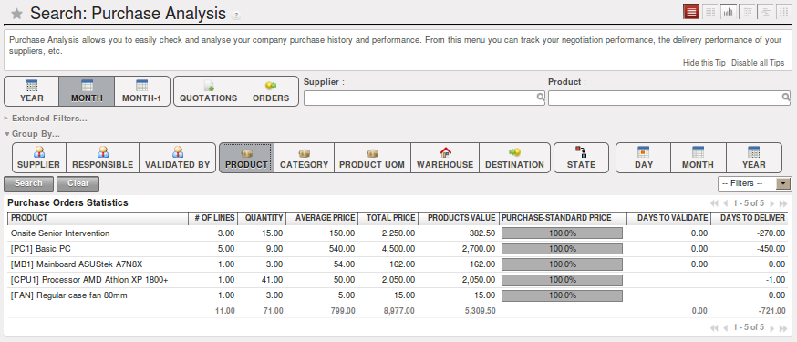

.. i18n: Purchase Analysis through Analytic Accounts
.. i18n: ===========================================
..

通过辅助核算项进行采购分析
===========================================

.. i18n: Powerful Statistics
.. i18n: -------------------
..

强大的统计
-------------------

.. i18n: .. index::
.. i18n:    single: module; product_margin
..

.. index::
   single: module; product_margin

.. i18n: OpenERP enables you to perform analysis of purchases by period (current year, current month,
.. i18n: previous month), by state (quotations, orders), supplier, user, product, category, warehouse
.. i18n: and so on. This is made possible through a search view accessed through the
.. i18n: menu :menuselection:`Purchases --> Reporting --> Purchase Analysis`.
..

OpenERP允许你通过多个维度进行分析，通过周期（本年，本月，上月）、通过状态（报价，订单），供应商，用户，
产品，分类，仓库等维度。可以通过菜单 :menuselection:`Purchases --> Reporting --> Purchase Analysis`进入
搜索界面，执行操作。

.. i18n: .. figure:: images/purchase_report.png
.. i18n:    :scale: 75
.. i18n:    :align: center
.. i18n: 
.. i18n:    *Analysis of Purchases over the Month by Product*
..

   *一个月的产品采购分析*

.. i18n: This analysis is carried out on supplier orders and not on invoices or the quantities actually
.. i18n: received. To get an analysis by product, use the module :mod:`product_margin`. The function of this
.. i18n: module is described in detail in the chapter :ref:`ch-sales`.
..

这个分析在基于供应商订单，而不是发票或者实际到货数量。要得到产品分析，使用模块 :mod:`product_margin`. 这个功能
模块在:ref:`ch-sales`.章有更详细说明

.. i18n: To analyze the received quantities, you can use the statistical reports in Warehouse.
..

为了分析到货数量，你可以使用库存统计报表，

.. i18n: .. index::
.. i18n:    single: Analytic Accounts
..

.. index::
   single: Analytic Accounts

.. i18n: To manage purchases by project, you should use analytic accounts. 
.. i18n: You can set an analytic account on each line of a supplier order. 
.. i18n: The analytic costs linked to this purchase will be managed
.. i18n: by OpenERP from the goods receipt and confirmation of the supplier invoice.
..

为了管理项目采购，你应该分析帐目。你可以在供应商订单的每一行上设置一个分析帐目。
OpenERP通过管理供应商发票确认和货物收据管理这次采购关联的成本。

.. i18n: .. index::
.. i18n:    single: module; hr_timesheet_invoice
..

.. index::
   single: module; hr_timesheet_invoice

.. i18n: The :mod:`hr_timesheet_invoice` module lets you re-invoice the analytic costs automatically using
.. i18n: parameters in the analytic accounts such as sale pricelist, associated partner company, and maximum amount.
..

:mod:`hr_timesheet_invoice`模块可让您重新开具发票,使用分析的帐目中的参数（如销售价格表，相关的合作伙伴，最高金额）分析成本。

.. i18n: So you can put an invoice order with a defined invoice workflow in place based on the analytic accounts. If you are
.. i18n: working ``Make to Order``, the workflow will be:
..

So you can put an invoice order with a defined invoice workflow in place based on the analytic accounts. If you are
working ``Make to Order``, the workflow will be:

.. i18n: #. Customer Order,
.. i18n: 
.. i18n: #. Procurement Order on supplier,
.. i18n: 
.. i18n: #. Receive invoice and goods from the supplier,
.. i18n: 
.. i18n: #. Delivery and invoicing to the customer.
..

#. Customer Order,

#. Procurement Order on supplier,

#. Receive invoice and goods from the supplier,

#. Delivery and invoicing to the customer.

.. i18n: When re-invoicing based on costs you would get the following workflow:
..

When re-invoicing based on costs you would get the following workflow:

.. i18n: #. Enter the customer contract conditions from the analytic accounts,
.. i18n: 
.. i18n: #. Purchase raw materials and write the services performed into the timesheets,
.. i18n: 
.. i18n: #. Receive the supplier invoice and the products,
.. i18n: 
.. i18n: #. Invoice these costs to the customer.
..

#. Enter the customer contract conditions from the analytic accounts,

#. Purchase raw materials and write the services performed into the timesheets,

#. Receive the supplier invoice and the products,

#. Invoice these costs to the customer.

.. i18n: .. index::
.. i18n:    single: module; purchase_analytic_plans
..

.. index::
   single: module; purchase_analytic_plans

.. i18n: .. tip:: Analytic Multi-plans
.. i18n: 
.. i18n:    If you want several analysis plans, you should install the module :mod:`purchase_analytic_plans`.
.. i18n:    These let you split a line on a supplier purchase order into several accounts and analytic
.. i18n:    plans.
.. i18n: 
.. i18n:  *Sitting at the heart of your company's processes, analytic accounts (or cost accounts) are
.. i18n:  indispensable tools for managing your operations well. Unlike your financial accounts, they are for
.. i18n:  more than accountants - they are for general managers and project managers, too.*
..

.. tip:: Analytic Multi-plans

   If you want several analysis plans, you should install the module :mod:`purchase_analytic_plans`.
   These let you split a line on a supplier purchase order into several accounts and analytic
   plans.

 *Sitting at the heart of your company's processes, analytic accounts (or cost accounts) are
 indispensable tools for managing your operations well. Unlike your financial accounts, they are for
 more than accountants - they are for general managers and project managers, too.*

.. i18n: You need a common way of referring to each user, service, or document to integrate all your
.. i18n: company's processes effectively. Such a common basis is provided by analytic accounts (or management
.. i18n: accounts, or cost accounts, as they are also called) in OpenERP.
..

You need a common way of referring to each user, service, or document to integrate all your
company's processes effectively. Such a common basis is provided by analytic accounts (or management
accounts, or cost accounts, as they are also called) in OpenERP.

.. i18n: Analytic accounts are often presented as a foundation for strategic enterprise decisions. But
.. i18n: because of all the information they pull together, OpenERP's analytic accounts can be a useful
.. i18n: management tool, at the center of most system processes.
..

Analytic accounts are often presented as a foundation for strategic enterprise decisions. But
because of all the information they pull together, OpenERP's analytic accounts can be a useful
management tool, at the center of most system processes.

.. i18n: There are several reasons for this:
..

There are several reasons for this:

.. i18n: * they reflect your entire management activity,
.. i18n: 
.. i18n: * unlike the general accounts, the structure of the analytic accounts is not regulated by legal
.. i18n:   obligations, so each company can adapt it to its needs.
..

* they reflect your entire management activity,

* unlike the general accounts, the structure of the analytic accounts is not regulated by legal
  obligations, so each company can adapt it to its needs.

.. i18n: .. note:: Independence from General Accounts
.. i18n: 
.. i18n: 	In some software packages, analytic accounts are managed as an extension of general accounts –
.. i18n: 	for example, by using the two last digits of the account code to represent analytic accounts.
.. i18n: 
.. i18n: 	In OpenERP, analytic accounts are linked to general accounts but are treated totally
.. i18n: 	independently.
.. i18n: 	So you can enter various different analytic operations that have no counterpart in the general
.. i18n: 	financial accounts.
..

.. note:: Independence from General Accounts

	In some software packages, analytic accounts are managed as an extension of general accounts –
	for example, by using the two last digits of the account code to represent analytic accounts.

	In OpenERP, analytic accounts are linked to general accounts but are treated totally
	independently.
	So you can enter various different analytic operations that have no counterpart in the general
	financial accounts.

.. i18n: While the structure of the general chart of accounts is imposed by law, the analytic chart of
.. i18n: accounts is built to fit a company's needs closely.
..

While the structure of the general chart of accounts is imposed by law, the analytic chart of
accounts is built to fit a company's needs closely.

.. i18n: Just as in the general accounts, you will find accounting entries in the different analytic accounts.
.. i18n: Each analytic entry can be linked to a general account, or not, as you wish. Conversely, an entry in
.. i18n: a general account can be linked to one, several, or no corresponding analytic accounts.
..

Just as in the general accounts, you will find accounting entries in the different analytic accounts.
Each analytic entry can be linked to a general account, or not, as you wish. Conversely, an entry in
a general account can be linked to one, several, or no corresponding analytic accounts.

.. i18n: You will discover many advantages of this independent representation below. For the more impatient,
.. i18n: here are some of those advantages:
..

You will discover many advantages of this independent representation below. For the more impatient,
here are some of those advantages:

.. i18n: * you can manage many different analytic operations,
.. i18n: 
.. i18n: * you can modify an analytic plan on the fly, during the course of an activity, because of its
.. i18n:   independence,
.. i18n: 
.. i18n: * you can avoid an explosion in the number of general accounts,
.. i18n: 
.. i18n: * even those companies that do not use OpenERP's general accounts can use the analytic accounts for
.. i18n:   management.
..

* you can manage many different analytic operations,

* you can modify an analytic plan on the fly, during the course of an activity, because of its
  independence,

* you can avoid an explosion in the number of general accounts,

* even those companies that do not use OpenERP's general accounts can use the analytic accounts for
  management.

.. i18n: .. tip:: Who Benefits from Analytic Accounts?
.. i18n: 
.. i18n: 	Unlike general accounts, analytic accounts in OpenERP are not so much an accounting tool for Accounts as a
.. i18n: 	management tool for everyone in the company. (That is why they are also called management accounts.)
.. i18n: 
.. i18n: 	The main users of analytic accounts should be the directors, general managers and project managers.
..

.. tip:: Who Benefits from Analytic Accounts?

	Unlike general accounts, analytic accounts in OpenERP are not so much an accounting tool for Accounts as a
	management tool for everyone in the company. (That is why they are also called management accounts.)

	The main users of analytic accounts should be the directors, general managers and project managers.

.. i18n: Analytic accounts make up a powerful tool that can be used in different ways. The trick is to create
.. i18n: your own analytic structure for a chart of accounts that closely matches your company's needs.
..

Analytic accounts make up a powerful tool that can be used in different ways. The trick is to create
your own analytic structure for a chart of accounts that closely matches your company's needs.

.. i18n: For this chapter, you should start with a fresh database that includes demo data,
.. i18n: with :mod:`sale` and its dependencies installed, and no particular chart of accounts configured.
..

For this chapter, you should start with a fresh database that includes demo data,
with :mod:`sale` and its dependencies installed, and no particular chart of accounts configured.

.. i18n: .. index::
.. i18n:    pair: chart of accounts; analytic
..

.. index::
   pair: chart of accounts; analytic

.. i18n: To Each Enterprise its own Analytic Chart of Accounts
.. i18n: -----------------------------------------------------
..

每个企业自己的辅助核算科目表
-----------------------------------------------------

.. i18n: To illustrate analytic accounts clearly, you will follow three use cases, each in one of three
.. i18n: different types of company:
..

To illustrate analytic accounts clearly, you will follow three use cases, each in one of three
different types of company:

.. i18n: 	#. Industrial Manufacturing Enterprise.
.. i18n: 
.. i18n: 	#. Law Firm.
.. i18n: 
.. i18n: 	#. IT Services Company.
..

	#. Industrial Manufacturing Enterprise.

	#. Law Firm.

	#. IT Services Company.

.. i18n: *Case 1: Industrial Manufacturing Enterprise*
..

*Case 1: Industrial Manufacturing Enterprise*

.. i18n: In industry, you will often find analytic charts of accounts structured into the departments and
.. i18n: products that the company itself is built on.
..

In industry, you will often find analytic charts of accounts structured into the departments and
products that the company itself is built on.

.. i18n: So the objective is to examine the costs, sales and margins by department and by product. The first
.. i18n: level of the structure comprises the different departments, and the lower levels represent the
.. i18n: product ranges that the company makes and sells.
..

So the objective is to examine the costs, sales and margins by department and by product. The first
level of the structure comprises the different departments, and the lower levels represent the
product ranges that the company makes and sells.

.. i18n: .. note::  Analytic Chart of Accounts for an Industrial Manufacturing Company
.. i18n: 
.. i18n: 		#. Marketing Department
.. i18n: 
.. i18n: 		#. Commercial Department
.. i18n: 
.. i18n: 		#. Administration Department
.. i18n: 
.. i18n: 		#. Production
.. i18n: 
.. i18n: 			* Product Range 1
.. i18n: 
.. i18n: 			* Sub-groups
.. i18n: 
.. i18n: 			* Product Range 2
..

.. note::  Analytic Chart of Accounts for an Industrial Manufacturing Company

		#. Marketing Department

		#. Commercial Department

		#. Administration Department

		#. Production

			* Product Range 1

			* Sub-groups

			* Product Range 2

.. i18n: .. index::
.. i18n:    pair: cost; allocation
..

.. index::
   pair: cost; allocation

.. i18n: In daily use, it is useful to mark the analytic account on each purchase invoice. The analytic account
.. i18n: is the one to which the costs of that purchase should be allocated. When the invoice is approved, it
.. i18n: will automatically generate the entries for both the general and the corresponding analytic
.. i18n: accounts. So, for each entry on the general accounts, there is at least one analytic entry that
.. i18n: allocates costs to the department that incurred them.
..

In daily use, it is useful to mark the analytic account on each purchase invoice. The analytic account
is the one to which the costs of that purchase should be allocated. When the invoice is approved, it
will automatically generate the entries for both the general and the corresponding analytic
accounts. So, for each entry on the general accounts, there is at least one analytic entry that
allocates costs to the department that incurred them.

.. i18n: Here is a possible breakdown of some general accounting entries for the example above, allocated to
.. i18n: various analytic accounts:
..

Here is a possible breakdown of some general accounting entries for the example above, allocated to
various analytic accounts:

.. i18n: .. csv-table::  Breakdown of general and analytic accounting entries (Case 1)
.. i18n:    :header: "General accounts","","","","","Analytic accounts",""
.. i18n:    :widths: 10,5,5,5,2,10,8
.. i18n: 
.. i18n:    "Title","Account","Debit","Credit","","Account","Value"
.. i18n:    "Purchase of Raw Material","600","1500","","","Production / Range 1","-1 500"
.. i18n:    "Subcontractors","602","450","","","Production / Range 2","-450"
.. i18n:    "Credit Note for defective materials","600","","200","","Production / Range 1","200"
.. i18n:    "Transport charges","613","450","","","Production / Range 1","-450"
.. i18n:    "Staff costs","6201","10000","","","Marketing","-2 000"
.. i18n:    "","","","","","Commercial","-3 000"
.. i18n:    "","","","","","Administrative","-1 000"
.. i18n:    "","","","","","Production / Range 1","-2 000"
.. i18n:    "","","","","","Production / Range 2","-2 000"
.. i18n:    "PR ","614","450","","","Marketing","-450 "
..

.. csv-table::  Breakdown of general and analytic accounting entries (Case 1)
   :header: "General accounts","","","","","Analytic accounts",""
   :widths: 10,5,5,5,2,10,8

   "Title","Account","Debit","Credit","","Account","Value"
   "Purchase of Raw Material","600","1500","","","Production / Range 1","-1 500"
   "Subcontractors","602","450","","","Production / Range 2","-450"
   "Credit Note for defective materials","600","","200","","Production / Range 1","200"
   "Transport charges","613","450","","","Production / Range 1","-450"
   "Staff costs","6201","10000","","","Marketing","-2 000"
   "","","","","","Commercial","-3 000"
   "","","","","","Administrative","-1 000"
   "","","","","","Production / Range 1","-2 000"
   "","","","","","Production / Range 2","-2 000"
   "PR ","614","450","","","Marketing","-450 "

.. i18n: The analytic representation by department enables you to investigate the costs allocated to each
.. i18n: department in the company.
..

The analytic representation by department enables you to investigate the costs allocated to each
department in the company.

.. i18n: So, the analytic chart of accounts shows the distribution of the company's costs using the example
.. i18n: above:
..

So, the analytic chart of accounts shows the distribution of the company's costs using the example
above:

.. i18n: .. csv-table::  Analytic chart of accounts (Case 1)
.. i18n:    :header: "Account","Total"
.. i18n:    :widths: 10, 5
.. i18n: 
.. i18n:    "Marketing Department","-2 450 "
.. i18n:    "Commercial Department","-3 000 "
.. i18n:    "Administration Department","-1 000 "
.. i18n:    "Production","-6 200 "
.. i18n:    "Product Range 1","-3 750"
.. i18n:    "Product Range 2","-2 450"
..

.. csv-table::  Analytic chart of accounts (Case 1)
   :header: "Account","Total"
   :widths: 10, 5

   "Marketing Department","-2 450 "
   "Commercial Department","-3 000 "
   "Administration Department","-1 000 "
   "Production","-6 200 "
   "Product Range 1","-3 750"
   "Product Range 2","-2 450"

.. i18n: In this example of a hierarchical structure in OpenERP, you can analyze not only the costs of each
.. i18n: product range but also the costs of the whole of production. The balance of a summary account (
.. i18n: *Production* ) is the sum of the balances of the child accounts.
..

In this example of a hierarchical structure in OpenERP, you can analyze not only the costs of each
product range but also the costs of the whole of production. The balance of a summary account (
*Production* ) is the sum of the balances of the child accounts.

.. i18n: A report that relates both general accounts and analytic accounts enables you to get a breakdown of
.. i18n: costs within a given department. An analysis of the Production / Product Range 1 department is shown
.. i18n: in this table:
..

A report that relates both general accounts and analytic accounts enables you to get a breakdown of
costs within a given department. An analysis of the Production / Product Range 1 department is shown
in this table:

.. i18n: .. csv-table:: Report merging both general and analytic accounts for a department (Case 1)
.. i18n:    :header: "Production / Product Range 1",""
.. i18n:    :widths: 10,5
.. i18n: 
.. i18n:    "General Account","Amount"
.. i18n:    "600 – Raw Materials","- 1 300"
.. i18n:    "613 – Transport charges","- 450"
.. i18n:    "6201 – Staff costs","-2 000"
.. i18n:    "Total","-3 750"
..

.. csv-table:: Report merging both general and analytic accounts for a department (Case 1)
   :header: "Production / Product Range 1",""
   :widths: 10,5

   "General Account","Amount"
   "600 – Raw Materials","- 1 300"
   "613 – Transport charges","- 450"
   "6201 – Staff costs","-2 000"
   "Total","-3 750"

.. i18n: The examples above are based on a breakdown of the costs of the company. Analytic allocations can be
.. i18n: just as effective for sales. That gives you the profitability (sales - costs) of different
.. i18n: departments.
..

The examples above are based on a breakdown of the costs of the company. Analytic allocations can be
just as effective for sales. That gives you the profitability (sales - costs) of different
departments.

.. i18n: .. note::  Representation by Unique Product Range
.. i18n: 
.. i18n: 	This analytic representation by department and by product range is usually used by trading
.. i18n: 	companies and industries.
.. i18n: 
.. i18n: 	A variant of this is not to break it down by sales and marketing departments but to assign each
.. i18n: 	cost to its corresponding product range.
.. i18n: 	This will give you an analysis of the profitability of each product range.
.. i18n: 
.. i18n: 	Choosing one over the other depends on how you look at your marketing effort.
.. i18n: 	Is it a global cost allocated in some general way, or does each product range have responsibility
.. i18n: 	for its own marketing costs?
..

.. note::  Representation by Unique Product Range

	This analytic representation by department and by product range is usually used by trading
	companies and industries.

	A variant of this is not to break it down by sales and marketing departments but to assign each
	cost to its corresponding product range.
	This will give you an analysis of the profitability of each product range.

	Choosing one over the other depends on how you look at your marketing effort.
	Is it a global cost allocated in some general way, or does each product range have responsibility
	for its own marketing costs?

.. i18n: *Case 2:  Law Firm*
..

*Case 2:  Law Firm*

.. i18n: Law firms generally adopt management by case, where each case represents a current client file. All
.. i18n: of the expenses and products are then attached to a given file.
..

Law firms generally adopt management by case, where each case represents a current client file. All
of the expenses and products are then attached to a given file.

.. i18n: A principal preoccupation of law firms is the invoicing of hours worked, and the profitability by
.. i18n: case and by employee.
..

A principal preoccupation of law firms is the invoicing of hours worked, and the profitability by
case and by employee.

.. i18n: Mechanisms used for encoding the hours worked will be covered in detail in the following chapter, :ref:`ch-hr`.
.. i18n: Like most system processes, hours worked are integrated into the analytic accounting. Every time an
.. i18n: employee enters a timesheet for a number of hours, that automatically generates analytic accounts
.. i18n: corresponding to the cost of those hours in the case concerned. The hourly charge is a function of
.. i18n: the employee's salary.
..

Mechanisms used for encoding the hours worked will be covered in detail in the following chapter, :ref:`ch-hr`.
Like most system processes, hours worked are integrated into the analytic accounting. Every time an
employee enters a timesheet for a number of hours, that automatically generates analytic accounts
corresponding to the cost of those hours in the case concerned. The hourly charge is a function of
the employee's salary.

.. i18n: .. index::
.. i18n:    single: absences
..

.. index::
   single: absences

.. i18n: So a law firm will opt for an analytic representation which reflects the management of the time that
.. i18n: employees work on the different client cases.
..

So a law firm will opt for an analytic representation which reflects the management of the time that
employees work on the different client cases.

.. i18n: .. note::  *Example Representation of an Analytic Chart of Accounts for a Law Firm*
.. i18n: 
.. i18n: 		#. Absences
.. i18n: 
.. i18n: 			* Paid Absences
.. i18n: 
.. i18n: 			* Unpaid Absences
.. i18n: 
.. i18n: 		#. Internal Projects
.. i18n: 
.. i18n: 			* Administrative
.. i18n: 
.. i18n: 			* Others
.. i18n: 
.. i18n: 		#. Client Cases
.. i18n: 
.. i18n: 			* Client 1
.. i18n: 
.. i18n: 			* Case 1.1
.. i18n: 
.. i18n: 			* Case 1.2
.. i18n: 
.. i18n: 			* Client 2
.. i18n: 
.. i18n: 			* Case 2.1
..

.. note::  *Example Representation of an Analytic Chart of Accounts for a Law Firm*

		#. Absences

			* Paid Absences

			* Unpaid Absences

		#. Internal Projects

			* Administrative

			* Others

		#. Client Cases

			* Client 1

			* Case 1.1

			* Case 1.2

			* Client 2

			* Case 2.1

.. i18n: All expenses and sales are then attached to a case. This gives the profitability of each case and,
.. i18n: at a consolidated level, of each client.
..

All expenses and sales are then attached to a case. This gives the profitability of each case and,
at a consolidated level, of each client.

.. i18n: Billing for the different cases is a bit unusual. The cases do not match any entry on the general
.. i18n: account and nor do they come from purchase or sale invoices. They are represented by the various
.. i18n: analytic operations and do not have exact counterparts in the general accounts. They are calculated on
.. i18n: the basis of the hourly cost per employee. These entries are automatically created on billing
.. i18n: worksheets.
..

Billing for the different cases is a bit unusual. The cases do not match any entry on the general
account and nor do they come from purchase or sale invoices. They are represented by the various
analytic operations and do not have exact counterparts in the general accounts. They are calculated on
the basis of the hourly cost per employee. These entries are automatically created on billing
worksheets.

.. i18n: At the end of the month when you pay salaries and benefits, you integrate them into the general
.. i18n: accounts but not in the analytic accounts, because they have already been accounted for in billing
.. i18n: each account. A report that relates data from the analytic and general accounts then lets you
.. i18n: compare the totals, so you can readjust your estimates of hourly cost per employee depending on the
.. i18n: time actually worked.
..

At the end of the month when you pay salaries and benefits, you integrate them into the general
accounts but not in the analytic accounts, because they have already been accounted for in billing
each account. A report that relates data from the analytic and general accounts then lets you
compare the totals, so you can readjust your estimates of hourly cost per employee depending on the
time actually worked.

.. i18n: The following table gives an example of different analytic entries that you can find for your
.. i18n: analytic account:
..

The following table gives an example of different analytic entries that you can find for your
analytic account:

.. i18n: .. csv-table:: Analytic entries for the account chart (Case 2)
.. i18n:    :header: "Title","Account","Amount","","General Account","Debit","Credit"
.. i18n:    :widths: 15, 10, 8 ,2,15 ,8,8
.. i18n: 
.. i18n:    "Study the file (1 h)","Case 1.1","-15","","","",""
.. i18n:    "Search for information (3 h)","Case 1.1","-45","","","",""
.. i18n:    "Consultation (4 h)","Case 2.1","-60","","","",""
.. i18n:    "Service charges","Case 1.1","280","","705 – Billing services","","280"
.. i18n:    "Stationery purchase","Administrative","-42","","601 – Furniture purchase","42",""
.. i18n:    "Fuel Cost -Client trip","Case 1.1","-35","","613 – Transports","35",""
.. i18n:    "Staff salaries","","","","6201 – Salaries","","3 000"
..

.. csv-table:: Analytic entries for the account chart (Case 2)
   :header: "Title","Account","Amount","","General Account","Debit","Credit"
   :widths: 15, 10, 8 ,2,15 ,8,8

   "Study the file (1 h)","Case 1.1","-15","","","",""
   "Search for information (3 h)","Case 1.1","-45","","","",""
   "Consultation (4 h)","Case 2.1","-60","","","",""
   "Service charges","Case 1.1","280","","705 – Billing services","","280"
   "Stationery purchase","Administrative","-42","","601 – Furniture purchase","42",""
   "Fuel Cost -Client trip","Case 1.1","-35","","613 – Transports","35",""
   "Staff salaries","","","","6201 – Salaries","","3 000"

.. i18n: You will see that it allows you to make a detailed study of the profitability of different
.. i18n: transactions. In this example, the cost of Case 1.1 is 95.00 (the sum of the analytic costs of
.. i18n: studying the files, searching for information and service charges), but has been invoiced for
.. i18n: 280.00, which gives you a gross profit of 185.00.
..

You will see that it allows you to make a detailed study of the profitability of different
transactions. In this example, the cost of Case 1.1 is 95.00 (the sum of the analytic costs of
studying the files, searching for information and service charges), but has been invoiced for
280.00, which gives you a gross profit of 185.00.

.. i18n: But an interest in analytical accounts is not limited to a simple analysis of the profitability of
.. i18n: different cases.
..

But an interest in analytical accounts is not limited to a simple analysis of the profitability of
different cases.

.. i18n: This same data can be used for automatic recharging of the services to the client at the end of the
.. i18n: month. To invoice clients, just take the analytic costs in that month and apply a selling price
.. i18n: factor to generate the invoice. Invoicing mechanisms for this are explained in greater detail in
.. i18n: :ref:`ch-services`. If the client requires details of the services used on the case, you can then print the
.. i18n: service entries in the analytic account for this case.
..

This same data can be used for automatic recharging of the services to the client at the end of the
month. To invoice clients, just take the analytic costs in that month and apply a selling price
factor to generate the invoice. Invoicing mechanisms for this are explained in greater detail in
:ref:`ch-services`. If the client requires details of the services used on the case, you can then print the
service entries in the analytic account for this case.

.. i18n: .. tip:: Invoicing Analytic Costs
.. i18n: 
.. i18n: 	Most software that manages billing enables you to recharge for hours worked.
.. i18n: 	In OpenERP, these services are automatically represented by analytic costs.
.. i18n: 	But many other OpenERP documents can also generate analytic costs, such as credit notes and
.. i18n: 	purchases of goods.
.. i18n: 
.. i18n: 	So when you invoice the client at the end of the month, it is possible for you to include all the
.. i18n: 	analytic costs,
.. i18n: 	not just the hours worked. So, for example, you can easily recharge the whole cost of your journeys
.. i18n: 	to the client.
..

.. tip:: Invoicing Analytic Costs

	Most software that manages billing enables you to recharge for hours worked.
	In OpenERP, these services are automatically represented by analytic costs.
	But many other OpenERP documents can also generate analytic costs, such as credit notes and
	purchases of goods.

	So when you invoice the client at the end of the month, it is possible for you to include all the
	analytic costs,
	not just the hours worked. So, for example, you can easily recharge the whole cost of your journeys
	to the client.

.. i18n: *Case 3: IT Services Company*
..

*Case 3: IT Services Company*

.. i18n: Most IT service companies face the following problems:
..

Most IT service companies face the following problems:

.. i18n: * project planning,
.. i18n: 
.. i18n: * invoicing, profitability and financial follow-up of projects,
.. i18n: 
.. i18n: * managing support contracts.
..

* project planning,

* invoicing, profitability and financial follow-up of projects,

* managing support contracts.

.. i18n: To deal with these problems, you would use an analytic chart of accounts structured by project and by
.. i18n: contract. A representation of that is given in the following example:
..

To deal with these problems, you would use an analytic chart of accounts structured by project and by
contract. A representation of that is given in the following example:

.. i18n: .. note::  *Example Analytic Representation of a Chart of Accounts for an IT Services Company*
.. i18n: 
.. i18n: 		#. Internal Projects
.. i18n: 
.. i18n: 			* Administrative and Commercial
.. i18n: 
.. i18n: 			* Research and Development
.. i18n: 
.. i18n: 		#. Client Projects
.. i18n: 
.. i18n: 			* Client 1
.. i18n: 
.. i18n: 			* Project 1.1
.. i18n: 
.. i18n: 			* Project 1.2
.. i18n: 
.. i18n: 			* Client 2
.. i18n: 
.. i18n: 			* Project 2.1
.. i18n: 
.. i18n: 			* Project 2.2
.. i18n: 
.. i18n: 		#. Support Contracts – 20h
.. i18n: 
.. i18n: 			* Customer X
.. i18n: 
.. i18n: 			* Customer Y
..

.. note::  *Example Analytic Representation of a Chart of Accounts for an IT Services Company*

		#. Internal Projects

			* Administrative and Commercial

			* Research and Development

		#. Client Projects

			* Client 1

			* Project 1.1

			* Project 1.2

			* Client 2

			* Project 2.1

			* Project 2.2

		#. Support Contracts – 20h

			* Customer X

			* Customer Y

.. i18n: The management of services, expenditures and sales is similar to that presented above for lawyers.
.. i18n: Invoicing and the study of profitability are also similar.
..

The management of services, expenditures and sales is similar to that presented above for lawyers.
Invoicing and the study of profitability are also similar.

.. i18n: But now look at support contracts. These contracts are usually limited to a prepaid number of hours.
.. i18n: Each service posted in the analytic accounts shows the remaining available hours of support. For the
.. i18n: management of support contracts, you would use the quantities and not the amounts in the analytic
.. i18n: entries.
..

But now look at support contracts. These contracts are usually limited to a prepaid number of hours.
Each service posted in the analytic accounts shows the remaining available hours of support. For the
management of support contracts, you would use the quantities and not the amounts in the analytic
entries.

.. i18n: In OpenERP, each analytic line lists the number of units sold or used, as well as what you would
.. i18n: usually find there – the amount in currency units (USD or GBP, or whatever other choice you make).
.. i18n: So you can sum the quantities sold and used on each analytic account to determine whether any hours
.. i18n: of the support contract remain.
..

In OpenERP, each analytic line lists the number of units sold or used, as well as what you would
usually find there – the amount in currency units (USD or GBP, or whatever other choice you make).
So you can sum the quantities sold and used on each analytic account to determine whether any hours
of the support contract remain.

.. i18n: .. index::
.. i18n:    pair: cost; allocation
..

.. index::
   pair: cost; allocation

.. i18n: To differentiate services from other costs in the analytic account, you use the concept of the
.. i18n: analytic journal. Analytic entries are then allocated into the different journals:
..

To differentiate services from other costs in the analytic account, you use the concept of the
analytic journal. Analytic entries are then allocated into the different journals:

.. i18n: * service journal,
.. i18n: 
.. i18n: * expense journal,
.. i18n: 
.. i18n: * sales journal,
.. i18n: 
.. i18n: * purchase journal.
..

* service journal,

* expense journal,

* sales journal,

* purchase journal.

.. i18n: So to obtain the detailed breakdown of a support contract, you only have to look at the service
.. i18n: journal for the analytic account corresponding to the contract in question.
..

So to obtain the detailed breakdown of a support contract, you only have to look at the service
journal for the analytic account corresponding to the contract in question.

.. i18n: Finally, the analytic account can be used to forecast future needs. For example, monthly planning of
.. i18n: staff on different projects can be seen as an analytic budget limited to the service journal.
.. i18n: Accounting entries are expressed in quantities (such as number of hours, and numbers of products),
.. i18n: and in amounts in units of currency (USD or GBP perhaps).
..

Finally, the analytic account can be used to forecast future needs. For example, monthly planning of
staff on different projects can be seen as an analytic budget limited to the service journal.
Accounting entries are expressed in quantities (such as number of hours, and numbers of products),
and in amounts in units of currency (USD or GBP perhaps).

.. i18n: So you can set up planning on just the basis of quantities. Analyzing the analytic budget enables
.. i18n: you to compare the budget (that is, your plan) to the services actually carried out by month end.
..

So you can set up planning on just the basis of quantities. Analyzing the analytic budget enables
you to compare the budget (that is, your plan) to the services actually carried out by month end.

.. i18n: .. tip:: Cash Budgets
.. i18n: 
.. i18n: 	Problems of cash management are amongst the main difficulties encountered by small growing
.. i18n: 	businesses.
.. i18n: 	It is really difficult to predict the amount of cash that will be available when a company is young
.. i18n: 	and rapidly growing.
.. i18n: 
.. i18n: 	If the company adopts management by case, then staff planning can be represented on the analytic
.. i18n: 	accounts report, as you have seen.
.. i18n: 
.. i18n: 	But since you know your selling price for each of the different projects,
.. i18n: 	you can see that it is easy to use the plan in the analytic accounts
.. i18n: 	to more precisely forecast the amounts that you will invoice in the coming months.
.. i18n: .. Copyright © Open Object Press. All rights reserved.
..

.. tip:: Cash Budgets

	Problems of cash management are amongst the main difficulties encountered by small growing
	businesses.
	It is really difficult to predict the amount of cash that will be available when a company is young
	and rapidly growing.

	If the company adopts management by case, then staff planning can be represented on the analytic
	accounts report, as you have seen.

	But since you know your selling price for each of the different projects,
	you can see that it is easy to use the plan in the analytic accounts
	to more precisely forecast the amounts that you will invoice in the coming months.
.. Copyright © Open Object Press. All rights reserved.

.. i18n: .. You may take electronic copy of this publication and distribute it if you don't
.. i18n: .. change the content. You can also print a copy to be read by yourself only.
..

.. You may take electronic copy of this publication and distribute it if you don't
.. change the content. You can also print a copy to be read by yourself only.

.. i18n: .. We have contracts with different publishers in different countries to sell and
.. i18n: .. distribute paper or electronic based versions of this book (translated or not)
.. i18n: .. in bookstores. This helps to distribute and promote the OpenERP product. It
.. i18n: .. also helps us to create incentives to pay contributors and authors using author
.. i18n: .. rights of these sales.
..

.. We have contracts with different publishers in different countries to sell and
.. distribute paper or electronic based versions of this book (translated or not)
.. in bookstores. This helps to distribute and promote the OpenERP product. It
.. also helps us to create incentives to pay contributors and authors using author
.. rights of these sales.

.. i18n: .. Due to this, grants to translate, modify or sell this book are strictly
.. i18n: .. forbidden, unless Tiny SPRL (representing Open Object Press) gives you a
.. i18n: .. written authorisation for this.
..

.. Due to this, grants to translate, modify or sell this book are strictly
.. forbidden, unless Tiny SPRL (representing Open Object Press) gives you a
.. written authorisation for this.

.. i18n: .. Many of the designations used by manufacturers and suppliers to distinguish their
.. i18n: .. products are claimed as trademarks. Where those designations appear in this book,
.. i18n: .. and Open Object Press was aware of a trademark claim, the designations have been
.. i18n: .. printed in initial capitals.
..

.. Many of the designations used by manufacturers and suppliers to distinguish their
.. products are claimed as trademarks. Where those designations appear in this book,
.. and Open Object Press was aware of a trademark claim, the designations have been
.. printed in initial capitals.

.. i18n: .. While every precaution has been taken in the preparation of this book, the publisher
.. i18n: .. and the authors assume no responsibility for errors or omissions, or for damages
.. i18n: .. resulting from the use of the information contained herein.
..

.. While every precaution has been taken in the preparation of this book, the publisher
.. and the authors assume no responsibility for errors or omissions, or for damages
.. resulting from the use of the information contained herein.

.. i18n: .. Published by Open Object Press, Grand Rosière, Belgium
..

.. Published by Open Object Press, Grand Rosière, Belgium
