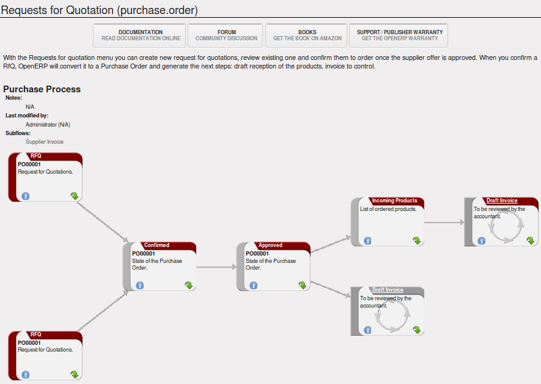
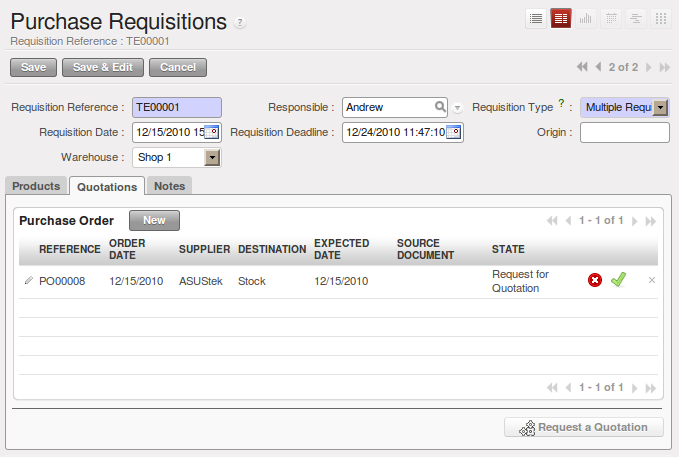
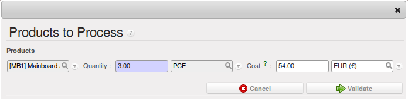

.. i18n: All the Elements of a Complete Workflow
.. i18n: =======================================
..

完备的采购工作流程
=======================================

.. i18n: The supplier or purchase order is the document that lets you manage price negotiations, control supplier invoices, handle goods receipts and synchronize all of these documents.
..

供应商或者采购订单，让你管理价格谈判，管理采购发票，处理货物收据并同步这些内容。

.. i18n: Let us start by looking at the following order workflow:
..

让我们一起看看下面的订单流程：

.. i18n: #. Price request to the supplier,
.. i18n: 
.. i18n: #. Confirmation of purchase,
.. i18n: 
.. i18n: #. Receipt and control of products,
.. i18n: 
.. i18n: #. Control of invoicing.
..

#. 向供应商询价，

#. 确认采购，

#. 收货和产品管理，

#. 发票管理。

.. i18n: Setting up your Database
.. i18n: ------------------------
..

设置数据库
-------------

.. i18n: To set up a system for these examples, create a new database with demonstration data in it, and
.. i18n: select the :guilabel:`Extended` interface when you log in as the *admin* user. You can enter your own
.. i18n: company details when asked, or just use the default if you want.
..

要配置一个新的系统使用这些例子，先创建一个有示例数据的数据库，用 *admin* 登录系统，选择 :guilabel:`Extended` 。
输入您公司的信息，或者您愿意的化也可以用默认的内容。

.. i18n: .. index::
.. i18n:    single: module; purchase 
..

.. index::
   single: module; purchase

.. i18n: Then, using the Configuration Wizard, select :guilabel:`Purchase Management` in the :guilabel:`Install Applications` section to install the :mod:`purchase` module, which also installs several other modules as dependencies. Continue
.. i18n: the remainder of this chapter logged in as the *admin* user.
..

然后使用配置向导，在 :guilabel:`Install Applications` 中，选择 :guilabel:`Purchase Management` 安装 :mod:`purchase` 采购模块，
同时会安装几个依赖模块。在这章的其他部分都用*admin*登录

.. i18n: Price Request from the Supplier
.. i18n: -------------------------------
..

从供应商询价
------------

.. i18n: To enter data for a new supplier price request (i.e. request for quotation), use the menu :menuselection:`Purchases --> Purchase Management -->
.. i18n: Request for Quotation`. When you click :guilabel:`New`, OpenERP opens a blank request for quotation form that you use for requesting prices from a supplier. This is shown in the figure :ref:`fig-pfrm`. If the price request came from an automatic procurement created by OpenERP, you will find a reference to the document that generated the request in the :guilabel:`Origin` field.
..

选择菜单 :menuselection:`采购(Purchases) --> 采购管理(Purchase Management) --> 采购询价(Request for Quotation)` ，
输入一个新的询价（例如,request for quotation）。点击 :guilabel:`新建(New)` ，OpenERP打开一个空的询价表单，
用来输入从供应商询到的价格。如图所示 :ref:`fig-pfrm` 。如果询价是OpenERP自动处理，
您可以看到一个引用文档，在询价的 :guilabel:`Origin` 字段。

.. i18n: .. _fig-pfrm:
.. i18n: 
.. i18n: .. figure:: images/purchase_form.png
.. i18n:    :scale: 75
.. i18n:    :align: center
.. i18n: 
.. i18n:    *Data Entry for a Purchase Order*
..

.. _fig-pfrm:

.. figure:: images/purchase_form.png
   :scale: 75
   :align: center

   *采购订单的数据入口*

.. i18n: .. index::
.. i18n:    single: module; warning
..

.. index::
   single: module; warning

.. i18n: .. note:: Managing Alerts
.. i18n: 
.. i18n:         If you install the :mod:`warning` module, you will be able to define alerts that appear when the purchaser enters a price request or order. You can set alerts on the product and on the supplier.
..

.. note:: 警告管理

如果您安装了 :mod:`warning` 模块，你可以定义警告，当采购员输入一个价格请求的时候，警告将显现出来。
您可以为产品或者供应商设置警告。

.. i18n: The internal reference, the date and the warehouse the products should be delivered to, are completed automatically by OpenERP, but you can change these values if needed. Next, when you select a supplier, OpenERP automatically completes the contact address for the supplier. The pricelist is also automatically completed from the pricelist in the supplier form. This should bring in all of the conditions that you have negotiated with the supplier for a given period.
..

默认情况下, 采购日期,仓库以及产品的交货期会自动生成,当然,如果需要的话这些值你也可以更改. 接着选定供应商后,
供应商默认的收货人(或者默认的联系人)以及同该供应商达成的采购价格表(采购协议)也会自动带出,
 
.. i18n: .. tip:: Supplier Selection
.. i18n: 
.. i18n:         Searching for a supplier is limited to all of the partners in the system that have the :guilabel:`Supplier` checkbox checked. If you do not find your supplier, it might be worth checking the whole list of all partners to make sure that the supplier does not yet exist without the Supplier checkbox being checked.
..

.. tip:: 供应商

        如果你发现在系统找不到你录入的供应合作伙伴,那你就需要确认在录入合作伙伴的时候,是否已经将 :guilabel:`供应商` 的勾选项勾上了. 如果忘记了,请到合作伙伴列表中找到它,并勾选上.

.. i18n: Once the main body of the purchase order has been completed, you can enter the product lines.
..

采购订单主体部分输入完成后,就可以录入采购订单明细行了.

.. i18n: .. figure:: images/purchase_line_form.png
.. i18n:    :scale: 75
.. i18n:    :align: center
.. i18n: 
.. i18n:    *Purchase Order Line*
..

.. figure:: images/purchase_line_form.png
   :scale: 75
   :align: center

   *采购订单明细行*

.. i18n: When you have selected the product, OpenERP automatically completes the other fields in the form:

当你选择了产品后, OpenERP 会自动填充其它字段:

.. i18n: * :guilabel:`Product UoM`, taken from the :guilabel:`Purchase Unit of Measure` field in the product form,
.. i18n: 
.. i18n: * The :guilabel:`Description` of the product in the supplier's language,
.. i18n: 
.. i18n: * :guilabel:`Scheduled Date`, calculated from the order date and the delivery lead time for the supplier (for the given product),
.. i18n: 
.. i18n: * :guilabel:`Unit Price`, taken from the supplier's pricelist,
.. i18n: 
.. i18n: * :guilabel:`Taxes`, taken from the information on the product form and partner form,
.. i18n:   depending on the rules seen in :ref:`Financial Analysis <ch-financial>`.
..

* :guilabel:`单位`, 默认与对应产品的对应的 :guilabel:`采购单位`,

* :guilabel:`描述`, 按供应商语言翻译的产品描述,

* :guilabel:`采购日期`, 按对应产品定义的供应商的提前供货周期计算出的计划采购执行日期,

* :guilabel:`单价`, 来自系统定义的供应商价格表,

* :guilabel:`税`, 从产品与供应商定义中得出的应缴纳的各种税, 还取决于 :ref:`Financial Analysis <ch-finanicial>` 中定义的各种规则.

.. i18n: .. tip:: Product Wording and Code
.. i18n: 
.. i18n:         When you enter supplier names in the product form, you can set a name and a product code for each individual supplier. If you do that, OpenERP will then use those details instead of your own internal product names for that selected supplier.
..

.. tip:: 产品命名及多形式编码

        当你选择了供应商后, 系统还能将你录入的产品及产品编码替换为你单独为这个供应商指定的 供应商的产品名称以及供应商的产品代码.

.. i18n: If you work with management by case, you can also set the analytic account that should be used to
.. i18n: report all the purchase costs. The costs will then be reported at the receipt of the supplier
.. i18n: invoice.
..

如果你想按项目来管理采购成本, 你可以使用辅助核算科目来完成, 所有项目的采购成本是基于该项目的供应商发票而核算出来的成本.

.. i18n: .. index::
.. i18n:    single: module; purchase_analytic_analysis
..

.. index::
   single: module; purchase_analytic_analysis

.. i18n: .. tip:: Management by Case
.. i18n: 
.. i18n:    Analytic accounts can be very useful for all companies that manage costs by case, by site, by
.. i18n:    project or by folder.
.. i18n:    To work with several analytic axes, you should install the module :mod:`purchase_analytic_plans`,
.. i18n:    by selecting :guilabel:`Purchase Analytic Plans` in the :guilabel:`Reconfigure` wizard and clicking
.. i18n:    :guilabel:`Configure`.
..

.. tip:: 按项目核算成本

   辅助核算在多公司的各种维度的成本核算上面发挥了相当重要的作用.
   为了让辅助核算能处理多维度, 你需要安装模块 :mod:`purchase_analytic_plans`, 并点击 :guilabel:`配置(Configure)` 中的 :guilabel:`重新配置(Reconfigure)`
   向导, 选中 :guilabel:`采购辅助核算方案(Purchase Analytic Plans)`.

.. i18n: .. index::
.. i18n:    single: module; account_analytic_default
.. i18n:    single: module; purchase_analytic_plans
..

.. index::
   single: module; account_analytic_default
   single: module; purchase_analytic_plans

.. i18n: To make sure that the analytic account is automatically selected according to the partner, the date, the
.. i18n: products or the user, you can install the module :mod:`account_analytic_default` (which is installed
.. i18n: automatically as a dependency of :mod:`purchase_analytic_plans`).
..

安装了模块 :mod:`account_analytic_default` (你安装模块 :mod:`purchase_analytic_plans` 的同时会自动安装这个模块) 后, 你就可以根据 `合作伙伴`
`日期` `产品`以及`登陆用户` 创建多种辅助科目默认值的规则,而自动选择匹配的默认核算科目.

.. i18n: In the :guilabel:`Notes` tab of the product line, you can enter a note that will be attached when the order
.. i18n: confirmation or price quotation is printed. This note can be predefined on the product form to
.. i18n: automatically appear on each order for that product. For example, you can enter “Do not forget to send
.. i18n: by express delivery as specified in our contract reference 1234.”
..

在采购订单明细里添加产品时你可以添加一个 :guilabel:`备注(Notes)` , 这个备注会在订单确认及询价函中附加传递给供应商.
而且这个备注也可以放在产品定义窗体中, 以便每次选择该产品时自动带出. 如: 你可以输入类似"Do not forget to send
by express delivery as specified in our contract reference 1234."

.. i18n: Once the document has been completed, you can print it as a price estimate to send to
.. i18n: the supplier. You can set a note for the attention of the supplier in the form's third tab.
..

订单制单完成后, 你可以将其打印做为询价函发送给供应商. 你还可以在单据第三页签添加一些供应商的备注信息.

.. i18n: .. figure:: images/purchase_quotation.png
.. i18n:    :scale: 75
.. i18n:    :align: center
.. i18n: 
.. i18n:    *Printing the Supplier Price Quotation*
..

.. figure:: images/purchase_quotation.png
   :scale: 75
   :align: center

   *打印采购询价函*

.. i18n: Then leave the document in the ``Request for Quotation`` state. When you receive a response from the supplier, use the menu
.. i18n: :menuselection:`Purchases --> Purchase Management --> Requests for Quotation`. Select the
.. i18n: order and complete its details.
..

当询价函得到供应商的反馈后, 要将询价 ``转为订单`` 或者 ``取消`` 该询价,只需要点击菜单 :menuselection:`采购(Purchase) --> 采购管理(Purchase Management) --> 询价单(Request for Quotation)` 后,
进入相关单据点击相应的操作按钮即可.

.. i18n: When you want to approve the order, use the button :guilabel:`Convert to Purchase Order`. The price
.. i18n: request then passes into the ``Approved`` state. 
.. i18n: No further changes are possible.
..

当确认该询价订单时,只需要点 :guilabel:`转换为采购订单`, 这里询价单的价格就被确认,后续采购流程再也不能更改.

.. i18n: .. figure:: images/purchase_process.png
.. i18n:    :scale: 75
.. i18n:    :align: center
.. i18n: 
.. i18n:    *Purchase Order Process*
..

   *采购订单处理流程*

.. i18n: Goods Receipt
.. i18n: -------------
..

收货
-------------

.. i18n: Once the order has been approved, OpenERP automatically prepares the goods receipt order in the
.. i18n: draft state for you. To get a list of the products you are waiting for from your suppliers, use the
.. i18n: menu :menuselection:`Warehouse --> Warehouse Management --> Incoming Shipments`.
..

当采购订单确认后, OpenERP 会自动生成准备状态的收货单, 要看有哪些产品是准备收货状态,进菜单 :menuselection:`仓库(Warehouse) --> 仓库管理(Warehouse Management) --> 收货(Incoming Shipments)` . 

.. i18n: .. tip:: Purchasing Services
.. i18n: 
.. i18n:     If you buy services from your supplier, OpenERP does not generate a goods receipt note.
.. i18n:     There is no service receipt equivalent to a goods receipt.
..

.. tip:: 服务类型产品的采购

    如果你向供应商采购服务类型的产品, OpenERP 不会生成相应的收货单, 在OpenERP中,服务类型的产品是没有收货操作的.

.. i18n: Select the document that corresponds to the item that you are receiving. Usually, the goods receipt
.. i18n: note is found by making a search on the order reference or the supplier name. You can then confirm
.. i18n: the receipt of the products.
..

收货时通常根据订单编号或者供应商名称进行筛选,然后选择适合的收货条目进行收货产生相应的供应商收货凭据.

.. i18n: As described in :ref:`ch-stocks`, if you receive only part of the order, OpenERP
.. i18n: manages the remainder of that order.
.. i18n: A second receipt note is then automatically created for the goods not received.
.. i18n: You can cancel it if you think that you will never receive the remaining products.
..

正如 :ref:`ch-stocks` 所讲, 在OpenERP中, 采购订单部分收货流程也相当棒.收一次货后会自动创建余下的收货明细,当你觉得可
以不用收余下的货品时,你可以随时取消.

.. i18n: After receiving the goods, OpenERP will show you which orders are open and the state of their
.. i18n: receipt and invoicing if you return to the list of orders.
..

收货操作后, 会跳转到采购订单列表页中, 在这个列表里,你可以清楚地了解到每个订单的收货情况及发票开具情况.

.. i18n: .. figure:: images/purchase_list.png
.. i18n:    :scale: 75
.. i18n:    :align: center
.. i18n: 
.. i18n:    *List of Open Orders, and their Receipt and Invoice Status*
..

.. figure:: images/purchase_list.png
   :scale: 75
   :align: center

   *采购订单列表及收货,发票进度*

.. i18n: Control of Invoicing
.. i18n: --------------------
..

开发票管理
--------------------

.. i18n: To control supplier invoicing, OpenERP provides three systems as standard, which can differ order
.. i18n: by order:
..

采购发票的开票控制在OpenERP中可以有三种情形,而且可以每次采购使用不同的开票方式:

.. i18n: * :guilabel:`From Order` : invoicing based on quantities ordered,
.. i18n: 
.. i18n: * :guilabel:`From Picking` : invoicing based on quantities received,
.. i18n: 
.. i18n: * :guilabel:`Manual` : manual invoicing.
..

* :guilabel:`基于订单` : 当订单确认时,就开据采购发票(挂应付款项),

* :guilabel:`基于收货` : 只在收货的时候开具采购发票,

* :guilabel:`手工开票` : 由人工控制什么时候开采购发票挂应收账.

.. i18n: The mode of invoicing control is set in the second tab of the purchase order in the field
.. i18n: :guilabel:`Invoicing Control`.
..

发票开票方式在采购单的第二个页签的 :guilabel:`开票方式(Invoicing Control)` 字段来选择.

.. i18n: .. figure:: images/purchase_form_tab2.png
.. i18n:    :scale: 75
.. i18n:    :align: center
.. i18n: 
.. i18n:    *Purchase Order, Invoice Control*
..

.. figure:: images/purchase_form_tab2.png
   :scale: 75
   :align: center

   *采购订单 与 发票开票*

.. i18n: .. tip:: Default Value
.. i18n: 
.. i18n:    A company generally uses a single invoicing control method for all of its invoices.
.. i18n:    So you are advised to set a default value in the :guilabel:`Invoicing Control` field after
.. i18n:    installation.
..

.. tip:: 默认值

   因为大多数公司的发票开票控制(什么时候开具采购收据)基本上是不会变动的. 所以,你可以在模块安装完成时就在 :guilabel:`开票方式(Invoicing Control)`
   里选择适当的值做为默认值.然后采购开票时,就会自动使用该默认值.

.. i18n: Control based on Orders
.. i18n: -----------------------
..

基于订单
-----------------------

.. i18n: If you selected your invoicing control based on orders, OpenERP will automatically generate a
.. i18n: supplier invoice in the draft state when the order is confirmed. You can obtain a list of invoices
.. i18n: waiting using the menu :menuselection:`Accounting --> Suppliers --> Supplier Invoices` and enabling
.. i18n: the ``Draft`` filter.
..

如果你的开票方式选择了 :guilabel:`基于订单(Base on Order)` , 确认采购订单时, OpenERP 会自动产生相应的供应商发票. 点击菜单
:menuselection:`会计(Accounting) --> 供应商(Suppliers) --> 供应商发票(Supplier Invoices)` 打开列表后, 点击 ``草稿(Draft)`` 
过滤,可以看到所有的 ``草稿(Draft)`` 状态的供应商发票.

.. i18n: When you receive a paper invoice from your supplier, all you need to do is validate the invoice pre-
.. i18n: generated by the system. Do not forget to check the price and the quantities. When the invoice is
.. i18n: confirmed, the accounting entries represent the cost of purchase and are automatically entered into
.. i18n: the system.
..

当你从供应商处收到真实供应商发票时,你就可以同系统中生成的发票进行核对数量与价格, 然后在系统中确认这些发票,这时
OpenERP会自动处理发票相关的采购成本会计凭证分录.

.. i18n: The supplier order is automatically set as ``Paid`` when you pay the supplier invoice.
..

同时, 相应的采购订单的发票状态也会显示为 ``已支付(Paid)``.

.. i18n: This method of controlling invoices is often used in service companies, because the invoiced amounts
.. i18n: correspond to the ordered amounts. In logistics, by contrast, you most often work with invoicing
.. i18n: controlled by goods receipt.
..

基于订单的开票方式一般用于服务类供应商,因为服务行业的开据的发票金额与订单的金额通常是一致的. 而大多数情况下
一般企业都通常采用基于收/发货单的开票方式.

.. i18n: Control based on Goods Receipt
.. i18n: ------------------------------
..

基于收/发货
------------------------------

.. i18n: To control your supplier invoices based on goods receipt, set the field :guilabel:`Invoicing
.. i18n: Control` on the second tab of the order to :guilabel:`From Picking`.
..

要在收货时才给供应商开据供应商发票的话, 需要在采购订单的第二个页签 :guilabel:`开票方式(Invoicing Control)` 字段处选择 :guilabel:`来自收/发货`.

.. i18n: In this case, no invoice, draft state or any other, is generated by the order. On the goods receipt
.. i18n: note, the field :guilabel:`Invoice Control` is set to :guilabel:`To Be Invoiced`.
..

在基于收/发货的开票方式时, 采购订单确认后,是不会生成任何的发票, 仅在收/发货单的 :guilabel:`开票方式(Invoice Control)` 处显示为 :guilabel:`发票待开(To Be Invoiced)` .

.. i18n: The storesperson can then receive different orders. If he wants to generate the draft invoice for a
.. i18n: goods receipt, he can click the action :guilabel:`Create Invoice`. OpenERP then asks you for the
.. i18n: journal for this invoice. It then opens that or the generated invoices (in the case of creating
.. i18n: invoices for several receipts at one time) which enables you to modify it before confirming it.
..

仓库管理员此时可以收/发货订单处理. 并且点单据 :guilabel:`创建发票(Create Invoice)` 按钮即可创建收货对应的草稿状态的供应商/客户发票.
此时,你可以再次核对该草稿发票数据, 并选择一个适当的 :guilabel:`帐簿(Journal)` 并确认该笔或多笔收/发货产生的发票.

.. i18n: This approach is useful when you receive the invoice at the same time as the item from the supplier.
.. i18n: Usually, invoices are sent by post some days later. In this case, the storesperson leaves the item
.. i18n: unchanged without generating an invoice. Then, once per day or once per week the accountant will
.. i18n: create the draft invoices based on all the receipts for the day. To do that, he uses the menu
.. i18n: :menuselection:`Purchases --> Invoice Control --> Purchase Lines Not Invoiced`. 
.. i18n: He clicks the action :guilabel:`Create invoices` to generate all draft invoices from
.. i18n: the list of receipts that have not yet been invoiced.
..

这种方式特别适合大部分供应商的货物与发票并不是同时送达的情况. 通常情况下, 发票总是迟于货物好几天送达. 在本范例中, 仓库管理员
并不在收到货物时生成发票. 而是由会计每天或者每周统一将近期的收/发货生成草稿发票. 点击菜单 :menuselection:`采购(Purchase) --> 发票控制(Invoice Control) --> 待开发票明细(Purchase Lines Not Invoiced)`
并点击 :guilabel:`创建发票(Create invoices)` 可以将列表中未开发票的收/发货生成草稿发票.

.. i18n: .. index::
.. i18n:    single: accountant
..

.. index::
   single: accountant

.. i18n: At that point, the accountant can decide if he wants to generate an invoice per item or group all items
.. i18n: for the same partner into the same invoice.
..

在这个时候, 会计可以决定是按收/发货明细产生多张发票或者按合作伙伴汇到一张发票上.

.. i18n: Invoices are then handled just like those controlled from ``On Order``. Once the invoice arrives at
.. i18n: the accounting service, he just compares it with the invoices waiting to control what the supplier
.. i18n: invoices you.
..

Invoices are then handled just like those controlled from ``On Order``. Once the invoice arrives at
the accounting service, he just compares it with the invoices waiting to control what the supplier
invoices you.

.. i18n: .. index::
.. i18n:    single: module; delivery
..

.. index::
   single: module; delivery

.. i18n: .. tip:: Delivery Charges
.. i18n: 
.. i18n:    To manage delivery charges, install the module :mod:`delivery` using the :guilabel:`Reconfigure` wizard
.. i18n:    and selecting :guilabel:`Delivery Costs` in :guilabel:`Sales Application Configuration` section.
.. i18n:    This will automatically add delivery charges to the creation of the draft invoice as a function
.. i18n:    of the products delivered or ordered.
..

.. tip:: 相关物流费用

   要管理物流运输费用, 你需要安装 :mod:`delivery` 模块, 并在 :guilabel:`配置(Reconfigure)` 向导中 :guilabel:`销售配置(Sale Application Configuration)` 选择 :guilabel:`运输成本(Delivery Costs`.
   安装完毕后, 在产品收/发货或者订单确认时产生的发票中, 会自动添加上相关的运输物流费用.

.. i18n: .. index:: 
.. i18n:    single: tender
.. i18n:    single: purchase; tender
..

.. index:: 
   single: tender
   single: purchase; tender

.. i18n: Tenders
.. i18n: -------
..

招标
-------

.. i18n: .. index::
.. i18n:    single: module; purchase_tender
..

.. index::
   single: module; purchase_tender

.. i18n: To manage tenders, you should use the module :mod:`purchase_requisition`, installed via the
.. i18n: :guilabel:`Purchase Requisition` option in the :guilabel:`Reconfigure` wizard.
.. i18n: This lets you create several
.. i18n: supplier price requests for a single supply requirement. Once the module is installed, OpenERP adds
.. i18n: a new :menuselection:`Purchase Requisitions` menu in :menuselection:`Purchases --> Purchase Management`. You can then define the new tenders.
..

招标管理,你要安装 :mod:`purchase_requisition` 模块, 并在安装模块后的 :guilabel:`配置(Reconfigure)` 向导里选择
:guilabel:`采购申请(Purchase Requistion)`.
这样你就可以向多个供应商发出询价,从其中选择一个. 模块安装后, 请求菜单项为: :menuselection:`采购(Purchase) --> 采购管理(Purchase management) --> 采购询价(Purchase Requisitions)`.

.. i18n: .. figure:: images/purchase_tender.png
.. i18n:    :scale: 75
.. i18n:    :align: center
.. i18n: 
.. i18n:    *Defining a Tender*
..

   *定义一个投标方*

.. i18n: To enter data for a new tender, use the menu :menuselection:`Purchases --> Purchase Management -->
.. i18n: Purchase Requisitions` and select :guilabel:`New`. OpenERP then opens a new blank tender form. The reference number
.. i18n: is set by default and you can enter information about your tender in the other fields.
..

To enter data for a new tender, use the menu :menuselection:`Purchases --> Purchase Management -->
Purchase Requisitions` and select :guilabel:`New`. OpenERP then opens a new blank tender form. The reference number
is set by default and you can enter information about your tender in the other fields.

.. i18n: If you want to enter a supplier's response to your tender request, add a new
.. i18n: draft purchase order into the list on the :guilabel:`Quotation` tab of your tender document. 
.. i18n: If you want to revise a supplier price in response to negotiations, edit any 
.. i18n: appropriate purchase order that you have left in the draft state and link that to the tender. 
..

If you want to enter a supplier's response to your tender request, add a new
draft purchase order into the list on the :guilabel:`Quotation` tab of your tender document. 
If you want to revise a supplier price in response to negotiations, edit any 
appropriate purchase order that you have left in the draft state and link that to the tender. 

.. i18n: When one of the orders about a tender is confirmed, all of the other orders are automatically
.. i18n: cancelled by OpenERP if you selected the Purchase Requisition (exclusive) type. That enables you to accept just one order for a particular tender. If you select Multiple requisitions, you can approve several purchase orders without cancelling other orders from this tender.
..

When one of the orders about a tender is confirmed, all of the other orders are automatically
cancelled by OpenERP if you selected the Purchase Requisition (exclusive) type. That enables you to accept just one order for a particular tender. If you select Multiple requisitions, you can approve several purchase orders without cancelling other orders from this tender.

.. i18n: Price Revisions
.. i18n: ---------------
..

价格版本
---------------

.. i18n: OpenERP supports several methods of calculating and automatically updating product costs:
..

OpenERP有多种方法计算更新产品成本:

.. i18n: * Standard Price: manually fixed, and
.. i18n: 
.. i18n: * Standard Price: revalued automatically and periodically,
.. i18n: 
.. i18n: * Average Price: updated at each receipt to the warehouse.
..

* 标准价格(Standard Price): 手工更新产品标准价,

* 标准价格(Standard Price): 定期自动更新产品标准价,

* 平均价(Average Price): 每次收货时更新产品标准价.

.. i18n: This cost is used to value your stock and represents your product costs. Included in that cost is
.. i18n: everything directly related to the received cost. You could include such elements as:
..

产品成本价表示你库存产品的价值. 影响库存产品成本有很多因素, 大致包含有下面的几部分:

.. i18n: * supplier price,
.. i18n: 
.. i18n: * delivery charges,
.. i18n: 
.. i18n: * manufacturing costs,
.. i18n: 
.. i18n: * storage charges.
..

* 采购价格,

* 运送费用,

* 制造成本,

* 仓储费用.

.. i18n: Standard Price
.. i18n: ^^^^^^^^^^^^^^
..

标准价格
^^^^^^^^^^^^^^

.. i18n: The mode of price management for the product is shown in the tab :guilabel:`Information` on the product form.
.. i18n: On each individual product, you can select if you want to work in ``Standard Price`` or on weighted ``Average Price``.
..

产品的标准价格可以在产品窗体的 :guilabel:`其他信息(Information)` 中看到, 每个产品的标准价可以单独设置.并且你可以在 ``标准价格``
与 ``平均价格`` 间做出适当的选择.

.. i18n: .. tip:: Simplified Interface
.. i18n: 
.. i18n:    If you work in the ``Simplified`` interface mode you will not see the field that lets you
.. i18n:    manage the price calculation mode for a product. In that case, the default value is ``Standard Price``.
..

.. tip:: 简化界面

   If you work in the ``Simplified`` interface mode you will not see the field that lets you
   manage the price calculation mode for a product. In that case, the default value is ``Standard Price``.

.. i18n: The ``Standard Price`` setting means that the product cost is fixed manually for each product in the field
.. i18n: :guilabel:`Cost Price`. This is usually revalued once a year based on the average of purchase costs
.. i18n: or manufacturing costs.
..

The ``Standard Price`` setting means that the product cost is fixed manually for each product in the field
:guilabel:`Cost Price`. This is usually revalued once a year based on the average of purchase costs
or manufacturing costs.

.. i18n: You usually use standard costs to manage products where the price hardly changes over the course of
.. i18n: the year. For example, the standard cost could be used to manage books, or the cost of bread.
..

You usually use standard costs to manage products where the price hardly changes over the course of
the year. For example, the standard cost could be used to manage books, or the cost of bread.

.. i18n: Those costs that can be fixed for the whole year bring certain advantages:
..

Those costs that can be fixed for the whole year bring certain advantages:

.. i18n: * you can base the sale price on the product cost and then work with margins rather than 
.. i18n:   a fixed price per product,
.. i18n: 
.. i18n: * accounting is simplified because there is a direct relationship between the value of stock and the
.. i18n:   number of items received.
..

* you can base the sale price on the product cost and then work with margins rather than 
  a fixed price per product,

* accounting is simplified because there is a direct relationship between the value of stock and the
  number of items received.

.. i18n: .. index::
.. i18n:    single: module; product_extended
..

.. index::
   single: module; product_extended

.. i18n: To get an automated periodic revaluation of the standard price you can use the action :guilabel:`Update`
.. i18n: on the product form, enabling you to update prices of all the selected products. 
.. i18n: OpenERP then recalculates the price of the products as a function of the cost of raw materials and the
.. i18n: manufacturing operations given in the routing.
..

To get an automated periodic revaluation of the standard price you can use the action :guilabel:`Update`
on the product form, enabling you to update prices of all the selected products. 
OpenERP then recalculates the price of the products as a function of the cost of raw materials and the
manufacturing operations given in the routing.

.. i18n: Average Price
.. i18n: ^^^^^^^^^^^^^
..

平均价格
^^^^^^^^^^^^^

.. i18n: Working with standard prices does not lend itself well to the management of the cost price of products
.. i18n: when the prices change a lot with the state of the market. This is the case for many commodities and
.. i18n: energy.
..

Working with standard prices does not lend itself well to the management of the cost price of products
when the prices change a lot with the state of the market. This is the case for many commodities and
energy.

.. i18n: In this case, you would want OpenERP to automatically set the price in response to each goods receipt movement
.. i18n: into the warehouse. The deliveries (exit from stock) have no impact on the product price.
..

In this case, you would want OpenERP to automatically set the price in response to each goods receipt movement
into the warehouse. The deliveries (exit from stock) have no impact on the product price.

.. i18n: .. tip:: Calculating the Price
.. i18n: 
.. i18n:    At each goods receipt, the product price is recalculated using the following accounting formula:
.. i18n:    NP = (OP * QS + PP * QR) / (QS + QR), where the following notation is used:
.. i18n: 
.. i18n:    * NP: New Price,
.. i18n: 
.. i18n:    * OP: Old Price,
.. i18n: 
.. i18n:    * QS: Quantity actually in Stock,
.. i18n: 
.. i18n:    * PP: Price Paid for the quantity received,
.. i18n: 
.. i18n:    * QR: Quantity Received.
..

.. tip:: Calculating the Price

   At each goods receipt, the product price is recalculated using the following accounting formula:
   NP = (OP * QS + PP * QR) / (QS + QR), where the following notation is used:

   * NP: New Price,

   * OP: Old Price,

   * QS: Quantity actually in Stock,

   * PP: Price Paid for the quantity received,

   * QR: Quantity Received.

.. i18n: If the products are managed as a weighted average, OpenERP will open a
.. i18n: window that lets you specify the price of the product received at each goods receipt. 
.. i18n: The purchase price is, by default,
.. i18n: set from the purchase order, but you can change the price to add the cost of
.. i18n: delivery to the various received products, for example.
..

If the products are managed as a weighted average, OpenERP will open a
window that lets you specify the price of the product received at each goods receipt. 
The purchase price is, by default,
set from the purchase order, but you can change the price to add the cost of
delivery to the various received products, for example.

.. i18n: .. figure:: images/purchase_pmp.png
.. i18n:    :scale: 75
.. i18n:    :align: center
.. i18n: 
.. i18n:    *Goods Receipt of Products managed in Weighted Average*
..

   *Goods Receipt of Products managed in Weighted Average*

.. i18n: Once the receipt has been confirmed, the price is automatically recalculated and entered on the
.. i18n: product form.
..

Once the receipt has been confirmed, the price is automatically recalculated and entered on the
product form.

.. i18n: .. Copyright © Open Object Press. All rights reserved.
..

.. Copyright © Open Object Press. All rights reserved.

.. i18n: .. You may take electronic copy of this publication and distribute it if you don't
.. i18n: .. change the content. You can also print a copy to be read by yourself only.
..

.. You may take electronic copy of this publication and distribute it if you don't
.. change the content. You can also print a copy to be read by yourself only.

.. i18n: .. We have contracts with different publishers in different countries to sell and
.. i18n: .. distribute paper or electronic based versions of this book (translated or not)
.. i18n: .. in bookstores. This helps to distribute and promote the OpenERP product. It
.. i18n: .. also helps us to create incentives to pay contributors and authors using author
.. i18n: .. rights of these sales.
..

.. We have contracts with different publishers in different countries to sell and
.. distribute paper or electronic based versions of this book (translated or not)
.. in bookstores. This helps to distribute and promote the OpenERP product. It
.. also helps us to create incentives to pay contributors and authors using author
.. rights of these sales.

.. i18n: .. Due to this, grants to translate, modify or sell this book are strictly
.. i18n: .. forbidden, unless Tiny SPRL (representing Open Object Press) gives you a
.. i18n: .. written authorisation for this.
..

.. Due to this, grants to translate, modify or sell this book are strictly
.. forbidden, unless Tiny SPRL (representing Open Object Press) gives you a
.. written authorisation for this.

.. i18n: .. Many of the designations used by manufacturers and suppliers to distinguish their
.. i18n: .. products are claimed as trademarks. Where those designations appear in this book,
.. i18n: .. and Open Object Press was aware of a trademark claim, the designations have been
.. i18n: .. printed in initial capitals.
..

.. Many of the designations used by manufacturers and suppliers to distinguish their
.. products are claimed as trademarks. Where those designations appear in this book,
.. and Open Object Press was aware of a trademark claim, the designations have been
.. printed in initial capitals.

.. i18n: .. While every precaution has been taken in the preparation of this book, the publisher
.. i18n: .. and the authors assume no responsibility for errors or omissions, or for damages
.. i18n: .. resulting from the use of the information contained herein.
..

.. While every precaution has been taken in the preparation of this book, the publisher
.. and the authors assume no responsibility for errors or omissions, or for damages
.. resulting from the use of the information contained herein.

.. i18n: .. Published by Open Object Press, Grand Rosière, Belgium
..

.. Published by Open Object Press, Grand Rosière, Belgium
