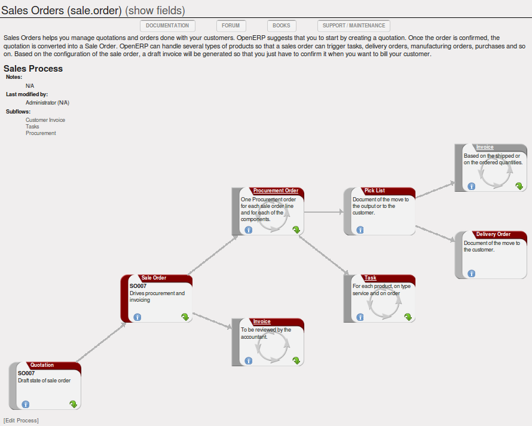
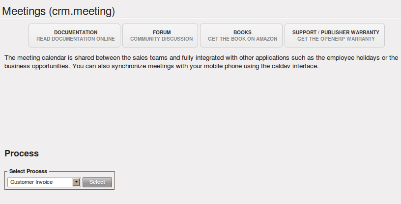
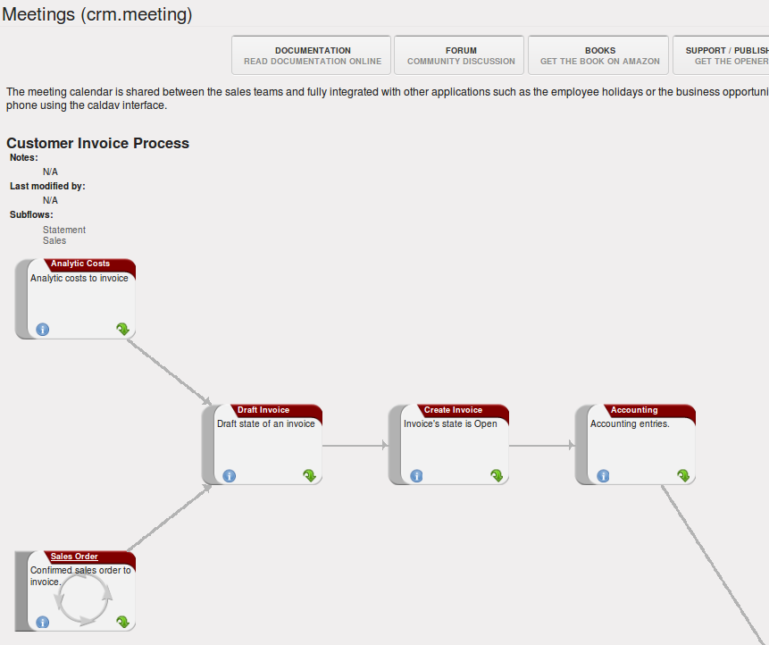
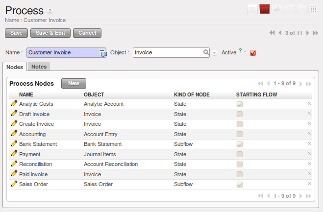
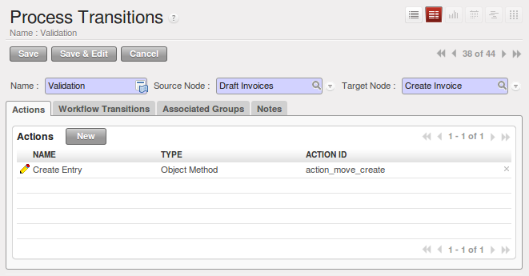

.. i18n: .. index:: 
.. i18n:    single: process
.. i18n:    single: workflow
..

.. index:: 
   single: process
   single: workflow

.. i18n: Workflows and User Processes
.. i18n: ============================
..

工作流和用户处理
============================

.. i18n: Workflows are used to define the behaviour of a given document. They are used
.. i18n: by developers and system implementers to determine which object should execute
.. i18n: which actions and at which moments. These are principally technical processes
.. i18n: defined in a vertical way on the lifecycle of a complete object (represented by
.. i18n: a document). Changing a workflow will have a direct impact on the behaviour of
.. i18n: the software in response to user actions. You handle all possible exceptions
.. i18n: there, so that the software is robust.
..

Workflows are used to define the behaviour of a given document. They are used
by developers and system implementers to determine which object should execute
which actions and at which moments. These are principally technical processes
defined in a vertical way on the lifecycle of a complete object (represented by
a document). Changing a workflow will have a direct impact on the behaviour of
the software in response to user actions. You handle all possible exceptions
there, so that the software is robust.

.. i18n: .. figure:: images/process_sale_workflow.png
.. i18n:    :scale: 75
.. i18n:    :align: center
.. i18n: 
.. i18n:    *Example of a workflow handling a customer order*
..

.. figure:: images/process_sale_workflow.png
   :scale: 75
   :align: center

   *Example of a workflow handling a customer order*

.. i18n: Unlike workflows, user processes represent workflows across all of a company
.. i18n: and its documents. They are used by end-users to locate an action for more
.. i18n: complete handling. A change of user process will not have any effect on the
.. i18n: software but will show the user another way of working on a given problem.
..

Unlike workflows, user processes represent workflows across all of a company
and its documents. They are used by end-users to locate an action for more
complete handling. A change of user process will not have any effect on the
software but will show the user another way of working on a given problem.

.. i18n: .. figure:: images/process_sale_process.png
.. i18n:    :scale: 75
.. i18n:    :align: center
.. i18n: 
.. i18n:    *Example of a process handling a customer order*
..

   *Example of a process handling a customer order*

.. i18n: Processes are used by end-users to help them understand the problems which
.. i18n: have not been handled in OpenERP. You can find actions that have no influence
.. i18n: on the software, such as “Telephone customer to thank him”, and “Send a fax to
.. i18n: reassure them”. As well as providing user help, processes provide functions such
.. i18n: as:
..

Processes are used by end-users to help them understand the problems which
have not been handled in OpenERP. You can find actions that have no influence
on the software, such as “Telephone customer to thank him”, and “Send a fax to
reassure them”. As well as providing user help, processes provide functions such
as:

.. i18n: * integration with OpenERP Help and the company's quality manual,
.. i18n: 
.. i18n: * showing the user the menu for finding a specific document.
..

* integration with OpenERP Help and the company's quality manual,

* showing the user the menu for finding a specific document.

.. i18n: .. figure:: images/process_cross_worfklow_process.png
.. i18n:    :scale: 75
.. i18n:    :align: center
.. i18n: 
.. i18n:    *Relationship between workflow and user process*
..

.. figure:: images/process_cross_worfklow_process.png
   :scale: 75
   :align: center

   *Relationship between workflow and user process*

.. i18n: User processes are thus connected to technical workflows. If you modify the
.. i18n: software's behaviour with a workflow, the changes will be directly visible in
.. i18n: the user processes that are based on the modified document. So if you modify certain
.. i18n: transitions on a workflow they will automatically be
.. i18n: shown in the process corresponding to the modified document.
..

User processes are thus connected to technical workflows. If you modify the
software's behaviour with a workflow, the changes will be directly visible in
the user processes that are based on the modified document. So if you modify certain
transitions on a workflow they will automatically be
shown in the process corresponding to the modified document.

.. i18n: To get maximum benefit from the power of user processes and the workflow
.. i18n: engine, OpenERP provides an integrated workflow editor and user process
.. i18n: editor. These enable you to modify them through the client interface.
..

To get maximum benefit from the power of user processes and the workflow
engine, OpenERP provides an integrated workflow editor and user process
editor. These enable you to modify them through the client interface.

.. i18n: You will only work with the process editor in this chapter. If you want to view and edit the
.. i18n: workflow of a document, click on the link :guilabel:`Edit Workflow` to the right of the document.
.. i18n: OpenERP opens a graphical view of the workflow for the selected document type.
..

You will only work with the process editor in this chapter. If you want to view and edit the
workflow of a document, click on the link :guilabel:`Edit Workflow` to the right of the document.
OpenERP opens a graphical view of the workflow for the selected document type.

.. i18n: If you want to edit a workflow in a text-based editor, you can use the menus under
.. i18n: :menuselection:`Administration --> Customization --> Workflows`.
..

If you want to edit a workflow in a text-based editor, you can use the menus under
:menuselection:`Administration --> Customization --> Workflows`.

.. i18n: Using Processes Effectively
.. i18n: ---------------------------
..

有效使用流程
---------------------------

.. i18n: Regardless of which OpenERP screen you are in you can call up a process on the
.. i18n: current document by clicking the :guilabel:`Corporate Intelligence` (question mark) icon.
.. i18n: Depending on the document, you can have several processes defined using it.
.. i18n: OpenERP then asks you to choose which one of them you want.
..

Regardless of which OpenERP screen you are in you can call up a process on the
current document by clicking the :guilabel:`Corporate Intelligence` (question mark) icon.
Depending on the document, you can have several processes defined using it.
OpenERP then asks you to choose which one of them you want.

.. i18n: For example, if you are in a meeting form, OpenERP will ask you to choose from
.. i18n: the processes it knows about that involve such forms:
..

For example, if you are in a meeting form, OpenERP will ask you to choose from
the processes it knows about that involve such forms:

.. i18n: * processes for selecting and inducting new employees,
.. i18n: 
.. i18n: * tracing customer orders in pre-sales,
.. i18n: 
.. i18n: * processes for visiting customers and handling expenses.
..

* processes for selecting and inducting new employees,

* tracing customer orders in pre-sales,

* processes for visiting customers and handling expenses.

.. i18n: .. figure:: images/process_screen.png
.. i18n:    :scale: 75
.. i18n:    :align: center
.. i18n: 
.. i18n:    *Button for entering a user process from a form*
..

   *Button for entering a user process from a form*

.. i18n: The element colored red shows the active process for the selected document.
.. i18n: Elements in grey are the states that the selected document will not go through
.. i18n: because of its configuration. You can use the different icons to open the
.. i18n: document, print it, or get its documentation.
..

The element colored red shows the active process for the selected document.
Elements in grey are the states that the selected document will not go through
because of its configuration. You can use the different icons to open the
document, print it, or get its documentation.

.. i18n: Some states have an image inside of arrows formed into a circle. These show
.. i18n: that the state refers to another process. To go to this other process, you can
.. i18n: click on the title of the state. For example, you can click on the invoice in
.. i18n: the customer order management workflow to see in detail how that invoice is
.. i18n: handled.
..

Some states have an image inside of arrows formed into a circle. These show
that the state refers to another process. To go to this other process, you can
click on the title of the state. For example, you can click on the invoice in
the customer order management workflow to see in detail how that invoice is
handled.

.. i18n: .. figure:: images/process_subflow_icon.png
.. i18n:    :scale: 75
.. i18n:    :align: center
.. i18n: 
.. i18n:    *A state that refers to another workflow*
..

   *A state that refers to another workflow*

.. i18n: .. index::
.. i18n:    single: process; defining
..

.. index::
   single: process; defining

.. i18n: Defining your Own User Processes
.. i18n: --------------------------------
..

定义自己的用户流程
--------------------------------

.. i18n: Use the menus under :menuselection:`Administration --> Customization --> Enterprise Process` to
.. i18n: define new processes or modify existing processes. When entering a process,
.. i18n: OpenERP shows you the list of states available for that process.
..

Use the menus under :menuselection:`Administration --> Customization --> Enterprise Process` to
define new processes or modify existing processes. When entering a process,
OpenERP shows you the list of states available for that process.

.. i18n: .. figure:: images/process_form.png
.. i18n:    :scale: 75
.. i18n:    :align: center
.. i18n: 
.. i18n:    *Form for defining a process*
..

   *Form for defining a process*

.. i18n: You can add a new state or modify an existing state. A state can be associated
.. i18n: with an object (whose instances are represented by documents). If that is the
.. i18n: case, choose it in the case object. You can set an expression that shows if the
.. i18n: object can be found in that state or not. Expressions are in Python format. For
.. i18n: example, for the quotation state choose the object ``sale.order`` and set the
.. i18n: following expression ``object.state == 'draft'`` .
..

You can add a new state or modify an existing state. A state can be associated
with an object (whose instances are represented by documents). If that is the
case, choose it in the case object. You can set an expression that shows if the
object can be found in that state or not. Expressions are in Python format. For
example, for the quotation state choose the object ``sale.order`` and set the
following expression ``object.state == 'draft'`` .

.. i18n: You can also link to a menu so that users can learn which menu to use to access
.. i18n: objects in a state. You can set the conditions in which this object is in a
.. i18n: greyed-out state in the section :guilabel:`Conditions`. These expressions, too, are
.. i18n: encoded in Python format.
..

You can also link to a menu so that users can learn which menu to use to access
objects in a state. You can set the conditions in which this object is in a
greyed-out state in the section :guilabel:`Conditions`. These expressions, too, are
encoded in Python format.

.. i18n: Once the node has been defined, you should set the transitions leaving this
.. i18n: object. For each transition you can:
..

Once the node has been defined, you should set the transitions leaving this
object. For each transition you can:

.. i18n: * Give the leaving and destination states,
.. i18n: 
.. i18n: * Set up a list of buttons that start various transitions in the process,
.. i18n: 
.. i18n: * Map between workflow transitions and the document that is selected,
.. i18n: 
.. i18n: * Put an explanatory notice in different languages.
..

* Give the leaving and destination states,

* Set up a list of buttons that start various transitions in the process,

* Map between workflow transitions and the document that is selected,

* Put an explanatory notice in different languages.

.. i18n: .. figure:: images/process_transition_form.png
.. i18n:    :scale: 75
.. i18n:    :align: center
.. i18n: 
.. i18n:    *Screen for defining a process transition*
..

   *Screen for defining a process transition*

.. i18n: .. Copyright © Open Object Press. All rights reserved.
..

.. Copyright © Open Object Press. All rights reserved.

.. i18n: .. You may take electronic copy of this publication and distribute it if you don't
.. i18n: .. change the content. You can also print a copy to be read by yourself only.
..

.. You may take electronic copy of this publication and distribute it if you don't
.. change the content. You can also print a copy to be read by yourself only.

.. i18n: .. We have contracts with different publishers in different countries to sell and
.. i18n: .. distribute paper or electronic based versions of this book (translated or not)
.. i18n: .. in bookstores. This helps to distribute and promote the OpenERP product. It
.. i18n: .. also helps us to create incentives to pay contributors and authors using author
.. i18n: .. rights of these sales.
..

.. We have contracts with different publishers in different countries to sell and
.. distribute paper or electronic based versions of this book (translated or not)
.. in bookstores. This helps to distribute and promote the OpenERP product. It
.. also helps us to create incentives to pay contributors and authors using author
.. rights of these sales.

.. i18n: .. Due to this, grants to translate, modify or sell this book are strictly
.. i18n: .. forbidden, unless Tiny SPRL (representing Open Object Press) gives you a
.. i18n: .. written authorisation for this.
..

.. Due to this, grants to translate, modify or sell this book are strictly
.. forbidden, unless Tiny SPRL (representing Open Object Press) gives you a
.. written authorisation for this.

.. i18n: .. Many of the designations used by manufacturers and suppliers to distinguish their
.. i18n: .. products are claimed as trademarks. Where those designations appear in this book,
.. i18n: .. and Open Object Press was aware of a trademark claim, the designations have been
.. i18n: .. printed in initial capitals.
..

.. Many of the designations used by manufacturers and suppliers to distinguish their
.. products are claimed as trademarks. Where those designations appear in this book,
.. and Open Object Press was aware of a trademark claim, the designations have been
.. printed in initial capitals.

.. i18n: .. While every precaution has been taken in the preparation of this book, the publisher
.. i18n: .. and the authors assume no responsibility for errors or omissions, or for damages
.. i18n: .. resulting from the use of the information contained herein.
..

.. While every precaution has been taken in the preparation of this book, the publisher
.. and the authors assume no responsibility for errors or omissions, or for damages
.. resulting from the use of the information contained herein.

.. i18n: .. Published by Open Object Press, Grand Rosière, Belgium
..

.. Published by Open Object Press, Grand Rosière, Belgium
