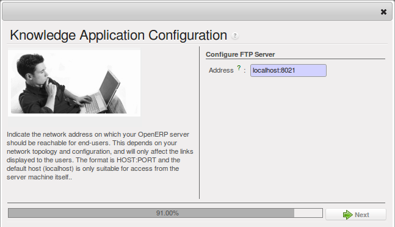

.. i18n: The OpenERP Solution
.. i18n: ====================
..

The OpenERP Solution
====================

.. i18n: OpenERP's management of documents is unique and totally innovative in its integrated approach. Its
.. i18n: complete integration with the company's management system solves most of the problems that are
.. i18n: encountered when you use independent document management systems:
..

OpenERP's management of documents is unique and totally innovative in its integrated approach. Its
complete integration with the company's management system solves most of the problems that are
encountered when you use independent document management systems:

.. i18n: * Login and the management of access rights is integrated with that of OpenERP for controlling
.. i18n:   access to different document types,
.. i18n: 
.. i18n: * Ultra-rapid access to documents, which are directly accessible through your email client or
.. i18n:   through the company management software,
.. i18n: 
.. i18n: * Automatic assignment of meta-information comes directly from information contained in your
.. i18n:   OpenERP login registration,
.. i18n: 
.. i18n: * Document workflow, which automatically follows OpenERP's documentation process, provides complete
.. i18n:   synchronization between the systems,
.. i18n: 
.. i18n: * Document classification is determined by OpenERP itself so that the structure that is created is
.. i18n:   always synchronized between the systems,
.. i18n: 
.. i18n: * Automatic indexation and classification of all documents produced by OpenERP for maximum
.. i18n:   efficiency.
..

* Login and the management of access rights is integrated with that of OpenERP for controlling
  access to different document types,

* Ultra-rapid access to documents, which are directly accessible through your email client or
  through the company management software,

* Automatic assignment of meta-information comes directly from information contained in your
  OpenERP login registration,

* Document workflow, which automatically follows OpenERP's documentation process, provides complete
  synchronization between the systems,

* Document classification is determined by OpenERP itself so that the structure that is created is
  always synchronized between the systems,

* Automatic indexation and classification of all documents produced by OpenERP for maximum
  efficiency.

.. i18n: Getting Started
.. i18n: ---------------
..

Getting Started
---------------

.. i18n: This section is about how to get started with the document management system from its installation
.. i18n: to advanced use with FTP access.
..

This section is about how to get started with the document management system from its installation
to advanced use with FTP access.

.. i18n: Installation
.. i18n: ^^^^^^^^^^^^
..

Installation
^^^^^^^^^^^^

.. i18n: .. index::
.. i18n:    single: module; document
.. i18n:    single: module; board_document
..

.. index::
   single: module; document
   single: module; board_document

.. i18n: To install OpenERP's document management system, you just need to install the :mod:`document`
.. i18n: and :mod:`document_ftp` modules through the :guilabel:`Reconfigure` wizard by selecting
.. i18n: :guilabel:`Knowledge Management`, and further on, :guilabel:`Shared Repositories (FTP)` for installation.
.. i18n: As the module installation proceeds, the system automatically proposes that you
.. i18n: configure the FTP server.
..

To install OpenERP's document management system, you just need to install the :mod:`document`
and :mod:`document_ftp` modules through the :guilabel:`Reconfigure` wizard by selecting
:guilabel:`Knowledge Management`, and further on, :guilabel:`Shared Repositories (FTP)` for installation.
As the module installation proceeds, the system automatically proposes that you
configure the FTP server.

.. i18n: .. figure::  images/document_config.png
.. i18n:    :scale: 75
.. i18n:    :align: center
.. i18n: 
.. i18n:    *Screen for configuring document management*
..

   *Screen for configuring document management*

.. i18n: Once the module has been installed, you will see a new entry in the main menu called :menuselection:`Knowledge`.
..

Once the module has been installed, you will see a new entry in the main menu called :menuselection:`Knowledge`.

.. i18n: .. figure::  images/document_menu.png
.. i18n:    :scale: 75
.. i18n:    :align: center
.. i18n: 
.. i18n:    *The Knowledge menu*
..

.. figure::  images/document_menu.png
   :scale: 75
   :align: center

   *The Knowledge menu*

.. i18n: .. Copyright © Open Object Press. All rights reserved.
..

.. Copyright © Open Object Press. All rights reserved.

.. i18n: .. You may take electronic copy of this publication and distribute it if you don't
.. i18n: .. change the content. You can also print a copy to be read by yourself only.
..

.. You may take electronic copy of this publication and distribute it if you don't
.. change the content. You can also print a copy to be read by yourself only.

.. i18n: .. We have contracts with different publishers in different countries to sell and
.. i18n: .. distribute paper or electronic based versions of this book (translated or not)
.. i18n: .. in bookstores. This helps to distribute and promote the OpenERP product. It
.. i18n: .. also helps us to create incentives to pay contributors and authors using author
.. i18n: .. rights of these sales.
..

.. We have contracts with different publishers in different countries to sell and
.. distribute paper or electronic based versions of this book (translated or not)
.. in bookstores. This helps to distribute and promote the OpenERP product. It
.. also helps us to create incentives to pay contributors and authors using author
.. rights of these sales.

.. i18n: .. Due to this, grants to translate, modify or sell this book are strictly
.. i18n: .. forbidden, unless Tiny SPRL (representing Open Object Press) gives you a
.. i18n: .. written authorisation for this.
..

.. Due to this, grants to translate, modify or sell this book are strictly
.. forbidden, unless Tiny SPRL (representing Open Object Press) gives you a
.. written authorisation for this.

.. i18n: .. Many of the designations used by manufacturers and suppliers to distinguish their
.. i18n: .. products are claimed as trademarks. Where those designations appear in this book,
.. i18n: .. and Open Object Press was aware of a trademark claim, the designations have been
.. i18n: .. printed in initial capitals.
..

.. Many of the designations used by manufacturers and suppliers to distinguish their
.. products are claimed as trademarks. Where those designations appear in this book,
.. and Open Object Press was aware of a trademark claim, the designations have been
.. printed in initial capitals.

.. i18n: .. While every precaution has been taken in the preparation of this book, the publisher
.. i18n: .. and the authors assume no responsibility for errors or omissions, or for damages
.. i18n: .. resulting from the use of the information contained herein.
..

.. While every precaution has been taken in the preparation of this book, the publisher
.. and the authors assume no responsibility for errors or omissions, or for damages
.. resulting from the use of the information contained herein.

.. i18n: .. Published by Open Object Press, Grand Rosière, Belgium
..

.. Published by Open Object Press, Grand Rosière, Belgium
