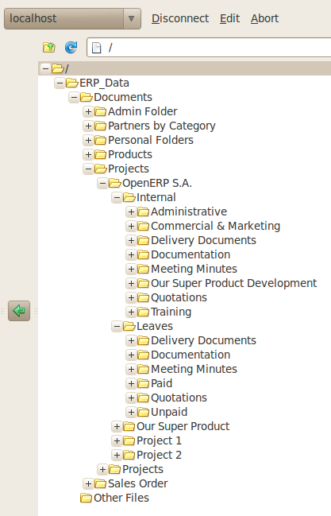

.. i18n: Standardizing Structures
.. i18n: ========================
..

标准结构
========================

.. i18n: You now have a configuration that enables you to automatically get a directory structure linked to
.. i18n: OpenERP for each resource, such as for projects and orders. The ideal situation would now be to
.. i18n: automatically structure the documents about projects, say for example, you could classify them
.. i18n: depending on their type:
..

You now have a configuration that enables you to automatically get a directory structure linked to
OpenERP for each resource, such as for projects and orders. The ideal situation would now be to
automatically structure the documents about projects, say for example, you could classify them
depending on their type:

.. i18n: * Quotations,
.. i18n: 
.. i18n: * Meeting Minutes,
.. i18n: 
.. i18n: * Delivery Documents,
.. i18n: 
.. i18n: * Documentation.
..

* Quotations,

* Meeting Minutes,

* Delivery Documents,

* Documentation.

.. i18n: OpenERP provides you with a system that lets you create a structure type for each type of a given
.. i18n: document. It then provides that classification for all documents in the directories structured in
.. i18n: that type.
..

OpenERP provides you with a system that lets you create a structure type for each type of a given
document. It then provides that classification for all documents in the directories structured in
that type.

.. i18n: So create the structure above for your project management system. To do that, create the four
.. i18n: directories above and give them the following data:
..

So create the structure above for your project management system. To do that, create the four
directories above and give them the following data:

.. i18n: * **Type** : Static Directory,
.. i18n: 
.. i18n: * **Parent Model** : Analytic Account.
..

* **Type** : Static Directory,

* **Parent Model** : Analytic Account.

.. i18n: Then in each project (represented by analytic accounts) you will get this substructure for
.. i18n: organizing your documents efficiently.
..

Then in each project (represented by analytic accounts) you will get this substructure for
organizing your documents efficiently.

.. i18n: .. figure::  images/document_shared_structure.png
.. i18n:    :scale: 75
.. i18n:    :align: center
.. i18n: 
.. i18n:    *Substructure common to all projects*
..

   *Substructure common to all projects*

.. i18n: .. tip:: Mapping
.. i18n: 
.. i18n:     In practice, OpenERP does not create directories or files for every resource.
.. i18n:     It actually manages this by mapping between OpenERP resources and the FTP interface.
.. i18n: 
.. i18n:     This approach gives a lot of flexibility because there is no synchronizing to do, nor any redundancy.
.. i18n:     Changes in either the document management system or in OpenERP will automatically be reflected
.. i18n:     over in the other side.
.. i18n: 
.. i18n:     And system resources are obviously not used up by storing things twice.
..

.. tip:: Mapping

    In practice, OpenERP does not create directories or files for every resource.
    It actually manages this by mapping between OpenERP resources and the FTP interface.

    This approach gives a lot of flexibility because there is no synchronizing to do, nor any redundancy.
    Changes in either the document management system or in OpenERP will automatically be reflected
    over in the other side.

    And system resources are obviously not used up by storing things twice.

.. i18n: Once a new project has been defined in OpenERP, the system automatically creates a directory
.. i18n: corresponding to the project in the right place in the document management system, and creates a
.. i18n: structure type there for classifying documents.
..

Once a new project has been defined in OpenERP, the system automatically creates a directory
corresponding to the project in the right place in the document management system, and creates a
structure type there for classifying documents.

.. i18n: .. Copyright © Open Object Press. All rights reserved.
..

.. Copyright © Open Object Press. All rights reserved.

.. i18n: .. You may take electronic copy of this publication and distribute it if you don't
.. i18n: .. change the content. You can also print a copy to be read by yourself only.
..

.. You may take electronic copy of this publication and distribute it if you don't
.. change the content. You can also print a copy to be read by yourself only.

.. i18n: .. We have contracts with different publishers in different countries to sell and
.. i18n: .. distribute paper or electronic based versions of this book (translated or not)
.. i18n: .. in bookstores. This helps to distribute and promote the OpenERP product. It
.. i18n: .. also helps us to create incentives to pay contributors and authors using author
.. i18n: .. rights of these sales.
..

.. We have contracts with different publishers in different countries to sell and
.. distribute paper or electronic based versions of this book (translated or not)
.. in bookstores. This helps to distribute and promote the OpenERP product. It
.. also helps us to create incentives to pay contributors and authors using author
.. rights of these sales.

.. i18n: .. Due to this, grants to translate, modify or sell this book are strictly
.. i18n: .. forbidden, unless Tiny SPRL (representing Open Object Press) gives you a
.. i18n: .. written authorisation for this.
..

.. Due to this, grants to translate, modify or sell this book are strictly
.. forbidden, unless Tiny SPRL (representing Open Object Press) gives you a
.. written authorisation for this.

.. i18n: .. Many of the designations used by manufacturers and suppliers to distinguish their
.. i18n: .. products are claimed as trademarks. Where those designations appear in this book,
.. i18n: .. and Open Object Press was aware of a trademark claim, the designations have been
.. i18n: .. printed in initial capitals.
..

.. Many of the designations used by manufacturers and suppliers to distinguish their
.. products are claimed as trademarks. Where those designations appear in this book,
.. and Open Object Press was aware of a trademark claim, the designations have been
.. printed in initial capitals.

.. i18n: .. While every precaution has been taken in the preparation of this book, the publisher
.. i18n: .. and the authors assume no responsibility for errors or omissions, or for damages
.. i18n: .. resulting from the use of the information contained herein.
..

.. While every precaution has been taken in the preparation of this book, the publisher
.. and the authors assume no responsibility for errors or omissions, or for damages
.. resulting from the use of the information contained herein.

.. i18n: .. Published by Open Object Press, Grand Rosière, Belgium
..

.. Published by Open Object Press, Grand Rosière, Belgium
