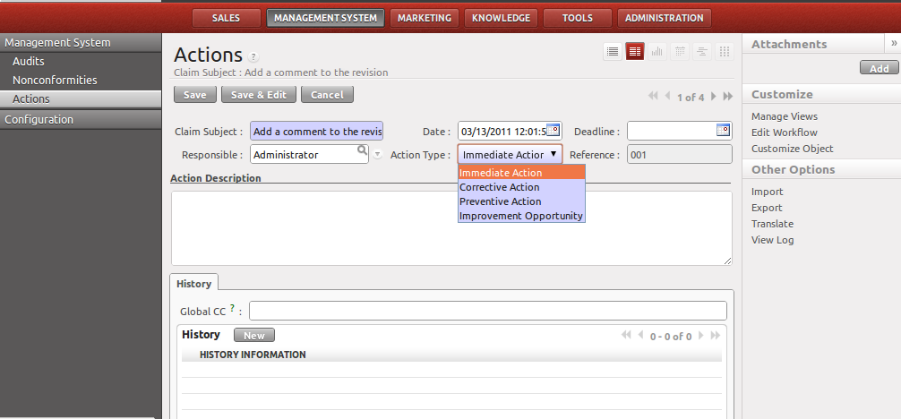

.. i18n: .. index:: Actions
..

.. index:: Actions

.. i18n: Actions
.. i18n: =======
..

动作
=======

.. i18n: .. index::
.. i18n:    single: actions
.. i18n:    single: module; mgmtsystem_action
..

.. index::
   single: actions
   single: module; mgmtsystem_action

.. i18n: You can create actions directly from the nonconformity or from the menu 
.. i18n: :menuselection:`Management System --> Management System --> Actions`.
..

You can create actions directly from the nonconformity 或者从菜单 
:menuselection:`Management System --> 管理系统 --> 动作`.

.. i18n: .. figure::  images/mgmtsystem_action.png
.. i18n:    :scale: 75
.. i18n:    :align: center
.. i18n: 
.. i18n:    *Immediate, corrective or preventive action*
..

   *Immediate, corrective or preventive action*

.. i18n: For each action, you give it a subject, a deadline, a user responsible for carrying 
.. i18n: out the action and a type: 
..

For each action, you give it a subject, a deadline, a user responsible for carrying 
out the action and a type: 

.. i18n:  * immediate action: an action that can be quickly closed (in less than a day).
.. i18n:  * corrective action: an action to solve the nonconformity.
.. i18n:  * preventive action: an action which makes sure you will not face the same 
.. i18n:    nonconformity once again in the future.
.. i18n:  * improvement opportunity: an action that might be relevant for you to implement. 
.. i18n:    You have to evaluate if it makes sense for your business.
..

 * immediate action: an action that can be quickly closed (in less than a day).
 * corrective action: an action to solve the nonconformity.
 * preventive action: an action which makes sure you will not face the same 
   nonconformity once again in the future.
 * improvement opportunity: an action that might be relevant for you to implement. 
   You have to evaluate if it makes sense for your business.

.. i18n: The person in charge of the action can then detail his different steps as internal 
.. i18n: note or email. Once the action has proven to be completed and efficient, the action 
.. i18n: is closed.
..

The person in charge of the action can then detail his different steps as internal 
note or email. Once the action has proven to be completed and efficient, the action 
is closed.

.. i18n: .. Copyright © Open Object Press. All rights reserved.
..

.. Copyright © Open Object Press. All rights reserved.

.. i18n: .. You may take electronic copy of this publication and distribute it if you don't
.. i18n: .. change the content. You can also print a copy to be read by yourself only.
..

.. You may take electronic copy of this publication and distribute it if you don't
.. change the content. You can also print a copy to be read by yourself only.

.. i18n: .. We have contracts with different publishers in different countries to sell and
.. i18n: .. distribute paper or electronic based versions of this book (translated or not)
.. i18n: .. in bookstores. This helps to distribute and promote the OpenERP product. It
.. i18n: .. also helps us to create incentives to pay contributors and authors using author
.. i18n: .. rights of these sales.
..

.. We have contracts with different publishers in different countries to sell and
.. distribute paper or electronic based versions of this book (translated or not)
.. in bookstores. This helps to distribute and promote the OpenERP product. It
.. also helps us to create incentives to pay contributors and authors using author
.. rights of these sales.

.. i18n: .. Due to this, grants to translate, modify or sell this book are strictly
.. i18n: .. forbidden, unless Tiny SPRL (representing Open Object Press) gives you a
.. i18n: .. written authorisation for this.
..

.. Due to this, grants to translate, modify or sell this book are strictly
.. forbidden, unless Tiny SPRL (representing Open Object Press) gives you a
.. written authorisation for this.

.. i18n: .. Many of the designations used by manufacturers and suppliers to distinguish their
.. i18n: .. products are claimed as trademarks. Where those designations appear in this book,
.. i18n: .. and Open Object Press was aware of a trademark claim, the designations have been
.. i18n: .. printed in initial capitals.
..

.. Many of the designations used by manufacturers and suppliers to distinguish their
.. products are claimed as trademarks. Where those designations appear in this book,
.. and Open Object Press was aware of a trademark claim, the designations have been
.. printed in initial capitals.

.. i18n: .. While every precaution has been taken in the preparation of this book, the publisher
.. i18n: .. and the authors assume no responsibility for errors or omissions, or for damages
.. i18n: .. resulting from the use of the information contained herein.
..

.. While every precaution has been taken in the preparation of this book, the publisher
.. and the authors assume no responsibility for errors or omissions, or for damages
.. resulting from the use of the information contained herein.

.. i18n: .. Published by Open Object Press, Grand Rosière, Belgium
..

.. Published by Open Object Press, Grand Rosière, Belgium
