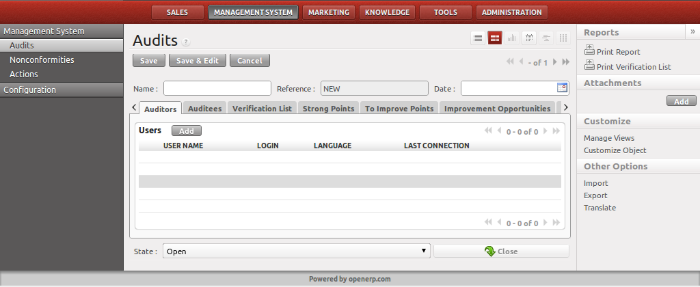

.. i18n: .. index:: Audits
..

.. index:: Audits

.. i18n: Audits
.. i18n: ======
..

Audits
======

.. i18n: .. index::
.. i18n:    single: audit
.. i18n:    single: module; mgmtsystem_audit
..

.. index::
   single: audit
   single: module; mgmtsystem_audit

.. i18n: You can then plan your audit calendar by creating audits from the menu :menuselection:`Management System --> Management System --> Audits`.
.. i18n: You give it a name, and a date and time. You can then assign the auditors and the auditees.
..

You can then plan your audit calendar by creating audits from the menu :menuselection:`Management System --> Management System --> Audits`.
You give it a name, and a date and time. You can then assign the auditors and the auditees.

.. i18n: .. figure:: images/mgmtsystem_audit.png
.. i18n:    :scale: 75
.. i18n:    :align: center
.. i18n: 
.. i18n:    *Management system audit*
..

   *Management system audit*

.. i18n: The auditor can then fill in the verification list with questions based on the manual, the procedure (or the environmental aspects) and the work instructions. He will be able to print the verification list (report) and carry out his audit. 
..

The auditor can then fill in the verification list with questions based on the manual, the procedure (or the environmental aspects) and the work instructions. He will be able to print the verification list (report) and carry out his audit. 

.. i18n: .. figure:: images/mgmtsystem_verification.png
.. i18n:    :scale: 75
.. i18n:    :align: center
.. i18n: 
.. i18n:    *Verification line*
..

.. figure:: images/mgmtsystem_verification.png
   :scale: 75
   :align: center

   *Verification line*

.. i18n: At the end of the audit, he will add the answers to his questions in the verification list stating if it has conformed or not. He will provide feedback to the auditees with the strong points and points to improve. The auditor will be suggesting improvement opportunities and explaining the nonconformities he discovered.
..

At the end of the audit, he will add the answers to his questions in the verification list stating if it has conformed or not. He will provide feedback to the auditees with the strong points and points to improve. The auditor will be suggesting improvement opportunities and explaining the nonconformities he discovered.

.. i18n: Once completed, the auditor can close the audit and generate his audit report.
..

Once completed, the auditor can close the audit and generate his audit report.

.. i18n: .. Copyright © Open Object Press. All rights reserved.
..

.. Copyright © Open Object Press. All rights reserved.

.. i18n: .. You may take electronic copy of this publication and distribute it if you don't
.. i18n: .. change the content. You can also print a copy to be read by yourself only.
..

.. You may take electronic copy of this publication and distribute it if you don't
.. change the content. You can also print a copy to be read by yourself only.

.. i18n: .. We have contracts with different publishers in different countries to sell and
.. i18n: .. distribute paper or electronic based versions of this book (translated or not)
.. i18n: .. in bookstores. This helps to distribute and promote the OpenERP product. It
.. i18n: .. also helps us to create incentives to pay contributors and authors using author
.. i18n: .. rights of these sales.
..

.. We have contracts with different publishers in different countries to sell and
.. distribute paper or electronic based versions of this book (translated or not)
.. in bookstores. This helps to distribute and promote the OpenERP product. It
.. also helps us to create incentives to pay contributors and authors using author
.. rights of these sales.

.. i18n: .. Due to this, grants to translate, modify or sell this book are strictly
.. i18n: .. forbidden, unless Tiny SPRL (representing Open Object Press) gives you a
.. i18n: .. written authorisation for this.
..

.. Due to this, grants to translate, modify or sell this book are strictly
.. forbidden, unless Tiny SPRL (representing Open Object Press) gives you a
.. written authorisation for this.

.. i18n: .. Many of the designations used by manufacturers and suppliers to distinguish their
.. i18n: .. products are claimed as trademarks. Where those designations appear in this book,
.. i18n: .. and Open Object Press was aware of a trademark claim, the designations have been
.. i18n: .. printed in initial capitals.
..

.. Many of the designations used by manufacturers and suppliers to distinguish their
.. products are claimed as trademarks. Where those designations appear in this book,
.. and Open Object Press was aware of a trademark claim, the designations have been
.. printed in initial capitals.

.. i18n: .. While every precaution has been taken in the preparation of this book, the publisher
.. i18n: .. and the authors assume no responsibility for errors or omissions, or for damages
.. i18n: .. resulting from the use of the information contained herein.
..

.. While every precaution has been taken in the preparation of this book, the publisher
.. and the authors assume no responsibility for errors or omissions, or for damages
.. resulting from the use of the information contained herein.

.. i18n: .. Published by Open Object Press, Grand Rosière, Belgium
..

.. Published by Open Object Press, Grand Rosière, Belgium
