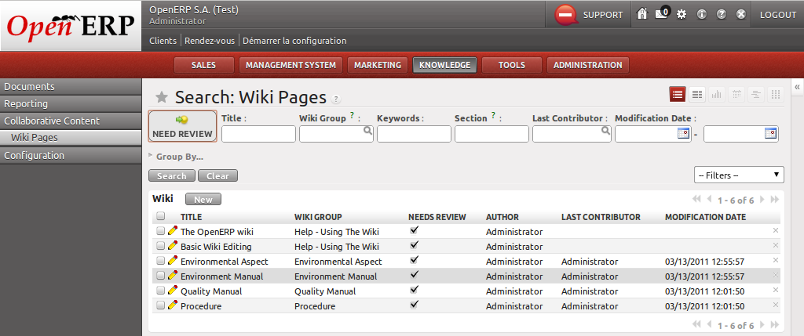
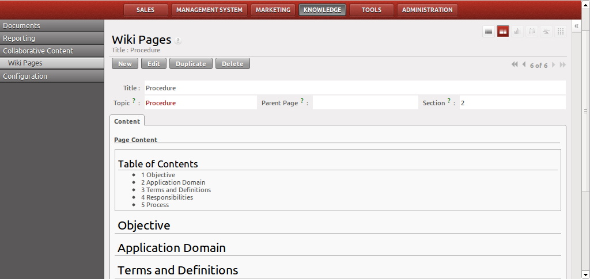

.. i18n: .. index:: Manuals
..

.. index:: Manuals

.. i18n: Manuals
.. i18n: =======
..

用户手册
=======

.. i18n: .. index::
.. i18n:    single: manual
.. i18n:    single: module; wiki_quality_manual
.. i18n:    single: module; wiki_environment_manual
..

.. index::
   single: manual
   single: module; wiki_quality_manual
   single: module; wiki_environment_manual

.. i18n: Each management system starts with a manual reflecting the structure of the corresponding ISO standards. 
.. i18n: You can fill in the blanks in the structure of the wiki page from the menu :menuselection:`Knowledge --> Collaborative Content --> Wiki pages`.
..

每一个管理系统会有相应的用户手册，手册一般按相应的ISO标准所要求的结构来编制。
你可以从菜单:menuselection:`知识库 --> 协作内容 --> Wiki页面`进入Wiki页面，开始撰写用户手册。
You can fill in the blanks in the structure of the wiki page from the menu :menuselection:`Knowledge --> Collaborative Content --> Wiki pages`.

.. i18n: .. figure::  images/mgmtsystem_manual.png
.. i18n:    :scale: 75
.. i18n:    :align: center
.. i18n: 
.. i18n:    *Quality manual*
..

   *Quality manual*

.. i18n: Procedures and Environmental Aspects
.. i18n: ====================================
..

程序和环境因素
====================================

.. i18n: .. index::
.. i18n:    single: procedure 
.. i18n:    single: environmental aspect 
.. i18n:    single: module; wiki_procedure
.. i18n:    single: module; wiki_environmental_aspect
..

.. index::
   single: procedure 
   single: environmental aspect 
   single: module; wiki_procedure
   single: module; wiki_environmental_aspect

.. i18n: Once you have created your manual, you will have to complete it with procedures or environmental aspects. 
.. i18n: They are both managed through wiki pages in the same menu as the manual and the structure is already provided.
..

当系统手册编制完成后，你必须编制一系列适用的程序文件来支撑手册，并考虑环境因素的影响。
这些文件都可以通过Wiki页面来进行管理，访问菜单同上所述。

.. i18n: .. figure:: images/mgmtsystem_procedure.png
.. i18n:    :scale: 75
.. i18n:    :align: center
..

.. i18n: You can also detail your procedures with work instructions by creating new wiki pages.
..

你可以进一步的编制工作指导书，即创建新的Wiki页面，来更详细补充说明程序文件。

.. i18n: .. Copyright © Open Object Press. All rights reserved.
..

.. Copyright © Open Object Press. All rights reserved.

.. i18n: .. You may take electronic copy of this publication and distribute it if you don't
.. i18n: .. change the content. You can also print a copy to be read by yourself only.
..

.. You may take electronic copy of this publication and distribute it if you don't
.. change the content. You can also print a copy to be read by yourself only.

.. i18n: .. We have contracts with different publishers in different countries to sell and
.. i18n: .. distribute paper or electronic based versions of this book (translated or not)
.. i18n: .. in bookstores. This helps to distribute and promote the OpenERP product. It
.. i18n: .. also helps us to create incentives to pay contributors and authors using author
.. i18n: .. rights of these sales.
..

.. We have contracts with different publishers in different countries to sell and
.. distribute paper or electronic based versions of this book (translated or not)
.. in bookstores. This helps to distribute and promote the OpenERP product. It
.. also helps us to create incentives to pay contributors and authors using author
.. rights of these sales.

.. i18n: .. Due to this, grants to translate, modify or sell this book are strictly
.. i18n: .. forbidden, unless Tiny SPRL (representing Open Object Press) gives you a
.. i18n: .. written authorisation for this.
..

.. Due to this, grants to translate, modify or sell this book are strictly
.. forbidden, unless Tiny SPRL (representing Open Object Press) gives you a
.. written authorisation for this.

.. i18n: .. Many of the designations used by manufacturers and suppliers to distinguish their
.. i18n: .. products are claimed as trademarks. Where those designations appear in this book,
.. i18n: .. and Open Object Press was aware of a trademark claim, the designations have been
.. i18n: .. printed in initial capitals.
..

.. Many of the designations used by manufacturers and suppliers to distinguish their
.. products are claimed as trademarks. Where those designations appear in this book,
.. and Open Object Press was aware of a trademark claim, the designations have been
.. printed in initial capitals.

.. i18n: .. While every precaution has been taken in the preparation of this book, the publisher
.. i18n: .. and the authors assume no responsibility for errors or omissions, or for damages
.. i18n: .. resulting from the use of the information contained herein.
..

.. While every precaution has been taken in the preparation of this book, the publisher
.. and the authors assume no responsibility for errors or omissions, or for damages
.. resulting from the use of the information contained herein.

.. i18n: .. Published by Open Object Press, Grand Rosière, Belgium
..

.. Published by Open Object Press, Grand Rosière, Belgium
