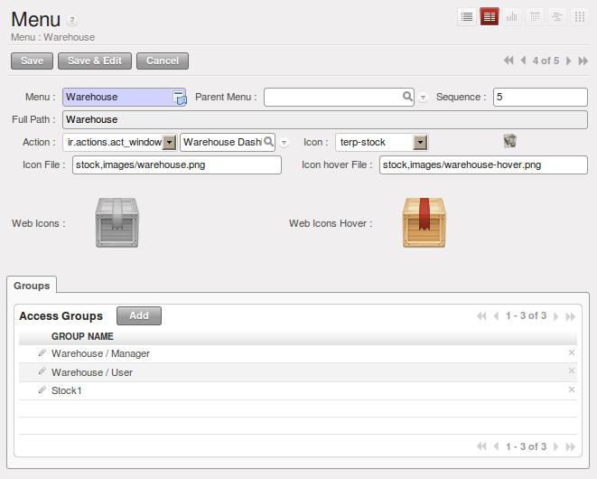
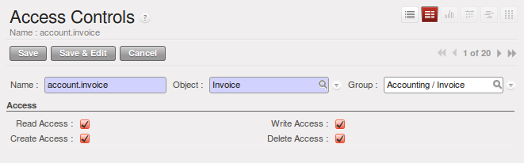
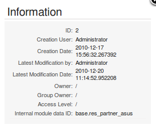

.. i18n: .. index::
.. i18n:    single: access rights
.. i18n:    single: access; user
..

.. index::
   single: access rights
   single: access; user

.. i18n: User Login
.. i18n: ==========
..

用户登陆
==========

.. i18n: .. tip:: Managing Passwords
.. i18n: 
.. i18n:    If you let users change their passwords for themselves, you will have no direct control over the
.. i18n:    password they choose.
.. i18n:    You should have a written policy about password strength to try to maintain a level of security in
.. i18n:    your system.
..

.. tip:: Managing Passwords

   如果你让用户有权更改自己的密码，你将无法直接控制他们的密码。
   你应该有一个书面的关于密码强度的政策，以保证系统的安全。

.. i18n: .. index::
.. i18n:    single: module; users_ldap
..

.. index::
   single: module; users_ldap

.. i18n: .. tip:: Managing Users through LDAP
.. i18n: 
.. i18n: 	With the :mod:`users_ldap` module, user accounts can be managed through an LDAP directory that can be
.. i18n: 	made common to various different company resources.
.. i18n: 
.. i18n: 	Connection parameters for the LDAP directory are then registered with the company definition.
.. i18n: 	You can provide a user profile template there from which new users are automatically created during
.. i18n: 	their first connection to OpenERP.
..

.. tip:: 通过LDAP管理用户

        使用:mod:`users_ldap`模块，用户帐户可通过LDAP目录，共同管理各种不同的公司资源。
        LDAP目录中的连接参数，根据公司定义进行注册。你可以提供一个用户设置文件的模板，
        新用户在第一次连接到OpenERP自动创建。

.. i18n: .. index::
.. i18n:    single: LDAP
..

.. index::
   single: LDAP

.. i18n: .. note:: LDAP
.. i18n: 
.. i18n: 	The LDAP protocol (Lightweight Directory Access Protocol) enables you to manage common directories
.. i18n: 	for various different resources through your standard TCP/IP network.
.. i18n: 
.. i18n: 	This enables users in the company to have the same username and password to access all
.. i18n: 	their applications (such as email and intranet).
..

.. note:: LDAP

	LDAP协议（Lightweight Directory Access Protocol），使您通过标准的TCP/IP网络
        为各种不同的资源管理公共目录这使得该公司的用户有相同的用户名和密码来访问所有
        的应用程序（如Email和Intranet）。

.. i18n: Managing Access Rights
.. i18n: ======================
..

管理访问权限
======================

.. i18n: One of the most important areas in configuring OpenERP is how to manage access rights to the
.. i18n: information in it.
..

如何管理访问信息的权限，是设置OpenERP的最重要领域之一

.. i18n: You are planning to put everything significant to your business into the system, but most of your
.. i18n: staff need see only part of it, and may need to change even less of it. Who should have rights to
.. i18n: what, and how do you manage that?
..

你打算把你具有重要意义的业务全部投入系统，但你的员工只需要看到的只是它的一部分，并可能需要改变， 甚至很少。
谁应该有什么样的权利，你如何管理？

.. i18n: OpenERP's approach to rights management is highly flexible. Each user can belong to one or more
.. i18n: groups, and the group(s) you belong to determine(s):
..

OpenERP 管理权限的方法非常灵活，每个用户可以属于一个或多个组，你属于哪个组决定了:

.. i18n: * the visibility of each menu item and
.. i18n: 
.. i18n: * the accessibility of each table in the database.
..

* 每个菜单项的可见性

* 数据库中的每个表的可访问性

.. i18n: For example, the group \ ``Warehouse / User`` \ may only be given access to some of the menus in
.. i18n: :menuselection:`Warehouse`, and may have no access to any of the accounting information. Each system user who works in
.. i18n: stores is given membership of the ``Warehouse / User`` group. If some users also work elsewhere, they would also be
.. i18n: given membership of other groups.
..

例如，组\ ``仓库/用户`` \只能访问 :menuselection:`仓库` 中一些菜单，可能没有任何权限访问财务信息。
在商店工作的仓库的每个系统用户被指派为\ ``仓库/用户`` \ 组的成员。如果有些用户有其它的工作
内容,他们也会被指派为其它组的成员。

.. i18n: .. index::
.. i18n:    pair: user; group
..

.. index::
   pair: user; group

.. i18n: Groups and Users
.. i18n: ================
..

组和用户
================

.. i18n: To configure access rights, you would start by defining the groups. It is important for the groups to
.. i18n: be representative of your company's job functions rather than of its individual employees.
..

要设置权限，你将从组的定义开始。
它是重要的，组应该是贵公司工作岗位职能的代表，而不是个别员工。

.. i18n: So if your finance director is also your sales director, you should create both a Finance Director
.. i18n: group and a Sales Director group, even though they are both the same person, and would both be
.. i18n: assigned to this user in practice. This gives you flexibility for the future.
..

因此，如果您的财务总监，也是您的销售总监，你应该创建既是一个财务总监组和销售总监组，即使它们都是同一个人，实际都应包含该用户.
这给你在未来很大的灵活性。

.. i18n: You should also create groups within departmental areas that have different levels of access
.. i18n: rights. For example, if you create a \ ``Sales Director`` \ group and a \ ``Sales`` \ group avoid
.. i18n: assigning exactly the same rights to each group. The first could see all the of reports, while the
.. i18n: second could be restricted to seeing quotations. You could either make the Sales Director a
.. i18n: member of both groups, and give the \ ``Sales Director`` \ group a limited set of extra rights, or give the
.. i18n: \ ``Sales Director`` \ group all the rights it needs for a Sales Director to belong only to this one
.. i18n: group. You should choose the scheme that gives you most flexibility and then stick with it to
.. i18n: maintain consistency.
..

你还应该创建组内有不同级别访问权限的部门区域。例如，如果你创建一个销售总监\ ``Sales Director`` \ 组和
销售\ ``Sales`` \ 组，避免不同组别被
赋予相同的权限.
第一个可以看到所有的报表，第二个被限制看到报价单。
你可以使销售总监是两个组的成员，并且销售总监组 \ ``Sales Director`` \ 有限制的额外权力，或者给销售总监
组\ ``Sales Director`` \ 需要的全部权力，如果销
售总监只属于这一个组。你应该选择为你提供了最大的灵活性的方案，然后坚持下去，以保持一致性。

.. i18n: .. index::
.. i18n:    pair:  system; administrator
..

.. index::
   pair:  system; administrator

.. i18n: .. tip:: Flexibility in Managing Access
.. i18n: 
.. i18n: 	To give yourself flexibility, you can ensure that a trusted staff member
.. i18n: 	(perhaps a director or someone in accounts, or even the system administrator) is given wide rights
.. i18n: 	to use the system,
.. i18n: 	and is authorized by the management to carry out specific tasks for people.
..

.. tip:: 管理访问的灵活性

        为了给你自己灵活性，你可以确保一个可信任的工作人员（可能是董事，或者财务部
        门工作的某人，甚至是设置员）广泛权利以使用该系统，并因管理需求授权予指定人。

.. i18n: .. index::
.. i18n:    single: access; menu
..

.. index::
   single: access; menu

.. i18n: Access Rights for Menus
.. i18n: -----------------------
..

菜单的访问权限 
-----------------------

.. i18n: To get a feel for rights management in OpenERP, you will create a new \ ``Stock1`` \  group, with
.. i18n: access to the *Warehouse* menu items. You will then create a stores person user who is a member
.. i18n: of the \ ``Stock1`` \  group.
..

为了感受OpenERP的权限管理, 你可以创建一个新的 \ ``Stock1`` \  用户组,此用户组拥有*仓库*菜单下的项目. 然后你再
创建一个仓库用户,并设置为 \ ``Stock1`` \  组的成员.

.. i18n: To create a new group, use the menu :menuselection:`Administration --> Users --> Groups`. Enter the
.. i18n: group name ``Stock1``.
..

要创建新组，使用菜单 :menuselection:`设置 --> 用户 --> Groups` 。点击新建，输入组名 Stock1，然后保存。

.. i18n: Then to create a new user linked to this, use :menuselection:`Administration --> Users --> Users` to
.. i18n: enter the following:
..
然后创建一个新用户关联到这里，使用 :menuselection:`设置 --> 用户 --> Users` ，输入如下：

.. i18n: *  :guilabel:`User Name` : \ ``Stores Person`` \ ,
.. i18n: 
.. i18n: *  :guilabel:`Login` : \ ``stores`` \ ,
.. i18n: 
.. i18n: *  :guilabel:`Password` : \ ``stores`` \ ,
.. i18n: 
.. i18n: *  :guilabel:`Menu Action` : \ ``Menu`` \ .
..

*  :guilabel:`用户姓名` : \ ``Stores Person`` \ ,

*  :guilabel:`登录名` : \ ``stores`` \ ,

*  :guilabel:`密码` : \ ``stores`` \ ,

*  :guilabel:`菜单动作` : \ ``Menu`` \ .

.. i18n: In the :guilabel:`Groups` section of the user form, add the \ ``Stock1`` \ group that you
.. i18n: just created.
..

在用户表单中 :guilabel:`访问权限`  的部分，增加你刚刚创建的  \ ``Stock1`` \  组。

.. i18n: .. figure::  images/menu_access.png
.. i18n:    :scale: 75
.. i18n:    :align: center
.. i18n: 
.. i18n:    *Groups that have access to the Warehouse menu*
..

   *可以访问仓库菜单的组*

.. i18n: Save the user, then go into the menu :menuselection:`Administration --> Customization --> User
.. i18n: Interface --> Menu Items` to get a list of menus. Filter this list using the search field :guilabel:`Menu` to
.. i18n: get the :menuselection:`Warehouse` menu item. In the form describing the menu, add \ ``Stock1`` \ into the :guilabel:`Groups` field. From now on, only members of
.. i18n: the \ ``Warehouse / Manager`` \, \ ``Warehouse / User`` \ and \ ``Stock1`` \ group will be able to see
.. i18n: this menu item in their main menu list.
..

保存这个用户，然后进入 菜单  :menuselection:`设置 --> 自定义 --> 用户界面 --> 菜单项目` ，
取得菜单的列表，使用搜索 :guilabel:`菜单` 字段过滤列表获得 :menuselection:`仓库`菜
单项目。
在这个表单的菜单明细里，增加  \ ``Stock1`` \ 进入:guilabel:`组`  
字段。
从现在开始，只有 \ ``仓库管理/主管`` \, \ ``仓库管理/用户 `` \ and \ ``Stock1`` \  组的成员能
够在他们的主菜单列表中看到这个菜单项。

.. i18n: .. tip:: Menu Hierarchy
.. i18n: 
.. i18n: 	Since menus are hierarchical, there is no need to hide access to lower menus:
.. i18n: 	once you have configured :menuselection:`Warehouse` this way, all lower-level menus become invisible to
.. i18n: 	members of other groups.
..

.. tip:: 菜单结构

         由于菜单是分层的，这样就不需要隐藏下级菜单：一旦你用这样的方式设置仓库，所有低级菜单对其它的组变得不可见。

.. i18n: .. tip:: Security
.. i18n: 
.. i18n: 	This method of managing access to menus does not guarantee that users are prevented from reaching
.. i18n: 	hidden business objects in the system in other ways.
.. i18n: 	For example, hiding the :guilabel:`Invoices` menu will not prevent people reaching invoices through purchase and
.. i18n: 	sales orders, or by guessing the URL.
.. i18n: 
.. i18n: 	For effective security management, you must use the methods for managing access rights to objects
.. i18n: 	presented in the following section.
..

.. tip:: 安全

             这种管理菜单访问的方法并不能保证阻止用户用其它的方式到达系统中隐藏的业务对象。
             例如，隐藏发票菜单不会阻止用户通过采购和销售订单的发票到达，或者通过猜测URL。

             为了有效的安全管理，您必须使用在下一节介绍的对象的访问权限管理的方法。

.. i18n: .. note:: Initial Access Configuration
.. i18n: 
.. i18n: 	In the initial configuration, OpenERP's \ ``admin`` \ user, a member of the \ ``Administration / Configuration`` \
.. i18n: 	group, is given access to the Configuration menu
.. i18n: 	in each section of the main menu. This is a general convention.
.. i18n: 	For example, :menuselection:`Sales --> Configuration` is visible in the administrator's menu
.. i18n: 	amongst the other Sales menu items.
.. i18n: 	But only the menu items other than :menuselection:`Sales --> Configuration` are visible to other users.
.. i18n: 	Similarly, the main menu item :menuselection:`Administration` is, by convention, visible only to
.. i18n: 	users who are members of the \ ``Administration / Configuration`` \ group.
..

.. note:: 初始的访问设置

         在初始设置中,作为 \ ``系统管理 / 设置`` \  组一员，OpenERP的 \ ``管理`` \ 级别用户拥有主菜单下
         所有部分的设置菜单权限。这是惯例。
         例如, :menuselection:`销售 --> 设置` ，出现在管理员的菜单中。对
         其他用户，只有:menuselection:`销售 --> 设置` 以外的菜单可见。
         同样，主菜单中的 :menuselection:`设置` ，按照惯例，只有  \ ``设置 / 设置`` \ 组的成员的用户可见。

.. i18n: .. index::
.. i18n:    single: access; objects
..

.. index::
   single: access; objects

.. i18n: Access Rights to Objects
.. i18n: ------------------------
..

对象的访问权限
------------------------

.. i18n: The menu access rights determine who can access which menu, but does not define what you can do once
.. i18n: you are in the menu.
..

菜单访问权限决定了谁能访问哪个菜单，但是没有定义你能够在菜单里能做什么.

.. i18n: Access controls on the objects give you the possibility of defining what your users have the right
.. i18n: to do with your data when they get access to it. Access control of objects is structured the same
.. i18n: way as access to menus.
..

对象的权限管理,让你能够定义用户对数据的操作类别.对象的权限管理方式跟菜单权限管理有相同的结构。

.. i18n: .. note:: Object
.. i18n: 
.. i18n:    An object represents a document in the system.
.. i18n:    Objects are linked to database tables, and also have additional concepts,
.. i18n:    such as the functions of fields, inheritance from other objects, and class methods that give them
.. i18n:    behavior.
..

.. note:: 对象

    一个对象类似系统中的一个文档. 对象被关联到数据库的表,或者是其它概念,比如字段函数,其它对象的继承,
    或者赋予他们行为的类方法

.. i18n: If no group is assigned to an object, all users can access it without any restriction of any sort.
.. i18n: Conversely, when an access control is defined for an object, a user must be a member of a group
.. i18n: owning appropriate access rights to have any sort of access to that object.
..

如果对象没有被指派给任何组,所有用户是有无限制的权限访问.相反地,一个对象被设定了访问控制,用户必须成为组成员
才可以拥有适当的权限.

.. i18n: You must always ensure that you do not lock the \ ``Administration / Access Rights`` \ group out of any object
.. i18n: that controls administration and configuration options, such as the \ ``ir.model.access`` \ model.
..

你必须始终确保你没有锁定  \ ``系统管理/访问权限组`` \  对任何对象的”管理和设置”的权限,例如 \ ``ir.model.access`` \ 模型

.. i18n: You can manage four access modes on objects independently:
..

你能独立管理4种访问模式：

.. i18n: *  :guilabel:`Read access` : members of the group can read the data in the object,
.. i18n: 
.. i18n: *  :guilabel:`Create access` : members of the group can create a new record in the object,
.. i18n: 
.. i18n: *  :guilabel:`Write access` : members of the group can modify the contents of records in the object,
.. i18n: 
.. i18n: *  :guilabel:`Delete access` : members of the group can delete records from the object.
..

*  :guilabel:`读访问` : 组成员能读取对象数据,

*  :guilabel:`创建` : 组成员能在对象里创建一个新纪录,

*  :guilabel:`写入` : 组成员能修改对象中记录的内容,

*  :guilabel:`删除` : 组成员能删除对象中的记录.

.. i18n: .. figure::  images/access_control.png
.. i18n:    :scale: 75
.. i18n:    :align: center
.. i18n: 
.. i18n:    *Access control to invoices for the Accounting / Invoice group*
..

   *会计/管理员 组的发票访问控制*

.. i18n: To configure access rights on an OpenERP object, use the menu :menuselection:`Administration -->
.. i18n: Security --> Access Controls List` and click :guilabel:`New` or choose an existing one
.. i18n: and click :guilabel:`Edit`.
.. i18n: You give a :guilabel:`Name` to the access control, select a :guilabel:`Group`, and
.. i18n: the :guilabel:`Object`, then check the checkbox corresponding to each of the four :guilabel:`Access` modes.
..

To configure access rights on an OpenERP object, use the menu :menuselection:`Administration -->
Security --> Access Controls List` and click :guilabel:`New` or choose an existing one
and click :guilabel:`Edit`.
You give a :guilabel:`Name` to the access control, select a :guilabel:`Group`, and
the :guilabel:`Object`, then check the checkbox corresponding to each of the four :guilabel:`Access` modes.

要设置OpenERP 对象的访问权限，使用菜单 :menuselection:`Administration -->
安全设定 --> 访问控制列表` ，然后点击  :guilabel:`新建` 或者选
择已经存在的一个再点击:guilabel:`编辑` 按钮（ 在每一行的前面）。
你要给出一个访问控制的 :guilabel:`名称` ，选择一
个 :guilabel:` :guilabel:`Group`` 组和:guilabel:`对象` ，然后为四种 :guilabel:`访问` 模式逐一点击相应的复选框。
编辑完成后，点击尾部的“保存”图标按钮 。

.. i18n: If you do not specify any group in the access rules, the rule is applied to all groups. So to remove
.. i18n: access to an object for all users you could create a rule:
..

If you do not specify any group in the access rules, the rule is applied to all groups. So to remove
access to an object for all users you could create a rule:

如果你在访问规则不指定任何组，该规则将应用到所有的组。因此要去掉所有用户对一个对象的访问权限，你要建立这样的一条规则： 

.. i18n: * which is defined for a specific object,
.. i18n: 
.. i18n: * which is linked to no group,
.. i18n: 
.. i18n: * for which none of the four access options is checked.
..

* 定义指定对象,

* 没有关联至任何组,

* 然后，你能对同样的对象创建附加的规则给某些特定组特别的权限
.

.. i18n: You can then create additional rules on the same object to give specific rights to certain groups.
..

You can then create additional rules on the same object to give specific rights to certain groups.

.. i18n: .. index::
.. i18n:    single: record
..

.. index::
   single: record

.. i18n: Record Rules For Objects
.. i18n: ------------------------
..

对象的记录规则
------------------------

.. i18n: Record rules determine who can access the objects, depending on the rules set for the particular object. A record rule has some tests to be performed on objects.
..

记录规则决定了谁能访问这个对象，依赖于针对特定对象的规则集合。
你能管理四种独立的对象访问模式：

.. i18n: You can manage four access modes on objects independently, depending on the test:
..

You can manage four access modes on objects independently, depending on the test:

.. i18n:     * :guilabel:`Read access` : can read the data in the object,
.. i18n: 
.. i18n:     * :guilabel:`Create access` : can create a new record in the object,
.. i18n: 
.. i18n:     * :guilabel:`Write access` : can modify the contents of records in the object,
.. i18n: 
.. i18n:     * :guilabel:`Delete access` : can delete records from the object.
..

  
     *  :guilabel:`读访问` : 组成员能读取对象数据,

     *  :guilabel:`创建` : 组成员能在对象里创建一个新纪录,

     *  :guilabel:`写入` : 组成员能修改对象中记录的内容,

     *  :guilabel:`删除` : 组成员能删除对象中的记录.

.. i18n: To configure a rule on an object, use the menu :menuselection:`Administration -->
.. i18n: Security --> Record Rules`. The fields in the ``ir.rule`` object describe:
..

To configure a rule on an object, use the menu :menuselection:`Administration -->
Security --> Record Rules`. The fields in the ``ir.rule`` object describe:

要设置对象上的规则，使用菜单:menuselection:`Administration -->
安全设定 --> 记录规则` 。 ``ir.rule`` 对象中的字段领域描述：

.. i18n:     * :guilabel:`Object` : Object on which to have the rule
.. i18n: 
.. i18n:     * :guilabel:`Name` : Name of the rule
.. i18n: 
.. i18n:     * :guilabel:`Global` : If global is checked, then that rule would be applied for all the groups; and if it is unchecked, then that rule would be applied only for the groups selected for it
.. i18n: 
.. i18n:     * :guilabel:`Domain` : A list of all the tests for the object. It is specified through a Python expression as a list of tuples.
.. i18n: 
.. i18n:             * If there are multiple tests on same object, then all of them are joined using ``AND`` operator, and depending on the result the rule would be satisfied
.. i18n: 
.. i18n:             * If there are multiple rules on same object, then all of them are joined using ``OR`` operator
.. i18n: 
.. i18n:     * :guilabel:`Access Modes` : Read, Write, Create, Delete as described earlier
.. i18n: 
.. i18n:             * If only one access mode is checked, then only that mode would be applied
.. i18n: 
.. i18n:             * If all of them are checked, then all the access modes would be applied
..

    * :guilabel:`对象` : 规则在哪个对象上

    * :guilabel:`名称` : 规则的名称

    * :guilabel:`全局` : 如果全局 被选中，这条规则将应用到所有的组，如果未选中，这条规则只应用到为此选择的组。

    * :guilabel:`过滤条件` : 对象上所有验证条件的列表。通过一组 元组列表作为python表达式进行设定。

            * 如果有多个测试在相同对象上面，他们将用 ``AND`` 操作符组合，根据规则得到满意结果。

            * 如果对象上有多个验证条件,可能根据需要设置关联方式为and的操作符组合如果有多个
              规则在在相同对象上面，将使用``OR``  操作符组合

    * :guilabel:`访问模式` : 读，写，创建，删除如前所述

            * 如果只有一个访问模式被选中，只有这个模式被应用

            * 如果他们都被选中，所有的访问模式都将被应用

 
.. i18n:         But at least one access mode has to be checked, all of them cannot be unchecked. If all of them are unchecked, it would raise an exception.
..

        它们都可以不选中，但至少有一个访问模式被选中。如果所有这些都未选中，将抛出一个异常。

.. i18n: .. .. figure:: images/security_rule.png
.. i18n: ..    :scale: 75
.. i18n: ..    :align: center
..

.. .. figure:: images/security_rule.png
..    :scale: 75
..    :align: center

.. i18n: *For example :* We can have a rule defined on ``res.partner`` object, which tests if the user is the dedicated salesman of the partner ``[('user_id', '=', user.id)]``. We check only the create and write access modes and keep other access modes unchecked.
..

*For example :* We can have a rule defined on ``res.partner`` object, which tests if the user is the dedicated salesman of the partner ``[('user_id', '=', user.id)]``. We check only the create and write access modes and keep other access modes unchecked.

*例如*：如果``res.partner``对象上有个规则，测验用户是不是业务伙伴的专职销售员， ``[('user_id', '=', user.id)]``。我们只检测创建和写访问模式，保持另外的访问模式为不选中。

.. i18n: This would mean that a user in the group for which the rule is applied can only create/write records where he himself serves as the dedicated salesman, and cannot create/write records where he is not the dedicated salesman. As other access modes are unchecked, the user can read/delete the records of partners where he is not the dedicated salesman.
..

This would mean that a user in the group for which the rule is applied can only create/write records where he himself serves as the dedicated salesman, and cannot create/write records where he is not the dedicated salesman. As other access modes are unchecked, the user can read/delete the records of partners where he is not the dedicated salesman.

这就意味着 ，在他自己的服务器里，作为专职销售员，被应用这条规则的组里的用户 只能创建和写他自己的记录。
那些不是专门的销售人员就不能创建/写入记录。
这意味着这个规则只允许组中为专职销售员的用户进行创建与写入,组中非专职销售员则不能创建/写入记录。至于其它模式的用户(不是一个专职销售员)能进行读和删除的操作.
记录规则也可以在用户-组表单中的 访问权限进行定义（只能为指定的组定义）。

.. i18n: .. index::
.. i18n:    single: modification history
..

.. index::
   single: modification history

.. i18n: Modification History
.. i18n: --------------------
..

修改历史记录
--------------------

.. i18n: .. _fig-log:
.. i18n: 
.. i18n: .. figure::  images/view_log.png
.. i18n:    :scale: 75
.. i18n:    :align: center
.. i18n: 
.. i18n:    *Partner Record History*
..

.. _fig-log:

   *供应商历史记录*

.. i18n: Each record in an OpenERP database carries a note of its history. You can find out who it was
.. i18n: created by and when that occurred, and who last modified it and when that occurred. Click the
.. i18n: :guilabel:`View Log` link at the right of any form in the web client
.. i18n: to display a dialog box showing this information, as shown in the
.. i18n: figure :ref:`fig-log`. It can help you identify who to contact if there are any problems with the
.. i18n: data in the records.
..

Each record in an OpenERP database carries a note of its history. You can find out who it was
created by and when that occurred, and who last modified it and when that occurred. Click the
:guilabel:`View Log` link at the right of any form in the web client
to display a dialog box showing this information, as shown in the
figure :ref:`fig-log`. It can help you identify who to contact if there are any problems with the
data in the records.

OpenERP数据库的每一条记录带有其历史的说明。能找出什么时候由谁创建的，以及谁什么时候最后修改了。
查看历史记录，首先要进入开发者模式（点击右上角的感叹号按钮“关于”，再点击 激活开发者模式），在任意表单窗口标题右侧的调试视图选择框中点击“查看日志”项目，出现一个对话框显示这些信息。如图 :ref:`fig-log`. 
   
   *译注 上面这段根据实际情况重写了 by ccdos*

“供应商历史记录”所示。如果记录的数据有任何问题，它能帮你识别跟谁有联系 。

.. i18n: .. index::
.. i18n:    single: module; audittrail
..

.. index::
   single: module; audittrail

.. i18n: .. tip:: Audit Trail
.. i18n: 
.. i18n:    OpenERP has an Audit Trail module :mod:`audittrail`, which can be used to track any or
.. i18n:    all of the changes to one or more objects. It should be used with care, because it
.. i18n:    can generate huge amounts of data in the live database, but can be an invaluable
.. i18n:    tool.
..

.. tip:: 审计跟踪

   OpenERP有一个审计跟踪模块（模块名称是：:mod:`audittrail`）跟踪线索，可以用来跟踪一
   个或多个对象的任何或所有的变化。这是很有用的工具,但应谨慎使用,因为它会在数据库中产
   生巨量的数据.

.. i18n: .. Copyright © Open Object Press. All rights reserved.
..

.. Copyright © Open Object Press. All rights reserved.

.. i18n: .. You may take electronic copy of this publication and distribute it if you don't
.. i18n: .. change the content. You can also print a copy to be read by yourself only.
..

.. You may take electronic copy of this publication and distribute it if you don't
.. change the content. You can also print a copy to be read by yourself only.

.. i18n: .. We have contracts with different publishers in different countries to sell and
.. i18n: .. distribute paper or electronic based versions of this book (translated or not)
.. i18n: .. in bookstores. This helps to distribute and promote the OpenERP product. It
.. i18n: .. also helps us to create incentives to pay contributors and authors using author
.. i18n: .. rights of these sales.
..

.. We have contracts with different publishers in different countries to sell and
.. distribute paper or electronic based versions of this book (translated or not)
.. in bookstores. This helps to distribute and promote the OpenERP product. It
.. also helps us to create incentives to pay contributors and authors using author
.. rights of these sales.

.. i18n: .. Due to this, grants to translate, modify or sell this book are strictly
.. i18n: .. forbidden, unless Tiny SPRL (representing Open Object Press) gives you a
.. i18n: .. written authorisation for this.
..

.. Due to this, grants to translate, modify or sell this book are strictly
.. forbidden, unless Tiny SPRL (representing Open Object Press) gives you a
.. written authorisation for this.

.. i18n: .. Many of the designations used by manufacturers and suppliers to distinguish their
.. i18n: .. products are claimed as trademarks. Where those designations appear in this book,
.. i18n: .. and Open Object Press was aware of a trademark claim, the designations have been
.. i18n: .. printed in initial capitals.
..

.. Many of the designations used by manufacturers and suppliers to distinguish their
.. products are claimed as trademarks. Where those designations appear in this book,
.. and Open Object Press was aware of a trademark claim, the designations have been
.. printed in initial capitals.

.. i18n: .. While every precaution has been taken in the preparation of this book, the publisher
.. i18n: .. and the authors assume no responsibility for errors or omissions, or for damages
.. i18n: .. resulting from the use of the information contained herein.
..

.. While every precaution has been taken in the preparation of this book, the publisher
.. and the authors assume no responsibility for errors or omissions, or for damages
.. resulting from the use of the information contained herein.

.. i18n: .. Published by Open Object Press, Grand Rosière, Belgium
..

.. Published by Open Object Press, Grand Rosière, Belgium
