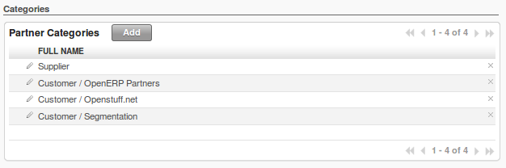

.. i18n: .. index::
.. i18n:    pair: data; import
.. i18n:    pair: data; export
..

.. index::
   pair: data; import
   pair: data; export

.. i18n: Importing and Exporting Data
.. i18n: ============================
..

数据导入/导出
============================

.. i18n: Every form in OpenERP has a standard mechanism for importing data from a CSV file through the client user interface. 
.. i18n: That is the same format as used in the language translations.
..

通过客户端界面，OpenERP的每个表单， 都有一个标准机制 从csv文件导入数据。跟使用语言翻译相同格式。

.. i18n: .. note:: 表单和列表
.. i18n: 
.. i18n:    You have access to the Import and Export functions in the web client on a single form view in read-
.. i18n:    only mode – you cannot reach Import or Export in any other view or when the form is editable.
.. i18n:    If you are using the GTK client, you can find the functions from the top menu 
.. i18n:    :menuselection:`Form --> Import data...` and :menuselection:`Form --> Export data...`.
..

.. note:: Forms and Lists

在web客户端，只读模式下的单个表单视图, 你有机会使用导入和导出功能。在其它任意视图或者表单可编辑，你不能进行
导入导出。如果你使用了GTK客户端，你能从顶部菜单的 表单→导入数据  和 表单→导出数据 找到这个功能

.. i18n: The CSV file format is a text format compatible with most spreadsheet programs (such as OpenOffice
.. i18n: Calc and Microsoft Excel), and is easily editable as a worksheet. The first line contains the name of
.. i18n: the field in the form. All the subsequent lines are data, aligned in their respective columns.
..

CSV文件格式是文本格式，兼容于多数电子表格程序（如OpenOffice Calc和Microsoft Excel）并且很容易在工作表中编辑。表
单的的第一行包含了字段的名称。后面所有的行是数据，对齐在各自列。

.. i18n: .. index::
.. i18n:    pair: data; CSV export
..

.. index::
   pair: data; CSV export

.. i18n: Exporting OpenERP Data to CSV
.. i18n: -----------------------------
..

导出数据为CSV文件
-----------------------------

.. i18n: Start exploring OpenERP's use of the CSV format by exporting a modestly complex set of data,
.. i18n: the partners and partner addresses in the demonstration data.
..

通过在演示数据中导出一个适度复杂的合作伙伴和他们的地址数据，来开始探索 OpenERP  CSV文件的使用。

.. i18n: Go to :menuselection:`Sales --> Address Book --> Customers` for a list of partners, and select the records to export by clicking the checkbox on the left of each record. Then look for the :guilabel:`Other Options` section on the right of the list and click the :guilabel:`Export` link. This pops up the :guilabel:`Export Data` dialog box.
.. i18n: Select the following fields:
..

去 销售→地址簿→客户，取得 合作伙伴的列表，然后点击每条记录左边的复选框选择记录导出。然后看右侧列表中 其它选项
部分，点击 导出 的链接。弹出 导出数据对话框

.. i18n: * :guilabel:`Name`,
.. i18n: 
.. i18n: * :guilabel:`Contact Name` under the :guilabel:`Contacts` menu,
.. i18n: 
.. i18n: * :guilabel:`City` under the :guilabel:`Contacts` menu.
..

* :guilabel:`Name`,

* :guilabel:`Contact Name` under the :guilabel:`Contacts` menu,

* :guilabel:`City` under the :guilabel:`Contacts` menu.

.. i18n: You can either select and add them one at a time, or :kbd:`Ctrl-click` them and add
.. i18n: the multiple selection - the order in which you 
.. i18n: select them, is the order in which they will be displayed.
..

你可以点击选择一次加入一个，也可以Ctrl+点击加入多个选择 –你加入他们的顺序就是他们显示的顺序。

.. i18n: If you do not wish to export your data just yet, or would like to use the same fields for future exports,
.. i18n: you have the option to save these settings. To do that, click :guilabel:`Save List` and give your export a name.
..

如果你还不想导出数据，或者希望将来使用相同的字段，你有
选项保存这些设置。要做到这点，点击 “保存字段列表”并且输入一个名称。

.. i18n: Then click :guilabel:`Export` and save the resulting :file:`data.csv` file somewhere accessible - 
.. i18n: perhaps your desktop. You can open that file in a spreadsheet program or a text editor.
..

然后点击 “导出”并保存结果数据为  csv 文件在可访问的任何地方 – 比如你的桌面。你能在电子表格程序或者文本编辑器中打开。

.. i18n: You will see that you have a list of partners, with the name and city of each partner's contacts
.. i18n: alongside. In the couple of cases where there is more than one address, the partner name
.. i18n: is left out. So it is important to note that the order of entries is critical - do not sort
.. i18n: that list!
..

你将看到你有了一个合作伙伴列表，包括 名称和每个伙伴的联系人旁边的城市。在有多个地址的情况下，合作伙伴的名称被留
空。所以，要注意条目的顺序是很关键的，这很重要 – 不要对列表排序！

.. i18n: .. tip:: List Limits
.. i18n: 
.. i18n:    There is a limit to the number of items you can export in the clients - it is the number
.. i18n:    you can actually see, and that is 20 items by default in the web client, but is
.. i18n:    arbitrary in the GTK client.
.. i18n:    
.. i18n:    You can change the number of items viewed by clicking on the link which shows the count of the items.
.. i18n:    You can then make a selection of limiting it to a fixed number of items at a time, for example, 50 or 100,
.. i18n:    or you can choose to view unlimited number of items at a time.
..

.. tip:: 列表限制

   你在客户端导出的条目的数量有个限制 – 它是你可以看到的，默认情况下，web客户端是20项，但是在GTK客户端是任意的
   
   在你显示的条目个数上面点击，您可以改变浏览的条目数量。然后你可以选择一次固定显示的条目数量，例如，50或100，或
您可以选择一次查看条目的数量不受限制。

.. i18n: .. index::
.. i18n:    pair: data; CSV import
..

.. index::
   pair: data; CSV import

.. i18n: Importing CSV Data to OpenERP
.. i18n: -----------------------------
..

将CSV文件导入OpenERP
-----------------------------

.. i18n: Use this export file as a template for an import file by deleting all of the data,
.. i18n: and using new data (here you will just import new data alongside the demonstration data,
.. i18n: but the principle is the same for a blank database).
..

通过删除所有数据并输入新的数据，使用导出的文件作为一个导入文件的模版（这里你仅仅导入新数据在演示数
据旁边，但是这原理跟空白数据库是相同的）

.. i18n: For example, to import partners with several contacts for which you specify a name and a city, you
.. i18n: would create the following CSV file from the export file:
..

例如：要导入几个你指定了名字和城市联系人的合作伙伴 ，能将从导出文件创建下面的CSV文件：

.. i18n: .. csv-table:: Example of importing partner address fields
.. i18n:    :header: "Name", "Contacts/Contact Name", "Contacts/City"
.. i18n:    :widths: 12,10,8
.. i18n: 
.. i18n:    "Whole Globe Technologies","Graham Global","Athens"
.. i18n:    "","Wanda World","Rome"
.. i18n:    "","Emerson Earth","New York"
.. i18n:    "Miles A Minute","",""
..

.. csv-table:: 示例导入业务伙伴地址
   :header: "Name", "Contacts/Contact Name", "Contacts/City"
   :widths: 12,10,8

   "Whole Globe Technologies","Graham Global","Athens"
   "","Wanda World","Rome"
   "","Emerson Earth","New York"
   "Miles A Minute","",""

.. i18n: From the list of partners, click the :guilabel:`Import` button, and then in the 
.. i18n: :guilabel:`Import Data` window click :guilabel:`Browse` to search for and import
.. i18n: the new :file:`data.csv` file. The web client automatically matches column names
.. i18n: but the GTK client requires that you click the :guilabel:`Auto detect` button.
.. i18n: You can use the default :guilabel:`Options` or change them according to preference.
.. i18n: Then click :guilabel:`Import`.
..

从合作伙伴列表，点击 导入 按纽，然后在 导入数据窗口 点击 浏览 搜素并打入新的data.csv文件。
Web客户端自动匹配列名，但是gtk客户端要求你点击“自动检测”按钮。你能使用默认的选项或者根据自己的喜好修改他们

.. i18n: You will get a dialog box showing that you have imported 2 objects, and you can
.. i18n: see the new partners and partner addresses when you refresh the list on-screen.
..

你将得到对话框 显示你的已经导入2个对象，并且当你刷新屏幕列表是，你能看到新的合作伙伴和地址。

.. i18n: .. index::
.. i18n:    pair: data; CSV structured
..

.. index::
   pair: data; CSV structured

.. i18n: The CSV Format for Complex Database Structures
.. i18n: ----------------------------------------------
..

用CSV格式文件导入OpenERP复杂数据(含关联数据)
----------------------------------------------

.. i18n: When you import data, you have to overcome the problem of representing a database structure in \
.. i18n: ``.csv``\  flat files. To do this, two solutions are possible in OpenERP:
..

当你导入数据时，你必须克服一个问题，就是如何在 csv 平面文件表示数据库结构。
要做这一点，有两个解决方案可以用在OpenERP里：

.. i18n: * importing a CSV file that has been structured in a particular way to enable you to load several
.. i18n:   different database tables from a single file (such as partners and partner contacts in one CSV
.. i18n:   file, as you have just done above),
.. i18n: 
.. i18n: * importing several CSV files, each corresponding to a specific database table, that have explicit
.. i18n:   links between the tables.
..

* 导入特殊方法结构化的CSV文件，是你能从单个文件装入几个不同的数据库表（比如，合作伙伴和合作伙伴的联系人
  在一个csv文件，就像上面刚刚做的一样）

* 导入几个CSV文件，每个对应到一个特定的数据库表，表之间有明确的连接。

.. i18n: .. note:: Server-side Importing
.. i18n: 
.. i18n:    You can also import CSV data through the server interface. The file format is the same, but
.. i18n:    column headings differ slightly. When importing through the user interface, it checks that the column
.. i18n:    heading names match the names seen in the forms on the user interface itself. 
.. i18n:    In contrast, when importing through the 
.. i18n:    server, the column heading names must match the internal names of the fields.
..

.. note:: 服务器端导入

   你也能导入csv数据通过 服务器接口。文件格式是一样的，但是但列标题略有不同。当通过用户界面导入时，
   它会检查列标题名称与用户
   界面表单看到的名称相匹配。相反，当通过服务器导入的列标题的名称必须和字段的内部名称相匹配。

.. i18n: Start by building the header of the CSV file. Open the import tool on the object that you are
.. i18n: interested in, and select the fields that you want to import into your OpenERP database. You must
.. i18n: include every field that is colored blue because those fields are required (unless you know that they
.. i18n: get filled by default with an appropriate value), and also any other field that is important to you.
..

从建立csv文件头部开始。，在你感兴趣的对象上打开导入工具，选择你要导入进OpenERP数据库的字段。你必须包括那些
标记蓝色的字段，因为这些字段是必须的（除非你知道他们默认情况下会被适当的值填充），还有其它的对你重要的字段。

.. i18n: .. figure::  images/csv_column_select.png
.. i18n:    :scale: 75
.. i18n:    :align: center
.. i18n: 
.. i18n:    *Selecting fields to import using a CSV file*
..

.. figure::  images/csv_column_select.png
   :scale: 75
   :align: center

   *选择需要从CSV文件导入的字段*

.. i18n: Use the field names as the column names in the first line of your CSV file, adding one field per
.. i18n: column. If your CSV file has these names in the first line, then when you import your CSV file,
.. i18n: OpenERP will automatically match the column name to the field name of the table. When you have
.. i18n: created your CSV file, you will do that by clicking the :guilabel:`Nothing` button to clear the
.. i18n: :guilabel:`Fields to Import`, then select your CSV file by browsing for a :guilabel:`File to
.. i18n: import`, and then clicking the :guilabel:`Auto Detect` button.
..

在你的CSV文件的第一行，使用字段名作为列名，每列增加一个字段。当导入CSV文件时，如果你的CSV文件第一行有这些
名字，OpenERP将自动匹配列名到表的字段名。当你
创建你的CSV文件，你将这么做，点击 “全部移除”按钮清除要导入的字段，然后选择浏览你要导入的文件，再点击“自动检测”按钮。

.. i18n: To import CSV data that matches your database structure, you should distinguish between the following types
.. i18n: of fields in the OpenERP interface:  *many-to-many*  fields (between multiple sources and
.. i18n: destinations),  *many-to-one*  fields (from multiple sources to a single destination), and
.. i18n: *one-to-many*  fields (from a single origin to multiple destinations).
..

要使导入CSV数据匹配的你数据库结构，你应该在OpenERP接口区分一下几种类型的字段：many-to-many字段（在多个源和目
标之间），many-to-one fields（多个源到单一目标），和one-to-many（单一起源到多个目标）

.. i18n: .. note:: Foreground Table
.. i18n: 
.. i18n:    Each of these types is described in relation to a foreground table –
.. i18n:    the table whose entry form you are viewing and whose entries would be updated by a simple CSV file.
.. i18n: 
.. i18n:    Just because one of these relation fields appears on the foreground table, does not mean that there
.. i18n:    is an inverse field on the related table – but there may be.
.. i18n: 
.. i18n:    So there is *no* one-to-many field in the User form to reflect the many-to-one :guilabel:`user_id` Salesman field in
.. i18n:    the Customer form,
.. i18n:    but there *is* a many-to-one :guilabel:`partner_id` Partner Name field in the Addresses form to reflect the one-to-many
.. i18n:    :guilabel:`child_ids` Partner Contacts field in the Customer form.
..

.. note:: 前台表

   这些类型在相关联的前台表中描述 - 表的报名表格，您正在查看的项目将由一个简单的CSV文件更新。

   只是因为这些关系字段出现在前台表，并不意味着相关的表上有一个反向字段 - 但也有可能。

   所以在“用户”表单里没有one-to-many字段，来反应映“客户”表单many-to-one  USER_ID销售员字段，
   但有在“地址”表单有一个many-to-one  
   partner_id 合作伙伴名称字段 反映到 “客户”表单的 one-to-many child_ids 合作伙伴联系人。

.. i18n: Have a look at the screenshots below to see the differences.
..

看看下面的截屏，找出差异

.. i18n: .. figure::  images/csv_many2one.png
.. i18n:    :scale: 75
.. i18n:    :align: center
.. i18n: 
.. i18n:    *A many-to-one field: a salesperson linked to a partner*
..

.. figure::  images/csv_many2one.png
   :scale: 75
   :align: center

   *many2one字段: 业务伙伴的销售员*

.. i18n: .. figure::  images/csv_many2many.png
.. i18n:    :scale: 75
.. i18n:    :align: center
.. i18n: 
.. i18n:    *A many-to-many field: partner categories*
..

   *many2many字段: 业务伙伴分类*

.. i18n: .. figure::  images/csv_one2many.png
.. i18n:    :scale: 75
.. i18n:    :align: center
.. i18n: 
.. i18n:    *A one-to-many field: partner contacts*
..

.. figure::  images/csv_one2many.png
   :scale: 75
   :align: center

   *one2many字段: 业务伙伴联系人*

.. i18n: All of the other fields are coded in the CSV file as just one text string in each column.
..

CSV文件中所有其他字段 被编码为每一列中只有一个文本字符串。

.. i18n: .. index:: 
.. i18n:    pair: relation; field
..

.. index:: 
   pair: relation; field

.. i18n: Many-to-one Fields
.. i18n: ^^^^^^^^^^^^^^^^^^
..

many2one 字段
^^^^^^^^^^^^^^^^^^

.. i18n: Many-to-one fields represent a relationship between the foreground table and another table in the
.. i18n: database, where the foreground table has a single entry for the other table. OpenERP tries to link 
.. i18n: the new record in the foreground table with the field in the other table by matching the field values.
..

Many-to-one字段描述了一个关系，在数据库中前台表和其它表有个单一条目到其它表。OpenERP试图通过匹配字段值用其它
表的这个字段连接前景表中的新纪录。

.. i18n: .. tip:: Field Identifiers 
.. i18n: 
.. i18n:    If you are working on the server side, you can use identifiers rather than the names of resources
.. i18n:    to link tables. To do this, you import the
.. i18n:    first file (for example, Products) with a column named :guilabel:`id` in your CSV file that contains a
.. i18n:    unique identifier for each product. This could be an incrementing number.
.. i18n: 
.. i18n:    When you import other files which link to the first table, you can use the identifier in preference
.. i18n:    to the names (so, for example, when you are saving inventory you can use \ ``product:id`` \
.. i18n:    instead of the product name). 
.. i18n:    You then do not need any complex conversion to create links between the two tables.
.. i18n:    
.. i18n:    This considerably simplifies the importation of another database into OpenERP.
.. i18n:    You just create a linking ``id`` column for each table that you are importing
.. i18n:    that contains the identifier used in the first table.
..

.. tip:: 字段标识

   如果工作在服务器端，你能使用标识符，而不是资源的名称来连接表。要做这些，你导入第
   一个文件（例如：产品），在CSV文件中具有命名为ID的列，它是包含了每个产品的唯一标识
   符。这可能是一个递增的数字。

   当您导入其他文件链接到第一个表，你可以使用偏好的名称作为标识符（因此，例如，当您节
   省库存，您可以使用的产品ID，而不是产品名称D）。然后，你不需要任何复杂的转换，以创建
   两个表之间的联系。
   
   这大大简化了从另一个数据库导入到OpenERP。你为每个要导入的表创建连接ID列，包含第一个表的标识符

.. i18n: Many-to-many Fields
.. i18n: ^^^^^^^^^^^^^^^^^^^
..

many2many 字段
^^^^^^^^^^^^^^^^^^^

.. i18n: Many-to-many fields are handled just like many-to-one fields in trying to recreate the relationship
.. i18n: between tables: either by searching for names or by using identifiers.
..

Many-to-many字段负责 就像many-to-one 字段试图在表之间重建关系：通过姓名搜索或者使用标识符

.. i18n: There are several possible values in a single many-to-many field. Therefore a partner can be given
.. i18n: several associated categories. You must separate the different values with a comma.
..

单个many-to-many 字段有多个可能的值。因此，一个合作伙伴能够被授予几个关联的类别。你必须用逗号分隔不同的值。

.. i18n: One-to-many Fields
.. i18n: ^^^^^^^^^^^^^^^^^^
..

one2many 字段
^^^^^^^^^^^^^^^^^^

.. i18n: One-to-many fields are a bit different. Take as an example the :guilabel:`Partner Contacts` field in
.. i18n: the Customer form, which contains all of the linked contacts.
..

One-to-many 字段 有点不同。例如: 客户表单的联系人字段，包含了所有关联的联系人

.. i18n: To import such a field you do not have to link to an existing entry in another table, but can instead
.. i18n: create and link to several partner contacts using the same file. You can then specify several values
.. i18n: for different fields linked to that object by the one-to-many field. Each field must be put in a
.. i18n: column of the table, and the title of that column must be expressed in the form \ ``field_one-to-
.. i18n: many/field_linked-object`` \. The partner data you imported earlier took that form.
..

要导入这样一个字段，你不必非要链接到另一个表中的现有条目，但是可以使用相同的文件创建和链接到几个合作伙伴。
然后，您可以通过one-to-many字段方式，指定多个值给链接到那个对象的不同字段上。每个字段必须在表的一列，该列标
题必须这种形式表达：字段_ one-to- many / field_linked-object。刚才你导入合作伙伴的数据采取这种形式。

.. i18n: .. note::  Symmetry in Relation Fields
.. i18n: 
.. i18n: 	Depending on the structure of your data, it can be easier to use the one-to-many form or the
.. i18n: 	many-to-one form in relating two tables, so long as the relevant fields exist on both ends of the relationship.
.. i18n: 
.. i18n: 	For example, you can:
.. i18n: 
.. i18n: 	* import one partner with different contacts in a single file (one-to-many),
.. i18n: 
.. i18n: 	* import the partners first, and then the contacts with the field linking to the partner in a many-to-one form.
..

.. note::  关系字段的对称性

	依赖于你数据的结构，能够更容易地 使用 one-to-many 表单或者 many-to-one表
        单在关联的两个表，只要相关字段存在于关系的两端

       例如,你能够：

       * 导入 一个合作伙伴用不同的联系人在单个文件(one-to-many)
       * 首先导入合作伙伴，然后联系人，用这个字段连接到合作伙伴many-to-one表单

.. i18n: .. index::
.. i18n:    single: data; import example
..

.. index::
   single: data; import example

.. i18n: Another Example of a CSV Import File
.. i18n: ------------------------------------
..

CSV文件导入的另一示例
------------------------------------

.. i18n: To illustrate data importing, you can see another example below. First import partner
.. i18n: categories, and then import some partners and their contacts along with links to the categories
.. i18n: just created. Although you can create new contacts at the same time as creating partners (because
.. i18n: you can do this for *one-to-many* relations), you cannot create new categories this way (because they
.. i18n: use *many-to-many* relations). You must create new categories in a separate step.
..

为了说明数据导入，你可以看到下面的另一个例子。首先导入合作伙伴类别，然后导入一些合作伙伴和他们的联系人，链
接到刚刚创建的类别。虽然您可以在建立合作伙伴的同时创建新的联系人（因为你能做one-to-many关系），但这种方式
你不能建立新的类别（因为它们使用了many-to-many关系）。你必须在单独的步骤创建新的类别。

.. i18n: Partner Categories
.. i18n: ^^^^^^^^^^^^^^^^^^
.. i18n: Start by creating partner categories in a CSV file:
..

业务伙伴分类
^^^^^^^^^^^^^^^^^^
开始在一个CSV文件中创建合作伙伴类别:

.. i18n: #. Create the following table in your spreadsheet program:
..

#. 在你的电子表格程序建立下表:

.. i18n:    .. csv-table:: Partner categories file
.. i18n:       :header: "","Column A","Column B"
.. i18n:       :widths: 5,10,10
.. i18n: 
.. i18n:       "Line 1","Category Name","Parent Category"
.. i18n:       "Line 2","Quality",""
.. i18n:       "Line 3","Gold","Quality"
.. i18n:       "Line 4","Silver","Quality"
.. i18n:       "Line 5","Bronze","Quality"
.. i18n: 
.. i18n:    On the first line, :guilabel:`Category Name` and :guilabel:`Parent Category` are
.. i18n:    the column titles that correspond to field names in the :guilabel:`Partner
.. i18n:    category` form.
.. i18n: 
.. i18n:    :guilabel:`Column A` is for the different partner categories and :guilabel:`Column
.. i18n:    B` indicates if that category has a parent category. If :guilabel:`Column B` is
.. i18n:    blank, then the category sits at the top level.
..

   .. csv-table:: Partner categories file
      :header: "","Column A","Column B"
      :widths: 5,10,10

      "Line 1","Category Name","Parent Category"
      "Line 2","Quality",""
      "Line 3","Gold","Quality"
      "Line 4","Silver","Quality"
      "Line 5","Bronze","Quality"

在第一行，“My Name”和“Parent Category”是列标题  相当于“合作伙伴分类”表单的字段名。

Column A是不同的合作伙伴分类，Column B 表示了类别有个上级分类。如果:guilabel:`Column B` 是空白的，
表明这分类是顶层.

.. i18n: #. Save the spreadsheet file in CSV format – separated by commas – and name the file 
.. i18n:    \ ``categories.csv``\.
.. i18n: 
.. i18n: #. In OpenERP, select :menuselection:`Sales --> Configuration --> Address Book --> Localisation
.. i18n:    --> Partner Categories`.
.. i18n: 
.. i18n: #. Click :guilabel:`Import` (to the bottom right of the list) to bring up the :guilabel:`Import Data` dialog
.. i18n:    box, in which you will find the list of fields that can be imported.
.. i18n: 
.. i18n: #. Click :guilabel:`Browse...` on the :guilabel:`File to import` field and select the CSV file you
.. i18n:    just created, \ ``categories.csv`` \. If you are using GTK client, click :guilabel:`Auto Detect`
.. i18n:    to match the column names
.. i18n:    in the CSV file with the field names available in :guilabel:`Partner Categories`.
.. i18n: 
.. i18n: #. Click :guilabel:`Import` at the top-left of the dialog box to load your data. You should get
.. i18n:    the message \ ``Imported 4 objects``\  in a new dialog box. Close both this and the
.. i18n:    :guilabel:`Import Data` dialog box to return to the original page.
.. i18n: 
.. i18n: #. Refresh the :guilabel:`Partner Categories` list to view the tree of categories,
.. i18n:    including the new \ ``Quality`` \ branch and its child branches that you loaded.
..

#. 保存电子表格文件为CSV格式 – 逗号分割 – 命名这个文件为categories.csv。

#. 在OpenERP，选择 销售→设置→地址簿→本地化→合作伙伴分类。

#. 点击 “导入”（列表的右下方），弹出导入数据对话框，这里你将找到能被导入的字段列表。

#. 在文件上点击“浏览”以导入字段，然后选择 你刚刚创建的，名为categories.csv的CSV文件。

#. 如果你使用GTK客户端，点击 自动检测 匹配在CSV文件中的列名与合作伙伴分类的字段名匹配。

#. 在对话框坐上点击“导入”装入你的数据。你将在新个对话框得到信息 导入4个对象。关闭这个和导入数据对话框返回原来的页面

#. 刷新合作伙伴类别列表浏览分类树，包括了新的Quality分支，它的子分支就是你加载的新的合作伙伴

.. i18n: New Partners
.. i18n: ^^^^^^^^^^^^
..

新建业务伙伴
^^^^^^^^^^^^

.. i18n: Here is how to create new partners with more than one contact, as you did before, and how to link them to these new categories:
..

这里是如何建立有多于一个联系人的新的合作伙伴，所以你做之前，如何将它们联系到这些新的类别。

.. i18n: #. Enter the table below into your spreadsheet program.
..

#. 输入下表进入你的电子表格程序

.. i18n:    .. csv-table:: Partner data file - partners.csv
.. i18n:       :header: "","Column A","Column B","Column C","Column D"
.. i18n:       :widths: 5,10,10,10,10
.. i18n: 
.. i18n:       "Line 1","Name","Categories","Contacts/Contact Name","Salesman"
.. i18n:       "Line 2","Black Advertising","Silver,Gold","George Black","Administrator"
.. i18n:       "Line 3","","","Jean Green",""
.. i18n:       "Line 4","Tiny sprl","","Fabien Pinckaers","Administrator"
..

   .. csv-table:: Partner data file - partners.csv
      :header: "","Column A","Column B","Column C","Column D"
      :widths: 5,10,10,10,10

      "Line 1","Name","Categories","Contacts/Contact Name","Salesman"
      "Line 2","Black Advertising","Silver,Gold","George Black","Administrator"
      "Line 3","","","Jean Green",""
      "Line 4","Tiny sprl","","Fabien Pinckaers","Administrator"

.. i18n: #. The second line corresponds to the creation of a new partner, with two existing categories, that
.. i18n:    has two contacts and is linked to a salesman.
.. i18n: 
.. i18n: #. Save the file using the name \ ``partners.csv``\
.. i18n: 
.. i18n: #. In OpenERP, select :menuselection:`Sales --> Address Book --> Customers` then import the file that you have just
.. i18n:    saved. You will get a message confirming that you have imported and saved the data.
.. i18n: 
.. i18n: #. Verify that you have imported the data. A new partner should have appeared (``Black Advertising``),
.. i18n:    with a salesman (``Administrator``), two contacts (``George Black`` and ``Jean Green``) and two categories
.. i18n:    (``Silver`` and ``Gold``).
..

#. 第二行相当于建立一个新的合作伙伴，有两个已有的类别，两个联系人，并关联了一个销售员
#. 保存这个文件，用文件名partners.csv。
#. 在OpenERP，选择 销售→地址簿→客户，然后导入这个你刚刚保存的文件。你将得到一个信息确认你
   要导入的数据，并 保存这些数据
#. 校验你的导入的数据。应当出现一个新的合作伙伴（Black Advertising），具有有一个销售员
   (Administrator),两个联系人(George Black and Jean Green)以及两个类别(Silver and Gold)。

.. i18n: .. index::
.. i18n:    single: data, export in other forms
.. i18n:    
.. i18n: Exporting Data in Other Forms
.. i18n: -----------------------------
..

.. index::
   single: data, export in other forms
   
在其它表单导出数据
-----------------------------

.. i18n: OpenERP's generic export mechanism lets you easily export any of your data to any location on your
.. i18n: system. You are not restricted to what you can export, although you can restrict who can export that
.. i18n: data using the rights management facilities discussed above.
..

OpenERP的一般导出机制， 让你更方便导出你系统内的任意数据到任何位置。
你能不受限制地导出数据，虽然你可以使用上面讨论过的 权限管理措施来限制能导出数据的人。

.. i18n: You can use this to export your data into spreadsheets or into other systems, such as specialist
.. i18n: accounts packages. The export format is usually in the CSV format, but you can also connect directly
.. i18n: to Microsoft Excel using Microsoft's COM mechanism.
..

你能使用这个来导出你的数据到电子表格 或者进入其它系统，比如专门的财务软件包。
导出格式通常使用CSV格式，但你使用Microsoft 的COM机制，也能直接连接到Microsoft Excel。

.. i18n: .. tip:: Access to the Database
.. i18n: 
.. i18n: 	Developers can also use other techniques to automatically access the OpenERP database. The two
.. i18n: 	most useful are:
.. i18n: 
.. i18n: 	* using the XML-RPC web service,
.. i18n: 
.. i18n: 	* accessing the PostgreSQL database directly.
..

.. tip:: 访问数据库

	开发人员还可以使用其他技术来自动访问OpenERP数据库。两个最有用的是：

 	* 使用XML-RPC web service，

        * 直接访问PostgreSQL数据库。

.. i18n: .. tip:: Module Recorder
.. i18n: 
.. i18n: 	If you want to enter data into OpenERP manually, you should use the Module Recorder, described in
.. i18n: 	the first section of this chapter.
.. i18n: 
.. i18n: 	By doing that, you will generate a module that can easily be reused in different databases.
.. i18n: 	Then if there are problems with a database, you will be able to reinstall the data module you
.. i18n: 	generated with all of the entries and modifications you made for this system.
..

.. tip:: Module Recorder

	如果你要人工输入数据到OpenERP中，你将使用在本章的第一部分描述过的模块记录器。.

	通过这样做，你会生成一个可以很容易地在不同的数据库重用的模块。然后，如果有一个
        数据库的问题，你就能重新安装你生成的数据模块，包括你为这个系统所做的所有项目和修改。

.. i18n: .. Copyright © Open Object Press. All rights reserved.
..

.. Copyright © Open Object Press. All rights reserved.

.. i18n: .. You may take electronic copy of this publication and distribute it if you don't
.. i18n: .. change the content. You can also print a copy to be read by yourself only.
..

.. You may take electronic copy of this publication and distribute it if you don't
.. change the content. You can also print a copy to be read by yourself only.

.. i18n: .. We have contracts with different publishers in different countries to sell and
.. i18n: .. distribute paper or electronic based versions of this book (translated or not)
.. i18n: .. in bookstores. This helps to distribute and promote the OpenERP product. It
.. i18n: .. also helps us to create incentives to pay contributors and authors using author
.. i18n: .. rights of these sales.
..

.. We have contracts with different publishers in different countries to sell and
.. distribute paper or electronic based versions of this book (translated or not)
.. in bookstores. This helps to distribute and promote the OpenERP product. It
.. also helps us to create incentives to pay contributors and authors using author
.. rights of these sales.

.. i18n: .. Due to this, grants to translate, modify or sell this book are strictly
.. i18n: .. forbidden, unless Tiny SPRL (representing Open Object Press) gives you a
.. i18n: .. written authorisation for this.
..

.. Due to this, grants to translate, modify or sell this book are strictly
.. forbidden, unless Tiny SPRL (representing Open Object Press) gives you a
.. written authorisation for this.

.. i18n: .. Many of the designations used by manufacturers and suppliers to distinguish their
.. i18n: .. products are claimed as trademarks. Where those designations appear in this book,
.. i18n: .. and Open Object Press was aware of a trademark claim, the designations have been
.. i18n: .. printed in initial capitals.
..

.. Many of the designations used by manufacturers and suppliers to distinguish their
.. products are claimed as trademarks. Where those designations appear in this book,
.. and Open Object Press was aware of a trademark claim, the designations have been
.. printed in initial capitals.

.. i18n: .. While every precaution has been taken in the preparation of this book, the publisher
.. i18n: .. and the authors assume no responsibility for errors or omissions, or for damages
.. i18n: .. resulting from the use of the information contained herein.
..

.. While every precaution has been taken in the preparation of this book, the publisher
.. and the authors assume no responsibility for errors or omissions, or for damages
.. resulting from the use of the information contained herein.

.. i18n: .. Published by Open Object Press, Grand Rosière, Belgium
..

.. Published by Open Object Press, Grand Rosière, Belgium
