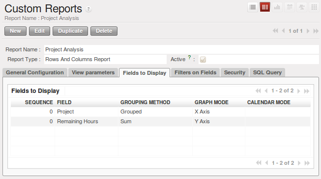
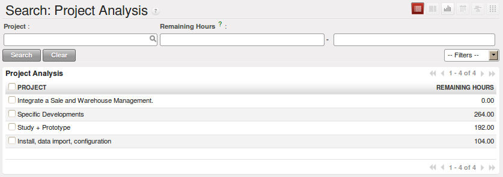
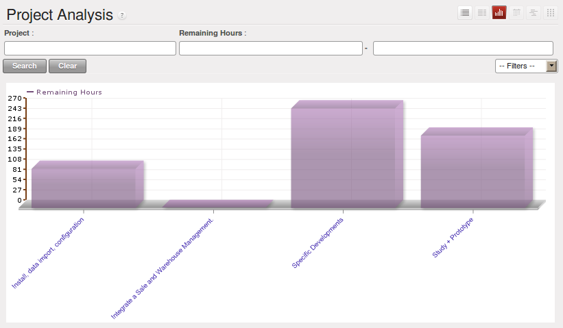
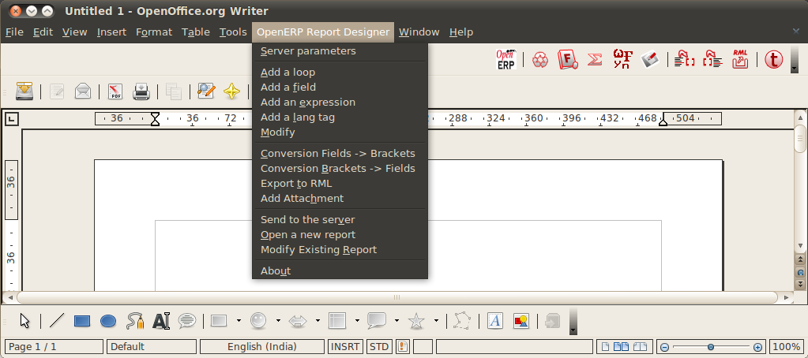
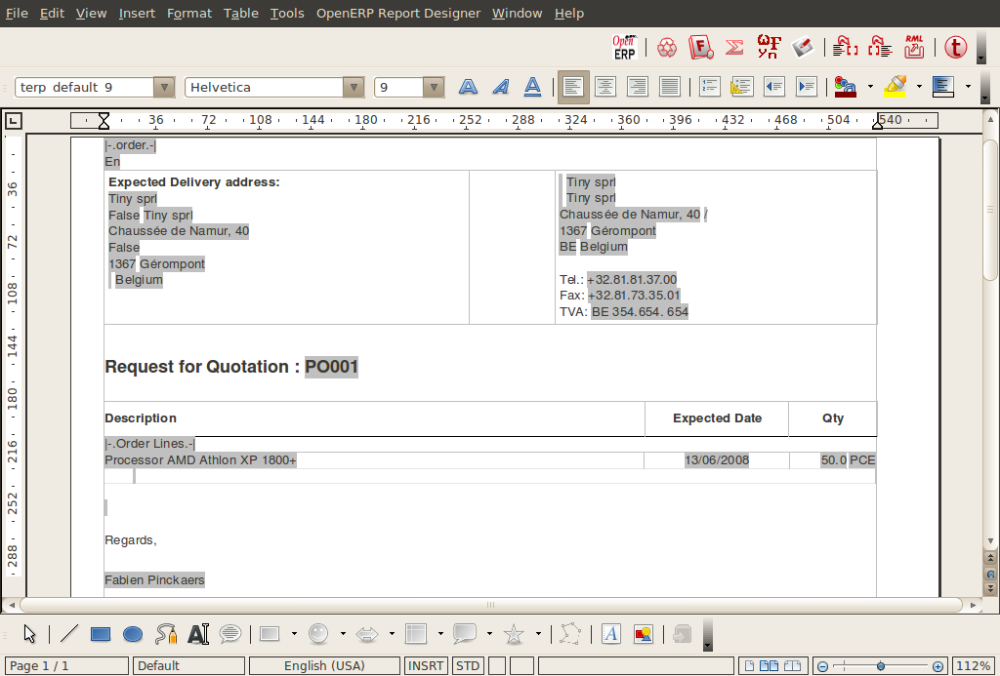

.. i18n: .. index::
.. i18n:    single: configuring; report
.. i18n:    single: report
..

.. index::
   single: configuring; report
   single: report

.. i18n: Configuring Reports
.. i18n: ===================
..

设置报表
===================

.. i18n: OpenERP has two distinct report types:
..

OpenERP有两种不一样的报表类型:

.. i18n: * Statistical reports: these are calculated data, often represented in the form of lists or graphs.
.. i18n:   These reports are dynamic, and you can navigate through the data that comprise the figures through
.. i18n:   the client interface.
.. i18n: 
.. i18n: * Report documents: they are used to print system documents. The result is usually a PDF generated by
.. i18n:   a selection made on the screen. Furthermore, OpenERP enables you to open these reports in
.. i18n:   OpenOffice.org to edit in any changes you want before sending them to your customer.
..

* 统计报表：这些计算数据，往往在列表或图表的表单中显示。这些报告是动态的，可以通过客户端界面浏览包括这些数字的数据。
* 报表文件：它们被用来打印系统文档。结果通常是屏幕上生成一个PDF。此外，OpenERP使您在OpenOffice.org中打开这些报表进行编辑，
  在你发送他们给你客户之前，可以做任何你需要的变动。  因为 OpenERP 引擎的强大，这两种类型的报表无须任何开发就能建立和修
  改，并能在OpenERP客户端界面或者OpenOffice中 直接完成。

.. i18n: Because of the power of the OpenERP engine, these two types of report can be created or modified
.. i18n: without needing any development, and this can be done directly in the client interface of OpenERP
.. i18n: or from OpenOffice.org.
..
 
因为 OpenERP 引擎的强大，这两种类型的报表无须任何开发就能建立和修改，并能在OpenERP客户端界面或者OpenOffice中 直接完成。

.. i18n: Managing Statistical Reports
.. i18n: ----------------------------
..

管理统计报表
----------------------------

.. i18n: Many reports are configured in advance in OpenERP. You can find them in the :menuselection:`Reporting` sub-menus
.. i18n: under each main menu entry.
..

许多报表已经在OpenERP中预先设置好了。你能在每个主菜单项目下面的报表子菜单找到他们。

.. i18n: Modelling a New Report
.. i18n: ^^^^^^^^^^^^^^^^^^^^^^
..

新报表建模
^^^^^^^^^^^^^^^^^^^^^^

.. i18n: .. index::
.. i18n:    single: module; base_report_creator
..

.. index::
   single: module; base_report_creator

.. i18n: OpenERP gives you the possibility of developing your own analyses to meet your specific needs. To
.. i18n: define a new analysis of the system's data, you should install the module :mod:`base_report_creator`.
.. i18n: You can do so by using the :guilabel:`Reconfigure` wizard and installing :guilabel:`Advanced Reporting`.
.. i18n: Then as you configure the reporting tools, select :guilabel:`Query Builder` for installation.
.. i18n: This enables you to create complex queries on the database, in a simple and visual way.
..

OpenERP gives you the possibility of developing your own analyses to meet your specific needs. To
define a new analysis of the system's data, you should install the module :mod:`base_report_creator`.
You can do so by using the :guilabel:`Reconfigure` wizard and installing :guilabel:`Advanced Reporting`.
Then as you configure the reporting tools, select :guilabel:`Query Builder` for installation.
This enables you to create complex queries on the database, in a simple and visual way.

OpenERP提供自行开发报表的功能，以满足你自己的特殊需要。要定义一个新的系统数据的分析，你
需要安装一个模块 :mod:`base_report_creator` 。你能使用 设置→设置→设置向导→设置向导，
选择 “OpenERP 报表设计器安装程序”，点击“作为待办事项”→ 启动，然后把表设计器另存为 到一个目录中，待用。

  *译注：下面的内容在6.1没了*

启动向导并安装 Advanced Reporting来做。然后你设置报表工具，选择安装Query Builder。这使得你能在一个简易和可视
化的方案中建立复杂的数据库查询。

.. i18n: Once the module is installed, create a new report using the menu :menuselection:`Administration --> Customization -->
.. i18n: Reporting --> Custom Reports`.
..

一旦模块安装完成，要创建一个新的报表，使用菜单 :menuselection:`设置(Administration) --> 自定义(Customization) --> 报表(Reporting) --> 自定义报表(Custom Reports)`。

.. i18n: Give a :guilabel:`Report Name` to your new report and select the objects that you are going to
.. i18n: analyse. For example, select the :guilabel:`project.vs.hours` object (you have to install :guilabel:`Project Management` for this).
..

Give a :guilabel:`Report Name` to your new report and select the objects that you are going to
analyse. For example, select the :guilabel:`project.vs.hours` object (you have to install :guilabel:`Project Management` for this).

给出一个新报表一个 :guilabel:`报表名称`，然后选择一个你要分析的对象。例如 选择下面三个对象：“Partner”、“Sale Order”、“Sale Order line”。
然后再打开第二个选项卡[视图参数],选择你报表所需的视图。在第一个视图选择 树，在第二个视图选择图。你能选择图显示的类型 使用 图形视图字
段。您也可以选择日历作为视图，如果你要添加日期字段在您的报告中。

.. i18n: Then turn to the second tab :guilabel:`View parameters` to select the views that you want in your
.. i18n: report. Select \ ``Tree``\   in the :guilabel:`First View` and \ ``Graph``\   in the :guilabel:`Second
.. i18n: View`. You can choose the type of graph displayed using the :guilabel:`Graph View` fields. You could
.. i18n: also select \ ``Calendar``\   as a view if you were going to add a date field to your
.. i18n: report.
..

Then turn to the second tab :guilabel:`View parameters` to select the views that you want in your
report. Select \ ``Tree``\   in the :guilabel:`First View` and \ ``Graph``\   in the :guilabel:`Second
View`. You can choose the type of graph displayed using the :guilabel:`Graph View` fields. You could
also select \ ``Calendar``\   as a view if you were going to add a date field to your
report.

.. i18n: .. figure::  images/report_analysis_config.png
.. i18n:    :scale: 75
.. i18n:    :align: center
.. i18n: 
.. i18n:    *Fields selected for the project analysis*
..

   *Fields selected for the project analysis*

.. i18n: In the third tab :guilabel:`Fields to Display` you must indicate which of the fields in the list you want to be shown in your report. Complete the screen along the lines of the figure above.
..

In the third tab :guilabel:`Fields to Display` you must indicate which of the fields in the list you want to be shown in your report. Complete the screen along the lines of the figure above.

.. i18n: 	#. The :guilabel:`Sequence` field gives the order of the fields displayed.
.. i18n: 
.. i18n: 	#. :guilabel:`Field`, the second column, enables you to select a field from any of the objects
.. i18n: 	   you selected in the first tab.
.. i18n: 
.. i18n: 	#. :guilabel:`Grouping Method`, the third column lets you to determine the grouping operation that
.. i18n: 	   is to be applied to this field:
.. i18n: 
.. i18n: 	        - :guilabel:`Grouped` : Enables you to group document entries with the same value in this field.
.. i18n: 
.. i18n: 	        - :guilabel:`Sum` : Gives the sum of values in this field.
.. i18n: 
.. i18n: 	        - :guilabel:`Minimum` : Gives the minimum of all the values that appear in this field.
.. i18n: 
.. i18n: 	        - :guilabel:`Maximum` : Gives the maximum of all the values that appear in this field.
.. i18n: 
.. i18n: 	        - :guilabel:`Average` : Gives the arithmetic average of all the values in this field.
.. i18n: 
.. i18n: 	        - :guilabel:`Count` : Gives the count of all the values in this field.
.. i18n: 
.. i18n: 	#. :guilabel:`Graph Mode`, the fourth column, determines if the field will appear in the graph view
.. i18n: 	   and, if so, on which axis (X or Y).
.. i18n: 
.. i18n: 	#. :guilabel:`Calendar Mode`, the fifth column, enables you to specify if the field can be the
.. i18n: 	   basis of a calendar view.
..

	#. The :guilabel:`Sequence` field gives the order of the fields displayed.

	#. :guilabel:`Field`, the second column, enables you to select a field from any of the objects
	   you selected in the first tab.

	#. :guilabel:`Grouping Method`, the third column lets you to determine the grouping operation that
	   is to be applied to this field:

	        - :guilabel:`Grouped` : Enables you to group document entries with the same value in this field.

	        - :guilabel:`Sum` : Gives the sum of values in this field.

	        - :guilabel:`Minimum` : Gives the minimum of all the values that appear in this field.

	        - :guilabel:`Maximum` : Gives the maximum of all the values that appear in this field.

	        - :guilabel:`Average` : Gives the arithmetic average of all the values in this field.

	        - :guilabel:`Count` : Gives the count of all the values in this field.

	#. :guilabel:`Graph Mode`, the fourth column, determines if the field will appear in the graph view
	   and, if so, on which axis (X or Y).

	#. :guilabel:`Calendar Mode`, the fifth column, enables you to specify if the field can be the
	   basis of a calendar view.

.. i18n: In the fourth tab :guilabel:`Filters on Fields`, you can add filters on all the fields of the selected
.. i18n: objects. To do that, use the button :guilabel:`Add filter` at the
.. i18n: top of this tab. For the moment, do not add a filter.
..

In the fourth tab :guilabel:`Filters on Fields`, you can add filters on all the fields of the selected
objects. To do that, use the button :guilabel:`Add filter` at the
top of this tab. For the moment, do not add a filter.

.. i18n: You can now :guilabel:`Save` the report you defined. Click on the :guilabel:`Open Report` button to
.. i18n: the right of the form on the :guilabel:`General Configuration` tab to get the requested analysis.
..

You can now :guilabel:`Save` the report you defined. Click on the :guilabel:`Open Report` button to
the right of the form on the :guilabel:`General Configuration` tab to get the requested analysis.

.. i18n: .. figure::  images/report_project_tree.png
.. i18n:    :scale: 75
.. i18n:    :align: center
.. i18n: 
.. i18n:    *Analysing task by project in tree view*
..

   *按项目分组的任务列表统计*

.. i18n: .. figure::  images/report_project_graph.png
.. i18n:    :scale: 75
.. i18n:    :align: center
.. i18n: 
.. i18n:    *Analysing task by project in graph view*
..

   *按项目分组的任务图形统计*

.. i18n: .. index::
.. i18n:    single: configuring; dashboard
.. i18n:    single: dashboard
.. i18n: ..
..

.. index::
   single: configuring; dashboard
   single: dashboard
..

.. i18n: Configuring the Dashboards
.. i18n: ^^^^^^^^^^^^^^^^^^^^^^^^^^
..

设置控制台
^^^^^^^^^^^^^^^^^^^^^^^^^^

.. i18n: A dashboard is a selection of reports previously defined in OpenERP. You can choose from hundreds
.. i18n: of predefined reports and, for each report, indicate its position on the dashboard.
..
 
控制台可以选择之前定义的报表,并且可指定任何一个报表在控制台的位置.

.. i18n: Just like fields on reports, the :guilabel:`Sequence` field determines the order in which views
.. i18n: appear in the dashboard.
..

就像在报表中的字段，序列字段决定了在控制台上出现的顺序

.. i18n: .. figure::  images/dashboard_config.png
.. i18n:    :align: center
.. i18n:    :scale: 85
.. i18n: 
.. i18n:    *Definition of a new dashboard*
..

.. figure::  images/dashboard_config.png
   :align: center
   :scale: 85

   *定义一个新的仪表板*

.. i18n: Once the dashboard has been defined through the menu
.. i18n: :menuselection:`Administration --> Customization --> Reporting --> Dashboard Definition`,
.. i18n: you can use the :guilabel:`Create Menu` button to create a menu
.. i18n: entry for your dashboard anywhere in the menu system.
..

一旦控制台被定义，通过菜单 :menuselection:`设置(Administration) --> 自定义(Customization) --> 报表(Reporting) --> 控制台(Dashboard Definition)`，你能用 :guilabel:`创建菜单` 按键在菜单系统的任何位
置为你的控制板建立一个菜单项。

.. i18n: Managing Document Templates with OpenOffice.org
.. i18n: -----------------------------------------------
..

用 OpenOffice.org管理文档模版
-----------------------------------------------

.. i18n: .. index::
.. i18n:    single: module; base_report_designer
..

.. index::
   single: module; base_report_designer

.. i18n: To configure your printable documents in OpenERP, use the module :mod:`base_report_designer`.
.. i18n: To install this module use the :guilabel:`Reconfigure` wizard and ensuring that :guilabel:`Advanced Reporting` is installed, configure :guilabel:`OpenOffice Report Designer` for installation.
..

要在openERP里设置可以打印的文档，将使用前面一节中 另存为的 插件。设置

.. i18n: .. tip:: The OpenOffice.org Writer Plug-in
.. i18n: 
.. i18n: 	You can create your own reports in just a few minutes using the OpenOffice.org Writer plug-in.
.. i18n: 	This tool can give your team a big productivity improvement.
.. i18n: 	Using it, you can create templates for all of your company's documents, reducing the work of
.. i18n: 	creating and laying out data and customer documents.
..

.. tip:: OpenOffice.org  Writer 插件

	       你能使用 OpenOffice.org Writer插件 只需花费几分钟就能 建立你自己的报表。这个工具可以让你的
               团队工作效率得到巨大的提升。使用它，你能为你公司的所有文档建立模版，减少创建和填入数据和客
               户文档的工作。

.. i18n: The system is both simple and powerful, because it gives you the benefits of all of the layout
.. i18n: facilities offered by OpenOffice.org Writer, as well as all of the data and calculation provided by
.. i18n: OpenERP. You could create or modify reports directly from OpenOffice.org and then use them in
.. i18n: OpenERP.
..
 
这系统是简单和强大的，因为它给你所有OpenOffice.org Writer中提供的排版能力以及OpenERP提供的数据和计算的好处。
你可以直接从OpenOffice.org创建和修改报表，然后在OpenERP中使用

.. i18n: .. note:: Independence from OpenOffice.org
.. i18n: 
.. i18n: 	OpenOffice.org is only used to generate new document templates.
.. i18n: 	The system administrator is the only person who has to install it.
.. i18n: 
.. i18n: 	Once the document templates have been defined, the users do not need it to carry out their normal
.. i18n: 	work.
.. i18n: 	They can use either Microsoft Office or OpenOffice.org as they choose.
..

.. note:: OpenOffice.org的独立性

	OpenOffice.org只是用来产生新的文档模版。设置员是安装它的唯一的人。

	一旦文档模版被定义，用户就不需要再带入到平常的工作中。他们能够选
        择Microsoft Office或者OpenOffice.org。

.. i18n: The OpenOffice.org plug-in enables you to search for fields in OpenERP and integrate them into
.. i18n: your document templates. You can use data loops in tables or sections, enabling you to attach
.. i18n: several lines to an order, for example.
..

OpenOffice.org插件使你能搜索OpenERP的字段，集成他们到你的文档模版。你可以使用表或章节循
环数据,你可也可以在一张订单中添加多行明细，例如：

.. i18n: Once the new report has been defined, it appears directly in the OpenERP client for the system
.. i18n: users.
..

一旦新报表被定义，他就直接展示在系统用户的OpenERP客户端

.. i18n: There are two modes of using reports:
..

There are two modes of using reports:

.. i18n: * make the report produce a PDF document with data in it reflecting the selected record (for
.. i18n:   example, an invoice).
.. i18n: 
.. i18n: * make the report open a document for modification in OpenOffice.org, with data in it reflecting the
.. i18n:   selected record. This enables you to modify the document in OpenOffice.org before sending it to the
.. i18n:   customer (such as with a Quotation).
..

* 用选择的记录数据生成报表产生一个PDF文档（比如开票）

* 用选择的记录数据生成报表，在OpenOffice.org中打开进行修改。这让你在发送给客户前能够修改这个文档（比如报价单）

.. i18n: The personalized reports are stored in the OpenERP database and are accessible to everyone who has
.. i18n: rights to use your database without any need for the installation of OpenOffice.org on their own
.. i18n: computers. The document modifications are applied to a single database.
..

个性化的报表存储在OpenERP数据库，每个有权使用数据库的人无须安装OpenOffice.org在他们自己的计算机上就能访问。文档
的修改被保存在单个数据库

.. i18n: Installing the OpenOffice.org Module
.. i18n: ^^^^^^^^^^^^^^^^^^^^^^^^^^^^^^^^^^^^
..

安装OpenOffice.org模块
^^^^^^^^^^^^^^^^^^^^^^^^^^^^^^^^^^^^

.. i18n: You should install two components before using the report editor:
..

使用报表设计器之前，你要安装两个部件:

.. i18n: * the module :mod:`base_report_designer` – first in your OpenERP installation if it is not
.. i18n:   already there, and then in the OpenERP database, you want to use it in.
.. i18n: 
.. i18n: * the OpenOffice.org Report Designer in the OpenOffice.org installation on your system
.. i18n:   administrator's computer.
..

* 模块:mod:`base_report_designer`

* OpenERP的OpenOffice扩展，使用前面一节中 另存为的 插件：设置 openerp_report_designer.zip文件
  （译注：base_report_designer模块的安装目录的plugin子目录存有此文件）。

.. i18n: You start by installing the module :mod:`base_report_designer` just like all the other OpenERP
.. i18n: modules.
..

安装模块 :mod:`base_report_designer` 就像其它所有OpenERP模块一样。

.. i18n: To install the OpenOffice.org extension, save the file \ ``openerp_report_designer.zip`` \ supplied during
.. i18n: the OpenERP Report Designer Configuration. Check that OpenOffice.org is properly installed on your
.. i18n: computer and that you have administration rights for installation.
..

要安装OpenERP的OpenOffice扩展，使用前面一节中 另存为的 插件：设置 openerp_report_designer.zip文件
（译注：base_report_designer模块的安装目录的plugin子目录存有此文件）。检测OpenOffice.org 已经正确安
装在你的计算机上面，并且你有管理员权限用于安装。

.. i18n: .. figure::  images/tinyreport.png
.. i18n:    :scale: 65
.. i18n:    :align: center
.. i18n: 
.. i18n:    *Menu OpenERP Report in OpenOffice.org Writer*
..

   *OpenOffice.org Writer 中的 “OpenERP Report”菜单*

.. i18n: Start OpenOffice.org Writer, select :menuselection:`Tools --> Extension Manager...`  to open the
.. i18n: Extension Manager dialog box, and then search for the \ ``openerp_report_designer.zip``\   file to install it.
.. i18n: Then close the application and restart Writer: a new menu appears in the top menu bar –  :guilabel:`OpenERP
.. i18n: Report Designer`.
..

启动 OpenOffice.org Writer，选择菜单 :menuselection:`工具(Tools) --> 扩展管理器(Extension Manager...)` 打开扩展管理 对话框， 搜索openerp_report_designer.zip文件安装，然后关闭
程序，重启Writer，一个新的菜单出现在菜单条上

.. i18n: .. index::
.. i18n:    pair: report; OpenOffice.org
..

.. index::
   pair: report; OpenOffice.org

.. i18n: Connecting OpenOffice.org to OpenERP
.. i18n: ^^^^^^^^^^^^^^^^^^^^^^^^^^^^^^^^^^^^
..

连接 OpenOffice.org 到 OpenERP
^^^^^^^^^^^^^^^^^^^^^^^^^^^^^^^^^^^^

.. i18n: Select :menuselection:`OpenERP Report Designer --> Server parameters` in the top menu of OpenOffice.org
.. i18n: Writer. You can then enter your connection parameters to the OpenERP server. You must select a
.. i18n: database in which you have already installed the module :mod:`purchase`. A message
.. i18n: appears if you have made a successful connection.
..

在 OpenOffice.org Writer 顶部菜单 选择 OpenERP Report Designer → Server parameters 。 你能输入到OpenERP server 的连接参数。你
必须选择一个 你已经安装了“采购”模块 的数据库。如果成功连接，一条信息会出现。

.. i18n: .. index::
.. i18n:    single: report; modify
..

.. index::
   single: report; modify

.. i18n: Modifying a Report
.. i18n: ^^^^^^^^^^^^^^^^^^
..

修改报表
^^^^^^^^^^^^^^^^^^

.. i18n: The report editor lets you:
..

报表编辑器能够做到:

.. i18n: * modify existing reports which will then replace the originals in your OpenERP database,
.. i18n: 
.. i18n: * create new reports for the selected object.
..

* 修改一个已经存在的报表，然后替换数据库之前的老版本,

* 重新选择对象并创建新报表.

.. i18n: To modify an existing report, select :menuselection:`OpenERP Report Designer --> Modify Existing Report`.
.. i18n: Choose the report :guilabel:`Purchase Order - Request for Quotation` in the :guilabel:`Modify Existing Report`
.. i18n: dialog box, and then click :guilabel:`Open Report`.
..

要修改一个已经存在的报表，选择 “OpenERP Report Designer → Modify Existing Report”。
Choose the report :guilabel:`Purchase Order - Request for Quotation` in the :guilabel:`Modify Existing Report`
dialog box, and then click :guilabel:`Open Report`.

.. i18n: .. figure::  images/openoffice_quotation.png
.. i18n:    :scale: 65
.. i18n:    :align: center
.. i18n: 
.. i18n:    *Modifying a document template*
..

   *修改文档模板*

.. i18n: OpenOffice.org then opens the report in edit mode for you. You can modify it using the standard word
.. i18n: processing functions of OpenOffice.org Writer.
..

OpenOffice.org 然后为你打开报表进入编辑模式，你能使用OpenOffice.org Writer的标准字处理功能修改它。

.. i18n: The document is modified in its English version. It will be translated as usual by OpenERP's
.. i18n: translation system when you use it through the client interface, if you have configured your own setup
.. i18n: to translate to another language for you. So you only need to modify the template once, even if your
.. i18n: system uses other languages – but you will need to add translations as described earlier in this
.. i18n: chapter if you add fields or change the content of the existing ones.
..

在你已经设置相应的言语模块的情况,一量英文版本被修改后,当你通过客户端界面使用它的时候，它将被OpenERP的翻译系统翻
译。这样你只需要修改模版一次，即使你的系统使用了其它语言，如本章前面所述，如果你添加了字段，你将需要增加翻译，
或者更改已经存在的。

.. i18n: .. tip:: Older Reports
.. i18n: 
.. i18n: 	The older reports may not all have been converted into the new form supported by OpenERP.
.. i18n: 	Data expressions in the old format are shown within double brackets and not in OpenOffice.org
.. i18n: 	fields.
.. i18n: 
.. i18n: 	You can transform an old report format to the new format from the OpenOffice.org menu
.. i18n: 	:menuselection:`OpenERP Report Designer --> Convert Brackets -> Fields`.
..

.. tip:: 旧的报表

	旧报表可能还没有全部转换为新的由OpenERP支持的形式。旧格式的数据表达式显示在双括号内，
        并且不在OpenOffice.org字段内

	You can transform an old report format to the new format from the OpenOffice.org menu
	:menuselection:`OpenERP Report Designer --> Convert Brackets -> Fields`.

.. i18n: From the OpenERP toolbar in OpenOffice.org it is possible to:
..

从 OpenOffice.org 中的 OpenERP 工具栏，可能是：:

.. i18n: * connect to the OpenERP server: by supplying the connection parameters.
.. i18n: 
.. i18n: * add a loop: select a related field amongst the available fields from the proposed object, for
.. i18n:   example \ ``Order Lines``\  . When it is printed, this loop will execute for each line of the order.
.. i18n:   The loop can be put into a table (the lines will then repeat) or into an OpenOffice.org
.. i18n:   section.
.. i18n: 
.. i18n: * add a field: you can then go through the whole OpenERP database from the selected object and
.. i18n:   then a particular field.
.. i18n: 
.. i18n: * add an expression: enter an expression in the Python language to calculate values from any fields
.. i18n:   in the selected object.
..

* connect to the OpenERP server: 提供链接参数.

* add a loop: 选择相关字段，其中包括了建议对象可用的字段，例如 订单行。当它被打印时，对订单的每一行循环执行。
              循环能被放进表格（行将被重复）或者放进OpenOffice.org部分。

* add a field: 从整个OpenERP数据库选择对象及特定的字段。.

* add an expression:输入一个python语言表达式 从选择对象的任意字段计算数值。

.. i18n: .. tip:: Python Expressions
.. i18n: 
.. i18n: 	Using the :guilabel:`Add an expression` button, you can enter expressions in the Python language.
.. i18n: 	These expressions can use all of the object's fields for their calculations.
.. i18n: 
.. i18n: 	For example if you make a report on an order you can use the following expression:
.. i18n: 
.. i18n: 	'%.2f' % (amount_total * 0.9,)
.. i18n: 
.. i18n: 	In this example, ``amount_total`` is a field from the ``purchase.order`` object.
.. i18n: 	The result will be 90% of the total of the order, formatted to two decimal places.
..

.. tip:: Python 表达式

	使用 表达式按纽，你能输入Python语言的表达式，这些表达式能使用所有对象的字段用于计算。

        例如,如果你要在一个订单做做个报表，你能使用下列表达式：

        ‘%.2f’ % (amount_total * 0.9,) 

        这个列子中amount_total是order对象的一个字段。结果将是订单汇总的90%，格式化为2位小数。

.. i18n: .. todo:: - Is this a specification for a bit more writing?
.. i18n: .. :menuselection:`OpenERP Report --> Send to server`
.. i18n: .. *Technical Name*  *Report Name* \ ``Sale Order Mod``\
.. i18n: .. *Corporate Header*  *Send Report to Server*
..

.. todo:: - Is this a specification for a bit more writing?
.. :menuselection:`OpenERP Report --> Send to server`
.. *Technical Name*  *Report Name* \ ``Sale Order Mod``\
.. *Corporate Header*  *Send Report to Server*

.. i18n: You can check the result in OpenERP using the menu :menuselection:`Purchases --> Purchase Management --> Requests
.. i18n: for Quotation`.
..

你能在Openerp里面测试结果，使用菜单“采购→采购管理→询价单”

.. i18n: .. index::
.. i18n:    single: report; new
.. i18n: ..
..

.. index::
   single: report; new
..

.. i18n: Creating a New Report
.. i18n: ^^^^^^^^^^^^^^^^^^^^^
..

建立新报表
^^^^^^^^^^^^^^^^^^^^^

.. i18n: .. todo:: Another specification?
.. i18n: .. :menuselection:`OpenERP Report --> Open a new report` \ ``Sale Order``\
.. i18n: .. :guilabel:`Open New Report` :guilabel:`Use Model in Report`
..

.. todo:: Another specification?
.. :menuselection:`OpenERP Report --> Open a new report` \ ``Sale Order``\
.. :guilabel:`Open New Report` :guilabel:`Use Model in Report`

.. i18n: The general template is made up of loops (such as the list of selected orders) and fields from the
.. i18n: object, which can also be looped. Format them to your requirements, then save the template.
..

通常模版由循环（比如选中的订单列表）和来自对象的可循环字段组成。按你的要求格式化，然后保存为模版

.. i18n: The existing report templates make up a rich source of examples. You can start by adding the loops
.. i18n: and several fields to create a minimal template.
..

已有的报表模版构成了丰富的示例。 你能开始通过增加循环和几个字段来创建一个最小的模版。

.. i18n: When the report has been created, send it to the server by clicking :menuselection:`OpenERP Report Designer
.. i18n: --> Send to the server`, which brings up the :guilabel:`Send To Server` dialog box. A
.. i18n: :guilabel:`Technical Name` for the report is assigned by default, to make it appear beside the other purchase order
.. i18n: reports. Rename the template as \ ``New Request for Quotation`` \ in :guilabel:`Report Name`, check the
.. i18n: checkbox :guilabel:`Corporate Header` and finally click :guilabel:`Send Report to Server`.
..

当报表已经被建立，发送到服务器，点击OpenERP Report Designer → Send to the server，带来Send To Server对话框。
一个报表的技术名称被指定为默认，使其出现在其它销售订单报表的旁边。在Report Name字段将模版改名为Sale Order New，
选中 Corporate Header 复选框，然后 点击 Send Report to Server完成。

.. i18n: To send it to the server, you can specify if you prefer OpenERP to produce a PDF when the user
.. i18n: prints the document, or if OpenERP should open the document for editing in OpenOffice.org Writer
.. i18n: before printing. To do that choose \ ``PDF`` \, \ ``OpenOffice`` \ (SXW)
.. i18n: or \ ``HTML`` \ in the field :guilabel:`Select Rpt. Type`.
..

发布到服务器，你能指定打印方式,当用户打印文档时，是否要openerp 产生一个PDF,或者在打印前，打开文档到
OpenOffice.org Writer中进行编辑。要做到这点，在字段Select Rpt. Type中选择PDF , OpenOffice (SXW) 或者 HTML。

.. i18n: .. index::
.. i18n:    single; report; common headers
..

.. index::
   single; report; common headers

.. i18n: Creating Common Headers for Reports
.. i18n: -----------------------------------
..

创建报表的公用页眉
-----------------------------------

.. i18n: When saving new reports and reports that you have modified, you are given the option to select a
.. i18n: header. This header is a template that creates a standard page header and footer containing data
.. i18n: that is defined in each database.
..

当保存新报表和修改完报表，将会有一个选项,让你选择一个页眉。这个页眉是个模版，每个数据库都会一个包含指定
内容的标准页眉及页脚。

.. i18n: This template can be customized by changing the company information through the menu
.. i18n: :menuselection:`Administration --> Companies --> Companies`. You may select your parent company from the list
.. i18n: and edit the fields Report Header, Report Footer 1, Report Footer 2 in the :guilabel:`General Information` tab.
.. i18n: If your company has a logo that you would want to appear in all reports, you may add it using the :guilabel:`Logo` field.
.. i18n: You can also change the appearance of the header/footer by editing the XML code in the tabs :guilabel:`Header/Footer`
.. i18n: and :guilabel:`Internal Header/Footer`.
..

这个模块通过改变公司信息进行自定义 ，通过菜单 设置→公司→公司。你能从列表选择你的合作伙伴公司 ，然后在一般信息
选项卡里面编辑报表页眉、报表页脚1、报表页脚2字段。如果你的公司有标记，你能让他显示在所有的报表，你能用 logo 字
段加上它。你能通过编辑 页眉/页脚，和内部页眉/页脚 选项卡的XML代码改变页眉/页脚的外观。

.. i18n: .. Copyright © Open Object Press. All rights reserved.
..

.. Copyright © Open Object Press. All rights reserved.

.. i18n: .. You may take electronic copy of this publication and distribute it if you don't
.. i18n: .. change the content. You can also print a copy to be read by yourself only.
..

.. You may take electronic copy of this publication and distribute it if you don't
.. change the content. You can also print a copy to be read by yourself only.

.. i18n: .. We have contracts with different publishers in different countries to sell and
.. i18n: .. distribute paper or electronic based versions of this book (translated or not)
.. i18n: .. in bookstores. This helps to distribute and promote the OpenERP product. It
.. i18n: .. also helps us to create incentives to pay contributors and authors using author
.. i18n: .. rights of these sales.
..

.. We have contracts with different publishers in different countries to sell and
.. distribute paper or electronic based versions of this book (translated or not)
.. in bookstores. This helps to distribute and promote the OpenERP product. It
.. also helps us to create incentives to pay contributors and authors using author
.. rights of these sales.

.. i18n: .. Due to this, grants to translate, modify or sell this book are strictly
.. i18n: .. forbidden, unless Tiny SPRL (representing Open Object Press) gives you a
.. i18n: .. written authorisation for this.
..

.. Due to this, grants to translate, modify or sell this book are strictly
.. forbidden, unless Tiny SPRL (representing Open Object Press) gives you a
.. written authorisation for this.

.. i18n: .. Many of the designations used by manufacturers and suppliers to distinguish their
.. i18n: .. products are claimed as trademarks. Where those designations appear in this book,
.. i18n: .. and Open Object Press was aware of a trademark claim, the designations have been
.. i18n: .. printed in initial capitals.
..

.. Many of the designations used by manufacturers and suppliers to distinguish their
.. products are claimed as trademarks. Where those designations appear in this book,
.. and Open Object Press was aware of a trademark claim, the designations have been
.. printed in initial capitals.

.. i18n: .. While every precaution has been taken in the preparation of this book, the publisher
.. i18n: .. and the authors assume no responsibility for errors or omissions, or for damages
.. i18n: .. resulting from the use of the information contained herein.
..

.. While every precaution has been taken in the preparation of this book, the publisher
.. and the authors assume no responsibility for errors or omissions, or for damages
.. resulting from the use of the information contained herein.

.. i18n: .. Published by Open Object Press, Grand Rosière, Belgium
..

.. Published by Open Object Press, Grand Rosière, Belgium
