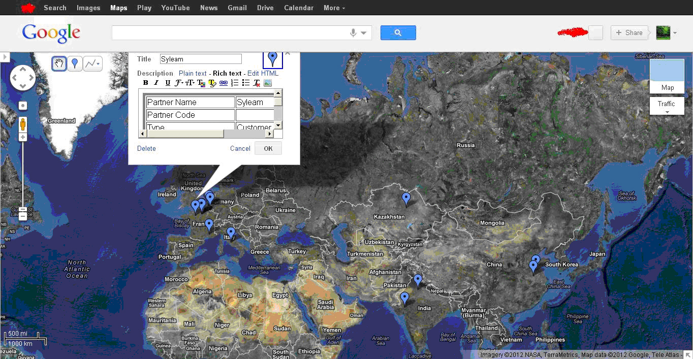
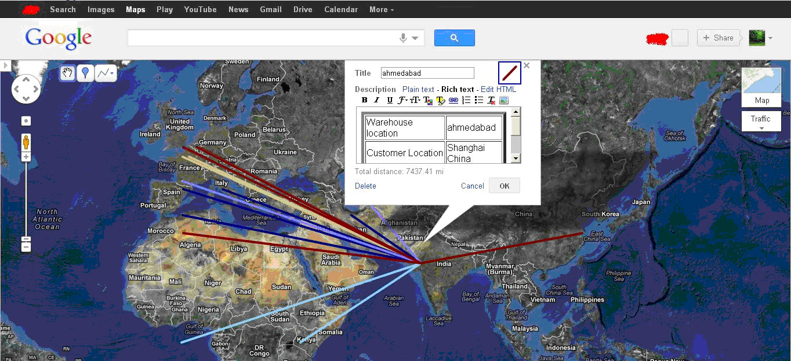
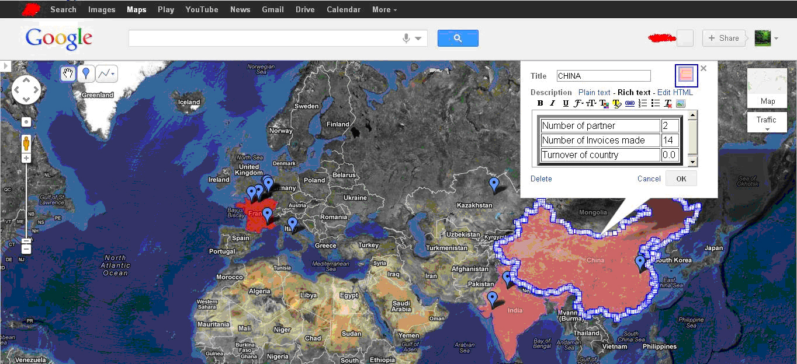
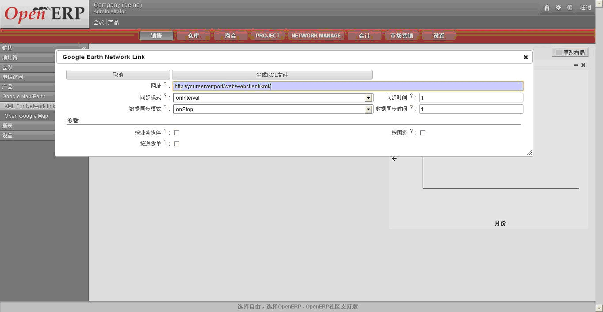

.. i18n: **************
.. i18n: Google Earth
.. i18n: **************
..

**************
Google Earth
**************

.. i18n: Name of module: 
.. i18n: ``google_earth``
..

模块名: 
``google_earth``

.. i18n: **Features:**
..

**模块功能:**

.. i18n: 1. See partners information on google map(name, code, address,...) with icon on map
.. i18n: 
.. i18n: 2. And Turnover of country by partners, country appears in light red color => low turnover and with dark red color => high turnover.
.. i18n: 
.. i18n: 3. Delivery routes from Warehouse location to Customer location by cities with 10 different colors (by number of delivery to that city from warehouse).
.. i18n: 
.. i18n: 4. It can create network link kml file for dynamic updates of data on google earth.
.. i18n: 
.. i18n: 5. It can directly open google map in your browser with different information.
.. i18n: 
.. i18n: 6. It generates KML file so you can save it on your computer and upload it on google map/ google earth.
..

1. 可以在 Google 地图上标注业务伙伴的名称,地址,编码,icon等

2. 可以按国家显示营业额, 如按不同的颜色深度来表示各个国家的营业额大小.

3. 可以用近10种颜色来区分城市与城市间的送货物流送货路线图.

4. 可以创建可用于 Google Earth 动态更新的 KML 文件.

5. 还可以直接在浏览器中打开 Google 地图 来显示信息.

6. 可以生成 KML 文件保存并用于 Google 地图与 Google Earth.

.. i18n: **Menus**
..

**菜单**

.. i18n: .. figure::  images/menu_earth.jpg
.. i18n:    :scale: 50
.. i18n:    :align: center
..

.. figure::  images/menu_earth.jpg
   :scale: 50
   :align: center

.. i18n: You can find 5 wizards on Partners/ Google Map/Earth.
..

在 Partners/ Google Map/Earth 菜单下面, 你可以找到5个菜单或者向导:

.. i18n: **KML File:**
..

**KML 文件:**

.. i18n: To use the google_earth module you must know what a kml file is and how to use it on google/map.
..

在用 google_earth 模块前, 你最好先了解一下 什么是 KML 文件, 以及如何在 Google 地图与 Google Earth 中使用它.

.. i18n: .. tip::  KML
.. i18n: 
.. i18n:     KML is a file format used to display geographic data in an Earth browser such as Google Earth, Google Maps and Google Maps for mobile. KML uses a tag-based structure with nested elements and attributes and is based on the XML standard. All tags are case-sensitive and must appear exactly as they are listed in the KML Reference. The Reference indicates which tags are optional. Within a given element, tags must appear in the order shown in the Reference.
..

.. tip::  KML 标记

    KML 是一种用于在 地理浏览器(如 Google Earth, Google 地图或者 Google 手机地图)上显示 地理数据的文件格式.KML 通常使用 基本于XML标准的带内嵌套元素与属性结构化文本描述语言. 所有标签都大小写敏感并且符合 KML参考所提出的规范. Reference indicates 是可选的. 在一个元素内, 所有的标签都需要按序出现.

.. i18n: For more information: 
..

请参阅: 

.. i18n: http://code.google.com/apis/kml/documentation/kml_tut.html
..

http://code.google.com/apis/kml/documentation/kml_tut.html

.. i18n: http://code.google.com/apis/kml/documentation/topicsinkml.html
..

http://code.google.com/apis/kml/documentation/topicsinkml.html

.. i18n: http://code.google.com/apis/kml/documentation/kmlreference.html
..

http://code.google.com/apis/kml/documentation/kmlreference.html

.. i18n: **Now How to upload kml file on Google Map:**
..

**现在来看看怎么样将一个 KML 文件上传到 Google 地图:**

.. i18n: Step1: go to create map link
..

第一步: 先创建一个地图链接

.. i18n: Step2: import
..

第二步: 导入

.. i18n: Step3: upload kml
..

第三步: 上传 KML 文件

.. i18n: **Difference between Google Maps and Google Earth:**
..

**看看 Google 地图与 Google Earth 的异同:**

.. i18n: Google Maps is available through the window of your browser, Google Earth is a downloadable application which can be installed on your computer in order to view the satellite imagery straight from your desktop. However, the super giant Google updates the two products every once in a while so they have almost the same functions
..

Google 地图只能通过浏览器访问. 而 Google Earth 则是一个下载后安装在你电脑上, 通过桌面应用访问卫星地图的软件. 虽然这样, Google 还是会定期同步更新两款产品的功能.尽量操持两款产品的一致性.

.. i18n: After uploading KML files to google map look below:
..

上传完 KML 文件后, 可以在 Google 地图片看到:

.. i18n: (1) KML for ``Partner-Country``
..

(1) 业务伙伴同国家的KML文件 ``Partner-Country``

.. i18n: .. figure::  images/google_map.jpg
.. i18n:    :scale: 50
.. i18n:    :align: center
..

.. i18n: This is the screen shot which shows the partner's country, turnover of partners reside in that country. Here we can see country wise partners and country wise turnover. By clicking on selected country we can get Number of partners, Number of invoices made and Turnover of the country.
..

下面的截图展示了 业务伙伴的国家, 以及业务伙伴在这个国家的营业额. 在地图上通过点击选中的国家,能获取该国的业务伙伴数, 业务往来以及整个国家的营业额.

.. i18n: .. note:: High Turnover => Dark red & Low Turnover => Light red
..

.. note:: 深色与浅色的颜色差异代表了营业额的差异。

.. i18n: (2) KML for ``Delivery Route``
..

(2) 用于发货路线的KML文件 ``Delivery Route``

.. i18n: .. figure::  images/earth_delivery.jpg
.. i18n:    :scale: 50
.. i18n:    :align: center
..

.. i18n: This is the screen shot for finding the delivery routes from warehouse location to customer location. Here we can see there are different routes in different colours. By clicking on particular route we get the information about Customer Location, Warehouse Location, Number of Products sent and Number of deliveries made.
..

下面的截图展示了 从仓库到客户的送货线路图, 图中用不同的颜色区别了配送不同区间. 当点击各个配送路线段时, 还可以查看详细的客户收货,公司送货, 送货信息.

.. i18n: (3) KML for ``Partners``
..

(3) 用于业务伙伴 的 KML 文件 ``Partners``

.. i18n: .. figure::  images/partner_map.jpg
.. i18n:    :scale: 50
.. i18n:    :align: center
..

.. i18n: This is the screen shot showing all partners from different countries. This will make a point on particular partner address on map. By clicking on any point we can get the information about the partner, e.g. Name of partner, Code, Type(customer/supplier), Address, Turnover of Partner, Number of customer invoice, Number of supplier invoice, Total receivable, etc...
..

下面的截图展示了 全球的所有业务伙伴, 可以在地图中标出业务伙伴的特定地址, 点击这些点可以获取业务伙伴的如 名称, 代码, 业务伙伴类型(客户? 供应商?), 地址, 营业额, 销售额, 采购额, 应收汇总等等信息.

.. i18n: (4) Wizard for KML for ``Network link``
..

(4) 网络分享向导 ``Network link``

.. i18n: .. figure::  images/earth_wizard.jpg
.. i18n:    :scale: 50
.. i18n:    :align: center
.. i18n:  
.. i18n: .. tip:: Network link kml: 
.. i18n: 
.. i18n:         A special kind of kml file which has network link tag inside it which contains link of your kml file.
..

 
.. tip:: 分享KML链接: 

        一种可以在网络上存储的可访问的 KML 文件URL地址.

.. i18n: This wizard will create network link in kml for different objects and save it to your computer and then you have to upload network link kml to google earth/map. It can update data periodically by looking network link kml files parameters(refreshtime,interval....). For example if you have inserted new partner then google earth can fetch that new partner from the OpenERP web server.
..

本向导可以完成 上传生成的KML文件到 Google Earth 或者 Google 地图, 并生成网络分享链接. 你还可以设置定时完成 KML文件数据更新参数(更新时间, 频次等等). 下面的例子中演示了如果 在添加一个新的业务伙伴,并让 Google Earth 能获取该业务伙伴的一些信息.

.. i18n: .. note:: If you ticked partner and country, wizard will create two link tag with url/path of two kml file. Now when you upload this kml file it will show both partner and country information on earth and update that information by given interval time (using url/path ).
.. i18n: 	
.. i18n: 	
.. i18n: **The wizard of network link shown above:**
..

.. note:: 如果你勾选了 按业务伙伴和按国家 方式. 向导会按要求分别创建两个 KML 文件, 并生成两种方式的查看的网络链接. 这时, 你可以上传这些 KML 文件, 并能在 Google Earth 上查找到相应的 业务伙伴及 国家信息. 并可以按 给定的更新频次更新这些信息.
	
	
**向导生成的网络链接会需要配置:**

.. i18n: First, ``path`` shows a url (HTTP address) means the path and port number of the OpenERP web server.
.. i18n: 	
.. i18n: ``RefreshMode`` specifies a time-based refresh mode, which can be one of the following: 
..

First, ``path`` 你的WEB服务器提供的 信息 service 的 接口网络地址(URL).
	
``RefreshMode`` 指定数据更新模式, 有下面几个选项: 

.. i18n:     onChange - refresh when the file is loaded and whenever the Link parameters change (default).
.. i18n:     
.. i18n:     onInterval - refresh every n seconds (specified in <refreshInterval>).
.. i18n:     
.. i18n:     onExpire - refresh the file when the expiration time is reached.
..

    onChange - 当链接参数发生变化时(这是默认的选项).
    
    onInterval - 按 refreshInterval 秒数进行周期更新.(参见 <refreshInterval>).
    
    onExpire - 按文件的到期时间进行更新.

.. i18n: ``RefreshInterval`` indicates to refresh the file every n seconds. 
..

``RefreshInterval`` 指定更新的周期秒数

.. i18n: ``ViewRefreshMode`` specifies how the link is refreshed when the "camera" changes.
..

``ViewRefreshMode`` 查看模式时的更新设定 指定 "Camera" 更改时, 链接更新.

.. i18n:     never(default) - Ignore changes in the view. Also ignore <viewFormat> parameters, if any. 
.. i18n: 		
.. i18n:     onStop - Refresh the file n seconds after movement stops, where n is specified in <viewRefreshTime>. 
.. i18n:         
.. i18n:     onRequest - Refresh the file only when the user explicitly requests it. (For example, in Google Earth, the user right-clicks and selects Refresh in the Context menu.) 
.. i18n:         
.. i18n:     onRegion - Refresh the file when the Region becomes active.
..

    never(default) - 查看时，忽略 <viewFormat> 参数，不更新。(默认选项)
		
    onStop - 查看时, 停留 viewRefreshTime 指定秒后, 再更新。 参阅 <viewRefreshTime>. 
        
    onRequest - 用户手动更新(如在 Google Earth 中, 用户右键菜单中的"更新")
        
    onRegion - 仅更新查看的区域的文件.

.. i18n: ``View Refresh Time`` specifies the number of seconds to wait before refreshing the view, after 	camera movement stops.
.. i18n:      
..

``View Refresh Time`` 指定当停止移动地图后查看时停滞时间(秒)
     

.. i18n: (5) Wizard for Open *Google Map*
..

(5) 打开Google 地图向导*

.. i18n: .. figure::  images/open_map.jpg
.. i18n:    :scale: 50
.. i18n:    :align: center
..

.. figure::  images/open_map.jpg
   :scale: 50
   :align: center

.. i18n: This wizard will directly open google map in browser.
..

本向导可以直接在浏览器中打开 Google 地图.

.. i18n: For example, if you want to open that map for partner-country, then it will directly open google map for partner with countries in browser.
..

如: 你想在地图上查看 合作伙伴-国家 数据, 你可以直接打开向导.

.. i18n: In above figure, You can see Path field. In that, http://maps.google.com/maps?q=, will be common and later is shown your web-client path with port. Another field is Map For which is selection for Partner, Partner-Country and Delivery-Route. Whatever option you select from Map For field, it will directly open map for that option and with that url(Path).
..

在上图中的 Path 字段里 "http://maps.google.com/maps?q=" 后面提供了一个 web-client 的URL. 另一个字段则指定了地图上显示 "合作伙伴", "合作伙伴/国家",还是"送货路线". 然后 就可以按你指定的参数打开Google 地图。

.. i18n: Url looks like ``http://maps.google.com/maps?q=http://yourserver.com:port/kml?model=res.partner`` when you open the browser.
..

你打开后的浏览器的URL 看起来类似 ``http://maps.google.com/maps?q=http://yourserver.com:port/kml?model=res.partner`` 。

.. i18n: .. Copyright © Open Object Press. All rights reserved.
..

.. Copyright © Open Object Press. All rights reserved.

.. i18n: .. You may take electronic copy of this publication and distribute it if you don't
.. i18n: .. change the content. You can also print a copy to be read by yourself only.
..

.. You may take electronic copy of this publication and distribute it if you don't
.. change the content. You can also print a copy to be read by yourself only.

.. i18n: .. We have contracts with different publishers in different countries to sell and
.. i18n: .. distribute paper or electronic based versions of this book (translated or not)
.. i18n: .. in bookstores. This helps to distribute and promote the OpenERP product. It
.. i18n: .. also helps us to create incentives to pay contributors and authors using author
.. i18n: .. rights of these sales.
..

.. We have contracts with different publishers in different countries to sell and
.. distribute paper or electronic based versions of this book (translated or not)
.. in bookstores. This helps to distribute and promote the OpenERP product. It
.. also helps us to create incentives to pay contributors and authors using author
.. rights of these sales.

.. i18n: .. Due to this, grants to translate, modify or sell this book are strictly
.. i18n: .. forbidden, unless Tiny SPRL (representing Open Object Press) gives you a
.. i18n: .. written authorisation for this.
..

.. Due to this, grants to translate, modify or sell this book are strictly
.. forbidden, unless Tiny SPRL (representing Open Object Press) gives you a
.. written authorisation for this.

.. i18n: .. Many of the designations used by manufacturers and suppliers to distinguish their
.. i18n: .. products are claimed as trademarks. Where those designations appear in this book,
.. i18n: .. and Open Object Press was aware of a trademark claim, the designations have been
.. i18n: .. printed in initial capitals.
..

.. Many of the designations used by manufacturers and suppliers to distinguish their
.. products are claimed as trademarks. Where those designations appear in this book,
.. and Open Object Press was aware of a trademark claim, the designations have been
.. printed in initial capitals.

.. i18n: .. While every precaution has been taken in the preparation of this book, the publisher
.. i18n: .. and the authors assume no responsibility for errors or omissions, or for damages
.. i18n: .. resulting from the use of the information contained herein.
..

.. While every precaution has been taken in the preparation of this book, the publisher
.. and the authors assume no responsibility for errors or omissions, or for damages
.. resulting from the use of the information contained herein.

.. i18n: .. Published by Open Object Press, Grand Rosière, Belgium
..

.. Published by Open Object Press, Grand Rosière, Belgium
