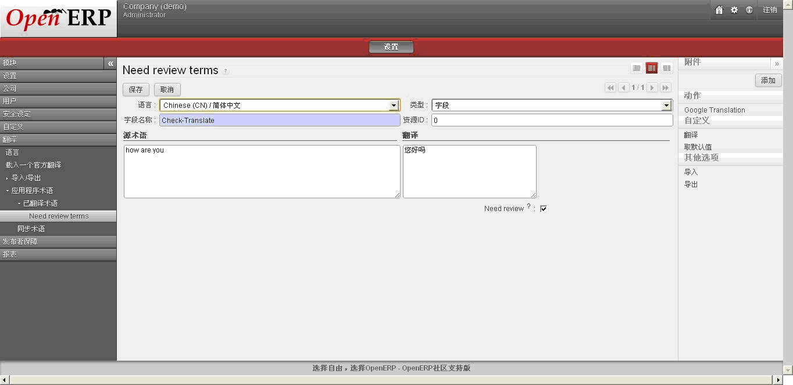

.. i18n: ****************
.. i18n: Google Translate
.. i18n: ****************
..

****************
Google Translate
****************

.. i18n: Name of the module:
.. i18n: ``google_translate``
..

Name of the module:
``google_translate``

.. i18n: This module translates OpenERP terms/fields/objects etc. into any language using Google Translate.
..

This module translates OpenERP terms/fields/objects etc. into any language using Google Translate.

.. i18n: You can find the menu here: Administration/Translation/Application terms/Translation Terms and Need review terms.
..

You can find the menu here: Administration/Translation/Application terms/Translation Terms and Need review terms.

.. i18n: Check the screenshots below which translate the phrase "how are you" into Chinese.
..

Check the screenshots below which translate the phrase "how are you" into Chinese.

.. i18n: .. note:: If the Need Review field is True then it will translate the source value to destination by given language.
..

.. note:: If the Need Review field is True then it will translate the source value to destination by given language.

.. i18n: **Before Translation**
..

**Before Translation**

.. i18n: .. figure::  images/translate.png
.. i18n:    :scale: 50
.. i18n:    :align: center
..

.. i18n: **After Translation**
..

**After Translation**

.. i18n: .. figure::  images/translate_dest.png
.. i18n:    :scale: 50
.. i18n:    :align: center
..

.. i18n: .. Copyright © Open Object Press. All rights reserved.
..

.. Copyright © Open Object Press. All rights reserved.

.. i18n: .. You may take electronic copy of this publication and distribute it if you don't
.. i18n: .. change the content. You can also print a copy to be read by yourself only.
..

.. You may take electronic copy of this publication and distribute it if you don't
.. change the content. You can also print a copy to be read by yourself only.

.. i18n: .. We have contracts with different publishers in different countries to sell and
.. i18n: .. distribute paper or electronic based versions of this book (translated or not)
.. i18n: .. in bookstores. This helps to distribute and promote the OpenERP product. It
.. i18n: .. also helps us to create incentives to pay contributors and authors using author
.. i18n: .. rights of these sales.
..

.. We have contracts with different publishers in different countries to sell and
.. distribute paper or electronic based versions of this book (translated or not)
.. in bookstores. This helps to distribute and promote the OpenERP product. It
.. also helps us to create incentives to pay contributors and authors using author
.. rights of these sales.

.. i18n: .. Due to this, grants to translate, modify or sell this book are strictly
.. i18n: .. forbidden, unless Tiny SPRL (representing Open Object Press) gives you a
.. i18n: .. written authorisation for this.
..

.. Due to this, grants to translate, modify or sell this book are strictly
.. forbidden, unless Tiny SPRL (representing Open Object Press) gives you a
.. written authorisation for this.

.. i18n: .. Many of the designations used by manufacturers and suppliers to distinguish their
.. i18n: .. products are claimed as trademarks. Where those designations appear in this book,
.. i18n: .. and Open Object Press was aware of a trademark claim, the designations have been
.. i18n: .. printed in initial capitals.
..

.. Many of the designations used by manufacturers and suppliers to distinguish their
.. products are claimed as trademarks. Where those designations appear in this book,
.. and Open Object Press was aware of a trademark claim, the designations have been
.. printed in initial capitals.

.. i18n: .. While every precaution has been taken in the preparation of this book, the publisher
.. i18n: .. and the authors assume no responsibility for errors or omissions, or for damages
.. i18n: .. resulting from the use of the information contained herein.
..

.. While every precaution has been taken in the preparation of this book, the publisher
.. and the authors assume no responsibility for errors or omissions, or for damages
.. resulting from the use of the information contained herein.

.. i18n: .. Published by Open Object Press, Grand Rosière, Belgium
..

.. Published by Open Object Press, Grand Rosière, Belgium
