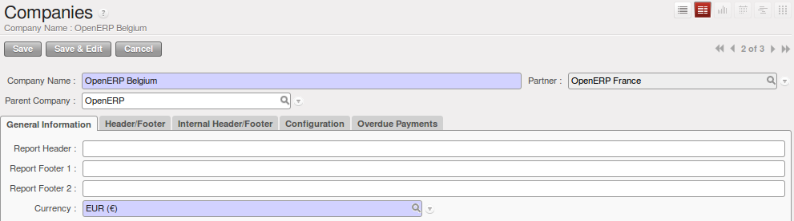
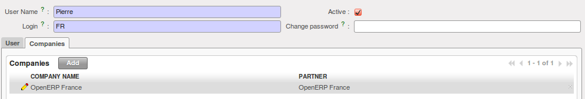
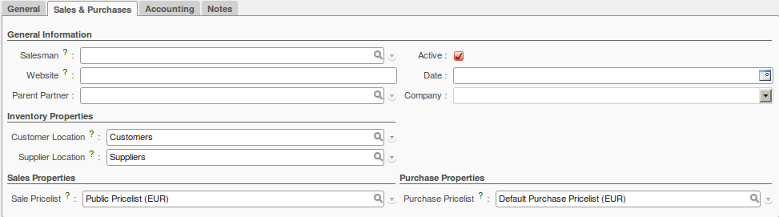
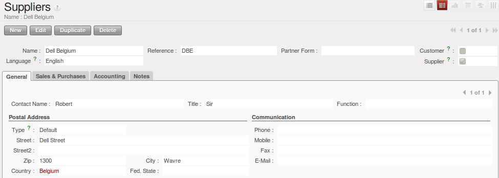

.. i18n: Companies Structure
.. i18n: -------------------
..

多公司结构
-------------------

.. i18n: Companies
.. i18n: ^^^^^^^^^
..

多公司
^^^^^^^^^

.. i18n: Three companies have to be defined. One mother company (OpenERP) and two children (OpenERP Belgium and OpenERP France). 
..

我们定义三个公司。其中一个是母公司(OpenERP)，另外两个是子公司(OpenERP Belgium 和 OpenERP France)。

.. i18n: On the one hand, the two child companies will be used to support the flow of goods. On the other hand, the mother company 
.. i18n: will be used to aggregate the different information from OpenERP France and OpenERP Belgium.
..

On the one hand, the two child companies will be used to support the flow of goods. On the other hand, the mother company 
will be used to aggregate the different information from OpenERP France and OpenERP Belgium.

.. i18n: .. figure:: images/company_structure.png
.. i18n:    :scale: 75
.. i18n:    :align: center
.. i18n:    
.. i18n:    *Companies Structure*
.. i18n:    
.. i18n: .. tip:: User Group
.. i18n: 
.. i18n: 	To view the companies' structure, you have to add the group  :guilabel:`Useability/Multi Companies` to your user. 
.. i18n:    
.. i18n: Here are the different configurations for the mother and the child companies (for the child companies, do not 
.. i18n: forget to add a parent company):
..

.. figure:: images/company_structure.png
   :scale: 75
   :align: center
   
   *Companies Structure*
   
.. tip:: User Group

	To view the companies' structure, you have to add the group  :guilabel:`Useability/Multi Companies` to your user. 
   
Here are the different configurations for the mother and the child companies (for the child companies, do not 
forget to add a parent company):

.. i18n: .. figure:: images/child_company.png
.. i18n:    :scale: 75
.. i18n:    :align: center
.. i18n:    
.. i18n:    *Companies Configuration*
.. i18n:    
.. i18n: Charts of Accounts
.. i18n: ^^^^^^^^^^^^^^^^^^
..

   
   *多公司基本配置*
   
会计科目表
^^^^^^^^^^^^^^^^^^

.. i18n: For each company, you have to define an accounting setting. To do this, go to the :menuselection:`Accounting --> 
.. i18n: Configuration --> Financial Accounting --> New company Financial Setting`. 
..

对每个公司，你必须定义一个会计设置。要做到这点，进入 :menuselection:`会计 --> 
配置 --> 财务会计 --> 新公司财务设置`. 

.. i18n: .. figure:: images/accounting_charts.png
.. i18n:    :scale: 75
.. i18n:    :align: center
.. i18n:    
.. i18n:    *Creating Charts of Accounts*
..

.. figure:: images/accounting_charts.png
   :scale: 75
   :align: center
   
   *Creating Charts of Accounts*

.. i18n: .. note:: Accounting Plan
.. i18n: 
.. i18n: 	Each of your companies can have its own specific chart of accounts.
..

.. note:: Accounting Plan

	Each of your companies can have its own specific chart of accounts.

.. i18n: Users, Suppliers & Customers
.. i18n: ^^^^^^^^^^^^^^^^^^^^^^^^^^^^
..

用户,供应商与客户
^^^^^^^^^^^^^^^^^^^^^^^^^^^^

.. i18n: The users are used to log in to the system and to give the appropriate access rights to each person. This concept is different 
.. i18n: from the employee who is created through the Human Resources module.
..

用户 是用来登录进系统，给了每个人适当的访问权限。这个概念不同于在人力资源模块创建的员工。

.. i18n: Each company needs a user to manage the different operations to complete the flow. You can create one user for each 
.. i18n: company, but do not forget to select the appropriate company in the ``Contact`` section of the User form after have added the 
.. i18n: company in the ``Companies`` tab.
..

Each company needs a user to manage the different operations to complete the flow. You can create one user for each 
company, but do not forget to select the appropriate company in the ``Contact`` section of the User form after have added the 
company in the ``Companies`` tab.

.. i18n: .. figure:: images/user_1tab.png
.. i18n:    :scale: 50
.. i18n:    :align: center
.. i18n:    
.. i18n:    *Defining Users part 1*
.. i18n:    
.. i18n: .. figure:: images/user_2tab.png
.. i18n:    :scale: 75
.. i18n:    :align: center
.. i18n:    
.. i18n:    *Defining Users part 2*
..

.. figure:: images/user_1tab.png
   :scale: 50
   :align: center
   
   *Defining Users part 1*
   

   
   *Defining Users part 2*

.. i18n: In addition to the user, the companies need suppliers and customers. For OpenERP France, you can define one customer who will 
.. i18n: order the product that will be defined later, and for OpenERP Belgium, you can define one supplier who will deliver the product to 
.. i18n: the company.
..

In addition to the user, the companies need suppliers and customers. For OpenERP France, you can define one customer who will 
order the product that will be defined later, and for OpenERP Belgium, you can define one supplier who will deliver the product to 
the company.

.. i18n: The customers and suppliers go in the same object called `Partners` which can be classified in three ways: customer, supplier and
.. i18n: customer and supplier. This has the advantage that you have to update address data only once.
..

The customers and suppliers go in the same object called `Partners` which can be classified in three ways: customer, supplier and
customer and supplier. This has the advantage that you have to update address data only once.

.. i18n: 	* Customer: log in with the user of OpenERP France, then go to :menuselection:`Sales --> Address Book --> Customers`
.. i18n: 	
.. i18n: .. figure:: images/customer_1tab.png
.. i18n:    :scale: 75
.. i18n:    :align: center
.. i18n:    
.. i18n:    *Defining Customers part 1*
..

	* Customer: log in with the user of OpenERP France, then go to :menuselection:`Sales --> Address Book --> Customers`
	
.. figure:: images/customer_1tab.png
   :scale: 75
   :align: center
   
   *客户定义 第1部分*

.. i18n: .. figure:: images/customer_2tab.png
.. i18n:    :scale: 75
.. i18n:    :align: center
.. i18n:    
.. i18n:    *Defining Customers part 2*
.. i18n:    
.. i18n: 	* Supplier: log in with the user of OpenERP Belgium, then go to :menuselection:`Purchases --> Address Book --> Suppliers`
..

   
   *客户定义 第2部分*
   
	* Supplier: log in with the user of OpenERP Belgium, then go to :menuselection:`Purchases --> Address Book --> Suppliers`

.. i18n: .. figure:: images/supplier_1tab.png
.. i18n:    :scale: 75
.. i18n:    :align: center
.. i18n:    
.. i18n:    *Defining Suppliers part 1*
..

   
   *定义供应商 第1部分*

.. i18n: .. figure:: images/supplier_2tab.png
.. i18n:    :scale: 75
.. i18n:    :align: center
.. i18n:    
.. i18n:    *Defining Suppliers part 2*
.. i18n:    
..

.. figure:: images/supplier_2tab.png
   :scale: 75
   :align: center
   
   *定义供应商 第2部分*
   

.. i18n: .. Copyright © Open Object Press. All rights reserved.
..

.. Copyright © Open Object Press. All rights reserved.

.. i18n: .. You may take electronic copy of this publication and distribute it if you don't
.. i18n: .. change the content. You can also print a copy to be read by yourself only.
..

.. You may take electronic copy of this publication and distribute it if you don't
.. change the content. You can also print a copy to be read by yourself only.

.. i18n: .. We have contracts with different publishers in different countries to sell and
.. i18n: .. distribute paper or electronic based versions of this book (translated or not)
.. i18n: .. in bookstores. This helps to distribute and promote the OpenERP product. It
.. i18n: .. also helps us to create incentives to pay contributors and authors using author
.. i18n: .. rights of these sales.
..

.. We have contracts with different publishers in different countries to sell and
.. distribute paper or electronic based versions of this book (translated or not)
.. in bookstores. This helps to distribute and promote the OpenERP product. It
.. also helps us to create incentives to pay contributors and authors using author
.. rights of these sales.

.. i18n: .. Due to this, grants to translate, modify or sell this book are strictly
.. i18n: .. forbidden, unless Tiny SPRL (representing Open Object Press) gives you a
.. i18n: .. written authorisation for this.
..

.. Due to this, grants to translate, modify or sell this book are strictly
.. forbidden, unless Tiny SPRL (representing Open Object Press) gives you a
.. written authorisation for this.

.. i18n: .. Many of the designations used by manufacturers and suppliers to distinguish their
.. i18n: .. products are claimed as trademarks. Where those designations appear in this book,
.. i18n: .. and Open Object Press was aware of a trademark claim, the designations have been
.. i18n: .. printed in initial capitals.
..

.. Many of the designations used by manufacturers and suppliers to distinguish their
.. products are claimed as trademarks. Where those designations appear in this book,
.. and Open Object Press was aware of a trademark claim, the designations have been
.. printed in initial capitals.

.. i18n: .. While every precaution has been taken in the preparation of this book, the publisher
.. i18n: .. and the authors assume no responsibility for errors or omissions, or for damages
.. i18n: .. resulting from the use of the information contained herein.
..

.. While every precaution has been taken in the preparation of this book, the publisher
.. and the authors assume no responsibility for errors or omissions, or for damages
.. resulting from the use of the information contained herein.

.. i18n: .. Published by Open Object Press, Grand Rosière, Belgium
..

.. Published by Open Object Press, Grand Rosière, Belgium
