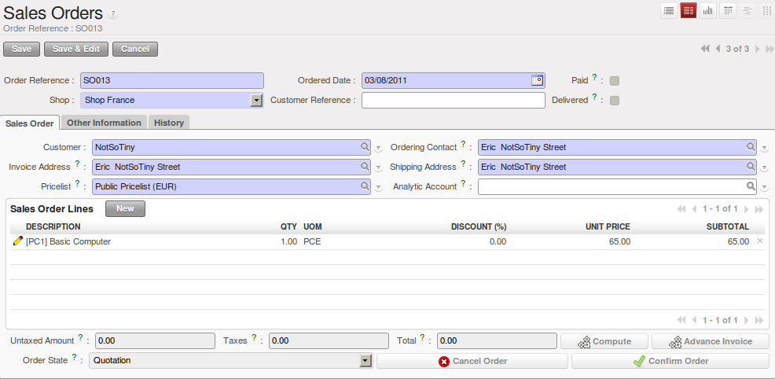
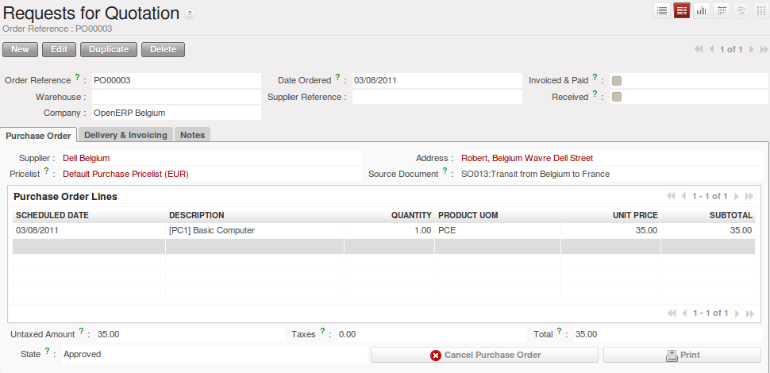
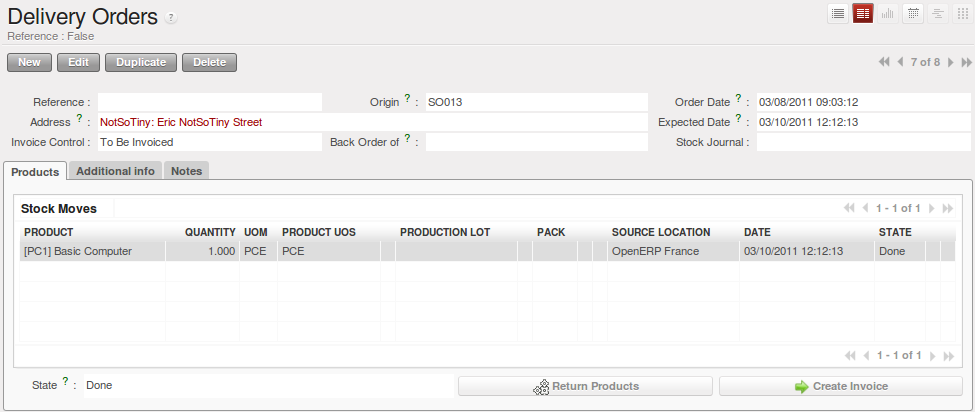

.. i18n: Sales Order
.. i18n: -----------
..

Sales Order
-----------

.. i18n: At this point, you have to login as a user of OpenERP France to make a Sales Order coming from a customer 
.. i18n: of this company.
..

At this point, you have to login as a user of OpenERP France to make a Sales Order coming from a customer 
of this company.

.. i18n: .. figure:: images/sales_order_1tab.png
.. i18n:    :scale: 75
.. i18n:    :align: center
.. i18n:    
.. i18n:    *Defining a Sales Order*
..

   
   *Defining a Sales Order*

.. i18n: You should not forget to set the correct parameters in the second tab `Other Information` to select the good shipping 
.. i18n: and picking policies. Here we select the `Invoice From the Picking` as ``Shipping Policy``. 
..

You should not forget to set the correct parameters in the second tab `Other Information` to select the good shipping 
and picking policies. Here we select the `Invoice From the Picking` as ``Shipping Policy``. 

.. i18n: Confirm the Sales Order, then run the `Scheduler` (:menuselection:`Warehouses --> Schedulers --> Compute 
.. i18n: Schedulers`) and run the Procurement from each company (OpenERP France, OpenERP and OpenERP Belgium).
..

Confirm the Sales Order, then run the `Scheduler` (:menuselection:`Warehouses --> Schedulers --> Compute 
Schedulers`) and run the Procurement from each company (OpenERP France, OpenERP and OpenERP Belgium).

.. i18n: At this time, a `Purchase Order` and a `Delivery Order` have been generated. The Purchase Order is in the ``Request For 
.. i18n: Quotation`` state and you have to convert it into a Purchase Order to confirm the purchase. The Delivery Order is in ``Not Available`` state because you have to buy the products before delivery.
..

At this time, a `Purchase Order` and a `Delivery Order` have been generated. The Purchase Order is in the ``Request For 
Quotation`` state and you have to convert it into a Purchase Order to confirm the purchase. The Delivery Order is in ``Not Available`` state because you have to buy the products before delivery.

.. i18n: .. figure:: images/request_quotation.png
.. i18n:    :scale: 75
.. i18n:    :align: center
.. i18n:    
.. i18n:    *Purchase Order*
..

   
   *Purchase Order*

.. i18n: Once the purchase order has been confirmed and the reception is completed, we can process the delivery order.
..

Once the purchase order has been confirmed and the reception is completed, we can process the delivery order.

.. i18n: Delivery Order
.. i18n: ^^^^^^^^^^^^^^
.. i18n: Once the delivery order is processed, the products are sent to the customer and we can invoice the order from OpenERP 
.. i18n: France on the delivered quantities.
..

Delivery Order
^^^^^^^^^^^^^^
Once the delivery order is processed, the products are sent to the customer and we can invoice the order from OpenERP 
France on the delivered quantities.

.. i18n: The delivery order will be processed from OpenERP Belgium. OpenERP Belgium is the company that manages the stock of products. 
.. i18n: This company is responsible for the delivery of the products to the final customers. However, the invoicing process will be 
.. i18n: handled by OpenERP France, because it is the company that received the order from the customer.
..

The delivery order will be processed from OpenERP Belgium. OpenERP Belgium is the company that manages the stock of products. 
This company is responsible for the delivery of the products to the final customers. However, the invoicing process will be 
handled by OpenERP France, because it is the company that received the order from the customer.

.. i18n: .. figure:: images/delivery_order.png
.. i18n:    :scale: 75
.. i18n:    :align: center
.. i18n:    
.. i18n:    *Deliver the Products*
.. i18n:    
.. i18n: From the user of OpenERP France, we can create the invoice for the order (:menuselection:`Sales --> Invoicing --> Lines 
.. i18n: to Invoice`), then pass the invoice from the Draft state to the Open state. To finalize the invoicing process, you have to 
.. i18n: go to :menuselection:`Accounting --> Customers --> Customers Invoices` to execute the payment process.
..

.. figure:: images/delivery_order.png
   :scale: 75
   :align: center
   
   *Deliver the Products*
   
From the user of OpenERP France, we can create the invoice for the order (:menuselection:`Sales --> Invoicing --> Lines 
to Invoice`), then pass the invoice from the Draft state to the Open state. To finalize the invoicing process, you have to 
go to :menuselection:`Accounting --> Customers --> Customers Invoices` to execute the payment process.

.. i18n: .. figure:: images/delivery_order_fr.png
.. i18n:    :scale: 75
.. i18n:    :align: center
.. i18n:    
.. i18n:    *Create the Invoice*
.. i18n:    
.. i18n: .. figure:: images/customer_invoice.png
.. i18n:    :scale: 75
.. i18n:    :align: center
.. i18n:    
.. i18n:    *Validate the Invoice*
..

   
   *Create the Invoice*
   
.. figure:: images/customer_invoice.png
   :scale: 75
   :align: center
   
   *Validate the Invoice*

.. i18n: .. Copyright © Open Object Press. All rights reserved.
..

.. Copyright © Open Object Press. All rights reserved.

.. i18n: .. You may take electronic copy of this publication and distribute it if you don't
.. i18n: .. change the content. You can also print a copy to be read by yourself only.
..

.. You may take electronic copy of this publication and distribute it if you don't
.. change the content. You can also print a copy to be read by yourself only.

.. i18n: .. We have contracts with different publishers in different countries to sell and
.. i18n: .. distribute paper or electronic based versions of this book (translated or not)
.. i18n: .. in bookstores. This helps to distribute and promote the OpenERP product. It
.. i18n: .. also helps us to create incentives to pay contributors and authors using author
.. i18n: .. rights of these sales.
..

.. We have contracts with different publishers in different countries to sell and
.. distribute paper or electronic based versions of this book (translated or not)
.. in bookstores. This helps to distribute and promote the OpenERP product. It
.. also helps us to create incentives to pay contributors and authors using author
.. rights of these sales.

.. i18n: .. Due to this, grants to translate, modify or sell this book are strictly
.. i18n: .. forbidden, unless Tiny SPRL (representing Open Object Press) gives you a
.. i18n: .. written authorisation for this.
..

.. Due to this, grants to translate, modify or sell this book are strictly
.. forbidden, unless Tiny SPRL (representing Open Object Press) gives you a
.. written authorisation for this.

.. i18n: .. Many of the designations used by manufacturers and suppliers to distinguish their
.. i18n: .. products are claimed as trademarks. Where those designations appear in this book,
.. i18n: .. and Open Object Press was aware of a trademark claim, the designations have been
.. i18n: .. printed in initial capitals.
..

.. Many of the designations used by manufacturers and suppliers to distinguish their
.. products are claimed as trademarks. Where those designations appear in this book,
.. and Open Object Press was aware of a trademark claim, the designations have been
.. printed in initial capitals.

.. i18n: .. While every precaution has been taken in the preparation of this book, the publisher
.. i18n: .. and the authors assume no responsibility for errors or omissions, or for damages
.. i18n: .. resulting from the use of the information contained herein.
..

.. While every precaution has been taken in the preparation of this book, the publisher
.. and the authors assume no responsibility for errors or omissions, or for damages
.. resulting from the use of the information contained herein.

.. i18n: .. Published by Open Object Press, Grand Rosière, Belgium
..

.. Published by Open Object Press, Grand Rosière, Belgium
