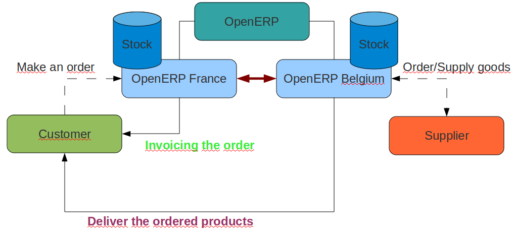

.. i18n: .. _part-multicompany:
.. i18n: 
.. i18n: #########################
.. i18n: Multi-Company Environment
.. i18n: #########################
..

.. _part-multicompany:

#########################
多公司环境
#########################

.. i18n: This part of the book concentrates on the multi-company environment of OpenERP. From version 6.0 of OpenERP, you do not have to
.. i18n: install any additional modules to enable the multi-company environment. All components are included in the base modules. All you have to do to work in a multi-company environment, is add the Useability/Multi-Companies group to your user.
..

书的这部分的主要介绍OpenERP的多公司环境下的应用。OpenERP从6.0版本起，应用多公司的环境你不必安装任何额外的模块。所有的组件都包括在基本模块。您的多公司的环境所要做的工作，是添加 易用性/multi-companies 组给您的用户。

.. i18n: The multi-company environment allows you to manage operations from different companies with different warehouses, customers and suppliers, products, ...
..

多公司的环境让您从不同公司的不同仓库、客户和供应商、产品来管理运营...

.. i18n: In the following chapters, we will perform a complete order flow made by a customer in France that does not 
.. i18n: handle the stock, but delegates it to another company located in Belgium that will deliver the product to the customer.
..

在下面的章节中，我们将执行一个完整的订单流程，一个法国客户没有库存，但将其委托给另一家在比利时的公司，提供产品给客户。

.. i18n: In order to achieve this, we will follow the schema defined below.
..

为完成这一订单，我们制定以下计划。

.. i18n: .. figure:: Logistic/images/schema.png
.. i18n:    :scale: 100
.. i18n:    :align: center
.. i18n:    
.. i18n:    *Flow Schema*
..

   
   *Flow Schema*

.. i18n: To be able to manage the process, please install the following modules:
.. i18n: 	* :mod:`sale`
.. i18n: 	* :mod:`purchase`
.. i18n: 	* :mod:`stock`
.. i18n: 	* :mod:`stock_location`, *Reconfigure* wizard --> *Advanced route* (in order to be able to define pull & push flows)
..

为了能够管理这个过程，请安装以下模块：
	* :mod:`sale`
	* :mod:`purchase`
	* :mod:`stock`
	* :mod:`stock_location`, *Reconfigure* wizard --> *Advanced route* (为了能定义推拉式物流)

.. i18n: .. toctree::
.. i18n:     :maxdepth: 2
.. i18n: 
.. i18n:     Logistic/index
..

.. toctree::
    :maxdepth: 2

    Logistic/index

.. i18n: .. Copyright © Open Object Press. All rights reserved.
..

.. Copyright © Open Object Press. All rights reserved.

.. i18n: .. You may take electronic copy of this publication and distribute it if you don't
.. i18n: .. change the content. You can also print a copy to be read by yourself only.
..

.. You may take electronic copy of this publication and distribute it if you don't
.. change the content. You can also print a copy to be read by yourself only.

.. i18n: .. We have contracts with different publishers in different countries to sell and
.. i18n: .. distribute paper or electronic based versions of this book (translated or not)
.. i18n: .. in bookstores. This helps to distribute and promote the OpenERP product. It
.. i18n: .. also helps us to create incentives to pay contributors and authors using author
.. i18n: .. rights of these sales.
..

.. We have contracts with different publishers in different countries to sell and
.. distribute paper or electronic based versions of this book (translated or not)
.. in bookstores. This helps to distribute and promote the OpenERP product. It
.. also helps us to create incentives to pay contributors and authors using author
.. rights of these sales.

.. i18n: .. Due to this, grants to translate, modify or sell this book are strictly
.. i18n: .. forbidden, unless Tiny SPRL (representing Open Object Press) gives you a
.. i18n: .. written authorisation for this.
..

.. Due to this, grants to translate, modify or sell this book are strictly
.. forbidden, unless Tiny SPRL (representing Open Object Press) gives you a
.. written authorisation for this.

.. i18n: .. Many of the designations used by manufacturers and suppliers to distinguish their
.. i18n: .. products are claimed as trademarks. Where those designations appear in this book,
.. i18n: .. and Open Object Press was aware of a trademark claim, the designations have been
.. i18n: .. printed in initial capitals.
..

.. Many of the designations used by manufacturers and suppliers to distinguish their
.. products are claimed as trademarks. Where those designations appear in this book,
.. and Open Object Press was aware of a trademark claim, the designations have been
.. printed in initial capitals.

.. i18n: .. While every precaution has been taken in the preparation of this book, the publisher
.. i18n: .. and the authors assume no responsibility for errors or omissions, or for damages
.. i18n: .. resulting from the use of the information contained herein.
..

.. While every precaution has been taken in the preparation of this book, the publisher
.. and the authors assume no responsibility for errors or omissions, or for damages
.. resulting from the use of the information contained herein.

.. i18n: .. Published by Open Object Press, Grand Rosière, Belgium
..

.. Published by Open Object Press, Grand Rosière, Belgium
