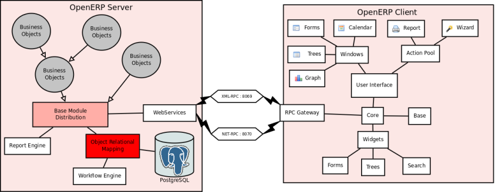

.. i18n: ========================================
.. i18n: Architecture
.. i18n: ========================================
..

========================================
架构
========================================

.. i18n: MVC architecture
.. i18n: ================
..

MVC 架构
================

.. i18n: According to `Wikipedia <http://en.wikipedia.org/wiki/Model-view-controller>`_, "a Model-view-controller (MVC) is an architectural pattern used in software engineering". In complex computer applications presenting lots of data to the user, one often wishes to separate data (model) and user interface (view) concerns. Changes to the user interface does therefore not impact data management, and data can be reorganized without changing the user interface. The model-view-controller solves this problem by decoupling data access and business logic from data presentation and user interaction, by introducing an intermediate component: the controller.
..

在 `Wikipedia <http://zh.wikipedia.org/zh/MVC>`_, "MVC模式（三层架构模式）（Model-View-Controller）是软件工程中的一种软件架构模式". 一个复杂的电脑应用程序会展示大量的数据给用户, 人们希望将数据(model)和界面(view)分离。 改变用户界面并不会影响数据管理，在不改变用户界面的基础上，数据可以得以重新整理。 MVC模式（三层架构模式）通过引入控制器来解耦数据读取和商业逻辑，同时解决数据呈现和用户交互的问题。

.. i18n: .. figure::  images/MVCDiagram.png
.. i18n:    :scale: 100
.. i18n:    :align: center
.. i18n: 
.. i18n:    MVC Diagram
..

.. figure::  images/MVCDiagram.png
   :scale: 100
   :align: center

   MVC 图解

.. i18n: For example in the diagram above, the solid lines for the arrows starting from the controller and going to both the view and the model mean that the controller has a complete access to both the view and the model. The dashed line for the arrow going from the view to the controller means that the view has a limited access to the controller. The reasons of this design are :
..

例如上图中, 带有箭头的实线从控制模同时指向试图和模型，其中的含义是说控制模块对试图和模型具有完全访问权限。 The dashed line for the arrow going from the view to the controller means that the view has a limited access to the controller. The reasons of this design are :

.. i18n:     * From **View** to **Model** : the model sends notification to the view when its data has been modified in order the view to redraw its content. The model doesn't need to know the inner workings of the view to perform this operation. However, the view needs to access the internal parts of the model.
.. i18n:     * From **View** to **Controller** : the reason why the view has limited access to the controller is because the dependencies from the view to the controller need to be minimal: the controller can be replaced at any moment. 
..

    * From **View** to **Model** : the model sends notification to the view when its data has been modified in order the view to redraw its content. The model doesn't need to know the inner workings of the view to perform this operation. However, the view needs to access the internal parts of the model.
    * From **View** to **Controller** : the reason why the view has limited access to the controller is because the dependencies from the view to the controller need to be minimal: the controller can be replaced at any moment. 

.. i18n: MVC Model in OpenERP
.. i18n: --------------------
..

OpenERP MVC 模型
--------------------

.. i18n: In OpenERP, we can apply this model-view-controller semantic with
..

在OpenERP中，我们可以这样应用model-view-controller语义：

.. i18n:     * model : The PostgreSQL tables.
.. i18n:     * view : views are defined in XML files in OpenERP.
.. i18n:     * controller : The objects of OpenERP. 
..

    * model : The PostgreSQL tables.
    * view : views are defined in XML files in OpenERP.
    * controller : The objects of OpenERP. 

    * Model : PostGreSQL数据表
    * View : 在OpenERP中定义XML文件 
    * Controller : OpenERP的对象

.. i18n: MVCSQL
.. i18n: ------
..

MVCSQL
------

.. i18n: Example 1
.. i18n: +++++++++
..

Example 1
+++++++++
例子1
+++++

.. i18n: Suppose sale is a variable on a record of the sale.order object related to the 'sale_order' table. You can acquire such a variable doing this.::
.. i18n: 
.. i18n:     sale = self.browse(cr, uid, ID)
..

假设销售在sale.order对象中相关的sale_order表中是一个可变记录，你可以用使用下面的代码得到这个变量:

    sale = self.browse(cr, uid, ID)

.. i18n: (where cr is the current row, from the database cursor, uid is the current user's ID for security checks, and ID is the sale order's ID or list of IDs if we want more than one)
..

(数据库游标中，cr是当前行，uid是当前用户的ID,为了安全起见，ID是销售订单的ID，如果要得到多个结果的时候，ID就为多个销售订单ID的列表)

.. i18n: Suppose you want to get: the country name of the first contact of a partner related to the ID sale order. You can do the following in OpenERP::
.. i18n: 
.. i18n:     country_name = sale.partner_id.address[0].country_id.name
..

假设你想要根据第一个合作伙伴相关的销售订单ID取得相应的国家名，那么你可以在OpenERP中如下实现:

    country_name = sale.partner_id.address[0].country_id.name

.. i18n: If you want to write the same thing in traditional SQL development, it will be in python: (we suppose cr is the cursor on the database, with psycopg)
..

If you want to write the same thing in traditional SQL development, 
it will be in python: (we suppose cr is the cursor on the database, with psycopg)
如果你要用传统的SQL开发写相同情况的代码，用 python 是这样的：（假设我们用 cr 作为数据库的游标，使用psycopg）

.. i18n: .. code-block:: python
.. i18n: 
.. i18n:     cr.execute('select partner_id from sale_order where id=%d', (ID,))
.. i18n:     partner_id = cr.fetchone()[0]
.. i18n:     cr.execute('select country_id from res_partner_address where partner_id=%d', (partner_id,))
.. i18n:     country_id = cr.fetchone()[0]
.. i18n:     cr.execute('select name from res_country where id=%d', (country_id,))
.. i18n:     del partner_id
.. i18n:     del country_id
.. i18n:     country_name = cr.fetchone()[0]
..

.. code-block:: python

    cr.execute('select partner_id from sale_order where id=%d', (ID,))
    partner_id = cr.fetchone()[0]
    cr.execute('select country_id from res_partner_address where partner_id=%d', (partner_id,))
    country_id = cr.fetchone()[0]
    cr.execute('select name from res_country where id=%d', (country_id,))
    del partner_id
    del country_id
    country_name = cr.fetchone()[0]

.. i18n: Of course you can do better if you develop smartly in SQL, using joins or subqueries. But you have to be smart and most of the time you will not be able to make such improvements:
..

Of course you can do better if you develop smartly in SQL, using joins or subqueries. But you have to be smart and most of the time you will not be able to make such improvements:

.. i18n:     * Maybe some parts are in others functions
.. i18n:     * There may be a loop in different elements
.. i18n:     * You have to use intermediate variables like country_id
..

    * Maybe some parts are in others functions
    * There may be a loop in different elements
    * You have to use intermediate variables like country_id

.. i18n: The first operation as an object call is much better for several reasons:
..

The first operation as an object call is much better for several reasons:

.. i18n:     * It uses objects facilities and works with modules inheritances, overload, ...
.. i18n:     * It's simpler, more explicit and uses less code
.. i18n:     * It's much more efficient as you will see in the following examples
.. i18n:     * Some fields do not directly correspond to a SQL field (e.g.: function fields in Python)
..

    * It uses objects facilities and works with modules inheritances, overload, ...
    * It's simpler, more explicit and uses less code
    * It's much more efficient as you will see in the following examples
    * Some fields do not directly correspond to a SQL field (e.g.: function fields in Python)

.. i18n: Prefetching
.. i18n: +++++++++++
..

Prefetching
+++++++++++

.. i18n: Suppose that later in the code, in another function, you want to access the name of the partner associated to your sale order. You can use this::
.. i18n: 
.. i18n:     partner_name = sale.partner_id.name
..

Suppose that later in the code, in another function, you want to access the name of the partner associated to your sale order. You can use this::

    partner_name = sale.partner_id.name

.. i18n: And this will not generate any SQL query as it has been prefetched by the object relational mapping engine of OpenERP.
..

And this will not generate any SQL query as it has been prefetched by the object relational mapping engine of OpenERP.

.. i18n: Loops and special fields
.. i18n: ++++++++++++++++++++++++
..

Loops and special fields
++++++++++++++++++++++++

.. i18n: Suppose now that you want to compute the totals of 10 sales order by countries. You can do this in OpenERP within a OpenERP object:
..

假如现在你想计算一个区域10个销售订单总数. 在OpenERP中通过一个对象如下操作:

.. i18n: .. code-block:: python
.. i18n: 
.. i18n:     def get_totals(self, cr, uid, ids):
.. i18n:        countries = {}
.. i18n:        for sale in self.browse(cr, uid, ids):
.. i18n:           country = sale.partner_invoice_id.country
.. i18n:           countries.setdefault(country, 0.0)
.. i18n:           countries[country] += sale.amount_untaxed
.. i18n:        return countries
..

.. code-block:: python

    def get_totals(self, cr, uid, ids):
       countries = {}
       for sale in self.browse(cr, uid, ids):
          country = sale.partner_invoice_id.country
          countries.setdefault(country, 0.0)
          countries[country] += sale.amount_untaxed
       return countries

.. i18n: And, to print them as a good way, you can add this on your object:
..

并且, 你能加打印他们的好的方法到你的对象中:

.. i18n: .. code-block:: python
.. i18n: 
.. i18n:     def print_totals(self, cr, uid, ids):
.. i18n:        result = self.get_totals(cr, uid, ids)
.. i18n:        for country in result.keys():
.. i18n:           print '[%s] %s: %.2f' (country.code, country.name, result[country])
..

.. code-block:: python

    def print_totals(self, cr, uid, ids):
       result = self.get_totals(cr, uid, ids)
       for country in result.keys():
          print '[%s] %s: %.2f' (country.code, country.name, result[country])

.. i18n: The 2 functions will generate 4 SQL queries in total ! This is due to the SQL engine of OpenERP that does prefetching, works on lists and uses caching methods. The 3 queries are:
..

The 2 functions will generate 4 SQL queries in total ! This is due to the SQL engine of OpenERP that does prefetching, works on lists and uses caching methods. The 3 queries are:

.. i18n:    1. Reading the sale.order to get ID's of the partner's address
.. i18n:    2. Reading the partner's address for the countries
.. i18n:    3. Calling the amount_untaxed function that will compute a total of the sale order lines
.. i18n:    4. Reading the countries info (code and name)
..

   1. Reading the sale.order to get ID's of the partner's address
   2. Reading the partner's address for the countries
   3. Calling the amount_untaxed function that will compute a total of the sale order lines
   4. Reading the countries info (code and name)

.. i18n: That's great because if you run this code on 1000 sales orders, you have the guarantee to only have 4 SQL queries.
..

That's great because if you run this code on 1000 sales orders, you have the guarantee to only have 4 SQL queries.

.. i18n: Notes:
..

Notes:

.. i18n:     * IDS is the list of the 10 ID's: [12,15,18,34, ...,99]
.. i18n:     * The arguments of a function are always the same:
.. i18n: 
.. i18n:           - cr: the cursor database (from psycopg)
.. i18n:           - uid: the user id (for security checks)
.. i18n:     * If you run this code on 5000 sales orders, you may have 8 SQL queries because as SQL queries are not allowed to take too much memory, it may have to do two separate readings.
..

    * IDS is the list of the 10 ID's: [12,15,18,34, ...,99]
    * The arguments of a function are always the same:

          - cr: the cursor database (from psycopg)
          - uid: the user id (for security checks)
    * If you run this code on 5000 sales orders, you may have 8 SQL queries because as SQL queries are not allowed to take too much memory, it may have to do two separate readings.

.. i18n: Complex example
.. i18n: +++++++++++++++
..

Complex example
+++++++++++++++

.. i18n: Here is a complete example, from the OpenERP official distribution, of the function that does bill of material explosion and computation of associated routings:
..

Here is a complete example, from the OpenERP official distribution, of the function that does bill of material explosion and computation of associated routings:

.. i18n: .. code-block:: python
.. i18n: 
.. i18n:     class mrp_bom(osv.osv):
.. i18n:         ...
.. i18n:         def _bom_find(self, cr, uid, product_id, product_uom, properties=[]):
.. i18n:             bom_result = False
.. i18n:             # Why searching on BoM without parent ?
.. i18n:             cr.execute('select id from mrp_bom where product_id=%d and bom_id is null
.. i18n:                           order by sequence', (product_id,))
.. i18n:             ids = map(lambda x: x[0], cr.fetchall())
.. i18n:             max_prop = 0
.. i18n:             result = False
.. i18n:             for bom in self.pool.get('mrp.bom').browse(cr, uid, ids):
.. i18n:                 prop = 0
.. i18n:                 for prop_id in bom.property_ids:
.. i18n:                     if prop_id.id in properties:
.. i18n:                         prop+=1
.. i18n:                 if (prop>max_prop) or ((max_prop==0) and not result):
.. i18n:                     result = bom.id
.. i18n:                     max_prop = prop
.. i18n:             return result
.. i18n: 
.. i18n:             def _bom_explode(self, cr, uid, bom, factor, properties, addthis=False, level=10):
.. i18n:                 factor = factor / (bom.product_efficiency or 1.0)
.. i18n:                 factor = rounding(factor, bom.product_rounding)
.. i18n:                 if factor<bom.product_rounding:
.. i18n:                     factor = bom.product_rounding
.. i18n:                 result = []
.. i18n:                 result2 = []
.. i18n:                 phantom = False
.. i18n:                 if bom.type=='phantom' and not bom.bom_lines:
.. i18n:                     newbom = self._bom_find(cr, uid, bom.product_id.id,
.. i18n:                                             bom.product_uom.id, properties)
.. i18n:                     if newbom:
.. i18n:                         res = self._bom_explode(cr, uid, self.browse(cr, uid, [newbom])[0],
.. i18n:                               factor*bom.product_qty, properties, addthis=True, level=level+10)
.. i18n:                         result = result + res[0]
.. i18n:                         result2 = result2 + res[1]
.. i18n:                         phantom = True
.. i18n:                     else:
.. i18n:                         phantom = False
.. i18n:                 if not phantom:
.. i18n:                     if addthis and not bom.bom_lines:
.. i18n:                         result.append(
.. i18n:                         {
.. i18n:                             'name': bom.product_id.name,
.. i18n:                             'product_id': bom.product_id.id,
.. i18n:                             'product_qty': bom.product_qty * factor,
.. i18n:                             'product_uom': bom.product_uom.id,
.. i18n:                             'product_uos_qty': bom.product_uos and 
.. i18n:                                                bom.product_uos_qty * factor or False,
.. i18n:                             'product_uos': bom.product_uos and bom.product_uos.id or False,
.. i18n:                         })
.. i18n:                     if bom.routing_id:
.. i18n:                         for wc_use in bom.routing_id.workcenter_lines:
.. i18n:                             wc = wc_use.workcenter_id
.. i18n:                             d, m = divmod(factor, wc_use.workcenter_id.capacity_per_cycle)
.. i18n:                             mult = (d + (m and 1.0 or 0.0))
.. i18n:                             cycle = mult * wc_use.cycle_nbr
.. i18n:                             result2.append({
.. i18n:                                 'name': bom.routing_id.name,
.. i18n:                                 'workcenter_id': wc.id,
.. i18n:                                 'sequence': level+(wc_use.sequence or 0),
.. i18n:                                 'cycle': cycle,
.. i18n:                                 'hour': float(wc_use.hour_nbr*mult +
.. i18n:                                               (wc.time_start+wc.time_stop+cycle*wc.time_cycle) *
.. i18n:                                                (wc.time_efficiency or 1.0)),
.. i18n:                             })
.. i18n:                     for bom2 in bom.bom_lines:
.. i18n:                          res = self._bom_explode(cr, uid, bom2, factor, properties,
.. i18n:                                                      addthis=True, level=level+10)
.. i18n:                          result = result + res[0]
.. i18n:                          result2 = result2 + res[1]
.. i18n:                 return result, result2
..

.. code-block:: python

    class mrp_bom(osv.osv):
        ...
        def _bom_find(self, cr, uid, product_id, product_uom, properties=[]):
            bom_result = False
            # Why searching on BoM without parent ?
            cr.execute('select id from mrp_bom where product_id=%d and bom_id is null
                          order by sequence', (product_id,))
            ids = map(lambda x: x[0], cr.fetchall())
            max_prop = 0
            result = False
            for bom in self.pool.get('mrp.bom').browse(cr, uid, ids):
                prop = 0
                for prop_id in bom.property_ids:
                    if prop_id.id in properties:
                        prop+=1
                if (prop>max_prop) or ((max_prop==0) and not result):
                    result = bom.id
                    max_prop = prop
            return result

            def _bom_explode(self, cr, uid, bom, factor, properties, addthis=False, level=10):
                factor = factor / (bom.product_efficiency or 1.0)
                factor = rounding(factor, bom.product_rounding)
                if factor<bom.product_rounding:
                    factor = bom.product_rounding
                result = []
                result2 = []
                phantom = False
                if bom.type=='phantom' and not bom.bom_lines:
                    newbom = self._bom_find(cr, uid, bom.product_id.id,
                                            bom.product_uom.id, properties)
                    if newbom:
                        res = self._bom_explode(cr, uid, self.browse(cr, uid, [newbom])[0],
                              factor*bom.product_qty, properties, addthis=True, level=level+10)
                        result = result + res[0]
                        result2 = result2 + res[1]
                        phantom = True
                    else:
                        phantom = False
                if not phantom:
                    if addthis and not bom.bom_lines:
                        result.append(
                        {
                            'name': bom.product_id.name,
                            'product_id': bom.product_id.id,
                            'product_qty': bom.product_qty * factor,
                            'product_uom': bom.product_uom.id,
                            'product_uos_qty': bom.product_uos and 
                                               bom.product_uos_qty * factor or False,
                            'product_uos': bom.product_uos and bom.product_uos.id or False,
                        })
                    if bom.routing_id:
                        for wc_use in bom.routing_id.workcenter_lines:
                            wc = wc_use.workcenter_id
                            d, m = divmod(factor, wc_use.workcenter_id.capacity_per_cycle)
                            mult = (d + (m and 1.0 or 0.0))
                            cycle = mult * wc_use.cycle_nbr
                            result2.append({
                                'name': bom.routing_id.name,
                                'workcenter_id': wc.id,
                                'sequence': level+(wc_use.sequence or 0),
                                'cycle': cycle,
                                'hour': float(wc_use.hour_nbr*mult +
                                              (wc.time_start+wc.time_stop+cycle*wc.time_cycle) *
                                               (wc.time_efficiency or 1.0)),
                            })
                    for bom2 in bom.bom_lines:
                         res = self._bom_explode(cr, uid, bom2, factor, properties,
                                                     addthis=True, level=level+10)
                         result = result + res[0]
                         result2 = result2 + res[1]
                return result, result2

.. i18n: Technical architecture
.. i18n: ======================
..

技术架构
======================

.. i18n: OpenERP is a `multitenant <http://en.wikipedia.org/wiki/Multitenancy>`_,
.. i18n: `three-tier architecture
.. i18n: <http://en.wikipedia.org/wiki/Multitier_architecture#Three-tier_architecture>`_.
.. i18n: The application tier itself is written as a core, multiple additional
.. i18n: modules can be installed to create a particular configuration of
.. i18n: OpenERP.
..

OpenERP is a `multitenant <http://en.wikipedia.org/wiki/Multitenancy>`_,
`three-tier architecture
<http://en.wikipedia.org/wiki/Multitier_architecture#Three-tier_architecture>`_.
The application tier itself is written as a core, multiple additional
modules can be installed to create a particular configuration of
OpenERP.

.. i18n: The core of OpenERP and its modules are written in `Python
.. i18n: <http://python.org/>`_. The functionality of a module is exposed through
.. i18n: XML-RPC (and/or NET-RPC depending on the server's configuration)[#]. Modules
.. i18n: typically make use of OpenERP's ORM to persist their data in a relational
.. i18n: database (PostgreSQL). Modules can insert data in the database during
.. i18n: installation by providing XML, CSV, or YML files.
..

The core of OpenERP and its modules are written in `Python
<http://python.org/>`_. The functionality of a module is exposed through
XML-RPC (and/or NET-RPC depending on the server's configuration)[#]. Modules
typically make use of OpenERP's ORM to persist their data in a relational
database (PostgreSQL). Modules can insert data in the database during
installation by providing XML, CSV, or YML files.

.. i18n: .. figure:: images/client_server.png
.. i18n:    :scale: 85
.. i18n:    :align: center
..

.. i18n: .. [#] JSON-RPC is planned for OpenERP v6.1.
..

.. [#] JSON-RPC is planned for OpenERP v6.1.

.. i18n: The OpenERP server
.. i18n: ------------------
..

The OpenERP server
------------------

.. i18n: OpenERP provides an application server on which specific business applications
.. i18n: can be built. It is also a complete development framework, offering a range of
.. i18n: features to write those applications. The salient features are a flexible ORM,
.. i18n: a MVC architecture, extensible data models and views, different report engines,
.. i18n: all tied together in a coherent, network-accessible framework.
..

OpenERP provides an application server on which specific business applications
can be built. It is also a complete development framework, offering a range of
features to write those applications. The salient features are a flexible ORM,
a MVC architecture, extensible data models and views, different report engines,
all tied together in a coherent, network-accessible framework.

.. i18n: From a developer perspective, the server acts both as a library which brings
.. i18n: the above benefits while hiding the low-level, nitty-gritty details, and as a
.. i18n: simple way to install, configure and run the written applications.
..

From a developer perspective, the server acts both as a library which brings
the above benefits while hiding the low-level, nitty-gritty details, and as a
simple way to install, configure and run the written applications.

.. i18n: Modules
.. i18n: -------
..

Modules
-------

.. i18n: By itself, the OpenERP server is not very useful. For any enterprise, the value
.. i18n: of OpenERP lies in its different modules. It is the role of the modules to
.. i18n: implement any business needs. The server is only the necessary machinery to run
.. i18n: the modules. A lot of modules already exist. Any official OpenERP release
.. i18n: includes about 170 of them, and hundreds of modules are available through the
.. i18n: community. Examples of modules are Account, CRM, HR, Marketing, MRP, Sale, etc.
..

By itself, the OpenERP server is not very useful. For any enterprise, the value
of OpenERP lies in its different modules. It is the role of the modules to
implement any business needs. The server is only the necessary machinery to run
the modules. A lot of modules already exist. Any official OpenERP release
includes about 170 of them, and hundreds of modules are available through the
community. Examples of modules are Account, CRM, HR, Marketing, MRP, Sale, etc.

.. i18n: A module is usually composed of data models, together with some initial data,
.. i18n: views definitions (i.e. how data from specific data models should be displayed
.. i18n: to the user), wizards (specialized screens to help the user for specific
.. i18n: interactions), workflows definitions, and reports.
..

A module is usually composed of data models, together with some initial data,
views definitions (i.e. how data from specific data models should be displayed
to the user), wizards (specialized screens to help the user for specific
interactions), workflows definitions, and reports.

.. i18n: Clients
.. i18n: -------
..

Clients
-------

.. i18n: Clients can communicate with an OpenERP server using XML-RPC. A custom, faster
.. i18n: protocol called NET-RPC is also provided but will shortly disappear, replaced
.. i18n: by JSON-RPC. XML-RPC, as JSON-RPC in the future, makes it possible to write
.. i18n: clients for OpenERP in a variety of programming languages. OpenERP S.A.
.. i18n: develops two different clients: a desktop client, written with the widely used
.. i18n: `GTK+ <http://www.gtk.org/>`_ graphical toolkit, and a web client that should
.. i18n: run in any modern web browser.
..

Clients can communicate with an OpenERP server using XML-RPC. A custom, faster
protocol called NET-RPC is also provided but will shortly disappear, replaced
by JSON-RPC. XML-RPC, as JSON-RPC in the future, makes it possible to write
clients for OpenERP in a variety of programming languages. OpenERP S.A.
develops two different clients: a desktop client, written with the widely used
`GTK+ <http://www.gtk.org/>`_ graphical toolkit, and a web client that should
run in any modern web browser.

.. i18n: As the logic of OpenERP should entirely reside on the server, the client is
.. i18n: conceptually very simple; it issues a request to the server and display the result
.. i18n: (e.g. a list of customers) in different manners (as forms, lists, calendars,
.. i18n: ...). Upon user actions, it will send modified data to the server.
..

As the logic of OpenERP should entirely reside on the server, the client is
conceptually very simple; it issues a request to the server and display the result
(e.g. a list of customers) in different manners (as forms, lists, calendars,
...). Upon user actions, it will send modified data to the server.

.. i18n: Relational database server and ORM
.. i18n: ----------------------------------
..

Relational database server and ORM
----------------------------------

.. i18n: The data tier of OpenERP is provided by a PostgreSQL relational database. While
.. i18n: direct SQL queries can be executed from OpenERP modules, most database access
.. i18n: to the relational database is done through the `Object-Relational Mapping
.. i18n: <http://en.wikipedia.org/wiki/Object-relational_mapping>`_.
..

The data tier of OpenERP is provided by a PostgreSQL relational database. While
direct SQL queries can be executed from OpenERP modules, most database access
to the relational database is done through the `Object-Relational Mapping
<http://en.wikipedia.org/wiki/Object-relational_mapping>`_.

.. i18n: The ORM is one of the salient features mentioned above. The data models are
.. i18n: described in Python and OpenERP creates the underlying database tables. All the
.. i18n: benefits of RDBMS (unique constraints, relational integrity, efficient
.. i18n: querying, ...) are used when possible and completed by Python flexibility. For
.. i18n: instance, arbitrary constraints written in Python can be added to any model.
.. i18n: Different modular extensibility mechanisms are also afforded by OpenERP[#].
..

The ORM is one of the salient features mentioned above. The data models are
described in Python and OpenERP creates the underlying database tables. All the
benefits of RDBMS (unique constraints, relational integrity, efficient
querying, ...) are used when possible and completed by Python flexibility. For
instance, arbitrary constraints written in Python can be added to any model.
Different modular extensibility mechanisms are also afforded by OpenERP[#].

.. i18n: .. [#] It is important to understand the ORM responsibility before attempting to by-pass it and access directly the underlying database via raw SQL queries.  When using the ORM, OpenERP can make sure the data remains free of any corruption.  For instance, a module can react to data creation in a particular table. This reaction can only happen if the ORM is used to create that data.
..

.. [#] It is important to understand the ORM responsibility before attempting to by-pass it and access directly the underlying database via raw SQL queries.  When using the ORM, OpenERP can make sure the data remains free of any corruption.  For instance, a module can react to data creation in a particular table. This reaction can only happen if the ORM is used to create that data.

.. i18n: Models
.. i18n: ------
..

Models
------

.. i18n: To define data models and otherwise pursue any work with the associated data,
.. i18n: OpenERP as many ORMs uses the concept of 'model'. A model is the authoritative
.. i18n: specification of how some data are structured, constrained, and manipulated. In
.. i18n: practice, a model is written as a Python class. The class encapsulates anything
.. i18n: there is to know about the model: the different fields composing the model,
.. i18n: default values to be used when creating new records, constraints, and so on. It
.. i18n: also holds the dynamic aspect of the data it controls: methods on the class can
.. i18n: be written to implement any business needs (for instance, what to do upon user
.. i18n: action, or upon workflow transitions).
..

To define data models and otherwise pursue any work with the associated data,
OpenERP as many ORMs uses the concept of 'model'. A model is the authoritative
specification of how some data are structured, constrained, and manipulated. In
practice, a model is written as a Python class. The class encapsulates anything
there is to know about the model: the different fields composing the model,
default values to be used when creating new records, constraints, and so on. It
also holds the dynamic aspect of the data it controls: methods on the class can
be written to implement any business needs (for instance, what to do upon user
action, or upon workflow transitions).

.. i18n: There are two different models. One is simply called 'model', and the second is
.. i18n: called 'transient model'. The two models provide the same capabilities with a
.. i18n: single difference: transient models are automatically cleared from the
.. i18n: database (they can be cleaned when some limit on the number of records is
.. i18n: reached, or when they are untouched for some time).
..

There are two different models. One is simply called 'model', and the second is
called 'transient model'. The two models provide the same capabilities with a
single difference: transient models are automatically cleared from the
database (they can be cleaned when some limit on the number of records is
reached, or when they are untouched for some time).

.. i18n: To describe the data model per se, OpenERP offers a range of different kind of
.. i18n: fields. There are basic fields such as integer, or text fields. There are
.. i18n: relational fields to implement one-to-many, many-to-one, and many-to-many
.. i18n: relationships. There are so-called function fields, which are dynamically
.. i18n: computed and are not necessarily available in database, and more.
..

To describe the data model per se, OpenERP offers a range of different kind of
fields. There are basic fields such as integer, or text fields. There are
relational fields to implement one-to-many, many-to-one, and many-to-many
relationships. There are so-called function fields, which are dynamically
computed and are not necessarily available in database, and more.

.. i18n: Access to data is controlled by OpenERP and configured by different mechanisms.
.. i18n: This ensures that different users can have read and/or write access to only the
.. i18n: relevant data. Access can be controlled with respect to user groups and rules
.. i18n: based on the value of the data themselves.
..

Access to data is controlled by OpenERP and configured by different mechanisms.
This ensures that different users can have read and/or write access to only the
relevant data. Access can be controlled with respect to user groups and rules
based on the value of the data themselves.

.. i18n: Modules
.. i18n: -------
..

Modules
-------

.. i18n: OpenERP supports a modular approach both from a development perspective and a
.. i18n: deployment point of view. In essence, a module groups everything related to a
.. i18n: single concern in one meaningful entity. It is comprised of models, views,
.. i18n: workflows, and wizards.
..

OpenERP supports a modular approach both from a development perspective and a
deployment point of view. In essence, a module groups everything related to a
single concern in one meaningful entity. It is comprised of models, views,
workflows, and wizards.

.. i18n: Services and WSGI
.. i18n: -----------------
..

Services and WSGI
-----------------

.. i18n: Everything in OpenERP, and models methods in particular, are exposed via the
.. i18n: network and a security layer. Access to the data model is in fact a 'service'
.. i18n: and it is possible to expose new services. For instance, a WebDAV service and a
.. i18n: FTP service are available.
..

Everything in OpenERP, and models methods in particular, are exposed via the
network and a security layer. Access to the data model is in fact a 'service'
and it is possible to expose new services. For instance, a WebDAV service and a
FTP service are available.

.. i18n: While not mandatory, the services can make use of the `WSGI
.. i18n: <http://en.wikipedia.org/wiki/Web_Server_Gateway_Interface>`_ stack.
.. i18n: WSGI is a standard solution in the Python ecosystem to write HTTP servers,
.. i18n: applications, and middleware which can be used in a mix-and-match fashion.
.. i18n: By using WSGI, it is possible to run OpenERP in any WSGI-compliant server, but
.. i18n: also to use OpenERP to host a WSGI application.
..

While not mandatory, the services can make use of the `WSGI
<http://en.wikipedia.org/wiki/Web_Server_Gateway_Interface>`_ stack.
WSGI is a standard solution in the Python ecosystem to write HTTP servers,
applications, and middleware which can be used in a mix-and-match fashion.
By using WSGI, it is possible to run OpenERP in any WSGI-compliant server, but
also to use OpenERP to host a WSGI application.

.. i18n: A striking example of this possibility is the OpenERP Web project. OpenERP Web
.. i18n: is the server-side counter part to the web clients. It is OpenERP Web which
.. i18n: provides the web pages to the browser and manages web sessions. OpenERP Web is
.. i18n: a WSGI-compliant application. As such, it can be run as a stand-alone HTTP
.. i18n: server or embedded inside OpenERP.
..

A striking example of this possibility is the OpenERP Web project. OpenERP Web
is the server-side counter part to the web clients. It is OpenERP Web which
provides the web pages to the browser and manages web sessions. OpenERP Web is
a WSGI-compliant application. As such, it can be run as a stand-alone HTTP
server or embedded inside OpenERP.

.. i18n: XML-RPC, JSON-RPC
.. i18n: -----------------
..

XML-RPC, JSON-RPC
-----------------

.. i18n: The access to the models makes also use of the WSGI stack. This can be done
.. i18n: using the XML-RPC protocol, and JSON-RPC will be added soon.
..

The access to the models makes also use of the WSGI stack. This can be done
using the XML-RPC protocol, and JSON-RPC will be added soon.

.. i18n: Explanation of modules:
..

Explanation of modules:

.. i18n: **Server - Base distribution**
..

**Server - Base distribution**

.. i18n: We use a distributed communication mechanism inside the OpenERP server. Our engine supports most commonly distributed patterns: request/reply, publish/subscribe, monitoring, triggers/callback, ...
..

We use a distributed communication mechanism inside the OpenERP server. Our engine supports most commonly distributed patterns: request/reply, publish/subscribe, monitoring, triggers/callback, ...

.. i18n: Different business objects can be in different computers or the same objects can be on multiple computers to perform load-balancing.
..

Different business objects can be in different computers or the same objects can be on multiple computers to perform load-balancing.

.. i18n: **Server - Object Relational Mapping (ORM)**
..

**Server - Object Relational Mapping (ORM)**

.. i18n: This layer provides additional object functionality on top of PostgreSQL:
..

This layer provides additional object functionality on top of PostgreSQL:

.. i18n:     * Consistency: powerful validity checks,
.. i18n:     * Work with objects (methods, references, ...)
.. i18n:     * Row-level security (per user/group/role)
.. i18n:     * Complex actions on a group of resources
.. i18n:     * Inheritance 
..

    * Consistency: powerful validity checks,
    * Work with objects (methods, references, ...)
    * Row-level security (per user/group/role)
    * Complex actions on a group of resources
    * Inheritance 

.. i18n: **Server - Web-Services**
..

**Server - Web-Services**

.. i18n: The web-service module offer a common interface for all web-services
..

The web-service module offer a common interface for all web-services

.. i18n:     * SOAP
.. i18n:     * XML-RPC
.. i18n:     * NET-RPC 
..

    * SOAP
    * XML-RPC
    * NET-RPC 

.. i18n: Business objects can also be accessed via the distributed object mechanism. They can all be modified via the client interface with contextual views.
..

Business objects can also be accessed via the distributed object mechanism. They can all be modified via the client interface with contextual views.

.. i18n: **Server - Workflow Engine**
..

**Server - Workflow Engine**

.. i18n: Workflows are graphs represented by business objects that describe the dynamics of the company. Workflows are also used to track processes that evolve over time.
..

Workflows are graphs represented by business objects that describe the dynamics of the company. Workflows are also used to track processes that evolve over time.

.. i18n: An example of workflow used in OpenERP:
..

An example of workflow used in OpenERP:

.. i18n: A sales order generates an invoice and a shipping order
..

A sales order generates an invoice and a shipping order

.. i18n: **Server - Report Engine**
..

**Server - Report Engine**

.. i18n: Reports in OpenERP can be rendered in different ways:
..

Reports in OpenERP can be rendered in different ways:

.. i18n:     * Custom reports: those reports can be directly created via the client interface, no programming required. Those reports are represented by business objects (ir.report.custom)
.. i18n:     * High quality personalized reports using openreport: no programming required but you have to write 2 small XML files:
.. i18n: 
.. i18n:           - a template which indicates the data you plan to report
.. i18n:           - an XSL:RML stylesheet 
.. i18n:     * Hard coded reports
.. i18n:     * OpenOffice Writer templates 
..

    * Custom reports: those reports can be directly created via the client interface, no programming required. Those reports are represented by business objects (ir.report.custom)
    * High quality personalized reports using openreport: no programming required but you have to write 2 small XML files:

          - a template which indicates the data you plan to report
          - an XSL:RML stylesheet 
    * Hard coded reports
    * OpenOffice Writer templates 

.. i18n: Nearly all reports are produced in PDF.
..

Nearly all reports are produced in PDF.

.. i18n: **Server - Business Objects**
..

**Server - Business Objects**

.. i18n: Almost everything is a business object in OpenERP, they describe all data of the program (workflows, invoices, users, customized reports, ...). Business objects are described using the ORM module. They are persistent and can have multiple views (described by the user or automatically calculated).
..

Almost everything is a business object in OpenERP, they describe all data of the program (workflows, invoices, users, customized reports, ...). Business objects are described using the ORM module. They are persistent and can have multiple views (described by the user or automatically calculated).

.. i18n: Business objects are structured in the /module directory.
..

Business objects are structured in the /module directory.

.. i18n: **Client - Wizards**
..

**Client - Wizards**

.. i18n: Wizards are graphs of actions/windows that the user can perform during a session.
..

Wizards are graphs of actions/windows that the user can perform during a session.

.. i18n: **Client - Widgets**
..

**Client - Widgets**

.. i18n: Widgets are probably, although the origin of the term seems to be very difficult to trace, "WIndow gaDGETS" in the IT world, which mean they are gadgets before anything, which implement elementary features through a portable visual tool.
..

Widgets are probably, although the origin of the term seems to be very difficult to trace, "WIndow gaDGETS" in the IT world, which mean they are gadgets before anything, which implement elementary features through a portable visual tool.

.. i18n: All common widgets are supported:
..

All common widgets are supported:

.. i18n:     * entries
.. i18n:     * textboxes
.. i18n:     * floating point numbers
.. i18n:     * dates (with calendar)
.. i18n:     * checkboxes
.. i18n:     * ... 
..

    * entries
    * textboxes
    * floating point numbers
    * dates (with calendar)
    * checkboxes
    * ... 

.. i18n: And also all special widgets:
..

And also all special widgets:

.. i18n:     * buttons that call actions
.. i18n:     * references widgets
.. i18n: 
.. i18n:           - one2one
.. i18n: 
.. i18n:           - many2one
.. i18n: 
.. i18n:           - many2many
.. i18n: 
.. i18n:           - one2many in list
.. i18n: 
.. i18n:           - ... 
..

    * buttons that call actions
    * references widgets

          - one2one

          - many2one

          - many2many

          - one2many in list

          - ... 

.. i18n: Widget have different appearances in different views. For example, the date widget in the search dialog represents two normal dates for a range of date (from...to...).
..

Widget have different appearances in different views. For example, the date widget in the search dialog represents two normal dates for a range of date (from...to...).

.. i18n: Some widgets may have different representations depending on the context. For example, the one2many widget can be represented as a form with multiple pages or a multi-columns list.
..

Some widgets may have different representations depending on the context. For example, the one2many widget can be represented as a form with multiple pages or a multi-columns list.

.. i18n: Events on the widgets module are processed with a callback mechanism. A callback mechanism is a process whereby an element defines the type of events he can handle and which methods should be called when this event is triggered. Once the event is triggered, the system knows that the event is bound to a specific method, and calls that method back. Hence callback. 
..

Events on the widgets module are processed with a callback mechanism. A callback mechanism is a process whereby an element defines the type of events he can handle and which methods should be called when this event is triggered. Once the event is triggered, the system knows that the event is bound to a specific method, and calls that method back. Hence callback. 

.. i18n: Module Integrations
.. i18n: ===================
..

模块集成
===================

.. i18n: The are many different modules available for OpenERP and suited for different business models. Nearly all of these are optional (except ModulesAdminBase), making it easy to customize OpenERP to serve specific business needs. All the modules are in a directory named addons/ on the server. You simply need to copy or delete a module directory in order to either install or delete the module on the OpenERP platform.
..

The are many different modules available for OpenERP and suited for different business models. Nearly all of these are optional (except ModulesAdminBase), making it easy to customize OpenERP to serve specific business needs. All the modules are in a directory named addons/ on the server. You simply need to copy or delete a module directory in order to either install or delete the module on the OpenERP platform.

.. i18n: Some modules depend on other modules. See the file addons/module/__openerp__.py for more information on the dependencies.
..

Some modules depend on other modules. See the file addons/module/__openerp__.py for more information on the dependencies.

.. i18n: Here is an example of __openerp__.py:
..

Here is an example of __openerp__.py:

.. i18n: .. code-block:: python
.. i18n: 
.. i18n: 	{
.. i18n: 	    "name" : "Open TERP Accounting",
.. i18n: 	    "version" : "1.0",
.. i18n: 	    "author" : "Bob Gates - Not So Tiny",
.. i18n: 	    "website" : "http://www.openerp.com/",
.. i18n: 	    "category" : "Generic Modules/Others",
.. i18n: 	    "depends" : ["base"],
.. i18n: 	    "description" : """A
.. i18n: 	    Multiline
.. i18n: 	    Description
.. i18n: 	    """,
.. i18n: 	    "init_xml" : ["account_workflow.xml", "account_data.xml", "account_demo.xml"],
.. i18n: 	    "demo_xml" : ["account_demo.xml"],
.. i18n: 	    "update_xml" : ["account_view.xml", "account_report.xml", "account_wizard.xml"],
.. i18n: 	    "active": False,
.. i18n: 	    "installable": True
.. i18n: 	}
..

.. code-block:: python

	{
	    "name" : "Open TERP Accounting",
	    "version" : "1.0",
	    "author" : "Bob Gates - Not So Tiny",
	    "website" : "http://www.openerp.com/",
	    "category" : "Generic Modules/Others",
	    "depends" : ["base"],
	    "description" : """A
	    Multiline
	    Description
	    """,
	    "init_xml" : ["account_workflow.xml", "account_data.xml", "account_demo.xml"],
	    "demo_xml" : ["account_demo.xml"],
	    "update_xml" : ["account_view.xml", "account_report.xml", "account_wizard.xml"],
	    "active": False,
	    "installable": True
	}

.. i18n: When initializing a module, the files in the init_xml list are evaluated in turn and then the files in the update_xml list are evaluated. When updating a module, only the files from the **update_xml** list are evaluated. 
..

When initializing a module, the files in the init_xml list are evaluated in turn and then the files in the update_xml list are evaluated. When updating a module, only the files from the **update_xml** list are evaluated. 

.. i18n: Inheritance
.. i18n: ===========
..

继承
===========

.. i18n: Traditional Inheritance
.. i18n: -----------------------
..

传统的继承
-----------------------

.. i18n: Introduction
.. i18n: ++++++++++++
..

介绍
++++++++++++

.. i18n: Objects may be inherited in some custom or specific modules. It is better to inherit an object to add/modify some fields.
..

Objects may be inherited in some custom or specific modules. It is better to inherit an object to add/modify some fields.

.. i18n: It is done with::
.. i18n: 
.. i18n:         _inherit='object.name'
.. i18n:         
.. i18n: Extension of an object
.. i18n: ++++++++++++++++++++++
..

It is done with::

        _inherit='object.name'
        
对象的扩展
++++++++++++++++++++++

.. i18n: There are two possible ways to do this kind of inheritance. Both ways result in a new class of data, which holds parent fields and behaviour as well as additional fields and behaviour, but they differ in heavy programatical consequences. 
..

There are two possible ways to do this kind of inheritance. Both ways result in a new class of data, which holds parent fields and behaviour as well as additional fields and behaviour, but they differ in heavy programatical consequences. 

.. i18n: While Example 1 creates a new subclass "custom_material" that may be "seen" or "used" by any view or tree which handles "network.material", this will not be the case for Example 2. 
..

While Example 1 creates a new subclass "custom_material" that may be "seen" or "used" by any view or tree which handles "network.material", this will not be the case for Example 2. 

.. i18n: This is due to the table (other.material) the new subclass is operating on, which will never be recognized by previous "network.material" views or trees.
..

This is due to the table (other.material) the new subclass is operating on, which will never be recognized by previous "network.material" views or trees.

.. i18n: Example 1::
.. i18n: 
.. i18n:         class custom_material(osv.osv):
.. i18n: 	        _name = 'network.material'
.. i18n: 	        _inherit = 'network.material'
.. i18n: 	        _columns = {
.. i18n: 		        'manuf_warranty': fields.boolean('Manufacturer warranty?'),
.. i18n: 	        }
.. i18n: 	        _defaults = {
.. i18n: 		        'manuf_warranty': lambda *a: False,
.. i18n:                }
.. i18n:         custom_material()
..

Example 1::

        class custom_material(osv.osv):
	        _name = 'network.material'
	        _inherit = 'network.material'
	        _columns = {
		        'manuf_warranty': fields.boolean('Manufacturer warranty?'),
	        }
	        _defaults = {
		        'manuf_warranty': lambda *a: False,
               }
        custom_material()

.. i18n: .. tip:: Notice
.. i18n:         
.. i18n:         _name == _inherit
..

.. tip:: Notice
        
        _name == _inherit

.. i18n: In this example, the 'custom_material' will add a new field 'manuf_warranty' to the object 'network.material'. New instances of this class will be visible by views or trees operating on the superclasses table 'network.material'.
..

In this example, the 'custom_material' will add a new field 'manuf_warranty' to the object 'network.material'. New instances of this class will be visible by views or trees operating on the superclasses table 'network.material'.

.. i18n: This inheritancy is usually called "class inheritance" in Object oriented design. The child inherits data (fields) and behavior (functions) of his parent.
..

This inheritancy is usually called "class inheritance" in Object oriented design. The child inherits data (fields) and behavior (functions) of his parent.

.. i18n: Example 2::
.. i18n: 
.. i18n:         class other_material(osv.osv):
.. i18n: 	        _name = 'other.material'
.. i18n: 	        _inherit = 'network.material'
.. i18n: 	        _columns = {
.. i18n: 		        'manuf_warranty': fields.boolean('Manufacturer warranty?'),
.. i18n: 	        }
.. i18n: 	        _defaults = {
.. i18n: 		        'manuf_warranty': lambda *a: False,
.. i18n:                }
.. i18n:         other_material()
..

Example 2::

        class other_material(osv.osv):
	        _name = 'other.material'
	        _inherit = 'network.material'
	        _columns = {
		        'manuf_warranty': fields.boolean('Manufacturer warranty?'),
	        }
	        _defaults = {
		        'manuf_warranty': lambda *a: False,
               }
        other_material()

.. i18n: .. tip:: Notice
.. i18n: 
.. i18n:         _name != _inherit
..

.. tip:: Notice

        _name != _inherit

.. i18n: In this example, the 'other_material' will hold all fields specified by 'network.material' and it will additionally hold a new field 'manuf_warranty'. All those fields will be part of the table 'other.material'. New instances of this class will therefore never been seen by views or trees operating on the superclasses table 'network.material'.
..

In this example, the 'other_material' will hold all fields specified by 'network.material' and it will additionally hold a new field 'manuf_warranty'. All those fields will be part of the table 'other.material'. New instances of this class will therefore never been seen by views or trees operating on the superclasses table 'network.material'.

.. i18n: This type of inheritancy is known as "inheritance by prototyping" (e.g. Javascript), because the newly created subclass "copies" all fields from the specified superclass (prototype). The child inherits data (fields) and behavior (functions) of his parent. 
..

This type of inheritancy is known as "inheritance by prototyping" (e.g. Javascript), because the newly created subclass "copies" all fields from the specified superclass (prototype). The child inherits data (fields) and behavior (functions) of his parent. 

.. i18n: Inheritance by Delegation
.. i18n: -------------------------
..

Inheritance by Delegation
-------------------------

.. i18n:  **Syntax :**::
.. i18n: 
.. i18n: 	 class tiny_object(osv.osv)
.. i18n: 	     _name = 'tiny.object'
.. i18n: 	     _table = 'tiny_object'
.. i18n: 	     _inherits = { 'tiny.object_a' : 'name_col_a', 'tiny.object_b' : 'name_col_b',
.. i18n:                         ..., 'tiny.object_n' : 'name_col_n' }
.. i18n: 	     (...)    
..

 **Syntax :**::

	 class tiny_object(osv.osv)
	     _name = 'tiny.object'
	     _table = 'tiny_object'
	     _inherits = { 'tiny.object_a' : 'name_col_a', 'tiny.object_b' : 'name_col_b',
                        ..., 'tiny.object_n' : 'name_col_n' }
	     (...)    

.. i18n: The object 'tiny.object' inherits from all the columns and all the methods from the n objects 'tiny.object_a', ..., 'tiny.object_n'.
..

The object 'tiny.object' inherits from all the columns and all the methods from the n objects 'tiny.object_a', ..., 'tiny.object_n'.

.. i18n: To inherit from multiple tables, the technique consists in adding one column to the table tiny_object per inherited object. This column will store a foreign key (an id from another table). The values *'name_col_a' 'name_col_b' ... 'name_col_n'* are of type string and determine the title of the columns in which the foreign keys from 'tiny.object_a', ..., 'tiny.object_n' are stored.
..

To inherit from multiple tables, the technique consists in adding one column to the table tiny_object per inherited object. This column will store a foreign key (an id from another table). The values *'name_col_a' 'name_col_b' ... 'name_col_n'* are of type string and determine the title of the columns in which the foreign keys from 'tiny.object_a', ..., 'tiny.object_n' are stored.

.. i18n: This inheritance mechanism is usually called " *instance inheritance* "  or  " *value inheritance* ". A resource (instance) has the VALUES of its parents. 
..

This inheritance mechanism is usually called " *instance inheritance* "  or  " *value inheritance* ". A resource (instance) has the VALUES of its parents. 
