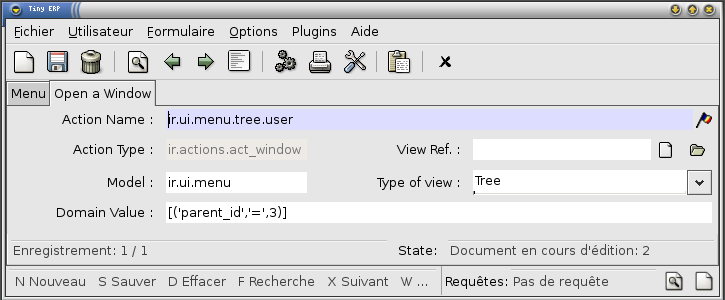
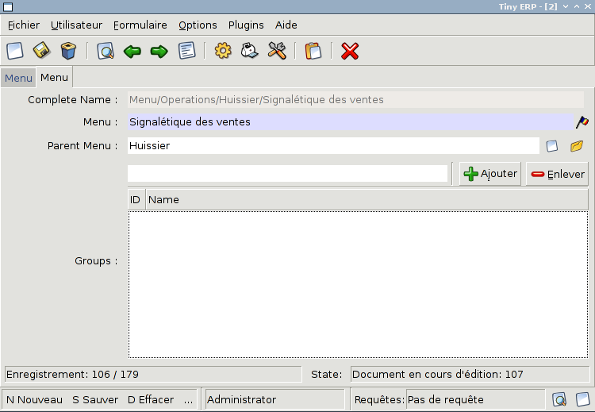

.. i18n: ================
.. i18n: Menu and Actions 
.. i18n: ================
..

================
菜单和操作
================

.. i18n: Menus
.. i18n: =====
..

菜单
=====

.. i18n: Here's the template of a menu item :
.. i18n: ::
.. i18n: 
.. i18n: 	<menuitem id="menuitem_id" 
.. i18n: 		  name="Position/Of/The/Menu/Item/In/The/Tree" 
.. i18n: 		  action="action_id" 
.. i18n: 		  icon="NAME_FROM_LIST" 
.. i18n: 		  groups="groupname" 
.. i18n: 		  sequence="<integer>"/>
..

这有一个菜单项的模板：
::

	<menuitem id="menuitem_id" 
		  name="Position/Of/The/Menu/Item/In/The/Tree" 
		  action="action_id" 
		  icon="NAME_FROM_LIST" 
		  groups="groupname" 
		  sequence="<integer>"/>

.. i18n: Where
..

其中

.. i18n:     * id specifies the identifier of the menu item in the menu items table. This identifier must be unique. Mandatory field.
.. i18n:     * name defines the position of the menu item in the menu hierarchy. Elements are separated by slashes ("/"). A menu item name with no slash in its text is a top level menu. Mandatory field.
.. i18n:     * action specifies the identifier of the action that must have been defined in the action table (ir.actions.act_window). Note that this field is not mandatory : you can define menu elements without associating actions to them. This is useful when defining custom icons for menu elements that will act as folders (for example this is how custom icons for "Projects", "Human Resources" in OpenERP are defined).
.. i18n:     * icon specifies which icon will be displayed for the menu item using the menu item. The default icon is STOCK_OPEN.
.. i18n:           - The available icons are : STOCK_ABOUT, STOCK_ADD, STOCK_APPLY, STOCK_BOLD, STOCK_CANCEL, STOCK_CDROM, STOCK_CLEAR, STOCK_CLOSE, STOCK_COLOR_PICKER, STOCK_CONNECT, STOCK_CONVERT, STOCK_COPY, STOCK_CUT, STOCK_DELETE, STOCK_DIALOG_AUTHENTICATION, STOCK_DIALOG_ERROR, STOCK_DIALOG_INFO, STOCK_DIALOG_QUESTION, STOCK_DIALOG_WARNING, STOCK_DIRECTORY, STOCK_DISCONNECT, STOCK_DND, STOCK_DND_MULTIPLE, STOCK_EDIT, STOCK_EXECUTE, STOCK_FILE, STOCK_FIND, STOCK_FIND_AND_REPLACE, STOCK_FLOPPY, STOCK_GOTO_BOTTOM, STOCK_GOTO_FIRST, STOCK_GOTO_LAST, STOCK_GOTO_TOP, STOCK_GO_BACK, STOCK_GO_DOWN, STOCK_GO_FORWARD, STOCK_GO_UP, STOCK_HARDDISK, STOCK_HELP, STOCK_HOME, STOCK_INDENT, STOCK_INDEX, STOCK_ITALIC, STOCK_JUMP_TO, STOCK_JUSTIFY_CENTER, STOCK_JUSTIFY_FILL, STOCK_JUSTIFY_LEFT, STOCK_JUSTIFY_RIGHT, STOCK_MEDIA_FORWARD, STOCK_MEDIA_NEXT, STOCK_MEDIA_PAUSE, STOCK_MEDIA_PLAY, STOCK_MEDIA_PREVIOUS, STOCK_MEDIA_RECORD, STOCK_MEDIA_REWIND, STOCK_MEDIA_STOP, STOCK_MISSING_IMAGE, STOCK_NETWORK, STOCK_NEW, STOCK_NO, STOCK_OK, STOCK_OPEN, STOCK_PASTE, STOCK_PREFERENCES, STOCK_PRINT, STOCK_PRINT_PREVIEW, STOCK_PROPERTIES, STOCK_QUIT,STOCK_REDO, STOCK_REFRESH, STOCK_REMOVE, STOCK_REVERT_TO_SAVED, STOCK_SAVE, STOCK_SAVE_AS, STOCK_SELECT_COLOR, STOCK_SELECT_FONT, STOCK_SORT_ASCENDING, STOCK_SORT_DESCENDING, STOCK_SPELL_CHECK, STOCK_STOP, STOCK_STRIKETHROUGH, STOCK_UNDELETE, STOCK_UNDERLINE, STOCK_UNDO, STOCK_UNINDENT, STOCK_YES, STOCK_ZOOM_100, STOCK_ZOOM_FIT, STOCK_ZOOM_IN, STOCK_ZOOM_OUT, terp-account, terp-crm, terp-mrp, terp-product, terp-purchase, terp-sale, terp-tools, terp-administration, terp-hr, terp-partner, terp-project, terp-report, terp-stock 
.. i18n:     * **groups** specifies which group of user can see the menu item (example : groups="admin"). See section " Management of Access Rights" for more information. Multiple groups should be separated by a ',' (example: groups="admin,user")
.. i18n:     * **sequence** is an integer that is used to sort the menu item in the menu. The higher the sequence number, the downer the menu item. This argument is not mandatory: if sequence is not specified, the menu item gets a default sequence number of 10. Menu items with the same sequence numbers are sorted by order of creation (*_order =* "*sequence,id*"). 
..

    * id用来在菜单项表中区别不同的菜单，这个标识符是唯一的，必须的字段。
    * name定义了该菜单在menu层次中的位置。元素间通过斜杠“/”来划分。菜单名称中没有斜杠的是顶级菜单项。这个字段是必须的。
    * action指定了动作的标识符，这个动作必须在action表（ir.actions.act_window）中定义过了。我们注意到这个字段不是必须的：你可以定义没有相应动作的菜单项。当我们为菜单项定义自制的按钮，就像文件夹的功能时，这个没有动作的菜单是有用的。
    * icon指定了菜单项将会使用哪个按钮。默认的是ＳＴＯＣＫ＿ＯＰＥＮ．
          - 可用的按钮有: STOCK_ABOUT, STOCK_ADD, STOCK_APPLY, STOCK_BOLD, STOCK_CANCEL, STOCK_CDROM, STOCK_CLEAR, STOCK_CLOSE, STOCK_COLOR_PICKER, STOCK_CONNECT, STOCK_CONVERT, STOCK_COPY, STOCK_CUT, STOCK_DELETE, STOCK_DIALOG_AUTHENTICATION, STOCK_DIALOG_ERROR, STOCK_DIALOG_INFO, STOCK_DIALOG_QUESTION, STOCK_DIALOG_WARNING, STOCK_DIRECTORY, STOCK_DISCONNECT, STOCK_DND, STOCK_DND_MULTIPLE, STOCK_EDIT, STOCK_EXECUTE, STOCK_FILE, STOCK_FIND, STOCK_FIND_AND_REPLACE, STOCK_FLOPPY, STOCK_GOTO_BOTTOM, STOCK_GOTO_FIRST, STOCK_GOTO_LAST, STOCK_GOTO_TOP, STOCK_GO_BACK, STOCK_GO_DOWN, STOCK_GO_FORWARD, STOCK_GO_UP, STOCK_HARDDISK, STOCK_HELP, STOCK_HOME, STOCK_INDENT, STOCK_INDEX, STOCK_ITALIC, STOCK_JUMP_TO, STOCK_JUSTIFY_CENTER, STOCK_JUSTIFY_FILL, STOCK_JUSTIFY_LEFT, STOCK_JUSTIFY_RIGHT, STOCK_MEDIA_FORWARD, STOCK_MEDIA_NEXT, STOCK_MEDIA_PAUSE, STOCK_MEDIA_PLAY, STOCK_MEDIA_PREVIOUS, STOCK_MEDIA_RECORD, STOCK_MEDIA_REWIND, STOCK_MEDIA_STOP, STOCK_MISSING_IMAGE, STOCK_NETWORK, STOCK_NEW, STOCK_NO, STOCK_OK, STOCK_OPEN, STOCK_PASTE, STOCK_PREFERENCES, STOCK_PRINT, STOCK_PRINT_PREVIEW, STOCK_PROPERTIES, STOCK_QUIT,STOCK_REDO, STOCK_REFRESH, STOCK_REMOVE, STOCK_REVERT_TO_SAVED, STOCK_SAVE, STOCK_SAVE_AS, STOCK_SELECT_COLOR, STOCK_SELECT_FONT, STOCK_SORT_ASCENDING, STOCK_SORT_DESCENDING, STOCK_SPELL_CHECK, STOCK_STOP, STOCK_STRIKETHROUGH, STOCK_UNDELETE, STOCK_UNDERLINE, STOCK_UNDO, STOCK_UNINDENT, STOCK_YES, STOCK_ZOOM_100, STOCK_ZOOM_FIT, STOCK_ZOOM_IN, STOCK_ZOOM_OUT, terp-account, terp-crm, terp-mrp, terp-product, terp-purchase, terp-sale, terp-tools, terp-administration, terp-hr, terp-partner, terp-project, terp-report, terp-stock 
    * **groups** 指定哪个组的用户可以看到这个菜单（例如：groups=”admin”）。想要得到更多信息可以看“Management of Access Rights”。多个组的话可以用逗号分开（如：groups=”admin,user”）。
    * **sequence** 是个整数类型，用于为菜单项中的菜单排序。更高的sequence number在菜单项的更下面。这个字段不是必须的：如果sequence没有指定值，菜单项将会得到一个默认的数值10。有相同数值的菜单项按照创建顺序来排序（_order = “sequence,id“）。
	
.. i18n: Example
.. i18n: -------
..

例如：
-------

.. i18n: In server/bin/addons/sale/sale_view.xml, we have, for example
.. i18n: ::
.. i18n: 
.. i18n: 	<menuitem name="Sales Management/Sales Order/Sales Order in Progress" id="menu_action_order_tree4" action="action_order_tree4"/>
..

在server/bin/addons/sale/sale_view.xml中，我们有:
::

	<menuitem name="Sales Management/Sales Order/Sales Order in Progress" id="menu_action_order_tree4" action="action_order_tree4"/>

.. i18n: To change the icon of menu item :
.. i18n: ::
.. i18n: 
.. i18n: 	* Highlight the menu with the icon you want to change.
.. i18n: 	* Select the "Switch to list/form" option from the "Form" menu. This will take you to the Menu editor.
.. i18n: 	* From here you can change the icon of the selected menu.
..

想要更改菜单项的图标：
::

	* Highlight the menu with the icon you want to change.
	* Select the "Switch to list/form" option from the "Form" menu. This will take you to the Menu editor.
	* From here you can change the icon of the selected menu.

.. i18n: Actions
.. i18n: =======
..

动作
=======

.. i18n: Introduction
.. i18n: ------------
..

介绍
------------

.. i18n: The actions define the behavior of the system in response to the actions of the users ; login of a new user, double-click on an invoice, click on the action button, ...
..

actions定义系统的行为来响应用户的动作；登录的新用户，双击invoice，点击动作按钮，...

.. i18n: There are different types of simple actions:
..

简单的动作也有很多类型：

.. i18n:     * Window: Opening of a new window
.. i18n:     * Report: The printing of a report
.. i18n:           o Custom Report: The personalized reports
.. i18n:           o RML Report: The XSL:RML reports
.. i18n:     * Wizard: The beginning of a Wizard
.. i18n:     * Execute: The execution of a method on the server side
.. i18n:     * Group: Gather some actions in one group
..

    * Window: 打开一个新窗口
    * Report: 打印报表
          o Custom Report: 自定义报表
          o RML Report: XSL:RML 报表
    * Wizard: 开始向导
    * Execute: server端方法的执行。
    * Group: 在一个组中集合多个动作

.. i18n: The actions are used for the following events;
..

发生动作的以下事件：

.. i18n:     * User connection,
.. i18n:     * The user double-clicks on the menu,
.. i18n:     * The user clicks on the icon 'print' or 'action'.
..

    * 用户连接,
    * 用户双击菜单项,
    * 用户点击图标’print’和’action’.

.. i18n: Example of events
.. i18n: -----------------
..

事件样例
-----------------

.. i18n: In OpenERP, all the actions are described and not configured. Two examples:
..

在OpenERP中，所有的动作都被描述了而没有配置。两个例子：

.. i18n:     * Opening of a window when double-clicking in the menu
.. i18n:     * User connection
..

    * 双击菜单项时打开窗口
    * 用户连接

.. i18n: Opening of the menu
.. i18n: +++++++++++++++++++
..

打开菜单
+++++++++++++++++++

.. i18n: When the user open the option of the menu "Operations > Partners > Partners Contact", the next steps are done to give the user information on the action to undertake.
..

当用户打开菜单选择 "Operations > Partners > Partners Contact"，下一步是给用户该动作承诺的信息。

.. i18n:    1. Search the action in the IR.
.. i18n:    2. Execution of the action
.. i18n:          1. If the action is the type Opening the Window; it indicates to the user that a new window must be opened for a selected object and it gives you the view (form or list) and the filed to use (only the pro-forma invoice).
.. i18n:          2. The user asks the object and receives information necessary to trace a form; the fields description and the XML view.
..

   1. 在IR中查询动作
   2. 执行动作
         1.如果这个动作类型是打开新窗口，它显示给用户：必须对选定的对象打开这个新窗口，并且它显示视图（form or list）和使用的文件。
         2. 用户要求这个对象返回必要的信息来显示在表单视图中，字段的描述和XML视图

.. i18n: User connection
.. i18n: +++++++++++++++
..

用户登陆
+++++++++++++++

.. i18n: When a new user is connected to the server, the client must search the action to use for the first screen of this user. Generally, this action is: open the menu in the 'Operations' section.
..

当一个新用户连接到服务器端时，客户端会搜索用于显示给该用户的首页动作。一般情况下，这个动作是：在‘Operations’部分打开菜单。

.. i18n: The steps are:
..

步骤是：

.. i18n:    1. Reading of a user file to obtain ACTION_ID
.. i18n:    2. Reading of the action and execution of this one
..

   1. 阅读用户文件来获取ACTION_ID
   2. 读取这个动作并且执行它

.. i18n: The fields
.. i18n: ++++++++++
..

The fields
++++++++++

.. i18n: **Action Name**
.. i18n: 	The action name
.. i18n: **Action Type**
.. i18n: 	Always 'ir.actions.act_window'
.. i18n: **View Ref**
.. i18n:     	The view used for showing the object
.. i18n: **Model**
.. i18n: 	The model of the object to post
.. i18n: **Type of View**
.. i18n:     	The type of view (Tree/Form)
.. i18n: **Domain Value**
.. i18n:     	The domain that decreases the visible data with this view
..

**Action Name**
	The action name
**Action Type**
	一直是’ir.action.act_window’
**View Ref**
    	用于显示对象的视图
**Model**
	对象公布的model
**Type of View**
    	视图类型（Tree/Form）
**Domain Value**
    	在视图中减少可视数据的domain

.. i18n: The view
.. i18n: --------
.. i18n: The view describes how the edition form or the data tree/list appear on screen. The views can be of 'Form' or 'Tree' type, according to whether they represent a form for the edition or a list/tree for global data viewing.
..

The view
--------
view描述表单视图或是数据列表如何显示在屏幕上。视图可以是Form类型或是Tree类型，这个取决于他们显示一个表单来编辑还是列表来看所有数据。

.. i18n: A form can be called by an action opening in 'Tree' mode. The form view is generally opened from the list mode (like if the user pushes on 'switch view').
..

有动作打开‘Tree’模式时，一个表单就会被调用。表单视图可以从列表形式中打开。

.. i18n: The domain
.. i18n: ----------
..

The domain
----------

.. i18n: This parameter allows you to regulate which resources are visible in a selected view.(restriction)
..

这个参数让你可以控制在搜索视图中，哪些资源可以显示。

.. i18n: For example, in the invoice case, you can define an action that opens a view that shows only invoices not paid.
..

例如，在invoice这个实例中，你可以定义一个动作，这个动作用于打开发票没有付费的视图。

.. i18n: The domains are written in python; list of tuples. The tuples have three elements;
..

domain用Python写的，是元组的列表。这个元组有三个元素：

.. i18n:     * the field on which the test must be done
.. i18n:     * the operator used for the test (<, >, =, like)
.. i18n:     * the tested value
..

    * 测试必须完成的字段
    * 用于测试的运算符（<, >, =, like）
    * 已测试的值

.. i18n: For example, if you want to obtain only 'Draft' invoice, use the following domain; [('state','=','draft')]
..

如果你想要获得‘Draft’发票，使用以下的domain：[(‘state’,’=’,’draft’)]。

.. i18n: In the case of a simple view, the domain define the resources which are the roots of the tree. The other resources, even if they are not from a part of the domain will be posted if the user develop the branches of the tree.
..

在简单的视图中，domain定义了资源，这个资源是树根（the roots of the tree）。而对于其他的资源，如果用户开发树的分支，那么即使他们不在domain中，也会被显示出来。

.. i18n: .. _window-action:
.. i18n: 
.. i18n: Window Action
.. i18n: -------------
..

.. _window-action:

Window Action
-------------

.. i18n: Actions are explained in more detail in the :ref:`Client Action <client-action>` 
.. i18n: section. Here's the template of an action XML record :
.. i18n: ::
.. i18n: 
.. i18n: 	<record model="ir.actions.act_window" id="action_id_1">
.. i18n: 	    <field name="name">action.name</field>
.. i18n: 	    <field name="view_id" ref="view_id_1"/>
.. i18n: 	    <field name="domain">["list of 3-tuples (max 250 characters)"]</field>
.. i18n: 	    <field name="context">{"context dictionary (max 250 characters)"}</field>
.. i18n: 	    <field name="res_model">Open.object</field>
.. i18n: 	    <field name="view_type">form|tree</field>
.. i18n: 	    <field name="view_mode">form,tree|tree,form|form|tree</field>
.. i18n: 	    <field name="usage">menu</field>
.. i18n: 	    <field name="target">new</field>
.. i18n: 	</record>
..

动作在 :ref:`Client Action <client-action>` 
章节已经解释的很多了。这有一个动作XML记录的模板。
::

	<record model="ir.actions.act_window" id="action_id_1">
	    <field name="name">action.name</field>
	    <field name="view_id" ref="view_id_1"/>
	    <field name="domain">["list of 3-tuples (max 250 characters)"]</field>
	    <field name="context">{"context dictionary (max 250 characters)"}</field>
	    <field name="res_model">Open.object</field>
	    <field name="view_type">form|tree</field>
	    <field name="view_mode">form,tree|tree,form|form|tree</field>
	    <field name="usage">menu</field>
	    <field name="target">new</field>
	</record>

.. i18n: **Where**
..

**其中**

.. i18n:     * **id** is the identifier of the action in the table "ir.actions.act_window". It must be unique.
.. i18n:     * **name** is the name of the action (mandatory).
.. i18n:     * **view_id** is the name of the view to display when the action is activated. If this field is not defined, the view of a kind (list or form) associated to the object res_model with the highest priority field is used (if two views have the same priority, the first defined view of a kind is used).
.. i18n:     * **domain** is a list of constraints used to refine the results of a selection, and hence to get less records displayed in the view. Constraints of the list are linked together with an AND clause : a record of the table will be displayed in the view only if all the constraints are satisfied.
.. i18n:     * **context** is the context dictionary which will be visible in the view that will be opened when the action is activated. Context dictionaries are declared with the same syntax as Python dictionaries in the XML file. For more information about context dictionaries, see section " The context Dictionary".
.. i18n:     * **res_model** is the name of the object on which the action operates.
.. i18n:     * **view_type** is set to form when the action must open a new form view, and is set to tree when the action must open a new tree view.
.. i18n:     * **view_mode** is only considered if view_type is form, and ignored otherwise. The four possibilities are :
.. i18n:           - **form,tree** : the view is first displayed as a form, the list view can be displayed by clicking the "alternate view button" ;
.. i18n:           - **tree,form** : the view is first displayed as a list, the form view can be displayed by clicking the "alternate view button" ;
.. i18n:           - **form** : the view is displayed as a form and there is no way to switch to list view ;
.. i18n:           - **tree** : the view is displayed as a list and there is no way to switch to form view.
..

    * id是动作在表格“ir.actions.act_window”中的标识符。它必须是唯一的。
    * name是动作的名称（这个字段是必须的）
    * view_id是当动作被激活时要显示的视图的名称。如果这个字段没有定义，拥有最高优先级的（如果两个视图有相同的优先级，那么先定义的一类视图就会被使用。），并且与对象res_model相关的一类视图就会被使用。
    * domain是约束条件的列表，用于筛选搜索结果使更少的记录显示在视图上。约束条件列表用AND连接在一起：当所有的约束条件都满足时，表格记录就会显示在视图上。
    * context是显示在视图中的上下文字典，当动作被激活时它就会打开。在XML文件中上下文字典的声明和Python字典一样有相同的语法。想要知道更多关于上下文字典的信息可以看” The context Dictionary”这个章节。
    * res_model是这个动作发生的对象的名称。
    * view_type当某个动作必须打开一个新的表单视图时，这个字段的值是form，当某个动作必须打开一个新的列表视图时，这个字段的值是tree。
    * view_mode仅在view_type值是form时起作用，忽略其他的情况。四种可能的值是：
          - **form，tree**: 这个视图开始时显示为表单视图，当点击“alternate view button”时，列表视图就会显示。
          - **tree，form**: 这个视图开始时显示为列表视图，当点击“alternate view button”时，表单视图就会显示。
          - **form**: 这个视图显示为表单视图，不可能显示为列表视图。
          - **tree**: 这个视图显示为列表视图，不可能显示为表单视图。

.. i18n: (version 5 introduced **graph** and **calendar** views)
..

(version 5 introduced **graph** and **calendar** views)

.. i18n:     * **usage** is used [+ ***TODO*** +]
.. i18n:     * **target** the view will open in new window like wizard.
.. i18n:     * **context** will be passed to the action itself and added to its global context
..

     * usage is used [+ *TODO* +]
     * target：视图会在新窗口打开，就像wizard似的。
     * context会传递给动作本身，并加入到全局上下文中。

.. i18n:       .. code-block:: xml
.. i18n: 
.. i18n:           <record model="ir.actions.act_window" id="a">
.. i18n:               <field name="name">account.account.tree1</field> 
.. i18n:               <field name="res_model">account.account</field> 
.. i18n:               <field name="view_type">tree</field> 
.. i18n:               <field name="view_mode">form,tree</field> 
.. i18n:               <field name="view_id" ref="v"/> 
.. i18n:               <field name="domain">[('code','=','0')]</field> 
.. i18n:               <field name="context">{'project_id': active_id}</field> 
.. i18n:           </record>
..

      .. code-block:: xml

          <record model="ir.actions.act_window" id="a">
              <field name="name">account.account.tree1</field> 
              <field name="res_model">account.account</field> 
              <field name="view_type">tree</field> 
              <field name="view_mode">form,tree</field> 
              <field name="view_id" ref="v"/> 
              <field name="domain">[('code','=','0')]</field> 
              <field name="context">{'project_id': active_id}</field> 
          </record>

.. i18n: They indicate at the user that he has to open a new window in a new 'tab'.
..

他们想要告知用户的是，用户可以在新‘tab’打开一个新窗口.

.. i18n: Administration > Custom > Low Level > Base > Action > Window Actions
..

Administration > Custom > Low Level > Base > Action > Window Actions

.. i18n: .. figure::  images/module_base_action_window.png
.. i18n:    :scale: 85
.. i18n:    :align: center
..

.. i18n: Examples of actions
.. i18n: +++++++++++++++++++
..

Examples of actions
+++++++++++++++++++

.. i18n: This action is declared in server/bin/addons/project/project_view.xml.
.. i18n: ::
.. i18n: 
.. i18n:     <record model="ir.actions.act_window" id="open_view_my_project">
.. i18n:         <field name="name">project.project</field>
.. i18n:         <field name="res_model">project.project</field>
.. i18n:         <field name="view_type">tree</field>
.. i18n:         <field name="domain">[('parent_id','=',False), ('manager', '=', uid)]</field>
.. i18n:         <field name="view_id" ref="view_my_project" />
.. i18n:     </record>
..

This action is declared in server/bin/addons/project/project_view.xml.
::

    <record model="ir.actions.act_window" id="open_view_my_project">
        <field name="name">project.project</field>
        <field name="res_model">project.project</field>
        <field name="view_type">tree</field>
        <field name="domain">[('parent_id','=',False), ('manager', '=', uid)]</field>
        <field name="view_id" ref="view_my_project" />
    </record>

.. i18n: This action is declared in server/bin/addons/stock/stock_view.xml.
.. i18n: ::
.. i18n: 
.. i18n:     <record model="ir.actions.act_window" id="action_picking_form">
.. i18n:         <field name="name">stock.picking</field>
.. i18n:         <field name="res_model">stock.picking</field>
.. i18n:         <field name="type">ir.actions.act_window</field>
.. i18n:         <field name="view_type">form</field>
.. i18n:         <field name="view_id" ref="view_picking_form"/>
.. i18n:         <field name="context">{'contact_display': 'partner'}</field>
.. i18n:     </record>
..

This action is declared in server/bin/addons/stock/stock_view.xml.
::

    <record model="ir.actions.act_window" id="action_picking_form">
        <field name="name">stock.picking</field>
        <field name="res_model">stock.picking</field>
        <field name="type">ir.actions.act_window</field>
        <field name="view_type">form</field>
        <field name="view_id" ref="view_picking_form"/>
        <field name="context">{'contact_display': 'partner'}</field>
    </record>

.. i18n: Url Action
.. i18n: -----------
..

Url Action
-----------

.. i18n: Wizard Action
.. i18n: -------------
..

Wizard Action
-------------

.. i18n: Here's an example of a .XML file that declares a wizard.
.. i18n: ::
.. i18n: 
.. i18n: 	<?xml version="1.0"?>
.. i18n: 	<openerp>
.. i18n: 	    <data>
.. i18n: 		 <wizard string="Employee Info"
.. i18n: 		         model="hr.employee"
.. i18n: 		         name="employee.info.wizard"
.. i18n: 		         id="wizard_employee_info"/>
.. i18n: 	    </data>
.. i18n: 	</openerp>
..

下面是个显示wizard的.XML文件。
::

	<?xml version="1.0"?>
	<openerp>
	    <data>
		 <wizard string="Employee Info"
		         model="hr.employee"
		         name="employee.info.wizard"
		         id="wizard_employee_info"/>
	    </data>
	</openerp>

.. i18n: A wizard is declared using a wizard tag. See "Add A New Wizard" for more information about wizard XML.
..

wizard用wizard标签来声明。想要知道更多关于wizard XML的信息可以查看“Add A New Wizard”这个章节。

.. i18n: also you can add wizard in menu using following xml entry
.. i18n: ::
.. i18n: 
.. i18n:     <?xml version="1.0"?>
.. i18n:     <openerp>
.. i18n:          <data>
.. i18n:          <wizard string="Employee Info"
.. i18n:                  model="hr.employee"
.. i18n:                  name="employee.info.wizard"
.. i18n:                  id="wizard_employee_info"/>
.. i18n:          <menuitem
.. i18n:                  name="Human Resource/Employee Info"
.. i18n:                  action="wizard_employee_info"
.. i18n:                  type="wizard"
.. i18n:                  id="menu_wizard_employee_info"/>
.. i18n:          </data>
.. i18n:     </openerp>
..

你也可以使用一下的xml entry在menu中加wizard。
::

    <?xml version="1.0"?>
    <openerp>
         <data>
         <wizard string="Employee Info"
                 model="hr.employee"
                 name="employee.info.wizard"
                 id="wizard_employee_info"/>
         <menuitem
                 name="Human Resource/Employee Info"
                 action="wizard_employee_info"
                 type="wizard"
                 id="menu_wizard_employee_info"/>
         </data>
    </openerp>

.. i18n: Report Action
.. i18n: -------------
..

Report Action
-------------

.. i18n: Report declaration
.. i18n: ++++++++++++++++++
..

Report declaration
++++++++++++++++++

.. i18n: Reports in OpenERP are explained in chapter "Reports Reporting". Here's an example of a XML file that declares a RML report :
.. i18n: ::
.. i18n: 
.. i18n:     <?xml version="1.0"?>
.. i18n:     <openerp>
.. i18n:         <data>
.. i18n:         <report id="sale_category_print"
.. i18n:                 string="Sales Orders By Categories"
.. i18n:                 model="sale.order"
.. i18n:                 name="sale_category.print"
.. i18n:                 rml="sale_category/report/sale_category_report.rml"
.. i18n:                 menu="True"
.. i18n:                 auto="False"/>
.. i18n:          </data>
.. i18n:     </openerp>
..

报表的解释在“Reports Reporting”章节。这有一个RML报表声明的XML文件。
::

    <?xml version="1.0"?>
    <openerp>
        <data>
        <report id="sale_category_print"
                string="Sales Orders By Categories"
                model="sale.order"
                name="sale_category.print"
                rml="sale_category/report/sale_category_report.rml"
                menu="True"
                auto="False"/>
         </data>
    </openerp>

.. i18n: A report is declared using a **report tag** inside a "data" block. The different arguments of a report tag are :
..

报表使用report标签在“data”块中声明。报表标签中的不同参数有：

.. i18n:     * **id** : an identifier which must be unique.
.. i18n:     * **string** : the text of the menu that calls the report (if any, see below).
.. i18n:     * **model** : the OpenERP object on which the report will be rendered.
.. i18n:     * **rml** : the .RML report model. Important Note : Path is relative to addons/ directory.
.. i18n:     * **menu** : whether the report will be able to be called directly via the client or not. Setting menu to False is useful in case of reports called by wizards.
.. i18n:     * **auto** : determines if the .RML file must be parsed using the default parser or not. Using a custom parser allows you to define additional functions to your report.
..

    * **id** : 一个标识符，必须是唯一的
    * **string** : 菜单文字用来调用报表
    * **model** : 报表会渲染的OpenERP对象
    * **rml** : the .RML report model. Important Note : Path is relative to addons/ directory.
    * **menu** : 不管报表是否通过客户端直接调用。如果报表通过wizard来调用，设置menu为False。
    * **auto** : 确定.RML文件是否必须使用默认的解析器解析。使用客户解析器可以为你的报表定义额外的功能。

.. i18n: Security
.. i18n: ========
..

Security
========

.. i18n: Three concepts are differentiated into OpenERP;
..

在OpenERP中三个概念要区分一下：

.. i18n:    1. The users: person identified by his login/password
.. i18n:    2. The groups: define the access rights of the resources
.. i18n:    3. The roles: determine the roles/duties of the users 
..

   1．The users：通过login/password来鉴定的person
   2．The groups：定义资源的访问权限
   3．The roles：确定用户的roles/duties

.. i18n: .. figure::  images/module_base_user.png
.. i18n:    :scale: 120
.. i18n:    :align: center
..

.. figure::  images/module_base_user.png
   :scale: 120
   :align: center

.. i18n: **The users**
..

**The users**

.. i18n: They represent physical persons. These are identified with a login and a password. A user may belong to several groups and may have several roles.
..

他们代表物理人类。他们通过登录和密码来鉴别。一个用户可以属于多个groups，可以有多个roles。

.. i18n: A user must have an action set up. This action is executed when the user connects to the program with his login and password. An example of action would be to open the menu at 'Operations'.
..

一个用户有开始action。当用户登录和输入密码时，action执行。比如一个动作是打开菜单‘Operations’。

.. i18n: The preferences of the user are available with the preference icon. You can, for example, through these preferences, determine the working language of this user. English is set by default.
..

用户可用选择图标选择不同的参数选择。例如，你可以使用这些参数选择来决定工作语言。默认为英语。

.. i18n: A user can modify his own preferences while he is working with OpenERP. To do that, he clicks on this menu: User > Preferences. The OpenERP administrator can also modify some preferences of each and every user.
..

当你使用OpenERP时，可以修改自己的参数选择。你可以点击菜单：User > Preferences。OpenERP管理员可以修改很多参数选择和每个用户的参数选择。

.. i18n: **The groups**
..

**The groups**

.. i18n: The groups determine the access rights to the different resources. There are three types of right:
..

groups决定对不同资源的访问权限。这有三种权限：

.. i18n:     * The writing access: recording & creation,
.. i18n:     * The reading access: reading of a file,
.. i18n:     * The execution access: the buttons of workflows or wizards. 
..

    * 写权限：写入和创建
    * 读权限：读取一个文件
    * 执行权限：工作流或向导的按钮

.. i18n: A user can belong to several groups. If he belongs to several groups, we always use the group with the highest rights for a selected resource.
..

一个用户可以属于多个groups。如果他属于多个groups，我们将总是用有最高权限的组来对选定的资源。

.. i18n: **The roles**
..

**The roles**

.. i18n: The roles define a hierarchical structure in tree. They represent the different jobs/roles inside the company. The biggest role has automatically the rights of all the inferior roles.
..

roles在tree上定义了一个层次结构。他在公司内部代表着不同的jobs/roles。最大的role对所有的下级roles有自动的权限。

.. i18n: **Example:**
..

**Example:**

.. i18n: CEO
..

CEO

.. i18n:   + Technical manager
..

  + Technical manager

.. i18n:     - Chief of projects
.. i18n: 
.. i18n:       - Developers
.. i18n:       - Testers
..

    - Chief of projects

      - Developers
      - Testers

.. i18n:   + Commercial manager
..

  + Commercial manager

.. i18n:       - Salesmen
.. i18n:       - ...
..

      - Salesmen
      - ...

.. i18n: If we want to validate the test of a program (=role Testers), it may be done by a user having one of the following roles: Testers, Chief of the project, Technical manager, CEO.
..

如果我们想要验证一段程序（=role Testers）的测试，一个用户会有以下roles中的一个：Testers，Chief of the project，Technical manager，CEO。

.. i18n: The roles are used for the transition of Workflow actions into confirmation, choice or validation actions. Their implications will be detailed in the Workflow section. 
..

roles用于将工作流动作转换为确认，选择或是验证动作。他们的含义在Workflow章节有详细的介绍。

.. i18n: Menu Access
.. i18n: -----------
..

Menu Access
-----------

.. i18n: It's easy (but risky) to grant grained access to menu based on the user's groups.
..

允许对用户组菜单的grained访问是容易的，但是也是有风险的。

.. i18n: First of all, you should know that if a menu is not granted to any group then it is accessible to everybody ! If you want to grant access to some groups just go to **Menu > Administration > Security > Define access to Menu-items** and select the groups that can use this menu item.
..

首先，你应该知道如果一个菜单不能被任何组访问，那么它可以让每个用户访问。如果你想要访问一些组，只需要点击Menu > Administration > Security > Define access to Menu-items和搜索可以用在这个菜单项中组。

.. i18n: .. figure::  images/grant_access.png
.. i18n:    :scale: 85
.. i18n:    :align: center
..

.. i18n: Beware ! If the Administrator does not belong to one of the group, he will not be able to reach this menu again. 
..

注意：如果管理员不属于这个组，他将不能再使用这个菜单。
