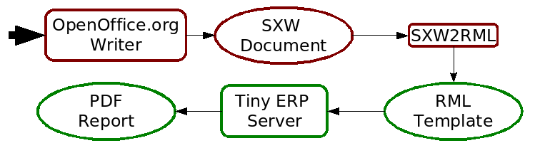

.. i18n: =======
.. i18n: Reports
.. i18n: =======
..

====
报表
====

.. i18n: There are mainly three types of reports in OpenERP:
..

OpenERP 主要有三种类型的报表:

.. i18n:     * OpenOffice.org reports
.. i18n:     * RML reports
.. i18n:     * custom reports (based on PostgreSQL views and displayed within the interface) 
..

    * OpenOffice.org 报表
    * RML 报表
    * 自定义报表 (基于 PostgreSQL 视图和显示接口) 

.. i18n: This chapter mainly describes OpenOffice.org reports, and then XSL:RML reports. Custom reports are described in section Advanced Modeling - Reporting With PostgreSQL Views.
..

这一部分主要描述 OpenOffice.org 报表, 和 XSL:RML 报表. 自定义报表在高级模块部分描述 -  PostgreSQL 视图报表.

.. i18n: OpenOffice.org reports
.. i18n: ======================
..

OpenOffice.org 报表
===================

.. i18n: **The document flow**
..

**文件流**

.. i18n: OpenOffice.org reports are the most commonly used report formats. OpenOffice.org Writer is used (in combination with [[1]]) to generate a RML template, which in turn is used to generate a pdf printable report.
..

OpenOffice.org是通用的报表格式。OpenOffice.org Writer被用来生成RML模板，而RML模板用来生成pdf报表。

.. i18n: .. figure::  images/ooo_report_overview.png
.. i18n:    :scale: 85
.. i18n:    :align: center
..

.. i18n: **The internal process**
..

**内部过程**

.. i18n: .. figure::  images/process_ooo.png
.. i18n:    :scale: 85
.. i18n:    :align: center
..

.. figure::  images/process_ooo.png
   :scale: 85
   :align: center

.. i18n: **The .SXW template file**
..

**.SXW 模板文件**

.. i18n:     * We use a .SXW file for the template, which is the OpenOffice 1.0 format. The template includes expressions in brackets or OpenOffice fields to point where the data from the OpenERP server will be filled in. This document is only used for developers, as a help-tool to easily generate the .RML file. OpenERP does not need this .SXW file to print reports. 
..

    * 我们用OpenOffice1.0的.sxw文件作为模板。模板中包含用括号括起来的表达式或OpenOffice字段(field)，用来提供 给OpenERP server填充数据。但这只是作为一种较容易的方法，提供给开发者生成.RML文件。OpenERP并不需要SXW文件产生报表。 

.. i18n: **The .RML template**
..

**.RML 模板**

.. i18n:     * We generate a .RML file from the .SXW file using Open SXW2RML. A .RML file is a XML format that represent a .PDF document. It can be converted to a .PDF after. We use RML for more easy processing: XML syntax seems to be more common than PDF syntax. 
..

    * 可以使用Open SXW2RML从SXW文件生成RML文件。RML文件是一种表现PDF文档的XML格式，可以转换为PDF文件。RML是一种更容易的方法，至少XML语法比PDF语法更加通俗易懂。 

.. i18n: **The report engine**
..

**报表引擎**

.. i18n:     * The Open Report Engine process the .RML file inserting data from the database at each expression. 
..

    * 报表引擎(report engine)从数据库中读出数据，插入在RML文件的表达式中。 

.. i18n: in the .RML file will be replaced by the name of the country of the partner of the printed invoice. This report engine produce the same .RML file where all expressions have been replaced by real data.
..

在.RML文件中，将以(打印)发票上parter的城市名称替换掉相应表达式。报表引擎以真实数据替换所有表达式之后，生成相同的.RML文件。

.. i18n: **The final document**
..

**生成最终文档**

.. i18n:     * Finally the .RML file is converted to PDF or HTML as needed, using OpenReport's scripts. 
..

    * 最后RML文件会根据OpenReport代码的需要，转换成PDF或者HTML文件。

.. i18n: Creating a SXW
.. i18n: --------------
..

生成 SXW 文件
-------------

.. i18n: You can design reports using *OpenOffice*. Here, as an example, is the file **server/bin/addons/sale/report/order.sxw**.
..

你可以使用 OpenOffice 设计报表。举个例子，如： **server/bin/addons/sale/report/order.sxw**.

.. i18n: .. figure::  images/writer_report.png
.. i18n:    :scale: 85
.. i18n:    :align: center
..

.. figure::  images/writer_report.png
   :scale: 85
   :align: center

.. i18n: .. _dynamic-report-content:
.. i18n: 
.. i18n: Dynamic content in OpenOffice reports 
.. i18n: -------------------------------------
..

.. _dynamic-report-content:

OpenOffice 报表中的动态内容 
---------------------------

.. i18n: **Dynamic content**
..

**动态内容**

.. i18n: In the .SXW/.RML reports, you can put some Python code that accesses the OpenERP objects in brackets. The context of the code (the variable's values you can use) is the following:
..

SXW/RML报表中，你可以在括号中加入Python代码，以获得OpenERP中的对象(object)。代码(可以使用变量)如下:

.. i18n: **Available variables**
..

**可用的变量**

.. i18n: Here are Python objects/variables available:
..

可以用的 Python 对象/变量:

.. i18n:     * **objects** : the list of objects to be printed (invoices for example).
.. i18n:     * **data** : comes from the wizard
.. i18n:     * **time** : the Python time module (see Python documentation for more information).
.. i18n:     * **user** : the user object launching the report. 
..

    * **objects** : 将要打印的object列表(例如发票（invoice)对象）.
    * **data** : 向导(wizard)中获得的数据
    * **time** : Python的time模块(查看Python文档获取更多信息).
    * **user** : 创建这个报表的用户. 

.. i18n:  **Available functions**
..

 **可用的函数**

.. i18n: Here are Python functions you can use:
..

可以用的 Python 函数:

.. i18n:     * **setLang('fr')** : change the language used in automated translation (fields...).
.. i18n:     * **repeatIn(list, varname[, tagname])** : repeat the current part of the template 
.. i18n:       (whole document, current section, current row in the table) for each 
.. i18n:       object in the list. Use varname in the template's tags. Since versions 
.. i18n:       4.1.X, you can use an optional third argument that is the name of the 
.. i18n:       .RML tag you want to loop on.
.. i18n:     * **setTag('para','xpre')** : replace the enclosing RML tag (usually 'para') with an other (xpre is a preformatted paragraph), in the (converted from sxw)rml document (?)
.. i18n:     * **removeParentNode('tr')** : removes the parent node of type 'tr', this parameter is usually used together with a conditional (see examples below)
..

    * **setLang('fr')** : 根据国际化自动切换语言 (字段...).
    * **repeatIn(list, varname[, tagname])** : 重复 模板(template)当前部分list中的对象 (整个文档, 当前段落, 表格中的当前行) 可以使用模板(template)的 varname标签 。 从 4.1.X版开始, 你可以使用第三个参数(可选的)选择你想在.RML标记(RML tag)中重复的内容
    * **setTag('para','xpre')** : 在rml文档中(由sxw转换)，用其它标记(0tag) (xpre 是一个预处理格式的段落，preformatted paragraph),替换封闭的 RML 标签 (一般是 ‘para’)(?)
    * **removeParentNode('tr')** : 移除类型'tr'的父结点, 这个参数经常在条件语句中使用 (如下例)

.. i18n: Example of useful tags:
..

有用的标签举例:

.. i18n:     * **[[ repeatIn(objects,'o') ]]** : Loop on each objects selected for the print.
.. i18n:     * **[[ repeatIn(o.invoice_line,'l') ]]** : Loop on every line
.. i18n:     * **[[ repeatIn(o.invoice_line,'l', 'td') ]]** : Loop on every line and make
.. i18n:       a new table cell for each line.
.. i18n:     * **[[ (o.prop=='draft')and 'YES' or 'NO' ]]** : Print YES or NO according the field 'prop'
.. i18n:     * **[[ round(o.quantity * o.price * 0.9, 2) ]]** : Operations are OK.
.. i18n:     * **[[ '%07d' % int(o.number) ]]** : Number formatting
.. i18n:     * **[[ reduce(lambda x, obj: x+obj.qty , list , 0 ) ]]** : Total qty of list (try "objects" as list)
.. i18n:     * **[[ user.name ]]** : user name
.. i18n:     * **[[ setLang(o.partner_id.lang) ]]** : Localized printings
.. i18n:     * **[[ time.strftime('%d/%m/%Y') ]]** : Show the time in format=dd/MM/YYYY, check python doc for more about "%d", ...
.. i18n:     * **[[ time.strftime(time.ctime()[0:10]) ]]** or **[[ time.strftime(time.ctime()[-4:]) ]]** : Prints only date.
.. i18n:     * **[[ time.ctime() ]]** : Prints the actual date & time
.. i18n:     * **[[ time.ctime().split()[3] ]]** : Prints only time
.. i18n:     * **[[ o.type in ['in_invoice', 'out_invoice'] and 'Invoice' or removeParentNode('tr') ]]** : If the type is 'in_invoice' or 'out_invoice' then the word 'Invoice' is printed, if it's neither the first node above it of type 'tr' will be removed.
..

    * **[[ repeatIn(objects,'o') ]]** : 循环打印选中的objects.
    * **[[ repeatIn(o.invoice_line,'l') ]]** : 循环每行数据.
    * **[[ repeatIn(o.invoice_line,'l', 'td') ]]** : 循环每行，并为每行数据创建一个单元格
    * **[[ (o.prop=='draft')and 'YES' or 'NO' ]]** : 根据标记(tag)‘prop’打印 YES或 NO
    * **[[ round(o.quantity * o.price * 0.9, 2) ]]** : 可以进行计算.
    * **[[ '%07d' % int(o.number) ]]** : 数字的格式化输出
    * **[[ reduce(lambda x, obj: x+obj.qty , list , 0 ) ]]** : 列表中所有 qty 的和 (尝试列表中的每个 “object” )
    * **[[ user.name ]]** : 用户名
    * **[[ setLang(o.partner_id.lang) ]]** : 本地化输出(和翻译有关)
    * **[[ time.strftime('%d/%m/%Y') ]]** : 以dd/MM/YYYY格式输出时间, 查阅python文档获得关于“%d”的帮助, ...
    * **[[ time.strftime(time.ctime()[0:10]) ]]** 或 **[[ time.strftime(time.ctime()[-4:]) ]]** : 只输出日期.
    * **[[ time.ctime() ]]** : 输出当前日期 & 时间
    * **[[ time.ctime().split()[3] ]]** : 只输出时间
    * **[[ o.type in ['in_invoice', 'out_invoice'] and 'Invoice' or removeParentNode('tr') ]]** : 如果type是 ‘in_invoice’ 或‘out_invoice’ 那么输出 ‘Invoice’；如果 不是，‘tr’类型的节点会被删除.

.. i18n: One more interesting tag: if you want to print out the creator of an entry 
.. i18n: (create_uid) or the last one who wrote on an entry (write_uid) you have to add 
.. i18n: something like this to the class your report refers to:
..

一个有趣的标记(tag)：如果想输出当前条目(entry)的创建者(create_uid)或者最后一位修改者(write_uid)你需要在你的报表类(class)中加入如下:

.. i18n: .. code-block:: python
.. i18n: 
.. i18n:     'create_uid': fields.many2one('res.users', 'User', readonly=1) 
..

.. code-block:: python

    'create_uid': fields.many2one('res.users', 'User', readonly=1) 

.. i18n: and then in your report it's like this to print out the corresponding name:
..

如果你的报表会类似输出相应的名字:

.. i18n: .. code-block:: python
.. i18n: 
.. i18n:     o.create_uid.name 
..

.. code-block:: python

    o.create_uid.name 

.. i18n: Sometimes you might want to print out something only if a certain condition is 
.. i18n: met. You can construct it with the python logical operators "not", "and" and 
.. i18n: "or". Because every object in python has a logical value (TRUE or FALSE) you can 
.. i18n: construct something like this:
..

有时你希望打印遇到的特定情况。 你可以根据python的逻辑操作符＂not＂,＂and＂,＂or＂构造自己的判断语句。
Python中的每个对象都有自己的逻辑值(TRUE或FALSE):

.. i18n: .. code-block:: python
.. i18n: 
.. i18n:     (o.prop=='draft') and 'YES' or 'NO' #prints YES or NO 
..

.. code-block:: python

    (o.prop=='draft') and 'YES' or 'NO' #prints YES or NO 

.. i18n: It works like this: `and` is higher priority than `or`, so that expression is
.. i18n: equivalent to this one:
..

注意and要比or的优先级高，表达式等价为:

.. i18n: .. code-block:: python
.. i18n: 
.. i18n:     ((o.prop=='draft') and 'YES') or 'NO' 
.. i18n:  
.. i18n: If `o.prop` is `'draft'`, then it evaluates like this:
.. i18n: 	#. `o.prop == 'draft'` is `True`.
.. i18n: 	#. `True and 'YES'` is `'YES'`. Because the left side is a "true" value, the
.. i18n: 	   `and` expression evaluates to the right side.
.. i18n: 	#. `'YES' or 'NO'` is `'YES'`. Because the left side is a "true" value, the
.. i18n: 	   `or` expression short cuts and ignores the right side. It evaluates to 
.. i18n: 	   the left side.
..

.. code-block:: python

    ((o.prop=='draft') and 'YES') or 'NO' 
 
如果 o.prop是 ‘draft’, 那么计算结果为:
	#. `o.prop == 'draft'` 为 `True`.
	#. `True and 'YES'` 为 `'YES'`. 因为左项为 "true" 值，和右项 `and` 计算后为真.
	#. `'YES' or 'NO'` is `'YES'`. 左项为真， or操作会忽略右项。只计算左项值.

.. i18n: If `o.prop` is something else like `'confirm'`, then it evaluates like this:
.. i18n: 	#. `o.prop == 'draft'` is `False`.
.. i18n: 	#. `False and 'YES'` is `False`. Because the left side is a "false" value, the
.. i18n: 	   `and` expression short cuts and ignores the right side. It evaluates to
.. i18n: 	   the left side.
.. i18n: 	#. `False or 'NO'` is `'NO'`. Because the left side is a "false" value, the
.. i18n: 	   `or` expression evaluates to the right side.
..

如果 o.prop 是‘confirm’之类其他的操作, 那么计算如下:
	#. `o.prop == 'draft'` 为 `False`.
	#. `False and 'YES'` is `False`. 因为左项为 "false" 值, `and` 操作截断并忽略右项. 只计算左项.
	#. `False or 'NO'` is `'NO'`. 因为左项为 "false" 值, `or` 计算右项.

.. i18n: One can use very complex structures. To learn more, see the python manuals
.. i18n: section on `Python's boolean operators`_.
..

可以使用更复杂的的结构. 可以参照python 手册章节 `Python's boolean operators`_ .

.. i18n: python function "filter" can... filter: try something like:
..

python 函数 “filter” 可以... filter: 尝试如下:

.. i18n: .. code-block:: python
.. i18n: 
.. i18n:     repeatIn(filter( lambda l: l.product_id.type=='service' ,o.invoice_line), 'line') 
..

.. code-block:: python

    repeatIn(filter( lambda l: l.product_id.type=='service' ,o.invoice_line), 'line') 

.. i18n: for printing only product with type='service' in a line's section.
..

只输出每段中product 含有 type=’service’的行.

.. i18n: To display binary field image on report (to be checked)
..

报表中显示二进制字段图像 (待查)

.. i18n: .. code-block:: python
.. i18n: 
.. i18n:     [[ setTag('para','image',{'width':'100.0','height':'80.0'}) ]] o.image or setTag('image','para') 
.. i18n:  
..

.. code-block:: python

    [[ setTag('para','image',{'width':'100.0','height':'80.0'}) ]] o.image or setTag('image','para') 
 

.. i18n: SXW2RML
.. i18n: -------
..

SXW2RML
-------

.. i18n: Open Report Manual
.. i18n: ++++++++++++++++++
..

Open Report 手册
++++++++++++++++

.. i18n: About
.. i18n: """""
..

关于
"""""

.. i18n: The OpenERP's report engine.
..

The OpenERP 的报表引擎.

.. i18n: Open Report is a module that allows you to render high quality PDF document
.. i18n: from an OpenOffice template (.sxw) and any relational database. It can be used
.. i18n: as an OpenERP module or as a standalone program.
..

Open Report 是一个模块，可让您从OpenOffice的模板文件（sxw）和任何关系数据库中渲染出高质量报表。
它可以用来作为OpenERP模块或作为独立的程序.

.. i18n: SXW to RML script setup - Windows users
.. i18n: """""""""""""""""""""""""""""""""""""""
..

SXW 转 RML 代码的安装，适用于Windows用户
""""""""""""""""""""""""""""""""""""""""

.. i18n: In order to use the 'tiny_sxw2rml.py' Python script you need the following packages installed:
..

为了使用python代码‘tiny_sxw2rml.py’，你需要安装如下包:

.. i18n:     * Python (http://www.python.org)
.. i18n:     * ReportLab (http://www.reportlab.org)/(Installation)
.. i18n:     * Libxml for Python (http://users.skynet.be/sbi/libxml-python) 
..

    * Python (http://www.python.org)
    * ReportLab (http://www.reportlab.org)/(Installation)
    * Libxml for Python (http://users.skynet.be/sbi/libxml-python) 

.. i18n: SXW to RML script setup - Linux (Open source) users
.. i18n: """""""""""""""""""""""""""""""""""""""""""""""""""
..

SXW 转 RML 代码的安装，适用于linux(开源)用户
""""""""""""""""""""""""""""""""""""""""""""

.. i18n: The **tiny_sxw2rml.py** can be found in the **base_report_designer** OpenERP module at this location::
.. i18n: 
.. i18n:   server/bin/addons/base_report_designer/wizard/tiny_sxw2rml/tiny_sxw2rml.py
..

**tiny_sxw2rml.py** 可以在OpenERP 模块 **base_report_designer** 中找到::

  server/bin/addons/base_report_designer/wizard/tiny_sxw2rml/tiny_sxw2rml.py

.. i18n: Ensure normalized_oo2rml.xsl is available to tiny_sxw2rml otherwise you will get an error like:
..

确认 normalized_oo2rml.xsl 和 tiny_sxw2rml 在一起，否则你会遇到如下错误:

.. i18n:     * failed to load external entity normalized_oo2rml.xsl 
..

    * failed to load external entity normalized_oo2rml.xsl 

.. i18n: Running tiny_sxw2rml
.. i18n: """"""""""""""""""""
..

使用 tiny_sxw2rml
"""""""""""""""""

.. i18n: When you have all that installed just edit your report template and run the script with the following command:
.. i18n: ::
.. i18n: 
.. i18n:   tiny_sxw2rml.py template.sxw > template.rml
..

当你做好必要的准备，打算编辑您自己的报表模板(template)时，使用如下命令:
::

  tiny_sxw2rml.py template.sxw > template.rml

.. i18n: Note: **tiny_sxw2rml.py** help suggests that you specify the output file with: "-o OUTPUT" but this does not seem to work as of V0.9.3 
..

注释: **tiny_sxw2rml.py** 帮助 建议你使用”-o OUTPUT”指定输出文件，但貌似0.9.3版本不支持 

.. i18n: OpenERP Server PDF Output 
.. i18n: --------------------------
..

OpenERP Server PDF 输出 
-----------------------

.. i18n: Server PDF Output
.. i18n: +++++++++++++++++
..

Server PDF 输出
+++++++++++++++

.. i18n: About
.. i18n: """""
.. i18n: To generate the pdf from the rml file, OpenERP needs a rml parser.
..

关于
"""""
To generate the pdf from the rml file, OpenERP needs a rml parser.

.. i18n: Parser
.. i18n: """"""
.. i18n: The parsers are generally put into the report folder of the module. Here is the code for the sale order report:
..

解释器
""""""
语法解释器可以在模块中添加。例如如下代码:

.. i18n: .. code-block:: python
.. i18n: 
.. i18n:     import time
.. i18n:     from report import report_sxw
.. i18n: 
.. i18n:     class order(report_sxw.rml_parse):
.. i18n:         def __init__(self, cr, uid, name, context):
.. i18n:             super(order, self).__init__(cr, uid, name, context)
.. i18n:             self.localcontext.update({
.. i18n:                 'time': time,
.. i18n:             })
.. i18n: 
.. i18n:     report_sxw.report_sxw('report.sale.order', 'sale.order',
.. i18n:           'addons/sale/report/order.rml', parser=order, header=True)
..

.. code-block:: python

    import time
    from report import report_sxw

    class order(report_sxw.rml_parse):
        def __init__(self, cr, uid, name, context):
            super(order, self).__init__(cr, uid, name, context)
            self.localcontext.update({
                'time': time,
            })

    report_sxw.report_sxw('report.sale.order', 'sale.order',
          'addons/sale/report/order.rml', parser=order, header=True)

.. i18n: The parser inherit from the **report_sxw.rml_parse** object and it add to the localcontext, the function time so it will be possible to call it in the report.
..

解释器继承自 report_sxw.rml_parse 对象 并且增加了localcontext变量和函数 time， 因此在报表中可以调用.

.. i18n: After an instance of **report_sxw.report_sxw** is created with the parameters:
..

 **report_sxw.report_sxw** 实例生成之后，需要如下参数:

.. i18n:     * the name of the report
.. i18n:     * the object name on which the report is defined
.. i18n:     * the path to the rml file
.. i18n:     * the parser to use for the report (by default rml_parse)
.. i18n:     * the header to use from the company configuration
.. i18n:         * ``'external'`` (default)
.. i18n:         * ``'internal'``
.. i18n:         * ``'internal landscape'``
.. i18n:         * ``False`` - use the report's own header
..

    * 报表的名字
    * report关联的object名字
    * rml文件的路径
    * 默认的rml解释器(默认为rml_parse)
    * 在公司配置报表头部(默认为true)
        * ``'external'`` (默认)
        * ``'internal'``
        * ``'internal landscape'``
        * ``False`` - 使用报表自己定义的报表头

.. i18n: The xml definition
.. i18n: """"""""""""""""""
..

xml 定义
""""""""

.. i18n: To be visible from the client, the report must be declared in an xml file (generally: "module_name"_report.xml) that must be put in the **__openerp__.py** file
..

如果要在 client端可见, 报表应该声明在一个 xml 文件中 (一般格式为: "module_name"_report.xml) ，这个文件应该列进 **__openerp__.py** 文件

.. i18n: Here is an example for the sale order report:
.. i18n: ::
.. i18n: 
.. i18n: 	<?xml version="1.0"?>
.. i18n: 	<openerp>
.. i18n: 		<data>
.. i18n: 			<report
.. i18n: 	   			id="report_sale_order"
.. i18n: 	   			string="Print Order"
.. i18n: 	   			model="sale.order"
.. i18n: 	   			name="sale.order"
.. i18n: 	   			rml="sale/report/order.rml"
.. i18n: 	   			auto="False"/>
.. i18n: 	   			header="False"/>
.. i18n: 	 	</data>
.. i18n: 	</openerp>
..

下面是销售订单报表的例子:
::

	<?xml version="1.0"?>
	<openerp>
		<data>
			<report
	   			id="report_sale_order"
	   			string="Print Order"
	   			model="sale.order"
	   			name="sale.order"
	   			rml="sale/report/order.rml"
	   			auto="False"/>
	   			header="False"/>
	 	</data>
	</openerp>

.. i18n: The arguments are:
..

参数如下:

.. i18n:     * **id**: the id of the report like any xml tag in OpenERP
.. i18n:     * **string**: the string that will be display on the Client button
.. i18n:     * **model**: the object on which the report will run
.. i18n:     * **name**: the name of the report without the first "report."
.. i18n:     * **rml**: the path to the rml file
.. i18n:     * **auto**: boolean to specify if the server must generate a default parser or not
.. i18n:     * **header**: allows to enable or disable the report header. To edit them for a specific company, go to: Administration -> Users -> Company's structure -> Companies. There, select and edit your company: the "Header/Footer" tab allows you to edit corporate header/footer.  
..

    * **id**: OpenERP中的报表id，类似openerp中的其他xml标记(tag)
    * **string**: Client 端按钮显示的文字
    * **model**: 报表中用到的object
    * **name**: 除了第一个 "report 之后显示的名字"
    * **rml**: rml 文件路径
    * **auto**: boolean值指定server是/否生成默认的解释器
    * **header**: 是否允许页眉(report header)。 如果需要编辑, 遵循如下方式: Administration -> Users -> Company’s structure -> Companies. 选择并编辑您的公司: 其中 “Header/Footer” 标签 允许你编辑相应的 header/footer.  

.. i18n: .. _Python's boolean operators: http://docs.python.org/library/stdtypes.html#boolean-operations-and-or-not
..

.. _Python's boolean operators: http://docs.python.org/library/stdtypes.html#boolean-operations-and-or-not

.. i18n: XSL:RML reports
.. i18n: ===============
..

XSL:RML 报表
============

.. i18n: RML reports don't require programming but require two simple XML files to be written:
..

RML 报表不需要编程，但是需要两种简单的 XML 文件:

.. i18n:     * a file describing the data to export (\*.xml)
.. i18n:     * a file containing the presentation rules to apply to that data (\*.xsl)
..

    * 一种文件描述导出数据 (\*.xml)
    * 一种可以包含数据和表现规则的文件 (\*.xsl)

.. i18n: .. figure::  images/automatic-reports.png
.. i18n:    :scale: 85
.. i18n:    :align: center
..

.. figure::  images/automatic-reports.png
   :scale: 85
   :align: center

.. i18n: The role of the XML template is to describe which fields of the resource have to be exported (by the server). The XSL:RML style sheet deals with the layout of the exported data as well as the "static text" of reports. Static text is referring to the text which is common to all reports of the same type (for example, the title of table columns).
..

XML模板(template)主要描述哪些域(field)的资源需要(由server)导出. 
XSL:RML 样式表单(style sheet)处理输出数据，就像报表(report)中的 "static text" 一样. 
"static text" 是指在报表中相同、不怎么变化的部分，比如表格头部的标题(title of table column).

.. i18n: **Example**
..

**示例**

.. i18n: Here is, as an example, the different files for the simplest report in the ERP.
..

下面给出一个例子，说明生成ERP报表的不同文件.

.. i18n: .. figure::  images/ids-report.png
.. i18n:    :scale: 85
.. i18n:    :align: center
..

.. figure::  images/ids-report.png
   :scale: 85
   :align: center

.. i18n: **XML Template**
.. i18n: ::
.. i18n: 
.. i18n: 	<?xml version="1.0"?>
.. i18n: 
.. i18n: 	    <ids> 
.. i18n: 	    <id type="fields" name="id">
.. i18n: 
.. i18n: 		<name type="field" name="name"/> 
.. i18n: 		<ref type="field" name="ref"/> 
.. i18n: 
.. i18n: 	    </id> 
.. i18n: 	    </ids> 
..

**XML 模板**
::

	<?xml version="1.0"?>

	    <ids> 
	    <id type="fields" name="id">

		<name type="field" name="name"/> 
		<ref type="field" name="ref"/> 

	    </id> 
	    </ids> 

.. i18n: **XML data file (generated)**
.. i18n: ::
.. i18n: 
.. i18n: 	<?xml version="1.0"?>
.. i18n: 
.. i18n: 	    <ids> 
.. i18n: 	    <id>
.. i18n: 
.. i18n: 		<name>Tiny sprl</name> 
.. i18n: 		<ref>pnk00</ref> 
.. i18n: 
.. i18n: 	    </id><id>
.. i18n: 
.. i18n: 		<name>ASUS</name> 
.. i18n: 		<ref></ref> 
.. i18n: 
.. i18n: 	    </id><id>
.. i18n: 
.. i18n: 		<name>Agrolait</name> 
.. i18n: 		<ref></ref> 
.. i18n: 
.. i18n: 	    </id><id>
.. i18n: 
.. i18n: 		<name>Banque Plein-Aux-As</name> 
.. i18n: 		<ref></ref> 
.. i18n: 
.. i18n: 	    </id><id>
.. i18n: 
.. i18n: 		<name>China Export</name> 
.. i18n: 		<ref></ref> 
.. i18n: 
.. i18n: 	    </id><id>
.. i18n: 
.. i18n: 		<name>Ditrib PC</name> 
.. i18n: 		<ref></ref> 
.. i18n: 
.. i18n: 	    </id><id>
.. i18n: 
.. i18n: 		<name>Ecole de Commerce de Liege</name> 
.. i18n: 		<ref></ref> 
.. i18n: 
.. i18n: 	    </id><id>
.. i18n: 
.. i18n: 		<name>Elec Import</name> 
.. i18n: 		<ref></ref> 
.. i18n: 
.. i18n: 	    </id><id>
.. i18n: 
.. i18n: 		<name>Maxtor</name> 
.. i18n: 		<ref></ref> 
.. i18n: 
.. i18n: 	    </id><id>
.. i18n: 
.. i18n: 		<name>Mediapole SPRL</name> 
.. i18n: 		<ref></ref> 
.. i18n: 
.. i18n: 	    </id><id>
.. i18n: 
.. i18n: 		<name>Opensides sprl</name> 
.. i18n: 		<ref>os</ref> 
.. i18n: 
.. i18n: 	    </id><id>
.. i18n: 
.. i18n: 		<name>Tecsas sarl</name> 
.. i18n: 		<ref></ref> 
.. i18n: 
.. i18n: 	    </id> 
.. i18n: 	    </ids> 
..

**XML 数据文件 (生成的)**
::

	<?xml version="1.0"?>

	    <ids> 
	    <id>

		<name>Tiny sprl</name> 
		<ref>pnk00</ref> 

	    </id><id>

		<name>ASUS</name> 
		<ref></ref> 

	    </id><id>

		<name>Agrolait</name> 
		<ref></ref> 

	    </id><id>

		<name>Banque Plein-Aux-As</name> 
		<ref></ref> 

	    </id><id>

		<name>China Export</name> 
		<ref></ref> 

	    </id><id>

		<name>Ditrib PC</name> 
		<ref></ref> 

	    </id><id>

		<name>Ecole de Commerce de Liege</name> 
		<ref></ref> 

	    </id><id>

		<name>Elec Import</name> 
		<ref></ref> 

	    </id><id>

		<name>Maxtor</name> 
		<ref></ref> 

	    </id><id>

		<name>Mediapole SPRL</name> 
		<ref></ref> 

	    </id><id>

		<name>Opensides sprl</name> 
		<ref>os</ref> 

	    </id><id>

		<name>Tecsas sarl</name> 
		<ref></ref> 

	    </id> 
	    </ids> 

.. i18n: **XSL stylesheet**
.. i18n: ::
.. i18n: 
.. i18n: 	<?xml version="1.0" encoding="utf-8"?> <xsl:stylesheet version="1.0" xmlns:xsl="http://www.w3.org/1999/XSL/Transform" xmlns:fo="http://www.w3.org/1999/XSL/Format">
.. i18n: 
.. i18n: 	    <xsl:template match="/">
.. i18n: 
.. i18n: 		<xsl:apply-templates select="ids"/> 
.. i18n: 
.. i18n: 	    </xsl:template> 
.. i18n: 
.. i18n: 	    <xsl:template match="ids">
.. i18n: 
.. i18n: 		<document>
.. i18n: 
.. i18n: 		    <template pageSize="21cm,29.7cm">
.. i18n: 
.. i18n: 		        <pageTemplate>
.. i18n: 
.. i18n: 		            <frame id="col1" x1="2cm" y1="2.4cm" width="8cm" height="26cm"/> 
.. i18n: 		            <frame id="col2" x1="11cm" y1="2.4cm" width="8cm" height="26cm"/> 
.. i18n: 
.. i18n: 		        </pageTemplate> 
.. i18n: 
.. i18n: 		    </template> 
.. i18n: 
.. i18n: 		<stylesheet>
.. i18n: 
.. i18n: 		    <blockTableStyle id="ids"> 
.. i18n: 
.. i18n: 		        <blockFont name="Helvetica-BoldOblique" size="12" start="0,0" stop="-1,0"/> 
.. i18n: 		        <lineStyle kind="BOX" colorName="black" start="0,0" stop="-1,0"/> 
.. i18n: 
.. i18n: 		        <lineStyle kind="BOX" colorName="black" start="0,0" stop="-1,-1"/> 
.. i18n: 
.. i18n: 		    </blockTableStyle> 
.. i18n: 
.. i18n: 		</stylesheet> 
.. i18n: 
.. i18n: 		<story>
.. i18n: 
.. i18n: 		    <blockTable colWidths="2cm, 6cm" repeatRows="1" style="ids">
.. i18n: 
.. i18n: 		        <tr>
.. i18n: 
.. i18n: 		            <td t="1">Ref.</td> 
.. i18n: 		            <td t="1">Name</td> 
.. i18n: 
.. i18n: 		        </tr> 
.. i18n: 		        <xsl:apply-templates select="id"/> 
.. i18n: 
.. i18n: 		    </blockTable> 
.. i18n: 
.. i18n: 		</story> 
.. i18n: 		</document> 
.. i18n: 
.. i18n: 	    </xsl:template> 
.. i18n: 
.. i18n: 	    <xsl:template match="id">
.. i18n: 
.. i18n: 		<tr>
.. i18n: 
.. i18n: 		    <td><xsl:value-of select="ref"/></td> 
.. i18n: 		    <td><para><xsl:value-of select="name"/></para></td> 
.. i18n: 
.. i18n: 		</tr> 
.. i18n: 
.. i18n: 	    </xsl:template> 
.. i18n: 	    </xsl:stylesheet> 
..

**XSL 样式表**
::

	<?xml version="1.0" encoding="utf-8"?> <xsl:stylesheet version="1.0" xmlns:xsl="http://www.w3.org/1999/XSL/Transform" xmlns:fo="http://www.w3.org/1999/XSL/Format">

	    <xsl:template match="/">

		<xsl:apply-templates select="ids"/> 

	    </xsl:template> 

	    <xsl:template match="ids">

		<document>

		    <template pageSize="21cm,29.7cm">

		        <pageTemplate>

		            <frame id="col1" x1="2cm" y1="2.4cm" width="8cm" height="26cm"/> 
		            <frame id="col2" x1="11cm" y1="2.4cm" width="8cm" height="26cm"/> 

		        </pageTemplate> 

		    </template> 

		<stylesheet>

		    <blockTableStyle id="ids"> 

		        <blockFont name="Helvetica-BoldOblique" size="12" start="0,0" stop="-1,0"/> 
		        <lineStyle kind="BOX" colorName="black" start="0,0" stop="-1,0"/> 

		        <lineStyle kind="BOX" colorName="black" start="0,0" stop="-1,-1"/> 

		    </blockTableStyle> 

		</stylesheet> 

		<story>

		    <blockTable colWidths="2cm, 6cm" repeatRows="1" style="ids">

		        <tr>

		            <td t="1">Ref.</td> 
		            <td t="1">Name</td> 

		        </tr> 
		        <xsl:apply-templates select="id"/> 

		    </blockTable> 

		</story> 
		</document> 

	    </xsl:template> 

	    <xsl:template match="id">

		<tr>

		    <td><xsl:value-of select="ref"/></td> 
		    <td><para><xsl:value-of select="name"/></para></td> 

		</tr> 

	    </xsl:template> 
	    </xsl:stylesheet> 

.. i18n: **Resulting RML file (generated)**
.. i18n: ::
.. i18n: 
.. i18n: 	<?xml version="1.0"?>
.. i18n: 
.. i18n: 	    <document> 
.. i18n: 	    ...
.. i18n: 
.. i18n: 		<story>
.. i18n: 
.. i18n: 		    <blockTable colWidths="2cm, 6cm" repeatRows="1" style="ids">
.. i18n: 
.. i18n: 		        <tr>
.. i18n: 
.. i18n: 		            <td t="1">Ref.</td> 
.. i18n: 		            <td t="1">Name</td> 
.. i18n: 
.. i18n: 		        </tr> 
.. i18n: 		        <tr>
.. i18n: 
.. i18n: 		            <td>pnk00</td> 
.. i18n: 		            <td><para>Tiny sprl</para></td> 
.. i18n: 
.. i18n: 		        </tr> 
.. i18n: 		        <tr>
.. i18n: 
.. i18n: 		            <td></td> 
.. i18n: 		            <td><para>ASUS</para></td> 
.. i18n: 
.. i18n: 		        </tr> 
.. i18n: 		        <tr>
.. i18n: 
.. i18n: 		            <td></td> 
.. i18n: 		            <td><para>Agrolait</para></td> 
.. i18n: 
.. i18n: 		        </tr> 
.. i18n: 		        <tr>
.. i18n: 
.. i18n: 		            <td></td> 
.. i18n: 		            <td><para>Banque Plein-Aux-As</para></td> 
.. i18n: 
.. i18n: 		        </tr> 
.. i18n: 		        <tr>
.. i18n: 
.. i18n: 		            <td></td> 
.. i18n: 		            <td><para>China Export</para></td> 
.. i18n: 
.. i18n: 		        </tr> 
.. i18n: 		        <tr>
.. i18n: 
.. i18n: 		            <td></td> 
.. i18n: 		            <td><para>Ditrib PC</para></td> 
.. i18n: 
.. i18n: 		        </tr> 
.. i18n: 		        <tr>
.. i18n: 
.. i18n: 		            <td></td> 
.. i18n: 		            <td><para>Ecole de Commerce de Liege</para></td> 
.. i18n: 
.. i18n: 		        </tr> 
.. i18n: 		        <tr>
.. i18n: 
.. i18n: 		            <td></td> 
.. i18n: 		            <td><para>Elec Import</para></td> 
.. i18n: 
.. i18n: 		        </tr> 
.. i18n: 		        <tr>
.. i18n: 
.. i18n: 		            <td></td> 
.. i18n: 		            <td><para>Maxtor</para></td> 
.. i18n: 
.. i18n: 		        </tr> 
.. i18n: 		        <tr>
.. i18n: 
.. i18n: 		            <td></td> 
.. i18n: 		            <td><para>Mediapole SPRL</para></td> 
.. i18n: 
.. i18n: 		        </tr> 
.. i18n: 		        <tr>
.. i18n: 
.. i18n: 		            <td>os</td> 
.. i18n: 		            <td><para>Opensides sprl</para></td> 
.. i18n: 
.. i18n: 		        </tr> 
.. i18n: 		        <tr> 
.. i18n: 		        <td></td>
.. i18n: 
.. i18n: 		            <td><para>Tecsas sarl</para></td> 
.. i18n: 
.. i18n: 		        </tr> 
.. i18n: 
.. i18n: 		    </blockTable> 
.. i18n: 
.. i18n: 		</story> 
.. i18n: 
.. i18n: 	    </document> 
..

**对应的RML文件 (生成的)**
::

	<?xml version="1.0"?>

	    <document> 
	    ...

		<story>

		    <blockTable colWidths="2cm, 6cm" repeatRows="1" style="ids">

		        <tr>

		            <td t="1">Ref.</td> 
		            <td t="1">Name</td> 

		        </tr> 
		        <tr>

		            <td>pnk00</td> 
		            <td><para>Tiny sprl</para></td> 

		        </tr> 
		        <tr>

		            <td></td> 
		            <td><para>ASUS</para></td> 

		        </tr> 
		        <tr>

		            <td></td> 
		            <td><para>Agrolait</para></td> 

		        </tr> 
		        <tr>

		            <td></td> 
		            <td><para>Banque Plein-Aux-As</para></td> 

		        </tr> 
		        <tr>

		            <td></td> 
		            <td><para>China Export</para></td> 

		        </tr> 
		        <tr>

		            <td></td> 
		            <td><para>Ditrib PC</para></td> 

		        </tr> 
		        <tr>

		            <td></td> 
		            <td><para>Ecole de Commerce de Liege</para></td> 

		        </tr> 
		        <tr>

		            <td></td> 
		            <td><para>Elec Import</para></td> 

		        </tr> 
		        <tr>

		            <td></td> 
		            <td><para>Maxtor</para></td> 

		        </tr> 
		        <tr>

		            <td></td> 
		            <td><para>Mediapole SPRL</para></td> 

		        </tr> 
		        <tr>

		            <td>os</td> 
		            <td><para>Opensides sprl</para></td> 

		        </tr> 
		        <tr> 
		        <td></td>

		            <td><para>Tecsas sarl</para></td> 

		        </tr> 

		    </blockTable> 

		</story> 

	    </document> 

.. i18n: For more information on the formats used:
..

更多所用格式的帮助:

.. i18n:     * `RML user guide`_
.. i18n:     * `XSL specification`_ 
.. i18n:     * `XSL tutorial`_  
..

    * `RML user guide`_
    * `XSL specification`_ 
    * `XSL tutorial`_  

.. i18n: All these formats are extensions of the `XML specification`_.
..

这些格式都是作为 `XML specification`_.  的拓展。

.. i18n: .. _RML user guide: http://www.reportlab.com/docs/rml2pdf-userguide.pdf  
.. i18n: .. _XSL specification: http://www.w3.org/TR/xslt
.. i18n: .. _XSL tutorial: http://www.zvon.org/xxl/XSLTutorial/Books/Output/contents.html
.. i18n: .. _XML specification: http://www.w3.org/XML/
..

.. _RML user guide: http://www.reportlab.com/docs/rml2pdf-userguide.pdf  
.. _XSL specification: http://www.w3.org/TR/xslt
.. _XSL tutorial: http://www.zvon.org/xxl/XSLTutorial/Books/Output/contents.html
.. _XML specification: http://www.w3.org/XML/

.. i18n: XML Template
.. i18n: ------------
..

XML 模板
--------

.. i18n: XML templates are simple XML files describing which fields among all available object fields are necessary for the report.
..

XML 模板(template)是简单XML文件，用来描述报表所有可用的object字段(field)中哪些字段(object fields)是有用的(available).

.. i18n: File format
.. i18n: +++++++++++
..

文件格式
++++++++

.. i18n: Tag names can be chosen arbitrarily (it must be valid XML though). In the XSL file, you will have to use those names. Most of the time, the name of a tag will be the same as the name of the object field it refers to.
..

标签(tag)名称可以任意(但在XML中必须是有效的)。XSL文件中，你要使用到这些名称。大多数情况下，标签名(the name of tag)和引用的对象字段(object field)是一致的.

.. i18n: Nodes without **type** attribute are transferred identically into the XML destination file (the data file). Nodes with a type attribute will be parsed by the server and their content will be replaced by data coming from objects. In addition to the type attribute, nodes have other possible attributes. These attributes depend on the type of the node (each node type supports or needs different attributes). Most node types have a name attribute, which refers to the  **name** of a field of the object on which we work.
..

没有类型 **type** 属性 are transferred identically into the XML destination file (the data file). 的结点(node)被转换成XML目标文件(作为数据用)。有类型属性(type attribute)的结点(node)及其内容被server解释，并由object中的数据替换。这些属性(attribute)根据结点的类型 (每个结点支持或者需要不同的属性，attribute) 而不同。大部分结点类型都有名字 **name** 属性，指代这相应object的名字字段(name of field) .

.. i18n: As for the "browse" method on objects, field names in reports can use a notation similar to the notation found in object oriented programming languages. It means that "relation fields" can be used as "bridges" to fetch data from other (related) objects.
..

关于object中的 "browse" 方法，报表的字段名称是可以使用一种类似面向对象语言中的notation来表示。这意为着 "(关联字段)是可以用这种类似 "bridges" (桥)的方式获得相关对象数据.

.. i18n: Let's use the "account.transfer" object as an example. It contains a partner_id field. This field is a relation field ("many to one") pointing to the "res.partner" object. Let's suppose that we want to create a report for transfers and in this report, we want to use the name of the recipient partner. This name could be accessed using the following expression as the name of the field:
..

让我们试用 "account.transfer" 对象来举例。Account.transfer对象包含一个partner_id字段，这个字段是一 个指向"res.partner" 对象的 ("many to one")(多对一)的关系。我们假设要创建一个转账(transfers)的报表,，而报表中需要从partner中选择收款人。我们可以这样写以获得收 款人的名字字段:

.. i18n:     partner_id.name 
..

    partner_id.name 

.. i18n: Possible types
.. i18n: ++++++++++++++
..

其它类型
++++++++

.. i18n: Here is the list of available field types:
..

这里是可用的字段类型的列表:

.. i18n:     * **field**: It is the simplest type. For nodes of this type, the server replaces the node content by the value of the field whose name is given in the name attribute. 
.. i18n: 
.. i18n:     * **fields**: when this type of node is used, the server will generate a node in the XML data file for each unique value of the field whose name is given in the name attribute. 
..

    * **field**: 最简单的类型。有这种类型的结点(node),server都会用已知字段(field)的名字属性替换掉node的内容. 

    * **fields**: 这种结点(node)类型，server会在XML数据文件中生成一个和已知名字属性唯一相同的结点(?). 

.. i18n:     Notes:
..

    注释:

.. i18n:         ** This node type is often used with "id" as its name attribute. This has the effect of creating one node for each resource selected in the interface by the user. 
.. i18n:         ** The semantics of a node <node type="fields" name="field_name"> is similar to an SQL statement of the form "SELECT FROM object_table WHERE id in identifier_list **GROUP BY** field_name" where identifier_list is the list of ids of the resources selected by the ::user (in the interface). 
.. i18n: 
.. i18n:     * **eval**: This node type evaluate the expression given in the *expr* attribute. This expression may be any Python expression and may contain objects fields names. 
.. i18n: 
.. i18n:     * **zoom**: This node type allows to "enter" into the resource referenced by the relation field whose name is given in the name attribute. It means that its child nodes will be able to access the fields of that resource without having to prefix them with the field name that makes the link with the other object. In our example above, we could also have accessed the field name of the partner with the following: 
.. i18n: 
.. i18n:   ::
.. i18n: 
.. i18n: 	<partner type="zoom" name="partner_id">
.. i18n: 
.. i18n: 		<name type="field" name="name"/> 
.. i18n: 
.. i18n: 	</partner> 
.. i18n: 
.. i18n: 	In this precise case, there is of course no point in using this notation instead of the standard notation below: 
.. i18n: 
.. i18n: 	<name type="field" name="partner_id.name"/> 
..

        ** 这个结点(node)类型经常使用 "id" 作为名字属性。user使用选择resource的接口创建结点(node)时，会受到影响. 
        ** 结点(node)的语法 <node type="fields" name="field_name"> 和SQL语句 "SELECT FROM object_table WHERE id in identifier_list **GROUP BY** field_name" 相似，其中identifier_list 是::user (in the interface)可以通过接口选择使用的resource . 

    * **eval**: 这个结点(node)类型计算 *expr* 属性中表达式(expression)的值。表达式(expression)可以是python表达式，也可以是object的字段名字. 

    * **zoom**: 这个结点(node)类型允许 "enter" 通过relation字段使用name属性中列出的资源. 意味着子结点(child node)不用其他对象名字字段做前缀也可以使用资源字段(fields of that source)。在上面的例子中，我们可以通过以下方式获得parter的name字段: 

  ::

	<partner type="zoom" name="partner_id">

		<name type="field" name="name"/> 

	</partner> 

	在这个例子中, 不用zoom注解，标准格式也同样可以有效果: 

	<name type="field" name="partner_id.name"/> 

.. i18n: The **zoom** type is only useful when we want to recover several fields in the same object.
..

 **zoom** 类型往往用于恢复同一个object的多个字段(field).

.. i18n:     * **function**: returns the result of the call to the function whose name is given in the name attribute. This function must be part of the list of predefined functions. For the moment, the only available function is today, which returns the current date. 
.. i18n: 
.. i18n:     * **call**: calls the object method whose name is given in the name attribute with the arguments given in the args attribute. The result is stored into a dictionary of the form {'name_of_variable': value, ... } and can be accessed through child nodes. These nodes must have a value attribute which correspond to one of the keys of the dictionary returned by the method. 
..

    * **function**: 返回name属性中所调用函数的结果。这个函数必须是提前定义的。暂时可用的函数是today，用来返回现在日期. 

    * **call**: calls对象name属性是方法名称，args属性是参数名称。函数的结果放进一个字典(dictionary)，形如：{'name_of_variable': value, ... } 这个结果可以被子结点使用。使用call类型的结点必须有相应的value属性，以和调用方法所返回的字典键(key)匹配. 

.. i18n: **Example**:
.. i18n: ::
.. i18n: 
.. i18n: 	<cost type="call" name="compute_seller_costs" args="">
.. i18n: 
.. i18n: 	    <name value="name"/> 
.. i18n: 	    <amount value="amount"/> 
.. i18n: 
.. i18n: 	</cost> 
..

**示例**:
::

	<cost type="call" name="compute_seller_costs" args="">

	    <name value="name"/> 
	    <amount value="amount"/> 

	</cost> 

.. i18n: **TODO**: documenter format methode appellée def compute_buyer_costs(self, cr, uid, ids, \*args):
..

**TODO**: documenter format methode appellée def compute_buyer_costs(self, cr, uid, ids, \*args):

.. i18n:     * **attachment**: extract the first attachment of the resource whose id is taken from the field whose name is given in the name attribute, and put it as an image in the report. 
..

    * **attachment**: 提取属性name中对应id的资源，作为报表的图像(image). 

.. i18n: Example:
.. i18n: 	<image type="attachment" name="id"/> 
..

示例:
	<image type="attachment" name="id"/> 

.. i18n: **Example**
..

**示例**

.. i18n: Here is an example of XML file:
.. i18n: ::
.. i18n: 
.. i18n: 	    <?xml version="1.0" encoding="ISO-8859-1"?> 
.. i18n: 	    <transfer-list>
.. i18n: 
.. i18n: 		<transfer type="fields" name="id">
.. i18n: 
.. i18n: 		    <name type="field" name="name"/> 
.. i18n: 		    <partner_id type="field" name="partner_id.name"/> 
.. i18n: 		    <date type="field" name="date"/> 
.. i18n: 		    <type type="field" name="type"/> 
.. i18n: 		    <reference type="field" name="reference"/> 
.. i18n: 		    <amount type="field" name="amount"/> 
.. i18n: 		    <change type="field" name="change"/> 
.. i18n: 
.. i18n: 		</transfer> 
.. i18n: 
.. i18n: 	    </transfer-list> 
..

XML 文件的例子:
::

	    <?xml version="1.0" encoding="ISO-8859-1"?> 
	    <transfer-list>

		<transfer type="fields" name="id">

		    <name type="field" name="name"/> 
		    <partner_id type="field" name="partner_id.name"/> 
		    <date type="field" name="date"/> 
		    <type type="field" name="type"/> 
		    <reference type="field" name="reference"/> 
		    <amount type="field" name="amount"/> 
		    <change type="field" name="change"/> 

		</transfer> 

	    </transfer-list> 

.. i18n: Introduction to RML
.. i18n: -------------------
..

RML 介绍
--------

.. i18n: For more information on the RML format, please refer to the official Reportlab documentation.
..

有关RML格式的更多信息, 请参照官方文档.

.. i18n:     * http://www.reportlab.com/docs/rml2pdf-userguide.pdf 
..

    * http://www.reportlab.com/docs/rml2pdf-userguide.pdf 

.. i18n: XSL:RML Stylesheet
.. i18n: ------------------
..

XSL:RML 样式表
--------------

.. i18n: There are two possibilities to do a XSL style sheet for a report. Either making everything by yourself, or use our predefined templates
..

生成报表的XSL样式表有两个可选项. 两者都可以我们自己定制, 或者，使用我们自己定制的模板(template)

.. i18n: Either freestyle or use corporate_defaults + rml_template
..

可以是freestyle,也可以用 corporate_defaults + rml_template

.. i18n:     import rml_template.xsl 
..

    引入 rml_template.xsl 

.. i18n:         required templates:
..

        需要的模板:

.. i18n:             - frames? 
.. i18n:             - stylesheet 
.. i18n:             - story 
..

            - frames? 
            - stylesheet 
            - story 

.. i18n:         optional templates: 
..

        可选的模板: 

.. i18n: Translations
.. i18n: ++++++++++++
..

Translations
++++++++++++

.. i18n: As OpenERP can be used in several languages, reports must be translatable. But in a report, everything doesn't have to be translated : only the actual text has to be translated, not the formatting codes. A field will be processed by the translation system if the XML tag which surrounds it (whatever it is) has a t="1" attribute. The server will translate all the fields with such attributes in the report generation process.
..

OpenERP可以使用多种语言，因此报表必须可以翻译成多种语言。但是一个报表中，并不是所有项目都被翻译，比如动态的文本需要翻译转换，而格式 代码(format code)则不需要。一个字段如果包在XML标签(类似 t="1" )，翻译系统就会处理它。server会在报表生成过程中处理所有这样的字段.

.. i18n: Useful links
.. i18n: ++++++++++++
..

一些有用的链接
++++++++++++++

.. i18n:     * url=http://www.reportlab.com/docs/rml2pdf-userguide.pdf RML UserGuide (pdf) (reportlab.com) 
.. i18n: 
.. i18n:     * http://www.zvon.org/xxl/XSLTutorial/Output/index.html XSL Tutorial (zvon.org)
.. i18n:     * http://www.zvon.org/xxl/XSLTreference/Output/index.html XSL Reference (zvon.org)
.. i18n:     * http://www.w3schools.com/xsl/ XSL tutorial and references (W3Schools)
.. i18n:     * http://www.w3.org/TR/xslt/ XSL Specification (W3C) 
..

    * url=http://www.reportlab.com/docs/rml2pdf-userguide.pdf RML 用户指南 (pdf) (reportlab.com) 

    * http://www.zvon.org/xxl/XSLTutorial/Output/index.html XSL 教程 (zvon.org)
    * http://www.zvon.org/xxl/XSLTreference/Output/index.html XSL 参考 (zvon.org)
    * http://www.w3schools.com/xsl/ XSL 教程和参考 (W3Schools)
    * http://www.w3.org/TR/xslt/ XSL 规范 (W3C) 

.. i18n: Example (with corporate defaults)
.. i18n: +++++++++++++++++++++++++++++++++
.. i18n: ::
.. i18n: 
.. i18n: 	    <xsl:stylesheet version="1.0" xmlns:xsl="http://www.w3.org/1999/XSL/Transform" :xmlns:fo="http://www.w3.org/1999/XSL/Format">
.. i18n: 
.. i18n: 		<xsl:import href="../../custom/corporate_defaults.xsl"/> 
.. i18n: 		<xsl:import href="../../base/report/rml_template.xsl"/> 
.. i18n: 		<xsl:variable name="page_format">a4_normal</xsl:variable> 
.. i18n: 		<xsl:template match="/">
.. i18n: 
.. i18n: 		    <xsl:call-template name="rml"/> 
.. i18n: 
.. i18n: 		</xsl:template> 
.. i18n: 		<xsl:template name="stylesheet">
.. i18n: 
.. i18n: 		    </xsl:template> 
.. i18n: 
.. i18n: 		<xsl:template name="story">
.. i18n: 
.. i18n: 		    <xsl:apply-templates select="transfer-list"/> 
.. i18n: 
.. i18n: 		</xsl:template> 
.. i18n: 		<xsl:template match="transfer-list">
.. i18n: 
.. i18n: 		    <xsl:apply-templates select="transfer"/> 
.. i18n: 
.. i18n: 		</xsl:template> 
.. i18n: 		<xsl:template match="transfer">
.. i18n: 
.. i18n: 		    <setNextTemplate name="other_pages"/> 
.. i18n: 		    <para>
.. i18n: 
.. i18n: 		        Document: <xsl:value-of select="name"/> 
.. i18n: 
.. i18n: 		    </para><para>
.. i18n: 
.. i18n: 		        Type: <xsl:value-of select="type"/> 
.. i18n: 
.. i18n: 		    </para><para>
.. i18n: 
.. i18n: 		        Reference: <xsl:value-of select="reference"/> 
.. i18n: 
.. i18n: 		    </para><para>
.. i18n: 
.. i18n: 		        Partner ID: <xsl:value-of select="partner_id"/> 
.. i18n: 
.. i18n: 		    </para><para>
.. i18n: 
.. i18n: 		        Date: <xsl:value-of select="date"/> 
.. i18n: 
.. i18n: 		    </para><para>
.. i18n: 
.. i18n: 		        Amount: <xsl:value-of select="amount"/> 
.. i18n: 
.. i18n: 		    </para> 
.. i18n: 		    <xsl:if test="number(change)>0">
.. i18n: 
.. i18n: 		        <para>
.. i18n: 
.. i18n: 		            Change: <xsl:value-of select="change"/> 
.. i18n: 
.. i18n: 		        </para> 
.. i18n: 
.. i18n: 		    </xsl:if> 
.. i18n: 		    <setNextTemplate name="first_page"/> 
.. i18n: 		    <pageBreak/> 
.. i18n: 
.. i18n: 		</xsl:template> 
.. i18n: 
.. i18n: 	    </xsl:stylesheet> 
..

示例 (使用公司表头 corporate defaults)
++++++++++++++++++++++++++++++++++++++
::

	    <xsl:stylesheet version="1.0" xmlns:xsl="http://www.w3.org/1999/XSL/Transform" :xmlns:fo="http://www.w3.org/1999/XSL/Format">

		<xsl:import href="../../custom/corporate_defaults.xsl"/> 
		<xsl:import href="../../base/report/rml_template.xsl"/> 
		<xsl:variable name="page_format">a4_normal</xsl:variable> 
		<xsl:template match="/">

		    <xsl:call-template name="rml"/> 

		</xsl:template> 
		<xsl:template name="stylesheet">

		    </xsl:template> 

		<xsl:template name="story">

		    <xsl:apply-templates select="transfer-list"/> 

		</xsl:template> 
		<xsl:template match="transfer-list">

		    <xsl:apply-templates select="transfer"/> 

		</xsl:template> 
		<xsl:template match="transfer">

		    <setNextTemplate name="other_pages"/> 
		    <para>

		        Document: <xsl:value-of select="name"/> 

		    </para><para>

		        Type: <xsl:value-of select="type"/> 

		    </para><para>

		        Reference: <xsl:value-of select="reference"/> 

		    </para><para>

		        Partner ID: <xsl:value-of select="partner_id"/> 

		    </para><para>

		        Date: <xsl:value-of select="date"/> 

		    </para><para>

		        Amount: <xsl:value-of select="amount"/> 

		    </para> 
		    <xsl:if test="number(change)>0">

		        <para>

		            Change: <xsl:value-of select="change"/> 

		        </para> 

		    </xsl:if> 
		    <setNextTemplate name="first_page"/> 
		    <pageBreak/> 

		</xsl:template> 

	    </xsl:stylesheet> 

.. i18n: Reports without corporate header 
.. i18n: ================================
..

没有公司表头( corporate header )的示例
======================================

.. i18n: **Example (with corporate defaults):**
.. i18n: ::
.. i18n: 
.. i18n: 	<xsl:stylesheet version="1.0" xmlns:xsl="http://www.w3.org/1999/XSL/Transform" :xmlns:fo="http://www.w3.org/1999/XSL/Format">
.. i18n: 	     <xsl:import href="../../base/report/rml_template.xsl"/>
.. i18n: 	     <xsl:variable name="page_format">a4_normal</xsl:variable>
.. i18n: 	 
.. i18n: 	     <xsl:template match="/">
.. i18n: 		  <xsl:call-template name="rml"/>
.. i18n: 	     </xsl:template>
.. i18n: 	 
.. i18n: 	     <xsl:template name="stylesheet">
.. i18n: 	      </xsl:template>
.. i18n: 	  
.. i18n: 	      <xsl:template name="story">
.. i18n: 		   <xsl:apply-templates select="transfer-list"/>
.. i18n: 	      </xsl:template>
.. i18n: 	  
.. i18n: 	      <xsl:template match="transfer-list">
.. i18n: 		   <xsl:apply-templates select="transfer"/>
.. i18n: 	      </xsl:template>
.. i18n: 	  
.. i18n: 	      <xsl:template match="transfer">
.. i18n: 		   <setNextTemplate name="other_pages"/>
.. i18n: 	   
.. i18n: 		   <para>
.. i18n: 		         Document: <xsl:value-of select="name"/>
.. i18n: 		   </para><para>
.. i18n: 		         Type: <xsl:value-of select="type"/>
.. i18n: 		   </para><para>
.. i18n: 		         Reference: <xsl:value-of select="reference"/>
.. i18n: 		   </para><para>
.. i18n: 		         Partner ID: <xsl:value-of select="partner_id"/>
.. i18n: 		   </para><para>
.. i18n: 		         Date: <xsl:value-of select="date"/>
.. i18n: 		   </para><para>
.. i18n: 		         Amount: <xsl:value-of select="amount"/>
.. i18n: 		   </para>
.. i18n: 	   
.. i18n: 		   <xsl:if test="number(change)>0">
.. i18n: 		        <para>
.. i18n: 		              Change: <xsl:value-of select="change"/>
.. i18n: 		        </para>
.. i18n: 		   </xsl:if>
.. i18n: 	   
.. i18n: 		   <setNextTemplate name="first_page"/> 
.. i18n: 		  <pageBreak/>
.. i18n: 	     </xsl:template>
.. i18n: 	</xsl:stylesheet>
..

**示例 (使用默认的公司表头 corporate defaults):**
::

	<xsl:stylesheet version="1.0" xmlns:xsl="http://www.w3.org/1999/XSL/Transform" :xmlns:fo="http://www.w3.org/1999/XSL/Format">
	     <xsl:import href="../../base/report/rml_template.xsl"/>
	     <xsl:variable name="page_format">a4_normal</xsl:variable>
	 
	     <xsl:template match="/">
		  <xsl:call-template name="rml"/>
	     </xsl:template>
	 
	     <xsl:template name="stylesheet">
	      </xsl:template>
	  
	      <xsl:template name="story">
		   <xsl:apply-templates select="transfer-list"/>
	      </xsl:template>
	  
	      <xsl:template match="transfer-list">
		   <xsl:apply-templates select="transfer"/>
	      </xsl:template>
	  
	      <xsl:template match="transfer">
		   <setNextTemplate name="other_pages"/>
	   
		   <para>
		         Document: <xsl:value-of select="name"/>
		   </para><para>
		         Type: <xsl:value-of select="type"/>
		   </para><para>
		         Reference: <xsl:value-of select="reference"/>
		   </para><para>
		         Partner ID: <xsl:value-of select="partner_id"/>
		   </para><para>
		         Date: <xsl:value-of select="date"/>
		   </para><para>
		         Amount: <xsl:value-of select="amount"/>
		   </para>
	   
		   <xsl:if test="number(change)>0">
		        <para>
		              Change: <xsl:value-of select="change"/>
		        </para>
		   </xsl:if>
	   
		   <setNextTemplate name="first_page"/> 
		  <pageBreak/>
	     </xsl:template>
	</xsl:stylesheet>

.. i18n: Each report with its own corporate header 
.. i18n: =========================================
..

每个报表都有自己的公司表头( corporate header )
==============================================

.. i18n: **Example (with corporate defaults):**
.. i18n: ::
.. i18n: 
.. i18n: 	    <xsl:stylesheet version="1.0" xmlns:xsl="http://www.w3.org/1999/XSL/Transform" :xmlns:fo="http://www.w3.org/1999/XSL/Format">
.. i18n: 
.. i18n: 		<xsl:import href="../../custom/corporate_defaults.xsl"/> 
.. i18n: 		<xsl:import href="../../base/report/rml_template.xsl"/> 
.. i18n: 		<xsl:variable name="page_format">a4_normal</xsl:variable> 
.. i18n: 		..................... 
.. i18n: 		</xsl:template> 
.. i18n: 
.. i18n: 	    </xsl:stylesheet> 
..

**示例 (使用默认的公司表头 corporate defaults):**
::

	    <xsl:stylesheet version="1.0" xmlns:xsl="http://www.w3.org/1999/XSL/Transform" :xmlns:fo="http://www.w3.org/1999/XSL/Format">

		<xsl:import href="../../custom/corporate_defaults.xsl"/> 
		<xsl:import href="../../base/report/rml_template.xsl"/> 
		<xsl:variable name="page_format">a4_normal</xsl:variable> 
		..................... 
		</xsl:template> 

	    </xsl:stylesheet> 

.. i18n: Bar Codes 
.. i18n: =========
..

条形码(Bar Codes) 
=================

.. i18n: Barcodes in RML files
.. i18n: ---------------------
..

RML 文件中的条形码(Barcodes)
----------------------------

.. i18n: Barcodes can be generated using the <barCode> tag in RML files. The following formats are supported:
..

可以在RML 文件中使用<barCode>标签生成条形码(Barcodes)。 支持以下格式:

.. i18n:     * codabar
.. i18n:     * code11
.. i18n:     * code128 (default if no 'code' specified')
.. i18n:     * standard39
.. i18n:     * standard93
.. i18n:     * i2of5
.. i18n:     * extended39
.. i18n:     * extended93
.. i18n:     * msi
.. i18n:     * fim
.. i18n:     * postnet 
.. i18n:     * ean13
.. i18n:     * ean8
.. i18n:     * usps_4state
.. i18n:                                         
.. i18n:   
.. i18n: You can change the following attributes for rendering your barcode:
.. i18n: 
.. i18n:     * 'code': 'char'
.. i18n:     * 'ratio':'float'
.. i18n:     * 'xdim':'unit'
.. i18n:     * 'height':'unit'
.. i18n:     * 'checksum':'bool'
.. i18n:     * 'quiet':'bool' 
..

    * codabar
    * code11
    * code128 (如果没有指定 'code' ,则默认code128码)
    * standard39
    * standard93
    * i2of5
    * extended39
    * extended93
    * msi
    * fim
    * postnet 
    * ean13
    * ean8
    * usps_4state
                                        
  
你可以更改以下属性来生成自己的条形码(barcode):

    * 'code': 'char'
    * 'ratio':'float'
    * 'xdim':'unit'
    * 'height':'unit'
    * 'checksum':'bool'
    * 'quiet':'bool' 

.. i18n: Examples:
..

示例:

.. i18n:     <barcode code="code128" xdim="28cm" ratio="2.2">`SN12345678</barcode> 
..

    <barcode code="code128" xdim="28cm" ratio="2.2">`SN12345678</barcode> 

.. i18n: How to add a new report
.. i18n: =======================
..

如何生成一个新的报表
====================

.. i18n: In 4.0.X
..
 在 4.0.X

.. i18n:     Administration -> Custom -> Low Level -> Base->Actions -> ir.actions.report.xml 
..

    Administration -> Custom -> Low Level -> Base->Actions -> ir.actions.report.xml 

.. i18n: Usual TAGS
.. i18n: ==========
..

常用标签
========

.. i18n: Code within [[ ]] tags is python code
.. i18n: -------------------------------------
..

包含在 [[ ]] 标签中的代码是 python 代码
---------------------------------------

.. i18n: The context of the code (the variable's values you can use) is the same as that 
.. i18n: described for :ref:`dynamic-report-content`.
..

代码中的内容(你可以使用的变量值)和链接 :ref:`dynamic-report-content` 描述中的相同.

.. i18n: Unicode reports 
.. i18n: ===============
..

Unicode 报表 
============

.. i18n: As of OpenERP 5.0-rc3 unicode printing with ReportLab is still not available. The problem is that OpenERP uses the PDF standard fonts (14 fonts, they are not embedded in the document but the reader provides them) that are Type1 and have only Latin1 characters.
..

OpenERP 5.0-rc3 中还是不能使用Unicode 报表的。症结在于OpenERP使用的PDF标准字体(14号字体，不嵌入文档，而是由pdf reader提供)Type1只含有Latin1字符.

.. i18n: The solution consists of 3 parts
.. i18n: --------------------------------
..

解决办法有三步
--------------

.. i18n:     * Provide TrueType fonts and make them accessible for ReportLab.
.. i18n:     * Register the TrueType fonts with ReportLab before using them in the reports.
.. i18n:     * Replace the old fontNames in xsl and rml templates with the TrueType ones. 
..

    * 提供 TrueType 字体，让ReportLab可以使用他们.
    * 在报表中使用Unicode之前，在ReportLab中注册TrueType 字体.
    * 在xsl和rml模板中替换旧字体名称为TrueType. 

.. i18n: All these ideas are taken from the forums
.. i18n: -----------------------------------------
..

论坛中有更详细的信息
--------------------

.. i18n: **Free TrueType fonts**
..

**免费的字体 TrueType fonts**

.. i18n: that can be used for this purpose are in the DejaVu family. http://dejavu-fonts.org/wiki/index.php?title=Main_Page They can be installed
..

that can be used for this purpose are in the DejaVu family. http://dejavu-fonts.org/wiki/index.php?title=Main_Page They can be installed

.. i18n:     * in the ReportLab's fonts directory,
.. i18n:     * system-wide and include that directory in rl_config.py,
.. i18n:     * in a subdirectory of the OpenERP installation and give that path to ReportLab during the font registration. 
..

    * 在 ReportLab 字体目录,
    * 系统路径和 rl_config.py 中包含这个目录,
    * 在 OpenERP 安装子目录提供一个路径给ReportLab作为注册字体用. 

.. i18n: **In the server/bin/report/render/rml2pdf/__init__.py**
.. i18n: ::
.. i18n: 
.. i18n: 	import reportlab.rl_config
.. i18n: 	reportlab.rl_config.warnOnMissingFontGlyphs = 0
.. i18n: 
.. i18n: 	from reportlab.pdfbase import pdfmetrics
.. i18n: 	from reportlab.pdfbase.ttfonts import TTFont
.. i18n: 	import reportlab
.. i18n: 
.. i18n: 	enc = 'UTF-8'
.. i18n: 
.. i18n: 	#repeat these for all the fonts needed
.. i18n: 	pdfmetrics.registerFont(TTFont('DejaVuSans', 'DejaVuSans.ttf',enc))
.. i18n: 	pdfmetrics.registerFont(TTFont('DejaVuSans-Bold', 'DejaVuSans-Bold.ttf',enc))
.. i18n: 
.. i18n: 	from reportlab.lib.fonts import addMapping
.. i18n: 
.. i18n: 	#repeat these for all the fonts needed
.. i18n: 	addMapping('DejaVuSans', 0, 0, 'DejaVuSans') #normal
.. i18n: 	addMapping('DejaVuSans-Bold', 1, 0, 'DejaVuSans') #normal
..

**在文件 server/bin/report/render/rml2pdf/__init__.py 中**
::

	import reportlab.rl_config
	reportlab.rl_config.warnOnMissingFontGlyphs = 0

	from reportlab.pdfbase import pdfmetrics
	from reportlab.pdfbase.ttfonts import TTFont
	import reportlab

	enc = 'UTF-8'

	#需要的字体做如下类似的重复
	pdfmetrics.registerFont(TTFont('DejaVuSans', 'DejaVuSans.ttf',enc))
	pdfmetrics.registerFont(TTFont('DejaVuSans-Bold', 'DejaVuSans-Bold.ttf',enc))

	from reportlab.lib.fonts import addMapping

	#需要的字体做如下类似的重复
	addMapping('DejaVuSans', 0, 0, 'DejaVuSans') #normal
	addMapping('DejaVuSans-Bold', 1, 0, 'DejaVuSans') #normal

.. i18n: trml2pdf.py should be modified to load this if invoked from the command line.
..

如果是命令行引用 trml2pdf.py ，则需要做如上修改.

.. i18n: **All the xsl and rml files have to be modified**
..

**所有需要修改的 xsl 和 rml 文件**

.. i18n: A list of possible alternatives:
.. i18n: ::
.. i18n: 
.. i18n: 	'Times-Roman',       'DejaVuSerif.ttf'
.. i18n: 	'Times-BoldItalic',  'DejaVuSerif-BoldItalic.ttf'
.. i18n: 	'Times-Bold',        'DejaVuSerif-Bold.ttf'
.. i18n: 	'Times-Italic',      'DejaVuSerif-Italic.ttf'
.. i18n: 
.. i18n: 	'Helvetica',     'DejaVuSans.ttf'
.. i18n: 	'Helvetica-BoldItalic',  'DejaVuSans-BoldOblique.ttf'
.. i18n: 	'Helvetica-Bold',    'DejaVuSans-Bold.ttf'
.. i18n: 	'Helvetica-Italic',  'DejaVuSans-Oblique.ttf'
.. i18n: 
.. i18n: 	'Courier',           'DejaVuSansMono.ttf'
.. i18n: 	'Courier-Bold',      'DejaVuSansMono-Bold.ttf'
.. i18n: 	'Courier-BoldItalic','DejaVuSansMono-BoldOblique.ttf'
.. i18n: 	'Courier-Italic',    'DejaVuSansMono-Oblique.ttf'
.. i18n: 
.. i18n: 	'Helvetica-ExtraLight',  'DejaVuSans-ExtraLight.ttf'
.. i18n: 
.. i18n: 	'TimesCondensed-Roman',      'DejaVuSerifCondensed.ttf'
.. i18n: 	'TimesCondensed-BoldItalic', 'DejaVuSerifCondensed-BoldItalic.ttf'
.. i18n: 	'TimesCondensed-Bold',       'DejaVuSerifCondensed-Bold.ttf'
.. i18n: 	'TimesCondensed-Italic',     'DejaVuSerifCondensed-Italic.ttf'
.. i18n: 
.. i18n: 	'HelveticaCondensed',        'DejaVuSansCondensed.ttf'
.. i18n: 	'HelveticaCondensed-BoldItalic', 'DejaVuSansCondensed-BoldOblique.ttf'
.. i18n: 	'HelveticaCondensed-Bold',   'DejaVuSansCondensed-Bold.ttf'
.. i18n: 	'HelveticaCondensed-Italic', 'DejaVuSansCondensed-Oblique.ttf
..

需要修改调整的清单:
::

	'Times-Roman',       'DejaVuSerif.ttf'
	'Times-BoldItalic',  'DejaVuSerif-BoldItalic.ttf'
	'Times-Bold',        'DejaVuSerif-Bold.ttf'
	'Times-Italic',      'DejaVuSerif-Italic.ttf'

	'Helvetica',     'DejaVuSans.ttf'
	'Helvetica-BoldItalic',  'DejaVuSans-BoldOblique.ttf'
	'Helvetica-Bold',    'DejaVuSans-Bold.ttf'
	'Helvetica-Italic',  'DejaVuSans-Oblique.ttf'

	'Courier',           'DejaVuSansMono.ttf'
	'Courier-Bold',      'DejaVuSansMono-Bold.ttf'
	'Courier-BoldItalic','DejaVuSansMono-BoldOblique.ttf'
	'Courier-Italic',    'DejaVuSansMono-Oblique.ttf'

	'Helvetica-ExtraLight',  'DejaVuSans-ExtraLight.ttf'

	'TimesCondensed-Roman',      'DejaVuSerifCondensed.ttf'
	'TimesCondensed-BoldItalic', 'DejaVuSerifCondensed-BoldItalic.ttf'
	'TimesCondensed-Bold',       'DejaVuSerifCondensed-Bold.ttf'
	'TimesCondensed-Italic',     'DejaVuSerifCondensed-Italic.ttf'

	'HelveticaCondensed',        'DejaVuSansCondensed.ttf'
	'HelveticaCondensed-BoldItalic', 'DejaVuSansCondensed-BoldOblique.ttf'
	'HelveticaCondensed-Bold',   'DejaVuSansCondensed-Bold.ttf'
	'HelveticaCondensed-Italic', 'DejaVuSansCondensed-Oblique.ttf

.. i18n: Html Reports Using Mako Templates
.. i18n: =================================
..

使用Mako模板的HTML报表
======================

.. i18n: .. note:: Implemented in trunk only
.. i18n: 
.. i18n:    	Mako is a template library written in Python. It provides a familiar, non-XML syntax which compiles into Python modules for maximum performance.
..

.. note:: 只在trunk实现的

   	Mako的是用Python编写一个模板库。它提供了一个熟悉的，非XML的语法，编译成Python模块以获得最佳性能.

.. i18n: Mako Template
.. i18n: -------------
..

Mako 模板
---------

.. i18n: Syntax
.. i18n: ++++++
..

语法
++++

.. i18n:   	A Mako template is parsed from a text stream containing any kind of content, XML, HTML, email text, etc. 
.. i18n:   	
.. i18n:   	The template can further contain Mako-specific directives which represent variable and/or expression substitutions, control structures (i.e. conditionals and loops), server-side comments, full blocks of Python code, as well as various tags that offer additional functionality. All of these constructs compile into real Python code. 
.. i18n:   	
.. i18n:   	This means that you can leverage the full power of Python in almost every aspect of a Mako template.
..

  	Mako模板可以解析 XML, HTML, email text, 等文字流(parsed from a text stream) . 
  	
  	Mako模板含有Mako特有的指令(Mako-specific directives), 包括变量、表达式替换(expression substitution)，控制结构(比如条件和循环,conditionals and loops)，服务器端命令，完整的Python代码块，这些就像不同功能的标签(tag)一样易用。所有这些指令都解析为Python代码. 
  	
  	这意味着在Mako模板中，你可以最大化发挥Python的优势.

.. i18n: Expression Substitution
.. i18n: +++++++++++++++++++++++
..

表达式替换
++++++++++

.. i18n:   	The simplest expression is just a variable substitution. The syntax for this is the ${} construct instead of [[ ]] in rml.
..

  	最简单的表达式是变量替换。 Mako模板中使用 ${} 结构，而不是rml中的 [[ ]] .

.. i18n: eg::
.. i18n: 
.. i18n:     this is x: ${x}
.. i18n: 
.. i18n:   	Above, the string representation of x is applied to the template's output stream where x comes from the localcontext supplied to the template's rendering function.
.. i18n: 
.. i18n:   	The contents within the ${} tag are evaluated by Python directly.
..

eg::

    this is x: ${x}

  	上式被模板输出流解析(template output stream)，从本地上下文(localcontext)传递给模板生成函数(template rendering function).

  	标签 ${} 中的代码直接被Python解析.

.. i18n: :Control Structures:
..

:控制结构:

.. i18n:     	In Mako, control structures (i.e. if/else, loops (like while and for), as well as things like try/except) are written using the % marker followed by a regular Python control expression, and are "closed" by using another % marker with the tag "end<name>", where "<name>" is the keyword of the expression:
..

    	在Mako中，控制结构 (i.e. if/else, 循环 (像 while 和 for), 包括 try/except) 都使用 % 标记，之后接上普通的Python控制表达式即可。在控制结构结束时，使用 "end<name>" 标记，"<name>" 是控制结构的关键字:

.. i18n: eg::
.. i18n: 
.. i18n: 	% if x==5:
.. i18n:     	  this is some output
.. i18n: 	% endif
..

eg::

	% if x==5:
    	  this is some output
	% endif

.. i18n: Python Blocks
.. i18n: -------------
..

Python 块
---------

.. i18n:     	Within <% %>, you're writing a regular block of Python code. While the code can appear with an arbitrary level of preceding whitespace, it has to be consistently formatted with itself. Mako's compiler will adjust the block of Python to be consistent with the surrounding generated Python code.
..

    	在 <% %> 标记中, 你可以加入普通的Python代码块。虽然之中的代码可以加入任意的空格，但是还是注意下格式比较好。Mako的编译器会根据周围生成的 Python代码结构，调整Python代码块中的格式.

.. i18n: Useful links:
.. i18n: 	http://www.makotemplates.org/docs/
..

有用的链接:
	http://www.makotemplates.org/docs/

.. i18n: An Overview of Sale Order Example
.. i18n: +++++++++++++++++++++++++++++++++
..

销售订单中的例子
++++++++++++++++

.. i18n: 	For Complete Example of Sale_order please Refer the module sale_report_html from :
..

	销售完整的例子请从下面的地址参照 sale_report_html 模块 :

.. i18n:             https://code.launchpad.net/~openerp-community/openobject-addons/trunk-addons-community
..

            https://code.launchpad.net/~openerp-community/openobject-addons/trunk-addons-community

.. i18n: .. code-block:: html
.. i18n: 
.. i18n:     ## -*- coding: utf-8 -*-
.. i18n:     <html>
.. i18n:     <head>
.. i18n: 	    <%include file="mako_header.html"/>
.. i18n:     </head>
.. i18n:     % for o in objects:
.. i18n:     <body>
.. i18n:      	<table width="100" border="0" cellspacing="0" cellpadding="0">
.. i18n: 	     	<tr>
.. i18n:      			<td>
.. i18n: 				    
<small><b>Shipping address :</b></small>
.. i18n: 			    </td>
.. i18n: 		    </tr>
.. i18n: 		    <tr>
.. i18n: 			    <td>
.. i18n: 				    <small>${ o.partner_id.title or '' } ${ o.partner_id.name }</small>
.. i18n: 			    </td>
.. i18n: 		    </tr>
.. i18n: 		    <tr>
.. i18n:      			<td>
.. i18n: 				    <small>${ o.partner_shipping_id.state_id and o.partner_shipping_id.state_id.name or '' } ${ o.partner_shipping_id.country_id and o.partner_shipping_id.country_id.name or '' }</small>
.. i18n: 			    </td>
.. i18n: 		    </tr>
.. i18n: 	    </table>
.. i18n: 	    <table>
.. i18n: 		       <tr align="left">
.. i18n: 			      <th>Description</th>
.. i18n: 			      <th>VAT</th>
.. i18n: 			      <th>Quantity</th>
.. i18n: 			      <th>Unit Price</th>
.. i18n: 			      <th>Disc.(%)</th>
.. i18n: 			      <th>Price</th>
.. i18n: 			    </tr>
.. i18n: 		    % for line in o.order_line:
.. i18n: 			      <tr>
.. i18n: 			      <td>${line.name}

.. i18n: 			      <td>${', '.join(map(lambda x: x.name, line.tax_id))}</td>
.. i18n: 			      <td>${line.product_uos and line.product_uos_qty or line.product_uom_qty}
.. i18n: 			      ${line.product_uos and line.product_uos.name or line.product_uom.name}</td>
.. i18n: 			      <td>${line.price_unit}</td>
.. i18n: 			      <td>${line.discount or 0.00 }</td>
.. i18n: 			      <td>${line.price_subtotal or 0.00 }</td>
.. i18n: 			      </tr>
.. i18n: 		      % if line['notes']:
.. i18n: 			      	<tr>
.. i18n: 			      	<td>${line.notes}</td>
.. i18n: 			      	</tr>
.. i18n: 
.. i18n: 		      % endif
.. i18n: 		      % endfor
.. i18n: 	    </table>
.. i18n:     </body>
.. i18n:     % endfor
.. i18n:     <%include file="mako_footer.html"/>
.. i18n:     </html>
..

.. code-block:: html

    ## -*- coding: utf-8 -*-
    <html>
    <head>
	    <%include file="mako_header.html"/>
    </head>
    % for o in objects:
    <body>
     	<table width="100" border="0" cellspacing="0" cellpadding="0">
	     	<tr>
     			<td>
				    
<small><b>Shipping address :</b></small>
			    </td>
		    </tr>
		    <tr>
			    <td>
				    <small>${ o.partner_id.title or '' } ${ o.partner_id.name }</small>
			    </td>
		    </tr>
		    <tr>
     			<td>
				    <small>${ o.partner_shipping_id.state_id and o.partner_shipping_id.state_id.name or '' } ${ o.partner_shipping_id.country_id and o.partner_shipping_id.country_id.name or '' }</small>
			    </td>
		    </tr>
	    </table>
	    <table>
		       <tr align="left">
			      <th>Description</th>
			      <th>VAT</th>
			      <th>Quantity</th>
			      <th>Unit Price</th>
			      <th>Disc.(%)</th>
			      <th>Price</th>
			    </tr>
		    % for line in o.order_line:
			      <tr>
			      <td>${line.name}

			      <td>${', '.join(map(lambda x: x.name, line.tax_id))}</td>
			      <td>${line.product_uos and line.product_uos_qty or line.product_uom_qty}
			      ${line.product_uos and line.product_uos.name or line.product_uom.name}</td>
			      <td>${line.price_unit}</td>
			      <td>${line.discount or 0.00 }</td>
			      <td>${line.price_subtotal or 0.00 }</td>
			      </tr>
		      % if line['notes']:
			      	<tr>
			      	<td>${line.notes}</td>
			      	</tr>

		      % endif
		      % endfor
	    </table>
    </body>
    % endfor
    <%include file="mako_footer.html"/>
    </html>

.. i18n: You can format the report as you need using HTML.
..

可以根据需要用 HTML格式化报表.

.. i18n: Report with header and footer
.. i18n: +++++++++++++++++++++++++++++
..

有报表头和报表尾(header and footer)的报表
+++++++++++++++++++++++++++++++++++++++++

.. i18n: 	To create reports with your company header you need to include <%include file=”mako_header.html”/>
.. i18n: 	To create reports with your company footer you need to include <%include file=”mako_footer.html”/>
.. i18n: 	These files will bring the header and footer that you have defined for your company in the database.
..

	如果希望在报表中加入公司专有的页眉，需要包含 <%include file=”mako_header.html”/>
	加入页脚需要包含 <%include file=”mako_footer.html”/>
	这些文件会从数据库中读出你预先为公司定义好的页眉页脚.
