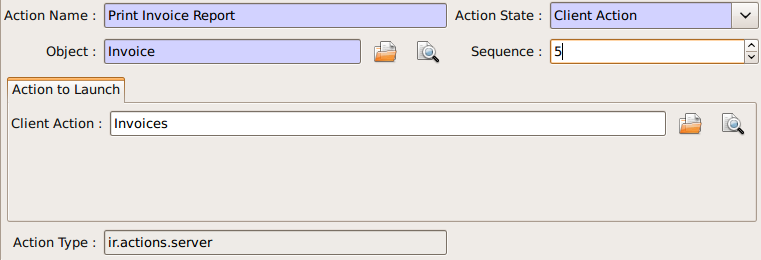
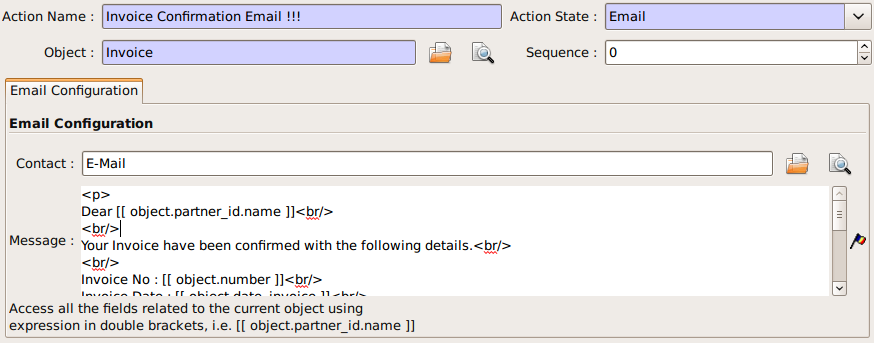
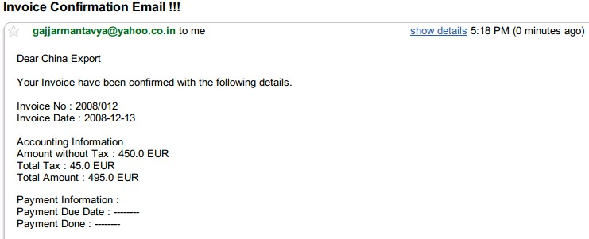
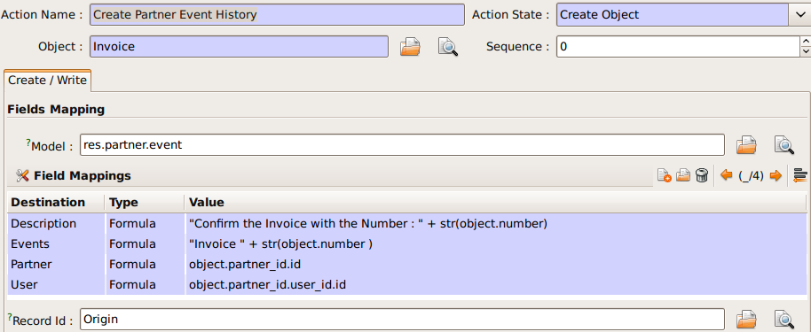
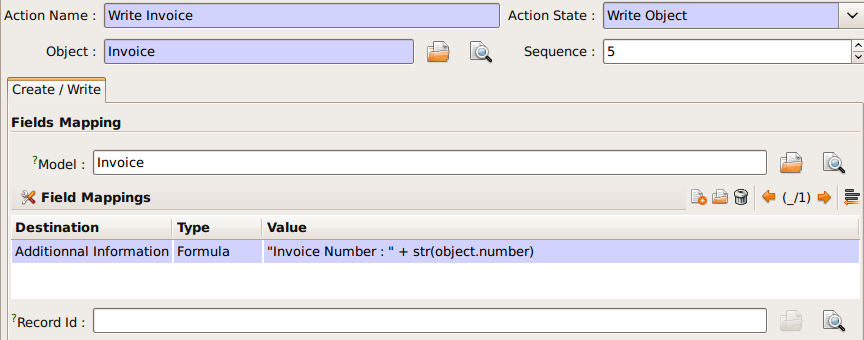
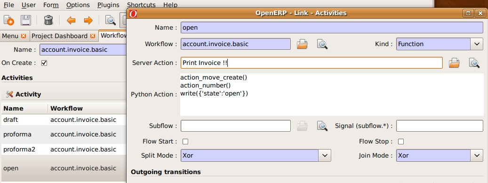

.. i18n: =============
.. i18n: Server Action
.. i18n: =============
..

==========
服务器动作
==========

.. i18n: Introduction
.. i18n: ------------
..

简介
----

.. i18n: Server action is an new feature available since the OpenERP
.. i18n: version 5.0 beta. This is an useful feature to fulfill customer
.. i18n: requirements. It provides a quick and easy configuration for day to
.. i18n: day requirements such as sending emails on confirmation of sale
.. i18n: orders or invoice, logging operations on invoices (confirm, cancel,
.. i18n: etc.), or running wizard/report on confirmation of sales, purchases,
.. i18n: or invoices.
..

服务器动作(Server Action)是OpenErp 5.0以来推出的一项新的功能。这个功能对于满足客户需求非常有用。
它可以为客户常见的一些业务要求提供简单而又快速的配置界面。
比如确认销售订单或发票时发送电子邮件、记录发票的开具和作废、或者在确认订单和发票的时候运行向导。

.. i18n: Step 1: Definition of Server Action 
.. i18n: -----------------------------------
..

第一步：服务器动作的定义
-----------------------------------

.. i18n: Here is the list of the different action types supplied under the Server Action.
..

下面列举了服务器动作的动作类型:

.. i18n:        * Client Action
.. i18n:        * Dummy
.. i18n:        * Iteration
.. i18n:        * Python Code
.. i18n:        * Trigger
.. i18n:        * Email
.. i18n:        * SMS
.. i18n:        * Create Object
.. i18n:        * Write Object
.. i18n:        * Multi Action
..

       * 客户端动作 Client Action
       * 无动作 Dummy
       * 迭代器 Iteration
       * Python 代码
       * 触发器 Trigger
       * 邮件 Email
       * 短信 SMS
       * 创建对象 Create Object
       * 修改对象 Write Object
       * 多个动作 Multi Action

.. i18n: Each type of action has special features and different configuration
.. i18n: parameters. The following sections review each action type and
.. i18n: describe how to configure them, together with a list of parameters affecting the system.
..

每种类型的动作具有不同的功能和不同的配置参数。我们接下来将看到每种类型的动作，
如何配置，以及影响系统的参数。

.. i18n: .. _client-action:
.. i18n: 
.. i18n: Client Action
.. i18n: ~~~~~~~~~~~~~
..

.. _client-action:

客户端动作（Client Action）
~~~~~~~~~~~~~~~~~~~~~~~~~~~~~

.. i18n: This action executes on the client side. It can be used to run a
.. i18n: wizard or report on the client side. For example, a Client Action can
.. i18n: print an invoice after it has been confirmed and run the payment wizard. Technically we
.. i18n: can run any client action executed on client side. This includes ir.actions.report.custom,
.. i18n: ir.actions.report.xml, ir.actions.act_window, ir.actions.wizard, and
.. i18n: ir.actions.url. In the following example, we can configure a
.. i18n: Client Action to print the invoice after it has been confirmed.
..

这一动作在客户端执行，可以用来执行一个向导或报表。例如，一个客户端动作可以先打印一张发票随后运行付款向导。
从技术上来讲我们能够运行所有客户端执行的动作。包括ir.actions.report.custom,
ir.actions.report.xml, ir.actions.act_window, ir.actions.wizard, 和
ir.actions.url. 下面这个例子向我们配置一个客户端动作来确认发票后立即打印.

.. i18n: .. image:: images/client_action.png
..

.. i18n: Important fields are:
..

要关注的字段:

.. i18n: :Object: the object affected by the workflow on for which we want to
.. i18n:          run the action
.. i18n: :Client Action: the client action, which will be executed on the
.. i18n:                 client side. It must have one of the following types:
..

:Object: 动作相关工作流对应的对象
:Client Action: 选择要执行的动作，这些动作必须是如下种类中的一个:

.. i18n: * ir.actions.report.custom
.. i18n: * ir.actions.report.xml
.. i18n: * ir.actions.act_window
.. i18n: * ir.actions.wizard
.. i18n: * ir.actions.url
..

* ir.actions.report.custom
* ir.actions.report.xml
* ir.actions.act_window
* ir.actions.wizard
* ir.actions.url

.. i18n: Iteration
.. i18n: ~~~~~~~~~
..

循环
~~~~~~~~~~~~~~~

.. i18n: Using a Python loop expression, it is possible to iterate over a
.. i18n: server action.  For example, when confirming a inward stock move, each
.. i18n: line item must be historized. You can loop on expression object.move_lines and create another server action which is referred to do the historizing job.
..

输入一个python变量作为循环表达式，然后选择要在这个表达式的结果集上遍历执行的服务端动作。
例如，确认一张入库单以后，每个移库行都要记录一下状态的变更。可以把 object.move_lines
作为表达式，然后创建另一个服务器动作来实现记录状态变更的功能。

.. i18n: Python Code
.. i18n: ~~~~~~~~~~~
..

Python 代码
~~~~~~~~~~~

.. i18n: This action type is used to execute multiline python code. The
.. i18n: returned value is the value of the variable ``action``, defaulting to
.. i18n: ``{}``. This makes sense only if you want to pop a specific
.. i18n: window(form) specific to the context, but a return value is generally
.. i18n: not needed.
..

这个动作类型是执行一个多行的Python代码. 返回的值是 ``action``变量的值, 缺省值是
``{}``. 仅在你需要弹出特定内容的特定窗体的时候需要返回值，一般来说返回空即可.

.. i18n: Note: The code is executed using Python's ``exec`` built-in
.. i18n: function. This function is run in a dedicated namespace containing the
.. i18n: following identifiers: ``object``, ``time``, ``cr``, ``uid``, ``ids``.
..

记住: 这些代码用Python的 ``exec`` 函数来执行. 这个函数有一些内置的变量可用，
如: ``object``, ``time``, ``cr``, ``uid``, ``ids``.

.. i18n: Trigger
.. i18n: ~~~~~~~~
..

触发器Trigger
~~~~~~~~~~~~~

.. i18n: Any transition of the workflow can be triggered using this action. The
.. i18n: options you need to set are:
..

任何工作流的迁移都可以用这个来触发。你需要设定的参数是:

.. i18n: :Object: the object affected by the workflow on for which we want to
.. i18n:          run the action
.. i18n: :Workflow on: The target object on which you want to trigger the
.. i18n:                  workflow.
.. i18n: :Trigger on: the ID of the target model record, e.g. Invoice if you want to trigger a change on an invoice. 
.. i18n: :Trigger Name: the signal you have to use to initiate the
.. i18n:                transition. The drop down lists all possible
.. i18n:                triggers. Note: the list contains all possible
.. i18n:                transitions from other models also, so ensure you
.. i18n:                select the right trigger. Models are shown in brackets. 
..

:Object: 动作相关工作流对应的对象.
:Workflow on: 要触发的工作流对应的对象.
:Trigger on: 源对象中指向目标对象的字段名. 
:Trigger Name: 是用来触发迁移的信号signal。下拉列表框列出了数据库中所有信号.
               注意：这里可选的是所有信号，但实际上你应该选择目标对象对应的才有意义。下拉选项括号内给出的是对象名. 

.. i18n: The following example shows the configuration of a trigger used to
.. i18n: automatically confirm invoices:
..

下图演示了如何配置实现自动触发确认发票的动作:

.. i18n: .. image:: images/trigger_action.png
..

.. image:: images/trigger_action.png

.. i18n: Email Action
.. i18n: ~~~~~~~~~~~~~
..

邮件动作 Email Action
~~~~~~~~~~~~~~~~~~~~

.. i18n: This action fulfills a  common requirement for all business process, sending a confirmation by email
.. i18n: whenever sales order, purchase order, invoice, payment or shipping of
.. i18n: goods takes place. 
..

发邮件是所有业务处理的通用需求，比如通过邮件确认销售订单、采购订单、发票、付款、发货等. 

.. i18n: Using this action does not require a dedicated email
.. i18n: server: any existing SMTP email server and account can be used,
.. i18n: including free email account (Gmail, Yahoo !, etc...)
..

不需要自己搭建邮件服务器，你可以使用现有的免费邮件服务账号，比如Gmail、Yahoo等等。

.. i18n: *Server Configuration*
..

*邮件服务配置*

.. i18n: The OpenERP server must know how to connect to the SMTP server. This
.. i18n: can be done from the command line when starting the server or by
.. i18n: editing the configuration file. Here are the command line options:
..

启用OpenErp服务时，我们提供下列参数:

.. i18n: ::
.. i18n: 
.. i18n:   --email-from=<sender_email@address>
.. i18n:   --smtp=<smtp server name or IP address>
.. i18n:   --smtp-port=<smtp server port>
.. i18n:   --smtp-user=<smtp user name, if required>
.. i18n:   --smtp-password=<smtp user password, if required>
.. i18n:   --smtp-ssl=<true if the server requires SSL for sending email, else false>
..

::

  --email-from=<sender_email@address>
  --smtp=<smtp server name or IP address>
  --smtp-port=<smtp server port>
  --smtp-user=<smtp user name, if required>
  --smtp-password=<smtp user password, if required>
  --smtp-ssl=<true if the server requires SSL for sending email, else false>

.. i18n: .. **
..

.. **

.. i18n: Here is an example configuration an action which sends an email when
.. i18n: an invoice is confirmed
..

下面以为发票确认后自动发送一封邮件为例, 来配置一个服务器动作:

.. i18n: .. image:: images/email_action.png
..

.. i18n: Important Fields are:
..

关注以下字段:

.. i18n: :Object: the object affected by the workflow on for which we want to
.. i18n:          run the action
.. i18n: :Contact: the field from which action will find the email address of
.. i18n:           the recipient of the email. The system will displays all the
.. i18n:           fields related to the object selected in the Object field. 
.. i18n: :Message: the message template with the fields that will filled using
.. i18n:           the current object. The notation is the same as the one used
.. i18n:           RML to design reports: you can use the [[ ]] + HTML tags to
.. i18n:           design in the HTML format. For example to get the partner
.. i18n:           name we can use [[ object.partner_id.name ]], object refers
.. i18n:           to the current object and we can access any fields which
.. i18n:           exist in the model.
..

:Object:  动作相关的工作流相关的对象
:Contact: 告诉系统我们要使用的收件人地址从对象的哪个字段来 
:Message: 这个邮件模版里可以使用对象的字段作为占位符，在发送邮件时它会被字段值替换。用的格式与我们用来设计rml报表一样，
          用[[ object.partner_id.name ]]来表示变量，还可以使用HTML标记来格式化。object就是我们上面指定的对象，可以使用其中的任意字段。

.. i18n: After configuring this action, whenever an invoice is confirmed, an
.. i18n: email such as the following is sent:
..

完成上面的服务器动作配置后, 随便你啥时候确认发票的时候,都会自动发送类似下面的Email:

.. i18n: .. image:: images/email_confirm.png
..

.. i18n: Create Object
.. i18n: ~~~~~~~~~~~~~
..

创建对象
~~~~~~~~

.. i18n: This type of action can be used to emulate the Event history feature currently
.. i18n: available on Partners, which logs sales orders issued by a partner, on
.. i18n: other objects which do not natively support this feature, such as
.. i18n: invoices:
..

This type of action can be used to emulate the Event history feature currently
available on Partners, which logs sales orders issued by a partner, on
other objects which do not natively support this feature, such as
invoices:

.. i18n: .. image:: images/create_object.png
..

.. i18n: Create Object action configuration can be tricky, since it is
.. i18n: currently necessary to remember the field names (or to check them out
.. i18n: from the source code itself). There are plans to provide an
.. i18n: expression builder inside OpenERP in the future, which will be useful
.. i18n: to build complex expressions.
..

Create Object action configuration can be tricky, since it is
currently necessary to remember the field names (or to check them out
from the source code itself). There are plans to provide an
expression builder inside OpenERP in the future, which will be useful
to build complex expressions.

.. i18n: Important fields are:
..

重点字段:

.. i18n: :Object: the object affected by the workflow on for which we want to
.. i18n:          run the action
.. i18n: :Model: the target model for the object to be created. If empty, it
.. i18n:         refers to the current object and allows to select the fields
.. i18n:         from it. It is recommended to provide a model in all cases. 
.. i18n: :Fields Mapping: Need to provide 3 values:
..

:Object: the object affected by the workflow on for which we want to
         run the action
:Model: the target model for the object to be created. If empty, it
        refers to the current object and allows to select the fields
        from it. It is recommended to provide a model in all cases. 
:Fields Mapping: Need to provide 3 values:

.. i18n: 1. *Destination*: any of the fields from the target model
.. i18n: 2. *Type*: the type of the mapping. Allowed values are ``value`` or ``formula``
.. i18n: 3. *Value*: provide the value or expression the expression. The
.. i18n:    ``object`` refers to the current object.
..

1. *Destination*: any of the fields from the target model
2. *Type*: the type of the mapping. Allowed values are ``value`` or ``formula``
3. *Value*: provide the value or expression the expression. The
   ``object`` refers to the current object.

.. i18n: *You must select the all required fields from the target model*
..

*你必须选择该 对象 的所有必填字段*

.. i18n: :Record Id: the field in which the  id of the new record is
.. i18n:             stored. This is used to refer to the same object in future
.. i18n:             operations (see below)
..

:Record Id: the field in which the  id of the new record is
            stored. This is used to refer to the same object in future
            operations (see below)

.. i18n: Write Object
.. i18n: ~~~~~~~~~~~~~
..

编辑对象
~~~~~~~~

.. i18n: The configuration is very similar to the Create Object actions. The
.. i18n: following example writes 'Additional Information' on the same object
..

The configuration is very similar to the Create Object actions. The
following example writes 'Additional Information' on the same object

.. i18n: .. image:: images/write_object.png
..

.. i18n: Important Fields are
..

重点字段:

.. i18n:   **same as the Create Object**
..

  **same as the Create Object**

.. i18n: Multi Action
.. i18n: ~~~~~~~~~~~~~
..

多重组合动作
~~~~~~~~~~~~

.. i18n: This action allows to execute  multiple server actions on the same
.. i18n: business operation. For instance, it can be used to print *and* send
.. i18n: an email on confirmation of an invoice. This requires creating 3 server actions:
..

这个动作允许在同一个商务活动中执行多个服务端动作. 例如, 可以打印 *并* 发送一封邮件确认发票. 这需要创建三个服务端动作:

.. i18n:   * Print Invoice
.. i18n:   * Invoice Confirmation Email !!
.. i18n:   * Multi Action
..

  * 打印发票
  * 发票确认邮件
  * 多重动作

.. i18n: There is a fundamental restriction on this action: it can execute many actions at the server side, but only
.. i18n: one single client action. It is therefore not possible to print a
.. i18n: report and execute a wizard at the same time. 
..

这个动作有一点限制的地方: 可以在服务端执行多个动作, 但是只有一个客户端动作. 这也是为什么不能在执行打印报表的同时无法打开
珍上向导的原因. 

.. i18n: .. image:: images/multi_action.png
..

.. image:: images/multi_action.png

.. i18n: Important Fields are:
..

重点字段:

.. i18n: :Object: the object affected by the workflow on for which we want to
.. i18n:          run the action
.. i18n: :Other Actions: the list of server action. Any number of actions can
.. i18n:                 be selected, but beware of the restriction mentioned
.. i18n:                 above: if you select more than one Client action, only
.. i18n:                 the first will be executed. 
..

:Object: 这个对象受到我们想要执行动作的影响
:Other Actions: 服务动作清单.任意数量的动作都可以被选择,但是小心上面提到的限制: 
                如果你选择的客户端动作数量超过一个，那么只有第一个动作会被执行. 

.. i18n: Step 2: Mapping Server actions to workflows
.. i18n: -------------------------------------------
..

第二步：给工作流定义服务端动作
------------------------------

.. i18n: Server actions by themselves are useless, until a workflow stage is
.. i18n: set up to trigger them.
..

服务端的动作除非在工作流中触发，否则是无用的

.. i18n: Workflows can be accessed at: Administration >> Customization >>
.. i18n: Workflow Definitions >> Workflows. Open the corresponding workflow,
.. i18n: edit the stage at which the server action needs to be triggered. Then 
.. i18n: Select the server action in the box.
..

工作流可以在: :menuselection:`Administration --> Customization --> Workflow Definitions --> Workflows` 中访问. 打开相应的
工作流,编辑要被触发的服务端动作. 选择要执行的动作.

.. i18n: The following example shows how to associate the Print invoice action
.. i18n: to the Open state of the Invoice workflow:
..

The following example shows how to associate the Print invoice action
to the Open state of the Invoice workflow:

.. i18n: .. image:: images/link_workflow.png
..

