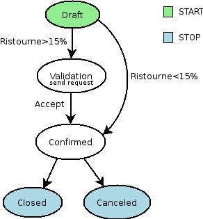
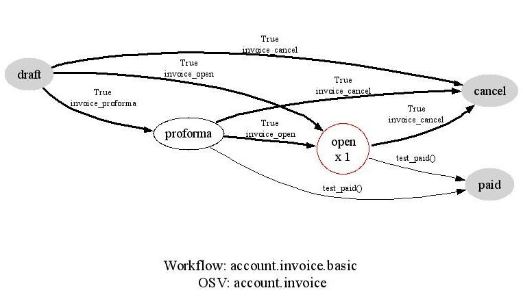
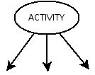
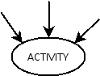

.. i18n: =========================
.. i18n: Workflow-Business Process
.. i18n: =========================
..

=========================
工作流程-商业处理流程
=========================

.. i18n: Introduction
.. i18n: ============
..

简介
====

.. i18n: The workflow system in OpenERP is a very powerful mechanism that can describe the evolution of documents (model) in time.
..

工作流程系统在OpenERP里是非常有用的机制，可以用于及时描述文件(模型)的演进过程。

.. i18n: Workflows are entirely customizable, they can be adapted to the flows and trade logic of almost any company. The workflow system makes OpenERP very flexible and allows it to easily support changing needs without having to program new functionality.
..

工作流程是完全可以定制的，这些流程可以调整适用于几乎所有公司的作业流程和交易逻辑。 这个工作流程系统使OpenERP非常有弹性，而且可以不用编程增加新功能,就可以支持不断变化的需要。
.. i18n: **Goals**
..

**目标**

.. i18n:     * description of document evolution in time
.. i18n:     * automatic trigger of actions if some conditions are met
.. i18n:     * management of company roles and validation steps
.. i18n:     * management of interactions between the different objects/modules
.. i18n:     * graphical tool for visualization of document flows
..

    * 及时描述文件的演进
    * 符合某些条件时自动触发动作
    * 管理公司里人员的角色和验证步骤
    * 管理不同物件/模块间的互动
    * 为文件流程可视化提供图形化的工具

.. i18n: **To understand their utility, see the following three:**
..

**以下三个例子说明了工作流程系统的用途:**

.. i18n: Example 1: Discount On Orders
.. i18n: -----------------------------
..

例子1 : 订单折扣
--------------

.. i18n: The first diagram represent a very basic workflow of an order:
..

第一个流程图代表了一种非常基本的订单流程:

.. i18n: .. image:: images/Workflow_bc1.png
..

.. image:: images/Workflow_bc1.png

.. i18n: The order starts in the 'draft' state, when it is being written and
.. i18n: has not been approved yet. When the user presses on the 'Confirm' button, the invoice is created and the order transitions to the 'CONFIRMED' state.
..

订单一开始在输入但是还没有被核准前，是在'草稿'状态。当使用者按下'确认'，系统会生成请款单，而且订单会变成'已确认'状态。

.. i18n: Then, two operations are possible:
..

然后, 可能有2个动作:

.. i18n: #. the order is done (shipped)
.. i18n: 
.. i18n: #. the order is canceled
..

#. 订单完成(已出货)

#. 订单被取消

.. i18n: Let's suppose a company has a need not implemented in OpenERP. For example, their sales staff can only offer discounts of 15% or less. Every order having a discount above 15% must be approved by the sales manager.
..

假设公司有一个需求还没有在 OpenERP 里实现，例如，销售人员只能同意到最多 15% 的折扣，所有折扣大于 15% 的订单必须由销售经理核准。

.. i18n: This modification in the sales logic doesn't need any lines of Python code! A simple modification of the workflow allows us to take this new need into account and add the extra validation step.
..

这种业务流程的修改需求不需要更改任何 Python 编码! 只需要一个简单的工作流程修改就可以让我们把这个新的需求列入考虑，并且多增加一个验证步骤。

.. i18n: .. image:: images/Workflow_bc2.png
..

.. i18n: The workflow is modified as above and the orders will react as requested. We then only need to modify the order form view and add a validation button at the desired location.
..

工作流程依上面的图里修改以后，订单就会依所要求的方式反应。然后我们只需要修改订单的表单显示方式，在想要的位置加上验证的按键。

.. i18n: We could then further improve this workflow by sending a request to the sales manager when an order enters the 'Validation' state. Workflow nodes can execute object methods; only two lines of Python are needed to send a request asking the sales manager to validate or reject the order.
..

然后我们可以再深入强化这个工作流程-当订单进入 '待验证' 状态，主动通知销售经理审核订单。工作流程的节点可以执行物件的程序；只要增加2行 Python 编码，就可以通知销售经理审核或是取消订单。

.. i18n: Example 2: A sale order that generates an invoice and a shipping order
.. i18n: ----------------------------------------------------------------------
..

例子2: 业务订单产生请款单及出货通知
------------------------------

.. i18n: .. image:: images/Workflow_sale.png
..

.. image:: images/Workflow_sale.png

.. i18n: Example 3: Account invoice basic workflow
.. i18n: -----------------------------------------
..

例子3: 客户请款单基本工作流程
-------------------------

.. i18n: .. image:: images/Acount_inv_wkf.jpg
..

.. i18n: Defining Workflow
.. i18n: =================
..

定义工作流程
==========

.. i18n: Workflows are defined in the file ``server/addons/base/ir/workflow/workflow.py``. The first three classes defined in this file are ``workflow``, ``wkf_activity`` and ``wkf_transition``. They correspond to the three types of resources necessary to describe a workflow:
..

工作流程是在以下档案里定义的 ``server/addons/base/ir/workflow/workflow.py``。 在这个档案里定义的前3个级别(class)是 ``workflow``，``wkf_activity`` 和 ``wkf_transition``。他们分别对应了工作流程里3种需要的资源:

.. i18n:     * `workflow <http://openobject.com/wiki/index.php/WkfDefXML>`_ : the workflow,
.. i18n:     * `wkf_activity <http://openobject.com/wiki/index.php/WorkflowActivity>`_ : the activities (nodes),
.. i18n:     * `wkf_transition <http://openobject.com/wiki/index.php/WorkflowTransition>`_ : the transitions between the activities.
..

    * `workflow <http://openobject.com/wiki/index.php/WkfDefXML>`_ : 工作流程，
    * `wkf_activity <http://openobject.com/wiki/index.php/WorkflowActivity>`_ : 工作流程的活动(节点)，
    * `wkf_transition <http://openobject.com/wiki/index.php/WorkflowTransition>`_ : 在不同活动间的转变。

.. i18n: General structure of a workflow XML file
.. i18n: ========================================
..

工作流程 XML 档案的一般结构
========================

.. i18n: The general structure of a workflow XML file is as follows:
..

工作流程 XML 档案的一般结构如下:

.. i18n: .. code-block:: xml
.. i18n: 
.. i18n:     <?xml version="1.0"?>
.. i18n:     <openerp>
.. i18n:     <data>
.. i18n:     <record model="workflow" id=workflow_id>
.. i18n: 
.. i18n:         <field name="name">workflow.name</field>
.. i18n:         <field name="osv">resource.model</field>
.. i18n:         <field name="on_create" eval='True|False' />
.. i18n: 
.. i18n:     </record>
.. i18n: 
.. i18n:     </data>
.. i18n:     </openerp>
..

.. code-block:: xml

    <?xml version="1.0"?>
    <openerp>
    <data>
    <record model="workflow" id=workflow_id>

        <field name="name">workflow.name</field>
        <field name="osv">resource.model</field>
        <field name="on_create" eval='True|False' />

    </record>

    </data>
    </openerp>

.. i18n: **Where**
..

**这里的**

.. i18n:     * **id** (here "workflow_id") is a workflow identifier. Each workflow must have an unique identifier.
.. i18n:     * **name** (here "workflow.name") is the name of the workflow. The name of the workflow must respect the OpenERP syntax of "dotted names".
.. i18n:     * **osv** (here "resource.model") is the name of the object we use as a model [-(Remember an OpenERP object inherits from osv.osv, hence the '<field name="osv">')-].
.. i18n:     * **on_create** is True if workflow.name must be instantiated automatically when resource.model is created, and False otherwise.
..

    * **id** (就是 "workflow_id") 是工作流程的识别码。每个工作流程必须有一个唯一的识别码。
    * **name** (就是 "workflow.name") 是工作流程的名称。工作流程的名称必须符合 OpenERP 文法的 "带点名称" 要求。
    * **osv** (就是 "resource.model") 是我们当做模型使用的物件名称 [-(请记得 OpenERP 物件是从 osv.osv 继承属性，所以 '<栏位名称="osv">')-]。
    * **on_create** 如果为 True，在创建 resource.model 时会自动将 workflow.name 实体化，如果是 False 则相反。

.. i18n: **Example**
..

**范例**

.. i18n: The workflow ``sale.order.basic`` defined in ``addons/sale/sale_workflow.xml`` follows exactly this model, the code of its workflow tag is:
..

定义在 ``addons/sale/sale_workflow.xml`` 里的工作流程 ``sale.order.basic`` 完全依照这个模式，工作流程标签的编码如下:

.. i18n: .. code-block:: xml
.. i18n: 
.. i18n:     <record model="workflow" id="wkf_sale">
.. i18n: 
.. i18n:         <field name="name">sale.order.basic</field>
.. i18n:         <field name="osv">sale.order</field>
.. i18n:         <field name="on_create" eval='True' />
.. i18n: 
.. i18n:     </record>
..

.. code-block:: xml

    <record model="workflow" id="wkf_sale">

        <field name="name">sale.order.basic</field>
        <field name="osv">sale.order</field>
        <field name="on_create" eval='True' />

    </record>

.. i18n: Activity
.. i18n: ==========
..

活动
====

.. i18n: Introduction
.. i18n: ------------
..

简介
----

.. i18n: The ``wkf_activity`` class represents the nodes of workflows. These nodes are the actions to be executed.
..

``wkf_activity`` 这个级别(class)代表工作流程的节点。这些节点就是要被执行的行动。

.. i18n: The fields
.. i18n: ----------
..

栏位
----

.. i18n: ::
.. i18n: 
.. i18n:     split_mode
..

::

    split_mode(拆分模式)

.. i18n: .. image::  images/Wkf_split.png
..

.. i18n: Possible values:
..

可能的值:

.. i18n: * XOR: One necessary transition, takes the first one found (default).
.. i18n: * OR: Take only valid transitions (0 or more) in sequential order.
.. i18n: * AND: All valid transitions are launched at the same time (fork).
..

* XOR: 一个必须的转变, 取找到的第一个转变(预设值)。
* OR: 只依顺序取有效的转变(可能是0个或是多个)。
* AND: 所有有效的转变都会同时出现(分叉)。

.. i18n: In the OR and AND separation mode, certain workitems can be generated.
..

在 OR 和 AND 分离模式，可能会产生一些工作时间。

.. i18n: In the AND mode, the activity waits for all transitions to be valid, even if some of them are already valid. They are all triggered at the same time.
..

在 AND 模式，活动会等到所有转变都生效才会开始进行；即使是有小部分转变还没有生效，活动也不会开始进行。所有活动是同时被触发的。

.. i18n: ::
.. i18n: 
.. i18n:     join_mode
..

::

    join_mode(结合模式)

.. i18n: .. image:: images/Wkf_join.png
..

.. i18n: Possible values:
..

可能的值:

.. i18n: * **XOR**: One transition necessary to continue to the destination activity (default).
.. i18n: * **AND**: Waits for all transition conditions to be valid to execute the destination activity.
..

* **XOR**: 进行目标的活动前，还必须继续一个转变(预设值)。
* **AND**: 等待所有转变都生效，才能执行活动。

.. i18n: ::
.. i18n: 
.. i18n:     kind
..

::

    kind(种类)

.. i18n: Possible values:
..

可能的值:

.. i18n:     * **dummy**: Do nothing (default).
.. i18n:     * **function**: Execute the function selected by an action.
.. i18n:     * **subflow**: Execute a sub-workflow SUBFLOW_ID. The action method must return the ID of the concerned resource by the subflow. If the action returns False, the workitem disappears.
.. i18n:     * **stopall**:
..

    * **dummy**: 不作任何事(预设值)。
    * **function**: 执行一个行为选择的功能。
    * **subflow**: 执行一个子工作流程 SUBFLOW_ID(子工作流程代码)。这个行为程序必须回复子工作流程所需要的资源代码。如果这个行为程序回复 False，这个工作项目就会消失。
    * **stopall**: 全部停止

.. i18n: A sub-workflow is executed when an activity is of the type SUBFLOW. This activity ends when the sub-workflow has finished. While the sub-workflow is active, the workitem of this activity is frozen.
..

当某一个活动是 SUBFLOW 形态时，就会执行子工作流程。当子工作流程结束时活动也会结束。当子工作流程在作用中，这个活动的工作项目会被冻结。

.. i18n: ::
.. i18n: 
.. i18n:     action
..

::

    action(行动)

.. i18n: The action indicates the method to execute when a workitem comes into this activity. The method must be defined in an object which belongs to this workflow and have the following signature:
..

行动是指当某一个工作项目来到这个活动时，所要执行的程序方法。这些程序方法必须在这个工作流程里的物件里有定义，而且具有以下特征:

.. i18n: .. code-block:: python
.. i18n: 
.. i18n:     def object_method(self, cr, uid, ids):
..

.. code-block:: python

    def object_method(self, cr, uid, ids):

.. i18n: In the action though, they will be called by a statement like:
..

在实际行动里，这些程序方法会被以下的叙述方式呼叫:

.. i18n: .. code-block:: python
.. i18n: 
.. i18n:     object_method()
..

.. code-block:: python

    object_method()

.. i18n: ::
.. i18n: 
.. i18n:     signal_send
..

::

    signal_send(送出信号)

.. i18n: This field is used to specify a signal that will be sent to the parent
.. i18n: workflow when the activity becomes active. To do this, set the value
.. i18n: to the name of the signal (without the ``signal.`` prefix). 
..

这个栏位是用于指定一个信号，当活动在作用中，这个信号就会被送往上一层的工作流程。如果要送出信号，将栏位值设定为信号的名字 (去掉开头的 ``signal.`` )。

.. i18n: ::
.. i18n: 
.. i18n:     flow_start
..

::

    flow_start(流程开始)

.. i18n: Indicates if the node is a start node. When a new instance of a workflow is created, a workitem is activated for each activity marked as a ``flow_start``.
..

标记这个节点是否为开始节点。当创建一个工作流程的实例时，每一个活动都会启动一个标记为``flow_start``(流程开始)的工作项目。

.. i18n: .. warning::
.. i18n: 
.. i18n:     As for all Boolean fields, when writing the ``<field>`` tag in
.. i18n:     your XML data, be sure to use the ``eval`` attribute and not a
.. i18n:     text node for this attribute. Read the section about the
.. i18n:     :ref:`eval attribute <eval-attribute-link>` for an explanation.
..

.. 注意::

    对所有的布尔型栏位来说，当在你的XML资料里写入``<field>``标记时，务必使用``eval``属性，
     不可以使用文字节点属性。详细说明请参考:ref:`eval attribute <eval-attribute-link>`。

.. i18n: ::
.. i18n: 
.. i18n:     flow_stop
..

::

    flow_stop(流程停止)

.. i18n: Indicates if the node is an ending node. When all the active workitems for a given instance come in the node marked by flow_stop, the workflow is finished.
..

标记这个节点是否为结束的节点。当一个实例里所有作用中的工作项目来到标记为``flow_stop``(流程停止)的节点，工作流程将会结束。

.. i18n: .. warning::
.. i18n: 
.. i18n:     See above in the description of the ``flow_start`` field.
..

.. 注意::

    参考上面关于``flow_start``(流程开始)的栏位说明

.. i18n: ::
.. i18n:     wkf_id
..

::
    wkf_id(工作流程识别码)

.. i18n: The workflow this activity belongs to.
..

表示这个活动所属的工作流程。

.. i18n: Defining activities using XML files
.. i18n: -----------------------------------
..

使用XML档案定义活动
-----------------------------------

.. i18n: The general structure of an activity record is as follows
..

活动记录的一般结构如下

.. i18n: .. code-block:: xml
.. i18n: 
.. i18n:     <record model="workflow.activity" id="''activity_id''">
.. i18n:           <field name="wkf_id" ref="''workflow_id''"/>
.. i18n:           <field name="name">''activity.name''</field>::
.. i18n: 
.. i18n:           <field name="split_mode">XOR | OR | AND</field>
.. i18n:           <field name="join_mode">XOR | AND</field>
.. i18n:           <field name="kind">dummy | function | subflow | stopall</field>
.. i18n: 
.. i18n:           <field name="action">''(...)''</field>
.. i18n:           <field name="signal_send">''(...)''</field>
.. i18n:           <field name="flow_start" eval='True | False' />
.. i18n:           <field name="flow_stop" eval='True | False' />
.. i18n:       </record>
..

.. code-block:: xml

    <record model="workflow.activity" id="''activity_id''">
          <field name="wkf_id" ref="''workflow_id''"/>
          <field name="name">''activity.name''</field>::

          <field name="split_mode">XOR | OR | AND</field>
          <field name="join_mode">XOR | AND</field>
          <field name="kind">dummy | function | subflow | stopall</field>

          <field name="action">''(...)''</field>
          <field name="signal_send">''(...)''</field>
          <field name="flow_start" eval='True | False' />
          <field name="flow_stop" eval='True | False' />
      </record>

.. i18n: The first two arguments **wkf_id** and name are mandatory.
..

开始的**wkf_id**和**name**是强制要求要有的两个参数。

.. i18n: Examples
.. i18n: --------
..

范例
----

.. i18n: There are too many possibilities of activity definition to choose from using this definition. We recommend you to have a look at the file ``server/addons/sale/sale_workflow.xml`` for several examples of activity definitions.
..

有太多时候可以从这个定义档案里选择其中一项作为活动的定义，所以我们建议大家看看以下档案里的几个活动定义范例。``server/addons/sale/sale_workflow.xml``

.. i18n: Transition
.. i18n: ===========
..

转变
====

.. i18n: Introduction
.. i18n: ------------
..

简介
----

.. i18n: Workflow transitions are the conditions which need to be satisfied to
.. i18n: move from one activity to the next. They are represented by one-way arrows joining two activities.
..

工作流程的转变是指，一个活动要进行到下一个活动前，必须满足的条件。转变是用单向的箭头代表，通常会连接前后两个活动。

.. i18n: The conditions are of different types:
..

条件有以下几种:

.. i18n:     * role that the user must satisfy
.. i18n:     * button pressed in the interface
.. i18n:     * end of a subflow through a selected activity of subflow
..

    * 使用者必须符合某种角色要求
    * 在使用界面里按下某个按钮
    * 经由某个指定的活动达到这个子流程的结束点

.. i18n: The roles and signals are evaluated before the expression. If a role or a signal is false, the expression will not be evaluated.
..

系统是在表达式之前先判断任务或信号是否成立，所以如果任务或信号为伪(false)，系统不会进行表达式的判断。

.. i18n: Transition tests may not write values in objects.
..

转变的判断可能不会在物件里写入任何值。

.. i18n: The fields
.. i18n: ----------
..

栏位
----

.. i18n: ::
.. i18n: 
.. i18n:     act_from
..

::

    act_from(来源活动)

.. i18n: Source activity. When this activity is over, the condition is tested to determine if we can start the ACT_TO activity.
..

转变的来源活动。当这个(来源)活动结束后，系统会检查这个栏位的状态，来确认是不是可以开始进行 ACT_TO 活动。

.. i18n: ::
.. i18n: 
.. i18n:     act_to
..

::

    act_to(目标活动)

.. i18n: The destination activity.
..

目标的活动

.. i18n: ::
.. i18n: 
.. i18n:     condition
..

::

    状态

.. i18n: **Expression** to be satisfied if we want the transition done.
..

要满足**表达式(Expression)** 才能完成转变。

.. i18n: ::
.. i18n: 
.. i18n:     signal
..

::

    信号

.. i18n: When the operation of transition comes from a button pressed in the client form, signal tests the name of the pressed button.
..

当转变的运作是来自于在使用者界面里按下一个按钮，信号会检查被按下的按钮的名称。

.. i18n: If signal is NULL, no button is necessary to validate this transition.
..

如果信号为空值(NULL)，表示不需要任何按钮来启动这个转变。

.. i18n: ::
.. i18n: 
.. i18n:     role_id
..

::

    role_id(角色识别码)

.. i18n: The **role** that a user must have to validate this transition.
..

使用者必须符合某个**角色**才能启动这个转变

.. i18n: Defining Transitions Using XML Files
.. i18n: ------------------------------------
..

用 XML 档案定义转变
------------------------------------

.. i18n: The general structure of a transition record is as follows
..

转变记录的一般结构如下

.. i18n: .. code-block:: xml
.. i18n: 
.. i18n:     <record model="workflow.transition" id="transition_id">
.. i18n: 
.. i18n:         <field name="act_from" ref="activity_id'_1_'"/>
.. i18n:         <field name="act_to" ref="activity_id'_2_'"/>
.. i18n: 
.. i18n:         <field name="signal">(...)</field>
.. i18n:         <field name="role_id" ref="role_id'_1_'"/>
.. i18n:         <field name="condition">(...)</field>
.. i18n: 
.. i18n:         <field name="trigger_model">(...)</field>
.. i18n:         <field name="trigger_expr_id">(...)</field>
.. i18n: 
.. i18n:     </record>
..

.. code-block:: xml

    <record model="workflow.transition" id="transition_id">

        <field name="act_from" ref="activity_id'_1_'"/>
        <field name="act_to" ref="activity_id'_2_'"/>

        <field name="signal">(...)</field>
        <field name="role_id" ref="role_id'_1_'"/>
        <field name="condition">(...)</field>

        <field name="trigger_model">(...)</field>
        <field name="trigger_expr_id">(...)</field>

    </record>

.. i18n: Only the fields **act_from** and **act_to** are mandatory.
..

只有**act_from**和**act_to**这两个栏位是强制要求要有的。

.. i18n: Expressions
.. i18n: ===========
..

表达式
=====

.. i18n: Expressions are written as in Python:
..

表达式是以 Python 写成的:

.. i18n:     * True
.. i18n:     * 1==1
.. i18n:     * 'hello' in ['hello','bye']
..

    * True
    * 1==1
    * 'hello' in ['hello','bye']

.. i18n: Any field from the resource the workflow refers to can be used in these expressions. For example, if you were creating a workflow for partner addresses, you could use expressions like:
..

工作流程指向的资源里，任何栏位都可以用在表达式里。例如，如果想要为伙伴地址建立一个工作流程，可以用类似以下的表达式:

.. i18n:     * zip==1400
.. i18n:     * phone==mobile
..

    * zip==1400
    * phone==mobile

.. i18n: User Role
.. i18n: =========
.. i18n: Roles can be attached to transitions. If a role is given for a transition, that transition can only be executed if the user who triggered it has the required role.
..

使用者角色
=========
转变可以附加角色要求。如果转变指定角色要求，只有符合角色要求的使用者启动转变，转变才会进行。

.. i18n: Each user can have one or several roles. Roles are defined in a tree of roles, parent roles having the rights of all their children.
..

每个使用者可以有一个或多个角色。角色会被定义在一个角色树状图里，上层(父层)的角色拥有所有下层(子层)的权力。

.. i18n: Example:
..

范例:

.. i18n: CEO
..

执行长

.. i18n:   * Technical manager
.. i18n: 
.. i18n:     - Lead developer
..

  * 技术经理

    - 研发组长

.. i18n:       + Developers
.. i18n:       + Testers
..

      + 研发员
      + 测试员

.. i18n:   * Sales manager
.. i18n: 
.. i18n:     - Commercials
.. i18n:     - ...
..

  * 销售经理

    - 广告人员
    - ...

.. i18n: Let's suppose we handle our own bug database and that the action of marking a bug as valid needs the Testers role. In the example tree above, marking a bug as valid could be done by all the users having the following roles: Testers, Lead developer, Technical manager, CEO.
..

假设我们要查找数据库里的错误，需要测试员的角色才能在找到的错误上做标示，在上述范例的角色树里，有以下角色的人都可以在找到的错误上做标示：测试员，研发组长，技术经理，执行长。

.. i18n: Error handling
.. i18n: ==============
..

错误处理
=======

.. i18n: As of this writing, there is no exception handling in workflows.
..

As of this writing, there is no exception handling in workflows.

.. i18n: Workflows being made of several actions executed in batch, they can't trigger exceptions. In order to improve the execution efficiency and to release a maximum of locks, workflows commit at the end of each activity. This approach is reasonable because an activity is only started if the conditions of the transactions are satisfied.
..

Workflows being made of several actions executed in batch, they can't trigger exceptions. In order to improve the execution efficiency and to release a maximum of locks, workflows commit at the end of each activity. This approach is reasonable because an activity is only started if the conditions of the transactions are satisfied.

.. i18n: The only problem comes from exceptions due to programming errors; in that case, only transactions belonging to the entirely completed activities are executed. Other transactions are "rolled back".
..

The only problem comes from exceptions due to programming errors; in that case, only transactions belonging to the entirely completed activities are executed. Other transactions are "rolled back".

.. i18n: Creating a Workflow
.. i18n: ===================
..

Creating a Workflow
===================

.. i18n: Steps for creating a simple state-changing workflow for a custom module called **mymod**
..

Steps for creating a simple state-changing workflow for a custom module called **mymod**

.. i18n: Define the States of your object
.. i18n: --------------------------------
..

Define the States of your object
--------------------------------

.. i18n: The first step is to define the States your object can be in. We do this by adding a 'state' field to our object, in the _columns collection
..

The first step is to define the States your object can be in. We do this by adding a 'state' field to our object, in the _columns collection

.. i18n: .. code-block:: python
.. i18n: 
.. i18n:     _columns = {
.. i18n:      ...
.. i18n:         'state': fields.selection([
.. i18n:         ('new','New'),
.. i18n:         ('assigned','Assigned'),
.. i18n:         ('negotiation','Negotiation'),
.. i18n:         ('won','Won'),
.. i18n:         ('lost','Lost')], 'Stage', readonly=True),
.. i18n:     }
..

.. code-block:: python

    _columns = {
     ...
        'state': fields.selection([
        ('new','New'),
        ('assigned','Assigned'),
        ('negotiation','Negotiation'),
        ('won','Won'),
        ('lost','Lost')], 'Stage', readonly=True),
    }

.. i18n: Define the State-change Handling Methods
.. i18n: ----------------------------------------
..

Define the State-change Handling Methods
----------------------------------------

.. i18n: Add the following additional methods to your object. These will be called by our workflow buttons.
..

Add the following additional methods to your object. These will be called by our workflow buttons.

.. i18n: .. code-block:: python
.. i18n: 
.. i18n:     def mymod_new(self, cr, uid, ids):
.. i18n:          self.write(cr, uid, ids, {'state': 'new'})
.. i18n:          return True
.. i18n: 
.. i18n:     def mymod_assigned(self, cr, uid, ids):
.. i18n:          self.write(cr, uid, ids, {'state': 'assigned'})
.. i18n:          return True
.. i18n: 
.. i18n:     def mymod_negotiation(self, cr, uid, ids):
.. i18n:          self.write(cr, uid, ids, {'state': 'negotiation'})
.. i18n:          return True
.. i18n: 
.. i18n:     def mymod_won(self, cr, uid, ids):
.. i18n:          self.write(cr, uid, ids, {'state': 'won'})
.. i18n:          return True
.. i18n: 
.. i18n:     def mymod_lost(self, cr, uid, ids):
.. i18n:          self.write(cr, uid, ids, {'state': 'lost'})
.. i18n:          return True
..

.. code-block:: python

    def mymod_new(self, cr, uid, ids):
         self.write(cr, uid, ids, {'state': 'new'})
         return True

    def mymod_assigned(self, cr, uid, ids):
         self.write(cr, uid, ids, {'state': 'assigned'})
         return True

    def mymod_negotiation(self, cr, uid, ids):
         self.write(cr, uid, ids, {'state': 'negotiation'})
         return True

    def mymod_won(self, cr, uid, ids):
         self.write(cr, uid, ids, {'state': 'won'})
         return True

    def mymod_lost(self, cr, uid, ids):
         self.write(cr, uid, ids, {'state': 'lost'})
         return True

.. i18n: Obviously you would extend these methods in the future to do something more useful!
..

Obviously you would extend these methods in the future to do something more useful!

.. i18n: Create your Workflow XML file
.. i18n: -----------------------------
..

Create your Workflow XML file
-----------------------------

.. i18n: There are three types of records we need to define in a file called ``mymod_workflow.xml``
..

There are three types of records we need to define in a file called ``mymod_workflow.xml``

.. i18n: #. Workflow header record (only one of these)
..

#. Workflow header record (only one of these)

.. i18n:     .. code-block:: xml
.. i18n: 
.. i18n:         <record model="workflow" id="wkf_mymod">
.. i18n:             <field name="name">mymod.wkf</field>
.. i18n:             <field name="osv">mymod.mymod</field>
.. i18n:             <field name="on_create" eval='True' />
.. i18n:         </record>
..

    .. code-block:: xml

        <record model="workflow" id="wkf_mymod">
            <field name="name">mymod.wkf</field>
            <field name="osv">mymod.mymod</field>
            <field name="on_create" eval='True' />
        </record>

.. i18n: #. Workflow Activity records
..

#. Workflow Activity records

.. i18n:     These define the actions that must be executed when the workflow reaches a particular state
..

    These define the actions that must be executed when the workflow reaches a particular state

.. i18n:     .. code-block:: xml
.. i18n: 
.. i18n:         <record model="workflow.activity" id="act_new">
.. i18n:             <field name="wkf_id" ref="wkf_mymod" />
.. i18n:             <field name="flow_start" eval='True' />
.. i18n:             <field name="name">new</field>
.. i18n:             <field name="kind">function</field>
.. i18n:             <field name="action">mymod_new()</field>
.. i18n:         </record>
.. i18n: 
.. i18n:         <record model="workflow.activity" id="act_assigned">
.. i18n:             <field name="wkf_id" ref="wkf_mymod" />
.. i18n:             <field name="name">assigned</field>
.. i18n:             <field name="kind">function</field>
.. i18n:             <field name="action">mymod_assigned()</field>
.. i18n:         </record>
.. i18n: 
.. i18n:         <record model="workflow.activity" id="act_negotiation">
.. i18n:             <field name="wkf_id" ref="wkf_mymod" />
.. i18n:             <field name="name">negotiation</field>
.. i18n:             <field name="kind">function</field>
.. i18n:             <field name="action">mymod_negotiation()</field>
.. i18n:         </record>
.. i18n: 
.. i18n:         <record model="workflow.activity" id="act_won">
.. i18n:             <field name="wkf_id" ref="wkf_mymod" />
.. i18n:             <field name="name">won</field>
.. i18n:             <field name="kind">function</field>
.. i18n:             <field name="action">mymod_won()</field>
.. i18n:             <field name="flow_stop" eval='True' />
.. i18n:         </record>
.. i18n: 
.. i18n:         <record model="workflow.activity" id="act_lost">
.. i18n:             <field name="wkf_id" ref="wkf_mymod" />
.. i18n:             <field name="name">lost</field>
.. i18n:             <field name="kind">function</field>
.. i18n:             <field name="action">mymod_lost()</field>
.. i18n:             <field name="flow_stop" eval='True' />
.. i18n:         </record>
..

    .. code-block:: xml

        <record model="workflow.activity" id="act_new">
            <field name="wkf_id" ref="wkf_mymod" />
            <field name="flow_start" eval='True' />
            <field name="name">new</field>
            <field name="kind">function</field>
            <field name="action">mymod_new()</field>
        </record>

        <record model="workflow.activity" id="act_assigned">
            <field name="wkf_id" ref="wkf_mymod" />
            <field name="name">assigned</field>
            <field name="kind">function</field>
            <field name="action">mymod_assigned()</field>
        </record>

        <record model="workflow.activity" id="act_negotiation">
            <field name="wkf_id" ref="wkf_mymod" />
            <field name="name">negotiation</field>
            <field name="kind">function</field>
            <field name="action">mymod_negotiation()</field>
        </record>

        <record model="workflow.activity" id="act_won">
            <field name="wkf_id" ref="wkf_mymod" />
            <field name="name">won</field>
            <field name="kind">function</field>
            <field name="action">mymod_won()</field>
            <field name="flow_stop" eval='True' />
        </record>

        <record model="workflow.activity" id="act_lost">
            <field name="wkf_id" ref="wkf_mymod" />
            <field name="name">lost</field>
            <field name="kind">function</field>
            <field name="action">mymod_lost()</field>
            <field name="flow_stop" eval='True' />
        </record>

.. i18n: #. Workflow Transition records
..

#. Workflow Transition records

.. i18n:     These define the possible transitions between workflow states
..

    These define the possible transitions between workflow states

.. i18n:     .. code-block:: xml
.. i18n: 
.. i18n:         <record model="workflow.transition" id="t1">
.. i18n:             <field name="act_from" ref="act_new" />
.. i18n:             <field name="act_to" ref="act_assigned" />
.. i18n:             <field name="signal">mymod_assigned</field>
.. i18n:         </record>
.. i18n: 
.. i18n:         <record model="workflow.transition" id="t2">
.. i18n:             <field name="act_from" ref="act_assigned" />
.. i18n:             <field name="act_to" ref="act_negotiation" />
.. i18n:             <field name="signal">mymod_negotiation</field>
.. i18n:         </record>
.. i18n: 
.. i18n:         <record model="workflow.transition" id="t3">
.. i18n:             <field name="act_from" ref="act_negotiation" />
.. i18n:             <field name="act_to" ref="act_won" />
.. i18n:             <field name="signal">mymod_won</field>
.. i18n:         </record>
.. i18n: 
.. i18n:         <record model="workflow.transition" id="t4">
.. i18n:             <field name="act_from" ref="act_negotiation" />
.. i18n:             <field name="act_to" ref="act_lost" />
.. i18n:             <field name="signal">mymod_lost</field>
.. i18n:         </record>
..

    .. code-block:: xml

        <record model="workflow.transition" id="t1">
            <field name="act_from" ref="act_new" />
            <field name="act_to" ref="act_assigned" />
            <field name="signal">mymod_assigned</field>
        </record>

        <record model="workflow.transition" id="t2">
            <field name="act_from" ref="act_assigned" />
            <field name="act_to" ref="act_negotiation" />
            <field name="signal">mymod_negotiation</field>
        </record>

        <record model="workflow.transition" id="t3">
            <field name="act_from" ref="act_negotiation" />
            <field name="act_to" ref="act_won" />
            <field name="signal">mymod_won</field>
        </record>

        <record model="workflow.transition" id="t4">
            <field name="act_from" ref="act_negotiation" />
            <field name="act_to" ref="act_lost" />
            <field name="signal">mymod_lost</field>
        </record>

.. i18n: Add mymod_workflow.xml to __openerp__.py
.. i18n: ----------------------------------------
..

Add mymod_workflow.xml to __openerp__.py
----------------------------------------

.. i18n: Edit your module's ``__openerp__.py`` and add ``"mymod_workflow.xml"`` to the ``update_xml`` array, so that OpenERP picks it up next time your module is loaded.
..

Edit your module's ``__openerp__.py`` and add ``"mymod_workflow.xml"`` to the ``update_xml`` array, so that OpenERP picks it up next time your module is loaded.

.. i18n: Add Workflow Buttons to your View
.. i18n: ---------------------------------
..

Add Workflow Buttons to your View
---------------------------------

.. i18n: The final step is to add the required buttons to ``mymod_views.xml`` file.
..

The final step is to add the required buttons to ``mymod_views.xml`` file.

.. i18n: Add the following at the end of the ``<form>`` section of your object's view definition:
..

Add the following at the end of the ``<form>`` section of your object's view definition:

.. i18n:     .. code-block:: xml
.. i18n: 
.. i18n:         <separator string="Workflow Actions" colspan="4"/>
.. i18n:         <group colspan="4" col="3">
.. i18n:             <button name="mymod_assigned" string="Assigned" states="new" />
.. i18n:             <button name="mymod_negotiation" string="In Negotiation" states="assigned" />
.. i18n:             <button name="mymod_won" string="Won" states="negotiating" />
.. i18n:             <button name="mymod_lost" string="Lost" states="negotiating" />
.. i18n:         </group>
..

    .. code-block:: xml

        <separator string="Workflow Actions" colspan="4"/>
        <group colspan="4" col="3">
            <button name="mymod_assigned" string="Assigned" states="new" />
            <button name="mymod_negotiation" string="In Negotiation" states="assigned" />
            <button name="mymod_won" string="Won" states="negotiating" />
            <button name="mymod_lost" string="Lost" states="negotiating" />
        </group>

.. i18n: Testing
.. i18n: -------
.. i18n: Now use the Module Manager to install or update your module. If you have done everything correctly you shouldn't get any errors. You can check if your workflow is installed in the menu :menuselection:`Administration --> Customization --> Workflow Definitions`.
..

Testing
-------
Now use the Module Manager to install or update your module. If you have done everything correctly you shouldn't get any errors. You can check if your workflow is installed in the menu :menuselection:`Administration --> Customization --> Workflow Definitions`.

.. i18n: When you are testing, remember that the workflow will only apply to NEW records that you create.
..

When you are testing, remember that the workflow will only apply to NEW records that you create.

.. i18n: Troubleshooting
.. i18n: ---------------
.. i18n: If your buttons do not seem to be doing anything, one of the following two things are likely:
..

Troubleshooting
---------------
If your buttons do not seem to be doing anything, one of the following two things are likely:

.. i18n:    1. The record you are working on does not have a Workflow Instance record associated with it (it was probably created before you defined your workflow)
.. i18n:    2. You have not set the ``osv`` field correctly in your workflow XML file
..

   1. The record you are working on does not have a Workflow Instance record associated with it (it was probably created before you defined your workflow)
   2. You have not set the ``osv`` field correctly in your workflow XML file
