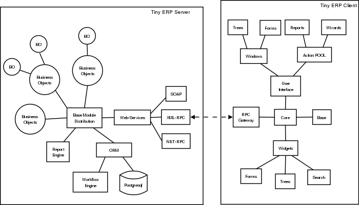

.. i18n: ===
.. i18n: API
.. i18n: ===
..

========
API 接口
========

.. i18n: Working with Web Services
.. i18n: =========================
..

使用Web服务（Working with Web Services）
=========================================

.. i18n: Given the architecture of OpenERP, it is not possible to reliably access the
.. i18n: database with the PostgreSQL client or through a direct connection method
.. i18n: such as ODBC.
.. i18n: Fortunately, OpenERP provides a very comprehensive set of web services that
.. i18n: allow you to do everything through standard protocols.
..

鉴于OpenERP的架构,它不适合直接通过PostgreSQL客户端或者 ODBC 这样的连接方法访问数据库，
幸运的是,OpenERP提供了一个非常全面的web服务集，允许你通过标准协议做任何事情。

.. i18n: .. note::
.. i18n:    Though it is technically possible, you must be aware that this can have
.. i18n:    disastrous consequences for your data, unless you know exactly what you are
.. i18n:    doing. You are advised to shut down the OpenERP server when accessing the
.. i18n:    database to avoid caching and concurrency issues.
..

.. note::

  虽然直接访问数据库，在技术上是可行的,你必须意识到这可能对您的数据造成灾难性的后果,除非你知道你是在做
  什么。当你直接访问数据库的时候，建议您关闭OpenERP服务器，以避免缓存和并发问题。

.. i18n: Supported Web Services Protocols
.. i18n: --------------------------------
.. i18n: The currently supported protocols are XML-RPC and Net-RPC. XML-RPC is one of the
.. i18n: first standard for web services, and can be used in almost any language.
.. i18n: It is a pretty verbose protocol, which may sometimes introduce a bit of latency.
.. i18n: Net-RPC, on the other hand, is an optimized protocol particularly designed for
.. i18n: use between applications written in Python.
..

支持的网络服务协议（Supported Web Services Protocols）
-------------------------------------------------------
目前支持的协议是XML-RPC和Net-RPC。XML-RPC是用于Web服务的第一批标准之一，
几乎可以再任何语言中使用。这是一个非常详细的协议，而且在需要的时候可以引入潜在位。
另一方面，Net-RPC是一个优化的协议，特别用在Python编写的应用程序之间。.

.. i18n: Support for REST-style webservices is planned for future releases of OpenERP.
..

对于REST风格的web服务的支持在将来的OpenErp发布包中支持。

.. i18n: Support for the SOAP protocol is deprecated at the moment, but could maybe be
.. i18n: revived if sufficient interest is found in the community.
..

对于SOAP协议，目前的OPenErp已经不再支持，但是如果在社区有足够的爱好者的话将来可能恢复。

.. i18n: Available Web Services
.. i18n: ----------------------
.. i18n: The OpenERP server provides you with the following web services.
..

可用的Web服务（Available Web Services）
----------------------------------------
OpenERP 为你提供了以下的Web服务.

.. i18n: .. note::
.. i18n:     You may find out the details of each service in the corresponding class
.. i18n:     in the server sources, in bin/service/web_services.py .
..

.. note::
    你能在服务的源码（/bin/service/web_services.py）的对应类里面找到每种服务的细节 .

.. i18n: :db:
.. i18n:     Provides functions to create, drop, backup and restore databases.
.. i18n:     Use with caution!
..

:db:
    提供函数创建、删除、备份、恢复数据库.
    请谨慎使用!

.. i18n: :common:
.. i18n:     Lets you log in and out of OpenERP, and provides various utility functions. You
.. i18n:     will need to call the function "login" before you can use most of the other
.. i18n:     web services.
..

:common:
    让你登录和退出 OpenERP, 并且提供各种实用功能。你只有登录后才能使用其他的网络服务.

.. i18n: :object:
.. i18n:     The most useful web service, as it provides access to the OpenERP Objects.
.. i18n:     Most notably, the function "execute" lets you call methods of the Objects, such
.. i18n:     as moste of the ORM methods to search, read and write records. It can also be
.. i18n:     used to call any other method of the object, such as computing a price for
.. i18n:     example.
..

:object:
    这是最有用的网络服务，因为通过它可以访问 OpenERP 对象.
    值得注意的是, 函数 "execute" 让你调用对象的方法，
    比如可以搜索的大部分的ORM方法，读写记录。它也可以用来调用价格计算等对象的其他方法.

.. i18n: .. note::
.. i18n:     Here is a quick reminder of the main ORM methods:
.. i18n:     
.. i18n:     create({'field':'value'})
.. i18n:           * Creates a new record with the specified value
.. i18n:           * Returns: id of the new record
.. i18n:     
.. i18n:     search([('arg1','=','value1')...], offset=0, limit=1000)
.. i18n:           * arg1, arg2, .. ,argN: list of tuples specifying search criteria
.. i18n:           *	offset: optional number of records to skip
.. i18n:           * limit: optional max number of records to return
.. i18n:           * Returns: list of IDS of records matching the given criteria 
.. i18n:     
.. i18n:     read([IDS], ['field1','field2',...])
.. i18n:           * fields: optional list of field names to return (default: all fields)
.. i18n:           * Returns: the id of each record and the values of the requested field
.. i18n:       
.. i18n:     write([IDS], {'field1':'value1','field2':3})
.. i18n:           * values: dictionary of field values to update
.. i18n:           * Updates records with given ids with the given values
.. i18n:           * Returns: True
.. i18n:     
.. i18n:     unlink([IDS])
.. i18n:           * Deletes records with the given ids
.. i18n:           * Returns: True
.. i18n:           
.. i18n:     browse() can't be used through web services.
..

.. note::
    主要的 ORM 方法一览:
    
    create({'field':'value'})
          * 创建一个具有指定值的新纪录
          * Returns: 新纪录的ID
    
    search([('arg1','=','value1')...], offset=0, limit=1000)
          * arg1, arg2, .. ,argN: 指定列表的搜索条件
          *	offset: 跳过的可选的记录
          * limit: 返回的最大数量的记录
          * Returns: 匹配给定条件的记录 
    
    read([IDS], ['field1','field2',...])
          * fields: 返回的字段名字（默认全部返回） (default: all fields)
          * Returns: 每条记录的ID和请求字段的值
      
    write([IDS], {'field1':'value1','field2':3})
          * values: 更新的字段的值
          * Updates 对给定的记录按照给定的值进行更新
          * Returns: True
    
    unlink([IDS])
          * 按照给定的IDS删除记录
          * Returns: True
          
    通过 Web 服务不能使用 Browse() 函数.

.. i18n: Another useful function is "exec_workflow", which lets you make a record
.. i18n: progress through a workflow.
..

另一个有用的功能是 "exec_workflow", 它可以让你通过工作流制定记录的进展.

.. i18n: :wizard:
..

:向导:

.. i18n: Provides access to the old-style wizards. Please note that the new-style wizards
.. i18n: are based on the ORM, and as such they can be accessed though the "object" web
.. i18n: service.
..

提供对旧式的向导。新风格的向导是基于ORM的，因此他们可以通过 "object" web 服务来进行访问.

.. i18n: :report:
..

:报告:

.. i18n: Lets you generate and retrieve reports.
..

让你生成和检索报告.

.. i18n: Example : writing data through the Web Services
.. i18n: -----------------------------------------------
..

例子：通过Web服务写入数据（Example:writing data through the Web Service）
--------------------------------------------------------------------------

.. i18n: Here is an example process that you could follow to write data. You will find
.. i18n: more detailed examples for XML-RPC in various programming languages in the next
.. i18n: chapter.
..

下面是一个写数据的例子程序。在下一章你会发现关于多种编程语言 XML-RPC的更详尽的例子.

.. i18n: #.  login: call "login" in the web service "common" with the following
.. i18n:     parameters:
.. i18n: 
.. i18n:         * database
.. i18n:         * user name
.. i18n:         * password
.. i18n: 
.. i18n: #.  create a new partner: call "execute" in the web service "object" with the
.. i18n:     following parameters:
.. i18n: 
.. i18n:         * database
.. i18n:         * user id provided by "login" in step 1.
.. i18n:         * the object name : 'res.partner'
.. i18n:         * the name of the ORM method : "create"
.. i18n:         * some data to be recorded
..

#.  login: 在Web服务 "common" 中调用 "login" 函数，使用下面的参数:

        * database
        * user name
        * password

#.  创建一个新的合作者: 在Web服务 "object" 中调用 "execute" 函数，使用下面的参数:

        * database
        * user id provided by "login" in step 1.
        * the object name : 'res.partner'
        * the name of the ORM method : "create"
        * some data to be recorded

.. i18n: The data mentioned above is a dictionary of keys and values, for example:
..

上面提到的数据都是键值对, 比如:

.. i18n:     * name: Fabien Pinckaers
.. i18n:     * lang: fr_FR
..

    * name: Fabien Pinckaers
    * lang: fr_FR

.. i18n: But more complex data structures can also be sent - for example you could record
.. i18n: a partner and their addresses, all in a single call to the web service.
.. i18n: In that case, all the data is processed by the server during the same
.. i18n: database transaction - meaning you are sure to keep a consistent state for
.. i18n: your data - a critical requirement for all ERP applications.
..

但是更复杂的数据结构也可以发送。比如你可以在一个单一的Web服务调用中创建一个合作者
和他的地址。在那种情况下，所有的数据在服务的相同的数据库事务中来处理。这意味.
着你一定要保存好你的数据一致性的状态。这是对所有ERP应用的关键要求.

.. i18n: XML-RPC Web services
.. i18n: ====================
..

XML-RPC Web服务(XML-RPC Web Services)
=====================================

.. i18n: XML-RPC is known as a web service. Web services are a set of tools that let one build distributed applications on top of existing web infrastructures. These applications use the Web as a kind of "transport layer" but don't offer a direct human interface via the browser.[1] Extensible Markup Language (XML) provides a vocabulary for describing Remote Procedure Calls (RPC), which is then transmitted between computers using the HyperText Transfer Protocol (HTTP). Effectively, RPC gives developers a mechanism for defining interfaces that can be called over a network. These interfaces can be as simple as a single function call or as complex as a large API.
..

XML-RPC 是一个著名的Web服务. Web 服务是一个工具，它可以再现有的网络基础设施上面设置分布式的应用程序。这些应用程序使用一种传输层的网络但是并不提供直接通过浏览器的人机界面。可扩展标记语言(XML)提供了描述远程过程调用(RPC)的词汇表，RPC是使用超文本传输协议（HTTP）	在计算机之间传输。实际上，RPC让各开发者自行定义网络调用中的接口。这些接口可以是很简单的一个函数调用也可以像大型API那样复杂.

.. i18n: XML-RPC therefore allows two or more computers running different operating systems and programs written in different languages to share processing. For example, a Java application could talk with a Perl program, which in turn talks with Python application that talks with ASP, and so on. System integrators often build custom connections between different systems, creating their own formats and protocols to make communications possible, but one can often end up with a large number of poorly documented single-use protocols. The RPC approach spares programmers the trouble of having to learn about underlying protocols, networking, and various implementation details.
..

XML-RPC 允许在两台或者更多运行不同操作系统和不同语言程序的计算机之间协同处理。比如，一个JAVA应用可以和一个Perl应用会谈，一个Perl应用可以同一个同ASP会谈的PYTHON应用会谈，等等。系统集成商往往在不同系统之间建立自己的连接，创建它们自己定义的格式的协议来进行通信，但是这造成了大量的不常使用的协议。RPC方法的程序员无需了解底层的协议、网络以及各种实施细则.

.. i18n: XML-RPC can be used with Python, Java, Perl, PHP, C, C++, Ruby, Microsoft’s .NET and many other programming languages. Implementations are widely available for platforms such as Unix, Linux, Windows and the Macintosh.
..

XML-RPC 可以同 Python, Java, Perl, PHP, C, C++, Ruby, Microsoft’s .NET 以及许多其他的编程语言来一起使用。它的实现被广泛用于 Unix, Linux, Windows 和 Macintosh 的平台.

.. i18n: An XML-RPC call is conducted between two parties: the client (the calling process) and the server (the called process). A server is made available at a particular URL (such as http://example.org:8080/rpcserv/).
..

一个 XML-RPC 调用实在双方之间进行的，客户端(调用程序)和服务器(被调用过程)。服务时提供在一个特定的URL上的，比如 (such as http://example.org:8080/rpcserv/).

.. i18n: The above text just touches the surface of XML-RPC. I recommend O'Reilly's "Programming Web Service with XML-RPC" for further reading. One may also wish to review the following links:
..

上面我们只是接触了 XML-RPC 的表面. 我推荐 O'Reilly's "Programming Web Service with XML-RPC" 进行进一步的学习。还可以阅读以下几个环节:

.. i18n: Interfaces
.. i18n: ----------
..

接口（InterFaces）
-------------------

.. i18n: XML-RPC
.. i18n: +++++++
..

XML-RPC
+++++++

.. i18n: XML-RPC Architecture
.. i18n: """"""""""""""""""""
..

XML-RPC 架构
""""""""""""""""""""

.. i18n: OpenERP is a based on a client/server architecture. The server and the client(s) communicate using the XML-RPC protocol. XML-RPC is a very simple protocol which allows the client to do remote procedure calls. The called function, its arguments, and the result of the call are transported using HTTP and encoded using XML. For more information on XML-RPC, please see: http://www.xml-rpc.com.
..

OpenERP 基于C/S体系结构。服务器和客户端之间的通信使用XML-RPC协议。XML-RPC是一个非常简单的协议，它允许客户端进行远程过程调用。被调用的函数，它的参数，调用结果通过XML编码并且使用HTTP进行传输。欲了解更多的关于XML-RPC的详尽信息，请参阅: http://www.xml-rpc.com.

.. i18n: Architecture
.. i18n: """"""""""""
..

架构(Architecture)
""""""""""""""""""

.. i18n: The diagram below synthesizes the client server architecture of OpenERP. OpenERP server and OpenERP clients communicate using XML-RPC.
..

下面的图标综合了OpenERP的客户端和服务器结构。OpenERP的服务器和客户端通信使用 XML-RPC.

.. i18n: .. figure:: images/tech_arch.png
.. i18n:   :scale: 85
.. i18n:   :align: center
..

.. i18n: **Client**
..

**客户端**

.. i18n: The logic of OpenERP is configured on the server side. The client is very simple; it is only used to post data (forms, lists, trees) and to send back the result to the server. The updates and the addition of new functionality don't need the clients to be frequently upgraded. This makes OpenERP easier to maintain.
..

OpenERP 的逻辑是在服务器端配置的。客户端是很简单的，它是仅用于POST的数据(forms, lists, trees)并且把结果发回服务器。新功能的更新和加入并不需要客户端的升级，这使得OpenERP更容易维护.

.. i18n: The client doesn't understand what it posts. Even actions like 'Click on the print icon' are sent to the server to ask how to react.
..

客户端并不明白POST的内容。即使像点击打印图标的行动时发送到服务器并且询问如何作出反应.

.. i18n: The client operation is very simple; when a user makes an action (save a form, open a menu, print, ...) it sends this action to the server. The server then sends the new action to execute to the client.
..

客户端的操作时很简单的，当客户发出一个动作（保存一个表格、打开一个目录、打印…）它发送动作到服务器。然后服务器执行客户端的请求并将结果发送回来.

.. i18n: There are three types of action;
..

下面是三种行为;

.. i18n:     * Open a window (form or tree)
.. i18n:     * Print a document
.. i18n:     * Execute a wizard
..

    * Open a window (form or tree)
    * Print a document
    * Execute a wizard

.. i18n: Python
.. i18n: ++++++
..

Python
++++++

.. i18n: Access tiny-server using xml-rpc
.. i18n: """"""""""""""""""""""""""""""""
..

通过 xml-rpc 获取数据
""""""""""""""""""""""""""""""""

.. i18n: Demo script
.. i18n: ~~~~~~~~~~~
..

代码示例
~~~~~~~~~~~

.. i18n:     * **Create a partner and their address**
..

    * **创建一个合伙人和他的地址**

.. i18n:   ::
.. i18n: 
.. i18n:     import xmlrpclib
.. i18n: 
.. i18n:     username = 'admin' #the user
.. i18n:     pwd = 'admin'      #the password of the user
.. i18n:     dbname = 'terp'    #the database
.. i18n: 
.. i18n:     # Get the uid
.. i18n:     sock_common = xmlrpclib.ServerProxy ('http://localhost:8069/xmlrpc/common')
.. i18n:     uid = sock_common.login(dbname, username, pwd)
.. i18n: 
.. i18n:     #replace localhost with the address of the server
.. i18n:     sock = xmlrpclib.ServerProxy('http://localhost:8069/xmlrpc/object')
.. i18n: 
.. i18n:     partner = {
.. i18n:        'name': 'Fabien Pinckaers',
.. i18n:        'lang': 'fr_FR',
.. i18n:     }
.. i18n: 
.. i18n:     partner_id = sock.execute(dbname, uid, pwd, 'res.partner', 'create', partner)
.. i18n: 
.. i18n:     address = {
.. i18n:        'partner_id': partner_id,
.. i18n:        'type' : 'default',
.. i18n:        'street': 'Chaussée de Namur 40',
.. i18n:        'zip': '1367',
.. i18n:        'city': 'Grand-Rosière',
.. i18n:        'phone': '+3281813700',
.. i18n:        'fax': '+3281733501',
.. i18n:     }
.. i18n: 
.. i18n:     address_id = sock.execute(dbname, uid, pwd, 'res.partner.address', 'create', address)
..

  ::

    import xmlrpclib

    username = 'admin' # OpenERP 登陆用户
    pwd = 'admin'      # 登陆密码
    dbname = 'terp'    # OpenERP 帐套

    # Get the uid
    sock_common = xmlrpclib.ServerProxy ('http://localhost:8069/xmlrpc/common')
    uid = sock_common.login(dbname, username, pwd)

    #replace localhost with the address of the server
    sock = xmlrpclib.ServerProxy('http://localhost:8069/xmlrpc/object')

    partner = {
       'name': 'Fabien Pinckaers',
       'lang': 'fr_FR',
    }

    partner_id = sock.execute(dbname, uid, pwd, 'res.partner', 'create', partner)

    address = {
       'partner_id': partner_id,
       'type' : 'default',
       'street': 'Chaussée de Namur 40',
       'zip': '1367',
       'city': 'Grand-Rosière',
       'phone': '+3281813700',
       'fax': '+3281733501',
    }

    address_id = sock.execute(dbname, uid, pwd, 'res.partner.address', 'create', address)

.. i18n: * **Search a partner**
.. i18n:   ::
.. i18n: 
.. i18n:     args = [('vat', '=', 'ZZZZZZ')] #query clause
.. i18n:     ids = sock.execute(dbname, uid, pwd, 'res.partner', 'search', args)
.. i18n: 
.. i18n: * **Read partner data**
.. i18n:   ::
.. i18n: 
.. i18n:     fields = ['name', 'active', 'vat', 'ref'] #fields to read
.. i18n:     data = sock.execute(dbname, uid, pwd, 'res.partner', 'read', ids, fields) #ids is a list of id
.. i18n: 
.. i18n: * **Update partner data**
.. i18n:   ::
.. i18n: 
.. i18n:     values = {'vat': 'ZZ1ZZZ'} #data to update
.. i18n:     result = sock.execute(dbname, uid, pwd, 'res.partner', 'write', ids, values)
.. i18n: 
.. i18n: * **Delete partner**
.. i18n:   ::
.. i18n: 
.. i18n:     # ids : list of id
.. i18n:     result = sock.execute(dbname, uid, pwd, 'res.partner', 'unlink', ids)
..

* **查询业务伙伴**
  ::

    args = [('vat', '=', 'ZZZZZZ')] # 查询过滤条件
    ids = sock.execute(dbname, uid, pwd, 'res.partner', 'search', args)

* **读取业务伙伴数据**
  ::

    fields = ['name', 'active', 'vat', 'ref'] # 需要读取的数据字段
    data = sock.execute(dbname, uid, pwd, 'res.partner', 'read', ids, fields) #ids is a list of id

* **更新业务伙伴数据**
  ::

    values = {'vat': 'ZZ1ZZZ'} # 待更新数据Dictionary
    result = sock.execute(dbname, uid, pwd, 'res.partner', 'write', ids, values)

* **删除业务伙伴**
  ::

    # ids : 待删除业务伙伴id列表
    result = sock.execute(dbname, uid, pwd, 'res.partner', 'unlink', ids)

.. i18n: PHP
.. i18n: +++
..

PHP
+++

.. i18n: Access Open-server using xml-rpc
.. i18n: """"""""""""""""""""""""""""""""
..

通过 xml-rpc 获取数据
""""""""""""""""""""""""""""""""

.. i18n: **Download the XML-RPC framework for PHP**
..

**下载 XML-RPC PHP Library**

.. i18n: windows / linux: download the xml-rpc framework for php from http://phpxmlrpc.sourceforge.net/ The latest stable release is version 2.2 released on February 25, 2007
..

windows / linux: download the xml-rpc framework for php from http://phpxmlrpc.sourceforge.net/ The latest stable release is version 2.2 released on February 25, 2007

.. i18n: **Setup the XML-RPC for PHP**
..

**配置 PHP XML-RPC Library**

.. i18n: extract file xmlrpc-2.2.tar.gz and take the file xmlrpc.inc from lib directory place the xmlrpc.inc in the php library folder restart the apache/iis server
..

extract file xmlrpc-2.2.tar.gz and take the file xmlrpc.inc from lib directory place the xmlrpc.inc in the php library folder restart the apache/iis server

.. i18n: **Demo script**
..

**代码示例**

.. i18n: * **Login**
..

* **登陆OpenERP**

.. i18n: .. code-block:: php
.. i18n: 
.. i18n:     function connect() {
.. i18n:        var $user = 'admin';
.. i18n:        var $password = 'admin';
.. i18n:        var $dbname = 'db_name';
.. i18n:        var $server_url = 'http://localhost:8069/xmlrpc/';
.. i18n: 
.. i18n:        if(isset($_COOKIE["user_id"]) == true)  {
.. i18n:            if($_COOKIE["user_id"]>0) {
.. i18n:            return $_COOKIE["user_id"];
.. i18n:            }
.. i18n:        }
.. i18n: 
.. i18n:        $sock = new xmlrpc_client($server_url.'common');
.. i18n:        $msg = new xmlrpcmsg('login');
.. i18n:        $msg->addParam(new xmlrpcval($dbname, "string"));
.. i18n:        $msg->addParam(new xmlrpcval($user, "string"));
.. i18n:        $msg->addParam(new xmlrpcval($password, "string"));
.. i18n:        $resp =  $sock->send($msg);
.. i18n:        $val = $resp->value();
.. i18n:        $id = $val->scalarval();
.. i18n:        setcookie("user_id",$id,time()+3600);
.. i18n:        if($id > 0) {
.. i18n:            return $id;
.. i18n:        }else{
.. i18n:            return -1;
.. i18n:        }
.. i18n:      }
..

.. code-block:: php

    function connect() {
       var $user = 'admin';
       var $password = 'admin';
       var $dbname = 'db_name';
       var $server_url = 'http://localhost:8069/xmlrpc/';

       if(isset($_COOKIE["user_id"]) == true)  {
           if($_COOKIE["user_id"]>0) {
           return $_COOKIE["user_id"];
           }
       }

       $sock = new xmlrpc_client($server_url.'common');
       $msg = new xmlrpcmsg('login');
       $msg->addParam(new xmlrpcval($dbname, "string"));
       $msg->addParam(new xmlrpcval($user, "string"));
       $msg->addParam(new xmlrpcval($password, "string"));
       $resp =  $sock->send($msg);
       $val = $resp->value();
       $id = $val->scalarval();
       setcookie("user_id",$id,time()+3600);
       if($id > 0) {
           return $id;
       }else{
           return -1;
       }
     }

.. i18n: * **Search**
..

* **查询业务伙伴**

.. i18n: .. code-block:: php
.. i18n: 
.. i18n:     /**
.. i18n:      * $client = xml-rpc handler
.. i18n:      * $relation = name of the relation ex: res.partner
.. i18n:      * $attribute = name of the attribute ex:code
.. i18n:      * $operator = search term operator ex: ilike, =, !=
.. i18n:      * $key=search for
.. i18n:      */
.. i18n: 
.. i18n:     function search($client,$relation,$attribute,$operator,$keys) {
.. i18n:          var $user = 'admin';
.. i18n:          var $password = 'admin';
.. i18n:          var $userId = -1;
.. i18n:          var $dbname = 'db_name';
.. i18n:          var $server_url = 'http://localhost:8069/xmlrpc/';
.. i18n: 
.. i18n:          $key = array(new xmlrpcval(array(new xmlrpcval($attribute , "string"),
.. i18n:                   new xmlrpcval($operator,"string"),
.. i18n:                   new xmlrpcval($keys,"string")),"array"),
.. i18n:             );
.. i18n: 
.. i18n:          if($userId<=0) {
.. i18n:          connect();
.. i18n:          }
.. i18n: 
.. i18n:          $msg = new xmlrpcmsg('execute');
.. i18n:          $msg->addParam(new xmlrpcval($dbname, "string"));
.. i18n:          $msg->addParam(new xmlrpcval($userId, "int"));
.. i18n:          $msg->addParam(new xmlrpcval($password, "string"));
.. i18n:          $msg->addParam(new xmlrpcval($relation, "string"));
.. i18n:          $msg->addParam(new xmlrpcval("search", "string"));
.. i18n:          $msg->addParam(new xmlrpcval($key, "array"));
.. i18n: 
.. i18n:          $resp = $client->send($msg);
.. i18n:          $val = $resp->value();
.. i18n:          $ids = $val->scalarval();
.. i18n: 
.. i18n:          return $ids;
.. i18n:     }
..

.. code-block:: php

    /**
     * $client = xml-rpc handler
     * $relation = name of the relation ex: res.partner
     * $attribute = name of the attribute ex:code
     * $operator = search term operator ex: ilike, =, !=
     * $key=search for
     */

    function search($client,$relation,$attribute,$operator,$keys) {
         var $user = 'admin';
         var $password = 'admin';
         var $userId = -1;
         var $dbname = 'db_name';
         var $server_url = 'http://localhost:8069/xmlrpc/';

         $key = array(new xmlrpcval(array(new xmlrpcval($attribute , "string"),
                  new xmlrpcval($operator,"string"),
                  new xmlrpcval($keys,"string")),"array"),
            );

         if($userId<=0) {
         connect();
         }

         $msg = new xmlrpcmsg('execute');
         $msg->addParam(new xmlrpcval($dbname, "string"));
         $msg->addParam(new xmlrpcval($userId, "int"));
         $msg->addParam(new xmlrpcval($password, "string"));
         $msg->addParam(new xmlrpcval($relation, "string"));
         $msg->addParam(new xmlrpcval("search", "string"));
         $msg->addParam(new xmlrpcval($key, "array"));

         $resp = $client->send($msg);
         $val = $resp->value();
         $ids = $val->scalarval();

         return $ids;
    }

.. i18n: * **Create**
..

* **创建业务伙伴**

.. i18n: .. code-block:: php
.. i18n: 
.. i18n:         <?
.. i18n: 
.. i18n:         include('xmlrpc.inc');
.. i18n: 
.. i18n:         $arrayVal = array(
.. i18n:         'name'=>new xmlrpcval('Fabien Pinckaers', "string") ,
.. i18n:         'vat'=>new xmlrpcval('BE477472701' , "string")
.. i18n:         );
.. i18n: 
.. i18n:         $client = new xmlrpc_client("http://localhost:8069/xmlrpc/object");
.. i18n: 
.. i18n:         $msg = new xmlrpcmsg('execute');
.. i18n:         $msg->addParam(new xmlrpcval("dbname", "string"));
.. i18n:         $msg->addParam(new xmlrpcval("3", "int"));
.. i18n:         $msg->addParam(new xmlrpcval("demo", "string"));
.. i18n:         $msg->addParam(new xmlrpcval("res.partner", "string"));
.. i18n:         $msg->addParam(new xmlrpcval("create", "string"));
.. i18n:         $msg->addParam(new xmlrpcval($arrayVal, "struct"));
.. i18n: 
.. i18n:         $resp = $client->send($msg);
.. i18n: 
.. i18n:         if ($resp->faultCode())
.. i18n: 
.. i18n:             echo 'Error: '.$resp->faultString();
.. i18n: 
.. i18n:         else
.. i18n: 
.. i18n:             echo 'Partner '.$resp->value()->scalarval().' created !';
.. i18n: 
.. i18n:         ?>
..

.. code-block:: php

        <?

        include('xmlrpc.inc');

        $arrayVal = array(
        'name'=>new xmlrpcval('Fabien Pinckaers', "string") ,
        'vat'=>new xmlrpcval('BE477472701' , "string")
        );

        $client = new xmlrpc_client("http://localhost:8069/xmlrpc/object");

        $msg = new xmlrpcmsg('execute');
        $msg->addParam(new xmlrpcval("dbname", "string"));
        $msg->addParam(new xmlrpcval("3", "int"));
        $msg->addParam(new xmlrpcval("demo", "string"));
        $msg->addParam(new xmlrpcval("res.partner", "string"));
        $msg->addParam(new xmlrpcval("create", "string"));
        $msg->addParam(new xmlrpcval($arrayVal, "struct"));

        $resp = $client->send($msg);

        if ($resp->faultCode())

            echo 'Error: '.$resp->faultString();

        else

            echo 'Partner '.$resp->value()->scalarval().' created !';

        ?>

.. i18n: * **Write**
..

* **更新业务伙伴数据**

.. i18n: .. code-block:: php
.. i18n: 
.. i18n:     /**
.. i18n:      * $client = xml-rpc handler
.. i18n:      * $relation = name of the relation ex: res.partner
.. i18n:      * $attribute = name of the attribute ex:code
.. i18n:      * $operator = search term operator ex: ilike, =, !=
.. i18n:      * $id = id of the record to be updated
.. i18n:      * $data = data to be updated
.. i18n:      */
.. i18n: 
.. i18n:     function write($client,$relation,$attribute,$operator,$data,$id) {
.. i18n:          var $user = 'admin';
.. i18n:          var $password = 'admin';
.. i18n:          var $userId = -1;
.. i18n:          var $dbname = 'db_name';
.. i18n:          var $server_url = 'http://localhost:8069/xmlrpc/';
.. i18n: 
.. i18n:          $id_val = array();
.. i18n: 	 $id_val[0] = new xmlrpcval($id, "int");
.. i18n: 
.. i18n:          if($userId<=0) {
.. i18n:          connect();
.. i18n:          }
.. i18n: 
.. i18n:          $msg = new xmlrpcmsg('execute');
.. i18n:          $msg->addParam(new xmlrpcval($dbname, "string"));
.. i18n:          $msg->addParam(new xmlrpcval($userId, "int"));
.. i18n:          $msg->addParam(new xmlrpcval($password, "string"));
.. i18n:          $msg->addParam(new xmlrpcval($relation, "string"));
.. i18n:          $msg->addParam(new xmlrpcval("write", "string"));
.. i18n:          $msg->addParam(new xmlrpcval($id, "array"));
.. i18n:          $msg->addParam(new xmlrpcval($data, "struct"));
.. i18n: 
.. i18n:          $resp = $client->send($msg);
.. i18n:          $val = $resp->value();
.. i18n:          $record = $val->scalarval();
.. i18n: 
.. i18n:          return $record;
.. i18n: 
.. i18n:     }
..

.. code-block:: php

    /**
     * $client = xml-rpc handler
     * $relation = name of the relation ex: res.partner
     * $attribute = name of the attribute ex:code
     * $operator = search term operator ex: ilike, =, !=
     * $id = id of the record to be updated
     * $data = data to be updated
     */

    function write($client,$relation,$attribute,$operator,$data,$id) {
         var $user = 'admin';
         var $password = 'admin';
         var $userId = -1;
         var $dbname = 'db_name';
         var $server_url = 'http://localhost:8069/xmlrpc/';

         $id_val = array();
	 $id_val[0] = new xmlrpcval($id, "int");

         if($userId<=0) {
         connect();
         }

         $msg = new xmlrpcmsg('execute');
         $msg->addParam(new xmlrpcval($dbname, "string"));
         $msg->addParam(new xmlrpcval($userId, "int"));
         $msg->addParam(new xmlrpcval($password, "string"));
         $msg->addParam(new xmlrpcval($relation, "string"));
         $msg->addParam(new xmlrpcval("write", "string"));
         $msg->addParam(new xmlrpcval($id, "array"));
         $msg->addParam(new xmlrpcval($data, "struct"));

         $resp = $client->send($msg);
         $val = $resp->value();
         $record = $val->scalarval();

         return $record;

    }

.. i18n: JAVA
.. i18n: ++++
..

JAVA
++++

.. i18n: Access Open-server using xml-rpc
.. i18n: """"""""""""""""""""""""""""""""
..

通过 xml-rpc 获取数据
""""""""""""""""""""""""""""""""

.. i18n: **Download the apache XML-RPC framework for JAVA**
..

**下载 JAVA XML-RPC Library**

.. i18n: Download the xml-rpc framework for java from http://ws.apache.org/xmlrpc/ The latest stable release is version 3.1 released on August 12, 2007.
.. i18n: All OpenERP errors throw exceptions because the framework allows only an int as the error code where OpenERP returns a string.
..

Download the xml-rpc framework for java from http://ws.apache.org/xmlrpc/ The latest stable release is version 3.1 released on August 12, 2007.
All OpenERP errors throw exceptions because the framework allows only an int as the error code where OpenERP returns a string.

.. i18n: **Demo script**
..

**代码示例**

.. i18n: * **Find Databases**
..

* **获取OpenERP帐套列表**

.. i18n: .. code-block:: java
.. i18n: 
.. i18n:     import java.net.URL;
.. i18n:     import java.util.Vector;
.. i18n: 
.. i18n:     import org.apache.commons.lang.StringUtils;
.. i18n:     import org.apache.xmlrpc.XmlRpcException;
.. i18n:     import org.apache.xmlrpc.client.XmlRpcClient;
.. i18n:     import org.apache.xmlrpc.client.XmlRpcClientConfigImpl;
.. i18n: 
.. i18n:     public Vector<String> getDatabaseList(String host, int port)
.. i18n:     {
.. i18n:       XmlRpcClient xmlrpcDb = new XmlRpcClient();
.. i18n: 
.. i18n:       XmlRpcClientConfigImpl xmlrpcConfigDb = new XmlRpcClientConfigImpl();
.. i18n:       xmlrpcConfigDb.setEnabledForExtensions(true);
.. i18n:       xmlrpcConfigDb.setServerURL(new URL("http",host,port,"/xmlrpc/db"));
.. i18n: 
.. i18n:       xmlrpcDb.setConfig(xmlrpcConfigDb);
.. i18n: 
.. i18n:       try {
.. i18n:         //Retrieve databases
.. i18n:         Vector<Object> params = new Vector<Object>();
.. i18n:         Object result = xmlrpcDb.execute("list", params);
.. i18n:         Object[] a = (Object[]) result;
.. i18n: 
.. i18n:         Vector<String> res = new Vector<String>();
.. i18n:         for (int i = 0; i < a.length; i++) {
.. i18n:         if (a[i] instanceof String)
.. i18n:         {
.. i18n:           res.addElement((String)a[i]);
.. i18n:         }
.. i18n:       }
.. i18n:       catch (XmlRpcException e) {
.. i18n:         logger.warn("XmlException Error while retrieving OpenERP Databases: ",e);
.. i18n:         return -2;
.. i18n:       }
.. i18n:       catch (Exception e)
.. i18n:       {
.. i18n:         logger.warn("Error while retrieving OpenERP Databases: ",e);
.. i18n:         return -3;
.. i18n:       }
.. i18n:     }
..

.. code-block:: java

    import java.net.URL;
    import java.util.Vector;

    import org.apache.commons.lang.StringUtils;
    import org.apache.xmlrpc.XmlRpcException;
    import org.apache.xmlrpc.client.XmlRpcClient;
    import org.apache.xmlrpc.client.XmlRpcClientConfigImpl;

    public Vector<String> getDatabaseList(String host, int port)
    {
      XmlRpcClient xmlrpcDb = new XmlRpcClient();

      XmlRpcClientConfigImpl xmlrpcConfigDb = new XmlRpcClientConfigImpl();
      xmlrpcConfigDb.setEnabledForExtensions(true);
      xmlrpcConfigDb.setServerURL(new URL("http",host,port,"/xmlrpc/db"));

      xmlrpcDb.setConfig(xmlrpcConfigDb);

      try {
        //Retrieve databases
        Vector<Object> params = new Vector<Object>();
        Object result = xmlrpcDb.execute("list", params);
        Object[] a = (Object[]) result;

        Vector<String> res = new Vector<String>();
        for (int i = 0; i < a.length; i++) {
        if (a[i] instanceof String)
        {
          res.addElement((String)a[i]);
        }
      }
      catch (XmlRpcException e) {
        logger.warn("XmlException Error while retrieving OpenERP Databases: ",e);
        return -2;
      }
      catch (Exception e)
      {
        logger.warn("Error while retrieving OpenERP Databases: ",e);
        return -3;
      }
    }

.. i18n: * **Login**
..

* **登陆**

.. i18n: .. code-block:: java
.. i18n: 
.. i18n:     import java.net.URL;
.. i18n: 
.. i18n:     import org.apache.commons.lang.StringUtils;
.. i18n:     import org.apache.xmlrpc.XmlRpcException;
.. i18n:     import org.apache.xmlrpc.client.XmlRpcClient;
.. i18n:     import org.apache.xmlrpc.client.XmlRpcClientConfigImpl;
.. i18n: 
.. i18n:     public int Connect(String host, int port, String tinydb, String login, String password)
.. i18n:     {
.. i18n:       XmlRpcClient xmlrpcLogin = new XmlRpcClient();
.. i18n: 
.. i18n:       XmlRpcClientConfigImpl xmlrpcConfigLogin = new XmlRpcClientConfigImpl();
.. i18n:       xmlrpcConfigLogin.setEnabledForExtensions(true);
.. i18n:       xmlrpcConfigLogin.setServerURL(new URL("http",host,port,"/xmlrpc/common"));
.. i18n: 
.. i18n:       xmlrpcLogin.setConfig(xmlrpcConfigLogin);
.. i18n: 
.. i18n:       try {
.. i18n:         //Connect
.. i18n:         params = new Object[] {tinydb,login,password};
.. i18n:         Object id = xmlrpcLogin.execute("login", params);
.. i18n:         if (id instanceof Integer)
.. i18n:           return (Integer)id;
.. i18n:         return -1;
.. i18n:       }
.. i18n:       catch (XmlRpcException e) {
.. i18n:         logger.warn("XmlException Error while logging to OpenERP: ",e);
.. i18n:         return -2;
.. i18n:       }
.. i18n:       catch (Exception e)
.. i18n:       {
.. i18n:         logger.warn("Error while logging to OpenERP: ",e);
.. i18n:         return -3;
.. i18n:       }
.. i18n:     }
..

.. code-block:: java

    import java.net.URL;

    import org.apache.commons.lang.StringUtils;
    import org.apache.xmlrpc.XmlRpcException;
    import org.apache.xmlrpc.client.XmlRpcClient;
    import org.apache.xmlrpc.client.XmlRpcClientConfigImpl;

    public int Connect(String host, int port, String tinydb, String login, String password)
    {
      XmlRpcClient xmlrpcLogin = new XmlRpcClient();

      XmlRpcClientConfigImpl xmlrpcConfigLogin = new XmlRpcClientConfigImpl();
      xmlrpcConfigLogin.setEnabledForExtensions(true);
      xmlrpcConfigLogin.setServerURL(new URL("http",host,port,"/xmlrpc/common"));

      xmlrpcLogin.setConfig(xmlrpcConfigLogin);

      try {
        //Connect
        params = new Object[] {tinydb,login,password};
        Object id = xmlrpcLogin.execute("login", params);
        if (id instanceof Integer)
          return (Integer)id;
        return -1;
      }
      catch (XmlRpcException e) {
        logger.warn("XmlException Error while logging to OpenERP: ",e);
        return -2;
      }
      catch (Exception e)
      {
        logger.warn("Error while logging to OpenERP: ",e);
        return -3;
      }
    }

.. i18n: * **Search**
.. i18n:   ::
.. i18n: 
.. i18n:     TODO
.. i18n: 
.. i18n: * **Create**
.. i18n:   ::
.. i18n: 
.. i18n:     TODO
.. i18n: 
.. i18n: * **Write**
.. i18n:   ::
.. i18n: 
.. i18n:     TODO
..

* **查询业务伙伴**
  ::

    TODO

* **创建业务伙伴**
  ::

    TODO

* **更新业务伙伴**
  ::

    TODO

.. i18n: Python Example
.. i18n: --------------
..

Python 代码示例
---------------

.. i18n: Example of creation of a partner and their address.
..

创建合作伙伴和他们的地址的例子.

.. i18n: .. code-block:: python
.. i18n: 
.. i18n:     import xmlrpclib
.. i18n: 
.. i18n:     sock = xmlrpclib.ServerProxy('http://localhost:8069/xmlrpc/object')
.. i18n:     uid = 1
.. i18n:     pwd = 'demo'
.. i18n: 
.. i18n:     partner = {
.. i18n:         'title': 'Monsieur',
.. i18n:         'name': 'Fabien Pinckaers',
.. i18n:         'lang': 'fr',
.. i18n:         'active': True,
.. i18n:     }
.. i18n: 
.. i18n:     partner_id = sock.execute(dbname, uid, pwd, 'res.partner', 'create', partner)
.. i18n: 
.. i18n:     address = {
.. i18n:         'partner_id': partner_id,
.. i18n:         'type': 'default',
.. i18n:         'street': 'Rue du vieux chateau, 21',
.. i18n:         'zip': '1457',
.. i18n:         'city': 'Walhain',
.. i18n:         'phone': '(+32)10.68.94.39',
.. i18n:         'fax': '(+32)10.68.94.39',
.. i18n:     }
.. i18n: 
.. i18n:     sock.execute(dbname, uid, pwd, 'res.partner.address', 'create', address)
..

.. code-block:: python

    import xmlrpclib

    sock = xmlrpclib.ServerProxy('http://localhost:8069/xmlrpc/object')
    uid = 1
    pwd = 'demo'

    partner = {
        'title': 'Monsieur',
        'name': 'Fabien Pinckaers',
        'lang': 'fr',
        'active': True,
    }

    partner_id = sock.execute(dbname, uid, pwd, 'res.partner', 'create', partner)

    address = {
        'partner_id': partner_id,
        'type': 'default',
        'street': 'Rue du vieux chateau, 21',
        'zip': '1457',
        'city': 'Walhain',
        'phone': '(+32)10.68.94.39',
        'fax': '(+32)10.68.94.39',
    }

    sock.execute(dbname, uid, pwd, 'res.partner.address', 'create', address)

.. i18n: To get the UID of a user, you can use the following script:
..

用下面的脚本来获得用户的 UID :

.. i18n: .. code-block:: python
.. i18n: 
.. i18n:     sock = xmlrpclib.ServerProxy('http://localhost:8069/xmlrpc/common')
.. i18n:      UID = sock.login('terp3', 'admin', 'admin')
..

.. code-block:: python

    sock = xmlrpclib.ServerProxy('http://localhost:8069/xmlrpc/common')
     UID = sock.login('terp3', 'admin', 'admin')

.. i18n: CRUD example:
..

CRUD(创建/读取/更新/删除)代码示例:

.. i18n: .. code-block:: python
.. i18n: 
.. i18n:     """
.. i18n:     :The login function is under
.. i18n:     ::    http://localhost:8069/xmlrpc/common
.. i18n:     :For object retrieval use:
.. i18n:     ::    http://localhost:8069/xmlrpc/object
.. i18n:     """
.. i18n:     import xmlrpclib
.. i18n: 
.. i18n:     user = 'admin'
.. i18n:     pwd = 'admin'
.. i18n:     dbname = 'terp3'
.. i18n:     model = 'res.partner'
.. i18n: 
.. i18n:     sock = xmlrpclib.ServerProxy('http://localhost:8069/xmlrpc/common')
.. i18n:     uid = sock.login(dbname ,user ,pwd)
.. i18n: 
.. i18n:     sock = xmlrpclib.ServerProxy('http://localhost:8069/xmlrpc/object')
.. i18n: 
.. i18n:     # CREATE A PARTNER
.. i18n:     partner_data = {'name'.. code-block:: php:'Tiny', 'active':True, 'vat':'ZZZZZ'}
.. i18n:     partner_id = sock.execute(dbname, uid, pwd, model, 'create', partner_data)
.. i18n: 
.. i18n:     # The relation between res.partner and res.partner.category is of type many2many
.. i18n:     # To add  categories to a partner use the following format:
.. i18n:     partner_data = {'name':'Provider2', 'category_id': [(6,0,[3, 2, 1])]}
.. i18n:     # Where [3, 2, 1] are id fields of lines in res.partner.category
.. i18n: 
.. i18n:     # SEARCH PARTNERS
.. i18n:     args = [('vat', '=', 'ZZZZZ'),]
.. i18n:     ids = sock.execute(dbname, uid, pwd, model, 'search', args)
.. i18n: 
.. i18n:     # READ PARTNER DATA
.. i18n:     fields = ['name', 'active', 'vat', 'ref']
.. i18n:     results = sock.execute(dbname, uid, pwd, model, 'read', ids, fields)
.. i18n:     print results
.. i18n: 
.. i18n:     # EDIT PARTNER DATA
.. i18n:     values = {'vat':'ZZ1ZZ'}
.. i18n:     results = sock.execute(dbname, uid, pwd, model, 'write', ids, values)
.. i18n: 
.. i18n:     # DELETE PARTNER DATA
.. i18n:     results = sock.execute(dbname, uid, pwd, model, 'unlink', ids)
..

.. code-block:: python

    """
    :The login function is under
    ::    http://localhost:8069/xmlrpc/common
    :For object retrieval use:
    ::    http://localhost:8069/xmlrpc/object
    """
    import xmlrpclib

    user = 'admin'
    pwd = 'admin'
    dbname = 'terp3'
    model = 'res.partner'

    sock = xmlrpclib.ServerProxy('http://localhost:8069/xmlrpc/common')
    uid = sock.login(dbname ,user ,pwd)

    sock = xmlrpclib.ServerProxy('http://localhost:8069/xmlrpc/object')

    # CREATE A PARTNER
    partner_data = {'name'.. code-block:: php:'Tiny', 'active':True, 'vat':'ZZZZZ'}
    partner_id = sock.execute(dbname, uid, pwd, model, 'create', partner_data)

    # The relation between res.partner and res.partner.category is of type many2many
    # To add  categories to a partner use the following format:
    partner_data = {'name':'Provider2', 'category_id': [(6,0,[3, 2, 1])]}
    # Where [3, 2, 1] are id fields of lines in res.partner.category

    # SEARCH PARTNERS
    args = [('vat', '=', 'ZZZZZ'),]
    ids = sock.execute(dbname, uid, pwd, model, 'search', args)

    # READ PARTNER DATA
    fields = ['name', 'active', 'vat', 'ref']
    results = sock.execute(dbname, uid, pwd, model, 'read', ids, fields)
    print results

    # EDIT PARTNER DATA
    values = {'vat':'ZZ1ZZ'}
    results = sock.execute(dbname, uid, pwd, model, 'write', ids, values)

    # DELETE PARTNER DATA
    results = sock.execute(dbname, uid, pwd, model, 'unlink', ids)

.. i18n: PRINT example:
..

PRINT(打印) 示例代码:

.. i18n:    1. PRINT INVOICE
.. i18n:    2. IDS is the invoice ID, as returned by:
.. i18n:    3. ids = sock.execute(dbname, uid, pwd, 'account.invoice', 'search', [('number', 'ilike', invoicenumber), ('type', '=', 'out_invoice')])
..

   1. PRINT INVOICE
   2. IDS is the invoice ID, as returned by:
   3. ids = sock.execute(dbname, uid, pwd, 'account.invoice', 'search', [('number', 'ilike', invoicenumber), ('type', '=', 'out_invoice')])

.. i18n: .. code-block:: python
.. i18n: 
.. i18n:     import time
.. i18n:     import base64
.. i18n:     printsock = xmlrpclib.ServerProxy('http://server:8069/xmlrpc/report')
.. i18n:     model = 'account.invoice'
.. i18n:     id_report = printsock.report(dbname, uid, pwd, model, ids, {'model': model, 'id': ids[0], 'report_type':'pdf'})
.. i18n:     time.sleep(5)
.. i18n:     state = False
.. i18n:     attempt = 0
.. i18n:     while not state:
.. i18n:         report = printsock.report_get(dbname, uid, pwd, id_report)
.. i18n:         state = report['state']
.. i18n:         if not state:
.. i18n:         time.sleep(1)
.. i18n:         attempt += 1
.. i18n:         if attempt>200:
.. i18n:         print 'Printing aborted, too long delay !'
.. i18n: 
.. i18n:         string_pdf = base64.decodestring(report['result'])
.. i18n:         file_pdf = open('/tmp/file.pdf','w')
.. i18n:         file_pdf.write(string_pdf)
.. i18n:         file_pdf.close()
..

.. code-block:: python

    import time
    import base64
    printsock = xmlrpclib.ServerProxy('http://server:8069/xmlrpc/report')
    model = 'account.invoice'
    id_report = printsock.report(dbname, uid, pwd, model, ids, {'model': model, 'id': ids[0], 'report_type':'pdf'})
    time.sleep(5)
    state = False
    attempt = 0
    while not state:
        report = printsock.report_get(dbname, uid, pwd, id_report)
        state = report['state']
        if not state:
        time.sleep(1)
        attempt += 1
        if attempt>200:
        print 'Printing aborted, too long delay !'

        string_pdf = base64.decodestring(report['result'])
        file_pdf = open('/tmp/file.pdf','w')
        file_pdf.write(string_pdf)
        file_pdf.close()

.. i18n: PHP Example
.. i18n: -----------
..

PHP 代码示例
------------

.. i18n: Here is an example on how to insert a new partner using PHP. This example makes use the phpxmlrpc library, available on sourceforge.
..

下面的例子是如何使用 PHP 创建一个合作伙伴. 这里使用 phpxmlrpc 库, 在 sourceforge 上有效.

.. i18n: .. code-block:: php
.. i18n: 
.. i18n:     <?
.. i18n: 
.. i18n:         include('xmlrpc.inc');
.. i18n: 
.. i18n:         $arrayVal = array(
.. i18n:         'name'=>new xmlrpcval('Fabien Pinckaers', "string") ,
.. i18n:         'vat'=>new xmlrpcval('BE477472701' , "string")
.. i18n:         );
.. i18n: 
.. i18n:         $client = new xmlrpc_client("http://localhost:8069/xmlrpc/object");
.. i18n: 
.. i18n:         $msg = new xmlrpcmsg('execute');
.. i18n:         $msg->addParam(new xmlrpcval("dbname", "string"));
.. i18n:         $msg->addParam(new xmlrpcval("3", "int"));
.. i18n:         $msg->addParam(new xmlrpcval("demo", "string"));
.. i18n:         $msg->addParam(new xmlrpcval("res.partner", "string"));
.. i18n:         $msg->addParam(new xmlrpcval("create", "string"));
.. i18n:         $msg->addParam(new xmlrpcval($arrayVal, "struct"));
.. i18n: 
.. i18n:         $resp = $client->send($msg);
.. i18n: 
.. i18n:         if ($resp->faultCode())
.. i18n: 
.. i18n:             echo 'Error: '.$resp->faultString();
.. i18n: 
.. i18n:         else
.. i18n: 
.. i18n:             echo 'Partner '.$resp->value()->scalarval().' created !';
.. i18n: 
.. i18n:         ?>
..

.. code-block:: php

    <?

        include('xmlrpc.inc');

        $arrayVal = array(
        'name'=>new xmlrpcval('Fabien Pinckaers', "string") ,
        'vat'=>new xmlrpcval('BE477472701' , "string")
        );

        $client = new xmlrpc_client("http://localhost:8069/xmlrpc/object");

        $msg = new xmlrpcmsg('execute');
        $msg->addParam(new xmlrpcval("dbname", "string"));
        $msg->addParam(new xmlrpcval("3", "int"));
        $msg->addParam(new xmlrpcval("demo", "string"));
        $msg->addParam(new xmlrpcval("res.partner", "string"));
        $msg->addParam(new xmlrpcval("create", "string"));
        $msg->addParam(new xmlrpcval($arrayVal, "struct"));

        $resp = $client->send($msg);

        if ($resp->faultCode())

            echo 'Error: '.$resp->faultString();

        else

            echo 'Partner '.$resp->value()->scalarval().' created !';

        ?>

.. i18n: Perl Example
.. i18n: ------------
.. i18n: Here is an example in Perl for creating, searching and deleting a partner.
..

Perl 代码示例
-------------
下面的例子是使用 Perl 创建、查找、删除一个合作伙伴.

.. i18n: .. code-block:: perl
.. i18n: 
.. i18n:   #!c:/perl/bin/perl
.. i18n:   # 17-02-2010
.. i18n:   # OpenERP XML RPC communication example
.. i18n:   # Todor Todorov <todorov@hp.com> <tttodorov@yahoo.com>
.. i18n: 
.. i18n:   use strict;
.. i18n:   use Frontier::Client;
.. i18n:   use Data::Dumper;
.. i18n: 
.. i18n:   my($user) = 'admin';
.. i18n:   my($pw) = 'admin';
.. i18n:   my($db) = 'put_your_dbname_here';
.. i18n:   my($model) = 'res.partner';
.. i18n: 
.. i18n:   #login
.. i18n:   my $server_url = 'http://localhost:8069/xmlrpc/common';
.. i18n:   my $server = Frontier::Client->new('url' => $server_url);
.. i18n:   my $uid = $server->call('login',$db,$user,$pw);
.. i18n: 
.. i18n:   print Dumper($uid);
.. i18n: 
.. i18n:   my $server_url = 'http://localhost:8069/xmlrpc/object';
.. i18n:   my $server = Frontier::Client->new('url' => $server_url);
.. i18n: 
.. i18n:   print Dumper($server);
.. i18n: 
.. i18n:   #
.. i18n:   # CREATE A PARTNER
.. i18n:   #
.. i18n:   my $partner_data = {'name'=>'MyNewPartnerName',
.. i18n:                     'active'=> 'True',
.. i18n:             'vat'=>'ZZZZZ'};
.. i18n:   my $partner_id = $server->call('execute',$db, $uid, $pw, $model, 'create', $partner_data);
.. i18n: 
.. i18n:   print Dumper($partner_id);
.. i18n: 
.. i18n:   #
.. i18n:   # SEARCH PARTNERS
.. i18n:   #
.. i18n:   my $query = [['vat', '=', 'ZZZZZ']];
.. i18n: 
.. i18n:   print Dumper($query);
.. i18n: 
.. i18n:   my $ids = $server->call('execute',$db, $uid, $pw, $model, 'search', $query);
.. i18n: 
.. i18n:   print Dumper($ids);
.. i18n: 
.. i18n:   #Here waiting for user input
.. i18n:   #OpenERP interface my be checked if partner is shown there
.. i18n: 
.. i18n:   print $/."Check OpenERP if partner is inserted. Press ENTER".$/;
.. i18n:   <STDIN>;
.. i18n: 
.. i18n:   #
.. i18n:   # DELETE PARTNER DATA
.. i18n:   #
.. i18n:   my $results = $server->call('execute',$db, $uid, $pw, $model, 'unlink', $ids);
.. i18n: 
.. i18n:   print Dumper($results);
..

.. code-block:: perl

  #!c:/perl/bin/perl
  # 17-02-2010
  # OpenERP XML RPC communication example
  # Todor Todorov <todorov@hp.com> <tttodorov@yahoo.com>

  use strict;
  use Frontier::Client;
  use Data::Dumper;

  my($user) = 'admin';
  my($pw) = 'admin';
  my($db) = 'put_your_dbname_here';
  my($model) = 'res.partner';

  #login
  my $server_url = 'http://localhost:8069/xmlrpc/common';
  my $server = Frontier::Client->new('url' => $server_url);
  my $uid = $server->call('login',$db,$user,$pw);

  print Dumper($uid);

  my $server_url = 'http://localhost:8069/xmlrpc/object';
  my $server = Frontier::Client->new('url' => $server_url);

  print Dumper($server);

  #
  # CREATE A PARTNER
  #
  my $partner_data = {'name'=>'MyNewPartnerName',
                    'active'=> 'True',
            'vat'=>'ZZZZZ'};
  my $partner_id = $server->call('execute',$db, $uid, $pw, $model, 'create', $partner_data);

  print Dumper($partner_id);

  #
  # SEARCH PARTNERS
  #
  my $query = [['vat', '=', 'ZZZZZ']];

  print Dumper($query);

  my $ids = $server->call('execute',$db, $uid, $pw, $model, 'search', $query);

  print Dumper($ids);

  #Here waiting for user input
  #OpenERP interface my be checked if partner is shown there

  print $/."Check OpenERP if partner is inserted. Press ENTER".$/;
  <STDIN>;

  #
  # DELETE PARTNER DATA
  #
  my $results = $server->call('execute',$db, $uid, $pw, $model, 'unlink', $ids);

  print Dumper($results);

.. i18n: Everything done in the GTK or web client in OpenERP is through XML/RPC webservices. Start openERP GTK client
.. i18n: using ./openerp-client.py -l debug_rpc (or debug_rpc_answer) then do what you want in the GTK client and watch
.. i18n: your client logs, you will find out the webservice signatures. By creating indents in the logs will help you to
.. i18n: spot which webservice you want.
..

在 OpenERP 的 GTK 或 web 客户端的一切活动都是通过 XML/RPC webservices. 启动 openERP GTK 客户端
使用 ./openerp-client.py -l debug_rpc (or debug_rpc_answer) 然后你可以在 GTK 客户端操作，查看客户端操作日志，
你将看到webservice的标签。通过在日志中创建缩进将帮助您
找出它的web服务.
