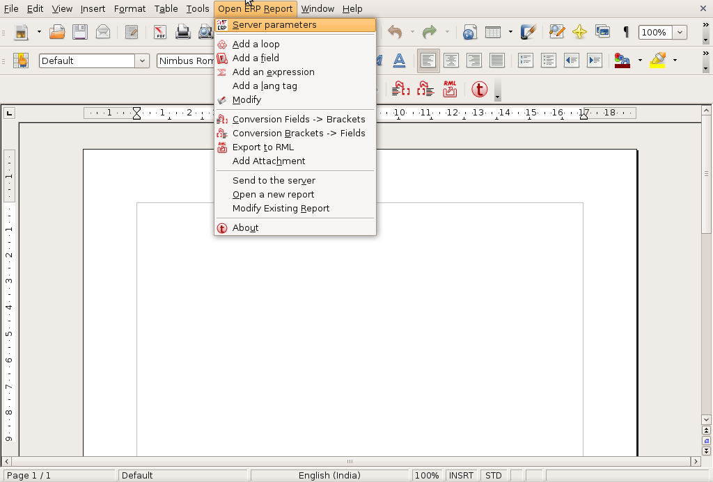
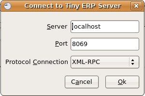
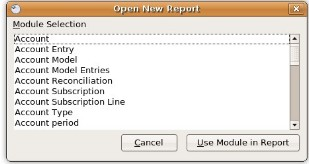
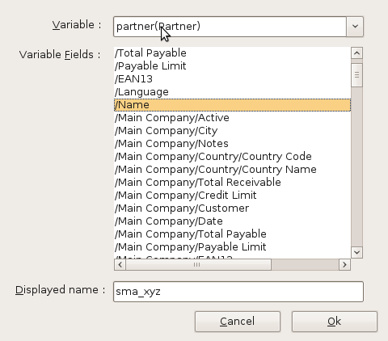
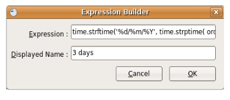
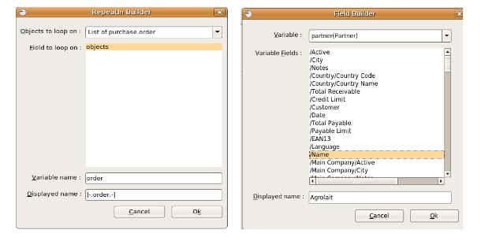
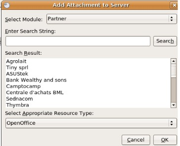
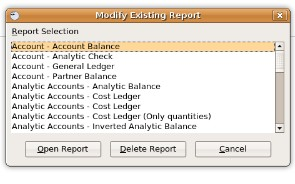
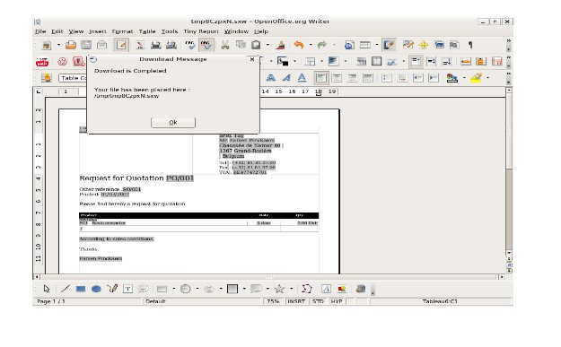

.. i18n: =========
.. i18n: RAD Tools 
.. i18n: =========
..

=========
RAD Tools 
=========

.. i18n: DIA
.. i18n: ===
.. i18n: 	
.. i18n: The uml_dia module helps to develop new modules after an UML description using the DIA tool (http://www.gnome.org/projects/dia).
..

DIA
===

**uml_dia** 模块可以帮助开发者使用 DIA 工具 (http://www.gnome.org/projects/dia) 设计UML后自动生成开发新模块.

.. i18n: It's not a typical module in the sense that you don't have to install it on the server as another module. The contents of the module are just a python script for dia (codegen_openerp.py), a test dia diagram and the module generated by the test.
..

这并不是一个需要安装到服务器上的非标准模块, 整个模块仅仅是一个 Dia 的Python脚本(codegen_openerp.py), 以及一个用于生成模块的测试用的 dia 文档.

.. i18n: The module is located in the extra_addons branch: https://code.launchpad.net/openobject-addons
..

模块在 extra_addons 项目的分支中: https://code.launchpad.net/openobject-addons

.. i18n: To use the module you need to make **codegen_openerp.py** accessible from dia, usually in your **/usr/share/dia/python** directory and make sure that it gets loaded once. To do it, just open dia and open a **Python Console** from the **Dialog Menu**, and type there "import codegen_openerp". If everything goes alright you will have a new option in your "Export..." dialog named "PyDia Code Generation (OpenERP)" that will create a zip module from your UML diagram.
..

要在Dia中使用 **codegen_openerp** 模块, 通常在 **/usr/share/dia/python** 路径下载入一次即可, 只需要打开 Dia 并且从 **Dialog Menu**
菜单下打开 **Python Console**, 在Python 交互窗口中输入 "import codegen_openerp". 如果不出意外的话,你就可以在 "PyDia Code Generation (OpenERP)"
对话框中 选择 "Export..." 来导出并创建一个由UML设计自动生成的 zip 格式的OpenERP 模块了.

.. i18n: To install win Dia in windows, first install Python-2.3.5, then when you install Dia, you will have an option to install the python plug-in. After this, put the codegen_openerp.py file in **C:\\Program Files\\Dia** and you will have the export function in Dia.
..

要安装 Dia for windows, 你需要先安装 Python-2.3.5, 再安装 Dia, 就可以选择是否安装 Dia 的plug-in.  然后再将 **codegen_openerp.py**
文件复制到 **C:\\Program Files\\Dia** , 然后你的Dia 就可以实现导出 OpenERP 模块的功能了.

.. i18n: For further guidance to install Dia in Windows you can refer to this link	(http://openerpdev.blogspot.com/2009/11/rad-with-openerp.html)
..

Dia for Windows 的安装请参阅 (http://openerpdev.blogspot.com/2009/11/rad-with-openerp.html)

.. i18n: If you find that the zip file is corrupt, use DiskInternals ZipRepair utility to repair the zip file before you'll be able to import it - make sure the zip file you import has the same name you saved as. 
..

如果你得到最终的ZIP文件不能正常打开, 只需要使用 DiskInternals ZipRepais utility 工具来修复一下zip 文件,即可在OpenERP
中正常导入了. 当然,你不能修改zip文件的文件名. 因为文件名必须与你的模块名保持一致.

.. i18n: Open Office Report Designer
.. i18n: ===========================
..

Open Office 报表设计工具
===========================

.. i18n: Installation
.. i18n: ------------
.. i18n: Openoffice.org Report Designer plugin is very easy to install and use. The plugin is a bundle of two files: openofficereport.zip and Makefile. We have installation procedure.
..

安装
------------
Openoffice.org 报表设计器插件方便安装与使用. 整个插件只有两个文件: openofficereport.zip 与 Makefile. 下面来看看具体的安装步骤.

.. i18n: * Install using Extension Manager in Openoffice.org Writer
..

* 在 Openoffice Writer 中插件管理中心安装.

.. i18n: Installing by Extension Manager is interactive installation procedure, for installation you
.. i18n: have to use Tools -> Extension Manager provided by Openoffice.org Writer.
..

要安装设计器插件,需要在菜单 :menuselection:`Tools --> Extension Manager` 去激活安装.

.. i18n: .. image:: images/1_1.png
..

.. image:: images/1_1.png

.. i18n: In Extension Manager you have Add button, by clicking add button you will get opendialog box from which you will have to select ".zip" file.
..

在插件管理器窗口中, 点击 `Add` 按钮弹出文件选择框, 这时你选择下载的插件 openofficereport.zip 文件进行安装.

.. i18n: .. image:: images/1_2.png
..

.. image:: images/1_2.png

.. i18n: After installation you will get OpenERP Report Menu and its Toolbar in Openoffice.org Writer.
..

插件安装完毕后,你可以在 Openoffice.org Writer 中发现多出来一个 `OpenERP Report` 菜单项.

.. i18n: .. image:: images/2.png
..

.. i18n: Server Parameters
.. i18n: -----------------
.. i18n: This Functionality is used to connect with OpenERP Server with different login mode.
.. i18n: You can access that functionality by clicking on OpenERP button on toolbar or just go to
.. i18n: Open Report > Server Parameters.
..

配置连接参数
-----------------
你可以在菜单: :menuselection:`OpenERP Report --> Server Parameters` 或者点击工具栏上的 OpenERP 按钮,就可以以不同的用户
身份连接到 OpenERP Server.

.. i18n: The screen will look like
..

点开后弹出窗体:

.. i18n: .. image:: images/3.png
..

.. image:: images/3.png

.. i18n: After giving proper Server URL you can select Database available in selected server and login as the given user.
..

指定正确的 Server URL 后, 你就可以用相应的用户登陆进该 OpenERP Server了.

.. i18n: There is one additional functionality of changing server parameters by clicking on 'Change' button
..

你还可以通过点击 'Change' 按钮来修改这些配置参数. 

.. i18n: .. image:: images/3_1.png
..

.. i18n: Open a New report
.. i18n: -----------------
..

创建一个新报表
-----------------

.. i18n: You can open this dialog box by clicking on Open Report -> Open a new report
..

点击 :menuselection:`OpenERP Report --> Open a new report` 打开创建新报表的对话框.

.. i18n: .. image:: images/4.png
..

.. i18n: By using above window you can select module for which you want to create report.
.. i18n: This is first process to create new report, so you have to select module. By clicking on
.. i18n: 'Use Module in Report' selected module will be used to create report.
..

在上面的窗口中,选择相应模块来创建与该模块相关的报表.

.. i18n: Add a loop
.. i18n: ----------
.. i18n: This functionality is used to create repeatIn statement in Open Report. You see this
.. i18n: dialog box by clicking on Open Report -> Add a loop from menubar or just on this
.. i18n: button from toolbar.
.. i18n: * The loop can be put into a table (the lines will then be repeated) or into an OpenOffice.org section.
..

循环
----------
为了在 OpenERP Report 中循环输出数据. 只需要打开菜单 :menuselection:`OpenERP Report --> Add a loop` 或者 点击工具栏的
按钮 激活下面的窗口.
* 循环部分也可以放到表格或者OpenOffice.org的部件中.

.. i18n: .. image:: images/5.png
..

.. image:: images/5.png

.. i18n: After click on 'ok' button you will get repeatIn object just like displayed below.
..

点击 'OK' 按钮,就可以得到一个可循环的对象,参见下图:

.. i18n: .. image:: images/5_1.png
..

.. image:: images/5_1.png

.. i18n: Above report statement is written in Input Field a special functionality available in
.. i18n: Openoffice.org. In which main statement available in background and it will display
.. i18n: some English type of name as here displayed | .partner.|
..

上面完成了在 OpenOffice.org 报表中使用一个 Input 字段的功能. 并且这个字段会在文档上表现为一个深色背景以及
你在变量名那里输入的英文: | .partner.|

.. i18n: Add a field
.. i18n: -----------
.. i18n: This functionality is used to create field statement in OpenReport. You see this dialog box
.. i18n: by clicking on Open Report > Add a field from menubar or just this
.. i18n: button from toolbar. Also select the multiple field .
..

添加字段打印
-----------------
如果需要在 OpenERP Report 中使用对象的其他字段, 你需要点开工具栏按钮或者 :menuselection:`OpenERP Report --> Add a Field` 菜单
打开下图的对话框,选择一个或者多个字段.

.. i18n: .. image:: images/6.png
..

.. i18n: Add an expression
.. i18n: -----------------
..

使用表达式
-----------------

.. i18n: This functionality is used to create expression which we can not add by using fields in
.. i18n: Open Report. You see this dialog box by clicking on OpenReport - >Add an expression from menubar.
..

还可以为 OpenERP Report 针对字段创建一些表达式. 点击 :menuselection:`OpenERP Report --> Add an expression` 象下图这样.

.. i18n: * Using the Expression button you can enter expressions in the Python language. These expressions can use all of the object's fields for their calculations. For example if you make a report on an order you can use the following expression:
..

* 点 Expression 按钮,你可以直接输入 Python表达式. 表达式可以用于报表涉及对象的所有字段计算. 例如, 你可以在订单报表中使用如下的表达式:

.. i18n: .. code-block:: python
.. i18n: 
.. i18n:   '%.2f' % (amount_total * 0.9,)
..

.. code-block:: python

  '%.2f' % (amount_total * 0.9,)

.. i18n: .. *
..

.. *

.. i18n: In this example, amount_total is a field from the order object. The result will be 90% of the total of the order, formatted to two decimal places.
..

在上面的例子中, amount_total 是订单对象的一个字段. 上面的表达式则将字段的金额9折后按两位小数的格式输出.

.. i18n: .. image:: images/7.png
..

.. i18n: After click on 'ok' button you will get expression object just like displayed below
..

点击 'ok' 按钮后, 就会得到一个 `表达式` 对象, 如下图所示

.. i18n: .. image:: images/7_1.png
..

.. image:: images/7_1.png

.. i18n: Add lang tag
.. i18n: ------------
.. i18n: As OpenERP can be used in several languages, reports must be translatable.
.. i18n: But in a report, everything mustn't be translated: only the actual text and not the
.. i18n: formatting codes. A field will be processed by the translation system if the XML tag
.. i18n: which surrounds it (whatever it is) has a t="1" attribute. The server will translate all the
.. i18n: fields with such attributes in the report generation process.
.. i18n: It create the set Lang tag.
..

使用翻译标签
----------------
因为 OpenERP 是多语言的, 所以报表也必须要支持多语言翻译. 担是报表中并非所有项都需要翻译:  类似那些用于格式
化输入的部分,就不应该做翻译处理. A field will be processed by the translation system if the XML tag
which surrounds it (whatever it is) has a t="1" attribute. The server will translate all the
fields with such attributes in the report generation process.
It create the set Lang tag.

.. i18n: .. image:: images/8.png
..

.. image:: images/8.png

.. i18n: Modify
.. i18n: ------
..

Modify
-----------------

.. i18n: This functionality is used to modify existing repeatIn, Fields, or Expression in Open
.. i18n: Report.
.. i18n: * This functionality will work with cursor you have to place your current cursor before the report statement and it will open dialog box after detecting that statement is either Expression, RepeatIn or Fields.
..

This functionality is used to modify existing repeatIn, Fields, or Expression in Open
Report.
* This functionality will work with cursor you have to place your current cursor before the report statement and it will open dialog box after detecting that statement is either Expression, RepeatIn or Fields.

.. i18n: * You see this dialog by clicking on Open Report -> Modify from menubar. 
..

* You see this dialog by clicking on Open Report -> Modify from menubar. 

.. i18n: .. image:: images/9.png
..

.. image:: images/9.png

.. i18n: After placing your cursor at the beginning of the report statement press modify button
.. i18n: from toolbar or click on Open Report -> Modify . It will detect the type of that statement
.. i18n: weather its is Field, Expression or RepeatIn and generate window accordingly as
.. i18n: displayed below give following window.
..

After placing your cursor at the beginning of the report statement press modify button
from toolbar or click on Open Report -> Modify . It will detect the type of that statement
weather its is Field, Expression or RepeatIn and generate window accordingly as
displayed below give following window.

.. i18n: .. image:: images/10.png
..

.. i18n: Conversion Fields > Brackets
.. i18n: ----------------------------
..

Conversion Fields > Brackets
----------------------------

.. i18n: The purpose of this functionality is mapping old (use bracket for writing report
.. i18n: statement) and new (use input filed for writing report statement). So whenever you want
.. i18n: to convert your new report statement to old fashion then you can use this method. if you
.. i18n: want to access this functionality you can click on OpenReport > Conversion Fields >
.. i18n: Bracket from menubar.
..

The purpose of this functionality is mapping old (use bracket for writing report
statement) and new (use input filed for writing report statement). So whenever you want
to convert your new report statement to old fashion then you can use this method. if you
want to access this functionality you can click on OpenReport > Conversion Fields >
Bracket from menubar.

.. i18n: .. image:: images/11.png
..

.. image:: images/11.png

.. i18n: Conversion Brackets > Fields
.. i18n: -----------------------------
..

Conversion Brackets > Fields
-----------------------------

.. i18n: This is reverse functionality in which you can change your old-format report into new
.. i18n: format. If you want to access this functionality you can click on Open Report > Conversion
.. i18n: Bracket > Fields from menubar.
..

This is reverse functionality in which you can change your old-format report into new
format. If you want to access this functionality you can click on Open Report > Conversion
Bracket > Fields from menubar.

.. i18n: .. image:: images/12.png
..

.. image:: images/12.png

.. i18n: Add Attachment
.. i18n: --------------
..

添加附件
--------------

.. i18n: You can attach the report with record using attachment and the model which add in
.. i18n: base_model are displayed in list.
.. i18n: Note: Server side Add the base_model module this module available in trunk-extra-addons and add the model name which display in Add Attachment.
..

You can attach the report with record using attachment and the model which add in
base_model are displayed in list.
Note: Server side Add the base_model module this module available in trunk-extra-addons and add the model name which display in Add Attachment.

.. i18n: .. image:: images/13.png
..

.. image:: images/13.png

.. i18n: .. image:: images/14.png
..

.. i18n: Export to RML
.. i18n: -------------
.. i18n: * This functionality is used to generate rml from sxw. 
.. i18n: * You Can access this tool from Open Report -> Export to RML in menubar.
.. i18n: * The basic feature of this functionality is now you can create your rml file in just few mouse clicks. The  main requirements of this utility is you must have to save your report in Open Server using Send to the Server functionality. 
.. i18n: * When you click on Export to RML It will open save file dialog box in which you can specify file name and destination of rml file to save
..

导出RML文件
-------------
* This functionality is used to generate rml from sxw. 
* You Can access this tool from Open Report -> Export to RML in menubar.
* The basic feature of this functionality is now you can create your rml file in just few mouse clicks. The  main requirements of this utility is you must have to save your report in Open Server using Send to the Server functionality. 
* When you click on Export to RML It will open save file dialog box in which you can specify file name and destination of rml file to save

.. i18n: Send to the Server
.. i18n: -------------------
.. i18n: This is the most important functionality available in Open Report Design tools
.. i18n: * The basic feature of this functionality is to add new report or update existing report to Open Servein RML as well as SXW format.
.. i18n: * You can access this feature by using clicking on Open Report > Send to the Server in menubar *
..

保存报表到OpenERP
-----------------------
This is the most important functionality available in Open Report Design tools
* The basic feature of this functionality is to add new report or update existing report to Open Servein RML as well as SXW format.
* You can access this feature by using clicking on Open Report > Send to the Server in menubar *

.. i18n: .. image:: images/15.png
..

.. image:: images/15.png

.. i18n: Modify Existing Report
.. i18n: -----------------------
..

修改报表
-----------------------

.. i18n: Openoffice.org Report Design tool provide functionality of modify existing report which
.. i18n: is already available in Open server and also delete the report from database. You can
.. i18n: access this feature by using clicking on OpenReport > Modify Existing Report in
.. i18n: menubar. By clicking on Modify Existing Report I will display dialog box displayed
.. i18n: below.
..

Openoffice.org Report Design tool provide functionality of modify existing report which
is already available in Open server and also delete the report from database. You can
access this feature by using clicking on OpenReport > Modify Existing Report in
menubar. By clicking on Modify Existing Report I will display dialog box displayed
below.

.. i18n: .. image:: images/16.png
..

.. i18n: It will open existing report and you can delete the existing report.
.. i18n: By clicking on Save to Temp Directory button you will get opened report in new writer
.. i18n: window as displayed below.
..

It will open existing report and you can delete the existing report.
By clicking on Save to Temp Directory button you will get opened report in new writer
window as displayed below.

.. i18n: .. image:: images/17.png
..

.. i18n: About
.. i18n: ------
.. i18n: The about window shows version and copyright information. You can access it from Open
.. i18n: Report> About in menu bar.
..

关于
------
这个关于窗口显示着版权和版本信息.你可以在菜单栏上的报表>关于中打开窗口.

.. i18n: .. image:: images/18.png
..

.. image:: images/18.png
