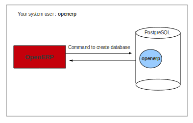

.. i18n: .. index::
.. i18n:    single: Installation; PostgreSQL
.. i18n:    single: PostgreSQL; Installation
.. i18n: ..
..

.. index::
   single: Installation; PostgreSQL
   single: PostgreSQL; Installation
..

.. i18n: .. _installation-postgresql-server:
.. i18n: 
.. i18n: PostgreSQL Server Installation and Configuration
.. i18n: ================================================
..

.. _installation-postgresql-server:

PostgreSQL 数据库安装和配置
================================================

.. i18n: .. tip:: Methods
.. i18n: 
.. i18n:         The `PostgreSQL download page <http://www.postgresql.org/download/linux>`__ lists the available installation methods. Choose the one that best suits your needs.
..

.. .. tip:: Methods

         `PostgreSQL 下载页 <http://www.postgresql.org/download/linux>`__ 列出可用的安装方法. 选择适合你的需要的一种.

.. i18n: Example on Ubuntu
.. i18n: -----------------
..

Ubuntu 上的例子
-----------------

.. i18n: Use the following command at your system's command prompt to install the **postgresql** package: ::
.. i18n: 
.. i18n:   sudo apt-get install postgresql
..

在系统命令行提示符下使用下面的命令安装 **postgresql** 包: ::

  sudo apt-get install postgresql

.. i18n: For example: ::
.. i18n: 
.. i18n:   openerp@openerp-desktop:/$ sudo apt-get install postgresql
..

示例: ::

  openerp@openerp-desktop:/$ sudo apt-get install postgresql

.. i18n: For a graphical user interface of **postgresql**, use the following command: ::
.. i18n: 
.. i18n:   sudo apt-get install pgadmin3
..

对于 **postgresql** GUI用户界面 , 使用下面的命令: ::

  sudo apt-get install pgadmin3

.. i18n: For example: ::
.. i18n: 
.. i18n:   openerp@openerp-desktop:/$ sudo apt-get install pgadmin3
..

示例: ::

  openerp@openerp-desktop:/$ sudo apt-get install pgadmin3

.. i18n: You can find the new menu item **pgAdmin III** in your Ubuntu system menu from
.. i18n: :menuselection:`Applications --> Programming --> pgAdmin III`.
..

你能在Ubuntu系统菜单找到新的菜单项 **pgAdmin III** 
:menuselection:`Applications --> Programming --> pgAdmin III`.

.. i18n: .. index::
.. i18n:    single: PostgreSQL; setup a user
.. i18n:    single: PostgreSQL; setup a database
.. i18n: ..
..

.. index::
   single: PostgreSQL; setup a user
   single: PostgreSQL; setup a database
..

.. i18n: Setup a PostgreSQL user for OpenERP
.. i18n: -----------------------------------
..

为OpenERP设置一个 PostgreSQL 用户
-----------------------------------

.. i18n: When the installations of the required software are done, you must create a
.. i18n: PostgreSQL user. This user must be the same as your system user. OpenERP will use this user to
.. i18n: connect to PostgreSQL.
..

当所需的软件完成安装后，你必须创建一个PostgreSQL用户。这个用户必须和你的系统用户同名。 OpenERP 将使用这个用户来连接PostgreSQL.

.. i18n: .. figure:: ../../img/openerp_postgresql.png
.. i18n:    :scale: 75
.. i18n:    :align: center
.. i18n: 
.. i18n:    *Figure demonstrating how OpenERP uses the PostgreSQL user to interact with it*
..

   *图示 演示了OpenERP用户如何使用PostgreSQL 用户与其交互*

.. i18n: .. tip:: Database
.. i18n: 
.. i18n:         Without creating and configuring a PostgreSQL user for OpenERP as described below, you cannot create a database using OpenERP Client.
..

.. tip:: Database

        如果没有按如下所述方式为 OpenERP 创建和配置一个 PostgreSQL 用户, 你就不能用 OpenERP 客户端来创建数据库。

.. i18n: First Method
.. i18n: ++++++++++++
..

第一个方法
++++++++++++

.. i18n: The default superuser for PostgreSQL is called **postgres**. You may need to login as this
.. i18n: user first. ::
.. i18n: 
.. i18n:     openerp@openerp-desktop:/$ sudo su postgres
.. i18n:     password: XXXXXXXXXX
..

PostgreSQL的默认超级用户叫做 **postgres**. 你首先要用这个用户登录: ::

    openerp@openerp-desktop:/$ sudo su postgres
    password: XXXXXXXXXX

.. i18n: Now create PostgreSQL user **openerp** using the following command: ::
.. i18n: 
.. i18n: 	postgres@openerp-desktop:/$ createuser openerp
.. i18n: 	Shall the new role be a superuser? (y/n) y
..

现在用下列命令创建PostgreSQL 用户 **openerp** : ::

	postgres@openerp-desktop:/$ createuser openerp
	Shall the new role be a superuser? (y/n) y

.. i18n: Make this new user a superuser. Only then you can create a database using OpenERP Client.
.. i18n: In short, **openerp** is the new user created in PostgreSQL for OpenERP. This user is the owner
.. i18n: of all the tables created by OpenERP Client.
..

确保新用户成为超级用户。这样你才能用OpenERP客户端创建数据库。
总之, **openerp** 是一个在PostgreSQL中为OpenERP创建的新用户。这个用户将是OpenERP客户端创建的全部表的所有者。

.. i18n: Now check the list of databases created in PostgreSQL using the following command: ::
.. i18n: 
.. i18n: 	postgres@openerp-desktop:/$ psql -l
..

现在用下列命令列出在PostgreSQL中已经创建的数据库列表: ::

	postgres@openerp-desktop:/$ psql -l

.. i18n: You can find the database **template1**, run the following command to use this database: ::
.. i18n: 
.. i18n: 	postgres@openerp-desktop:/$ psql template1
..

能找到数据库 **template1**, 运行下列命令使用这个数据库 : ::

	postgres@openerp-desktop:/$ psql template1

.. i18n: To apply access rights to the role **openerp** for the database which will be created from OpenERP Client,
.. i18n: use the following command: ::
.. i18n: 
.. i18n: 	template1=# alter role openerp with password 'postgres';
.. i18n: 	ALTER ROLE
..

要在OpenERP客户端创建的数据库中应用访问权限给角色 **openerp** ，使用下列命令: ::

	template1=# alter role openerp with password 'postgres';
	ALTER ROLE

.. i18n: Second Method
.. i18n: +++++++++++++
..

第二个方法
+++++++++++++

.. i18n: Another option to create and configure a PostgreSQL user for OpenERP is shown below: ::
.. i18n: 
.. i18n:     postgres@openerp-desktop:/$ createuser --createdb --username postgres --no-createrole
.. i18n:     --pwprompt openerp
.. i18n:     Enter password for new role: XXXXXXXXXX
.. i18n:     Enter it again: XXXXXXXXXX
.. i18n:     Shall the new role be a superuser? (y/n) y
.. i18n:     CREATE ROLE
..

为OpenERP创建和配置一个PostgreSQL用户的其它方法显示如下: ::

    postgres@openerp-desktop:/$ createuser --createdb --username postgres --no-createrole
    --pwprompt openerp
    Enter password for new role: XXXXXXXXXX
    Enter it again: XXXXXXXXXX
    Shall the new role be a superuser? (y/n) y
    CREATE ROLE

.. i18n: .. note:: Password
.. i18n: 
.. i18n:         Note that the password is *postgres*.
..

.. note:: 密码

        注意密码是*postgres*.

.. i18n: Option explanations:
..

选项说明:

.. i18n:   * ``--createdb`` : the new user will be able to create new databases
.. i18n:   * ``--username postgres`` : *createuser* will use the *postgres* user (superuser)
.. i18n:   * ``--no-createrole`` : the new user will not be able to create new users
.. i18n:   * ``--pwprompt`` : *createuser* will ask you the new user's password
.. i18n:   * ``openerp`` : the new user's name
..

  * ``--createdb`` : 新用户能创建新数据库
  * ``--username postgres`` : *createuser* 将使用 *postgres* 用户 (超级用户)
  * ``--no-createrole`` :  此用户不允许创建新用户
  * ``--pwprompt`` : *createuser* 将询问你新用户的密码
  * ``openerp`` : 新用户的名称

.. i18n: To access your database using **pgAdmin III**, you must configure the database connection as shown in the following figure:
..

要使用 **pgAdmin III** 访问你的数据库，你必须如下图所示配置你的数据库连接:

.. i18n: .. figure:: ../../img/new_server_registration.png
.. i18n:    :scale: 50
.. i18n:    :align: center
..

.. figure:: ../../img/new_server_registration.png
   :scale: 50
   :align: center

.. i18n: You can now start OpenERP Server. You will probably need to modify the
.. i18n: OpenERP configuration file according to your needs which is normally
.. i18n: located in ``~/.openerprc``.
..

现在，你可以启动 OpenERP 服务器了。根据你的需求，你可能还要修改OpenERP的配置文件，该文件通常在 ``~/.openerprc``。

.. i18n: .. tip:: Developer Book
.. i18n: 
.. i18n:         You can find information on configuration files in the Developer Book, section :ref:`Configuration <configuration-files-link>`
..

.. tip:: 开发手册

        你能在开发手册找到配置文件有关的信息, 章节 :ref:`Configuration <configuration-files-link>`
        
