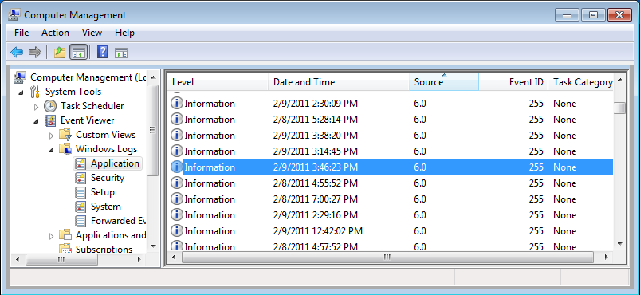
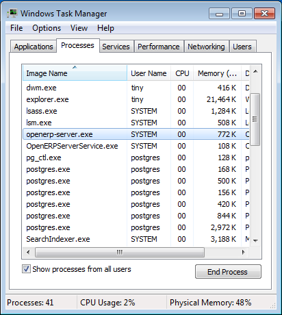

.. i18n: .. index::
.. i18n:    single: Installation; OpenERP Server (Windows)
.. i18n:    single: OpenERP Server; Installation (Windows)
.. i18n: .. 
..

.. index::
   single: Installation; OpenERP Server (Windows)
   single: OpenERP Server; Installation (Windows)
.. 

.. i18n: .. windows-server-link:
..

.. windows-server-link:

.. i18n: OpenERP Server Installation
.. i18n: ===========================
..

OpenERP服务器安装
===========================

.. i18n: The OpenERP Server 6.1 installation works with disks formatted in NTFS (not a FAT or FAT32 partition).
.. i18n: The following installation procedure has been well-tested on Windows 7.
..

OpenERP 服务器6.1安装运行于NTFS格式硬盘（而非FAT或FAT32分区）。以下安装流程在Windows 7上很好地测试过。

.. i18n: .. note:: Windows Versions
.. i18n: 
.. i18n:    OpenERP Server does not work on Windows 98 or ME;
.. i18n:    for obvious reasons -- these cannot be formatted using NTFS.
..

.. note:: Windows 版本

   OpenERP服务器不行运行于Windows 98或者ME；原因很显然，这些版本不能用NTFS格式化。

.. i18n: You will need a PostgreSQL server up and running. If it is not the case,
.. i18n: you can read the :ref:`installation-windows-postgresql-server` section.
..

你需要一个运行的PostgreSQL服务器。如果没有，你可以阅读PostgreSQL服务器安装和配置部分 :ref:`installation-windows-postgresql-server` 。

.. i18n: Downloading the OpenERP Server
.. i18n: ------------------------------
..

下载 OpenERP 服务器
------------------------------

.. i18n: The OpenERP Server can be downloaded from
.. i18n: `OpenERP website's download page <http://www.openerp.com/downloads>`_.
..

OpenERP服务器可以从OpenERP网站下载页面下载 <http://www.openerp.com/downloads>`_.

.. i18n: Under `Windows Auto-Installer`, choose **All-In-One** to download OpenERP.
..

在 `Windows Auto-Installer` 下面, 选择 **All-In-One** 来下载 OpenERP。

.. i18n: Installing the OpenERP Server
.. i18n: -----------------------------
..

安装 OpenERP 服务器
-----------------------------

.. i18n: Execute the installer you have just downloaded. It has the following stages:
..

Execute the installer you have just downloaded. It has the following stages:

.. i18n: * 1. Select installation language
.. i18n: 	The default is ``English``. The other option is ``French``.
.. i18n: 
.. i18n: * 2. Welcome message
.. i18n: 	Carefully follow the recommendations given in this step.
.. i18n: 
.. i18n: * 3. Licence Agreement
.. i18n: 	It is important that you accept the GNU General Public License to proceed with installation.
.. i18n: 
.. i18n: * 4. Select folder for installation
.. i18n: 	By default, OpenERP Server is installed in ``C:\Program Files\OpenERP 6.1\Server``. To install in a different folder, browse for a different location(folder) in this step.
.. i18n: 
.. i18n: * 5. Configure PostgreSQL connection
.. i18n: 	The installer will suggest default parameters to complete your PostgreSQL connection configuration. You may accept the defaults, or change it according to your requirement.
..

* 1. Select installation language
	The default is ``English``. The other option is ``French``.

* 2. Welcome message
	Carefully follow the recommendations given in this step.

* 3. Licence Agreement
	It is important that you accept the GNU General Public License to proceed with installation.

* 4. Select folder for installation
	By default, OpenERP Server is installed in ``C:\Program Files\OpenERP 6.1\Server``. To install in a different folder, browse for a different location(folder) in this step.

* 5. Configure PostgreSQL connection
	The installer will suggest default parameters to complete your PostgreSQL connection configuration. You may accept the defaults, or change it according to your requirement.

.. i18n:   .. figure:: ../../img/s5_config_postgres.png
.. i18n:      :scale: 50
.. i18n:      :align: center
.. i18n: 
.. i18n:   *PostgreSQL configuration*
..

  .. figure:: ../../img/s5_config_postgres.png
     :scale: 50
     :align: center

  *PostgreSQL configuration*

.. i18n: * 6. Create shortcuts
.. i18n: 	Select a folder in the `Start` menu where you would like to create the program's shortcuts.
..

* 6. Create shortcuts
	Select a folder in the `Start` menu where you would like to create the program's shortcuts.

.. i18n:   .. figure:: ../../img/s6_shortcuts.png
.. i18n:      :scale: 50
.. i18n:      :align: center
.. i18n: 
.. i18n:   *Create Start menu shortcuts*
..

  .. figure:: ../../img/s6_shortcuts.png
     :scale: 50
     :align: center

  *Create Start menu shortcuts*

.. i18n: * 7. Install
.. i18n: 	The automatic installation of OpenERP Server begins and you can view its progress.
.. i18n: 
.. i18n: * 8. Finish
.. i18n: 	On successful installation of OpenERP Server, you will get an appropriate confirmation. You can click `Finish` to close the setup wizard.
..

* 7. Install
	The automatic installation of OpenERP Server begins and you can view its progress.

* 8. Finish
	On successful installation of OpenERP Server, you will get an appropriate confirmation. You can click `Finish` to close the setup wizard.

.. i18n:   .. figure:: ../../img/Openerp_server_finish_install.png
.. i18n:      :scale: 50
.. i18n:      :align: center
.. i18n: 
.. i18n:   *End of setup wizard*
..

  .. figure:: ../../img/Openerp_server_finish_install.png
     :scale: 50
     :align: center

  *End of setup wizard*

.. i18n: The OpenERP Server installs as a Windows service. This means you do not have to start the
.. i18n: server each time you start the computer and it runs without the need of an open user
.. i18n: session.
..

The OpenERP Server installs as a Windows service. This means you do not have to start the
server each time you start the computer and it runs without the need of an open user
session.

.. i18n: .. _sect-custconf:
.. i18n: 
.. i18n: Customized Configuration
.. i18n: ------------------------
..

.. _sect-custconf:

定制配置
------------------------

.. i18n: To initialize the server with configurations of your choice, you have to invoke it at the Windows Command prompt with the options you wish to override.
..

To initialize the server with configurations of your choice, you have to invoke it at the Windows Command prompt with the options you wish to override.

.. i18n: Navigate to the
.. i18n: installation directory in ``C:\Program Files\OpenERP 6.1\Server\``
.. i18n: and type this command but do not execute it yet: ::
.. i18n: 
.. i18n:    openerp-server.exe -d <db_name> -r <db_user> -w <db_password>
.. i18n:    --db_host=<postgresql_server_address>
.. i18n:    --db_port=<port_no> --logfile="<logfile>"
..

Navigate to the
installation directory in ``C:\Program Files\OpenERP 6.1\Server\``
and type this command but do not execute it yet: ::

   openerp-server.exe -d <db_name> -r <db_user> -w <db_password>
   --db_host=<postgresql_server_address>
   --db_port=<port_no> --logfile="<logfile>"

.. i18n: The initialization of OpenERP Server provides necessary information for connection
.. i18n: to the PostgreSQL database and the choice of data to load. Here is the
.. i18n: explanation of used options:
..

The initialization of OpenERP Server provides necessary information for connection
to the PostgreSQL database and the choice of data to load. Here is the
explanation of used options:

.. i18n:  * ``-d <db_name>`` : Name of the database created for OpenERP Server.
.. i18n:  * ``-r <db_user>`` : Name of the PostgreSQL user (role).
.. i18n:  * ``-w <db_password>`` : Password of the PostgreSQL user.
.. i18n:  * ``--db_host=<postgresql_server_address>`` : Address of the server where PostgreSQL is. If
.. i18n:    you have installed PostgreSQL on the same computer as OpenERP Server, you can enter
.. i18n:    ``localhost``, else, the IP address or the name of the distant server.
.. i18n:  * ``--db_port=<port_no>`` : Port number where PostgreSQL listens. The default is 5432.
.. i18n:  * ``--stop-after-init`` : This option stops the server after initialization.
.. i18n:  * ``--logfile="<logfile>"`` : specify an alternate logfile where all the output of server will be
.. i18n:    saved. The default is ``C:\Program Files\OpenERP 6.1\Server\openerp-server.log``.
..

 * ``-d <db_name>`` : Name of the database created for OpenERP Server.
 * ``-r <db_user>`` : Name of the PostgreSQL user (role).
 * ``-w <db_password>`` : Password of the PostgreSQL user.
 * ``--db_host=<postgresql_server_address>`` : Address of the server where PostgreSQL is. If
   you have installed PostgreSQL on the same computer as OpenERP Server, you can enter
   ``localhost``, else, the IP address or the name of the distant server.
 * ``--db_port=<port_no>`` : Port number where PostgreSQL listens. The default is 5432.
 * ``--stop-after-init`` : This option stops the server after initialization.
 * ``--logfile="<logfile>"`` : specify an alternate logfile where all the output of server will be
   saved. The default is ``C:\Program Files\OpenERP 6.1\Server\openerp-server.log``.

.. i18n: Before the execution of this command you have to decide the purpose of the database created in OpenERP.
..

Before the execution of this command you have to decide the purpose of the database created in OpenERP.

.. i18n: Sample command: ::
.. i18n: 
.. i18n:  openerp-server.exe -d openerpdemo -r openpg -w openpgpwd
.. i18n:  --db_host=localhost --logfile="C:\Users\tiny\Desktop\demo_db.log"
.. i18n:  --db_port=5430 --stop-after-init
.. i18n:  
.. i18n: Here you have to enter the username and password specified in the PostgreSQL connection configuration during server installation.
..

Sample command: ::

 openerp-server.exe -d openerpdemo -r openpg -w openpgpwd
 --db_host=localhost --logfile="C:\Users\tiny\Desktop\demo_db.log"
 --db_port=5430 --stop-after-init
 
Here you have to enter the username and password specified in the PostgreSQL connection configuration during server installation.

.. i18n: When you execute the initialization command, if you specify a logfile, the server runtime output is written to that file, and you will not see any server output in the prompt window. You have only to wait until the prompt comes back.
..

When you execute the initialization command, if you specify a logfile, the server runtime output is written to that file, and you will not see any server output in the prompt window. You have only to wait until the prompt comes back.

.. i18n: Deciding about the purpose of the database
.. i18n: ^^^^^^^^^^^^^^^^^^^^^^^^^^^^^^^^^^^^^^^^^^
..

决定数据库目的
^^^^^^^^^^^^^^^^^^^^^^^^^^^^^^^^^^^^^^^^^^

.. i18n: You can initialize the database with OpenERP Server to:
..

You can initialize the database with OpenERP Server to:

.. i18n:   #. Take a look at the system with modules installed and demo data loaded
.. i18n:   #. Install a new clean database system (without demo data)
.. i18n:   #. Upgrade an existing version
..

  #. Take a look at the system with modules installed and demo data loaded
  #. Install a new clean database system (without demo data)
  #. Upgrade an existing version

.. i18n: With modules and demo data
.. i18n: ++++++++++++++++++++++++++
..

With modules and demo data
++++++++++++++++++++++++++

.. i18n: If you execute the sample command above, you will get a database with only base modules installed and loaded with demo data.
.. i18n: To initialize OpenERP Server with additional modules and its demo data, you need to add this option to the above
.. i18n: command: ::
.. i18n: 
.. i18n:  -i <module name>
..

If you execute the sample command above, you will get a database with only base modules installed and loaded with demo data.
To initialize OpenERP Server with additional modules and its demo data, you need to add this option to the above
command: ::

 -i <module name>

.. i18n: Sample command: ::
.. i18n: 
.. i18n:  openerp-server.exe -d openerpdemo --stop-after-init -i sale
..

Sample command: ::

 openerp-server.exe -d openerpdemo --stop-after-init -i sale

.. i18n: This command will initialize the OpenERP Server with the module :mod:`sale` and its dependencies, and fill its PostgreSQL database with their related demo data. As can be seen, you must specify the target database for the module installation.
..

This command will initialize the OpenERP Server with the module :mod:`sale` and its dependencies, and fill its PostgreSQL database with their related demo data. As can be seen, you must specify the target database for the module installation.

.. i18n: To install more than one module, specify a comma-separated module list at the command-line.
..

To install more than one module, specify a comma-separated module list at the command-line.

.. i18n: Without demo data (or new clean version)
.. i18n: ++++++++++++++++++++++++++++++++++++++++
..

Without demo data (or new clean version)
++++++++++++++++++++++++++++++++++++++++

.. i18n: Execute the command with an option excluding the demo data: ::
.. i18n: 
.. i18n:  --without-demo=all
..

Execute the command with an option excluding the demo data: ::

 --without-demo=all

.. i18n: This will load base modules (and other modules if -i option is used), but will not load its demo data.
..

This will load base modules (and other modules if -i option is used), but will not load its demo data.

.. i18n: Sample command usage: ::
.. i18n: 
.. i18n:  openerp-server.exe -d openerpdemo --stop-after-init --without-demo=all
..

Sample command usage: ::

 openerp-server.exe -d openerpdemo --stop-after-init --without-demo=all

.. i18n: If you have already initialized the database with demo data loaded, you can create
.. i18n: a new database and execute the above command on it.
..

If you have already initialized the database with demo data loaded, you can create
a new database and execute the above command on it.

.. i18n: Update the database
.. i18n: +++++++++++++++++++
..

更新数据库
+++++++++++++++++++

.. i18n: Execute the command with an option that updates the data structures: ::
.. i18n: 
.. i18n:  --update=all
..

Execute the command with an option that updates the data structures: ::

 --update=all

.. i18n: Sample command usage: ::
.. i18n: 
.. i18n:  openerp-server.exe -d openerpdemo --stop-after-init --update=all
..

Sample command usage: ::

 openerp-server.exe -d openerpdemo --stop-after-init --update=all

.. i18n: Monitoring the OpenERP Server
.. i18n: -----------------------------
.. i18n: The service and some runtime information is accessible through the Computer Management console in
.. i18n: Administrative Tools.
..

监控 OpenERP 服务器
-----------------------------
The service and some runtime information is accessible through the Computer Management console in
Administrative Tools.

.. i18n: .. figure:: ../../img/Openerp_service_mmc_terp_service.png
.. i18n:    :align: center
.. i18n:    :scale: 85
..

.. figure:: ../../img/Openerp_service_mmc_terp_service.png
   :align: center
   :scale: 85

.. i18n: *OpenERP 6.1 in the Services list*
..

*OpenERP 6.1 in the Services list*

.. i18n: Here, you can define how the service should act in case of server failure. Access the service's properties by double-clicking ``OpenERP 6.1`` in the list.
..

Here, you can define how the service should act in case of server failure. Access the service's properties by double-clicking ``OpenERP 6.1`` in the list.

.. i18n: .. figure:: ../../img/Openerp_service_mmc_control_actions.png
.. i18n:      :scale: 50
.. i18n:      :align: center
..

.. figure:: ../../img/Openerp_service_mmc_control_actions.png
     :scale: 50
     :align: center

.. i18n: *Recovery tab to set service failure response*
..

*Recovery tab to set service failure response*

.. i18n: The Computer Management logging service offers additional information about the execution of the OpenERP Server, for example, the startup or shutdown information of the service.
..

The Computer Management logging service offers additional information about the execution of the OpenERP Server, for example, the startup or shutdown information of the service.

.. i18n: .. figure:: ../../img/Openerp_service_mmc_logs.png
.. i18n:    :align: center
.. i18n:    :scale: 85
..

.. i18n: *Server information in Windows Logs list*
..

*Server information in Windows Logs list*

.. i18n: OpenERP Server runtime output can be found in the default logfile.
.. i18n: Given that the server is now running as a Windows service, it does not output any runtime
.. i18n: messages. For this, the logfile is the only option. Access it from the `Start` menu, through the ``View log`` link in the group of shortcuts for OpenERP 6.1. Alternatively, use the path ``C:\Program Files\OpenERP 6.1\Server\openerp-server.log``.
..

OpenERP Server runtime output can be found in the default logfile.
Given that the server is now running as a Windows service, it does not output any runtime
messages. For this, the logfile is the only option. Access it from the `Start` menu, through the ``View log`` link in the group of shortcuts for OpenERP 6.1. Alternatively, use the path ``C:\Program Files\OpenERP 6.1\Server\openerp-server.log``.

.. i18n: .. figure:: ../../img/log_file.png
.. i18n:      :scale: 50
.. i18n:      :align: center
..

.. figure:: ../../img/log_file.png
     :scale: 50
     :align: center

.. i18n: *OpenERP Server log file*
..

*OpenERP Server log file*

.. i18n: You can find out whether OpenERP is running by invoking `Windows Task Manager`.
.. i18n: When you look at the `Processes` tab, you will see ``OpenERPServerService.exe`` and ``openerp-server.exe``, both having ``SYSTEM`` as their user (to see these, `Show processes from all users` must be enabled in the Task Manager).
..

You can find out whether OpenERP is running by invoking `Windows Task Manager`.
When you look at the `Processes` tab, you will see ``OpenERPServerService.exe`` and ``openerp-server.exe``, both having ``SYSTEM`` as their user (to see these, `Show processes from all users` must be enabled in the Task Manager).

.. i18n: .. figure:: ../../img/Openerp_service_running.png
.. i18n:      :scale: 50
.. i18n:      :align: center
..

.. i18n: *The services in Windows Task Manager*
..

*The services in Windows Task Manager*

.. i18n: Congratulations, you have successfully installed OpenERP Server
.. i18n: ---------------------------------------------------------------
..

Congratulations, you have successfully installed OpenERP Server
---------------------------------------------------------------

.. i18n: For more information, please take a look at
.. i18n: :ref:`Additional Installation Information and
.. i18n: Troubleshooting <troubleshooting-and-windows-complementary-install-information>`,
.. i18n: where you can find some troubleshooting examples.
..

For more information, please take a look at
:ref:`Additional Installation Information and
Troubleshooting <troubleshooting-and-windows-complementary-install-information>`,
where you can find some troubleshooting examples.
