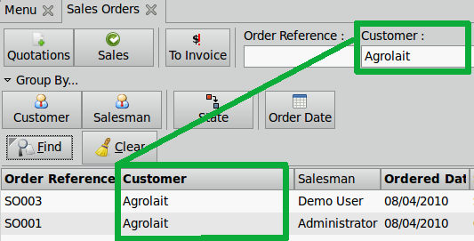
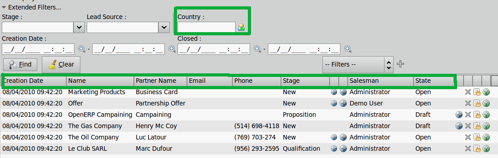

.. i18n: ============
.. i18n: Search Views
.. i18n: ============
..

=================================================================
搜索视图 （注：搜索视图在OE7中巨变，故此章节暂且不译）
=================================================================

.. i18n: Introduction
.. i18n: ------------
..

简介
------------

.. i18n: As previously  mentioned, OpenERP is developing within a business framework and vision. OpenERP's users can find business applications, in which they can surf on some of the business oriented views. In this search view they will also find that it facilitates the work and the search of the user. 
..

As previously  mentioned, OpenERP is developing within a business framework and vision. OpenERP's users can find business applications, in which they can surf on some of the business oriented views. In this search view they will also find that it facilitates the work and the search of the user. 

.. i18n: Search views in OpenERP allow the responsible user to search in only one view. Indeed, a Sales Responsible user, can see, in the same view, his created documents (sale orders) and, if he is allowed, the one created by his colleagues. So, in Sales Order menuitem, he can see all quotations, current sales and sales to invoice. 
..

Search views in OpenERP allow the responsible user to search in only one view. Indeed, a Sales Responsible user, can see, in the same view, his created documents (sale orders) and, if he is allowed, the one created by his colleagues. So, in Sales Order menuitem, he can see all quotations, current sales and sales to invoice. 

.. i18n: .. note::
.. i18n: 
.. i18n:    search views are present in some of the types of views. There is a search part in calendar view, in list view and  in statistic reports. 
..

.. note::

   search views are present in some of the types of views. There is a search part in calendar view, in list view and  in statistic reports. 

.. i18n: The terminology used to qualify each element of the search view are related to both the application and business context. For example, in sale order, there are buttons to filter different states. Instead of using a state label “Draft”, we use a more suitable label for the sales context which is “Quotations”. 
..

The terminology used to qualify each element of the search view are related to both the application and business context. For example, in sale order, there are buttons to filter different states. Instead of using a state label “Draft”, we use a more suitable label for the sales context which is “Quotations”. 

.. i18n: Components of search views
.. i18n: --------------------------
..

搜索视图组件
--------------------------

.. i18n: Many options are given to users to optimize their searches. Buttons are used to quickly filter groups of important documents. Usually, a button is chosen following the importance of the document's type. We can take a look at an example, in sale order, it is important that the user can quickly see only the quotations that he needs. 
..

许多选项提供给用户以优化他们的搜索.按钮用来快速进行重要单据的过滤、分组。 通常,一个按钮用来选择单据类型. 我们可以看看一个例子,在销售订单,用户能快速地看到他所需的报价单这点非常重要. 

.. i18n: In all search views there are also some selected search fields. These fields are usually chosen regarding the importance of the object (related to column of list view). An example of this would be, in sale order search view, the salesman should be able to see current sales regarding only one customer. 
..

在所有的搜索视图中，也有一些可选的搜索字段. 这些字段通常选择有关对象的重点 (关联到列表视图的列). 例如我们看到的，在销售订单视图, 销售员能看到只有一个客户相关的销售。 

.. i18n: .. figure:: Pictures/3.1.main_fields.png
.. i18n:    :align: center
..

.. i18n: Some buttons allow users to group by elements, for example, salesman can group by customer and see, for each customer, all the sale orders they have made. 
..

有些按钮允许用户按元素分组，例如，销售员能根据客户分组和查看他们所制作的每个客户的所有销售单。 

.. i18n: .. figure:: Pictures/3.2group_by.png
.. i18n:    :align: center
..

.. figure:: Pictures/3.2group_by.png
   :align: center

.. i18n: Finally, OpenERP allows users to search following most of the elements we can find in form view with personal filter. Thanks to these filters, we can lighten and clear the view. If users want see all leads that come from one state in the United-States, they can add a filter easily and then save it as a preference, this is especially useful if they have to use it often. 
..

Finally, OpenERP allows users to search following most of the elements we can find in form view with personal filter. Thanks to these filters, we can lighten and clear the view. If users want see all leads that come from one state in the United-States, they can add a filter easily and then save it as a preference, this is especially useful if they have to use it often. 

.. i18n: .. figure:: Pictures/3.3.other_fields.png
.. i18n:    :align: center
..

.. figure:: Pictures/3.3.other_fields.png
   :align: center

.. i18n: .. note::
.. i18n: 
.. i18n: 	In extended view, in some search views, there are extended filters. These are used to allow user filtering on important elements but are not specific to a 		list view. For example, in Leads, there is not the Lead's country in the Lead list view, but, it regularly happens that Salesman want to filter all Leads 		by a specific country. It also allows you to modify columns of the list view by adding one. This kind of field is only on the extended interface and not in all 		search views. Our goal is to simplify, so if it is not necessary, there are no extended filters. A user can always use a personal filter.  
..

.. note::

	In extended view, in some search views, there are extended filters. These are used to allow user filtering on important elements but are not specific to a 		list view. For example, in Leads, there is not the Lead's country in the Lead list view, but, it regularly happens that Salesman want to filter all Leads 		by a specific country. It also allows you to modify columns of the list view by adding one. This kind of field is only on the extended interface and not in all 		search views. Our goal is to simplify, so if it is not necessary, there are no extended filters. A user can always use a personal filter.  

.. i18n: .. figure:: Pictures/3.4.extended_filters.png
.. i18n:    :align: center
.. i18n:        
..

       
