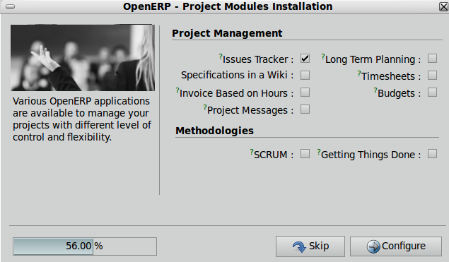

.. i18n: =====================================
.. i18n: Configuration Wizards Functionality
.. i18n: =====================================
..

=====================================
配置向导功能
=====================================

.. i18n: Configuration wizards are launched automatically on creation of a new database. You must develop configuration wizards per application to:
..

Configuration wizards are launched automatically on creation of a new database. You must develop configuration wizards per application to:

.. i18n: 	1. Help the user decide which features (modules) to install
.. i18n: 	
.. i18n: 	2. Help the user configure the system
..

	1. Help the user decide which features (modules) to install
	
	2. Help the user configure the system

.. i18n: For the point (1), fewer user-installed modules make it easier to understand the system. So, most features are proposed as extra in the configuration wizards.
..

For the point (1), fewer user-installed modules make it easier to understand the system. So, most features are proposed as extra in the configuration wizards.

.. i18n: For the point (2), where possible, it's better to provide a default configuration that works for most companies instead of developing a configuration wizard.
..

For the point (2), where possible, it's better to provide a default configuration that works for most companies instead of developing a configuration wizard.

.. i18n: Don't forget that configuration wizards are to help users tailor the system to their requirements, not to ask complex questions for very specific configurations.
..

Don't forget that configuration wizards are to help users tailor the system to their requirements, not to ask complex questions for very specific configurations.

.. i18n: OpenERP allows users to configure their installation to their business's needs. When a user creates a database they can choose one or more applications. They will then see some configuration wizards to add modules related to the chosen application(s) and so, their needs.  For example, if the user has chosen “Project” they will see a wizard to configure Project Management.
..

OpenERP allows users to configure their installation to their business's needs. When a user creates a database they can choose one or more applications. They will then see some configuration wizards to add modules related to the chosen application(s) and so, their needs.  For example, if the user has chosen “Project” they will see a wizard to configure Project Management.

.. i18n: .. figure:: Pictures/2.1.Project_management.png
.. i18n:    :align: center
..

