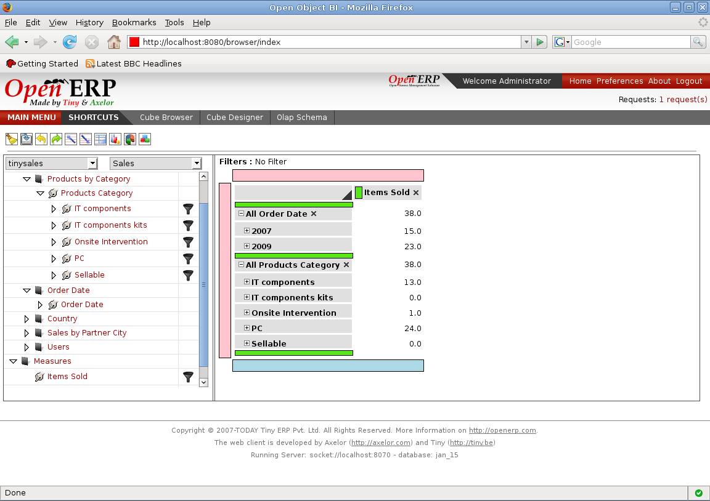

Drill Up/Down
=============

Drill Down on a Member
----------------------

Drilling down is the process of expanding a member to its child member for a purpose of broader analysis on data.
User can locate the member he wants to drill down.
Just a click on that member will expand the parent member to display its child members.

Drill Up on a Member
--------------------

Drill up causes a member to wrap up all this children if displayed.
Just a click on an expanded parent member will wrap all its child members.

.. image::  images/data_browser16.png
   :scale: 65
