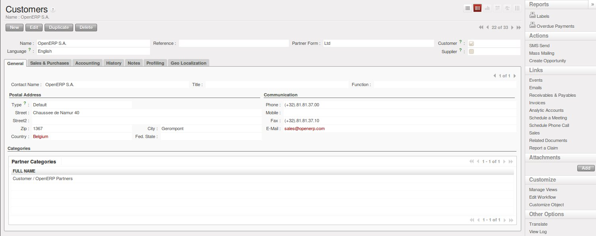

.. _part2-crm-cont:

Managing your Address Book
==========================

.. index::
   single: Partner
   single: Customer
   single: Prospect
   single: Address
   single: Contact

What is the difference between a partner and a contact in OpenERP? A ``Partner`` represents an entity that you do business with - a customer, a prospect, or even an employee of your company. In other CRM applications, a partner is also referred to as an Account.
A ``Contact`` represents a person who works for a partner.

Each partner can have an unlimited number of contacts. OpenERP also allows you to have several contacts with the same address type for one partner. You can easily link several Invoice addresses to a customer, for instance. 

.. note:: Address Types

	If you have recorded several contacts for the same partner, you can tell OpenERP which contact will be used in
	various documents (e.g. a quotation) by specifying the ``Address Type``.

	For example, a partner (*company*) can have a delivery address that differs from the company's invoice address.
	If the Address Types are correctly assigned, OpenERP can automatically select the appropriate address
	during the creation of the document – an invoice is addressed to the contact that has been assigned
	the Address Type of Invoice, otherwise to the Default address.

The concept of a partner in OpenERP is much more flexible than in many other management applications. Why is that? Because a partner can be your supplier and your customer at the same time.
As a consequence, any data you update for that partner will apply to both customer and supplier! Thanks to this, you no longer need to update your address book several times (or even in several places) for the same partner.

The partner form contains information about the company, such as its corporate name, its primary language, and whether the company is a
\ ``Customer`` \ and/or a \ ``Supplier`` \. The partner form is composed of several tabs.

* the :guilabel:`General` tab contains information about different contacts of that partner, postal information,
  communication information and the categories the partner belongs to,

* the :guilabel:`Sales & Purchases` tab contains information such as the default salesman and sales team, and the website,

* the :menuselection:`History` tab gives visibility on the complete ``Communication History`` (meetings, marketing campaign activities,
  leads and opportunities, phone calls, emails) with the partner. The events the partner has been involved in are created automatically by
  different documents like phone calls, leads, meetings,

* the :menuselection:`Notes` tab is an area for free text notes.

.. figure::  images/crm_partner_hist.jpeg
   :scale: 100
   :align: center

   *The History Tab of a Customer*

Creating and Updating Partners
------------------------------

Before explaining you how to create a partner, just a quick word on the different ways of representing partners in OpenERP.
`List` view shows a list of customers (the default representation when you click the Customers menu). In this view, you can see several customers at a time.
`Form` view is displayed when you click a specific customer to start editing or when you create a new customer.

To create a new partner (a company, customer, supplier, ...) or to display the list of existing customers, use the menu :menuselection:`Sales --> Address Book --> Customers`. This menu does not only allow you to create a new partner, but also to search for partners.

   *A Customer Form*

.. note:: Mandatory 

        Blue fields are always mandatory, meaning that you have to enter a value there. It is impossible to save changes as long as a blue field is not completed.

You should at least enter the company's ``Name`` in the partner form. Some fields are text fields, other fields may be linked to existing data that have been entered elsewhere, such as ``Countries``. 

Create a customer with the following data:

* :guilabel:`Name` : \ ``Smith and Offspring``\ ,

* :guilabel:`Customer` checkbox : \ ``checked``\ ,

* :guilabel:`Supplier` checkbox : \ ``unchecked``\ ,

* :guilabel:`Contact Name` : \ ``Stephen Smith``\ ,

* :guilabel:`Type` : \ ``Default``\, in the Postal Address section,

* :guilabel:`Save` the form.

.. tip:: Email

      If you use the email gateway, the Outlook or the Thunderbird plugin, do not forget to register an email addresses to each contact, so that the gateway will automatically attach incoming emails to the right partner.

To update a partner, open the corresponding form, select `Edit` and change the required fields. As explained before, when a company is both one of your customers and a supplier, you just have to edit the partner form once to have changes applied to both customer and supplier.

.. note:: Checkboxes

       Why is it important for you to correctly set the Customer and Supplier checkboxes in the partner form? These checkboxes are designed to enable OpenERP to quickly select the partners who should be displayed in some drop-down boxes. An example: when you select a partner in a Sales Quotation, OpenERP will only allow you to select from the list of Customers. And that is precisely what the Customer checkbox is used for. 

.. index:: Contact; Address

Managing your Contacts & Addresses
----------------------------------

You can have several contacts for one partner. Contacts represent company employees that you are in
touch with, along with their address details. For each address you can indicate the type (\ ``Default``\, \ ``Invoice``\, \ ``Delivery``\, \ ``Contact``\   or \ ``Other``\).

Contacts can be entered into the :guilabel:`General` tab of the **Customer** form, or from the list of addresses in the :menuselection:`Sales --> Address Book --> Addresses` menu.

.. tip:: Same Contact, Different Partners 

      Do you have contacts who work for several companies, and need to be linked to several partners? Check out the :ref:`ch-contact` chapter.

Customizing Partner Fields
--------------------------

OpenERP also allows you to customize the ``Partner`` view to your needs. Click the `Manage Views` option if you want to add fields, delete fields or change the order of fields in a view.

Let us add the ``Birthday`` field to a contact, in the `Addresses` form view. To do so, go to the :menuselection:`Sales -->
Address Book --> Addresses` menu and open any address in Form view. In the right menu bar, click `Manage Views`, then `Edit` because the corresponding view will already be preselected.

Go to the last line of the view and click the blue plus (+) sign to add a field to the `Communication` group. Proceed as in the figure below, then click the `Update` button.

.. figure::  images/manage_views_addfield_small.jpeg
   :scale: 75
   :align: center

   *Add the Birthday Field for a Contact*

In the `Properties` screen that appears, you can change the label to ``Birthday`` in the ``String`` field. To indicate that a new field can be used in the corresponding search view, make sure to select ``Always Searchable``. Click the `Update` button to confirm your changes. Click `Preview` to see your result. The ``Birthday`` field will now appear in your `Address` form view, ready to be used.

Performing Actions on Customers
-------------------------------

.. index::
   single: send SMS
   single: opportunity
   single: reminder

At the right side of the `Customers` list or form view, you will find a list of all of the reports, actions and links available for the selected partner(s). You can perform actions and print reports both from List and from Form view, List view allowing you to do actions for several partners at the same time.

.. tip:: Actions

       To display the list of possible actions, just select one or more customers or click the arrow at the top of the right side bar. 

You can create a new opportunity for a customer, or start a mass mailing. Mass mailings will usually be started from list view, because you will select several partners at a time.

.. note:: Campaigns

        For mass mailings, you might prefer to use the Direct Marketing application, which offers great functionalities (please refer to chapter :ref:`part3-crm-market`).

Another action enables you to quickly send an SMS message. 

.. tip::  Send an SMS message

	To send an SMS message from standard Open ERP you will have to place an order with the bulk SMS
	gateway operator Clickatell™ http://clickatell.com.

	To send an SMS message to a partner or a selection of several partners, first select the partners
	in list view, then click the :guilabel:`SMS Send` Action icon.

.. index:: Filter

Finding your Partners using Filters
-----------------------------------

Open the `Customers` list view to discover the search options allowing you to easily filter your partners. You can group by ``Salesman`` to see which customers have already been assigned a salesman or not. Click the button at the right (the icon of the person) to see the customers you are responsible for.

.. tip:: Limit

       If you want to display more than the 20 partners displayed by default, click the ``1 to 20 of - XX`` option at the bottom of the screen to be able to change the limit.

Filters also allow you to quickly set lists of customers for which you want to do specific actions. Through the ``New Filter`` option, you can also add your own filters for any field related to the ``Customer`` form.

.. note:: Filters
        
       You can easily create your own frequently used filters by prefiltering the data the way you want and then using the Save Filter option.

.. _partner-categ:

Categorizing your Partners
--------------------------

.. index::
   pair: partner; category

OpenERP uses categories to organize all of its partners according to their relationship with your company (customer, prospect, supplier, and so on). Each partner may be attached to several categories. To open the list of available partner categories, use the menu :menuselection:`Sales --> Configuration --> Address Book --> Partner Categories`.

.. figure::  images/crm_partner_category_big.png
   :scale: 100
   :align: center

   *List of Partner Categories*

Click one of the categories in the partner category structure to get a list of the partners
in that category. If you click a category that has subcategories, you will get a list of all of the
partners in the main category and in all of its subcategories.

.. note:: Categories

        To create a new category, go to the menu :menuselection:`Sales --> Configuration --> Address Book --> Partner Categories` and click the `New` button.

Because categories can be organized according to a tree structure, you can apply an action at any level of
the structure: a marketing promotion activity, for example, can be applied either to all customers,
or selectively only to customers in one category and its subcategories.

You can create your own categories and assign them to your partner from the `Customer` form. Another way of assigning the corresponding partner to a category is to open the category from the `Partner Categories`.

In the :ref:`profiling` chapter, you will see how to assign partners to categories automatically using segmentation rules.

.. _ch-contact:

An Alternative to Manage your Contacts
--------------------------------------

According to your kind of business, the standard way of linking several contacts to one partner may not be flexible enough for you. You could perfectly well have the same employees working for several of your companies. Or maybe you work with representatives ensuring follow up of several of your customers. So you would want to have the same contact linked to different partners.

Of course, OpenERP provides an alternative, the :mod:`base_contact` module, which gives you even more flexibility in managing your contacts.

Easily share the same contact (an employee, for instance), who may perfectly have different jobs, with several partners. You only need to enter (or *create*) the contact once and link it to the partners concerned, while specifying the position the contact holds for each company in particular. Any changes to contact information only need to be made once for them to be applied to all partners the contact is related to!

We illustrate the concept of multiple relationships between contacts and partners (companies) through an example. The figure :ref:`fig-crmconw` shows two companies having several addresses (places of business) and several contacts attached to these addresses.

In this example you will find the following elements:

* The ABC bank has two places of business, represented by the addresses of ABC Belgium and ABC
  Luxembourg,

* The addresses of Dexey France and Dexey Belgium belong to the Dexey company,

* At the office of ABC Luxembourg, you have the contacts of the director (D. Smith) and the
  accountant (A. Doe),

* Mr Doe holds the post of accountant for ABC Luxembourg and Dexey France,

* Mr D. Smith is director of Dexey France and Dexey Belgium and we also have his private address
  which is not attached to a partner.

An extra menu option will be added, allowing you to display the list of contacts, through :menuselection:`Sales --> Address Book --> Contacts`.

The screenshot below illustrates how contacts are handled with the advanced Contacts configuration.

.. _fig-crmconw:

.. figure:: images/crm_contact_with_latest.png
   :scale: 100

   *Advanced Contact Management*

This is a clear way to illustrate the complexities that may be accomplished in OpenERP.

If you correct or change a contact name in the contact form, the changes will be applied to all the posts occupied in the different companies.

The screen below represents a partner form. You can add several addresses, such as Invoice & Delivery, and a list of
contacts per address. Each contact has its own data, such as name, function, phone number and email.

.. figure:: images/crm_base_contacts.png
   :scale: 80
   :align: center

   *Partner Form with the Advanced Contacts Management*

Go to :menuselection:`Sales --> Address Book --> Contacts` to open a contact form.
You enter data in the contact form, containing information such as mobile phone, different functions occupied, and personal blog. You can also add a photo of your contact.
If you click the `Functions and Addresses` line, you will get more details about the job (such as start date, end date and fax).

.. figure:: images/crm_partner_poste.png
   :scale: 100
   :align: center

   *Detail of a Position occupied by a Contact at a Partner*

.. Copyright © Open Object Press. All rights reserved.

.. You may take electronic copy of this publication and distribute it if you don't
.. change the content. You can also print a copy to be read by yourself only.

.. We have contracts with different publishers in different countries to sell and
.. distribute paper or electronic based versions of this book (translated or not)
.. in bookstores. This helps to distribute and promote the OpenERP product. It
.. also helps us to create incentives to pay contributors and authors using author
.. rights of these sales.

.. Due to this, grants to translate, modify or sell this book are strictly
.. forbidden, unless Tiny SPRL (representing Open Object Press) gives you a
.. written authorisation for this.

.. Many of the designations used by manufacturers and suppliers to distinguish their
.. products are claimed as trademarks. Where those designations appear in this book,
.. and Open Object Press was aware of a trademark claim, the designations have been
.. printed in initial capitals.

.. While every precaution has been taken in the preparation of this book, the publisher
.. and the authors assume no responsibility for errors or omissions, or for damages
.. resulting from the use of the information contained herein.

.. Published by Open Object Press, Grand Rosière, Belgium

