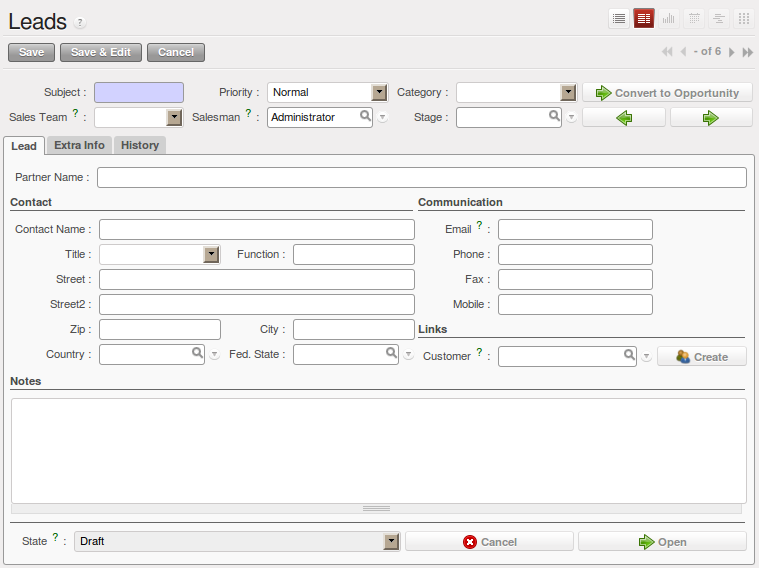

.. raw:: latex

    \afterpage{\clearpage}

.. _part2-crm-leads:

Managing your Leads
===================

To define leads, imagine a bucket full of potential sales contacts expressing an interest in your company's products. 

A lead represents a potential customer with whom you have not established a relationship yet. Usually a lead contains valuable information to realise future sales opportunities. However, the most common mistake is that such key information too often gets lost, because it is registered nowhere. And even when registered, it might still be difficult to track any activity for that lead, because the information is not at hand when you need it.

Storing leads information in a central place such as OpenERP will release you of these worries.

So when would you create a lead in OpenERP, either manually or automatically? The following events could be a trigger:

* An inquiry email sent to one of your company's generic email addresses, such as sales@mycompany.com, from the mailgateway,

* A business card from a prospective customer met briefly at an exhibition: you have to contact him
  again to qualify the lead and to know if there is any possibility of a sales opportunity; registered manually,

* A database of potential customers in a given sector and region imported through a CSV file. The potential customers have to be
  contacted again individually or through a mass mailing to determine which contacts require further follow-up,

* An interesting contact that you met during a business networking event. You have to qualify it before assigning a salesperson to the contact,

* A form completed on your website directly integrated into OpenERP using our webservice. Before converting the form
  into a sales proposition or opportunity, you should read and handle the person's request.

Employees in the marketing or presales department will usually work on leads. Once these leads will be converted into customers and/or sales opportunities, the sales department pays individual attention to each opportunity. Of course, before converting a lead into an opportunity, some qualification work has to be done.

OpenERP allows you to easily configure the way your company qualifies leads. You can create your own stages through :menuselection:`Sales --> Configuration --> Leads & Opportunities --> Stages`. Use the sequence number to determine the order of the stages, i.e. 10 for First Call, 20 for Renewing Contact and so on. Of course, you can also drag & drop a stage to another place to automatically change the order of all the stages. A salesman can change the status of the lead according to the response from the prospect and enter the result of this contact in the lead form (e.g. in the ``Notes`` field).

From the :menuselection:`Sales --> Sales --> Leads` menu, you can qualify each individual lead through the ``Stage`` field that is found up to the right of the lead definition. To move your lead automatically to the next step from the list of leads, you can use the button that looks like a green, right arrow.

Leads can be assigned to a *Sales Team* for easy follow-up (see  :ref:`ch-team`). Each user can be added to a default sales team which can be specified in the `User Preferences`. When you define a tree structure for your sales teams, you can also escalate a lead to another sales team for further actions.

.. note:: Leads or Opportunities

       Companies may decide to not use leads, but instead to keep all information directly in an opportunity. For some companies, leads are
       merely an extra step in the sales process. You could call this extended (start from lead) versus simplified (start from
       opportunity) customer relationship management.
       OpenERP perfectly allows for either one of these approaches to be chosen. If your company handles its sales from
       opportunities directly, feel free to move on to chapter :ref:`part2-crm-opport`, although most of the features explained below
       also apply to opportunities.

In the next sections we will explain in more detail some examples of what `Leads` in OpenERP can be used for.

.. tip:: Leads Menu is not displayed

        In  ``Simplified`` view, ``Leads`` will not be displayed. To see not also opportunities, but also leads, you should switch
        to the ``Extended`` view. You can easily switch from `Simplified` to `Extended` view by changing your `User Preferences` through
        the `Edit Preferences` button.

Storing your Business Cards effectively
---------------------------------------

Potential customers are usually entered as a lead in the system. This means that you do not create a
partner or a sales opportunity until you have qualified whether the lead is interesting or not.

.. tip:: Qualification

      When a qualified lead requires further actions, you can turn the lead into a partner and, eventually, a sales opportunity.

To make a new lead, go to the :menuselection:`Sales --> Sales --> Leads` menu and click the `New` button. In the **Lead** form that opens, you can enter the contact data of this new potential customer and add notes.

   *Creating a New Lead*

You can also set the status of a lead according to the qualification work that has been carried out:

* ``Draft`` : the lead data have been entered, no work has been done yet and a salesperson has not
  yet been assigned to the request,

* ``Open``: the lead is being handled,

* ``Closed``: the lead has been converted into a partner and/or a sales opportunity,

* ``Pending``: the lead is waiting for a response from the potential customer,

* ``Escalate``: the lead is escalated to the upper sales team in the tree structure for further actions, 

* ``Cancelled``: the lead has been cancelled because the salesperson has decided that it is not worth
  following up.

A lead status can easily be changed, even from list view (the standard view when you start the **Leads** program). Simply click the green arrows to change the status of a lead.

On the :guilabel:`Extra` tab in the **Leads** form, you find statistics about days to open and close and more information about the campaign, the channel, and so on.

.. figure:: images/crm_lead_extra.jpeg
   :scale: 80
   :align: center

   *Extra Tab*

On the :guilabel:`Communication & History` tab in the **Leads** form, you can see a complete history of all actions regarding this lead. You can also add internal notes and change the status of a lead  while adding such a note. 
Send an email directly from the lead simply by clicking the :guilabel:`Send New Email` button (to configure your email settings, please refer to chapter :ref:`ch-crm-fetchmail-install`.
You can add attachments to internal notes and emails you send to the prospect. You can customize your message and have the status changed after an email has been sent; you could automatically have the lead set to **Pending**, because you require a response from the customer before further actions can be taken.

.. figure:: images/crm_lead_comm.jpeg
   :scale: 80
   :align: center

   *Communication & History Tab*

Importing a Leads Database
--------------------------

You can also import a huge list of leads. That may be useful if you have bought a database of
potential prospects that you want to load into OpenERP to handle them all at the same time.

Start with a list of leads in CSV format, for instance. If your prospects database is provided in
another format, you can easily convert it to the CSV format using Microsoft Excel or OpenOffice Calc.

.. tip:: Import 

      The best thing to do to make sure your import will go smoothly, first export all the required Lead fields using the `Export` function,
      and then edit the resulting csv file for import.

Open the **Leads** form using the menu :menuselection:`Sales --> Sales --> Leads`. In `Other Options`, click the :guilabel:`Import` link. (You can also import from List view, just open the action window on the right (by clicking the arrow) and in `Other Options`, click the :guilabel:`Import` link.) 

Select your file containing the leads information and click :guilabel:`Import File`. OpenERP will automatically map the column headers from your CSV file to the corresponding fields in OpenERP. If necessary, you can click ``CSV Options`` to change the settings so that they match your local settings. 

.. figure:: images/crm_lead_import1.jpeg
   :scale: 80
   :align: center

   *Importing Leads into the System*

Check the online chapter about system administration for more information on import and export on http://doc.openerp.com/v6.0/book/.

.. tip:: Various Imports

    Importing and Exporting data in OpenERP is a generic function available to all resources.
    So you can import and export such lists as partners, opportunities, accounting entries,
    products and price lists.

Clearly there are other methods of generating leads automatically or semi-automatically:

* Through a Contact Form on your Website;

* Using the Outlook or Thunderbird plugin to insert new leads directly from the salesman's mailbox when he sees promising emails,

* Using the email gateway for each incoming email from a certain address (such as
  sales@mycompany.com) which may create a lead automatically from the contents of the email.

These different methods are described later in this book (see chapter :ref:`contform`).

Organizing Leads
----------------

To help the users organize and handle leads efficiently, OpenERP provides several features in the CRM to be used according to the needs of each:

Use the :menuselection:`Sales --> Sales --> Leads` view to organize your leads:

* Display a list of all the leads (qualified, open, not open, ...) according to the sales team you are linked to,

* Create a new lead by clicking `New`,

* Display Unassigned Leads, click the button next to the `Salesman` field, 

* Display a list of all your leads you still need to handle (your open and draft leads),

* Display a list of all your leads that are waiting for a customer response (usually in `Pending` status). This enables you to check periodically on your work to do,

* Display a list of all the leads assigned to different salespeople,

* Use Extended Filters to display all the leads created today or during the last week, in a specific time period, and so on,

* Quickly find leads not yet assigned to a Campaign, by clicking the Group by button and then Campaign.

The sales manager can use this **Leads** view to easily keep track of what each salesperson is working on.

.. figure:: images/crm_leads_list.png
   :scale: 80
   :align: center

   *List of Leads to be Handled*

Leads can also be prioritized. Salespeople can assign a priority to their lead, and then start working on their leads from the top of the list, which is sorted by priority. 

Analysing Leads
---------------

OpenERP also offers statistical reports to keep track of your Lead Management. The :menuselection:`Sales --> Reporting --> Leads Analysis` report allows you to check various leads-related elements. You can look at processing delays, number of responses given and emails sent (if you use the email gateway feature). Sort your leads analysis by different groups to get accurate, grained analysis.

These are some analysis possibilities of the **Leads Analysis** report.

1. Leads by State and per Month 

To analyse the leads by status, group the leads by qualification level (``Stage``) and status (``State``), this can also be done for individual months (first group by ``Month``).

2. Leads by Origin

Analyse leads according to their state (open, lost, won) and their stage (e.g. cold / hot or new / qualification / ... ) and find out how many leads belong to each state / stage.

3. How effective are your Campaigns? 

Group by Campaign to easily find the number of leads by campaign and the total number of leads. You can also select a specific campaign in your filter. 

4. Leads by Priority.

Group by Priority to see which leads are hot, warm or cold.

.. figure:: images/crm_lead_analys.jpeg
   :scale: 80
   :align: center

   *Leads Analysis*

.. Copyright © Open Object Press. All rights reserved.

.. You may take electronic copy of this publication and distribute it if you don't
.. change the content. You can also print a copy to be read by yourself only.

.. We have contracts with different publishers in different countries to sell and
.. distribute paper or electronic based versions of this book (translated or not)
.. in bookstores. This helps to distribute and promote the OpenERP product. It
.. also helps us to create incentives to pay contributors and authors using author
.. rights of these sales.

.. Due to this, grants to translate, modify or sell this book are strictly
.. forbidden, unless Tiny SPRL (representing Open Object Press) gives you a
.. written authorisation for this.

.. Many of the designations used by manufacturers and suppliers to distinguish their
.. products are claimed as trademarks. Where those designations appear in this book,
.. and Open Object Press was aware of a trademark claim, the designations have been
.. printed in initial capitals.

.. While every precaution has been taken in the preparation of this book, the publisher
.. and the authors assume no responsibility for errors or omissions, or for damages
.. resulting from the use of the information contained herein.

.. Published by Open Object Press, Grand Rosière, Belgium

