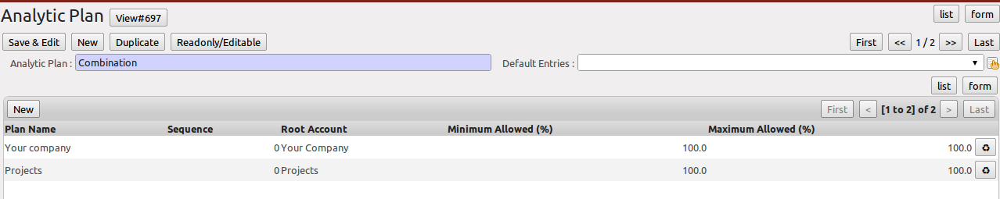
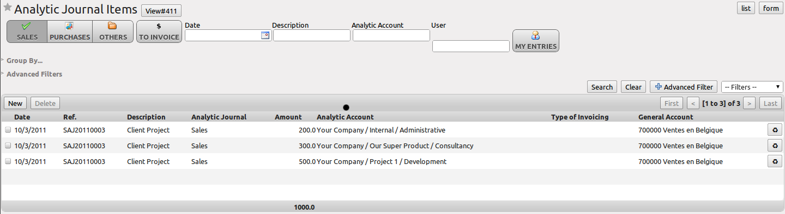

.. index::
   single: analytic; records
..

Analytic Entries
================

Integrated with General Accounting
----------------------------------

Just as in general accounting, analytic entries should be related to an account and an analytic journal.

Analytic records can be distinguished from general records by the following characteristics:

* they are not necessarily legal accounting documents,

* they do not necessarily belong to an existing accounting period,

* they are managed according to their date and not an accounting period,

* they do not generate both a debit and a credit entry, but a positive amount (income) or a negative amount (cost).

.. _fig-accanmv:

.. figure::  images/account_analytic_move.png
   :scale: 85
   :align: center

   *Analytic Account Records for a Customer Project*

The figure :ref:`fig-accanmv` represents the entries in an analytic account for a customer project.

You can see there:

* the service costs for staff working on the project,

* the costs for reimbursing the expenses of a return journey to the customer,

* purchases of goods that have been delivered to the customer,

* sales for recharging these costs.

Manual Entries
--------------

Even though most analytic entries are produced automatically by the other OpenERP documents, it is sometimes necessary to record manual entries. It is usually needed for certain analytic operations which have no counterpart in the general accounts.

To record manual entries, go to the menu :menuselection:`Accounting --> Journal Entries --> Analytic Journal Items` and click the :guilabel:`Create` button.

.. index::
   single: analytic; entries

.. note:: Analytic Entries

        To make an analytic entry, OpenERP asks you to specify a general account. This is given only for information in the different cross-reports. It will not create any new entries in the general accounts.

Select a journal and complete the different fields. Write an expense as a negative amount and income as a positive amount.

.. index::
   pair: cost; allocation

.. tip::  Entering a Date

        To enter a date in the editable list you can use the calendar widget in the web client or, in the
        GTK client, if you enter just the day of the month OpenERP automatically completes the month and
        year when you press the :kbd:`Tab` key.

.. note:: Example Cost Redistribution

        One of the uses of manual data entry for analytic operations is reallocation of costs. For
        example, if a development has been done for a given project, but can be used again for another
        project, you can reallocate part of the cost to the other project.

        In this case, make a positive entry on the first account and a negative entry for the same
        amount on the account of the second project.

Automated Entries
-----------------

Analytic accounting is totally integrated with the other OpenERP modules, so you never have to re-enter the records. They are automatically generated by the following operations:

* confirmation of an invoice generates analytic entries for sales or purchases connected to the
  account shown in the invoice line,

* the entry of a service generates an analytic entry for the cost of this service to the given project,

* the manufacturing of a product generates an entry for the manufacturing cost of each operation in the product range.

Other documents linked to one of these three operations produce analytic records indirectly. For example, when you are entering a customer sales order, you can link it to the customer's analytic account. When you are managing by case or project, mark the project with that order. This order will then generate a customer invoice, which will be linked to the analytic account. When the invoice is validated, it will automatically create general and analytic accounting records for the corresponding project.

Expense receipts from an employee can be linked to an analytic account for reimbursement. When a receipt is approved by the company, a purchase invoice is created. This invoice represents a debit on the company in favour of the employee. Each line of the purchase invoice is then linked to an analytic account which automatically allocates the costs for that receipt to the corresponding project.

To visualise the general entries following these different actions, you can use one of the following menus:

        #. To see all of the entries, :menuselection:`Accounting --> Journal Entries --> Analytic Journal Items`

        #. To see the entries per account, per user, per product or per partner, you can use the menu :menuselection:`Accounting --> Reporting --> Statistic Reports --> Analytic Entries Analysis`.

.. figure::  images/account_analytic_analysis2.png
   :scale: 85
   :align: center

   *Analytic Entries Analysis*

Analytic Models
---------------

Standard OpenERP allows you to post analytic entries to one chart at a time. Using the `Analytic Model` concept (install the option ``Multiple Analytic Plans`` from the `Add New Features` wizard), you can distribute your income or expenses to one or several analytic charts of account at the same time.
You can define the combination of analytic plans through the menu :menuselection:`Accounting --> Configuration --> Analytic Accounting --> Multi Plans --> Analytic Plan.`

   *Definition of Analytic Plan*

Using the link `Distribution Models` at the right side of the `Analytic Plan` form, you can define the distribution of either your expenses while creating a supplier invoice, or revenue when defining customer invoices.
Thanks to these models, you can have one amount distributed amongst several analytic accounts. Models can be reused, and they can be applied to one analytic chart of accounts, but also to a combination of various charts of account, such as projects and cost centers.

.. figure::  images/account_distribution_model_61.png
   :scale: 85
   :align: center

   *Definition of Distribution Models*

For example, when you create the invoice (suppose 1000 EUR) for the product ``Client Project`` with the analytic distribution defined above.

When the invoice has been validated, you can find the Analytic Journal Entries with the amount distributed amongst the analytic accounts through the menu :menuselection:`Accounting --> Journal Entries --> Analytic Journal Items.`

   *Journal Entries with Distributed Amount*

You can also specify a default `Analytic Distribution` for a particular product, partner, user and company for a specific time interval using the menu :menuselection:`Accounting --> Configuration --> Analytic Accounting --> Analytic Defaults.`

.. Copyright © Open Object Press. All rights reserved.

.. You may take electronic copy of this publication and distribute it if you don't
.. change the content. You can also print a copy to be read by yourself only.

.. We have contracts with different publishers in different countries to sell and
.. distribute paper or electronic based versions of this book (translated or not)
.. in bookstores. This helps to distribute and promote the OpenERP product. It
.. also helps us to create incentives to pay contributors and authors using author
.. rights of these sales.

.. Due to this, grants to translate, modify or sell this book are strictly
.. forbidden, unless Tiny SPRL (representing Open Object Press) gives you a
.. written authorisation for this.

.. Many of the designations used by manufacturers and suppliers to distinguish their
.. products are claimed as trademarks. Where those designations appear in this book,
.. and Open Object Press was aware of a trademark claim, the designations have been
.. printed in initial capitals.

.. While every precaution has been taken in the preparation of this book, the publisher
.. and the authors assume no responsibility for errors or omissions, or for damages
.. resulting from the use of the information contained herein.

.. Published by Open Object Press, Grand Rosière, Belgium

