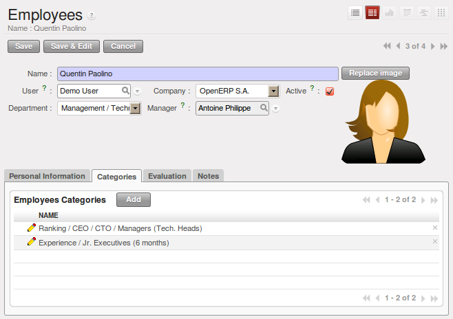
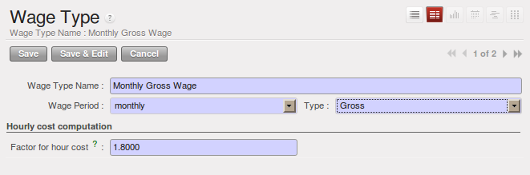

.. index::
   single: HR; management
   single: employee

Managing Human Resources
========================

To establish a system that is integrated into the company's management, you need to start with a
current list of collaborators.

.. note:: Do not confuse employees and users

	For OpenERP, “employee” represents all of the physical people who have a work contract with
	the company. This includes all types of contracts: contracts with both fixed and indeterminate time
	periods, and also independent and freelance service contracts.

	A “user” is a physical person who is given access to the company's systems. Most employees are
	users but some users are not employees: external partners can have access to parts of the system.

Here are some examples of functions which depend on the accuracy of the employee list:

* the cost of a service, which depends on the employee's working contract,

* project planning, which depends on the work pattern of the project contributors,

* the client billing rate, which probably depends on the employee's job function,

* the chain of command, or responsibilities, which is related to the hierarchical structure of the
  company.

Link employees and OpenERP users to facilitate the management of rights
-----------------------------------------------------------------------

To define a new employee in OpenERP, use the menu :menuselection:`Human Resources --> Employees`.

.. figure::  images/service_employee_form.png
   :scale: 75
   :align: center

   *Form describing an employee*

Start by entering the employee's name in :guilabel:`Name` and the company that this employee works for
in :guilabel:`Company`. You can then create a new user of the OpenERP system linked to this
employee by filling in a new :guilabel:`User` form through the :guilabel:`User` field.

Even if the employee is not a user, it is best if you
create a system access for most of your staff just so that you can control their access rights from
the outset (and you can do that through this field if you need to).

.. tip:: Employee and User link.

	If the employee has a user account on the system, you always link his or her user
	account to the employee form.

	Creating this link enables automatic completion to be done on the :guilabel:`Employee` field in the
	relevant forms, such as services and expense records.

Then enter the employee's address.

.. todo:: We need to give better guidance about Partners vs Employees just here.

This appears in the partner contact form in OpenERP. Since
employees are people that have contracts with your company, it is logical that they have entries
like any other partner in your database. So enter the name of the employee as a new partner Name and
the address in the Partner Contact section of the General tab.
Then all of the functions that apply to a partner can also be
applied to an employee. This is particularly useful for tracking debits and credits in
the accounts – so you can track salary payments, for example.

To help employees encode and validate timesheets and attendances, you can install :mod:`hr_timesheet_sheet` by selecting :guilabel:`Timesheets` in the :guilabel:`Reconfigure` wizard.
You can then set both an analytic journal and a linked product to this employee
in the :guilabel:`Timesheets` tab. If
you do it that way, then this information can be used to track services. For now, just complete the
form with the following information:

*  :guilabel:`Analytic Journal` : usually a ``Timesheet Journal``,

*  :guilabel:`Product` : a service product that describes how this employee would be charged out,
   for example as ``Service on Timesheet``.

.. index::
   single: employee; billing

Define employees' billing prices and costs
------------------------------------------

To be able to use the timesheets at all, you must first define those employees who are system users.
The employee definition forms contain the information necessary to use that sheet, such as the job
title, and hourly costs.

Two fields will be of particular interest to you for managing timesheets: the :guilabel:`Analytic
Journal` and the :guilabel:`Product`.

All the analytic entries about the costs of service times will be stored in the analytic journal.
These enable you to isolate the cost of service from other company costs, such as the purchase of raw
materials, expenses receipts and subcontracting. You can use different journals for each employee to
separate costs by department or by function.

The employee is also associated with a product in your database in OpenERP. An employee is linked
with a product, so they can be 'bought' (subcontracting) or 'invoiced' (project management). You have
to create a product for each job type in your company.

The following information is important in the product form:

*  :guilabel:`Name` : \ ``Secretary`` \,  \ ``Salesperson`` \ or \ ``Project Manager``\

*  :guilabel:`Product Type` : \ ``Service``\

*  :guilabel:`Unit of Measure` : \ ``Hour`` \ or \ ``Day``\

*  :guilabel:`Cost Price`

*  :guilabel:`Sale Price`

*  :guilabel:`Costing Method` : either \ ``Standard Price``\  or  \ ``Average Price``\

.. index::
   single: module; product_index

.. tip:: Price Indexation

	When the `Costing Method` is `Average Price` in the `Product` form, you can have a button :guilabel:`Update`, beside the `Cost Price` field, that opens up a wizard for changing the cost price.

In summary, each company employee corresponds, in most cases, to:

* a :guilabel:`Partner`

* an :guilabel:`Employee` form,

* a :guilabel:`System User`.

And each company job position corresponds to a :guilabel:`Product`.

.. index::
   single: module; hr_contract

.. note:: Time Charge Rates

	By default, the hourly cost of an employee is given by the standard cost of the product linked to
	that employee.
	But if you install the :mod:`hr_contract` module, it is possible to manage contracts differently.
	The hourly cost of the employee is then automatically calculated from their employment contract
	when they enter their timesheet data.

	To do this, the software uses a factor defined in the contract type
	(for example, the gross monthly salary, calculated per day).
	Ideally, this factor should take into account the salary costs, taxes, insurances and other
	overheads associated with pay.

.. index::
   single: employee; categories

Define employee categories to assign different Holiday’s rights to different employee groups
--------------------------------------------------------------------------------------------

You must create and assign employee categories for employees in order to be able to assign and manage leave and allocation requests by category. You can define employee categories from :menuselection:`Human Resources --> Configuration --> Human Resources --> Employees --> Categories of Employee`. For a new category, define its name in :guilabel:`Category`. A category may also be assigned a :guilabel:`Parent Category`.

.. figure::  images/employee_categories.png
   :scale: 75
   :align: center

   *Example of categories defined for employees*

To link an employee to a category, open the employee form through :menuselection:`Human Resources --> Human Resources --> Employees`. In the :guilabel:`Categories` tab, you can assign more than one category to an employee by clicking :guilabel:`Add` and selecting a category.

   *Assign categories to an employee in the Employee form*

Now, when you create a new leave or allocation request from the menuitems under :menuselection:`Human Resources --> Holidays`, if your :guilabel:`Leave Category` or :guilabel:`Allocation Category` is ``By Employee Category``, then you must choose a pre-defined :guilabel:`Category`. The request will then be applicable to all those employees who belong to the category selected. For example, you can create an allocation request for employees belonging to the ``Trainee`` category, entitling them to fewer leaves than the rest of the employees.

.. index::
   single: employee; contracts

Define contract types and wage types with start and end dates for contracts as well as trial periods
----------------------------------------------------------------------------------------------------

If you install the :mod:`hr_contract` module you can link contract details to the employee record.
The configuration wizard to install this module is shown below.

.. figure::  images/config_wiz_contract.png
   :scale: 75
   :align: center

   *Configuration wizard to install hr_contract*

Define new contract types at :menuselection:`Human Resources --> Configuration --> Human Resources --> Contract --> Contract Types`.

.. figure::  images/hr_contract_type_list.png
   :scale: 75
   :align: center

   *Contract Types list*

You may similarly define wage types at :menuselection:`Human Resources --> Configuration --> Human Resources --> Contract --> Wage Type`. Enter the following details in the form:

*  :guilabel:`Wage Type Name` : A name for the wage type.
*  :guilabel:`Wage Period` : Select a pre-defined wage period. Wage periods are defined at :menuselection:`Human Resources --> Configuration --> Human Resources --> Contract --> Wage period`.
*  :guilabel:`Type` : Either ``Gross`` or ``Net``.
*  :guilabel:`Factor for hour cost` : Used by the timesheet system to compute the price of an hour of work based on the contract of an employee.

   *Wage Type form*

Using :menuselection:`Human Resources --> Human Resources --> Contracts` you can create and edit contracts.

.. figure::  images/service_hr_contract.png
   :scale: 75
   :align: center

   *Definition of a working contract for a given employee*

You can enter information about the employment contract for the employee, such as:

*  :guilabel:`Contract Reference`

*  :guilabel:`Job Title`

*  :guilabel:`Working Schedule`

*  :guilabel:`Start Date`

*  :guilabel:`End Date`

*  :guilabel:`Wage Type` : Select one from pre-defined wage types.

*  :guilabel:`Contract Type` : Select one from pre-defined contract types.

*  :guilabel:`Trial Start Date` : Start date for the contract trial period, if any.

*  :guilabel:`Trial End Date` : End date for the contract trial period, if any.

.. index::
   single: employee; sign in / sign out

Manage attendance (Sign in / Sign out)
--------------------------------------

In some companies, staff have to sign in when they arrive at work and sign out again at the end of
the day. If each employee has been linked to a system user, then they can sign into OpenERP by
using the menu :menuselection:`Human Resources --> Attendances --> Sign in / Sign out`.

If an employee has forgotten to sign out on leaving, the system proposes that they sign out manually
and type in the time that they left when they come in again the next day. This gives you a simple way
of managing forgotten sign-outs.

Find employee attendance details from their forms in
:menuselection:`Human Resources --> Employees`.

To get the detail of attendances from an employee's form in OpenERP, you can use the
available reports:

*  :guilabel:`Attendances By Month`

*  :guilabel:`Attendances By Week`

*  :guilabel:`Attendance Error Report`

The last report highlights errors in attendance data entry.
It shows you whether an employee has entered the time of
entry or exit manually and the differences between the actual and expected sign out time and the sign in time.

The second report shows the attendance data for the selected month.

.. Copyright © Open Object Press. All rights reserved.

.. You may take electronic copy of this publication and distribute it if you don't
.. change the content. You can also print a copy to be read by yourself only.

.. We have contracts with different publishers in different countries to sell and
.. distribute paper or electronic based versions of this book (translated or not)
.. in bookstores. This helps to distribute and promote the OpenERP product. It
.. also helps us to create incentives to pay contributors and authors using author
.. rights of these sales.

.. Due to this, grants to translate, modify or sell this book are strictly
.. forbidden, unless Tiny SPRL (representing Open Object Press) gives you a
.. written authorisation for this.

.. Many of the designations used by manufacturers and suppliers to distinguish their
.. products are claimed as trademarks. Where those designations appear in this book,
.. and Open Object Press was aware of a trademark claim, the designations have been
.. printed in initial capitals.

.. While every precaution has been taken in the preparation of this book, the publisher
.. and the authors assume no responsibility for errors or omissions, or for damages
.. resulting from the use of the information contained herein.

.. Published by Open Object Press, Grand Rosière, Belgium

