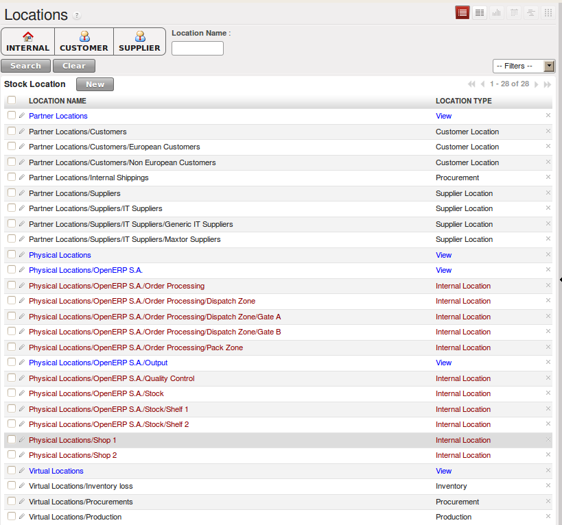

.. index::
   single: Logistics
   single: Stock Management

.. _ch-stocks:

**************
Your Warehouse
**************

 *OpenERP's stock management is at once very simple, flexible and complete.
 It is based on the concept of double entry that revolutionized accounting.
 The system can be described by Lavoisier's maxim “nothing lost, everything changed” or, better,
 “everything moved”. In OpenERP you do not talk of disappearance, consumption or loss of products:
 instead you speak only of stock moves from one place to another.*

Just as in accounting, the OpenERP system manages counterparts to each of its main operations such as
receipts from suppliers, deliveries to customers, profit and loss from inventory, and consumption
of raw materials. Stock movements are always made from one location to another. To satisfy the need
for a counterpart to each stock movement, the software supports different types of stock locations:

* Physical stock locations,

* Partner locations,

* Virtual locations as counterparts for procurement, production and inventory.

Physical locations represent warehouses and their hierarchical structure. These are generally the
locations that are managed by traditional stock management systems.

Partner locations represent your customers' and suppliers' stocks. To reconcile them with your
accounts, these stores play the role of third-party accounts. Reception from a supplier can be shown
by the movement of goods from a partner location to a physical location in your own company. As you
see, supplier locations usually show negative stocks and customer locations usually show positive
stocks.

Virtual locations as counterparts for production are used in manufacturing operations. Manufacturing is
characterized by the consumption of raw materials and the production of finished products. Virtual
locations are used for the counterparts of these two operations.

Inventory locations are counterparts of the stock operations that represent your company's profit
and loss in terms of your stocks.

The figure :ref:`fig-stloctree` shows the initial configuration of the locations when the software is
installed (:menuselection:`Warehouse --> Warehouse Management --> Locations`).

.. _fig-stloctree:

   *Location Structure when OpenERP has just been installed*

.. note::  Hierarchical Stock Locations

    In OpenERP, locations are structured hierarchically.
    You can structure your locations as a tree, dependent on a parent-child relationship.
    This gives you more detailed levels of analysis of your stock operations and the organization of
    your warehouses.

.. tip:: Locations and Warehouses

    In OpenERP a **Warehouse** represents the place where your physical stock is stored.
    A warehouse can be structured into several locations at multiple levels.
    Locations are used to manage all types of storage places, such as at the customer and production
    counterparts.

For this chapter you can continue using the database with demo data from a previous chapter or start with a fresh database that includes demo data,
with Warehouse Management and its dependencies installed and any chart of accounts configured.

In this chapter, the following modules will be used:

.. table:: List of modules

   ======================================= ===================================================================
   Name                                    Description
   ======================================= ===================================================================
   :mod:`stock`                            to handle the stock functions
   :mod:`stock_planning`                   to define planning on products
   :mod:`stock_location`                   to define pull and push flows
   :mod:`delivery`                         to define delivery methods and costs
   :mod:`account_anglo_saxon`              to illustrate the valuation according to the anglo-saxon principles
   :mod:`sale_journal`                     to handle stock by journal
   :mod:`mrp_jit`                          to illustrate the just-in-time functionality
   :mod:`sale_supplier_direct_delivery`    to directly deliver the product from the supplier to the customer
   ======================================= ===================================================================

.. raw:: html

    

.. toctree::

    5_14_Stock_illustration
    5_14_Stock_inv
    5_14_Stock_mvts
    5_14_Stock_production
    5_14_Stock_traceability
    5_14_Stock_financial
    5_14_Stock_journals
    5_14_Stock_delivery_date
    5_14_Stock_import
    5_14_Stock_Location_Ex

.. raw:: html

    

.. Copyright © Open Object Press. All rights reserved.

.. You may take electronic copy of this publication and distribute it if you don't
.. change the content. You can also print a copy to be read by yourself only.

.. We have contracts with different publishers in different countries to sell and
.. distribute paper or electronic based versions of this book (translated or not)
.. in bookstores. This helps to distribute and promote the OpenERP product. It
.. also helps us to create incentives to pay contributors and authors using author
.. rights of these sales.

.. Due to this, grants to translate, modify or sell this book are strictly
.. forbidden, unless Tiny SPRL (representing Open Object Press) gives you a
.. written authorisation for this.

.. Many of the designations used by manufacturers and suppliers to distinguish their
.. products are claimed as trademarks. Where those designations appear in this book,
.. and Open Object Press was aware of a trademark claim, the designations have been
.. printed in initial capitals.

.. While every precaution has been taken in the preparation of this book, the publisher
.. and the authors assume no responsibility for errors or omissions, or for damages
.. resulting from the use of the information contained herein.

.. Published by Open Object Press, Grand Rosière, Belgium

