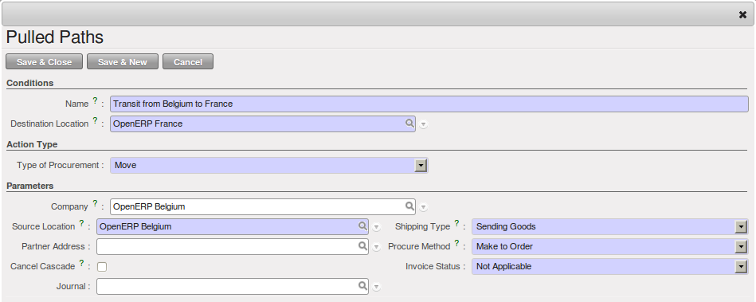

Product
-------

Definition
^^^^^^^^^^

Now that we have defined the different actors, we can define our product that will be stored in Belgium and proposed to sell in
France. Go to :menuselection:`Sales --> Products --> Products` and create a new product with the following specifications:

.. figure:: images/product.png
   :scale: 75
   :align: center
   
   *Defining Products*
   
In the ``Suppliers`` tab, you can select the supplier defined above. In the tab ``Logistical Flows``, we will define 
the different flows in order to share the different objects between the companies. To order the product in Belgium from a sales order made in France, we will define a `Pull flow`.

Flows
^^^^^

In our process, we have to create a pull flow, because the process begins with a need from OpenERP France. OpenERP France needs some 
products ordered by the customers.

The flow will go through our two child companies. The starting point is OpenERP Belgium that will supply OpenERP France that will 
supply the goods to the customer.

We can draw the process like this: Customer <-- [OpenERP France] <-- [OpenERP Belgium] <-- Supplier

   
   *Pull Flow Definition*

.. Copyright © Open Object Press. All rights reserved.

.. You may take electronic copy of this publication and distribute it if you don't
.. change the content. You can also print a copy to be read by yourself only.

.. We have contracts with different publishers in different countries to sell and
.. distribute paper or electronic based versions of this book (translated or not)
.. in bookstores. This helps to distribute and promote the OpenERP product. It
.. also helps us to create incentives to pay contributors and authors using author
.. rights of these sales.

.. Due to this, grants to translate, modify or sell this book are strictly
.. forbidden, unless Tiny SPRL (representing Open Object Press) gives you a
.. written authorisation for this.

.. Many of the designations used by manufacturers and suppliers to distinguish their
.. products are claimed as trademarks. Where those designations appear in this book,
.. and Open Object Press was aware of a trademark claim, the designations have been
.. printed in initial capitals.

.. While every precaution has been taken in the preparation of this book, the publisher
.. and the authors assume no responsibility for errors or omissions, or for damages
.. resulting from the use of the information contained herein.

.. Published by Open Object Press, Grand Rosière, Belgium
