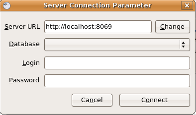

=========
RAD Tools 
=========

DIA
===
	
The uml_dia module helps to develop new modules after an UML description using the DIA tool (http://www.gnome.org/projects/dia).

It's not a typical module in the sense that you don't have to install it on the server as another module. The contents of the module are just a python script for dia (codegen_openerp.py), a test dia diagram and the module generated by the test.

The module is located in the extra_addons branch: https://code.launchpad.net/openobject-addons

To use the module you need to make **codegen_openerp.py** accessible from dia, usually in your **/usr/share/dia/python** directory and make sure that it gets loaded once. To do it, just open dia and open a **Python Console** from the **Dialog Menu**, and type there "import codegen_openerp". If everything goes alright you will have a new option in your "Export..." dialog named "PyDia Code Generation (OpenERP)" that will create a zip module from your UML diagram.

To install win Dia in windows, first install Python-2.3.5, then when you install Dia, you will have an option to install the python plug-in. After this, put the codegen_openerp.py file in **C:\\Program Files\\Dia** and you will have the export function in Dia.

For further guidance to install Dia in Windows you can refer to this link	(http://openerpdev.blogspot.com/2009/11/rad-with-openerp.html)

If you find that the zip file is corrupt, use DiskInternals ZipRepair utility to repair the zip file before you'll be able to import it - make sure the zip file you import has the same name you saved as. 

Open Office Report Designer
===========================

Installation
------------
Openoffice.org Report Designer plugin is very easy to install and use. The plugin is a bundle of two files: openofficereport.zip and Makefile. We have installation procedure.

* Install using Extension Manager in Openoffice.org Writer

Installing by Extension Manager is interactive installation procedure, for installation you
have to use Tools -> Extension Manager provided by Openoffice.org Writer.

.. image:: images/1_1.png

In Extension Manager you have Add button, by clicking add button you will get opendialog box from which you will have to select ".zip" file.

.. image:: images/1_2.png

After installation you will get OpenERP Report Menu and its Toolbar in Openoffice.org Writer.

.. image:: images/2.png

Server Parameters
-----------------
This Functionality is used to connect with OpenERP Server with different login mode.
You can access that functionality by clicking on OpenERP button on toolbar or just go to
Open Report > Server Parameters.

The screen will look like

After giving proper Server URL you can select Database available in selected server and login as the given user.

There is one additional functionality of changing server parameters by clicking on 'Change' button

.. image:: images/3_1.png

Open a New report
-----------------

You can open this dialog box by clicking on Open Report -> Open a new report

.. image:: images/4.png

By using above window you can select module for which you want to create report.
This is first process to create new report, so you have to select module. By clicking on
'Use Module in Report' selected module will be used to create report.

Add a loop
----------
This functionality is used to create repeatIn statement in Open Report. You see this
dialog box by clicking on Open Report -> Add a loop from menubar or just on this
button from toolbar.
* The loop can be put into a table (the lines will then be repeated) or into an OpenOffice.org section.

.. image:: images/5.png

After click on 'ok' button you will get repeatIn object just like displayed below.

.. image:: images/5_1.png

Above report statement is written in Input Field a special functionality available in
Openoffice.org. In which main statement available in background and it will display
some English type of name as here displayed | .partner.|

Add a field
-----------
This functionality is used to create field statement in OpenReport. You see this dialog box
by clicking on Open Report > Add a field from menubar or just this
button from toolbar. Also select the multiple field .

.. image:: images/6.png

Add an expression
-----------------

This functionality is used to create expression which we can not add by using fields in
Open Report. You see this dialog box by clicking on OpenReport - >Add an expression from menubar.

* Using the Expression button you can enter expressions in the Python language. These expressions can use all of the object's fields for their calculations. For example if you make a report on an order you can use the following expression:

.. code-block:: python

  '%.2f' % (amount_total * 0.9,)

.. *

In this example, amount_total is a field from the order object. The result will be 90% of the total of the order, formatted to two decimal places.

.. image:: images/7.png

After click on 'ok' button you will get expression object just like displayed below

.. image:: images/7_1.png

Add lang tag
------------
As OpenERP can be used in several languages, reports must be translatable.
But in a report, everything mustn't be translated: only the actual text and not the
formatting codes. A field will be processed by the translation system if the XML tag
which surrounds it (whatever it is) has a t="1" attribute. The server will translate all the
fields with such attributes in the report generation process.
It create the set Lang tag.

.. image:: images/8.png

Modify
------

This functionality is used to modify existing repeatIn, Fields, or Expression in Open
Report.
* This functionality will work with cursor you have to place your current cursor before the report statement and it will open dialog box after detecting that statement is either Expression, RepeatIn or Fields.

* You see this dialog by clicking on Open Report -> Modify from menubar. 

.. image:: images/9.png

After placing your cursor at the beginning of the report statement press modify button
from toolbar or click on Open Report -> Modify . It will detect the type of that statement
weather its is Field, Expression or RepeatIn and generate window accordingly as
displayed below give following window.

.. image:: images/10.png

Conversion Fields > Brackets
----------------------------

The purpose of this functionality is mapping old (use bracket for writing report
statement) and new (use input filed for writing report statement). So whenever you want
to convert your new report statement to old fashion then you can use this method. if you
want to access this functionality you can click on OpenReport > Conversion Fields >
Bracket from menubar.

.. image:: images/11.png

Conversion Brackets > Fields
-----------------------------

This is reverse functionality in which you can change your old-format report into new
format. If you want to access this functionality you can click on Open Report > Conversion
Bracket > Fields from menubar.

.. image:: images/12.png

Add Attachment
--------------

You can attach the report with record using attachment and the model which add in
base_model are displayed in list.
Note: Server side Add the base_model module this module available in trunk-extra-addons and add the model name which display in Add Attachment.

.. image:: images/13.png

.. image:: images/14.png

Export to RML
-------------
* This functionality is used to generate rml from sxw. 
* You Can access this tool from Open Report -> Export to RML in menubar.
* The basic feature of this functionality is now you can create your rml file in just few mouse clicks. The  main requirements of this utility is you must have to save your report in Open Server using Send to the Server functionality. 
* When you click on Export to RML It will open save file dialog box in which you can specify file name and destination of rml file to save

Send to the Server
-------------------
This is the most important functionality available in Open Report Design tools
* The basic feature of this functionality is to add new report or update existing report to Open Servein RML as well as SXW format.
* You can access this feature by using clicking on Open Report > Send to the Server in menubar *

.. image:: images/15.png

Modify Existing Report
-----------------------

Openoffice.org Report Design tool provide functionality of modify existing report which
is already available in Open server and also delete the report from database. You can
access this feature by using clicking on OpenReport > Modify Existing Report in
menubar. By clicking on Modify Existing Report I will display dialog box displayed
below.

.. image:: images/16.png

It will open existing report and you can delete the existing report.
By clicking on Save to Temp Directory button you will get opened report in new writer
window as displayed below.

.. image:: images/17.png

About
------
The about window shows version and copyright information. You can access it from Open
Report> About in menu bar.

.. image:: images/18.png

