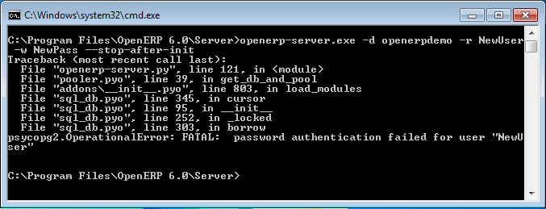

.. index::
   single: Installation; Windows installation quirks
.. 

.. _troubleshooting-and-windows-complementary-install-information:

Troubleshooting and Windows Complementary Install Information
=============================================================

PostgreSQL Administration
+++++++++++++++++++++++++

OpenERP Server Connection Error with PostgreSQL
"""""""""""""""""""""""""""""""""""""""""""""""

If you are initializing a database from the command-line with a custom username/role (-r) and password (-w), ensure that you have created a corresponding PostgreSQL user for the same.
Otherwise you may encounter error messages as shown below:

*User authentication failure*

You may also face another problem similar to this situation:

.. figure:: ../../img/101_erp2pgsql_conn_fail.png
   :scale: 50
   :align: center

*Database connection failure*

In this case, check if the service ``postgresql-9.0 - PostgreSQL Server 9.0`` is running in the Services Manager (:menuselection:`Control Panel --> System and Security --> Administrative Tools --> Services`).

.. figure:: ../../img/Pgsql_51_service_status.png
   :scale: 50
   :align: center

*PostgreSQL 9.0 in the Services list*

You can edit the service configuration to start PostgreSQL as a service on system boot. This is usually the default.

.. figure:: ../../img/Pgsql_53_service_start_mode.png
   :scale: 50
   :align: center

*Configure PostgreSQL 9.0 service*

If your PostgreSQL service is running, but you get connection errors, you can restart the service.

.. figure:: ../../img/Pgsql_52_service_restart.png
   :scale: 50
   :align: center

*Restarting the service*

