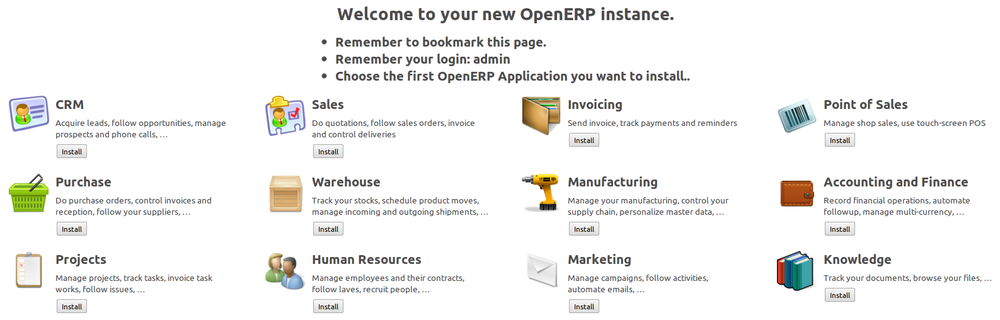
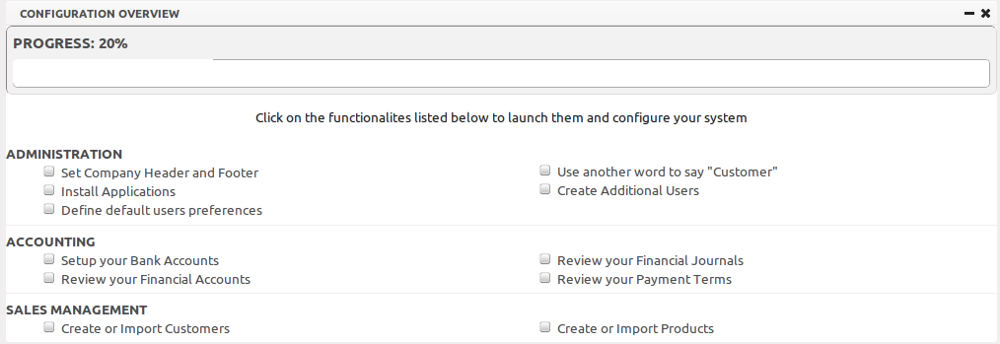

.. index:: setup

#############
Initial Setup
#############

OpenERP is an impressive software system, being easy to use and yet providing great benefits
in helping you manage your company.
It is easy to install under both Windows and Linux compared with other enterprise-scale systems,
and offers unmatched functionality.

.. index::
   single: Installation
   single: Initial Setup
   pair: configuration; setup

Whether you want to test OpenERP or put it into full production, you have at least two possible starting
points:

* you can use OpenERP Online by subscribing to http://www.openerp.com/online/;

* you can install the solution on your own computers to test it in your company's system environment.

In this chapter, the easy-to-use *OpenERP Online* solution will be briefly explained. For more information about installing OpenERP on your computer, please refer to the on line documentation.

.. note:: Some Interesting Websites from OpenERP

   * Main Site: http://www.openerp.com,

   * OpenERP Online Site: http://www.openerp.com/online,

   * Online demo at http://demo.openerp.com,

   * Documentation site: http://doc.openerp.com,

   * Modules and Extra Features: http://apps.openerp.com,

   * Community discussion forum where you can often receive assistance: http://www.openerp.com/forum.

Use OpenERP Online
------------------

.. index::
   single: OpenERP Online

Nothing is easier for you to discover OpenERP than subscribing to the OpenERP Online offer. You just need a web browser to get started.

The Online service can be particularly useful to small companies, that just want to get going quickly at low cost.
You have immediate access to OpenERP's Integrated Management System built on the type of enterprise architecture used in many organizations.

OpenERP's Online offer includes several services: hosting at high bandwidth, database management, stable security update, backups, maintenance (24/7 server monitoring), bug fixing and migrations.

OpenERP guarantees that the software running on OpenERP Online is exactly the same as the Open Source official
version of OpenERP. Any improvement made on OpenERP will be available online. This allows you to easily switch from the online version to the local version anytime.

So even if the OpenERP Online solution might be the best solution to suit your needs today, you can easily switch to an installation on your own servers according to your company's changing requirements or growth. You are also able to change your service provider
anytime, while continuing to use the exact same system. Hence, you do not depend on your host. In addition, OpenERP works with standard and open formats and programming languages which allow
you to export your data and use them in any other software.

These advantages give you total control over your data, your software, your platform.

.. figure:: images/start_saas.jpeg
   :align: center
   :scale: 90

   *Subscribe and Start with OpenERP Online*

If you want to start working with the online platform, you can navigate to http://www.openerp.com/online or click the ``Subscribe & Start`` button from http://www.openerp.com. After successful registration, you will be able to configure and use OpenERP online. To log in to your OpenERP Online account, you will receive a username and password. You can build the software to fit your needs, at your own pace!

OpenERP Online - Software as a Service - is hosted by OpenERP and paid in the form of a monthly subscription. The pricing model is extremely simple. OpenERP charges a fixed fee per month per user. You will get an invoice each month according to the number of users registered in the system at that time. If you add new users during the next 30 days, they will only be charged with the next invoice.
You can find the details of current pricing and payment options at http://www.openerp.com/online.

.. tip:: Free Trial

       For a month's free trial, check out OpenERP's http://www.openerp.com/online, which enables you to get started quickly without incurring costs for integration or for buying computer systems. After the free trial expires, you can easily continue using OpenERP Online.

Initial Configuration of Your Instance
--------------------------------------

If you want to focus on your customers, you need tools: to capture all the knowledge you have available; to help you analyse what you know; to make it easy to use all of that knowledge and analysis. OpenERP invites you to discover the Accounting & Financial Management Business Application!

In this chapter, you can start exploring OpenERP!

Use a web browser of your choice to connect to OpenERP Web.

   *Welcome Page*

At first, the welcome page will allow you to install the Business Applications you need. For more information about other business applications than ``Accounting & Financial Management``, we refer to the existing books available from the OpenERP website (http://www.openerp.com, ``Buy`` tab).

To install an easy system to keep track of your accounting, click the ``Install`` button below the icon :guilabel:`Invoicing`.
To install :guilabel:`Financial Management`, click the ``Install`` button below the icon :guilabel:`Accounting and Finance`.

.. tip:: Change from Invoicing to Financial Management

    By changing the access rights of a user, you can easily switch from Invoicing (access rights Invoicing & Payments) to Accounting and Finance (access rights Accountant or Manager). 

For this quick start we will install ``Invoicing``.

OpenERP suggests that you configure your database using a series of questions. In the software, these series of questions are managed through so-called ``Configuration Wizards``.

Select the ``Chart of Accounts`` if you want to install a predefined chart of accounts. You can select from a list of localised charts of accounts. Select for instance the ``Belgium - Plan Comptable Minimum Normalise`` chart. Click ``Configure`` to install the selected chart of accounts.

Now OpenERP will show you the home page with two buttons, i.e. :guilabel:`Accounting` and :guilabel:`Settings`. Click the ``Settings`` button to check your configuration. In this dashboard, you can also see a progress bar indicating the elements you already configured.

   *Settings Home Page*

Click the option ``Set Company Header and Footer`` to indicate what should be printed in the company header and footer of your reports. You can enter address data for your company, create your bank accounts, and much more. When you are finished configuring the company header and footer, you can return to the ``Settings`` dashboard by clicking the :guilabel:`Settings` button at the top of the screen. Now simply check the box in front of this option to indicate that the company header and footer have been completed.

In case you want to add extra features, such as **Sales and Purchase Management**, click ``Install Applications`` from the :guilabel:`Settings` dashboard to enrich your software with more business applications.

You can also decide about your default user preferences, such as what will your user interface look like, will the screens only show the most important fields - ``Simplified`` - or also fields for the more advanced users, the ``Extended`` view. You can also define your user language and time zone (very convenient when scheduling meetings). By default, OpenERP will display interesting and helpful tips when you open a screen (option which can be unchecked). As soon as you finish this wizard, the system will automatically check the box, to indicate that configuration is completed.

.. tip:: User Preferences

       You can easily switch from ``Simplified`` to ``Extended`` view by changing your `User Preferences` (the :guilabel:`Preferences` button next to the :guilabel:`Home` button).

Not every company calls its customers "Customers", so there is a configuration option which lets you choose different labels for customers (and suppliers, according to the business applications installed). Click the option ``Use another word to say Customer`` if you want to change this. As soon as you finish this wizard, the system will automatically check the box, to indicate that configuration is completed.

You can easily create more users with the ``Create Additional Users`` option if needed.

From the ``Accounting`` part, you can configure your company's bank accounts, review your accounts and journals, as well as your payment terms.

By configuring your company's bank accounts, you can have the software automatically create a bank journal for you. Select the bank account type, type the account number and the Bank Name, and when you save the entry, your Bank Journal will automatically be created with the Bank Name and the Account Number. The general ledger account for this bank will also be created for you.

.. tip:: Simplified or Extended view

    In ``Simplified`` view, you will not see the bank journal. Switch to ``Extended`` view first.

When you click the ``Review your Financial Journals`` option in the ``Accounting`` part, you will notice that OpenERP will propose basic journals, such as purchase, sales and miscellaneous journals. You can easily change them and add new journals according to your needs.

OpenERP also comes with some standard payment terms, allowing you to start really quickly.

You will see the progress bar move as you check configuration options.

OpenERP's modularity enables you to install a single Business Application (such as *Accounting*) if that is all you need.
Of course, you can choose to also install Sales Management, for instance, to handle quotations, sales orders and sales invoices as well.

.. tip:: Reconfigure

      Keep in mind that you can change or reconfigure the system any time through the `Add More Features` option in the main toolbar.

When you choose a business application for installation, OpenERP will automatically propose to add or configure related (smaller) applications to enrich your system.

.. Copyright © Open Object Press. All rights reserved.

.. You may take electronic copy of this publication and distribute it if you don't
.. change the content. You can also print a copy to be read by yourself only.

.. We have contracts with different publishers in different countries to sell and
.. distribute paper or electronic based versions of this book (translated or not)
.. in bookstores. This helps to distribute and promote the OpenERP product. It
.. also helps us to create incentives to pay contributors and authors using author
.. rights of these sales.

.. Due to this, grants to translate, modify or sell this book are strictly
.. forbidden, unless Tiny SPRL (representing Open Object Press) gives you a
.. written authorisation for this.

.. Many of the designations used by manufacturers and suppliers to distinguish their
.. products are claimed as trademarks. Where those designations appear in this book,
.. and Open Object Press was aware of a trademark claim, the designations have been
.. printed in initial capitals.

.. While every precaution has been taken in the preparation of this book, the publisher
.. and the authors assume no responsibility for errors or omissions, or for damages
.. resulting from the use of the information contained herein.

.. Published by Open Object Press, Grand Rosière, Belgium

