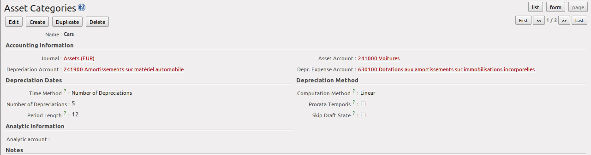
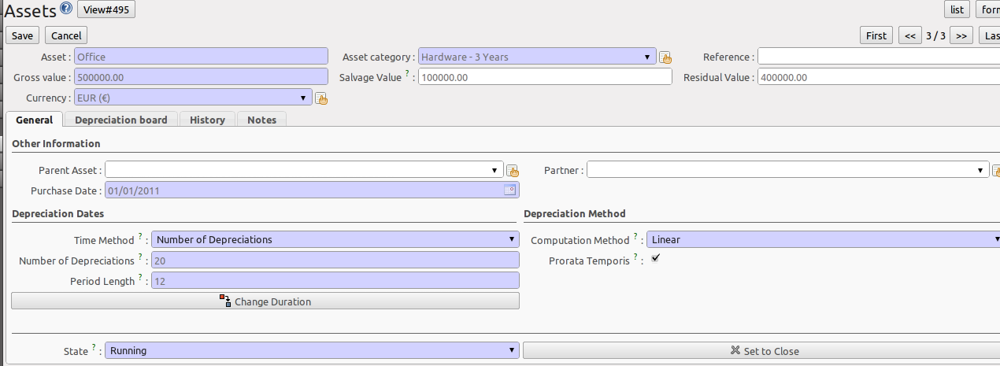
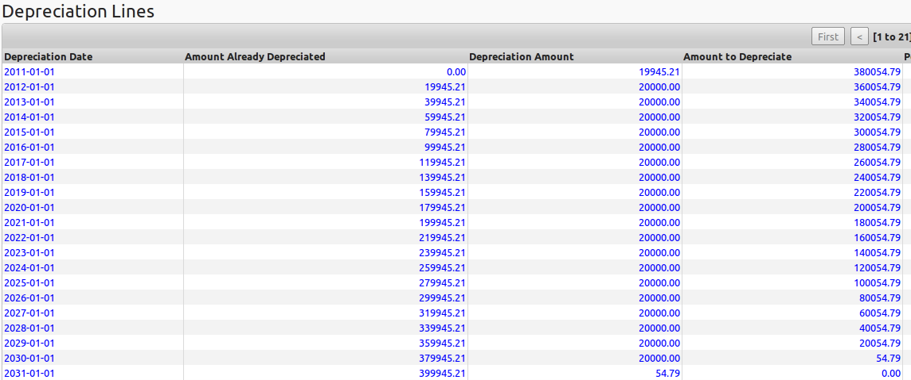

.. index::
   single: Assets
   single: Asset Management

********************
Managing your Assets
********************

    *Easily manage your assets with OpenERP. This module is fully integrated with the financial and analytic accounting modules for a maximum of power. Manage the assets owned by your company and keep track of depreciation occurred on those assets. Of course, the system also allows you to create accounting moves of the depreciation lines.*

Asset Management in OpenERP allows you to:

* Have different depreciation methods,
* Compute the depreciation according to the time period and the depreciation method specified,
* Keep track of all accounting entries based on the value,
* Have a fully integrated system with the financial and analytic accounting modules,
* Track changes on assets from any document in OpenERP.

You can manage your assets and the related accounting entries with the :mod:`account_asset` module.

From the menu :menuselection:`Accounting --> Assets --> Assets` you can store all information related to your assets. How much will be depreciated, what will be the depreciation amount based on the selected depreciation method, what is the date on which the asset is purchased, the purchase value of the asset, the supplier of the asset, etc.

You can also see different states of assets. If the asset is confirmed, the depreciation lines may be posted in the accounting system.
An asset can be closed manually when depreciation is over or it will be closed automatically when the last depreciation line is posted.

The asset hierarchy is shown through the menu :menuselection:`Accounting --> Assets --> Asset Hierarchy`.

Statistical reporting about assets can be called from the menu :menuselection:`Accounting --> Reporting --> Statistic Reports --> Assets Analysis`.

Depreciation Methods
--------------------

The linear, or straight-line depreciation in the words of Wikipedia: <http://en.wikipedia.org/wiki/Depreciation#Straight-line_depreciation>

    Straight-line depreciation is the simplest and most-often-used technique, in which the company estimates the salvage value of the asset at the end of the period during which it will be used to generate revenues (useful life) and will expense a portion of original cost in equal increments over that period. The salvage value is an estimate of the value of the asset at the time it will be sold or disposed of; it may be zero or even negative. Salvage value is also known as scrap value or residual value.

    Straight-line method:
        (Annual Depreciation Expense = Cost of Fixed Asset - Residual Value) / Useful Life of Asset (years)

    For example, a vehicle that depreciates over 5 years, is purchased at a cost of € 17,000, and will have a salvage value of € 2000, will depreciate at € 3,000 per year: (€ 17,000 € 2,000) / 5 years = € 3,000 annual straight-line depreciation expense. In other words, it is the depreciable cost of the asset divided by the number of years of its useful life.

    This table illustrates the straight-line method of depreciation. Book value at the beginning of the first year of depreciation is the original cost of the asset. At any time book value equals original cost minus accumulated depreciation.

    book value = original cost - accumulated depreciation
        Book value at the end of year becomes book value at the beginning of next year. The asset is depreciated until the book value equals scrap value.

    If the vehicle were to be sold and the sales price exceeded the depreciated value (net book value) then the excess would be considered a gain and subject to depreciation recapture. In addition, this gain above the depreciated value would be recognized as ordinary income by the tax office. If the sales price is ever less than the book value, the resulting capital loss is tax deductible.  If the sales price were ever more than the original book value, then the gain above the original book value is recognized as a capital gain.

    If a company chooses to depreciate an asset at a different rate from that used by the tax office then this generates a timing difference in the income statement due to the difference (at a point in time) between the taxation department's and company's view of the profit.

The degressive, or declining-balance depreciation method in the words of Wikipedia: <http://en.wikipedia.org/wiki/Depreciation#Straight-line_depreciation>

    Depreciation methods that provide for a higher depreciation charge in the first year of an asset's life and gradually decreasing charges in subsequent years are called accelerated depreciation methods.
    This may be a more realistic reflection of an asset's actual expected benefit from the use of the asset: many assets are most useful when they are new.
    One popular accelerated method is the *declining-balance method*. Under this method the book value is multiplied by a fixed rate.

    Annual Depreciation = Depreciation Rate x Book Value at Beginning of Year

    The most common rate used is double the straight-line rate. For this reason, this technique is referred to as the double-declining-balance method. To illustrate, suppose a business has an asset with € 1,000 original cost, € 100 salvage value, and 5 years useful life.
    First, calculate straight-line depreciation rate. Since the asset has 5 years useful life, the straight-line depreciation rate equals (100% / 5) 20% per year. With double-declining-balance method, as the name suggests, double that rate, or 40% depreciation rate is used.

    When using the double-declining-balance method, the salvage value is not considered in determining the annual depreciation, but the book value of the asset being depreciated is never brought below its salvage value, regardless of the method used. The process continues until the salvage value or the end of the asset's useful life, is reached. In the last year of depreciation a subtraction might be needed in order to prevent book value from falling below estimated Scrap Value.

.. note:: From double-declining to straight-line depreciation

    Since double-declining-balance depreciation does not always depreciate an asset fully by its end of life, some methods also compute a straight-line depreciation each year, and apply the greater of the two. This has the effect of converting from declining-balance depreciation to straight-line depreciation at a midpoint in the asset's life. This is the way degressive depreciations are handled in Belgium and in France, for instance.
    Note that this method is not implemented in OpenERP.

Asset Categories
----------------

Asset categories contain the general accounting information and default depreciation rules for assets. They can be used as defined, but you can also adapt a defined category in case you need slightly different depreciation rules. You can create asset categories from the menu :menuselection:`Accounting --> Configuration --> Financial Accounting --> Assets --> Asset Categories`. Then click the ``Create`` button.
Asset categories should represent the generally used depreciation rules in your company.

You can configure the following information:

- `Name`: A name for the asset category, e.g. machinery, office equipment, vehicles.
- `Journal`: A journal to store the accounting entries, typically a miscellaneous journal.
- `Asset Account`: This account holds the purchase value and will be credited when depreciation line is posted. For Belgium, e.g. 241000 Cars.
- `Depreciation Account`: Account, can be the same as the Asset Account or it can be different for storing depreciation separately. For Belgium, e.g. 241900 Depreciations on Cars.
- `Depr. Expense Account`: Expense account which will be debited when the depreciation line is posted, e.g. for Belgium 630100.
- `Time Method`: this method determines how the dates and the number of depreciations will be computed. There are two options: ``Number of Depreciations`` or ``Ending Date``. According to the option selected, the following fields will be different.

    - Time Method `Number of Depreciations`
      You have to specify the number of times the goods will be depreciated, e.g. 5 years or 60 months, in the ``Number of Depreciations`` field.
      You als have to indicate the ``Period Length``, meaning the number of times in 1 year you will post a depreciation entry (so, the duration in months between two depreciations). If you set this value to 1, for instance, OpenERP will create 12 entries in one year (one entry each month). If you set this to 12, OpenERP will create a single depreciation entry each year.

    - Time Method `Ending Date`
      You als have to indicate the ``Period Length``, meaning the number of times in 1 year you will post a depreciation entry (so, the duration in months between two depreciations). If you set this value to 1, for instance, OpenERP will create 12 entries in one year. If you set this to 12, OpenERP will create a single depreciation entry each year.
      You should specify the ``Ending Date`` for the depreciation. Depreciations will not go beyond this date.

- `Computation Method` : Either ``Linear`` (Straight-line method of depreciation) or ``Degressive`` (declining-balance). See above for more information. When you select ``Degressive``, the following field will be added.

    - *Degressive Factor* : If computation method is ``Degressive``, you have to specify the degressive factor (i.e. the % used for declining-balance depreciation, e.g. 40%).

- `Prorata Temporis` : If checked, the first depreciation entry will be calculated from the purchase date, instead of the first day of your fiscal year. Example: a company with a fiscal year from 01/01 to 31/12 buys a car 20 December. With the pro rata temporis method, this car can be depreciated only for 12/365 during the first year.
- `Skip Draft State` : If the checkbox is selected, assets of this category will automatically be confirmed when created from an invoice. If you do not select this checkbox, you will have to confirm the asset before depreciation will start.
- `Analytic Account` allows you to add an analytic account to keep track of your assets.

We suggest you to create asset categories for each type of asset you will have in your company. Some examples: office equipment, buildings, vehicles. For each asset category, you can specify the depreciation method concerned. This allows you to automatically select the correct depreciation method when posting purchase invoices for assets, simply by selecting the corresponding asset category.

   *Defining an Asset Category*

Registering Assets
------------------

The most common way to create assets is from a purchase invoice.  From the :menuselection:`Accounting --> Suppliers --> Supplier Invoices` menu, click :guilabel:`Create` to create a supplier invoice. In the *Invoice line* you can click the :guilabel:`Create` button and enter the relevant data. Post the entry to corresponding asset account (such as 241000 for cars) and select the corresponding :guilabel:`Asset Category` in which you want to create this asset.

When you *Approve* the invoice, an asset will be created for the selected invoice line. You can see it by going to the menu :menuselection:`Accounting --> Assets --> Assets`.

Of course, you can create an asset directly from the menu :menuselection:`Accounting --> Assets --> Assets` and click :guilabel:`Create`. This is useful when you want to register historical assets.
You can enter or look up the following information for assets.

- `Asset`: A name for the asset.
- `Asset Category`: Select a category for the asset to determine the depreciation method.
- `Reference`: optional field to specify an extra reference for the asset, e.g. the licence plate of a car. When the asset is created from a purchase invoice, by default this field will contain the invoice number.
- `Gross Value`: Gross purchase amount of the asset (including any non-reclaimable VAT).
- `Salvage Value`: the remaining value of an asset after it has been fully depreciated (also called remaining value).
- `Residual Value`: the actual amount left to be depreciated (by default the gross value - the salvage value, but updated according to depreciations posted).

The `General` tab contains the following information:

- `Parent Asset`: this box allows you to relate one asset to another one, e.g. if you buy a car kit for a car that is already an asset in your company.
- `Purchase Date`: Date on which the asset has been purchased.
- `Partner`: Supplier of the asset.

The default depreciation method from the asset category will be proposed, but it can be changed for an individual asset as long as the asset has not been confirmed.

On the `Depreciation board` tab, you can compute the depreciation again (e.g. if you changed the depreciation rules). Here will you see the depreciation table, based on the selected depreciation method and period. You can manually change the depreciation table by clicking the line concerned, for instance in case of rounding differences. Then you can confirm the asset by clicking the `Confirm Asset` button. The state of the asset will now be ``Running``.

For confirmed assets, you can post the depreciation lines by clicking the `Create Move` button in a depreciation line.
You can also see that the `Depreciation Amount` from a posted depreciation line will be deducted from the `Residual Value`.
Of course, you do not have to post each asset individually. From the menu :menuselection:´Accounting --> Periodical Processing --> Recurring Entries --> Compute Assets´ you can post all assets for a specific period.

.. note:: Asset Journal

    According to the definition of the Asset Journal, entries may still be in draft status and require to be posted.

You can see the accounting entry for the posted depreciation lines on the `History` tab.

   *Defining an Asset*

   *The Depreciation Board*

Analysis of Assets
------------------

You can get a good view on your asset entries in several reports through the menu :menuselection:`Accounting --> Reporting --> Legal reports --> Accounting Reports`. You can run the :guilabel:`Trial Balance`, the :guilabel:`General Ledger` or the :guilabel:`Balance Sheet`.

The :menuselection:`Accounting --> Reporting --> Statistic Reports --> Assets Analysis` will give you the statistical report of assets.
This report is enhanced by various filters and groupings to assist you in your search for the required information.
