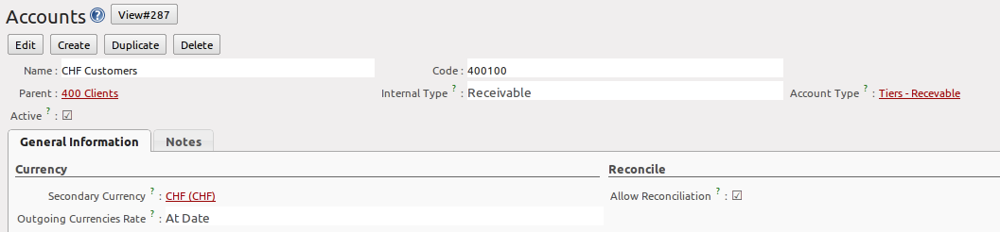
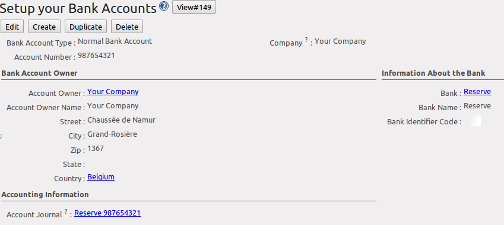
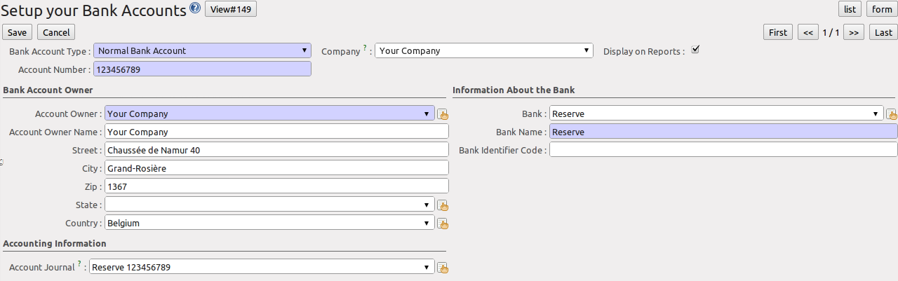
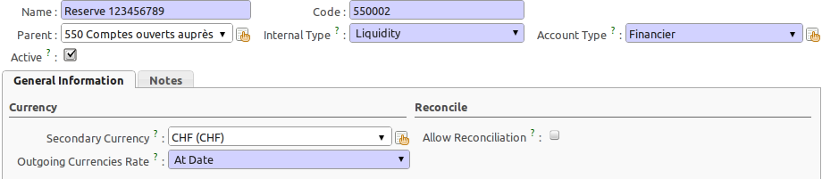
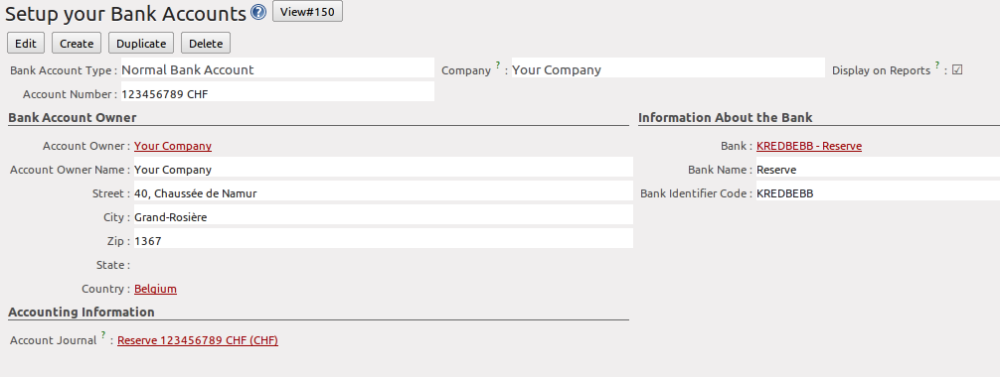
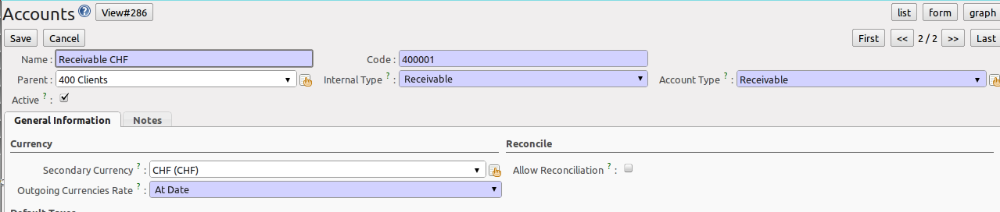
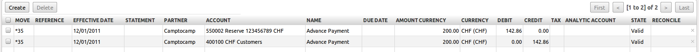
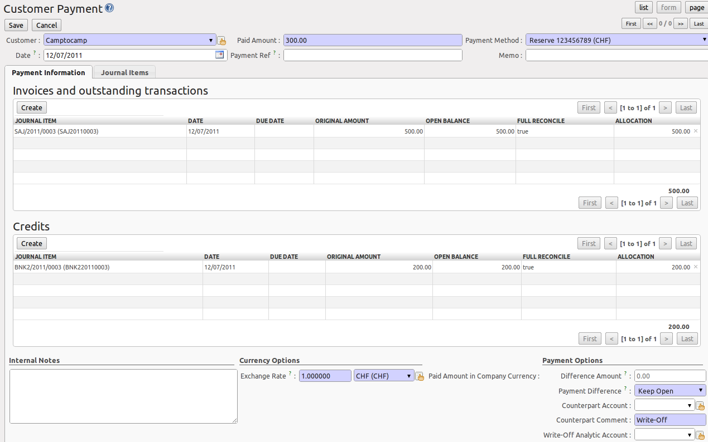
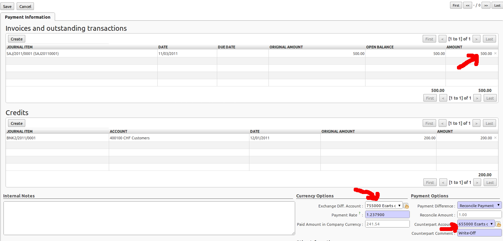
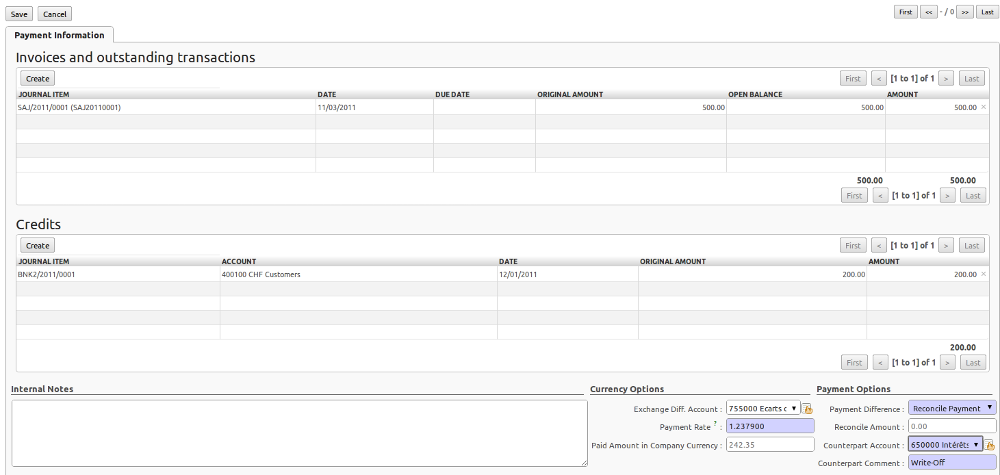

.. index::
   single: Multicurrency
   single: Currency

*******************************************
An Introduction to Multicurrency Principles
*******************************************

As from version 6.1, OpenERP went through some changes regarding Multicurrency Management.

* Exchange differences are managed automatically by the reconciliation system, but no longer through the Write-Off part of the voucher.

* The payment voucher (which is also the reconciliation form of a bank statement) has been changed too. It now handles both the Exchange Difference and the Write-Off. The write-off is computed at the end of the payment voucher in order to reflect the difference between the payment and the amount allocated on invoices.

* The exchange difference is computed per line of invoice allocation and computed at the total reconciliation. So a payment for 3 invoices can have 3 journal entries generated for the exchange difference. The exchange difference is computed in order to reflect the change in the currency between the invoice entries and the payment entries.

Some examples of what can be accomplished in OpenERP.

Suppose your company is managed in EUR. If you invoice 500 USD to a customer (= 350 EUR at the date) and the receivable account is managed in USD, it means your customer owes you 500 USD (not 350 EUR). If the customer pays 400 CHF (= 200 EUR = 380 USD at that date), his credit is decreased by 380 USD, so he owes you 120 USD (which may be 83 EUR today).

An opposite example: suppose your company is managed in EUR. If you invoice 500 USD to a customer (= 350 EUR at the date) and the receivable account is managed in EUR (not in USD like above), it means your customer owes you 350 EUR (not 500 USD). If he pays 400 CHF (= 200 EUR = 380 USD at that date), his credit is decreased by 200 EUR, so he owes you 150 EUR (which may be 200 USD today).

.. note:: Currencies

    In our examples, we start from the idea that you have a dedicated company account in foreign currency, related to a bank journal in the same foreign currency.

Getting Started with Multicurrency
==================================

OpenERP will now distinguish between exchange rate differences and write-off differences. To automatically register exchange differences, go to :menuselection:`Settings --> Companies --> Companies`, open your company and go to the ``Configuration`` tab. Add accounts for incoming and outgoing exchange rate differences. These will be used when making multi-currency entries.

Receivable Account in Currency
------------------------------

A partner can have invoices on several Receivable accounts, which is useful if you invoice him in different currencies. Please keep in mind that a partner can have one default receivable account defined in the ``Customer`` form. However, you are still allowed to use several receivable accounts for a customer, according to the currencies in which you invoice him. 
A partner can have invoices on several Receivable accounts, which is useful if you invoice him in different currencies. Please keep in mind that a partner can have one default receivable account defined in the Customer form. However, you are still allowed to use several receivable accounts for a customer, according to the currencies in which you invoice him. 

When setting a secondary currency for an account, please think about the meaning of the :guilabel:`Secondary Currency` field in the ``Account`` form:

1. **Empty**: the account is managed in the currency of the company. This account can have journal items in currencies for information purposes, but all reports, such as the charts of accounts, use the currency of the company to compute account balances.

2. **Company Currency**: this means entries in other currencies than the company currency will not be accepted for this account.
For example, suppose EUR is your company currency. You will not be able to invoice in USD if the receivable account has EUR as a secondary currency (if it is empty, you can).

3. **Foreign Currency**: if you select a secondary currency different from the company currency, OpenERP will consider this account as a multi-currency account. Every journal item will have a secondary amount in this currency; the secondary currency is required in this case.
You can specify a foreign currency for bank accounts that you keep in a currency different from your company currency.

   *Receivable Account in CHF*

Bank Account in Currency
------------------------

A company can have several bank accounts, either in company currency (account which may perfectly well accept foreign currencies) or accounts in foreign currency. You can use the ``Set up your Bank Accounts`` wizard to easily create company banks, as well as the corresponding bank account and bank journal in one go. Go to the menu :menuselection:`Accounting --> Configuration --> Financial Accounting --> Accounts --> Setup your Bank Accounts`. 

.. tip:: Bank Journal and Bank Account in Currency

    Remember that the bank journal and its related bank account should be expressed in the same currency. OpenERP will display a message if you break this rule.

In this screen, specify your account number (either in normal or IBAN format) and select whether this account number has to be printed on reports. Select (or create) the bank name (containing also information related to your bank, such as name, address, BIC). In the example below we choose ``Reserve``, the bank from the demo data. You can complete the address data if you have not updated your company's address yet. When you click the ``Save`` button, a financial ``Account Journal`` and a ``Bank Account`` will automatically be created.

   *Defining a Bank Account in EUR*

.. tip:: Bank and BIC

    When you create a new bank from the Company Bank Accounts screen and you enter the BIC (Bank Identifier Code) number, the Bank Name and Bank Identifier Code field will automatically be completed according to the data set for the bank.
    E.g. create a new bank KBC and add BIC KREDBEBB.

.. note:: Bank Journal & Account

    The bank account that is automatically created on Save wil be created in the company currency. If your bank account only allows a specific currency, such as CHF, you can easily change this from the ``Set up your Bank Accounts`` screen. Simply click the button at the right side of the ``Account Journal`` field, then select ``Open``. Now open the ``Default Debit Account`` (or Credit, refers to the same bank account) in the same way and set the currency to CHF (see also the screen below). Remember to also change the ``Account Type`` of the bank account to "Financier".
    Add the currency CHF also to the Bank Journal itself. 

   *Defining a Bank Account*

Instead of using the ``Set up your Bank Accounts`` wizard, you can also create the bank account from the menu :menuselection:`Accounting --> Configuration --> Financial Accounting --> Accounts`. Click ``Accounts`` to open the list of accounts. 

   *Defining a Bank Account in CHF*

In the following example we will use a Bank Journal in CHF with a bank account in the same currency. If such a journal does not exist yet, you can easily define one through the ``Setup your Bank Accounts`` wizard as explained before. Or you can create a bank journal from the menu :menuselection:`Accounting --> Configuration --> Financial Accounting --> Journals --> Journals`.

   *Company Bank Account in CHF*

.. tip:: Multi-currency View

    When defining your journal, make sure to select the corresponding ``Display Mode``, i.e. **Bank/Cash Journal (Multi-Currency) View**.

    .. figure::  images/account_journal_chf.png
        :scale: 75
        :align: center

        *Bank Journal in CHF with Multicurrency View*

Creating an Invoice in CHF
==========================

Defining a Receivable Account for CHF
-------------------------------------

Go to the menu :menuselection:`Accounting --> Configuration --> Financial Accounting --> Accounts` to create a new receivable account for your company.

Click ``Create`` to create a receivable account in CHF. This means that every entry posted to this receivable account, will need an amount expressed in CHF too.

   *Defining an Account in CHF*

.. tip:: Duplicating

    Note that you can also duplicate an existing receivable account. A quick way is to click the :guilabel:`Receivable Accounts` and then open the existing account. To duplicate this account, make sure the account is not in ``Edit`` mode. Click the ``Cancel`` button at the top of the account screen to display the :guilabel:`Duplicate` button.

Once this account has been defined, you can link it to the corresponding partner. Here we select partner ``CamptoCamp``. On the ``Accounting`` tab of the ``Customers`` form, link the new Account Receivable in CHF. Notice that this is a default receivable account for this customer. In case you need to invoice him in a different currency, you can change the account receivable from the invoice.

Creating the Invoice
--------------------

Before creating the invoice, make sure to check whether the correct rate has been defined. Go to the menu :menuselection:`Accounting --> Configuration --> Miscellaneous --> Currencies` and open currency CHF. The rate defined to be valid as from 01/01/2011 (through the demo data) is 1.308600. Click Create, change the date to 11/01/2011 and add the rate 1.22530.

.. tip:: Currency Position

    As from this version, you can also choose where to print the currency symbol through the ``Symbol Position`` field, either Before or After the amount.

Go to the menu :menuselection:`Accounting --> Customers --> Customer Invoices` anc click ``Create`` to create a new invoice for Camptocamp.

Select customer *Camptocamp*. Then change the currency of the invoice to CHF by clicking the :guilabel:`Change` button at the right side of the ``Currency`` field. Set the invoice date to the beginning of November, e.g. 3 November. This will allow us to show the exchange rate differences. 

.. tip:: Currency

    You can also create specific pricelists in the currency of the customer to not have to change the currency.

Sell a basic PC [PC1] to this customer and change the price to 500. Notice that the EUR price of Basic PC is automatically converted to CHF according to the valid rate (450 EUR * 1.225300 = 551.38 CHF). Click ``Save & Close`` to save the invoice line.

Confirm the invoice by clicking the ``Validate`` button.

Now you can immediately check what your journal entry looks like. Go to the ``Other Info`` tab and click the button next to the ``Journal Entry`` field, then click ``Open`` to see the entry and stay in the ``Invoice`` screen, or click ``Journal Items`` to go the list of entry lines. Now have a look at the journal items posted for this invoice. Notice that 500 CHF is automatically converted to 408.06 EUR, according to the exchange rate of 1.225300.

Encoding Payments
=================

The customer pays you 200 CHF in advance on 12/01/2011. Your bank account in CHF will show an amount of 200 CHF with a counterpart in EUR at a rate of 1.4, i.e. 142.86 EUR.
Before encoding this advance payment, you can update the exchange rate defined for CHF. Of course, you can also enter the correct amount in EUR from your statement.
Go to the menu :menuselection:`Accounting --> Configuration --> Miscellaneous --> Currencies` and open currency CHF. Click Create, change the date to 12/01/2011 and add the rate 1.4.

Paying an Advance
-----------------

Camptocamp pays you 200 CHF (or 142.86 according to the exchange rate of 1.4) in advance. Go to the menu :menuselection:`Accounting --> Journal Entries --> Journal Items`. Select the bank journal you created (e.g. Reserve), enter the Period in which you want to post and click create to enter the advance payment.

Enter the payment as specified in the screenshot. Remember to change the date to 12/01. Start by entering the entry to the customer's receivable account. Make sure to enter a credit amount for the payment. In case you did not change the exchange rate, you can enter the EUR amount as recorded in your bank statement.

Press the Enter key when the first line is complete. Click the Save button at the end of the line to confirm the payment line.

   *Registering an Advance Payment*

As you will notice, the entry has no number yet. The ``Valid`` status only indicates that the journal items are balanced.

You can confirm entries in various ways. usually, you will not confirm entries one by one, but in batch. To definitely post a batch of entries is, go to the menu :menuselection:`Accounting --> Periodical Processing --> Draft Entries --> Post Journal Entries`. Here you can approve entries per journal and financial period.

You can also approve entries directly from the ``Journal Items`` view or the ``Journal Entries`` view.

Reporting and Follow-ups
------------------------

To check your open entries for your customers, go to the :menuselection:`Accounting --> Reporting --> Generic Reporting --> Partners` menu, select the ``Partner Ledger`` and tick the :guilabel:`With Currency` checkbox to also print the amounts in foreign currency. 

.. figure::  images/account_partner_ledger_chf.png
   :scale: 75
   :align: center

   *Partner Ledger with Currency*

From the :guilabel:`Customers` view, open customer ``Camptocamp`` and print the :guilabel:`Overdue Payments` report from the list of actions to see the customer statement. 

You can send reminders as explained in this book as well.

Customer Pays the Remaining Amount
----------------------------------

The statement you receive from your bank shows a payment of 300 CHF from your customer Camptocamp. The outstanding balance in company currency is 265.20 EUR. The amount in EUR that is on your bank statement, however, is 242.35 EUR (according to the new rate of 1.237900).

Go to the menu :menuselection:`Accounting --> Customers --> Customer Payment` and create a new payment for customer ``Camptocamp``. Make sure to select the correct :guilabel:`Payment Method`, i.e. your bank journal, in our example the CHF bank journal.

Enter the amount of 300 CHF in the :guilabel:`Paid Amount` field and consider the advance payment and the 300 CHF payment as completely reconciled against the 500 CHF invoice.

Do not confirm, but simply check what it looks like. This way, we can show you another example which is a bit more complicated.

   *Fully Reconciled Invoice*

Write-off and Exchange Rate
---------------------------

Now register a customer payment for the same customer Camptocamp. Enter a Paid Amount of 299 CHF (this is 1 CHF less than what the customer owes you). Notice that the advance payment is automatically considered as fully reconciled (second part of the screen).
In the invoice part, you will see the invoice of 500 CHF, which is not considered as fully reconciled, but shows the Allocation amount of 499 CHF (299 of the payment plus the 200 CHF of the advance payment).

In this example we want to consider the invoice as fully paid, so check the :guilabel:`Full Reconcile`. Notice that the amount is automatically set to 500.
Select the :guilabel:`Payment Difference` ``Reconcile Payment Balance`` and select a :guilabel:`Counterpart Account`.

   *Reconciliation through Bank Statement with Exchange Difference and Write-off*

Of course, another example could be full payment by the customer, so no need to do a write-off, but only an entry for the exchange differences.

   *Reconciliation through Bank Statement with Exchange Difference*

.. Details of the Journal Items
.. ============================
