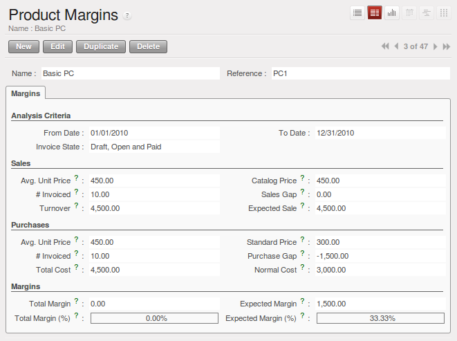
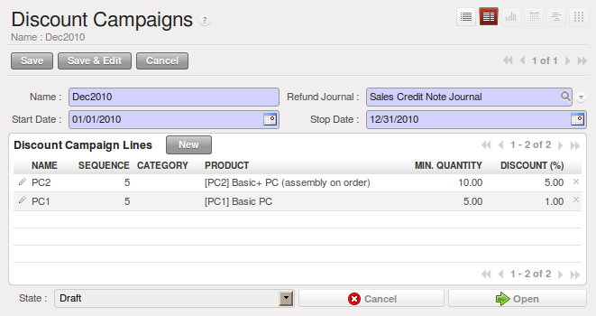
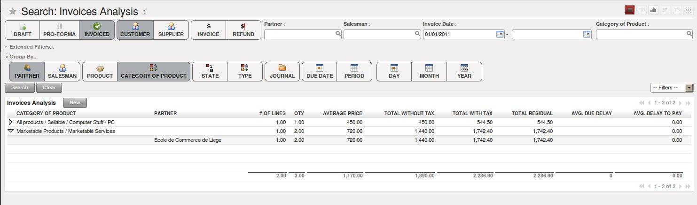

.. raw:: latex

    \afterpage{\clearpage}

Advanced Features
=================

Defining Packaging
------------------

Products can be managed in several packaged forms. For example, if you sell
batteries you can define the following packages for a given battery product:

* Piece: a battery,

* Blister Pack: a pack of 4 batteries,

* Pack of 100 blisters: 400 batteries,

* Palette: 40 packs for a total of 16,000 batteries.

OpenERP's package management enables you to sell the same product in several different forms. The
salesperson could sell separately one battery or a palette of batteries. In the order, you can
select the default packaging type as a function of the quantities ordered.

For example, if the customer wants to buy 30,000 batteries, the salesperson can select the ``palette`` package. OpenERP will then propose to sell 32,000 batteries, which corresponds to two palettes. Or the salesperson can select 75 packs.

The available packages are defined in the product form, in the :guilabel:`Packaging` tab. The first item on the
list is the one that will be used by default.

Once a package has been defined on the order, OpenERP will throw up an alert if the ordered
quantities do not correspond to the proposed packages. The quantity must be a multiple of the field
:guilabel:`Quantity by Package` defined on the packaging form.

.. figure:: images/sale_warning_packaging.png
   :scale: 75
   :align: center

   *Alert on the Quantities sold compared to the Packaging*

Do not confuse the management of packaging with the management of multiple units of measure. The
Unit of Measure is used to manage the stock differently according to the various units. 
With packages, the stock is always managed by individual items, but information about the package to use is supplied
to the storesperson along with that item.

Even if the effects are the same, the printed documents will be different. The two following
operations have the same effect on stock movement levels, but will be printed differently
on the sales order and the packing order as where quantities are concerned:

* 32,000 batteries, delivered on two palettes,

* 2 palettes of batteries, with no information about packaging.

If the customer wants to order a palette and 10 packs, the salesperson can put two order
lines on the sales order using the same product with different units of measure.

It is sometimes more useful to define different products than to define several packages for
the same product. A case of beer in a supermarket is a good example. A case holds 24 bottles, plus
the empty case itself. The customer can buy bottles by the piece or a case of 24 bottles at one go.

You could define two packages for the ``Bottle of beer``: ``PCE`` and ``case`` . But this
representation does not let you manage the stock and price of empty cases. So you might instead
prefer a Bill of Materials, defining and using three different products:

* the empty case for the beer,

* the bottle of beer,

* the case of 24 bottles of beer.

You also define the bill of materials below which determines the make-up of the case of 24 beers:

* Case of 24 bottles of beer: 1 unit,

* Bottle of beer: 24 units,

* Empty case of beer: 1 unit.

Each of these three products has a different price. The products ``Bottle of beer`` and ``Empty case of beer`` have a stock level that needs to be managed. The ``Case of 24 bottles of beer`` has no stock because, if you sell the product, OpenERP automatically moves the stock in two lines, one for the empty case and the other for the 24 individual bottles of beer.

Managing Alerts
---------------

.. index:: 
   single: warning
   single: alerts
   single: module; warning

To manage alerts on products or partners, you can install the :mod:`warning` module. Once that is
installed, you will be able to configure a series of alerts on the partners or products by
setting parameters in the new :guilabel:`Warnings` tab on each of the forms.

You can select any of the following types of warnings and create different warnings for purchases and for sales:

* :guilabel:`No Message`: This option will not display a message.

* :guilabel:`Warning`: This option will show the user the message entered.

* :guilabel:`Blocking Message`: The message displayed will cause an exception and block the workflow.

You can activate alerts for a series of events. For each alert, you should enter a message that will
be displayed when the event concerned is started.

.. figure:: images/warning_partner.png
   :scale: 75
   :align: center

   *Management of alerts on partners*

The available warnings in the partner form are:

* Create a warning for a sales order,

* Create a warning for a purchase order,

* Create a warning for a delivery to a partner (or receiving an item),

* Create a warning when invoicing a partner.

For example, if you enter an alert for the invoicing of a customer, for an accountant entering an
invoice for that customer, the alert message will be attached as shown in the figure :ref:`fig-warnsmp`.

.. _fig-warnsmp:

.. figure:: images/warning_sample.png
   :scale: 75
   :align: center

   *Alert from Invoicing a Customer*

.. figure:: images/warning_product.png
   :scale: 75
   :align: center

   *Management of Alerts on Products*

The alerts that can be configured on a product form are related to:

* The sales of that product,

* The purchase of that product.

A practical example:

Now when could you use such an alert? Suppose that your customer asks you to never make any deliveries on Tuesday morning, because the street is blocked due to a weekly market. You surely would like your transporter to be aware of this, so it could be useful to have a kind of message printed by default on each delivery order for this customer.
To do this, you could create a Warning on the Picking in the **Customer** form of the partner concerned, saying that no deliveries are allowed on Tuesday morning.

Controlling Deliveries and Invoicing
------------------------------------

Configuring Orders
++++++++++++++++++

.. index:: 
   pair: control; delivery
   pair: control; invoicing

The way the order is configured will determine its future behaviour:

* :guilabel:`Picking Policy` : ``Partial Delivery`` or ``Complete Delivery``,

* :guilabel:`Shipping Policy` : ``Shipping & Manual Invoice``, ``Payment Before Delivery``,
  ``Invoice on Order After Delivery``, and ``Invoice from Delivery``,

* :guilabel:`Invoice on` : ``Ordered Quantities`` or ``Shipped Quantities``.

.. tip::  Configuring your Interface

     If you work in the ``Simplified`` view mode, only the :guilabel:`Shipping Policy` field is visible
     in the second order tab.
     To get to the ``Extended`` view mode, go to the :guilabel:`Edit Preferences` link and select the interface of your choice.
     You can also use the :guilabel:`Reconfigure` wizard and configure your interface as :guilabel:`Extended`, or assign the group
     :guilabel:`Usability – Extended View` to the current user.

The picking mode determines the way the storesperson will do the picking. If the order is put
into :guilabel:`Partial Delivery` mode, the picking order will appear in the list of things for the
storesperson to do as soon as any of the products on the order is available. To get the list of
items to be done, you can use the menu :menuselection:`Warehouse --> Outgoing Deliveries`.
By default, the :guilabel:`Available` filter button is selected, so you immediately see the list of available pickings.

The storesperson will then be able to make a partial delivery of the quantities actually available
and do a second picking operation later when the remaining products are available in stock.

If the picking mode is :guilabel:`Complete Delivery`, the picking order will not appear in the list of
pickings to do until all of the products are available in stock. This way, there will only be a
single delivery for any such order.

If the storesperson wants to do so, the delivery mode can be modified on each picking list even after the
order has been confirmed.

In the case of invoicing from picking, the cost of delivering the products will be
calculated according to multiple deliveries. This risks incurring a higher cost because of
the separate deliveries. If invoicing is done from the order, the customer will only be invoiced
once for the whole delivery, even if the delivery of several items has already been made.

Managing Carriers
-----------------

.. index::
   single: delivery grid
   single: carriers
   single: module; delivery
   single: module; profile_manufacturing

To manage deliveries in OpenERP, you can install the :mod:`delivery` module.
To do that, use the :guilabel:`Reconfigure` wizard and select :guilabel:`Delivery Costs` under the :guilabel:`Sales Application Configuration` section for installation.

This module enables you to manage:

* the different carriers with whom you work,

* the different transport methods,

* cost calculation and invoicing of each delivery,

* the transport methods and their tariffs.

Once the :mod:`delivery` module has been installed, the first thing to do is to configure the different
modes of delivery accepted by your company. Go to the menu :menuselection:`Warehouse
--> Configuration --> Delivery --> Delivery Method` to create your company's delivery modes.

For each delivery mode, you should define the following elements:

* Name of the delivery mode,

* The partner associated with the transport (which can be your own company),

* The associated product.

Let's give you an example:

.. table:: Example Delivery Modes

   ================    ===============   ==========================
   Carrier             Carrier Partner   Delivery Product
   ================    ===============   ==========================
   Express Track       Mail Office       Express Track Delivery
   Priority Courier    Mail Office       Courier Express Delivery
   EFG Standard        EFG Inc           Delivery EFG
   EFG Express         EFG Inc           Delivery EFG Express
   ================    ===============   ==========================

Information about the invoicing of transport (such as accounts, applicable taxes) is entered in the
product linked to the delivery mode. Ideally the product should be configured with 
:guilabel:`Product Type` ``Service`` and :guilabel:`Procurement Method` ``Make to Stock``.

You can use the same product for several delivery modes. This simplifies the
configuration, but it has the disadvantage that you will not be able to separate your sales figures by delivery mode.

Tariff Grids
++++++++++++

Unlike ordinary products, delivery prices are not proposed through pricelists but through delivery grids,
designed specifically for this purpose. For each delivery mode, you enter one or several tariff grids.
Each grid is used for a given region/destination.

For example, for the postal tariffs for Priority Courier, you generally define the three tariff grids
for Mail Office:

* National Courier,

* Courier in Europe,

* Courier Outside Europe.

To define a new delivery grid, use the menu :menuselection:`Warehouse --> Configuration -->
Delivery --> Delivery Pricelist`. Give a name to your delivery grid and define the
region for which the tariffs in the grid will apply in the second tab
:guilabel:`Destination`. There you can set:

* A list of countries (for UK or Europe, for example),

* A list of states,

* A range of postal codes (for Paris you might have 75000 – 75900).

Then you have to set the rules for calculating the transport price in the first tab :guilabel:`Grid definition`.
First of all, give the rule a name. Then set the condition for which this rule is applicable, for
example ``Weight < 0.5kg``.

.. note:: Weights

   Weights are always expressed in kilograms. You can define a number with a decimal point or comma, so
   to set 500g you would put 0.5 in the weight rule.

Next you can set the sales price and the cost price. Prices can be expressed in various ways:

* a fixed price,

* a variable price, as a function of weight, volume, weight x volume or price.

For example, mailing within France using current tariffs would be defined as shown in the table below:

.. table:: Example Tariff Rules

   ==========  =============  =====   =============
   Name        Condition      Price   Price Type
   ==========  =============  =====   =============
   S           Weight < 3 kg  6.90    Fixed
   M           Weight < 5 kg  7.82    Fixed
   L           Weight < 6 kg  8.53    Fixed
   XL          Weight < 7 kg  9.87    Fixed
   ==========  =============  =====   =============

You can also define rules that depend on the total amount on the order. For example to offer fixed price
delivery if the total order amount is greater than 150 USD, add the following rule:

.. table:: Additional Tariff Rule

   ================= ===============  ======   =============
   Name              Condition        Price    Price Type
   ================= ===============  ======   =============
   Franked > 150 USD Price > 150 USD  10       Fixed
   ================= ===============  ======   =============

Delivery Modes
++++++++++++++

Once the delivery modes and their corresponding tariffs have been defined, you can use them in a Sales Order. 
There are two methods for doing that in OpenERP.

* Delivery based on Ordered Quantities,

* Delivery based on Shipped Quantities.

*Delivery based on Ordered Quantities*

To add the delivery charges (or transport costs) to the quotation, use the button :guilabel:`Delivery Costs` available on the `Sales Order` tab of the form. A dialog box opens, asking you to select a delivery mode from the list available.

.. figure:: images/sale_delivery.png
   :scale: 75
   :align: center

   *Adding Transport Costs to an Order*

Once the delivery mode has been selected, OpenERP automatically adds a line to the quotation with
the amount calculated by the delivery function.

If you want to calculate the exact delivery charges depending on the actual deliveries, you must use
invoicing based on deliveries.

*Delivery based on Shipped Quantities*

To invoice the delivery according to the items shipped, you set the delivery mode in the
:guilabel:`Delivery Method` field on the second tab of the order, :guilabel:`Other Information`, to :guilabel:`Invoice from Delivery`. 

You can then confirm the order, and when the goods are available you can also validate the delivery order.

The transport costs will not be added to the sales order, but only to the invoice.
When the manager has generated the invoices corresponding to the deliveries carried out,
OpenERP automatically adds a line on each invoice corresponding to the delivery charge, calculated
on the basis of the items actually sent.

Keeping Track of your Margins
-----------------------------

For every company, keeping a clear sight on and a good control of margins is crucial. Even if you have a good sales level, it will not guarantee company profitability if margins are not high enough. OpenERP provides a number of methods allowing you to monitor your sales margins. The main ones are:

* Margins on a sales order,

* Margins by product,

* Margins by project (not explained in this book),

* Using pricelists.

Margins on Sales Orders
+++++++++++++++++++++++

.. index::
   single: module; sale_margin

If you want to check your margins on sales orders, you can install the :mod:`sale_margin` module
by selecting :guilabel:`Margins in Sales Orders` for installation in the :guilabel:`Reconfigure` wizard.
This will add margins calculated on each order line and on the order total.

.. figure:: images/sale_margin.png
   :scale: 75
   :align: center

   *An order with the module sale_margin*

The margin on each line is defined as the quantity sold multiplied by the sales price for the
customer less the cost price of the products. By default, products are managed using standard price
in OpenERP (cost price fixed manually and reviewed once per year). You can change that to
``Average Price``, meaning that the product cost fluctuates with purchases from
suppliers. After product receipt you can include fixed costs, such as delivery costs, in the cost of
each product.

.. index::
   single: module; product_extended

OpenERP supports a third method of updating the cost price of products.
This is through the button :guilabel:`Update` on the product form which lets you
automatically recalculate the cost price for the selected product. 
The cost price is calculated from the raw materials and the operations carried out 
(if the products have been manufactured internally, so that you have set their costs).

Margins by Product
++++++++++++++++++

.. index::
   single: module; product_margin

To track margins by product, install the module :mod:`product_margin`. Once the module
is installed you can see the margins by product by using the menu :menuselection:`Sales --> Products
--> Product Margins`.

When you have clicked the menu option concerned, OpenERP asks for an analysis period and the state of invoices (draft, open, paid). If
no period is given, OpenERP will calculate margins on all of the operations without restriction. By
default, however, OpenERP proposes a period of the last 12 months for analysis.

You can also filter the analysis on certain types of invoice:

* All invoices, including unvalidated draft invoices,

* All open and/or paid invoices,

* Paid invoices only.

.. figure:: images/product_margin_tree.png
   :scale: 75
   :align: center

   *Product Margins*

You then get a margin analysis table. The following fields are displayed for the sales of each product:

* :guilabel:`Avg. Unit Price`: the average unit sales price,

* :guilabel:`Catalog Price`: the list price based on this product,

* :guilabel:`# Invoiced`: the number of sold products that have been invoiced,

* :guilabel:`Sales Gap`: the difference between the revenue calculated from list price and volume, and the actual sales,

* :guilabel:`Turnover`: the actual sales revenue for the product selected,

* :guilabel:`Expected Sale`: the number of products sold multiplied by the list price.

   *Margin Details for a Given Product*

The following fields are given by product for purchases:

* :guilabel:`Avg. Unit price`: the average unit purchase price,

* :guilabel:`Standard price`: the standard cost price of the product for the company,

* :guilabel:`# Invoiced`: the number of purchased products,

* :guilabel:`Purchase Gap`: the difference between the total actual cost and the standard cost
  multiplied by the number of units purchased,

* :guilabel:`Total Cost`: the total cost of purchases for the product under consideration,

* :guilabel:`Normal Cost`: the number of products sold multiplied by the standard cost price.

The following fields are given by product for margins:

* :guilabel:`Total Margin`,

* :guilabel:`Expected Margin`,

* :guilabel:`Total Margin in percent`,

* :guilabel:`Expected Margin in percent`.

Pricing Policies
----------------

Some companies are notorious for their complicated pricelists. Many forms of price variation are
used, such as end-of-year refunds, discounts, change of terms and conditions with time, various
prepayments, cascaded rebates, seasonal promotions, and progressive price reductions.

.. note:: Rebate, Refund, Reduction

   In some accounting jurisdictions you have to differentiate between the three following terms:

   * Rebate: reimbursement to the client, usually at the end of the year, that depends on the
     quantity of goods purchased over a period.

   * Refund: reduction on the order line or invoice line if a certain quantity of goods is purchased
     at one time or is sold in a framework of a promotional activity.

   * Reduction: a one-off reduction resulting from a quality defect or a variation in a product's
     conformance to a specification.

Intelligent price management is difficult, because it requires you to integrate several conditions
from clients and suppliers to create estimates quickly or to invoice automatically. But if you have
an efficient price management mechanism you can often keep margins raised and respond quickly to
changes in market conditions. A good price management system gives you scope for varying any and all
of the relevant factors when you are negotiating a contract.

To help you work most effectively, OpenERP's pricelist principles are extremely powerful yet are
based on simple and generic rules. You can develop both sales pricelists and purchase pricelists for
products capable of accommodating conditions such as the date period, the quantity requested and the
type of product.

.. tip:: Do not confuse the Different Price Specifications

   Do not confuse the sales price with the basic price of the product.
   In OpenERP's basic configuration, the sales price is the list price specified in the product form,
   but a customer can have a different sales price depending on the conditions.

   The same applies to the purchase price and standard cost. Purchase price is your suppliers' selling price,
   which changes in response to different criteria such as quantities, dates, and supplier. This is
   automatically set by the accounting system.

Each pricelist is calculated from defined policies, so you will have as many sales pricelists as
active sales policies in the company. For example, a company that sells products through three sales
channels could create the following price lists:

 #. Main distribution:

	- pricelist for Walbury,

	- pricelist for TesMart,

 #. Postal Sales.

 #. Walk-in customers.

A single pricelist can exist in several versions, only one of which is permitted to be active at a
given time. These versions let you set different prices at different points in time. So the
pricelist for walk-in customers could have five different versions, for example: \ ``Autumn``\,
\ ``Summer``\, \ ``Summer Sales``\, \ ``Winter``\, \ ``Spring``\. Direct customers will see prices
that change with the seasons.

Each pricelist is expressed in a single currency. If your company sells products in several
currencies, you will have to create as many pricelists as you have currencies.

The prices on a pricelist can depend on another list, which means that you do not have to repeat the
definition of all conditions for each product. So a pricelist in USD can be based on a pricelist in
EUR. If the currency conversion rates between EUR and USD change, or the EUR prices change, the USD
rates can be **automatically** adjusted.

.. index::
   single: pricelist; create

Creating Pricelists
+++++++++++++++++++

You can define a pricelist from the menu :menuselection:`Sales --> Configuration --> Pricelists --> Pricelists`.

For each list you should define:

* a :guilabel:`Name` for the list,

* a :guilabel:`Type` of list: \ ``Sale`` \ for customers or \ ``Purchase`` \ for suppliers,

* the :guilabel:`Currency` in which the prices are expressed.

.. index::
   single: pricelists; version

PriceList Versions
^^^^^^^^^^^^^^^^^^

Once the pricelist is defined you have to link at least one version. You can create a new version directly from the pricelist or from the
:menuselection:`Sales --> Configuration --> Pricelists --> Pricelist Versions` menu. The version contains all of the
rules that enable you to calculate a price for a product and a given quantity.

Start by setting the :guilabel:`Name` of this associated version. If the list only has a single version, you
can use the same name for the pricelist and the version. In the :guilabel:`Price List` field, select
the pricelist you created (this is not necessary if you create the version directly from the pricelist).

Then set the :guilabel:`Start Date` and :guilabel:`End Date` of this version. The fields are both
optional: if you do not set any dates the version will be permanently active. Only one version
may be active at any one point, so bear this in mind when creating them.
Use the :guilabel:`Active` field in the versions to activate or disable a pricelist version.

.. note:: Automatically Updating the Sales Pricelist

   Any sales pricelist can be set to depend on one of the other pricelists.
   So you could create your sales pricelist based on the supplier's purchase pricelist, to
   which you add a margin.
   The prices are automatically calculated as a function of the purchase price and need no further
   manual adjustment.

.. index:: price

Calculation Rules
^^^^^^^^^^^^^^^^^

A pricelist version is made up of a set of rules that apply to the basic product prices.

.. figure:: images/service_pricelist_line.png
   :scale: 75
   :align: center

   *Rule in a Pricelist Version*

You define the conditions for a rule in the first part of the screen labelled :guilabel:`Rules Test
Match`. The rule applies to the :guilabel:`Product` or :guilabel:`Product Template` and/or the named :guilabel:`Product
Category`. If a rule is applied to a category, then it is automatically applied to all of its
subcategories too (using the tree structure for product categories).

If you set a minimum quantity in :guilabel:`Min. Quantity`, the rule will only apply to a quantity equal to or larger than the quantity set. This way, you can define reduced rates in steps according to the quantities ordered.

Several rules can be applied to an order. OpenERP evaluates these rules by sequence number, to determine
which rule(s) to apply to the specified price calculation. If several rules are valid, only the first in
sequence is used for the calculation. The :guilabel:`Sequence` field determines the order, starting with the
lowest number and working up.

Once a rule has been selected, the system has to determine how to calculate the price from the rule.
This operation is based on the criteria set out in the lower part of the form, labelled :guilabel:`Price
Computation`.

The first field to complete is :guilabel:`Based on`. Set the way in which the partner price will be calculated, choosing between:

* the :guilabel:`Public Price` set in the product file,

* the :guilabel:`Cost Price` set in the product file,

* an :guilabel:`Other Pricelist` given in the field :guilabel:`If Other Pricelist`,

* the price that varies as a function of a supplier defined in the :guilabel:`Partner section of the
  product form`.

Next, various operations can be applied to the basic price to calculate the sales or purchase price
for the partner, according to the specified quantities. To calculate it, you apply the formula shown on the
form: ``Price = Base Price x (1 + Field1) + Field2`` .

The first field, :guilabel:`Field1`, defines a discount. Set it to 0.20 for a discount of 20% from
the basic price. If your price is based on standard cost, you can set -0.15 to get a 15% price uplift
compared to the standard costs.

:guilabel:`Field2` sets a fixed supplement to the price, expressed in the currency of the pricelist.
This amount is just added (or subtracted, if negative) to the amount calculated with the
:guilabel:`Field1` discount.

Then you can specify a rounding method. The rounding calculation is carried out to the nearest
number. For example if you set 0.05 in this example, a price of 45.66 will be rounded to 45.65, and
14,567 rounded to 100 will give a price of 14,600.

The supplement from :guilabel:`Field2` is applied before the rounding calculation, which enables
some interesting effects. For example, if you want all your prices to end in 9.99, set your rounding
to 10 and your supplement to -0.01 in :guilabel:`Field2`.

Minimum and Maximum margins enable you to guarantee a given margin over the base price. A margin of
10 USD enables you to stop the discount from returning less than that margin. If you put 0 into this
field, no effect is taken into account.

Once the pricelist is defined, you can assign it to a partner. Go to the Partner form and select
its :guilabel:`Sales & Purchases` tab. You can then change the :guilabel:`Purchase Pricelist` and the
:guilabel:`Sale Pricelist` that is loaded by default for the partner.

.. _decimal_accuracy:

Decimal Accuracy
^^^^^^^^^^^^^^^^
There are several configuration settings related to the decimal accuracy of 
prices, or the number of decimal places to hold with each price field. To change
the accuracy of a field, follow these steps:

1. Make sure you have the `Extended` user interface. The setting is in your user 
   preferences.
   
2. Go to :menuselection:`Administration --> Customization --> Database Structure --> 
   Decimal Accuracy`. This list contains a number of predefined elements.
   
3. Open the entry you want to change. `Purchase Price` and `Sale Price` are the 
   most common ones related to prices, but some fields are controlled by the 
   `Account` entry.
   
4. Type a new value in the digits field, and save the entry. Do not change the description in the
   `Usage` field, or it will stop working.
   
5. Close the screen where you were editing prices and reopen it. The price field 
   should now have the number of digits you asked for.

Example of a Pricelist
++++++++++++++++++++++

Take the case of an IT systems trading company, for which the following product categories have
been configured:

All products

 #. Accessories

                * Printers

                * Scanners

                * Keyboards and Mice

 #. Computers

                * Portables

                 - Large-screen portables

                * Computers

                 - Office Computers

                 - Professional Computers

In addition, the products presented in the table below are defined in the currency of the installed
chart of accounts.

TABLE

.. csv-table:: Examples of products with their different prices

   "Product ","Sale Price","Cost Price","Default supplier price",
   "Acclo Portable","1,200 ","887 ","893 ",
   "Toshibishi Portable","1,340 ","920 ","920 ",
   "Berrel Keyboard","100 ","50 ","50 ",
   "Office Computer","1,400 ","1,000 ","1,000 ",

.. index::
   single: pricelist; default pricelist

Default Price Lists
^^^^^^^^^^^^^^^^^^^

.. figure:: images/product_pricelist_default.png
   :scale: 75
   :align: center

   *Default pricelist after installing OpenERP*

When you install the software, two pricelists are created by default: one for sales and one for
purchases. Each of them contains only one pricelist version and only one line in that version.

The price for sales defined in the Default Public Pricelist is set by default to
the Public Price of the product, which is the Sales Price in the Product form.

The price for purchases defined in the Default Purchase Pricelist is set by default in the same way to
the Cost Price of the product.

.. index::
   single: trading company

Trading Company
^^^^^^^^^^^^^^^

Take the case of a trading company, where the sales price for resellers can be defined like this:

* For portable computers, the sales price is calculated from the list price of the supplier Acclo,
  with a supplement of 23% on the cost of purchase.

* For all other products the sales price is given by the standard cost in the product file, to which
  31% is added. The price should end in ``.99`` .

* The sales price of Berrel keyboards is fixed at 60 for a minimum quantity of 5 keyboards purchased.
  Otherwise it uses the rule above.

* Assume that the Acclo pricelist is defined in OpenERP. The pricelist for resellers and the
  pricelist version then contains three lines:

       #. \ ``Acclo``\  line:

                *  :guilabel:`Product Category` : \ ``Portables``\  ,

                *  :guilabel:`Based on` : \ ``Other pricelist``\  ,

                *  :guilabel:`Pricelist if other` : \ ``Acclo pricelist``\  ,

                *  :guilabel:`Field1` : \ ``-0.23``\  ,

                *  :guilabel:`Priority` : \ ``1``\  .

       #. \ ``Berrel Keyboard``\  line:

                *  :guilabel:`Product Template` : \ ``Berrel Keyboard``\  ,

                *  :guilabel:`Min. Quantity` : \ ``5``\  ,

                *  :guilabel:`Field1` : \ ``1.0``\  ,

                *  :guilabel:`Field2` : \ ``60``\  ,

                *  :guilabel:`Priority` : \ ``2``\  .

       #. \ ``Other products``\  line:

                *  :guilabel:`Based on:` \ ``Standard Price``\  ,

                *  :guilabel:`Field1` : \ ``-0.31``\  ,

                *  :guilabel:`Field2` : \ ``-0.01``\  ,

                *  :guilabel:`Rounding` : \ ``1.0``\  .

                *  :guilabel:`Priority` :  \ ``3``\ .

It is important that the priority of the second rule is set below the priority of the third in this
example. If it were the other way around, the third rule would always be applied, because a quantity of
5 is always greater than a quantity of 1 for all products.

Also note that to fix a price of 60 for the 5 Berrel Keyboards, the formula \ ``Price = Base Price x
(1 + 1.0) + 60``\   has been used.

Establishing Customer Contract Conditions
^^^^^^^^^^^^^^^^^^^^^^^^^^^^^^^^^^^^^^^^^

The trading company can now set specific conditions to a customer, such as the company TinAtwo, who
might have signed a valid contract with the following conditions:

* For Toshibishi portables, TinAtwo benefits from a discount of 5% of resale price.

* For all other products, the resale conditions are unchanged.

The sales price for TinAtwo, called ``TinAtwo contract``, contains two rules:

       #. \ ``Toshibishi portable``\  :

                *  :guilabel:`Product` : \ ``Toshibishi Portable``\  ,

                *  :guilabel:`Based on` : \ ``Other pricelist``\  ,

                *  :guilabel:`Pricelist if other` : \ ``Reseller pricelist``\  ,

                *  :guilabel:`Field1` : \ ``0.05``\  ,

                *  :guilabel:`Priority` : \ ``1``\  .

       #. \ ``Other Products``\ :

                *  :guilabel:`Product` :

                *  :guilabel:`Based on` : \ ``Other pricelist``\  ,

                *  :guilabel:`Pricelist if other` : \ ``Reseller pricelist``\  ,

                *  :guilabel:`Priority` : \ ``2``\  .

Once this list has been entered, you should look up the partner form of TinAtwo again. Click the
:guilabel:`Sales & Purchases` tab to set the :guilabel:`Sale Pricelist` field to *TinAtwo Contract*. If
the contract is only valid for one year, do not forget to set the :guilabel:`Start Date` and
:guilabel:`End Date` fields in the :guilabel:`Pricelist Version`.

Then when salespeople prepare an estimate for TinAtwo, the prices proposed will automatically be
calculated from the contract conditions.

Pricelists and Managing Currencies
++++++++++++++++++++++++++++++++++

If your trading company wants to start a product catalog in a new currency you can handle this
several ways:

* Enter the prices in a new independent pricelist and maintain the lists in the two currencies
  separately,

* Create a field in the product form for this new currency and make the new pricelist depend on this
  field: prices are then maintained separately, but in the product file,

* Create a new pricelist for the second currency and make it depend on another pricelist or on the
  product price: the conversion between the currencies will then be done automatically at the
  prevailing currency conversion rate.

Rebates at the End of a Campaign
--------------------------------

If you want to provide discounts on an order, you can use the pricelist system in OpenERP. But we would not be writing about end-of-campaign rebates if no other solution was available. You can also work with end-of-campaign rebates or year-end rebates. The customer pays a certain price during the whole of the campaign or the year, and he will receive a rebate at the end of the campaign according to the sales made throughout the year.

Take the case of contract negotiations with a wholesaler. To get the best selling price, the
wholesaler will ask you for a good deal and will sign up to a certain volume of orders over
the year.

You can then propose a price based on the volume that the wholesaler agrees to sell. But then you
do not have any control over his orders. If at the end of the year the wholesaler has not taken the
agreed volumes, you can do nothing. At most you can review his terms for the following year.

Rebates at the end of a campaign can help you avoid this sort of problem. You can propose a contract
where the price depends on the usual wholesaler's terms. You can propose a rebate grid which
will be assigned at the end of the year as a function of the actual sales made.

.. index::
   single: module; discount_campaign

Install the :mod:`discount_campaign` module (in ``extra-addons`` at the time of writing)
to generate rebates at the end of the campaign. Once the modules have been installed, you can configure your campaign using the menu :menuselection:`Sales --> Configuration --> Sales --> Discount Campaigns`.

.. note:: Year-end Rebate

   Most companies use the term *year-end rebate*, where rebates are applied at the end of the year.
   But of course you can also define rebates for a campaign that lasts less than or more than one year.

   *Configuring a Campaign Rebate*

A campaign should have a name, a refund journal (to create the credit notes at the end of the campaign), a start date, and an end date. After entering this information, you should describe the lines of the campaign. Each line can be applied to a product or a category of
products. Then set the quantity of products sold from which the discount is applied, and the amount
of the rebate as a percentage of the actual sales volume.

When you have defined the campaign, you can activate it by clicking the :guilabel:`Open` button. The
figure :ref:`fig-discamp` shows a campaign with a rebate on computers which is between 10% and 20% depending on
the sales volume.

.. _fig-discamp:

.. figure:: images/discount_campaign.png
   :scale: 75
   :align: center

   *Configuring a Discount Campaign for Computers*

Once the campaign has been defined and activated, you can assign it to various partners. To do that
set a :guilabel:`Discount Campaign` in the second tab :guilabel:`Sales & Purchases` of the partner form.

Finally, at the end of the campaign, you should close it and OpenERP will automatically generate
invoices or credit notes for your partner associated with this campaign. OpenERP opens credit
notes in the ``Draft`` state so you can modify them before validation. To calculate the amount on the
credit note, OpenERP uses all of the invoices sent out during the period of the campaign as a
basis.

You can also get an overview of all draft credit notes using the menu :menuselection:`Accounting
--> Customers --> Customer Refunds`.

Keeping track of Open Orders
----------------------------

.. index::
   single: module; sale_delivery

In some industries, customers commonly place orders for a certain volume of products and ask for regular
deliveries from an order up to the total amount on it. This principle, called open orders, is managed
by the :mod:`sale_delivery` module in OpenERP.

OpenERP handles open orders easily. An open order is an order for a
certain quantity of products but whose deliveries are planned for various dates over a period of
time.

To do that, you should install the :mod:`sale_delivery` module (in ``extra-addons`` at the time of writing). 
A Sales Order is entered as a normal order, but you also set the total quantity that will be delivered on each order line.

Then you can use the new tab :guilabel:`Deliveries` on the order to plan the quantities sold and enter your
delivery planning there.

.. figure:: images/sale_delivery_form.png
   :scale: 75
   :align: center

   *Managing Open Orders, Planning Forecasts*

In the order lines, OpenERP shows you the quantity planned in addition to the quantity sold. This way, you
can verify whether the quantities sold equal the quantities to be delivered. On confirmation of the sales order, OpenERP no longer generates a single delivery order, but plans scheduled dispatches.

.. tip:: Invoicing Mode

   If you work with Open Orders, you should set :guilabel:`Invoice Control` to the mode ``Shipped Quantities``.
   Then the storesperson will be able to re-plan and change the quantities of the forecast deliveries
   in the system.

Changing Order Layout
---------------------

.. index::
   single: module; sale_layout

Install the :mod:`sale_layout` module by selecting :guilabel:`Sales Order Layout Improvement` and clicking :guilabel:`Configure` in the :guilabel:`Reconfigure` wizard. It enables you to have a more flexible template than the standard order forms. 

For example, you could put the following in the order lines:

* a horizontal separator line,

* titles and subtitles,

* subtotals at the end of the section,

* comments,

* a page break.

.. index::
   single: module; account_invoice_layout

This enables you to lay out a more elaborate, professional-looking quotation page. The
module :mod:`account_invoice_layout` (installed automatically on installation of :mod:`sale_layout`),
also gives you the same functionality for invoice templates.

The two figures :ref:`fig-invlayfrm` and :ref:`fig-invlayprin` show an invoice template in OpenERP 
and the resulting printed invoice.

.. _fig-invlayfrm:

.. figure:: images/invoice_layout_form.png
   :scale: 75
   :align: center

   *Invoice using Customizable Layout*

.. _fig-invlayprin:

.. figure:: images/invoice_layout_print.png
   :scale: 75
   :align: center

   *Printed Invoice*

 Invoice Analysis
-----------------

Analyse your invoicing in OpenERP through the **Invoice Analysis** screen.

This report provides an overview of what has been invoiced to your customer as well as the average payment delays.
You can easily group by partner, product category, ... or select only invoices that have not been confirmed yet.

This is an easy way to check your sales people's impact on turnover.

   *Analyzing your Invoices*

.. Copyright © Open Object Press. All rights reserved.

.. You may take electronic copy of this publication and distribute it if you don't
.. change the content. You can also print a copy to be read by yourself only.

.. We have contracts with different publishers in different countries to sell and
.. distribute paper or electronic based versions of this book (translated or not)
.. in bookstores. This helps to distribute and promote the OpenERP product. It
.. also helps us to create incentives to pay contributors and authors using author
.. rights of these sales.

.. Due to this, grants to translate, modify or sell this book are strictly
.. forbidden, unless Tiny SPRL (representing Open Object Press) gives you a
.. written authorisation for this.

.. Many of the designations used by manufacturers and suppliers to distinguish their
.. products are claimed as trademarks. Where those designations appear in this book,
.. and Open Object Press was aware of a trademark claim, the designations have been
.. printed in initial capitals.

.. While every precaution has been taken in the preparation of this book, the publisher
.. and the authors assume no responsibility for errors or omissions, or for damages
.. resulting from the use of the information contained herein.

.. Published by Open Object Press, Grand Rosière, Belgium
