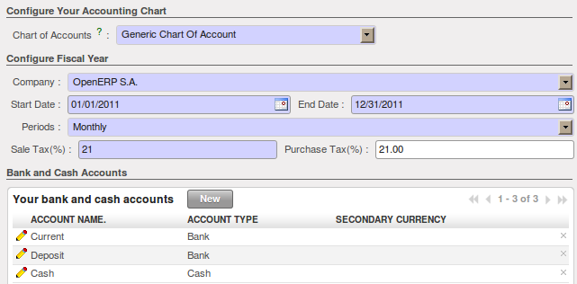
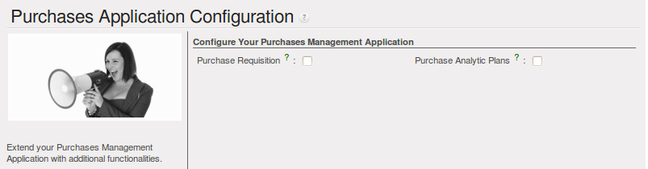
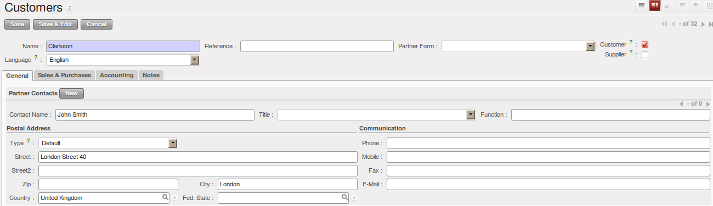
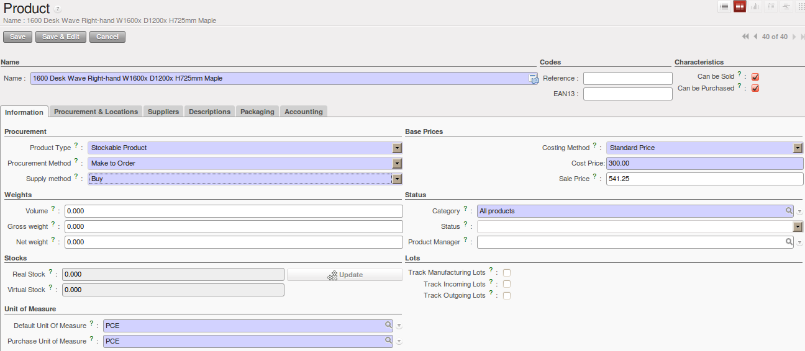
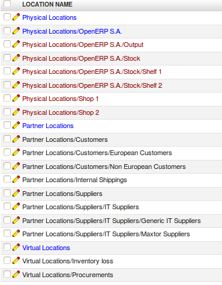
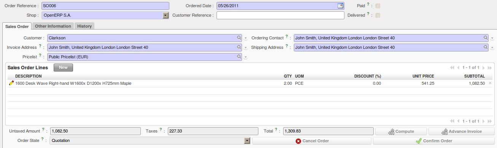
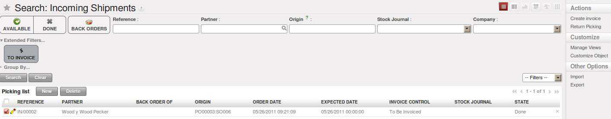
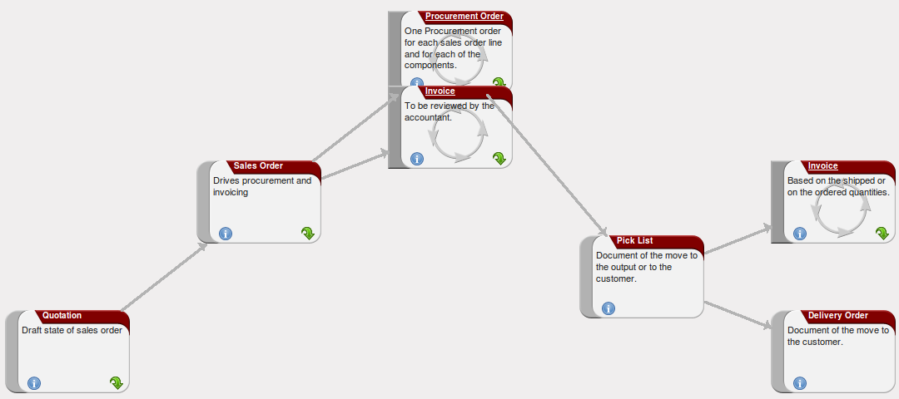

.. _part2-log-start:

Configuring your OpenERP
========================

In this chapter, you can start exploring OpenERP through a basic configuration, with the modules that are discussed in this book. As mentioned before, we want to show an integrated flow, not just logistics management. 

Use a web browser of your choice to connect to OpenERP Web.

.. figure:: images/web_startup_new.png
   :scale: 80
   :align: center

   *Web Client at Startup*

Start by creating a new database from the :guilabel:`Welcome` page by clicking :guilabel:`Databases` and then completing the following fields on the :guilabel:`Create Database` form.

*  :guilabel:`Super admin password` : by default it is \ ``admin`` \, if you or your system
   administrator have not changed it,

*  :guilabel:`New database name` : \ ``DemoCompany``\  ,

*  :guilabel:`Load Demonstration data` checkbox: \ ``checked``\ ,

*  :guilabel:`Default Language` : \ ``English (US)``\ ,

*  :guilabel:`Administrator password` : \ ``admin``\  (because it is the easiest to remember at this stage, but obviously completely insecure),

*  :guilabel:`Confirm password` : \ ``admin``\  .

Press `Create` to start creating the database.

.. tip:: Language

        You can install OpenERP in many languages. To be able to easily follow the instructions in this book, we recommend you to choose English (US).

OpenERP suggests that you configure your database using a series of questions. In the software, these series of questions are managed through so-called ``Configuration Wizards``.

Click the ``Start Configuration`` button to continue.

The next configuration wizard will help you to decide what your user interface will look like, whether the screens will only show the most important fields - ``Simplified`` - or whether you also want to see the fields for the more advanced users, the ``Extended`` view. Select ``Extended`` and click :guilabel:`Next` to continue.

.. tip:: User Preferences

       You can easily switch from Simplified to Extended view by changing your `User Preferences`.

In the next wizard, you can fill your company data, select your company's base currency and add your company logo which can be printed on reports. Click :guilabel:`Next` to continue.

Select the ``Warehouse Management``, ``Purchase Management``, ``Sales Management`` and ``Accounting & Finance`` business applications for installation and click :guilabel:`Install`. Now OpenERP will start to install these four applications, allowing you to do a complete  cycle, from sales / warehouse / purchase to invoice. You will have to wait for the next configuration wizard to be displayed (*Loading* will appear).

.. figure:: images/apps.png
   :scale: 80
   :align: center

   *Selecting the Required Functionality*

OpenERP's modularity enables you to install a single Business Application (such as Purchase) if that is all you need.
Of course, you can choose to install extra applications such as Sales Management, to handle quotations, sales orders and sales invoices as well.
For now, please install ``Warehouse Management``, ``Purchase Management``, ``Sales Management`` and ``Accounting & Finance``, as these four Business Applications will be discussed in this book.

.. tip:: Reconfigure

      Keep in mind that you can change or reconfigure the system any time, for instance through the `Reconfigure` option in the main bar.

When you choose a business application for installation, OpenERP will automatically propose to add or configure related (smaller) applications to enrich your system. When you install Sales, OpenERP will also ask you whether you want to install Invoicing Journals for instance.

The figure :ref:`fig-accconwiz` shows the Accounting Application Configuration screen that appears when you select ``Accounting & Finance`` to be installed.

.. _fig-accconwiz:

   *Selecting Accounting Configuration*

Select the `Generic Chart of Account` and fill in the Sale Tax (%) applicable in your country. The Purchase Tax will automatically be set as well. Click one of the disk icons in front of the bank accounts to confirm the bank accounts to be created. Then click `Configure` to continue the configuration. 

OpenERP Logistics Management offers lots of features. You can easily manage your address book (customers, suppliers, ...), keep track of procurements and sales, manage your warehouse and inventory, and much more.

The figure :ref:`fig-purconwiz` shows the Purchases Application Configuration screen that appears when you select ``Purchase Management`` to be installed.

.. _fig-purconwiz:

   *Selecting Purchase Configuration*

Simply click ``Configure`` to continue the database creation. 

The following wizards will appear:

* Configure your *Sales Management* application: click ``Configure`` to accept the default settings (no options checked).

* Configure your *Accounting* application: click ``Configure`` to accept the default settings.

* Configure *Sales Order Logistics*: click ``Next`` to accept the default settings.

OpenERP's menu will be displayed, because your system is now ready for actual configuration. In the next chapter :ref:`log-flow` you will start working in the Logistics application in a step-by-step approach.

As your business is growing and evolving all the time, your requirements as to the use of OpenERP are likely to change. To sustain your growth, you can easily extend your Logistics Management with other OpenERP business applications, such as HR or CRM, to name some. OpenERP offers this flexibility; you can start with one business application and gradually complete OpenERP to suit your ever changing needs! 

.. index::
   single: Logistics
   single: Purchase
   single: Sales
   single: Flow
   single: 
   single: 
   single: 

.. _log-flow:

Complete Example: Sell, Check the Stock, Purchase
=================================================

In this chapter, we will show you a complete Sales / Purchase / Warehouse flow. We will explain how to create a product, create a sales order, have an automatic purchase proposal and receive the goods, deliver to the customer, and get sales and purchase invoices in a step-by-step scenario.

First you will get an explanation about the scenario (what Thomas or one of his colleagues is supposed to do). Then the *Notes* will learn you how Thomas (or a colleague of his) enters the information in OpenERP. For the simplicity of the use case, we will do all of the steps under the Admin user. Please note that we will not discuss all elements in detail in this chapter. Later in the book, you will find all required information.

.. tip:: Simplified or Extended View

        In OpenERP your user interface will look slightly different according to the User Preferences. In  ``Simplified`` view, the screens will only show the most important fields / tab pages. To see also the fields for the more advanced users, you should switch to the ``Extended`` view. You can easily switch from `Simplified` to `Extended` view by changing your `User Preferences` through the `Edit Preferences` button. For this use case, please switch to `Extended` view.

Your company will have a stand at the House & Design Fair to promote a series of products. Thomas, the salesman, shows the new products to the visiting prospects and customers.

1. Create a new customer

John Smith from the company Clarkson Ltd. visits your stand and decides to order the brandnew Desk you are promoting. Thomas will have to create this new customer in OpenERP. 

.. note:: New Customer

   To create a new customer, Thomas clicks the Sales button in OpenERP's main screen. Then he goes to :menuselection:`Sales --> Address Book --> Customers` and clicks the `New` button. The name of a customer is in blue, because it is a mandatory field, so Thomas enters *Clarkson* in that field. He notices that the *Customer* check box is already checked. Thomas enters *John Smith* in the ``Contact Name``, he selects the *Default* address type. In the ``Street`` field, Thomas enters London Street 40; he also enters the City *London* and the Country *United Kingdom* as shown in the screenshot below. He takes a look at the other three tabs and decides to keep the default values. Thomas then clicks the ``Save`` button to store the new customer.

   *New Customer*

2. Create a new product category and product

Because the desk from the new OfficeSecrets series does not yet exist in OpenERP, Mitchell, the Product Manager, will create this brandnew product as a Make to Order product that will be bought directly from the supplier concerned. He will have to create a new product category for the OfficeSecrets series too.

.. tip:: Configuring Products
        
        For more information about configuring products, please refer to the next chapter :ref:`log-product`.

.. note:: Product Category

        Product categories do have an effect on the products assigned to them, and a product may belong to only one category. To create a new product category, Mitchell goes to :menuselection:`Warehouse` or :menuselection:`Sales`, selects the menu :menuselection:`Configuration --> Product --> Products Categories` and clicks :guilabel:`New` to get an empty form for defining a product category. Mitchell enters \ ``OfficeSecrets``\   in the :guilabel:`Name` field and adds it to the parent category ``All products / Sellable``. He leaves the other fields as such, and clicks :guilabel:`Save`.

Then Mitchell will create a new product. Note that he could also have created the new product category directly from the ``Product`` form.

.. note:: Product

   To create a new product, Mitchell goes to :menuselection:`Sales --> Products --> Products` and clicks the `New` button. The name of a product is in blue, because it is a mandatory field, so he enters *1600 Desk Wave Right-hand W1600x D1200x H725mm Maple* in that field. He notices that the *Can be Sold* and *Can be Purchased* check boxes are already checked by default. Mitchell selects the *Stockable Product* product type, because he wants to keep track of the stock movements of the desks. In the ``Procurement Method`` field, Mitchell selects *Make to Order*, because the company decided to only buy the product at the supplier when there is a sales order for it. The ``Supply Method`` will be *Buy*. He sets the Cost Price to 300 and the Sales Price to 541.25, as shown in the screenshot :ref:`fig-product`.  Mitchell selects the product category ``OfficeSecrets``. Now he just has to add the supplier from whom he will buy the desks. He clicks the ``Suppliers`` tab, then clicks ``New``. He clicks the Magnifying glass to get a list of suppliers, from which he selects *Wood y Wood Pecker*. He sets the minimal quantity to 1 and clicks the ``Save & Close`` button. He takes a look at the other tabs and decides to keep the default values. He then clicks the ``Save`` button to store the new product.

.. _fig-product:

   *Product*

3. Warehouse and locations

Now Thomas will have a look at how the warehouse and the locations have been organised.

.. tip:: Configuring locations

        We will not create a warehouse and configure locations in this chapter. For more information, please refer to the chapter :ref:`log-loc` later in this book. Just have a look at the list of locations defined with the demo data.

.. note:: Warehouse and Location Structure

        OpenERP has three predefined top-level location types: ``Physical Locations`` which define where your stock is physically stored, ``Partner Locations`` for the customer and supplier stock and ``Virtual Locations`` representing counterparts for procurement, production and inventory. Thomas clicks :menuselection:`Warehouse --> Configuration --> Warehouse Management --> Locations` to display a list view of the locations.

   *Location Structure*

4. Create a sales quotation 

The customer *Clarkson* asked to receive a quotation for two Office Desks from the OfficeSecrets series. 
Thomas enters the sales quotation.

.. note:: Sales Quotation / Order

   Thomas goes to :menuselection:`Sales --> Sales --> Sales Orders`. He clicks the `New` button, to make a quotation. He enters *Clarkson* in the ``Customer`` field. Now he can enter the products he will be selling. Next to ``Sales Order Lines``, Thomas clicks the ``New`` button to enter sales order lines. He selects the *Desk* product and changes the quantity to 2 as specified in the screenshot :ref:`fig-so`. Thomas clicks the ``Save & Close`` button. Then he clicks ``Compute`` to see the total price of the quotation. He opens the ``Other Information`` tab because he wants the sales invoice to be created from the picking. So he changes the Shipping Policy to ``Invoice from the Picking``. To print the quotation, he clicks `Quotation / Order` in the `Reports` section at the right side of the screen.  

.. fig-so:
   

   *Sales Order*

.. tip:: Price Lists

        In this chapter, the *Public Pricelist* will be used. Later on, you will learn more about creating price lists.

5. Confirm the sales order

John Smith calls Thomas to tell him that he agrees with the quotation. Thomas now confirms the sales order.

.. note:: Sales Quotation / Order

   Thomas goes to :menuselection:`Sales --> Sales --> Sales Orders`. He enters *Clarkson* in the ``Customer`` field and then clicks ``Search``. Thomas clicks the sales order to open it. He clicks the ``Confirm Order`` button to make a sales order from the quotation. To print the sales order, he clicks `Quotation / Order` in the `Reports` section at the right side of the screen.  

  
.. tip:: Order Confirmation

        When you click ``Confirm Order``, red text will be displayed at the top of the screen depending on the parameters of the sales order. In our example, you will see two text lines, one about the quotation conversion and another one about the delivery order. You can click the second line to be directed to the delivery order. You can also open the delivery order from the  ``History`` tab of the sales order.

6. Open the delivery order and run the scheduler

The goods have to be delivered to the customer, but Thomas notices that the desks are not available in stock. Because the Desk was defined as a Make to order & Buy product, OpenERP will automatically create a procurement order on confirmation of a sales order, allowing you to directly generate a purchase order.

OpenERP has a scheduler that will run by default every day. In this case, Jason, your company's Purchaser, will run the scheduler manually.

.. note:: Scheduler

        Jason goes to :menuselection:`Warehouse --> Schedulers`. He clicks ``Compute Schedulers`` because he needs to purchase material and wants to check whether anything needs to be added. In the Wizard, Jason clicks ``Compute Schedulers`` to start the computation. 

7. Change the purchase request and confirm it 

Now OpenERP will have created procurements (in this example purchase requests) for the products that need to be supplied.

.. note:: Purchase Requests

        Jason goes to :menuselection:`Purchases --> Purchase Management --> Request for Quotation`. He notices the purchase request for *Wood y Wood Pecker*, and clicks the yellow pencil to open it in Edit mode. Now he decides to purchase some extra desks, because Luke, the Sales Manager, told him he expects more sales. To do this, he clicks the yellow pencil in front of the order line and changes the quantity to 10. He clicks the ``Save & Close`` button, then he clicks ``Compute`` to see the total price of the quotation. From the ``Delivery & Invoicing`` tab, he specifies that the invoice has to be created from the picking (``Invoicing Control`` *From Picking*). To confirm the purchase order, he just has to click the ``Convert to Purchase Order`` button.

8. Receive the products

The supplier Wood y Wood Pecker sends the goods to your company. Jason receives the goods and enters this receipt in OpenERP.

.. note:: Incoming Shipments

        Jason goes to :menuselection:`Warehouse --> Warehouse Management --> Incoming Shipments`. He notices the incoming shipment for Wood y Wood Pecker, and clicks the green arrow to start receiving the products. He clicks the ``Validate`` button to confirm that the desks have been received from the supplier. From the ``Incoming Shipments`` list view, he notices that the Delivery order for the customer is now ready to process (red text at the top of the screen). He wants to check the stock of Desks and goes to :menuselection:`Warehouse --> Product --> Products`. In the ``Name`` field, Jason types *desk*, then clicks Search. The real stock is 10, the virtual stock is 8, because of the confirmed sales order for two desks.
        
.. tip:: List versus Form view

        You can receive / deliver goods from both list and form view. You can also receive / deliver goods by product instead of by complete order.
        
9. Create the draft purchase invoice        

Because the purchase order was set to be invoiced from the picking, Jason can now create the draft invoice, which allows for easy invoicing control.

.. note::  Draft Purchase Invoice
              
         Jason returns to :menuselection:`Warehouse --> Warehouse Management --> Incoming Shipments` and clicks Clear. He opens the extended filters and clicks the ``To Invoice`` button. He ticks the check box in front of the incoming shipment to be invoiced and then clicks the ``Create Invoice`` action in the Reports section at the right side of the screen. He selects the Purchase Journal and clicks ``Create`` to generate the draft invoice. The screen with the supplier invoice will open. We will get back to this later.

   *Create Invoice from Incoming Shipments*

10. Deliver the goods to the customer and create draft sales invoice

The Desks are now available in stock and can be delivered to the customer. In the warehouse, they check the open delivery orders.

.. note:: Delivery

        Randy from the warehouse goes to :menuselection:`Warehouse --> Warehouse Management --> Delivery Orders` to check the goods ready for delivery. He clicks the yellow pencil to open the delivery order. He clicks the ``Process`` button to deliver the 2 desks, then he clicks ``Validate``.
        
11. Create the sales invoice

Thomas now checks whether the desks have been delivered to his customer. He can check this from the sales order, or he can tell from the status of the delivery order.
        
.. note:: Creating a Sales Invoice

        To create the draft sales invoice, Thomas has several possibilities. 
        
        He opens :menuselection:`Sales --> Invoicing --> Deliveries to Invoice` and selects the corresponding delivery for invoicing by ticking the check box and clicking the ``Create Invoice`` action in the Reports section at the right of the screen.
        
        He goes to :menuselection:`Warehouse --> Warehouse Management --> Delivery Orders`, and clicks the ``Create Invoice`` button.
        
        He goes to the list of sales orders, and opens the sales order concerned. Thomas clicks the *History* tab, clicks the picking list and then the ``Create Invoice`` button. He selects the *Sales Journal* and clicks the ``Create`` button.
        
        The draft invoice is now displayed in list view. Thomas opens the invoice and clicks the ``Validate`` button. To print the invoice, he clicks the ``Print Invoice`` button, or the ``Invoices`` action in the Reports section at the right of the screen. The printed invoice will automatically be added as pdf document to Attachments.      

12. Create the purchase invoice

Robin, the accountant, now receives the invoice from his supplier. He can do the invoicing control according to the picking directly from the Purchase Invoices screen.
        
.. note:: Invoice Control

        Robin goes to :menuselection:`Accounting --> Suppliers --> Supplier Invoices` and opens the Wood y Wood Pecker invoice. Robin verifies whether the invoice from the supplier matches this draft invoice created from the picking order. The invoice indeed matches and he clicks the ``Approve`` button to confirm the invoice and assign a document number to it.
        
.. tip:: Purchaser        
        
        The purchaser can also do the invoice matching from :menuselection:`Purchases --> Invoice Control --> Supplier Invoices to Receive`.  
 
Below you find a graphical representation of the sales flow we explained before; the part from quotation to invoice. This view is available in OpenERP. You can open this `Process view` by clicking the question mark next to the `Sales Order` title.
 

   *From Quotation to Invoice*

.. Copyright © Open Object Press. All rights reserved.

.. You may take electronic copy of this publication and distribute it if you don't
.. change the content. You can also print a copy to be read by yourself only.

.. We have contracts with different publishers in different countries to sell and
.. distribute paper or electronic based versions of this book (translated or not)
.. in bookstores. This helps to distribute and promote the OpenERP product. It
.. also helps us to create incentives to pay contributors and authors using author
.. rights of these sales.

.. Due to this, grants to translate, modify or sell this book are strictly
.. forbidden, unless Tiny SPRL (representing Open Object Press) gives you a
.. written authorisation for this.

.. Many of the designations used by manufacturers and suppliers to distinguish their
.. products are claimed as trademarks. Where those designations appear in this book,
.. and Open Object Press was aware of a trademark claim, the designations have been
.. printed in initial capitals.

.. While every precaution has been taken in the preparation of this book, the publisher
.. and the authors assume no responsibility for errors or omissions, or for damages
.. resulting from the use of the information contained herein.

.. Published by Open Object Press, Grand Rosière, Belgium

