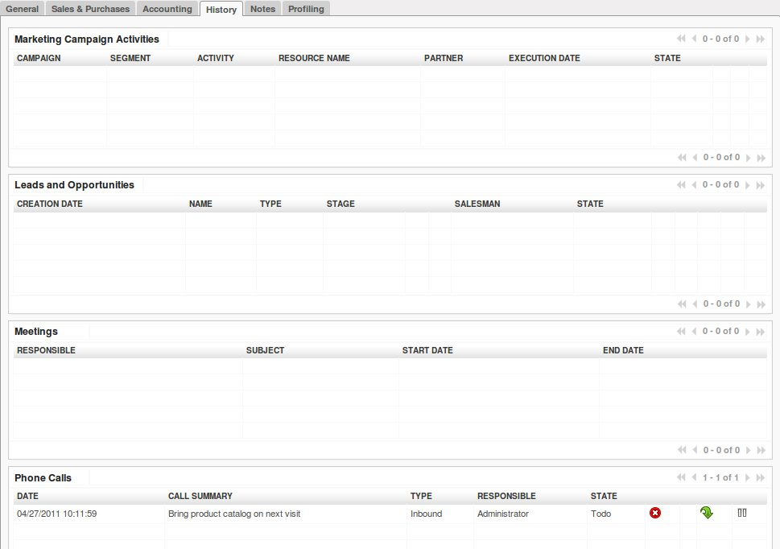
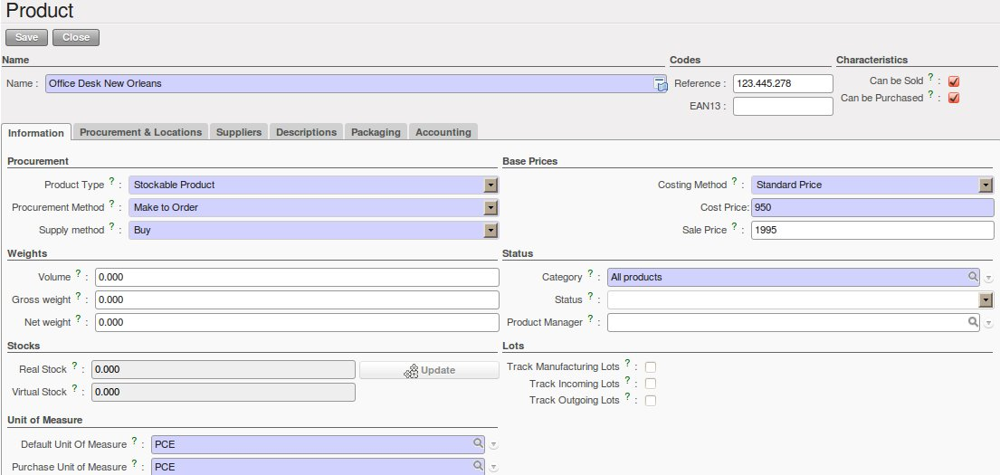
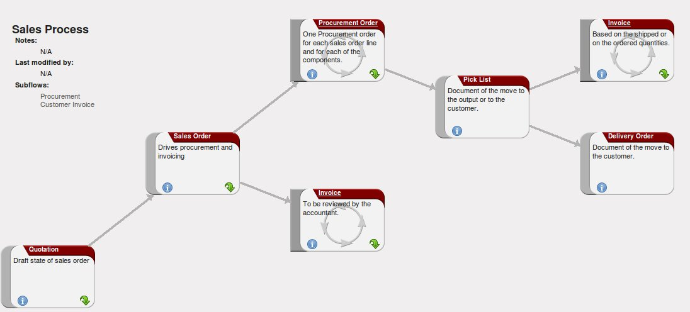

.. index::
   single: Leads
   single: Opportunities
   single: Campaigns
   single: Contacts
   single: Centralise
   single: Sales Stages
   single: Sales Cycle

.. _crm-flow:

Complete Example: from Lead to Sales Order
==========================================

In this chapter, we will show you a complete sales flow, from lead to opportunity to quotation to sales order in a step-by-step scenario.

First you will get an explanation about the use case (what Thomas or one of his colleagues is supposed to do). Then the *Notes* will learn you how Thomas (or a colleague of his) enters the information in OpenERP CRM. For the simplicity of the use case, we will do all of the steps under the Admin user.

.. tip:: Simplified or Extended View

        In OpenERP your user interface will look slightly different according to the User Preferences. In  ``Simplified`` view, the screens will only show the most important fields / tab pages. To see also the fields for the more advanced users, you should switch to the ``Extended`` view. You can easily switch from `Simplified` to `Extended` view by changing your `User Preferences` through the `Edit Preferences´ button. For this use case, please switch to ´Extended´ view.

1. Create a new campaign

Your company is exhibiting at the "House & Design" Fair in Paris and Thomas, a salesman of your company, meets lots of prospects during this event.
Because Luc, the Sales Manager, would like to know the return on investment from hiring a stand at this fair, he asks Thomas, who will be hosting this event, to make a "House & Design" campaign.

.. note:: Campaign

   To create a new campaign, Thomas goes to :menuselection:`Sales --> Configuration --> Sales --> Campaigns` and clicks the `New` button. In the `Campaign Name` field, he types *House & Design*. 

.. figure::  images/crm_campaign.png
   :align: center
   :scale: 80

   *Campaign*

2. Create and qualify a new lead

Thomas has to enter all contacts he met at the House & Design Fair as a new lead (contacts, prospects), assigning each individual lead to the "House & Design" campaign. He will start by adding a lead for Mr. John Doe of the *The Interior Design Company* who is interested in redecorating his office.

.. note:: Leads

   To create a new lead, Thomas goes to :menuselection:`Sales --> Leads` and clicks the `New` button. The subject of a lead is in blue, because it is a mandatory field, so Thomas enters *Potential interior design customer* in that field. He uses the `Notes` field to add more information about the lead. When saving the lead, it will be in Draft state. Thomas opens it for further follow-up. In the chapter :ref:`part2-crm-leads` you will find more details about lead creation. 

.. figure::  images/crm_lead.png
   :align: center
   :scale: 80

   *Example of a Lead*

To contact his leads after the Fair and check if any of them can be qualified as a business opportunity, Thomas would like to group his leads by the "House & Design" Campaign, to have an overview of all the leads generated through this campaign.

.. note:: Group by

   To group his leads by campaign, Thomas goes to :menuselection:`Sales --> Leads` and clicks the `Group by` list to show the buttons he can use. He clicks the `Campaign` button and notices that no lead is visible, but only the various campaigns. Each campaign has an arrow in front; he clicks the arrow to display all the leads for that campaign.

.. figure::  images/crm_groupby.jpeg
   :align: center
   :scale: 80

   *Leads grouped by Campaign*

3. Convert the lead into an opportunity and create a new customer

Because the lead for John Doe from *The Interior Design Company* looks promising, Thomas decides to convert it into an opportunity and at the same time add a new Customer to the company's address book. 

On the business opportunity, the salesman should provide more information, such as the estimated income. Thomas indicates that the expected revenue would be 5,000.00€, and that the success rate of the opportunity at this stage is 20%.

Thomas sets Luc, the sales manager, as the person responsible to follow up the opportunity. He also sets the date for the next action and describes that he has to call the potential customer to plan a meeting with Luc, the sales manager.

.. note:: Convert to Opportunity

   To convert the lead into an opportunity, Thomas goes to :menuselection:`Sales --> Sales --> Leads` and opens the lead concerned (there are various possibilities to quickly find the lead he needs). Thomas opens the lead and clicks the `Convert to Opportunity` button (he can also do this from the list of leads by clicking the Convert to Opportunity arrow of the lead concerned). OpenERP asks Thomas whether he wants to create a new partner. He confirms by clicking `Continue` to add the new potential customer to your company's address book. Then he clicks `Next` to convert the promising lead into an opportunity. In the `Expected Revenue` field, Thomas types 5,000.00€, and he enters a success rate of 20%. Thomas clicks the `Create Opportunity` button. As a `Next Action Date`, he sets tomorrow's date and in the `Next Action` field he types *Phone customer to plan meeting*.

.. tip:: Filters

        The `Advanced Search View` provides a very user-friendly filtering mechanism to easily look up desired records from the list.
Usually, a filter view is composed of three elements, the `Filter` buttons at the top, the `Extended Filters` and the `Group by` option.

        These filters are dynamic, so according to filters you apply, extra columns may be added to the view.
You can also easily combine filters; an arrow will be displayed and you will get a structure according to the order in which you clicked the `Filter` buttons.

       Simply by changing the order in which you select your buttons, you will get a completely different filtered view. E.g. select Salesman first, then Campaign or vice versa.

.. figure::  images/crm_convert_opport.png
   :align: center
   :scale: 80

   *Convert Lead to Opportunity*

4. Plan a meeting

One day later, Thomas contacts the prospect and convinces him to meet Luc so that the sales manager can give more information about the product range in view of a quotation.

Thomas plans a meeting for Luc. This meeting is organized next week with the customer and is related to the opportunity. He sets a reminder for Luc.

.. note:: Meeting
   
   Thomas goes to the list of opportunities through :menuselection:`Sales --> Sales --> Opportunities` to check his next actions. He opens the opportunity and contacts John Doe. He enters the key elements of his phone call in the ``Details`` field. To plan the meeting, Thomas clicks the `Schedule Meeting` button and clicks the `Week` button in the Calendar view. He uses the drag and drop function to schedule the meeting for Luc. He plans the meeting next week from 2 pm to 3 pm. He sets Luc as the person responsible and sets a reminder to be send 2 hours before the start of the meeting. He also changes the ``Next Action Date`` in the opportunity to the meeting date.

.. figure::  images/crm_meeting.png
   :align: center
   :scale: 80

   *Meeting Calendar*

5. Log an incoming phone call from the customer

.. figure::  images/crm_call.jpeg
   :align: center
   :scale: 80

   *Incoming (Inbound) Call*

A few days later, John Doe calls and Eric, the Product Manager, answers the phone. 
The customer asks Eric if Luc, the Sales Manager, can bring a product catalog when he comes to see him.

Eric enters a summary of the phone call as an inbound call, and links it to *The Interior Design Company*.

.. note:: Phone Calls

   Eric goes to :menuselection:`Sales --> Sales --> Phone Calls` and clicks `Inbound`, then `New` to start entering the call. The call can be entered in the line. In the ``Call Summary``, he enters *Bring product catalog on next visit* and assigns the call to  *The Interior Design Company*. He enters a summary of the phone call in the ``Description`` field so that Luc knows exactly what has been discussed.

.. tip:: Call Summary

        Eric can also click the Form view button to open the call form, so that he can add a summary of the phone call in the ``Description`` field to make sure that Luc knows exactly what has been discussed.

6. Check the history of the customer

To prepare his meeting with *The Interior Design Company*, Luc checks the related customer form to get the history of all related events.

.. note:: History

   Luc goes to :menuselection:`Sales --> Address Book --> Customers` and types *Interior* in the ``Name`` field and clicks `Search`. He clicks the customer to open the form. On the `History` tab, Luc gets an overview of all the events, such as meetings and phone calls. So he notices that he has to bring a product catalog to the meeting.

   *Customer History*

7. Convert the opportunity into a sales quotation

During the meeting, the customer *The Interior Design Company* finally asks to receive a quotation for an Office Desk and Chair. 
Luc generates the quotation directly from the business opportunity.

   *Product*

.. note:: Quotation & Products

   Luc opens the opportunity concerned from :menuselection:`Sales --> Sales --> Opportunities`. He clicks the `Convert to Quote` button, then `Create` to make a quotation that is automatically linked to the opportunity. Now he can enter the products he will be selling. Luc has to create a new product, because the desk ordered is a brand new product. From the sales order line, Luc presses the F1 button in the ``Product`` field to create a new product. He enters the data as specified in the screenshot. To print the quotation, he clicks `Quotation / Order` in the `Reports` section at the right side of the screen.  
   
8. Check the pipeline of revenues for the next months

Luc, the Sales Manager, would also like to check the quality of his sales team, and he would like to know the delay to close the opportunity. He would like to see the average closing time for the House & Design campaign.

.. note:: Average Closing Time 

   From the :menuselection:`Sales --> Reporting --> Opportunities Analysis`, Luc finds the average time taken to successfully respond to a request from a customer in the `Delay to Close` field. Instead of using the default grouping by salesman, Luc clicks the Salesman button in the Group by list to no longer group by salesman, and then he clicks the `Campaign` button to group by campaign.

9. Convert the quotation into a sales order

After some discussion about the prices, the customer decides to sign a contract. Luc confirms the quotation to turn it into a sales order.

.. note:: Sales Orders

   Luc opens the quotation concerned from :menuselection:`Sales --> Sales Orders`. He clicks the `Quotation` button to see no confirmed sales orders. He opens the quotation by clicking the pencil in front of it, and changes the prices. Then he clicks the `Confirm Order` button to turn the quotation into a sales order. To print the sales order, he clicks `Quotation / Order` in the `Reports` section at the right side of the screen.  

Below you find a graphical representation of the sales flow we explained before; the part from quotation to sales order. This view is available in OpenERP. You can open this `Process view` by clicking the question mark next to the `Sales Order` title.
 

   *From Quotation to Invoice*

Before going to the next chapter, just a quick word about the different View buttons in OpenERP. The screenshot below shows the kinds of buttons available. Each button represents a different way of looking at data.

.. figure:: images/view_buttons.png
   :scale: 100
   :align: center

   *View Buttons*

From the opportunities screen, Thomas will click the first `List` view button to get an overview of several opportunities at a time. When Thomas wants more information about a specific opportunity, he will switch to `Form` view. Then Thomas decides he wants to see the opportunities in a graphical representation, so he clicks the `Graph` (3rd) button to display a graph with the opportunities expressed according to Category versus Expected Revenue.
He could choose to display the opportunities in `Calendar` view.
Thomas wants to see his meetings in a bar chart representation, and so he clicks the `Gannt` view button.
To see a process representation of his marketing campaign, he clicks the `Diagram` view button.

Please note that this is just an explanation of the different view buttons.

.. Copyright © Open Object Press. All rights reserved.

.. You may take electronic copy of this publication and distribute it if you don't
.. change the content. You can also print a copy to be read by yourself only.

.. We have contracts with different publishers in different countries to sell and
.. distribute paper or electronic based versions of this book (translated or not)
.. in bookstores. This helps to distribute and promote the OpenERP product. It
.. also helps us to create incentives to pay contributors and authors using author
.. rights of these sales.

.. Due to this, grants to translate, modify or sell this book are strictly
.. forbidden, unless Tiny SPRL (representing Open Object Press) gives you a
.. written authorisation for this.

.. Many of the designations used by manufacturers and suppliers to distinguish their
.. products are claimed as trademarks. Where those designations appear in this book,
.. and Open Object Press was aware of a trademark claim, the designations have been
.. printed in initial capitals.

.. While every precaution has been taken in the preparation of this book, the publisher
.. and the authors assume no responsibility for errors or omissions, or for damages
.. resulting from the use of the information contained herein.

.. Published by Open Object Press, Grand Rosière, Belgium

