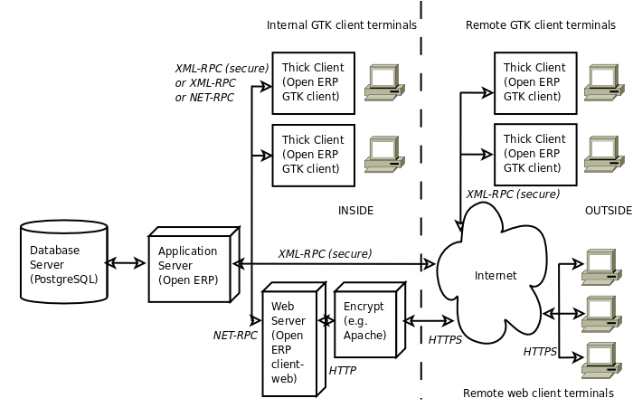

.. i18n: .. index::
.. i18n:    single: architecture; OpenERP
..

.. index::
   single: architecture; OpenERP

.. i18n: The Architecture of OpenERP
.. i18n: ===========================
..

The Architecture of OpenERP
===========================

.. i18n: To access OpenERP you can:
..

To access OpenERP you can:

.. i18n: * use a web browser pointed at the OpenERP client-web server, or
.. i18n: 
.. i18n: * use an application client (the GTK client) installed on each computer.
..

* use a web browser pointed at the OpenERP client-web server, or

* use an application client (the GTK client) installed on each computer.

.. i18n: The two methods of access give very similar facilities, and you can use both on
.. i18n: the same server at the same time. It is best to use the web browser if the
.. i18n: OpenERP server is some distance away (such as on another continent) because
.. i18n: it is more tolerant of time delays between the two than the GTK client is. The
.. i18n: web client is also easier to maintain, because it is generally already installed
.. i18n: on users' computers.
..

The two methods of access give very similar facilities, and you can use both on
the same server at the same time. It is best to use the web browser if the
OpenERP server is some distance away (such as on another continent) because
it is more tolerant of time delays between the two than the GTK client is. The
web client is also easier to maintain, because it is generally already installed
on users' computers.

.. i18n: Conversely you would be better off with the application client (called the GTK
.. i18n: client because of the technology it is built with) if you are using a local
.. i18n: server (such as in the same building). In this case the GTK client will be more
.. i18n: responsive, so more satisfying to use.
..

Conversely you would be better off with the application client (called the GTK
client because of the technology it is built with) if you are using a local
server (such as in the same building). In this case the GTK client will be more
responsive, so more satisfying to use.

.. i18n: .. index::
.. i18n:    single: client; web (thin) and GTK (thick)
.. i18n:    single: client; caching
..

.. index::
   single: client; web (thin) and GTK (thick)
   single: client; caching

.. i18n: .. note::   Web Client and GTK Client
.. i18n: 
.. i18n:     There is little functional difference between the two OpenERP clients - the 
.. i18n:     web client and the GTK client at present. 
.. i18n:     The web client offers more functionality, for instance, the Corporate Intelligence feature, and the Gantt view.
.. i18n:     
.. i18n:     When you are changing the structure of your OpenERP installation (adding and
.. i18n:     removing modules, perhaps changing labels), you might find the web client to be
.. i18n:     irritating because of its use of **caching**. 
.. i18n:     
.. i18n:     Caching speeds it all up by keeping a copy of data somewhere between the server 
.. i18n:     and your client, which is usually good. But you may 
.. i18n:     have made changes to your installation that you cannot immediately see in
.. i18n:     your browser. Many apparent faults are caused by this! The workaround is 
.. i18n:     to use the GTK client during development and implementation where possible.
.. i18n: 
.. i18n:     The OpenERP company will continue to support two clients for the foreseeable
.. i18n:     future, so you can use whichever client you prefer.
..

.. note::   Web Client and GTK Client

    There is little functional difference between the two OpenERP clients - the 
    web client and the GTK client at present. 
    The web client offers more functionality, for instance, the Corporate Intelligence feature, and the Gantt view.
    
    When you are changing the structure of your OpenERP installation (adding and
    removing modules, perhaps changing labels), you might find the web client to be
    irritating because of its use of **caching**. 
    
    Caching speeds it all up by keeping a copy of data somewhere between the server 
    and your client, which is usually good. But you may 
    have made changes to your installation that you cannot immediately see in
    your browser. Many apparent faults are caused by this! The workaround is 
    to use the GTK client during development and implementation where possible.

    The OpenERP company will continue to support two clients for the foreseeable
    future, so you can use whichever client you prefer.

.. i18n: An OpenERP system is formed from three main components:
..

An OpenERP system is formed from three main components:

.. i18n: * the PostgreSQL database server, which contains all of the databases, each of which contains all
.. i18n:   data and most elements of the OpenERP system configuration,
.. i18n: 
.. i18n: * the OpenERP application server, which contains all of the enterprise logic and ensures that
.. i18n:   OpenERP runs optimally,
.. i18n: 
.. i18n: * the web server, a separate application called the Open Object client-web, which enables you to
.. i18n:   connect to OpenERP from standard web browsers and is not needed when you connect using a GTK
.. i18n:   client.
..

* the PostgreSQL database server, which contains all of the databases, each of which contains all
  data and most elements of the OpenERP system configuration,

* the OpenERP application server, which contains all of the enterprise logic and ensures that
  OpenERP runs optimally,

* the web server, a separate application called the Open Object client-web, which enables you to
  connect to OpenERP from standard web browsers and is not needed when you connect using a GTK
  client.

.. i18n: .. figure:: images/terp_arch_1.png
.. i18n:    :align: center
.. i18n:    :scale: 90
.. i18n:    
.. i18n:    *The architecture of OpenERP*
..

   
   *The architecture of OpenERP*

.. i18n: .. note::   Terminology: Client-web – Server or Client?
.. i18n: 
.. i18n:     The client-web component can be thought of as a server or a client depending on
.. i18n:     your viewpoint.
.. i18n: 
.. i18n:     It acts as a web server to an end user connecting from a web browser, but
.. i18n:     it also acts as a client to the OpenERP application server just as a GTK
.. i18n:     application client does.
.. i18n: 
.. i18n:     So in this book its context will determine whether the client-web component is referred to as
.. i18n:     a server or a client.
..

.. note::   Terminology: Client-web – Server or Client?

    The client-web component can be thought of as a server or a client depending on
    your viewpoint.

    It acts as a web server to an end user connecting from a web browser, but
    it also acts as a client to the OpenERP application server just as a GTK
    application client does.

    So in this book its context will determine whether the client-web component is referred to as
    a server or a client.

.. i18n: .. index::
.. i18n:    pair: eTiny; client-web
..

.. index::
   pair: eTiny; client-web

.. i18n: .. note::   eTiny
.. i18n: 
.. i18n:     The web application used to be known as “eTiny”.
.. i18n:     Its name changed to “client-web” as Tiny ERP was renamed to OpenERP,
.. i18n:     but its characteristics have generally stayed the same.
..

.. note::   eTiny

    The web application used to be known as “eTiny”.
    Its name changed to “client-web” as Tiny ERP was renamed to OpenERP,
    but its characteristics have generally stayed the same.

.. i18n: .. index::
.. i18n:    single: PostgreSQL
..

.. index::
   single: PostgreSQL

.. i18n: .. note::   PostgreSQL, the relational and object database management system.
.. i18n: 
.. i18n:     It is a free and open-source high-performance system that compares well with other database
.. i18n:     management systems such as MySQL and FirebirdSQL (both free), Sybase, DB2
.. i18n:     and Microsoft SQL Server (all proprietary). It runs on all types of
.. i18n:     Operating System, from Unix/Linux to the various releases of Windows, via
.. i18n:     Mac OS X, Solaris, SunOS and BSD.
..

.. note::   PostgreSQL, the relational and object database management system.

    It is a free and open-source high-performance system that compares well with other database
    management systems such as MySQL and FirebirdSQL (both free), Sybase, DB2
    and Microsoft SQL Server (all proprietary). It runs on all types of
    Operating System, from Unix/Linux to the various releases of Windows, via
    Mac OS X, Solaris, SunOS and BSD.

.. i18n: These three components can be installed on the same server or can be
.. i18n: distributed onto separate computer servers, if performance considerations
.. i18n: require it.
..

These three components can be installed on the same server or can be
distributed onto separate computer servers, if performance considerations
require it.

.. i18n: If you choose to run only with GTK clients, you will not need the third component –
.. i18n: the client-web server – at all. In this case, OpenERP's GTK client must be installed
.. i18n: on the workstation of each OpenERP user in the company.
..

If you choose to run only with GTK clients, you will not need the third component –
the client-web server – at all. In this case, OpenERP's GTK client must be installed
on the workstation of each OpenERP user in the company.

.. i18n: .. Copyright © Open Object Press. All rights reserved.
..

.. Copyright © Open Object Press. All rights reserved.

.. i18n: .. You may take electronic copy of this publication and distribute it if you don't
.. i18n: .. change the content. You can also print a copy to be read by yourself only.
..

.. You may take electronic copy of this publication and distribute it if you don't
.. change the content. You can also print a copy to be read by yourself only.

.. i18n: .. We have contracts with different publishers in different countries to sell and
.. i18n: .. distribute paper or electronic based versions of this book (translated or not)
.. i18n: .. in bookstores. This helps to distribute and promote the OpenERP product. It
.. i18n: .. also helps us to create incentives to pay contributors and authors using author
.. i18n: .. rights of these sales.
..

.. We have contracts with different publishers in different countries to sell and
.. distribute paper or electronic based versions of this book (translated or not)
.. in bookstores. This helps to distribute and promote the OpenERP product. It
.. also helps us to create incentives to pay contributors and authors using author
.. rights of these sales.

.. i18n: .. Due to this, grants to translate, modify or sell this book are strictly
.. i18n: .. forbidden, unless Tiny SPRL (representing Open Object Press) gives you a
.. i18n: .. written authorisation for this.
..

.. Due to this, grants to translate, modify or sell this book are strictly
.. forbidden, unless Tiny SPRL (representing Open Object Press) gives you a
.. written authorisation for this.

.. i18n: .. Many of the designations used by manufacturers and suppliers to distinguish their
.. i18n: .. products are claimed as trademarks. Where those designations appear in this book,
.. i18n: .. and Open Object Press was aware of a trademark claim, the designations have been
.. i18n: .. printed in initial capitals.
..

.. Many of the designations used by manufacturers and suppliers to distinguish their
.. products are claimed as trademarks. Where those designations appear in this book,
.. and Open Object Press was aware of a trademark claim, the designations have been
.. printed in initial capitals.

.. i18n: .. While every precaution has been taken in the preparation of this book, the publisher
.. i18n: .. and the authors assume no responsibility for errors or omissions, or for damages
.. i18n: .. resulting from the use of the information contained herein.
..

.. While every precaution has been taken in the preparation of this book, the publisher
.. and the authors assume no responsibility for errors or omissions, or for damages
.. resulting from the use of the information contained herein.

.. i18n: .. Published by Open Object Press, Grand Rosière, Belgium
..

.. Published by Open Object Press, Grand Rosière, Belgium
