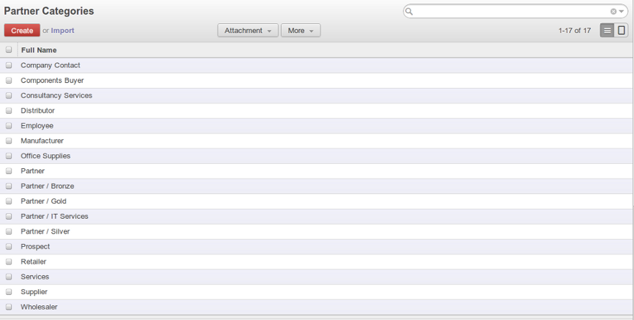

.. i18n: .. _part2-crm-cont:
.. i18n: 
.. i18n: Managing your Customers
.. i18n: =======================
..

.. _part2-crm-cont:

Managing your Customers
=======================

.. i18n: .. index::
.. i18n:    single: Partner
.. i18n:    single: Customer
.. i18n:    single: Prospect
.. i18n:    single: Contact
..

.. index::
   single: Partner
   single: Customer
   single: Prospect
   single: Contact

.. i18n: What is the difference between a partner (*company*) and a contact in OpenERP? A ``Partner`` represents an entity that you do business with - a customer, a prospect, or even an employee of your company. In other CRM applications, a partner (*company*) is also referred to as an Account.
.. i18n: A ``Contact`` represents a person who works for a partner.
..

What is the difference between a partner (*company*) and a contact in OpenERP? A ``Partner`` represents an entity that you do business with - a customer, a prospect, or even an employee of your company. In other CRM applications, a partner (*company*) is also referred to as an Account.
A ``Contact`` represents a person who works for a partner.

.. i18n: Each partner can have an unlimited number of contacts. OpenERP also allows you to have several contacts with the same address type for one partner. You can easily link several Invoice addresses to a customer, for instance. 
..

Each partner can have an unlimited number of contacts. OpenERP also allows you to have several contacts with the same address type for one partner. You can easily link several Invoice addresses to a customer, for instance. 

.. i18n: .. note:: Address Types
.. i18n: 
.. i18n: 	If you have recorded several contacts for the same partner (*company*), you can tell OpenERP which contact will be used in
.. i18n: 	various documents (e.g. a quotation) by specifying the ``Address Type``.
.. i18n: 
.. i18n: 	For example, a partner (*company*) can have a delivery address that differs from the company's invoice address.
.. i18n: 	If the Address Types are correctly assigned, OpenERP can automatically select the appropriate address
.. i18n: 	during the creation of the document – an invoice is addressed to the contact that has been assigned
.. i18n: 	the Address Type of Invoice, otherwise to the Default address.
..

.. note:: Address Types

	If you have recorded several contacts for the same partner (*company*), you can tell OpenERP which contact will be used in
	various documents (e.g. a quotation) by specifying the ``Address Type``.

	For example, a partner (*company*) can have a delivery address that differs from the company's invoice address.
	If the Address Types are correctly assigned, OpenERP can automatically select the appropriate address
	during the creation of the document – an invoice is addressed to the contact that has been assigned
	the Address Type of Invoice, otherwise to the Default address.

.. i18n: The concept of a partner in OpenERP is much more flexible than in many other management applications. Why is that? Because a partner can be your supplier and your customer at the same time.
.. i18n: As a consequence, any data you update for that partner will apply to both customer and supplier! Thanks to this, you no longer need to update your customer/supplier information several times (or even in several places) for the same partner.
..

The concept of a partner in OpenERP is much more flexible than in many other management applications. Why is that? Because a partner can be your supplier and your customer at the same time.
As a consequence, any data you update for that partner will apply to both customer and supplier! Thanks to this, you no longer need to update your customer/supplier information several times (or even in several places) for the same partner.

.. i18n: The partner form contains information about the company, such as its corporate name, its postal information, its communication information, its website and the categories the partner belongs to.
.. i18n: The partner form is composed of several tabs.
..

The partner form contains information about the company, such as its corporate name, its postal information, its communication information, its website and the categories the partner belongs to.
The partner form is composed of several tabs.

.. i18n: * the :guilabel:`Contact` tab contains information about different contacts of that partner (*company*).
.. i18n: 
.. i18n: * the :guilabel:`Sales & Purchases` tab contains information such as the default salesperson and sales team, whether the partner (*company*) is a \ ``Customer`` \ and/or a \ ``Supplier`` \ and its primary language.
.. i18n: 
.. i18n: * the :menuselection:`Internal Notes` tab is an area for free text notes.
..

* the :guilabel:`Contact` tab contains information about different contacts of that partner (*company*).

* the :guilabel:`Sales & Purchases` tab contains information such as the default salesperson and sales team, whether the partner (*company*) is a \ ``Customer`` \ and/or a \ ``Supplier`` \ and its primary language.

* the :menuselection:`Internal Notes` tab is an area for free text notes.

.. i18n: .. figure::  images/sales_purchases_tab.png
.. i18n:    :scale: 75
.. i18n:    :align: center
.. i18n: 
.. i18n:    *The Sales & Purchases of a Customer*
..

.. figure::  images/sales_purchases_tab.png
   :scale: 75
   :align: center

   *The Sales & Purchases of a Customer*

.. i18n: Creating and Updating Partners
.. i18n: ------------------------------
..

Creating and Updating Partners
------------------------------

.. i18n: Before explaining you how to create a partner, just a quick word on the different ways of representing partners in OpenERP.
.. i18n: `Kanban` view shows a global overview of customers (the default representation when you click the Customers menu).
.. i18n: `List` view shows a list of customers. In this view, you can see several customers at a time.
.. i18n: `Form` view is displayed when you click a specific customer to start editing or when you create a new customer.
..

Before explaining you how to create a partner, just a quick word on the different ways of representing partners in OpenERP.
`Kanban` view shows a global overview of customers (the default representation when you click the Customers menu).
`List` view shows a list of customers. In this view, you can see several customers at a time.
`Form` view is displayed when you click a specific customer to start editing or when you create a new customer.

.. i18n: To create a new partner (a company, customer, supplier, ...) use the menu Sales ‣ Customers(for customers) or the menu Purchases ‣ Suppliers (for suppliers). These menus does not only allow you to create a new partner, but also to search for partners.
..

To create a new partner (a company, customer, supplier, ...) use the menu Sales ‣ Customers(for customers) or the menu Purchases ‣ Suppliers (for suppliers). These menus does not only allow you to create a new partner, but also to search for partners.

.. i18n: .. figure::  images/crm_partner_default.png
.. i18n:    :scale: 75
.. i18n:    :align: center
.. i18n: 
.. i18n:    *A Customer Form*
..

.. figure::  images/crm_partner_default.png
   :scale: 75
   :align: center

   *A Customer Form*

.. i18n: .. note:: Mandatory 
.. i18n: 
.. i18n:         Blue fields are always mandatory, meaning that you have to enter a value there. It is impossible to save changes as long as a blue field is not completed.
..

.. note:: Mandatory 

        Blue fields are always mandatory, meaning that you have to enter a value there. It is impossible to save changes as long as a blue field is not completed.

.. i18n: You should at least enter the company's ``Name`` in the partner form. Some fields are text fields, other fields may be linked to existing data that have been entered elsewhere, such as ``Countries``. 
..

You should at least enter the company's ``Name`` in the partner form. Some fields are text fields, other fields may be linked to existing data that have been entered elsewhere, such as ``Countries``. 

.. i18n: Create a customer with the following data:
..

Create a customer with the following data:

.. i18n: * :guilabel:`Name` : \ ``Smith and Offspring``\ ,
.. i18n: 
.. i18n: * :guilabel:`Customer` checkbox : \ ``checked``\ , in the Sales & Purchases tab,
.. i18n: 
.. i18n: * :guilabel:`Supplier` checkbox : \ ``unchecked``\ , in the Sales & Purchases tab,
.. i18n: 
.. i18n: * :guilabel:`Contact Name` : \ ``Stephen Smith``\ , in the Contacts tab
.. i18n: 
.. i18n: * :guilabel:`Type` : \ ``Default``\,
.. i18n: 
.. i18n: * :guilabel:`Save` the form.
..

* :guilabel:`Name` : \ ``Smith and Offspring``\ ,

* :guilabel:`Customer` checkbox : \ ``checked``\ , in the Sales & Purchases tab,

* :guilabel:`Supplier` checkbox : \ ``unchecked``\ , in the Sales & Purchases tab,

* :guilabel:`Contact Name` : \ ``Stephen Smith``\ , in the Contacts tab

* :guilabel:`Type` : \ ``Default``\,

* :guilabel:`Save` the form.

.. i18n: .. tip:: Email
.. i18n: 
.. i18n:       If you use the email gateway, the Outlook or the Thunderbird plugin, do not forget to register an email addresses to each contact.
..

.. tip:: Email

      If you use the email gateway, the Outlook or the Thunderbird plugin, do not forget to register an email addresses to each contact.

.. i18n: To update a partner, open the corresponding form, select `Edit` and change the required fields. As explained before, when a company is both one of your customers and a supplier, you just have to edit the partner form once to have changes applied to both customer and supplier.
..

To update a partner, open the corresponding form, select `Edit` and change the required fields. As explained before, when a company is both one of your customers and a supplier, you just have to edit the partner form once to have changes applied to both customer and supplier.

.. i18n: .. note:: Checkboxes
.. i18n: 
.. i18n:        Why is it important for you to correctly set the Customer and Supplier checkboxes in the partner form? These checkboxes are designed to enable OpenERP to quickly select the partners who should be displayed in some drop-down boxes. An example: when you select a partner in a Sales Quotation, OpenERP will only allow you to select from the list of Customers. And that is precisely what the Customer checkbox is used for. 
..

.. note:: Checkboxes

       Why is it important for you to correctly set the Customer and Supplier checkboxes in the partner form? These checkboxes are designed to enable OpenERP to quickly select the partners who should be displayed in some drop-down boxes. An example: when you select a partner in a Sales Quotation, OpenERP will only allow you to select from the list of Customers. And that is precisely what the Customer checkbox is used for. 

.. i18n: .. index:: Contact; Address
..

.. index:: Contact; Address

.. i18n: Managing your Contacts
.. i18n: ----------------------
..

Managing your Contacts
----------------------

.. i18n: You can have several contacts for one partner. Contacts represent company employees that you are in
.. i18n: touch with, along with their address details. For each address you can indicate the type (\ ``Default``\, \ ``Invoice``\, \ ``Delivery``\, \ ``Contact``\   or \ ``Other``\).
..

You can have several contacts for one partner. Contacts represent company employees that you are in
touch with, along with their address details. For each address you can indicate the type (\ ``Default``\, \ ``Invoice``\, \ ``Delivery``\, \ ``Contact``\   or \ ``Other``\).

.. i18n: Contacts can be entered into the :guilabel:`Contacts` tab of the **Customer** form.
.. i18n: Or you can also create a new partner and assign a company on that partner which will make this partner as a contact on that partner (*company*). 
..

Contacts can be entered into the :guilabel:`Contacts` tab of the **Customer** form.
Or you can also create a new partner and assign a company on that partner which will make this partner as a contact on that partner (*company*). 

.. i18n: Customizing Partner Fields
.. i18n: --------------------------
..

Customizing Partner Fields
--------------------------

.. i18n: OpenERP also allows you to customize the ``Partner`` view to your needs. Click the `Manage Views` option if you want to add fields, delete fields or change the order of fields in a view.
..

OpenERP also allows you to customize the ``Partner`` view to your needs. Click the `Manage Views` option if you want to add fields, delete fields or change the order of fields in a view.

.. i18n: Let us add the ``Birthday`` field to a contact, in the `Customers` form view. To do so, click on the logged in user at top-right and select *About OpenERP* and then select *Activate the developer mode*.Now go to the :menuselection:`Sales -->
.. i18n: Customers` menu and open any customer in Form view.  Click on `Debug View#` and then select `Manage Views`, then `Edit` because the corresponding view will already be preselected.
..

Let us add the ``Birthday`` field to a contact, in the `Customers` form view. To do so, click on the logged in user at top-right and select *About OpenERP* and then select *Activate the developer mode*.Now go to the :menuselection:`Sales -->
Customers` menu and open any customer in Form view.  Click on `Debug View#` and then select `Manage Views`, then `Edit` because the corresponding view will already be preselected.

.. i18n: Go to the last line of the view and click the blue plus (+) sign to add a field to the `Contacts` view. Proceed as in the figure below, then click the `Update` button.
..

Go to the last line of the view and click the blue plus (+) sign to add a field to the `Contacts` view. Proceed as in the figure below, then click the `Update` button.

.. i18n: .. figure::  images/manage_views_addfield_small.jpeg
.. i18n:    :scale: 75
.. i18n:    :align: center
.. i18n: 
.. i18n:    *Add the Birthday Field for a Contact*
..

.. figure::  images/manage_views_addfield_small.jpeg
   :scale: 75
   :align: center

   *Add the Birthday Field for a Contact*

.. i18n: In the `Properties` screen that appears, click on the *New Field* through which you can change the label to ``Birthday`` in the ``String`` field. To indicate that a new field can be used in the corresponding search view, make sure to select ``Always Searchable``. Click the `Update` button to confirm your changes. Click `Preview` to see your result. The ``Birthday`` field will now appear in your *Customers form view --> Contacts tab --> Create/Open* any contact, ready to be used.
.. i18n: You can also customize the ``actions``.
..

In the `Properties` screen that appears, click on the *New Field* through which you can change the label to ``Birthday`` in the ``String`` field. To indicate that a new field can be used in the corresponding search view, make sure to select ``Always Searchable``. Click the `Update` button to confirm your changes. Click `Preview` to see your result. The ``Birthday`` field will now appear in your *Customers form view --> Contacts tab --> Create/Open* any contact, ready to be used.
You can also customize the ``actions``.

.. i18n: Performing Actions on Customers
.. i18n: -------------------------------
..

Performing Actions on Customers
-------------------------------

.. i18n: .. index::
.. i18n:    single: opportunity
.. i18n:    single: reminder
..

.. index::
   single: opportunity
   single: reminder

.. i18n: At the right side of the `Customers` form view, you will find group of buttons(\ ``Schedule a Meeting``\, \ ``Purchase Orders``\, \ ``Supplier Invoices``\, \ ``Quotations and Sales``\  etc) are available. You can perform actions(by clicking on the ``More`` at the top) and print reports(by clicking on the ``Print`` at the top) both from List and from Form view, List view allowing you to do actions for several partners at the same time.
.. i18n: You can also add an attachment.
..

At the right side of the `Customers` form view, you will find group of buttons(\ ``Schedule a Meeting``\, \ ``Purchase Orders``\, \ ``Supplier Invoices``\, \ ``Quotations and Sales``\  etc) are available. You can perform actions(by clicking on the ``More`` at the top) and print reports(by clicking on the ``Print`` at the top) both from List and from Form view, List view allowing you to do actions for several partners at the same time.
You can also add an attachment.

.. i18n: .. tip:: Actions
.. i18n: 
.. i18n:        To display the list of possible actions, just select one or more customers. 
..

.. tip:: Actions

       To display the list of possible actions, just select one or more customers. 

.. i18n: You can create a new opportunity for a customer, or start a mass mailing. Mass mailings will usually be started from list view, because you will select several partners at a time.
..

You can create a new opportunity for a customer, or start a mass mailing. Mass mailings will usually be started from list view, because you will select several partners at a time.

.. i18n: .. note:: Campaigns
.. i18n: 
.. i18n:         For mass mailings, you might prefer to use the Direct Marketing application, which offers great functionalities (please refer to chapter :ref:`part3-crm-market`).
..

.. note:: Campaigns

        For mass mailings, you might prefer to use the Direct Marketing application, which offers great functionalities (please refer to chapter :ref:`part3-crm-market`).

.. i18n: .. index:: Filter
..

.. index:: Filter

.. i18n: Finding your Partners using Filters
.. i18n: -----------------------------------
..

Finding your Partners using Filters
-----------------------------------

.. i18n: Open the `Customers` list view to discover the search options(top-right) allowing you to easily filter your partners.You can group by ``Salesman`` to see which customers have already been assigned a salesman or not.And can also group by ``Company``. You can filter by *Persons* to see the customers you are responsible for.
.. i18n: You can also filter by *My Partners*, *Companies*, *Customers* and *Suppliers*.
..

Open the `Customers` list view to discover the search options(top-right) allowing you to easily filter your partners.You can group by ``Salesman`` to see which customers have already been assigned a salesman or not.And can also group by ``Company``. You can filter by *Persons* to see the customers you are responsible for.
You can also filter by *My Partners*, *Companies*, *Customers* and *Suppliers*.

.. i18n: .. tip:: Limit
.. i18n: 
.. i18n:        If you want to display more than 80 partners displayed by default, click the ``1 to 80 of 80`` option at the top of the screen to be able to change the limit.
..

.. tip:: Limit

       If you want to display more than 80 partners displayed by default, click the ``1 to 80 of 80`` option at the top of the screen to be able to change the limit.

.. i18n: Filters also allow you to quickly set lists of customers for which you want to do specific actions. Through the ``New Filter`` option, you can also add your own filters for any field related to the ``Customer`` form.
..

Filters also allow you to quickly set lists of customers for which you want to do specific actions. Through the ``New Filter`` option, you can also add your own filters for any field related to the ``Customer`` form.

.. i18n: .. note:: Filters
.. i18n:         
.. i18n:        You can easily create your own frequently used filters by prefiltering the data the way you want and then using the Save Filter option.
..

.. note:: Filters
        
       You can easily create your own frequently used filters by prefiltering the data the way you want and then using the Save Filter option.

.. i18n: .. _partner-categ:
.. i18n: 
.. i18n: Categorizing your Partners
.. i18n: --------------------------
..

.. _partner-categ:

Categorizing your Partners
--------------------------

.. i18n: .. index::
.. i18n:    pair: partner; category
..

.. index::
   pair: partner; category

.. i18n: OpenERP uses categories to organize all of its partners according to their relationship with your company (partner, prospect, supplier, and so on). Each partner may be attached to several categories. To open the list of available partner categories, use the menu :menuselection:`Sales --> Configuration --> Address Book --> Partner Categories`.
..

OpenERP uses categories to organize all of its partners according to their relationship with your company (partner, prospect, supplier, and so on). Each partner may be attached to several categories. To open the list of available partner categories, use the menu :menuselection:`Sales --> Configuration --> Address Book --> Partner Categories`.

.. i18n: .. figure::  images/crm_partner_category_big.png
.. i18n:    :scale: 75
.. i18n:    :align: center
.. i18n: 
.. i18n:    *List of Partner Categories*
..

   *List of Partner Categories*

.. i18n: .. note:: Categories
.. i18n: 
.. i18n:         To create a new category, go to the menu :menuselection:`Sales --> Configuration --> Address Book --> Partner Categories` and click the `New` button.
..

.. note:: Categories

        To create a new category, go to the menu :menuselection:`Sales --> Configuration --> Address Book --> Partner Categories` and click the `New` button.

.. i18n: Because categories can be organized according to a tree structure, you can apply an action at any level of
.. i18n: the structure: a marketing promotion activity, for example, can be applied either to all customers,
.. i18n: or selectively only to customers in one category and its subcategories.
..

Because categories can be organized according to a tree structure, you can apply an action at any level of
the structure: a marketing promotion activity, for example, can be applied either to all customers,
or selectively only to customers in one category and its subcategories.

.. i18n: You can create your own categories and assign them to your partner from the `Customer` form.
..

You can create your own categories and assign them to your partner from the `Customer` form.

.. i18n: .. Copyright © Open Object Press. All rights reserved.
..

.. Copyright © Open Object Press. All rights reserved.

.. i18n: .. You may take electronic copy of this publication and distribute it if you don't
.. i18n: .. change the content. You can also print a copy to be read by yourself only.
..

.. You may take electronic copy of this publication and distribute it if you don't
.. change the content. You can also print a copy to be read by yourself only.

.. i18n: .. We have contracts with different publishers in different countries to sell and
.. i18n: .. distribute paper or electronic based versions of this book (translated or not)
.. i18n: .. in bookstores. This helps to distribute and promote the OpenERP product. It
.. i18n: .. also helps us to create incentives to pay contributors and authors using author
.. i18n: .. rights of these sales.
..

.. We have contracts with different publishers in different countries to sell and
.. distribute paper or electronic based versions of this book (translated or not)
.. in bookstores. This helps to distribute and promote the OpenERP product. It
.. also helps us to create incentives to pay contributors and authors using author
.. rights of these sales.

.. i18n: .. Due to this, grants to translate, modify or sell this book are strictly
.. i18n: .. forbidden, unless Tiny SPRL (representing Open Object Press) gives you a
.. i18n: .. written authorisation for this.
..

.. Due to this, grants to translate, modify or sell this book are strictly
.. forbidden, unless Tiny SPRL (representing Open Object Press) gives you a
.. written authorisation for this.

.. i18n: .. Many of the designations used by manufacturers and suppliers to distinguish their
.. i18n: .. products are claimed as trademarks. Where those designations appear in this book,
.. i18n: .. and Open Object Press was aware of a trademark claim, the designations have been
.. i18n: .. printed in initial capitals.
..

.. Many of the designations used by manufacturers and suppliers to distinguish their
.. products are claimed as trademarks. Where those designations appear in this book,
.. and Open Object Press was aware of a trademark claim, the designations have been
.. printed in initial capitals.

.. i18n: .. While every precaution has been taken in the preparation of this book, the publisher
.. i18n: .. and the authors assume no responsibility for errors or omissions, or for damages
.. i18n: .. resulting from the use of the information contained herein.
..

.. While every precaution has been taken in the preparation of this book, the publisher
.. and the authors assume no responsibility for errors or omissions, or for damages
.. resulting from the use of the information contained herein.

.. i18n: .. Published by Open Object Press, Grand Rosière, Belgium
..

.. Published by Open Object Press, Grand Rosière, Belgium
